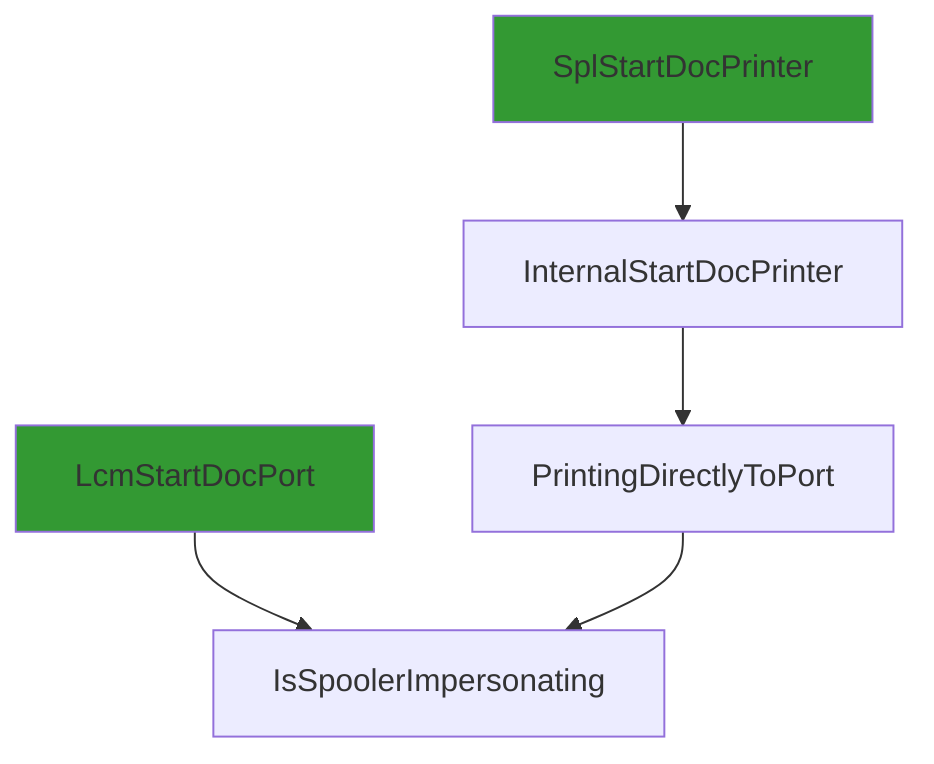
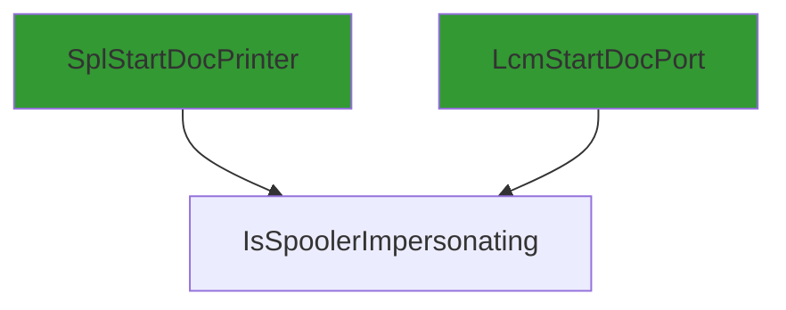

# IsSpoolerImpersonating

## Calling

Functions that call `IsSpoolerImpersonating`.

### Flowchart 

[Edit on mermaid live](https://mermaid.live/edit#pako:eNptkDFPw0AMhf_K6VipBA1LMzCFoRJISOkEx2DdOc2Ju3PkOEJV1f-OmwY6wPre52c_H62ngLY2tkv05XtgMbvGFZ9gHBvszNhDwGC6mFJ9U1WbTVW58vDubDukVhRvyL9yLILs7Edd18vAavVolLxT8tnnX5JY_mD3ymzHdiBKyNs8II9UQGLZK-rKWu15gwpNZPSSDjtaki4BrlTnjPMRBf45a6bWrthbYzNyhhi08tFKj3kuH4A_7UndaQgg-BSiEKshPKGqMAm1h-KvyoVrIuwZ8lXGefBleen8WlUHKG9EP9jpG45XfOs=)



### Entrypoints

A condensed view, showing only entrypoints to the callgraph.



### Mindmap

[Edit calling Mindmap](https://mermaid.live/edit#pako:eNpFj7EOgzAMRH8lygRSv6AzHRgqIdGpYrESi0YldmTMgBD_3jQtwuO7O51vs4492quxMZCPkAYSZq2qdu4T84TSxoQyM4EGGut6IFOuk0Bf0gRBp9P64I5FD9WYlhSFYOoVRBt2xY8ykL3kLpQIwefazeoLY3nAg7ztntUleVC8-aAsWVBZMFNYlPuV3El-vibAKBBPjCV4_88q8zJNQE_mw7Z_AG1EVBM=)

## Called

Functions that `IsSpoolerImpersonating` calls

### Flowchart

[Edit on mermaid live](https://mermaid.live/edit#pako:eNqlWGuP4jYU_SuIfuiXUpEXL1UrsSEMUXkpZhZtS0U9iYF0gp06Ydjtave3148EkuCZDe0nkB2ur88959wbvjR9EqDmoNHcReTsHyBNG1Nvg_0IJskI7RrJAQYoaOzCKBr8YBj9vmFscLvRar1raMbvm-Zw6bZmoLV25y174TmtpbewHQBWE88ZjkBrqrW0Vvvn0XQ6GDyg1D5RinC6pMRHSbJp_jEYDOQJedAuiwmWi8UUAPmrURQNo4j4II5m6Kj6SZ_9ZL1cbsF4G7D9DdZ0sa7rivzsxayUlE0ecYjDNIRR-A8qh9c68p5mYc0wxFpHY7HHj_Ot1mu3LevJ6ImTdblrdhQng49ze1I6G6DUeWFwqC6lK3AYU4RUMBgyT7NbzF1ioHWu4AAgcuzIHZYx1rMLtovB5LZl1bqCTRFMkbjFupKUjNNpK-JIdvDb8WB6OdjqwD6CmJBoFR4RrUS1ZHaFJTPDnCc8Ax9sbyWjHSGnTQVb9oybAB4cUfcYI5oQDNMQ79lzEov7OL2IEc7YvCLPCFcI1Jep8WJufZYPRueDKEJess5tGTtvkucCFogQiivHZbw3-S0Zp5cU7RCdnaI0TAWoqKQPg-v3MQ4Y5pK8psRWqyUb9yIa51M5Db1_K5s8tW6t2JIILk5SiP2KKDMBan3GZO3C5Jy1PS4bjozgjs0gf4L-c8kV-K2nCL5wKQEhpSsinB8eSlBaXNW4wRDGFZgSumUllBWUOrV4uD9fkM_3ApSk9CS-hql8_kepuQwR9ux8xS4pL-qk5xWFPpox9sA9UtmAcT8dpX4UbMz5VU_ZaximY0IB00aEFk9_sRsq2WZotcJd6WJT9o2JAbCIIcFDHIA4xDY5YfUBGq_pdn-CNNh-2u23QZjEMPUPWx4k2mISl8rL1cM6zRQmqUMpocNkDMNo4pX8ua_I2fG8hTcZzkdTd_5Q9elLOCWkVtF5FezPke_WgkoQUNEY8uS793FiFSUMjw8wOiG1XfSLLaLkEBqnCkgp44D9ZJP481pNAbMQoWwxPMA3m8AIJT4Kcs9iiJi3KGX3K3UjU8YxzYq5F930tukoG1q_fiNiBX-7C3UzZm6wpV--ZgeZPcXhnf86Ksk83EBNhV4tQgm3q8hOLTVOrRc-ZogiZWMe715LxgHmaHOCPbRn2U2YGs-QIrc8cfF8Vh7aLVPKXP0X6YZb930YhB76-8Ts8Z1SQOWCZV2zXan5TuZ145Hm_8O2gkQ36ylFzw9QhLImafTkPmfTLgcq7-a920mlY9Qq0Uic8GaN8obDy_Ht-yBfNci55_Dq3TY8Xavq6uwnoX-MlbKy6vmXOOvNq1jGRTR5IlatwWAFk2c2_o5vmJCHaQvDgukpGVNynDArZdNP5VFZQVO7tpVyS1FxrCI04NiPnrv62Ho_BE65zyVrFEW_YnLGIAzUc3q_CEXv1UHQaivoZN4xTkck-c40nb3M6IWXGW2HLLPEn25hwvEJfmXEycxCqwsUk6GYUVy8I_QIFZ6U2QAX0GWWv2bFc-YzSuHwwrtOMaX2Xc3-4dVmn42bHf0qCLMWa7NRSgzicYQmEAesHyod3Wrf3dyBsrlnbsFn48w3FIEFAOWyCNLIDJVc4QGbPzWajEtHGAbNQeNLMz2go_gPIYD0ufmV7Z7EW4UThIwebIMxBrFVeEoJ-Iz964p8bhTCPYXH6zISP5xl_0yIfyjYagzxb4Tkj339F3Rh-aE=)

```mermaid
flowchart LR
classDef shaded fill:#339933
0 --> 13["API-MS-WIN-CORE-PROCESSTHREADS-L1-1-0.DLL::GetCurrentProcess"]:::shaded
0 --> 7["SPOOLSS.DLL::DllAllocSplMem"]:::shaded
0 --> 9["WPP_SF_d"]
12 --> 22["API-MS-WIN-CORE-COM-L1-1-0.DLL::CoUninitialize"]:::shaded
16 --> 14:::shaded
33 --> 61["FUN_180055b38"]
23 --> 46["API-MS-WIN-CORE-SYNCH-L1-1-0.DLL::SetEvent"]:::shaded
0 --> 2["SPOOLSS.DLL::DllFreeSplMem"]:::shaded
36 --> 47:::shaded
12 --> 16["WPP_SF_SS"]
62 --> 38
26 --> 10:::shaded
32 --> 55["API-MS-WIN-CORE-SYNCH-L1-1-0.DLL::CreateEventW"]:::shaded
32 --> 60["API-MS-WIN-CORE-THREADPOOL-L1-2-0.DLL::CreateThreadpoolTimer"]:::shaded
35 --> 5:::shaded
43 --> 45["MSVCRT.DLL::malloc"]:::shaded
0["IsSpoolerImpersonating"] --> 1["API-MS-WIN-CORE-PROCESSTHREADS-L1-1-0.DLL::OpenProcessToken"]:::shaded
19 --> 42["_callnewh"]
36 --> 46:::shaded
36 --> 66["API-MS-WIN-CORE-SYNCH-L1-2-0.DLL::Sleep"]:::shaded
12 --> 24["InitPreferMultithreaded"]
12 --> 33["Update"]
24 --> 51["API-MS-WIN-CORE-COM-L1-1-0.DLL::CoInitializeEx"]:::shaded
29 --> 14:::shaded
12 --> 27["API-MS-WIN-CORE-COM-L1-1-0.DLL::CoCreateInstance"]:::shaded
33 --> 19
61 --> 38
32 --> 58["SleepTimerCallback"]
12 --> 23["LeaveSplSem"]
12 --> 30["Reset"]
12 --> 19["operator_new"]
30 --> 53["`vector_destructor_iterator'"]
6 --> 14["NTDLL.DLL::EtwTraceMessage"]:::shaded
0 --> 3["API-MS-WIN-CORE-PROCESSTHREADS-L1-1-0.DLL::OpenThreadToken"]:::shaded
36 --> 65["API-MS-WIN-CORE-SYNCH-L1-1-0.DLL::WaitForSingleObject"]:::shaded
12 --> 31["API-MS-WIN-CORE-SYNCH-L1-1-0.DLL::InitializeCriticalSectionAndSpinCount"]:::shaded
12 --> 18["_guard_xfg_dispatch_icall_nop"]
12 --> 26["GetLastErrorAsFailHR"]
23 --> 49["API-MS-WIN-CORE-ERRORHANDLING-L1-1-0.DLL::SetLastError"]:::shaded
36 --> 57:::shaded
9 --> 14:::shaded
36 --> 67["API-MS-WIN-CORE-SYNCH-L1-1-0.DLL::ResetEvent"]:::shaded
23 --> 47["API-MS-WIN-CORE-PROCESSTHREADS-L1-1-0.DLL::TlsGetValue"]:::shaded
12 --> 29["WPP_SF_SSd"]
12 --> 15["StringCbCopyW"]:::shaded
12 --> 34["WPP_SF_Sd"]
12 --> 35["~CoalescedSleep"]
34 --> 14:::shaded
23 --> 10:::shaded
42 --> 44["MSVCRT.DLL::_callnewh"]:::shaded
32 --> 10:::shaded
32 --> 59["API-MS-WIN-CORE-THREADPOOL-L1-2-0.DLL::SetThreadpoolTimer"]:::shaded
37 --> 18
52 --> 18
32 --> 48:::shaded
32 --> 56["API-MS-WIN-CORE-PROCESSTHREADS-L1-1-0.DLL::GetCurrentThreadId"]:::shaded
23 --> 48["API-MS-WIN-CORE-SYNCH-L1-1-0.DLL::LeaveCriticalSection"]:::shaded
12 --> 17["vFree"]
0 --> 12["PrinterNonRegGetHardwareId"]
12 --> 28["TRefPtrCOM<struct_IBidiRequest>"]:::shaded
36 --> 10:::shaded
39 --> 40["MSVCRT.DLL::free"]:::shaded
0 --> 4["API-MS-WIN-CORE-PROCESSTHREADS-L1-1-0.DLL::GetCurrentThread"]:::shaded
17 --> 38["operator_delete"]
38 --> 39["free"]
36 --> 48:::shaded
35 --> 63["API-MS-WIN-CORE-SYNCH-L1-1-0.DLL::DeleteCriticalSection"]:::shaded
30 --> 52["~TRefPtrCOM<struct_IBidiRequest>"]
12 --> 36["EnterSplSem"]
12 --> 21["MSVCRT.DLL::_wcsicmp"]:::shaded
32 --> 57["API-MS-WIN-CORE-SYNCH-L1-1-0.DLL::EnterCriticalSection"]:::shaded
53 --> 18
12 --> 25["API-MS-WIN-CORE-COM-L1-1-0.DLL::CoTaskMemFree"]:::shaded
12 --> 20["StatusFromHResult"]:::shaded
18 --> 41["_guard_dispatch_icall"]:::shaded
0 --> 8["API-MS-WIN-SECURITY-BASE-L1-1-0.DLL::IsWellKnownSid"]:::shaded
36 --> 49:::shaded
58 --> 46:::shaded
36 --> 50:::shaded
35 --> 64["API-MS-WIN-CORE-THREADPOOL-L1-2-0.DLL::CloseThreadpoolTimer"]:::shaded
33 --> 62["FUN_18001fe54"]
12 --> 37["`vector_constructor_iterator'"]
0 --> 11["API-MS-WIN-SECURITY-BASE-L1-1-0.DLL::GetTokenInformation"]:::shaded
19 --> 43["malloc"]
12 --> 32["Wait"]
0 --> 6["WPP_SF_"]
0 --> 10["API-MS-WIN-CORE-ERRORHANDLING-L1-1-0.DLL::GetLastError"]:::shaded
61 --> 62
32 --> 54["API-MS-WIN-CORE-COM-L1-1-0.DLL::CoWaitForMultipleHandles"]:::shaded
23 --> 50["API-MS-WIN-CORE-PROCESSTHREADS-L1-1-0.DLL::TlsSetValue"]:::shaded
30 --> 38
0 --> 5["API-MS-WIN-CORE-HANDLE-L1-1-0.DLL::CloseHandle"]:::shaded
33 --> 38

```

### Endpoints

A condensed view, showing only endpoints of the callgraph.

```mermaid
flowchart LR
classDef shaded fill:#339933
root["IsSpoolerImpersonating"] --> 35["API-MS-WIN-CORE-SYNCH-L1-1-0.DLL::EnterCriticalSection"]:::shaded
root["IsSpoolerImpersonating"] --> 19["API-MS-WIN-CORE-PROCESSTHREADS-L1-1-0.DLL::TlsGetValue"]:::shaded
root["IsSpoolerImpersonating"] --> 18["API-MS-WIN-CORE-THREADPOOL-L1-2-0.DLL::SetThreadpoolTimer"]:::shaded
root["IsSpoolerImpersonating"] --> 5["SPOOLSS.DLL::DllAllocSplMem"]:::shaded
root["IsSpoolerImpersonating"] --> 24["API-MS-WIN-CORE-ERRORHANDLING-L1-1-0.DLL::SetLastError"]:::shaded
root["IsSpoolerImpersonating"] --> 20["API-MS-WIN-CORE-SYNCH-L1-2-0.DLL::Sleep"]:::shaded
root["IsSpoolerImpersonating"] --> 29["API-MS-WIN-SECURITY-BASE-L1-1-0.DLL::GetTokenInformation"]:::shaded
root["IsSpoolerImpersonating"] --> 16["API-MS-WIN-CORE-PROCESSTHREADS-L1-1-0.DLL::GetCurrentThread"]:::shaded
root["IsSpoolerImpersonating"] --> 14["API-MS-WIN-CORE-COM-L1-1-0.DLL::CoWaitForMultipleHandles"]:::shaded
root["IsSpoolerImpersonating"] --> 25["StatusFromHResult"]:::shaded
root["IsSpoolerImpersonating"] --> 36["API-MS-WIN-CORE-COM-L1-1-0.DLL::CoCreateInstance"]:::shaded
root["IsSpoolerImpersonating"] --> 39["StringCbCopyW"]:::shaded
root["IsSpoolerImpersonating"] --> 15["API-MS-WIN-CORE-SYNCH-L1-1-0.DLL::SetEvent"]:::shaded
root["IsSpoolerImpersonating"] --> 12["API-MS-WIN-CORE-PROCESSTHREADS-L1-1-0.DLL::OpenThreadToken"]:::shaded
root["IsSpoolerImpersonating"] --> 34["API-MS-WIN-CORE-SYNCH-L1-1-0.DLL::CreateEventW"]:::shaded
root["IsSpoolerImpersonating"] --> 11["_guard_dispatch_icall"]:::shaded
root["IsSpoolerImpersonating"] --> 31["API-MS-WIN-CORE-SYNCH-L1-1-0.DLL::LeaveCriticalSection"]:::shaded
root["IsSpoolerImpersonating"] --> 21["API-MS-WIN-CORE-COM-L1-1-0.DLL::CoInitializeEx"]:::shaded
root["IsSpoolerImpersonating"] --> 38["API-MS-WIN-CORE-PROCESSTHREADS-L1-1-0.DLL::GetCurrentProcess"]:::shaded
root["IsSpoolerImpersonating"] --> 33["API-MS-WIN-CORE-HANDLE-L1-1-0.DLL::CloseHandle"]:::shaded
root["IsSpoolerImpersonating"] --> 37["API-MS-WIN-CORE-SYNCH-L1-1-0.DLL::WaitForSingleObject"]:::shaded
root["IsSpoolerImpersonating"] --> 28["API-MS-WIN-CORE-SYNCH-L1-1-0.DLL::InitializeCriticalSectionAndSpinCount"]:::shaded
root["IsSpoolerImpersonating"] --> 8["API-MS-WIN-CORE-COM-L1-1-0.DLL::CoTaskMemFree"]:::shaded
root["IsSpoolerImpersonating"] --> 17["SPOOLSS.DLL::DllFreeSplMem"]:::shaded
root["IsSpoolerImpersonating"] --> 10["API-MS-WIN-CORE-SYNCH-L1-1-0.DLL::ResetEvent"]:::shaded
root["IsSpoolerImpersonating"] --> 22["API-MS-WIN-CORE-COM-L1-1-0.DLL::CoUninitialize"]:::shaded
root["IsSpoolerImpersonating"] --> 13["TRefPtrCOM<struct_IBidiRequest>"]:::shaded
root["IsSpoolerImpersonating"] --> 26["API-MS-WIN-CORE-THREADPOOL-L1-2-0.DLL::CloseThreadpoolTimer"]:::shaded
root["IsSpoolerImpersonating"] --> 32["API-MS-WIN-CORE-SYNCH-L1-1-0.DLL::DeleteCriticalSection"]:::shaded
root["IsSpoolerImpersonating"] --> 6["API-MS-WIN-CORE-PROCESSTHREADS-L1-1-0.DLL::OpenProcessToken"]:::shaded
root["IsSpoolerImpersonating"] --> 23["MSVCRT.DLL::_wcsicmp"]:::shaded
root["IsSpoolerImpersonating"] --> 9["API-MS-WIN-CORE-ERRORHANDLING-L1-1-0.DLL::GetLastError"]:::shaded
root["IsSpoolerImpersonating"] --> 27["MSVCRT.DLL::free"]:::shaded
root["IsSpoolerImpersonating"] --> 30["MSVCRT.DLL::_callnewh"]:::shaded
root["IsSpoolerImpersonating"] --> 0["API-MS-WIN-SECURITY-BASE-L1-1-0.DLL::IsWellKnownSid"]:::shaded
root["IsSpoolerImpersonating"] --> 7["MSVCRT.DLL::malloc"]:::shaded
root["IsSpoolerImpersonating"] --> 4["API-MS-WIN-CORE-THREADPOOL-L1-2-0.DLL::CreateThreadpoolTimer"]:::shaded
root["IsSpoolerImpersonating"] --> 3["NTDLL.DLL::EtwTraceMessage"]:::shaded
root["IsSpoolerImpersonating"] --> 2["API-MS-WIN-CORE-PROCESSTHREADS-L1-1-0.DLL::GetCurrentThreadId"]:::shaded
root["IsSpoolerImpersonating"] --> 1["API-MS-WIN-CORE-PROCESSTHREADS-L1-1-0.DLL::TlsSetValue"]:::shaded

```



### Mindmap

![Edit called Mindmap](https://mermaid.live/edit#pako:eNq1V21v2jAQ_iuIL2ulMZVtlaZqmsRCKJF4U5wWbaqUmfigXhM7sx3armp_-46EECijIX1BKqrO9-a757kzd_VAMqif1OoRFyyi8YVQUpqDA0eTWMoQlBPFoLQU1HAxOzy8ELX0M_Davd4H_Ds5sc21p2gAfdCaziDXIEahhTWxZHw7zoXj0cgnHZ-QXDDvKFiZ1GoSg1Ejlc8gBLM68GcJVcy_mc58xnVMTXDp84CGoS9kXFgv1TZV8uOVawHXayYLFZRcFqIIJTIorkFNojtKRl0XdBKa_KBPzi3Xy0rgXweaB9EqldbIafRJY-wMGtbQtfGr3-g1G83GUaZvyTPBBTechvzv6pY9oHMgcUggKrJ57Ir8GFjdDWcEjD0HYXbb2K47dLutQbvnDE43bE_B9Kg2tlJS7bYfuUPLJsTrunarTTYceKFGH-c0TKBKzulVLYUVwPoTCAyX4jn5k1fInzzK38HGjBRMQfWx3dxcKqAM2G732911Vr21b_bHhEf1VR-idUas96elO5SHXfe1-lyekIU3N-AIbagIVjl5LkxHRqH6V21UEhjf-c4Zd-FPAtp826L6WuXKpwZyDNaQ_LBnsFrt1xxRlA6OTA__5SZj_LvS-VIO2KKjj1DbEozEXFgyKRg4pvwN2bjdp0W8jszgGofQpYKFoN-Oj9v2GVLSMTR-Fg_x6laiFNp7Kd8cViW8LbDVO9MnIUDs8QhVcLRPaHC123eW22g47C0CfFybM1lei6WYuqrsIivRDi9nMaPmf3twY1l1zgZ-88vR0fHx5NOXbXFzCsefS7Ge87ISLR8sSRFSAbC0mFV6006j742tlBj2JrhCqZegrl71he2OoqeoKdu3L2Xrc_b1S_n5-vt6OWEIvuhCGE5-YwZ7mBf0eRo0L93vVQdCuX26hkq6VO1Vke-nQIqnFlTJS7f-Hl_qoCLKGT7a7-rmEqL0-c6ouqrf42mSThKbcfSLBxgKUEoTI8mtCApJptfmdKZoVIghNewvfxSkPw5QGlPxU8pc7f4fNj-TFw==)

