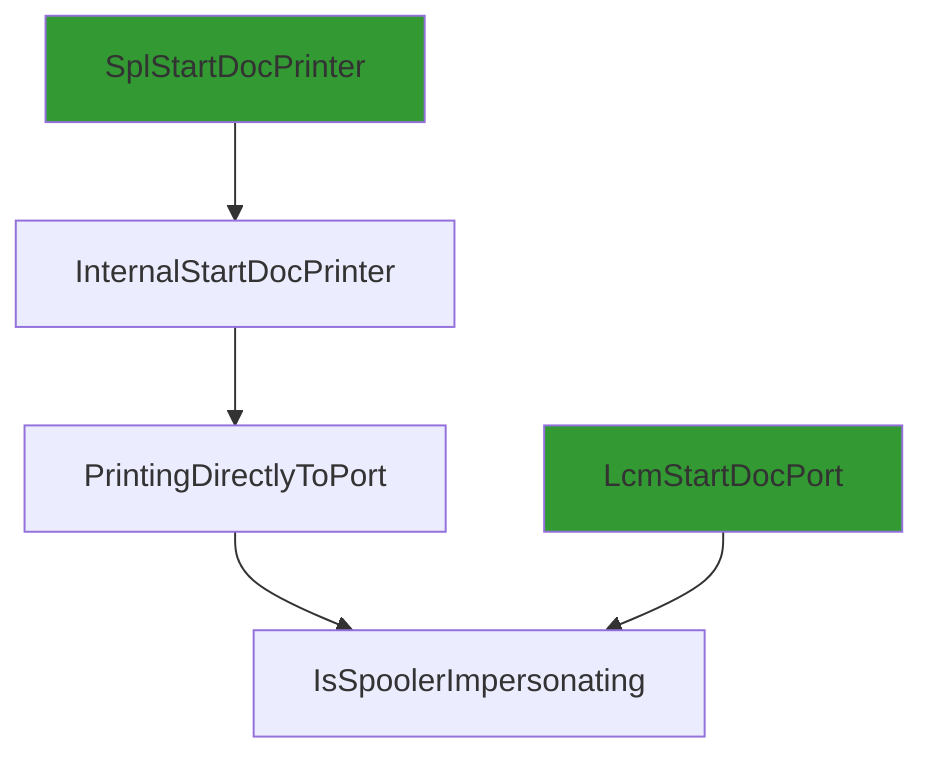
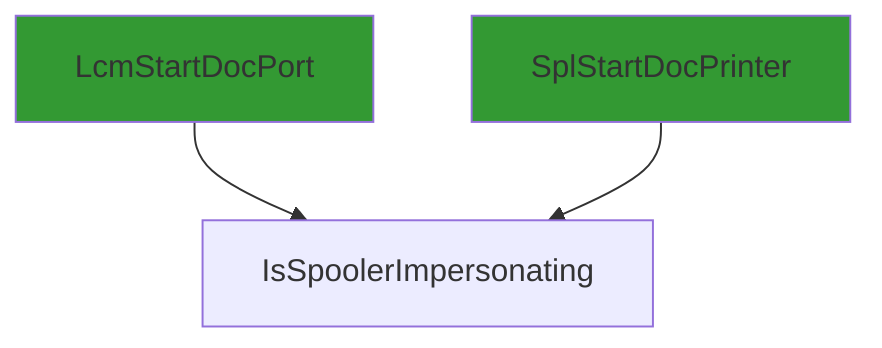

# IsSpoolerImpersonating

## Calling

Functions that call `IsSpoolerImpersonating`.



### Entrypoints

A condensed view, showing only entrypoints to the callgraph.



## Called

Functions that `IsSpoolerImpersonating` calls

```mermaid
flowchart LR
classDef shaded fill:#339933
13 --> 16["`vector_constructor_iterator'"]
33 --> 66["API-MS-WIN-CORE-SYNCH-L1-1-0.DLL::WaitForSingleObject"]:::shaded
24 --> 50["`vector_destructor_iterator'"]
18 --> 6:::shaded
13 --> 25["InitPreferMultithreaded"]
13 --> 28["operator_new"]
0 --> 2["API-MS-WIN-CORE-PROCESSTHREADS-L1-1-0.DLL::OpenThreadToken"]:::shaded
33 --> 11:::shaded
0 --> 11["API-MS-WIN-CORE-ERRORHANDLING-L1-1-0.DLL::GetLastError"]:::shaded
13 --> 29["WPP_SF_Sd"]
13 --> 18["~CoalescedSleep"]
0 --> 4["API-MS-WIN-CORE-PROCESSTHREADS-L1-1-0.DLL::OpenProcessToken"]:::shaded
0 --> 10["API-MS-WIN-CORE-PROCESSTHREADS-L1-1-0.DLL::GetCurrentThread"]:::shaded
35 --> 38["_guard_dispatch_icall"]:::shaded
0 --> 12["SPOOLSS.DLL::DllFreeSplMem"]:::shaded
1 --> 14["NTDLL.DLL::EtwTraceMessage"]:::shaded
13 --> 27["API-MS-WIN-CORE-COM-L1-1-0.DLL::CoUninitialize"]:::shaded
44 --> 46["MSVCRT.DLL::_callnewh"]:::shaded
0 --> 9["API-MS-WIN-SECURITY-BASE-L1-1-0.DLL::GetTokenInformation"]:::shaded
0 --> 6["API-MS-WIN-CORE-HANDLE-L1-1-0.DLL::CloseHandle"]:::shaded
31 --> 64["API-MS-WIN-CORE-ERRORHANDLING-L1-1-0.DLL::SetLastError"]:::shaded
31 --> 11:::shaded
42 --> 48["free"]
33 --> 67["API-MS-WIN-CORE-SYNCH-L1-2-0.DLL::Sleep"]:::shaded
30 --> 60["API-MS-WIN-CORE-COM-L1-1-0.DLL::CoWaitForMultipleHandles"]:::shaded
28 --> 44["_callnewh"]
13 --> 15["StatusFromHResult"]:::shaded
22 --> 43["FUN_180055b38"]
30 --> 11:::shaded
13 --> 21["WPP_SF_SSd"]
28 --> 45["malloc"]
58 --> 61["API-MS-WIN-CORE-SYNCH-L1-1-0.DLL::SetEvent"]:::shaded
18 --> 40["API-MS-WIN-CORE-SYNCH-L1-1-0.DLL::DeleteCriticalSection"]:::shaded
22 --> 41["FUN_18001fe54"]
13 --> 23["API-MS-WIN-CORE-SYNCH-L1-1-0.DLL::InitializeCriticalSectionAndSpinCount"]:::shaded
8 --> 14:::shaded
41 --> 42
0 --> 5["API-MS-WIN-SECURITY-BASE-L1-1-0.DLL::IsWellKnownSid"]:::shaded
13 --> 36["MSVCRT.DLL::_wcsicmp"]:::shaded
33 --> 63:::shaded
13 --> 19["API-MS-WIN-CORE-COM-L1-1-0.DLL::CoTaskMemFree"]:::shaded
24 --> 42
31 --> 63["API-MS-WIN-CORE-PROCESSTHREADS-L1-1-0.DLL::TlsSetValue"]:::shaded
33 --> 65["API-MS-WIN-CORE-SYNCH-L1-1-0.DLL::ResetEvent"]:::shaded
30 --> 56["API-MS-WIN-CORE-SYNCH-L1-1-0.DLL::EnterCriticalSection"]:::shaded
33 --> 61:::shaded
0 --> 13["PrinterNonRegGetHardwareId"]
51 --> 35
31 --> 57:::shaded
48 --> 49["MSVCRT.DLL::free"]:::shaded
26 --> 14:::shaded
13 --> 31["LeaveSplSem"]
25 --> 52["API-MS-WIN-CORE-COM-L1-1-0.DLL::CoInitializeEx"]:::shaded
0 --> 7["API-MS-WIN-CORE-PROCESSTHREADS-L1-1-0.DLL::GetCurrentProcess"]:::shaded
34 --> 42
22 --> 42["operator_delete"]
33 --> 62:::shaded
30 --> 58["SleepTimerCallback"]
13 --> 30["Wait"]
45 --> 47["MSVCRT.DLL::malloc"]:::shaded
50 --> 35
13 --> 34["vFree"]
16 --> 35
13 --> 33["EnterSplSem"]
24 --> 51["~TRefPtrCOM<struct_IBidiRequest>"]
21 --> 14:::shaded
31 --> 62["API-MS-WIN-CORE-PROCESSTHREADS-L1-1-0.DLL::TlsGetValue"]:::shaded
13 --> 37["GetLastErrorAsFailHR"]
18 --> 39["API-MS-WIN-CORE-THREADPOOL-L1-2-0.DLL::CloseThreadpoolTimer"]:::shaded
37 --> 11:::shaded
0["IsSpoolerImpersonating"] --> 1["WPP_SF_d"]
30 --> 53["API-MS-WIN-CORE-PROCESSTHREADS-L1-1-0.DLL::GetCurrentThreadId"]:::shaded
0 --> 3["SPOOLSS.DLL::DllAllocSplMem"]:::shaded
13 --> 24["Reset"]
30 --> 57["API-MS-WIN-CORE-SYNCH-L1-1-0.DLL::LeaveCriticalSection"]:::shaded
30 --> 55["API-MS-WIN-CORE-THREADPOOL-L1-2-0.DLL::CreateThreadpoolTimer"]:::shaded
13 --> 17["StringCbCopyW"]:::shaded
13 --> 26["WPP_SF_SS"]
31 --> 61:::shaded
30 --> 59["API-MS-WIN-CORE-SYNCH-L1-1-0.DLL::CreateEventW"]:::shaded
33 --> 56:::shaded
43 --> 41
13 --> 20["TRefPtrCOM<struct_IBidiRequest>"]:::shaded
33 --> 57:::shaded
30 --> 54["API-MS-WIN-CORE-THREADPOOL-L1-2-0.DLL::SetThreadpoolTimer"]:::shaded
43 --> 42
13 --> 22["Update"]
29 --> 14:::shaded
13 --> 35["_guard_xfg_dispatch_icall_nop"]
0 --> 8["WPP_SF_"]
33 --> 64:::shaded
13 --> 32["API-MS-WIN-CORE-COM-L1-1-0.DLL::CoCreateInstance"]:::shaded
22 --> 28

```

### Endpoints

A condensed view, showing only endpoints of the callgraph.

```mermaid
flowchart LR
classDef shaded fill:#339933
root["IsSpoolerImpersonating"] --> 17["API-MS-WIN-CORE-SYNCH-L1-1-0.DLL::InitializeCriticalSectionAndSpinCount"]:::shaded
root["IsSpoolerImpersonating"] --> 4["API-MS-WIN-CORE-COM-L1-1-0.DLL::CoUninitialize"]:::shaded
root["IsSpoolerImpersonating"] --> 35["_guard_dispatch_icall"]:::shaded
root["IsSpoolerImpersonating"] --> 38["API-MS-WIN-CORE-PROCESSTHREADS-L1-1-0.DLL::TlsSetValue"]:::shaded
root["IsSpoolerImpersonating"] --> 7["API-MS-WIN-SECURITY-BASE-L1-1-0.DLL::IsWellKnownSid"]:::shaded
root["IsSpoolerImpersonating"] --> 30["API-MS-WIN-CORE-THREADPOOL-L1-2-0.DLL::SetThreadpoolTimer"]:::shaded
root["IsSpoolerImpersonating"] --> 12["StatusFromHResult"]:::shaded
root["IsSpoolerImpersonating"] --> 15["API-MS-WIN-CORE-PROCESSTHREADS-L1-1-0.DLL::OpenProcessToken"]:::shaded
root["IsSpoolerImpersonating"] --> 32["MSVCRT.DLL::free"]:::shaded
root["IsSpoolerImpersonating"] --> 18["MSVCRT.DLL::_wcsicmp"]:::shaded
root["IsSpoolerImpersonating"] --> 33["API-MS-WIN-CORE-COM-L1-1-0.DLL::CoWaitForMultipleHandles"]:::shaded
root["IsSpoolerImpersonating"] --> 1["API-MS-WIN-CORE-THREADPOOL-L1-2-0.DLL::CloseThreadpoolTimer"]:::shaded
root["IsSpoolerImpersonating"] --> 39["SPOOLSS.DLL::DllFreeSplMem"]:::shaded
root["IsSpoolerImpersonating"] --> 5["API-MS-WIN-CORE-SYNCH-L1-1-0.DLL::DeleteCriticalSection"]:::shaded
root["IsSpoolerImpersonating"] --> 24["MSVCRT.DLL::_callnewh"]:::shaded
root["IsSpoolerImpersonating"] --> 14["API-MS-WIN-CORE-SYNCH-L1-1-0.DLL::WaitForSingleObject"]:::shaded
root["IsSpoolerImpersonating"] --> 20["API-MS-WIN-CORE-SYNCH-L1-1-0.DLL::SetEvent"]:::shaded
root["IsSpoolerImpersonating"] --> 8["API-MS-WIN-CORE-SYNCH-L1-1-0.DLL::LeaveCriticalSection"]:::shaded
root["IsSpoolerImpersonating"] --> 21["API-MS-WIN-CORE-SYNCH-L1-1-0.DLL::CreateEventW"]:::shaded
root["IsSpoolerImpersonating"] --> 27["API-MS-WIN-CORE-ERRORHANDLING-L1-1-0.DLL::SetLastError"]:::shaded
root["IsSpoolerImpersonating"] --> 16["API-MS-WIN-CORE-PROCESSTHREADS-L1-1-0.DLL::TlsGetValue"]:::shaded
root["IsSpoolerImpersonating"] --> 36["MSVCRT.DLL::malloc"]:::shaded
root["IsSpoolerImpersonating"] --> 9["API-MS-WIN-CORE-SYNCH-L1-1-0.DLL::ResetEvent"]:::shaded
root["IsSpoolerImpersonating"] --> 34["API-MS-WIN-CORE-ERRORHANDLING-L1-1-0.DLL::GetLastError"]:::shaded
root["IsSpoolerImpersonating"] --> 26["NTDLL.DLL::EtwTraceMessage"]:::shaded
root["IsSpoolerImpersonating"] --> 31["SPOOLSS.DLL::DllAllocSplMem"]:::shaded
root["IsSpoolerImpersonating"] --> 29["StringCbCopyW"]:::shaded
root["IsSpoolerImpersonating"] --> 22["API-MS-WIN-CORE-SYNCH-L1-2-0.DLL::Sleep"]:::shaded
root["IsSpoolerImpersonating"] --> 0["API-MS-WIN-CORE-PROCESSTHREADS-L1-1-0.DLL::OpenThreadToken"]:::shaded
root["IsSpoolerImpersonating"] --> 25["API-MS-WIN-CORE-PROCESSTHREADS-L1-1-0.DLL::GetCurrentThreadId"]:::shaded
root["IsSpoolerImpersonating"] --> 23["API-MS-WIN-CORE-THREADPOOL-L1-2-0.DLL::CreateThreadpoolTimer"]:::shaded
root["IsSpoolerImpersonating"] --> 19["API-MS-WIN-SECURITY-BASE-L1-1-0.DLL::GetTokenInformation"]:::shaded
root["IsSpoolerImpersonating"] --> 13["API-MS-WIN-CORE-COM-L1-1-0.DLL::CoTaskMemFree"]:::shaded
root["IsSpoolerImpersonating"] --> 10["API-MS-WIN-CORE-SYNCH-L1-1-0.DLL::EnterCriticalSection"]:::shaded
root["IsSpoolerImpersonating"] --> 28["API-MS-WIN-CORE-PROCESSTHREADS-L1-1-0.DLL::GetCurrentThread"]:::shaded
root["IsSpoolerImpersonating"] --> 6["API-MS-WIN-CORE-COM-L1-1-0.DLL::CoInitializeEx"]:::shaded
root["IsSpoolerImpersonating"] --> 2["API-MS-WIN-CORE-HANDLE-L1-1-0.DLL::CloseHandle"]:::shaded
root["IsSpoolerImpersonating"] --> 3["TRefPtrCOM<struct_IBidiRequest>"]:::shaded
root["IsSpoolerImpersonating"] --> 11["API-MS-WIN-CORE-PROCESSTHREADS-L1-1-0.DLL::GetCurrentProcess"]:::shaded
root["IsSpoolerImpersonating"] --> 37["API-MS-WIN-CORE-COM-L1-1-0.DLL::CoCreateInstance"]:::shaded

```



