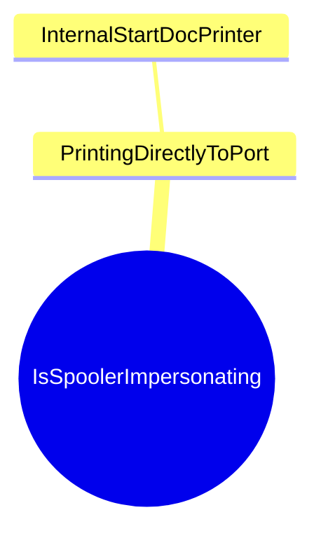
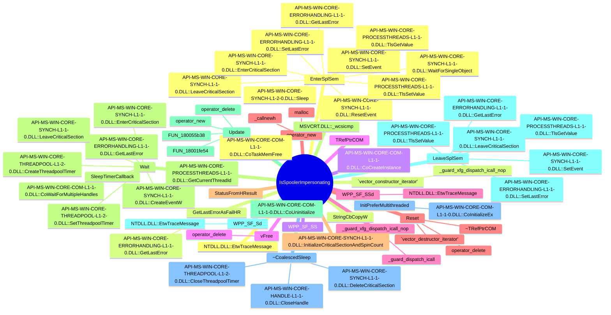

```mermaid
mindmap
root((IsSpoolerImpersonating))
      PrintingDirectlyToPort
        InternalStartDocPrinter

```

```mermaid
mindmap
root((IsSpoolerImpersonating))
      NTDLL.DLL::EtwTraceMessage
      StringCbCopyW
      WPP_SF_SS
      vFree
        operator_delete
      _guard_xfg_dispatch_icall_nop
        _guard_dispatch_icall
      operator_new
        _callnewh
        malloc
      StatusFromHResult
      MSVCRT.DLL::_wcsicmp
      API-MS-WIN-CORE-COM-L1-1-0.DLL::CoUninitialize
      LeaveSplSem
        API-MS-WIN-CORE-SYNCH-L1-1-0.DLL::SetEvent
        API-MS-WIN-CORE-ERRORHANDLING-L1-1-0.DLL::GetLastError
        API-MS-WIN-CORE-PROCESSTHREADS-L1-1-0.DLL::TlsGetValue
        API-MS-WIN-CORE-SYNCH-L1-1-0.DLL::LeaveCriticalSection
        API-MS-WIN-CORE-ERRORHANDLING-L1-1-0.DLL::SetLastError
        API-MS-WIN-CORE-PROCESSTHREADS-L1-1-0.DLL::TlsSetValue
      InitPreferMultithreaded
        API-MS-WIN-CORE-COM-L1-1-0.DLL::CoInitializeEx
      API-MS-WIN-CORE-COM-L1-1-0.DLL::CoTaskMemFree
      GetLastErrorAsFailHR
        API-MS-WIN-CORE-ERRORHANDLING-L1-1-0.DLL::GetLastError
      API-MS-WIN-CORE-COM-L1-1-0.DLL::CoCreateInstance
      TRefPtrCOM<struct_IBidiRequest>
      WPP_SF_SSd
        NTDLL.DLL::EtwTraceMessage
      Reset
        ~TRefPtrCOM<struct_IBidiRequest>
        `vector_destructor_iterator'
        operator_delete
      API-MS-WIN-CORE-SYNCH-L1-1-0.DLL::InitializeCriticalSectionAndSpinCount
      Wait
        API-MS-WIN-CORE-ERRORHANDLING-L1-1-0.DLL::GetLastError
        API-MS-WIN-CORE-COM-L1-1-0.DLL::CoWaitForMultipleHandles
        API-MS-WIN-CORE-SYNCH-L1-1-0.DLL::LeaveCriticalSection
        API-MS-WIN-CORE-SYNCH-L1-1-0.DLL::CreateEventW
        API-MS-WIN-CORE-PROCESSTHREADS-L1-1-0.DLL::GetCurrentThreadId
        API-MS-WIN-CORE-SYNCH-L1-1-0.DLL::EnterCriticalSection
        SleepTimerCallback
        API-MS-WIN-CORE-THREADPOOL-L1-2-0.DLL::SetThreadpoolTimer
        API-MS-WIN-CORE-THREADPOOL-L1-2-0.DLL::CreateThreadpoolTimer
      Update
        operator_new
        FUN_180055b38
        FUN_18001fe54
        operator_delete
      WPP_SF_Sd
        NTDLL.DLL::EtwTraceMessage
      ~CoalescedSleep
        API-MS-WIN-CORE-SYNCH-L1-1-0.DLL::DeleteCriticalSection
        API-MS-WIN-CORE-HANDLE-L1-1-0.DLL::CloseHandle
        API-MS-WIN-CORE-THREADPOOL-L1-2-0.DLL::CloseThreadpoolTimer
      EnterSplSem
        API-MS-WIN-CORE-ERRORHANDLING-L1-1-0.DLL::GetLastError
        API-MS-WIN-CORE-SYNCH-L1-1-0.DLL::SetEvent
        API-MS-WIN-CORE-SYNCH-L1-1-0.DLL::LeaveCriticalSection
        API-MS-WIN-CORE-PROCESSTHREADS-L1-1-0.DLL::TlsGetValue
        API-MS-WIN-CORE-SYNCH-L1-1-0.DLL::WaitForSingleObject
        API-MS-WIN-CORE-SYNCH-L1-2-0.DLL::Sleep
        API-MS-WIN-CORE-ERRORHANDLING-L1-1-0.DLL::SetLastError
        API-MS-WIN-CORE-SYNCH-L1-1-0.DLL::EnterCriticalSection
        API-MS-WIN-CORE-SYNCH-L1-1-0.DLL::ResetEvent
        API-MS-WIN-CORE-PROCESSTHREADS-L1-1-0.DLL::TlsSetValue
      `vector_constructor_iterator'
        _guard_xfg_dispatch_icall_nop

```