# LcmStartDocPort

## Calling

Functions that call `LcmStartDocPort`.

### Flowchart 

[Edit on mermaid live](https://mermaid.live/edit#pako:eNpFjsEKwjAQRH8lxKu3nNpzvCkI9SS5LMnWBpNs2W4RKf13Q1V6ffNmmEV7CqhbpftELz8Ai7pZV3yCabLYq2mAgEH1MaX2YEzTGOPK2edOqmrJX4nFFX1UOiNniKFuLVoGzNtqAH7qtabzGEDwFKIQ10B4xkphFurexe_k69kID4a8Y9yKl9_X7XOlI5Q70V9bP7EuRHw=)


### Entrypoints

A condensed view, showing only entrypoints to the callgraph.


### Mindmap

[Edit calling Mindmap](https://mermaid.live/edit#pako:eNpFjkEKwkAMRa8iWbXgCVzXnYLQncwmTIIOMskQ0oWU3t0wKt2-_x78FbISw-kAtQhVbElM1YfhkuvsaD5pvqn5OCZJAsfw2CoWimQFf3LtMaG9YIt1aYTOZyquFoPbwkFxcZ3fknfy9aaCD8O6Y-7h9XepXwvaUO6qf237AGxdPDY=)

## Called

Functions that `LcmStartDocPort` calls

### Flowchart

[Edit on mermaid live](https://mermaid.live/edit#pako:eNqlWmtv67gR_StB-qFA0RSiqGdQLODI9o1xHdu1nBvcNoWrK9GJNrLk1SOPLnZ_e_mUSIlO7fZTAlkih8MzZ84M-etlXCTo8vricpcVb_FzVNYX8_VjHmdRVY3R7qJ6jhKUXOzSLLv-A4S-D-Fj7ngXV1c_XXjmPx4vt3GUZTl6e368_OdjDtgvPri-vmafPuYGfWQC_PLDarUNp9sxfZc9By5-vhk1dXEb5UmGFhv8o_Q1sBz2nuWTAUJzC82_jOfz6-tlmaR5lG1NoH5hAfqB43cThok8o4F_GK1mV3fh1cNscRUs15Or8PsiuL2agytwZbDh5yh6RUGZ1ileYYjiOi3ynmnMMtORn5k2e2jKFrEXLQ9PvNjg0dkM6zqbF8VLc5g2OR1-ktflhzoHN5msJVwtl_Mw5N-iV1TWm2JVpnmNyhBlO92HkHz4e9-92ExoMTOh9InL55IeQT6_bas-CyfB_Xq2-X51Mwonitu-IGzVC8pn-a4o99HQaxwOZMBZmURhjTE3LuJVUdbUNLF9lrR9yv6ZZE134bdgvWFTbt_iKo33B3Uex-JQVJ0-qd82ZRSjO1RV0RPq7ajhs_WC1oGuBizT2VxddIjqSZ4sd9M0Q1owUv-9TkuE6EJcBgjf1wy-uV1PRmOy12QKU0wRlCiq0eYZ_0kORZFt0j0qtXO5DvFclHJ3sqlsY4C9IDrUTYmCAgPove45AkC2fLOFhUGGnd4vtsAzDGD9sAxluyDhgqcmKpPt--5pm6TVIarj5y2JnmybFwd5B03Nuifr9XJ9O1qM57PFl75351FVT8qy6K2YBxvmCI4mvJgchyrDuMkQAKDRA0z1VsVRvttW6mgC7J70ramJBtscBigxYJT83FQ1wcAi2iMeZzqOYGxga2CcD3EsjOrCgY7scAi5J5HZGlUYoq8o7--z7Q8J2zf4lrYrVsy32Ce2pZl5tV4GkzBkGA4VEzao3GO-rtGqLGIcfD1DoKB5AqSwxrT2FMTPQVQ_MEe2kemfEpA4daU5Ghc4h72mMXrQuZRipiK8M1qg-q0oXziZshDlADCk72yPA0pHGRTUfIeSkCOQ49P0NEavJ19m4Wb9vbdRT0FWVOgr-jiSB4Gle2qbR7Kjq8W41RIc87ecWmb7Ayqrgm0VdUiQpUPk8IkhgQEm_aApS_zSfYXKcVriGCxoKiMO4m8aXscrABJ792iPYanA2TwJzqEWzJyKlJAFpg7BnCiJ6TTNhwec4ffUEMi20zFlzCkgYJZ6QKbDHbIttlrrE1FA2FQwi_KC2BQ8JHf5osgxFLBfbzGjvkUlmrEUaHFYOn1OI-SRoV6uddrNxvAcBnq7G0rOF9qA8KDYlnNjPauw6d-irEE6gyDUAYlSaJYV8ShPcNwzDlCCH8rGc0-4mKU8vyMsp8tbXADYQzK1z1vO8oBylnmptDmmGWyZDXhYYK2RV_u0qlKyoVjekbxdNPW0LPZ4g9OqFmEihKMKHNALV_sU9mNagSSiHvG5IhTN8xzQxTdzAwWjbg-JeTgHE206bbJsFdXPm2Je5E_3i4Auky9IUyDAARFRIuw4Wd57CdeAL8nVKPNOf_ldVvkRFIePh376EVpBl17ms5v1aP19vhyNJ2tFlWHHkHQ2SpJymNJaYECxRpKsp-l7c2gzE01UKVfJXaXgDtTat7Ssmyi7z9_SvO99swvYLiGAXkJ4CEdhEb-guo8JYSR-f432xSs6ahyXemSTN2u0W9VlsLz7K4ZwE9fb2U2apGv0S4Oq-qcjnlBoBvCZTRL4XyfrxWQubL1p0iwJiv1-HNwcg7B1UqZgoUCTRX_LRXJWEqogPOez0dvtDzOEDtpQsCRLgWYs7DjVzoIo9mlR3jVZnR4yxMq1Sl_akhH_9UqT7DYucrYD-P8UR0qE__mjQikkTvi6zKF0tagMwva0FRjWYFyL2VKOs6GVGHrokNfm8Z6hJygyjpeOuxyWfFy3kwPahGyc5KlNVL3coT2vprRqyDiihgAAR6BJ-xPM6fND_bcGlR9sPUpaB7DjFIeIuuLAPL7N0RvTD8IEb5ig4-c-j4l8JPUqkl8k55ntgJTsQLehwqIuNVCROatw1k0TUoAkq_TArHf8Y6RLo77vcVqE9TIKoWLmnX4UgaEm5mObsn9eizT503a7PdSlY-lEAV6qZ7QwEZ4xFMboECX2zdaSuNnKNDoWzwHEP78HRYTDKkaJiN02__TTzzjLCMSINqxLPfAtzTdUwuCP7qig1JQ41Hxo9YPDN2ir5r_yKp4daqScWLtlnJXAyArn6Y8y6jeeuuxlaeS0BTWcaZ8tEkOtSBSytIM2OFN_4nGP6jVL0_kS_EObUjjjrUq0Q4yKazoOSpS2GbDAWV6eF1HCvTx5f9B3HRQ_c0jaJ-W4Ca3RPu1UtipJcXNXlfD5DMogIekvobKrA4UOd4d73zYI3fMlNW8E6PaIMyzJwnR1UoGGRaYoGNrNtBQaMHh8mNr-gqn0F3RS0BZ81NYdw_al9f8JaB2d0OpwUCcC09VEJfSGJhmnNUYypC0NOOHSqbkyU1K00BJQQ8hEeGo2QowoNXJ5Ocd30LA7KjVPsZ6m5WNdHd6d8dwzmqokrX3aUxUi0deg0z1JrdznVEPjrPzvHs_xdOcBGZ5K2zuU89MRGXk3ABrWzbzK7FcknL2htgcgla-WqQlxOFTh0B4iiGVnb4gg0TgxZFFp_4Ce3BkmXeRtheIG09nHNn5G8QtWuMVLynWYaOe0WQfauvCQgpfY07LU0BzHk7yvLQXgSSTM5XuIeSVDyx8_sy607DKGJN87CTWzFjOT9z4_ac7YmISgbfDttkQHLOW3T9UuSrOmZJ4TXVt4buv9Pn-mui-ZvMfoQHILZo9BRc5FjOdLlUmCjhQmHCjmKYAOPwV0q95lUGH5D1xVttNl6woCS594DJokorqpSKPmdo0qrAW0GtBw-xoQ56r7vKS9HVRiSDCyoiVoz3zXHEqRrmfsntEzJun0KxqKizYglCQylNGYfzUSqfvd1HTsNFxvWV1PPUvzl14X3D9jRZTqqTgcLgp2wkVT2bSlg98BQNI4rO0fNFVd7LuSt_WDdwYoCUJ6nO7q1KU16Ekq_KrrzEKp3hTdta7SG2COySnaKdO2d6Bm--Xtc0DbQeXVmDtM5FJq-iVMEkkSYr6X4s-BSewqv5KNp3Up9lebvjXOB93mEnSKEtdntBalFWpzg8xtLdV3fQ443BNfEdisZdE7fWZmtBhWq2iRKc22r27r-lKaokxRax4bxesf_-0jUjjqawPbOfX4fVY9oCz7mhdveZgm-vaItvQBJ2W5Li316o1RnoSHNA-Kpn8q4_HMYPWPO6WLI8NgAQ44RRBiuTMlPE4azWS3bj5Yk-JY05AW-aTwp1IvwBb8iGJOU8DtHXnT4nwgyCltiuh0TzWSN8OJjQ9ahal05kS9BrUIM04XuG0hfOzKgBDicvhapmPImsw53hkZNDlc5jqX8MFOXHcQewrtNkCVOOHznCdNvhy9FcBltbZCm30bbSa4UNNtEq5Hd7gwmg1axS0mzZMxSYZpL8AIVOqbSIAVpIsgqm-a3e5B6TQQRgaWpckQ7b0o94i0gfoCz9b24G12XIXjmyQ2mnerwRkVH8Hr40G0vAZ9Mq4KDH5ELPWYXc1JeluJKMLE1VgmX6LRsRndKHrnoZdgnDNqKE1275zuHW0w23oFphbOsFVY4oaFpTvQUeoRk98-0F68WIzuJuPVbDVh4Q_albQ5jOCxr6NE77ajNOXw3LKGQtGEGr27PkXtiluDZIA22UnkIMlNX6JA8phLJEDPCJWkKW4QyHHF5nH718R2g_MCy9Dc1eP50GSwaylmVE2x4rhdy-jV3yTcrAlVLW_C5XyyUakhw6EU7w9pX9C2YWi18kw6aKDZ__6QMDi2bwAIVNb2PfUKQrcYKDcV5Ost6tJ5ifg_Hw5rb_ZA65NuNZSuNTFB6XB55HX3ydS7ZLoEBk2pTeF1FQroFgXOSi6nFb22zc8Y5IOOhHbYGLS7C2XsP-mYh53yiOiHw1Jad6LCpOl8tWl5VDS9nJPkG-v-nXKpVYbfaX0udtI6y6s6ymOkBzg7sReNTW-ogsi00qmlB9pDnMs_X1xi-bKP0uTy-uLXy_oZ7enF5SQqXy5_w782NEImSYp3Af9Qlw3CT6OmLsKPPO6esPfGafRURvvuMaIf3vHr0PRaNH56iPK_F4V47bf_ACtFCpg=)

```mermaid
flowchart LR
classDef shaded fill:#339933
68 --> 82["_callnewh"]
18 --> 91:::shaded
0 --> 21["WPP_SF_D"]
0 --> 17["TAutoHandleNT"]:::shaded
146 --> 149["WS2_32.DLL::Ordinal_21"]:::shaded
41 --> 69["WPP_SF_Sd"]
0 --> 10["API-MS-WIN-CORE-SYNCH-L1-1-0.DLL::LeaveCriticalSection"]:::shaded
16 --> 26:::shaded
125 --> 22:::shaded
46 --> 48["NTDLL.DLL::RtlLookupFunctionEntry"]:::shaded
0 --> 19["SPOOLSS.DLL::RevertToPrinterSelf"]:::shaded
0 --> 39["~TAutoHandleNT"]
134 --> 23:::shaded
7 --> 19:::shaded
30 --> 155["API-MS-WIN-SECURITY-BASE-L1-1-0.DLL::GetTokenInformation"]:::shaded
0 --> 25["IrdaStartDocPort"]
41 --> 64["WPP_SF_SSd"]
0 --> 29["MSVCRT.DLL::_wcsicmp"]:::shaded
64 --> 91["NTDLL.DLL::EtwTraceMessage"]:::shaded
109 --> 11
0 --> 37["API-MS-WIN-CORE-FILE-L1-1-0.DLL::SetEndOfFile"]:::shaded
41 --> 55["vFree"]
76 --> 99["API-MS-WIN-CORE-THREADPOOL-L1-2-0.DLL::CreateThreadpoolTimer"]:::shaded
41 --> 76["Wait"]
46 --> 50["NTDLL.DLL::RtlCaptureContext"]:::shaded
113 --> 32
7 --> 106["FUN_180014b40"]
41 --> 63["_guard_xfg_dispatch_icall_nop"]
0 --> 22["API-MS-WIN-CORE-ERRORHANDLING-L1-1-0.DLL::SetLastError"]:::shaded
25 --> 146["IrdaConnect"]
124 --> 130["MSVCRT.DLL::swscanf_s"]:::shaded
30 --> 18
124 --> 129:::shaded
30 --> 52:::shaded
0 --> 16["AdjustFileName"]
136 --> 26:::shaded
1 --> 45["MSVCRT.DLL::_wcsnicmp"]:::shaded
0 --> 18["WPP_SF_"]
66 --> 97["API-MS-WIN-CORE-SYNCH-L1-1-0.DLL::ResetEvent"]:::shaded
159 --> 91:::shaded
90 --> 63
30 --> 26:::shaded
49 --> 54["API-MS-WIN-CORE-PROCESSTHREADS-L1-1-0.DLL::TerminateProcess"]:::shaded
136 --> 143["StringCchCatW"]
109 --> 119["API-MS-WIN-CORE-FILE-L1-1-0.DLL::DefineDosDeviceW"]:::shaded
0 --> 6["IsPortANetworkPrinter"]
74 --> 10:::shaded
58 --> 13:::shaded
109 --> 122["WPP_SF_dS"]
125 --> 128["API-MS-WIN-CORE-REGISTRY-L1-1-0.DLL::RegCloseKey"]:::shaded
146 --> 114:::shaded
146 --> 152["WS2_32.DLL::Ordinal_7"]:::shaded
30 --> 41
0 --> 43["SPOOLSS.DLL::ImpersonatePrinterClient"]:::shaded
16 --> 134["GetCurrentUserDirectory"]
106 --> 108
113 --> 132["memset"]
66 --> 92["API-MS-WIN-CORE-SYNCH-L1-1-0.DLL::SetEvent"]:::shaded
41 --> 29:::shaded
120 --> 26:::shaded
41 --> 74["LeaveSplSem"]
39 --> 62
109 --> 110:::shaded
56 --> 81["FUN_18001fe54"]
146 --> 26:::shaded
125 --> 32
124 --> 26:::shaded
0 --> 41["PrinterNonRegGetHardwareId"]
44 --> 160["MSVCRT.DLL::wcsnlen"]:::shaded
6 --> 41
122 --> 91:::shaded
113 --> 119:::shaded
134 --> 18
66 --> 94["API-MS-WIN-CORE-PROCESSTHREADS-L1-1-0.DLL::TlsGetValue"]:::shaded
6 --> 33:::shaded
16 --> 136["AllocAndCatString"]
109 --> 31:::shaded
44 --> 73
89 --> 63
36 --> 32
74 --> 95:::shaded
0 --> 15["API-MS-WIN-CORE-PROCESSTHREADS-L1-1-0.DLL::OpenThreadToken"]:::shaded
109 --> 115
109 --> 124["GetTransmissionRetryTimeoutFromRegistry"]
125 --> 26:::shaded
121 --> 41
0 --> 5["API-MS-WIN-CORE-FILE-L1-1-0.DLL::CreateFileW"]:::shaded
76 --> 102["API-MS-WIN-CORE-PROCESSTHREADS-L1-1-0.DLL::GetCurrentThreadId"]:::shaded
16 --> 135["ConvertFullPathToLongUNC"]
21 --> 91:::shaded
0 --> 33["SPOOLSS.DLL::ClosePrinter"]:::shaded
4 --> 41
121 --> 107:::shaded
16 --> 2
41 --> 59["StringCbCopyW"]:::shaded
134 --> 139["API-MS-WIN-CORE-LIBRARYLOADER-L1-2-0.DLL::GetProcAddress"]:::shaded
109 --> 113
0 --> 7["FixupDosDeviceDefinition"]
46 --> 47["NTDLL.DLL::RtlVirtualUnwind"]:::shaded
124 --> 18
146 --> 151["WS2_32.DLL::WSASocketW"]:::shaded
7 --> 113["RemoveDosDeviceDefinition"]
41 --> 65["TRefPtrCOM<struct_IBidiRequest>"]:::shaded
109 --> 19:::shaded
117 --> 126["KERNEL32.DLL::BuildCommDCBW"]:::shaded
76 --> 104["API-MS-WIN-CORE-SYNCH-L1-1-0.DLL::CreateEventW"]:::shaded
125 --> 114:::shaded
66 --> 96["API-MS-WIN-CORE-SYNCH-L1-2-0.DLL::Sleep"]:::shaded
16 --> 4
76 --> 101["API-MS-WIN-CORE-COM-L1-1-0.DLL::CoWaitForMultipleHandles"]:::shaded
41 --> 61["`vector_constructor_iterator'"]
125 --> 41
66 --> 22:::shaded
0 --> 4["IsCOMPort"]
143 --> 145["FUN_1800534d0"]:::shaded
7 --> 115["LcmRemoveColon"]
1 --> 41
62 --> 77
106 --> 26:::shaded
41 --> 70["API-MS-WIN-CORE-COM-L1-1-0.DLL::CoTaskMemFree"]:::shaded
146 --> 150["WS2_32.DLL::Ordinal_111"]:::shaded
109 --> 121["HandleLptQueryRemove"]
146 --> 132
41 --> 68["operator_new"]
36 --> 158["MSVCRT.DLL::wcschr"]:::shaded
40 --> 159["WPP_SF_dq"]
1 --> 2
36 --> 41
115 --> 41
146 --> 41
0 --> 28["IsValidNamedPipe"]
69 --> 91:::shaded
0 --> 13["API-MS-WIN-CORE-HANDLE-L1-1-0.DLL::CloseHandle"]:::shaded
121 --> 13:::shaded
0 --> 12["operator_void*___ptr64"]:::shaded
6 --> 2
80 --> 77
40 --> 10:::shaded
111 --> 41
109 --> 5:::shaded
134 --> 132
56 --> 77
41 --> 58["~CoalescedSleep"]
0 --> 3["SPOOLSS.DLL::DllFreeSplStr"]:::shaded
7 --> 114["SPOOLSS.DLL::DllAllocSplMem"]:::shaded
136 --> 41
134 --> 41
62 --> 90["~TRefPtrCOM<struct_IBidiRequest>"]
73 --> 91:::shaded
134 --> 140["API-MS-WIN-CORE-LIBRARYLOADER-L1-2-0.DLL::FreeLibrary"]:::shaded
109 --> 114:::shaded
120 --> 43:::shaded
66 --> 95["API-MS-WIN-CORE-PROCESSTHREADS-L1-1-0.DLL::TlsSetValue"]:::shaded
113 --> 41
0 --> 14["API-MS-WIN-CORE-PROCESSTHREADS-L1-1-0.DLL::SetThreadToken"]:::shaded
44 --> 23:::shaded
41 --> 75["InitPreferMultithreaded"]
134 --> 141["API-MS-WIN-CORE-LIBRARYLOADER-L1-2-0.DLL::LoadLibraryExW"]:::shaded
30 --> 114:::shaded
0 --> 35["API-MS-WIN-CORE-SYNCH-L1-1-0.DLL::EnterCriticalSection"]:::shaded
121 --> 10:::shaded
115 --> 32
0 --> 30["IsSpoolerImpersonating"]
7 --> 43:::shaded
30 --> 157["API-MS-WIN-CORE-PROCESSTHREADS-L1-1-0.DLL::OpenProcessToken"]:::shaded
41 --> 66["EnterSplSem"]
135 --> 136
44 --> 45:::shaded
103 --> 92:::shaded
136 --> 142["StringCchCopyW"]:::shaded
135 --> 2
109 --> 3:::shaded
0 --> 24["API-MS-WIN-CORE-PROCESSTHREADS-L1-1-0.DLL::GetCurrentThread"]:::shaded
7 --> 32
1 --> 32
124 --> 127:::shaded
109 --> 38:::shaded
0 --> 20["API-MS-WIN-CORE-FILE-L1-1-0.DLL::DeleteFileW"]:::shaded
40 --> 32
117 --> 26:::shaded
25 --> 43:::shaded
111 --> 18
4 --> 45:::shaded
0 --> 32["WPP_SF_S"]
105 --> 105
7 --> 112["API-MS-WIN-CORE-FILE-L1-1-0.DLL::QueryDosDeviceW"]:::shaded
58 --> 87["API-MS-WIN-CORE-THREADPOOL-L1-2-0.DLL::CloseThreadpoolTimer"]:::shaded
25 --> 19:::shaded
41 --> 67["API-MS-WIN-CORE-COM-L1-1-0.DLL::CoUninitialize"]:::shaded
80 --> 81
136 --> 144["WPP_SF_SSS"]
0 --> 31["API-MS-WIN-CORE-COMM-L1-1-0.DLL::GetCommTimeouts"]:::shaded
120 --> 3:::shaded
113 --> 115
109 --> 42:::shaded
30 --> 13:::shaded
76 --> 35:::shaded
40 --> 41
108 --> 26:::shaded
56 --> 80["FUN_180055b38"]
0 --> 2["__security_check_cookie"]
120 --> 2
66 --> 35:::shaded
109 --> 32
109 --> 41
30 --> 15:::shaded
56 --> 68
136 --> 114:::shaded
66 --> 93["API-MS-WIN-CORE-SYNCH-L1-1-0.DLL::WaitForSingleObject"]:::shaded
75 --> 98["API-MS-WIN-CORE-COM-L1-1-0.DLL::CoInitializeEx"]:::shaded
138 --> 91:::shaded
2 --> 46["__report_gsfailure"]
49 --> 53["API-MS-WIN-CORE-ERRORHANDLING-L1-1-0.DLL::SetUnhandledExceptionFilter"]:::shaded
62 --> 89["`vector_destructor_iterator'"]
0 --> 42["API-MS-WIN-CORE-COMM-L1-1-0.DLL::SetCommTimeouts"]:::shaded
109 --> 120["FUN_180015017"]
146 --> 153["WS2_32.DLL::Ordinal_4"]:::shaded
41 --> 60["StatusFromHResult"]:::shaded
7 --> 107["SPOOLSS.DLL::SplUnregisterForDeviceEvents"]:::shaded
72 --> 23:::shaded
125 --> 127["API-MS-WIN-CORE-REGISTRY-L1-1-0.DLL::RegOpenKeyExW"]:::shaded
109 --> 37:::shaded
11 --> 41
109 --> 112:::shaded
44 --> 2
109 --> 23:::shaded
16 --> 45:::shaded
0 --> 44["IsPortAlink"]
125 --> 129["API-MS-WIN-CORE-REGISTRY-L1-1-0.DLL::RegQueryValueExW"]:::shaded
135 --> 32
9 --> 91:::shaded
40 --> 109
146 --> 32
0 --> 36["IsCustomPort"]
109 --> 118["API-MS-WIN-CORE-COMM-L1-1-0.DLL::SetCommState"]:::shaded
74 --> 23:::shaded
44 --> 32
74 --> 92:::shaded
32 --> 91:::shaded
136 --> 132
16 --> 11
0 --> 27["SPOOLSS.DLL::OpenPrinterW"]:::shaded
7 --> 3:::shaded
11 --> 45:::shaded
61 --> 63
6 --> 27:::shaded
0 --> 34["WPP_SF_qSdd"]
7 --> 108["FUN_180063dc7"]
7 --> 109["ValidateDosDevicePort"]
109 --> 111
135 --> 41
46 --> 49["__raise_securityfailure"]
109 --> 4
66 --> 23:::shaded
74 --> 94:::shaded
0["LcmStartDocPort"] --> 1["IsPortNamedPipe"]
113 --> 2
6 --> 45:::shaded
76 --> 10:::shaded
134 --> 38:::shaded
83 --> 85["MSVCRT.DLL::malloc"]:::shaded
30 --> 156["API-MS-WIN-SECURITY-BASE-L1-1-0.DLL::IsWellKnownSid"]:::shaded
146 --> 23:::shaded
41 --> 71["API-MS-WIN-CORE-SYNCH-L1-1-0.DLL::InitializeCriticalSectionAndSpinCount"]:::shaded
82 --> 84["MSVCRT.DLL::_callnewh"]:::shaded
44 --> 161["API-MS-WIN-CORE-FILE-L1-1-0.DLL::GetFinalPathNameByHandleW"]:::shaded
76 --> 103["SleepTimerCallback"]
117 --> 32
7 --> 41
6 --> 32
124 --> 41
16 --> 137["API-MS-WIN-CORE-FILE-L1-1-0.DLL::GetFullPathNameW"]:::shaded
25 --> 22:::shaded
121 --> 35:::shaded
76 --> 100["API-MS-WIN-CORE-THREADPOOL-L1-2-0.DLL::SetThreadpoolTimer"]:::shaded
4 --> 105["FUN_180064260"]
0 --> 26["SPOOLSS.DLL::DllFreeSplMem"]:::shaded
77 --> 78["free"]
44 --> 135
66 --> 10:::shaded
0 --> 23["API-MS-WIN-CORE-ERRORHANDLING-L1-1-0.DLL::GetLastError"]:::shaded
0 --> 8["API-MS-WIN-CORE-PRIVATEPROFILE-L1-1-0.DLL::GetProfileIntW"]:::shaded
44 --> 162["API-MS-WIN-CORE-FILE-L1-1-0.DLL::GetFileInformationByHandle"]:::shaded
7 --> 111["StrNCatBuffW"]
134 --> 63
144 --> 91:::shaded
146 --> 147["WS2_32.DLL::Ordinal_3"]:::shaded
40 --> 35:::shaded
117 --> 125["GetIniCommValuesFromRegistry"]
0 --> 38["SPOOLSS.DLL::AllocSplStr"]:::shaded
0 --> 40["GetCOMPort"]
7 --> 13:::shaded
113 --> 111
109 --> 117["GetIniCommValues"]
76 --> 23:::shaded
41 --> 62["Reset"]
109 --> 116["API-MS-WIN-CORE-COMM-L1-1-0.DLL::GetCommState"]:::shaded
146 --> 148["WS2_32.DLL::Ordinal_115"]:::shaded
109 --> 43:::shaded
134 --> 2
30 --> 24:::shaded
124 --> 114:::shaded
28 --> 154["API-MS-WIN-CORE-NAMEDPIPE-L1-2-1.DLL::GetNamedPipeInfo"]:::shaded
131 --> 131
16 --> 29:::shaded
44 --> 41
109 --> 123["SPOOLSS.DLL::SplRegisterForDeviceEvents"]:::shaded
68 --> 83["malloc"]
44 --> 132
109 --> 9
121 --> 32
132 --> 133["MSVCRT.DLL::memset"]:::shaded
78 --> 79["MSVCRT.DLL::free"]:::shaded
40 --> 22:::shaded
41 --> 72["GetLastErrorAsFailHR"]
7 --> 110["API-MS-WIN-CORE-STRING-OBSOLETE-L1-1-0.DLL::lstrcmpiW"]:::shaded
117 --> 124
11 --> 32
41 --> 56["Update"]
11 --> 131["FUN_180064298"]
146 --> 2
41 --> 73["WPP_SF_SS"]
74 --> 22:::shaded
49 --> 52["API-MS-WIN-CORE-PROCESSTHREADS-L1-1-0.DLL::GetCurrentProcess"]:::shaded
34 --> 91:::shaded
134 --> 138["WPP_SF_d"]
63 --> 88["_guard_dispatch_icall"]:::shaded
4 --> 32
30 --> 138
16 --> 41
49 --> 51["API-MS-WIN-CORE-ERRORHANDLING-L1-1-0.DLL::UnhandledExceptionFilter"]:::shaded
55 --> 77["operator_delete"]
40 --> 18
0 --> 9["WPP_SF_q"]
30 --> 23:::shaded
62 --> 13:::shaded
0 --> 11["IsLPTPort"]
58 --> 86["API-MS-WIN-CORE-SYNCH-L1-1-0.DLL::DeleteCriticalSection"]:::shaded
16 --> 32
41 --> 57["API-MS-WIN-CORE-COM-L1-1-0.DLL::CoCreateInstance"]:::shaded
117 --> 41
124 --> 128:::shaded
25 --> 32
25 --> 41
81 --> 77

```

### Endpoints

A condensed view, showing only endpoints of the callgraph.

```mermaid
flowchart LR
classDef shaded fill:#339933
root["LcmStartDocPort"] --> 17["API-MS-WIN-CORE-COM-L1-1-0.DLL::CoInitializeEx"]:::shaded
root["LcmStartDocPort"] --> 13["API-MS-WIN-CORE-COM-L1-1-0.DLL::CoWaitForMultipleHandles"]:::shaded
root["LcmStartDocPort"] --> 59["API-MS-WIN-CORE-REGISTRY-L1-1-0.DLL::RegQueryValueExW"]:::shaded
root["LcmStartDocPort"] --> 24["SPOOLSS.DLL::RevertToPrinterSelf"]:::shaded
root["LcmStartDocPort"] --> 16["API-MS-WIN-CORE-ERRORHANDLING-L1-1-0.DLL::GetLastError"]:::shaded
root["LcmStartDocPort"] --> 30["API-MS-WIN-CORE-PROCESSTHREADS-L1-1-0.DLL::TlsGetValue"]:::shaded
root["LcmStartDocPort"] --> 90["API-MS-WIN-CORE-SYNCH-L1-1-0.DLL::DeleteCriticalSection"]:::shaded
root["LcmStartDocPort"] --> 44["SPOOLSS.DLL::ClosePrinter"]:::shaded
root["LcmStartDocPort"] --> 5["MSVCRT.DLL::free"]:::shaded
root["LcmStartDocPort"] --> 52["MSVCRT.DLL::malloc"]:::shaded
root["LcmStartDocPort"] --> 86["API-MS-WIN-CORE-PROCESSTHREADS-L1-1-0.DLL::TlsSetValue"]:::shaded
root["LcmStartDocPort"] --> 87["SPOOLSS.DLL::DllFreeSplMem"]:::shaded
root["LcmStartDocPort"] --> 48["WS2_32.DLL::Ordinal_7"]:::shaded
root["LcmStartDocPort"] --> 33["TRefPtrCOM<struct_IBidiRequest>"]:::shaded
root["LcmStartDocPort"] --> 88["API-MS-WIN-CORE-COMM-L1-1-0.DLL::SetCommState"]:::shaded
root["LcmStartDocPort"] --> 15["MSVCRT.DLL::wcsnlen"]:::shaded
root["LcmStartDocPort"] --> 74["API-MS-WIN-CORE-REGISTRY-L1-1-0.DLL::RegOpenKeyExW"]:::shaded
root["LcmStartDocPort"] --> 28["API-MS-WIN-CORE-THREADPOOL-L1-2-0.DLL::CloseThreadpoolTimer"]:::shaded
root["LcmStartDocPort"] --> 14["API-MS-WIN-CORE-NAMEDPIPE-L1-2-1.DLL::GetNamedPipeInfo"]:::shaded
root["LcmStartDocPort"] --> 39["MSVCRT.DLL::swscanf_s"]:::shaded
root["LcmStartDocPort"] --> 7["WS2_32.DLL::Ordinal_4"]:::shaded
root["LcmStartDocPort"] --> 65["API-MS-WIN-CORE-LIBRARYLOADER-L1-2-0.DLL::FreeLibrary"]:::shaded
root["LcmStartDocPort"] --> 56["MSVCRT.DLL::wcschr"]:::shaded
root["LcmStartDocPort"] --> 64["API-MS-WIN-CORE-SYNCH-L1-1-0.DLL::ResetEvent"]:::shaded
root["LcmStartDocPort"] --> 12["MSVCRT.DLL::memset"]:::shaded
root["LcmStartDocPort"] --> 75["SPOOLSS.DLL::SplRegisterForDeviceEvents"]:::shaded
root["LcmStartDocPort"] --> 57["API-MS-WIN-CORE-SYNCH-L1-1-0.DLL::WaitForSingleObject"]:::shaded
root["LcmStartDocPort"] --> 20["API-MS-WIN-CORE-SYNCH-L1-1-0.DLL::EnterCriticalSection"]:::shaded
root["LcmStartDocPort"] --> 68["API-MS-WIN-CORE-FILE-L1-1-0.DLL::QueryDosDeviceW"]:::shaded
root["LcmStartDocPort"] --> 21["API-MS-WIN-CORE-SYNCH-L1-1-0.DLL::CreateEventW"]:::shaded
root["LcmStartDocPort"] --> 91["TAutoHandleNT"]:::shaded
root["LcmStartDocPort"] --> 92["API-MS-WIN-SECURITY-BASE-L1-1-0.DLL::IsWellKnownSid"]:::shaded
root["LcmStartDocPort"] --> 4["API-MS-WIN-CORE-COM-L1-1-0.DLL::CoTaskMemFree"]:::shaded
root["LcmStartDocPort"] --> 43["API-MS-WIN-CORE-ERRORHANDLING-L1-1-0.DLL::UnhandledExceptionFilter"]:::shaded
root["LcmStartDocPort"] --> 62["API-MS-WIN-CORE-PROCESSTHREADS-L1-1-0.DLL::SetThreadToken"]:::shaded
root["LcmStartDocPort"] --> 84["API-MS-WIN-CORE-PRIVATEPROFILE-L1-1-0.DLL::GetProfileIntW"]:::shaded
root["LcmStartDocPort"] --> 10["WS2_32.DLL::Ordinal_3"]:::shaded
root["LcmStartDocPort"] --> 81["API-MS-WIN-CORE-FILE-L1-1-0.DLL::DeleteFileW"]:::shaded
root["LcmStartDocPort"] --> 25["SPOOLSS.DLL::AllocSplStr"]:::shaded
root["LcmStartDocPort"] --> 37["SPOOLSS.DLL::ImpersonatePrinterClient"]:::shaded
root["LcmStartDocPort"] --> 35["WS2_32.DLL::Ordinal_21"]:::shaded
root["LcmStartDocPort"] --> 1["NTDLL.DLL::RtlVirtualUnwind"]:::shaded
root["LcmStartDocPort"] --> 26["API-MS-WIN-CORE-FILE-L1-1-0.DLL::SetEndOfFile"]:::shaded
root["LcmStartDocPort"] --> 82["KERNEL32.DLL::BuildCommDCBW"]:::shaded
root["LcmStartDocPort"] --> 78["API-MS-WIN-CORE-THREADPOOL-L1-2-0.DLL::CreateThreadpoolTimer"]:::shaded
root["LcmStartDocPort"] --> 67["API-MS-WIN-CORE-PROCESSTHREADS-L1-1-0.DLL::OpenThreadToken"]:::shaded
root["LcmStartDocPort"] --> 36["WS2_32.DLL::WSASocketW"]:::shaded
root["LcmStartDocPort"] --> 22["FUN_1800534d0"]:::shaded
root["LcmStartDocPort"] --> 2["API-MS-WIN-CORE-PROCESSTHREADS-L1-1-0.DLL::GetCurrentProcess"]:::shaded
root["LcmStartDocPort"] --> 0["API-MS-WIN-CORE-COM-L1-1-0.DLL::CoCreateInstance"]:::shaded
root["LcmStartDocPort"] --> 72["API-MS-WIN-CORE-PROCESSTHREADS-L1-1-0.DLL::GetCurrentThread"]:::shaded
root["LcmStartDocPort"] --> 9["API-MS-WIN-CORE-FILE-L1-1-0.DLL::GetFileInformationByHandle"]:::shaded
root["LcmStartDocPort"] --> 32["API-MS-WIN-CORE-FILE-L1-1-0.DLL::DefineDosDeviceW"]:::shaded
root["LcmStartDocPort"] --> 45["WS2_32.DLL::Ordinal_111"]:::shaded
root["LcmStartDocPort"] --> 73["SPOOLSS.DLL::DllFreeSplStr"]:::shaded
root["LcmStartDocPort"] --> 6["MSVCRT.DLL::_wcsicmp"]:::shaded
root["LcmStartDocPort"] --> 40["NTDLL.DLL::RtlCaptureContext"]:::shaded
root["LcmStartDocPort"] --> 63["API-MS-WIN-CORE-PROCESSTHREADS-L1-1-0.DLL::GetCurrentThreadId"]:::shaded
root["LcmStartDocPort"] --> 77["API-MS-WIN-CORE-HANDLE-L1-1-0.DLL::CloseHandle"]:::shaded
root["LcmStartDocPort"] --> 51["API-MS-WIN-CORE-FILE-L1-1-0.DLL::CreateFileW"]:::shaded
root["LcmStartDocPort"] --> 53["MSVCRT.DLL::_wcsnicmp"]:::shaded
root["LcmStartDocPort"] --> 54["API-MS-WIN-CORE-REGISTRY-L1-1-0.DLL::RegCloseKey"]:::shaded
root["LcmStartDocPort"] --> 19["StringCbCopyW"]:::shaded
root["LcmStartDocPort"] --> 47["StatusFromHResult"]:::shaded
root["LcmStartDocPort"] --> 8["WS2_32.DLL::Ordinal_115"]:::shaded
root["LcmStartDocPort"] --> 29["API-MS-WIN-CORE-COMM-L1-1-0.DLL::GetCommTimeouts"]:::shaded
root["LcmStartDocPort"] --> 49["StringCchCopyW"]:::shaded
root["LcmStartDocPort"] --> 85["API-MS-WIN-CORE-ERRORHANDLING-L1-1-0.DLL::SetLastError"]:::shaded
root["LcmStartDocPort"] --> 55["operator_void*___ptr64"]:::shaded
root["LcmStartDocPort"] --> 79["_guard_dispatch_icall"]:::shaded
root["LcmStartDocPort"] --> 58["SPOOLSS.DLL::SplUnregisterForDeviceEvents"]:::shaded
root["LcmStartDocPort"] --> 31["API-MS-WIN-CORE-FILE-L1-1-0.DLL::GetFullPathNameW"]:::shaded
root["LcmStartDocPort"] --> 34["API-MS-WIN-CORE-SYNCH-L1-2-0.DLL::Sleep"]:::shaded
root["LcmStartDocPort"] --> 61["NTDLL.DLL::EtwTraceMessage"]:::shaded
root["LcmStartDocPort"] --> 60["API-MS-WIN-SECURITY-BASE-L1-1-0.DLL::GetTokenInformation"]:::shaded
root["LcmStartDocPort"] --> 38["NTDLL.DLL::RtlLookupFunctionEntry"]:::shaded
root["LcmStartDocPort"] --> 69["API-MS-WIN-CORE-SYNCH-L1-1-0.DLL::InitializeCriticalSectionAndSpinCount"]:::shaded
root["LcmStartDocPort"] --> 41["API-MS-WIN-CORE-COMM-L1-1-0.DLL::SetCommTimeouts"]:::shaded
root["LcmStartDocPort"] --> 18["API-MS-WIN-CORE-PROCESSTHREADS-L1-1-0.DLL::OpenProcessToken"]:::shaded
root["LcmStartDocPort"] --> 66["API-MS-WIN-CORE-THREADPOOL-L1-2-0.DLL::SetThreadpoolTimer"]:::shaded
root["LcmStartDocPort"] --> 70["API-MS-WIN-CORE-STRING-OBSOLETE-L1-1-0.DLL::lstrcmpiW"]:::shaded
root["LcmStartDocPort"] --> 3["MSVCRT.DLL::_callnewh"]:::shaded
root["LcmStartDocPort"] --> 42["API-MS-WIN-CORE-ERRORHANDLING-L1-1-0.DLL::SetUnhandledExceptionFilter"]:::shaded
root["LcmStartDocPort"] --> 27["API-MS-WIN-CORE-LIBRARYLOADER-L1-2-0.DLL::LoadLibraryExW"]:::shaded
root["LcmStartDocPort"] --> 23["API-MS-WIN-CORE-SYNCH-L1-1-0.DLL::SetEvent"]:::shaded
root["LcmStartDocPort"] --> 76["SPOOLSS.DLL::DllAllocSplMem"]:::shaded
root["LcmStartDocPort"] --> 50["API-MS-WIN-CORE-FILE-L1-1-0.DLL::GetFinalPathNameByHandleW"]:::shaded
root["LcmStartDocPort"] --> 83["API-MS-WIN-CORE-LIBRARYLOADER-L1-2-0.DLL::GetProcAddress"]:::shaded
root["LcmStartDocPort"] --> 11["API-MS-WIN-CORE-PROCESSTHREADS-L1-1-0.DLL::TerminateProcess"]:::shaded
root["LcmStartDocPort"] --> 80["SPOOLSS.DLL::OpenPrinterW"]:::shaded
root["LcmStartDocPort"] --> 89["API-MS-WIN-CORE-COM-L1-1-0.DLL::CoUninitialize"]:::shaded
root["LcmStartDocPort"] --> 71["API-MS-WIN-CORE-COMM-L1-1-0.DLL::GetCommState"]:::shaded
root["LcmStartDocPort"] --> 46["API-MS-WIN-CORE-SYNCH-L1-1-0.DLL::LeaveCriticalSection"]:::shaded

```



### Mindmap

![Edit called Mindmap](https://mermaid.live/edit#pako:eNrtXG1v2zYQ_itFvqwFliFOk7UrhgGOLDfG5JeJTo0OBTRGoh0uFKlSUtKsaH_7TpJtUW-WZBt7QdUPRSryeMfjc88dX5rPJ7ZwyMmbZycu5Y6LvQ9cChE8f27YLgqwDAbCngkZvHjxgT-L_1iWT-xQ0uDJsu-IfW_ZQtxTsmmOOkjigYi18peYslBu22aS8oDIieAmWb0lwTWWziOWZOSk0g9DSZTBbjwHB8q_-7PR6RidLkaTU21q6vDX-NTonfZOz34YGMabN5rQJAGJEfcDzG1F8qsmMCO-TRzECPHSBhSAWSvtVhPe00L9jIPQH0rhXpvED1mQNv3xQOxASJg5aJFh_DOFiWH44bu02xi908x5Ypf1aPvUdhW1MChRxrRWIXjD-rRcWQ71PRzYdxa1MWMWF4rUYjaz0NBCSHHZ3CTLWSDBFT8n5lijK-pQk3wMiR_8knbUI-8jjyHitvHoDaecBhQz-pfiT-ElE7Y4eSza57RRMMf-_Zi42ZXPi6H3E-06IzjaWqUBHCNnIVgXKnifO8ijXBMhVzwMgDOwH-hSCtn3hwDNa7PEsekng-AHkndXpHQmyZLIMWCCBncAN4co011gulWaRwBXIbDRmIpO5tAz6a0Hj3OJbTImvo9XJA2-qtjKSJsBe0dlEGJ2wx8hrqs6GRC6oTcMeew2gId8ysQxpj7ZhnuNQg17ATRrAkD2aeuB4c3E6r0-O_vx4vzHs44HOh7oeOAYPIBm06mB0NpxTPhkHVNdlu6is4vOdtGZCaapR_g6Ahb_TPia5IHIYC7WWhFhy3z27F3cXpwpoFfFB4xFSwIeGKse2Cbel479qlRvKgixVdoDmm64JCvqg11DIQfkgdpEfyA88AsJXtXTxMR9_PYOcBQxzUD4iS3R1mQnhrMgBnBpwo02NipbwVfAS9QA40Mw1s5C8RdAzQc1u-0Yjgw9G0wx-w0pI4sW1qNS62uVDciS8tRli0I0fVQnY8zmuyeD5uZo8vZ0eoWmhj7PqmLAbBAaNEPQcqLh4CpcLhctjP4tJPKpzOb8kvQZE3Ye_E3jS4mwy7Peq2r7dNOcmtf9ycCI5p6D1JavUvlrzB1GDC-I52ESVzyQ9jidU5eIMPCL_Fcx1Y0zMgCt9TXgSufOdBnhsaDKUXQ1qQySuW5XLgYfjei-PdCL08-zk7mbm3ICIxeSoS84hM96JhqjRE0-hu0m9muCqRbDXIGOuO9S36fR7GGjtLYuKj0SM9K9U36CMXByDBDVbAlKqqRaBVp5mDVZsPU6d9VfV_19k9XfvqloD6JrkZpr92_7B7xL3AyqizmlnAZbcWmDNF1Fti1Ia2tzfemoHET99Loju47suoOoY-xko0o1lBIi_8YnckBlDMSnYhlZ7UdjdGX2zffGtD_Qzcif50oZPJPC7juOBK2H1Lxt6_da-m3CHM0nGgHNoLcSq57L83Tz4QyBnfVw-qdFZanXMMZL9oSlZNrMKTsRWMSgJni0exuGjM1wcDcXhuCrm4mmuCVafwgwSIYJcR55FfMW7dC3Jm77LsfcTdQ0OdPJIyLVh4NFCXOgVtvm7si4y6NdHt3jyLg0WkuOBY9Aj6XXqUWO2jnKLvTW7ljA7A0XT7Cb7lj2qR2Od07ePN2jknTfsVfHXt8Ue42kg6Gw4mCW0gGdWy_P15dg0qEcM-vl7uZe73J3h_Nei2Ls0Jq9SQVVpKnyefXKOyxQHwn7nmSqrZIBXu1uvjjswKZBLdfqrGYf7s4v1qQ_1gez0UxPNiK97UJFWcKZUQ-obyna83XZUuelZ-ZU0xGaX5t6f4AKFynJ9nQeR0Tz_L2Xkmi3quxUlTGQrt2Yo_n706s-KmTUubgnPPKPdLF6gnjwPUK11pG_IIz9ysUjR9TZY9LRPXni09j6PUdYOywzRPHEoB6OXQrvUvg3lcILRzkti-nytFE_iIo8AJ5911XRXQh-0yHYqmzK4eJIDwUKzosnl_Nb94aqe0PVvaHq3lD9T99QFUkuTngVJHfYgeBm2T52W5Cu_unqn-NtQfYpmXIxs10ZhzCSBk8-lMoXcJOpLi9vX76uHVPJbEtyeVHFLU2jtDJG68EwiO2q4Lp9y8iiXHJKE9F95jlBLJuc9XhCsIi0pfLutMgvlezSkFsa0cUuAsrRz0atQ3Zp_dqYairw0pDl1t2yXfIRglodfzW0vBFFtttNHJqom8hHpAPVCQKgMTK9_TNzbVEpvoVvTbS1Kw0OL2vr5xujN67CqqV2nKvOmQ-Wx9uwNlrRgTrf5nTul3rLeduKQgS-3CmXIjiq0_Nh4xxyh9Eodx85c-_O24dhrSTr1zultC44Nkf82zH334-e2kqsHrwpDvVPW0go9dvxl7WifgDfVFQPx88eRTess0fsRo-tayB_r3XK3ybueux5_LSQVJUxyhbta7hYuHIZ4hwZf9OAV2-xfV9x4M9Z9V1f6WOh6MJ781ro6inxfrP_WHuYR7vXjN1OvtvJN9vJ1z-yPs57-OqX0_mDgfyTFxWj2ba9ipxmzMWI8iZjw137HWWcfP_sBMjVxdQ5efPs80lwR9z4t245WN6ffIHWMGYQ3aGAVWiAACHwFYeBQE_cTr8k_QYUryR2088kFhyvf5dX_Du94KuH-e9CbLp9-Rs3dWvt)

