# LcmStartDocPort

## Calling

Functions that call `LcmStartDocPort`.


### Entrypoints

A condensed view, showing only entrypoints to the callgraph.


## Called

Functions that `LcmStartDocPort` calls

```mermaid
flowchart LR
classDef shaded fill:#339933
73 --> 97["API-MS-WIN-CORE-PROCESSTHREADS-L1-1-0.DLL::GetCurrentThreadId"]:::shaded
0 --> 20["SPOOLSS.DLL::DllFreeSplStr"]:::shaded
40 --> 70["TRefPtrCOM<struct_IBidiRequest>"]:::shaded
0 --> 3["~TAutoHandleNT"]
30 --> 6
161 --> 90:::shaded
45 --> 61["API-MS-WIN-CORE-COMM-L1-1-0.DLL::SetCommState"]:::shaded
19 --> 156["API-MS-WIN-CORE-FILE-L1-1-0.DLL::GetFinalPathNameByHandleW"]:::shaded
73 --> 99["API-MS-WIN-CORE-THREADPOOL-L1-2-0.DLL::SetThreadpoolTimer"]:::shaded
48 --> 40
40 --> 87["WPP_SF_SSd"]
14 --> 31
45 --> 57["API-MS-WIN-CORE-FILE-L1-1-0.DLL::DefineDosDeviceW"]:::shaded
40 --> 71["operator_new"]
87 --> 90:::shaded
25 --> 131["MSVCRT.DLL::_wcsnicmp"]:::shaded
80 --> 16:::shaded
134 --> 118
0 --> 19["IsPortAlink"]
60 --> 20:::shaded
0 --> 24["IsPortNamedPipe"]
0 --> 12["API-MS-WIN-CORE-PROCESSTHREADS-L1-1-0.DLL::GetCurrentThread"]:::shaded
135 --> 31
31 --> 119["__report_gsfailure"]
51 --> 6
62 --> 6
45 --> 59["GetIniCommValues"]
58 --> 90:::shaded
0 --> 11["API-MS-WIN-CORE-COMM-L1-1-0.DLL::GetCommTimeouts"]:::shaded
40 --> 83["WPP_SF_SS"]
104 --> 102
77 --> 107["API-MS-WIN-CORE-SYNCH-L1-1-0.DLL::WaitForSingleObject"]:::shaded
92 --> 94["MSVCRT.DLL::malloc"]:::shaded
48 --> 29
30 --> 4:::shaded
0 --> 2["FixupDosDeviceDefinition"]
0 --> 43["API-MS-WIN-CORE-PROCESSTHREADS-L1-1-0.DLL::SetThreadToken"]:::shaded
89 --> 102
34 --> 131:::shaded
40 --> 68["WPP_SF_Sd"]
140 --> 90:::shaded
45 --> 60["FUN_180015017"]
35 --> 162["API-MS-WIN-CORE-NAMEDPIPE-L1-2-1.DLL::GetNamedPipeInfo"]:::shaded
26 --> 41:::shaded
0 --> 41["API-MS-WIN-CORE-PROCESSTHREADS-L1-1-0.DLL::OpenThreadToken"]:::shaded
55 --> 67["MSVCRT.DLL::swscanf_s"]:::shaded
53 --> 44:::shaded
24 --> 6
0 --> 35["IsValidNamedPipe"]
45 --> 11:::shaded
21 --> 6
45 --> 7:::shaded
59 --> 40
0 --> 44["SPOOLSS.DLL::DllFreeSplMem"]:::shaded
134 --> 139["StringCchCopyW"]:::shaded
0 --> 5["API-MS-WIN-CORE-ERRORHANDLING-L1-1-0.DLL::GetLastError"]:::shaded
137 --> 5:::shaded
8 --> 40
19 --> 155["MSVCRT.DLL::wcsnlen"]:::shaded
40 --> 42:::shaded
102 --> 105["free"]
0 --> 30["GetCOMPort"]
74 --> 104["FUN_18001fe54"]
134 --> 40
146 --> 6
77 --> 5:::shaded
14 --> 134["AllocAndCatString"]
130 --> 46:::shaded
25 --> 40
40 --> 84["StringCbCopyW"]:::shaded
19 --> 6
2 --> 51["LcmRemoveColon"]
96 --> 101["API-MS-WIN-CORE-SYNCH-L1-1-0.DLL::SetEvent"]:::shaded
2 --> 46["SPOOLSS.DLL::DllAllocSplMem"]:::shaded
0 --> 33["API-MS-WIN-CORE-FILE-L1-1-0.DLL::CreateFileW"]:::shaded
146 --> 149["WS2_32.DLL::Ordinal_21"]:::shaded
45 --> 34
50 --> 6
40 --> 86["`vector_constructor_iterator'"]
2 --> 40
137 --> 29
2 --> 20:::shaded
21 --> 40
0 --> 37["SPOOLSS.DLL::OpenPrinterW"]:::shaded
62 --> 40
2 --> 45["ValidateDosDevicePort"]
74 --> 103["FUN_180055b38"]
26 --> 145
49 --> 44:::shaded
40 --> 85["_guard_xfg_dispatch_icall_nop"]
3 --> 89
19 --> 135
0 --> 23["API-MS-WIN-CORE-FILE-L1-1-0.DLL::DeleteFileW"]:::shaded
130 --> 44:::shaded
116 --> 85
21 --> 157["MSVCRT.DLL::wcschr"]:::shaded
132 --> 132
26 --> 158["API-MS-WIN-SECURITY-BASE-L1-1-0.DLL::IsWellKnownSid"]:::shaded
0 --> 36["WPP_SF_D"]
18 --> 16:::shaded
40 --> 78["API-MS-WIN-CORE-SYNCH-L1-1-0.DLL::InitializeCriticalSectionAndSpinCount"]:::shaded
0 --> 16["API-MS-WIN-CORE-ERRORHANDLING-L1-1-0.DLL::SetLastError"]:::shaded
138 --> 141["FUN_1800534d0"]:::shaded
30 --> 16:::shaded
26 --> 159["API-MS-WIN-CORE-PROCESSTHREADS-L1-1-0.DLL::OpenProcessToken"]:::shaded
2 --> 32:::shaded
50 --> 48
29 --> 90:::shaded
137 --> 40
2 --> 53["FUN_180014b40"]
0 --> 28["API-MS-WIN-CORE-FILE-L1-1-0.DLL::SetEndOfFile"]:::shaded
50 --> 51
119 --> 122["NTDLL.DLL::RtlCaptureContext"]:::shaded
135 --> 134
14 --> 135["ConvertFullPathToLongUNC"]
55 --> 44:::shaded
45 --> 25
25 --> 6
0 --> 21["IsCustomPort"]
19 --> 131:::shaded
0 --> 15["API-MS-WIN-CORE-SYNCH-L1-1-0.DLL::LeaveCriticalSection"]:::shaded
26 --> 160["API-MS-WIN-SECURITY-BASE-L1-1-0.DLL::GetTokenInformation"]:::shaded
2 --> 47["SPOOLSS.DLL::SplUnregisterForDeviceEvents"]:::shaded
45 --> 27
146 --> 5:::shaded
45 --> 50
134 --> 44:::shaded
40 --> 88["StatusFromHResult"]:::shaded
0 --> 42["MSVCRT.DLL::_wcsicmp"]:::shaded
77 --> 15:::shaded
14 --> 42:::shaded
18 --> 13:::shaded
137 --> 142["API-MS-WIN-CORE-LIBRARYLOADER-L1-2-0.DLL::FreeLibrary"]:::shaded
77 --> 101:::shaded
130 --> 6
17 --> 90:::shaded
0 --> 17["WPP_SF_qSdd"]
135 --> 40
81 --> 114["API-MS-WIN-CORE-THREADPOOL-L1-2-0.DLL::CloseThreadpoolTimer"]:::shaded
146 --> 153["WS2_32.DLL::Ordinal_111"]:::shaded
117 --> 85
24 --> 40
119 --> 120["NTDLL.DLL::RtlVirtualUnwind"]:::shaded
2 --> 49["FUN_180063dc7"]
40 --> 72["API-MS-WIN-CORE-COM-L1-1-0.DLL::CoTaskMemFree"]:::shaded
26 --> 12:::shaded
0 --> 29["WPP_SF_"]
62 --> 47:::shaded
76 --> 5:::shaded
2 --> 50["RemoveDosDeviceDefinition"]
73 --> 96["SleepTimerCallback"]
137 --> 143["API-MS-WIN-CORE-LIBRARYLOADER-L1-2-0.DLL::GetProcAddress"]:::shaded
55 --> 46:::shaded
36 --> 90:::shaded
34 --> 6
30 --> 15:::shaded
0 --> 6["WPP_SF_S"]
0 --> 10["API-MS-WIN-CORE-HANDLE-L1-1-0.DLL::CloseHandle"]:::shaded
118 --> 128["MSVCRT.DLL::memset"]:::shaded
45 --> 46:::shaded
45 --> 28:::shaded
59 --> 129["KERNEL32.DLL::BuildCommDCBW"]:::shaded
62 --> 4:::shaded
14 --> 44:::shaded
0 --> 34["IsCOMPort"]
73 --> 100["API-MS-WIN-CORE-SYNCH-L1-1-0.DLL::CreateEventW"]:::shaded
8 --> 31
45 --> 52:::shaded
40 --> 81["~CoalescedSleep"]
74 --> 71
0 --> 38["TAutoHandleNT"]:::shaded
2 --> 6
2 --> 48["StrNCatBuffW"]
0 --> 18["IrdaStartDocPort"]
18 --> 6
71 --> 91["_callnewh"]
77 --> 109["API-MS-WIN-CORE-PROCESSTHREADS-L1-1-0.DLL::TlsSetValue"]:::shaded
8 --> 1:::shaded
60 --> 13:::shaded
79 --> 112["API-MS-WIN-CORE-COM-L1-1-0.DLL::CoInitializeEx"]:::shaded
146 --> 46:::shaded
59 --> 55
45 --> 62["HandleLptQueryRemove"]
26 --> 40
0 --> 32["SPOOLSS.DLL::RevertToPrinterSelf"]:::shaded
105 --> 106["MSVCRT.DLL::free"]:::shaded
45 --> 55["GetTransmissionRetryTimeoutFromRegistry"]
19 --> 154["API-MS-WIN-CORE-FILE-L1-1-0.DLL::GetFileInformationByHandle"]:::shaded
0 --> 26["IsSpoolerImpersonating"]
121 --> 126["API-MS-WIN-CORE-ERRORHANDLING-L1-1-0.DLL::SetUnhandledExceptionFilter"]:::shaded
137 --> 145["WPP_SF_d"]
146 --> 148["WS2_32.DLL::Ordinal_7"]:::shaded
50 --> 57:::shaded
146 --> 147["WS2_32.DLL::Ordinal_3"]:::shaded
19 --> 40
134 --> 138["StringCchCatW"]
40 --> 82["vFree"]
19 --> 5:::shaded
40 --> 89["Reset"]
146 --> 150["WS2_32.DLL::WSASocketW"]:::shaded
45 --> 40
6 --> 90:::shaded
34 --> 40
77 --> 16:::shaded
85 --> 115["_guard_dispatch_icall"]:::shaded
50 --> 118["memset"]
55 --> 40
40 --> 75["API-MS-WIN-CORE-COM-L1-1-0.DLL::CoCreateInstance"]:::shaded
50 --> 31
73 --> 98["API-MS-WIN-CORE-COM-L1-1-0.DLL::CoWaitForMultipleHandles"]:::shaded
8 --> 6
40 --> 80["LeaveSplSem"]
14 --> 25
60 --> 31
40 --> 77["EnterSplSem"]
30 --> 45
30 --> 29
45 --> 63["SPOOLSS.DLL::SplRegisterForDeviceEvents"]:::shaded
89 --> 116["~TRefPtrCOM<struct_IBidiRequest>"]
71 --> 92["malloc"]
26 --> 46:::shaded
53 --> 49
18 --> 40
0 --> 8["IsPortANetworkPrinter"]
77 --> 108["API-MS-WIN-CORE-SYNCH-L1-2-0.DLL::Sleep"]:::shaded
45 --> 51
45 --> 33:::shaded
40 --> 79["InitPreferMultithreaded"]
73 --> 15:::shaded
130 --> 66:::shaded
55 --> 29
130 --> 64:::shaded
137 --> 85
14 --> 136["API-MS-WIN-CORE-FILE-L1-1-0.DLL::GetFullPathNameW"]:::shaded
74 --> 102["operator_delete"]
19 --> 118
137 --> 144["API-MS-WIN-CORE-LIBRARYLOADER-L1-2-0.DLL::LoadLibraryExW"]:::shaded
137 --> 7:::shaded
121 --> 124["API-MS-WIN-CORE-ERRORHANDLING-L1-1-0.DLL::UnhandledExceptionFilter"]:::shaded
0 --> 22["operator_void*___ptr64"]:::shaded
80 --> 15:::shaded
137 --> 31
82 --> 102
8 --> 131:::shaded
45 --> 58["WPP_SF_dS"]
130 --> 16:::shaded
91 --> 93["MSVCRT.DLL::_callnewh"]:::shaded
19 --> 83
134 --> 140["WPP_SF_SSS"]
119 --> 123["NTDLL.DLL::RtlLookupFunctionEntry"]:::shaded
0["LcmStartDocPort"] --> 1["SPOOLSS.DLL::ClosePrinter"]:::shaded
14 --> 40
26 --> 10:::shaded
24 --> 31
2 --> 10:::shaded
30 --> 161["WPP_SF_dq"]
40 --> 76["GetLastErrorAsFailHR"]
40 --> 73["Wait"]
0 --> 40["PrinterNonRegGetHardwareId"]
0 --> 31["__security_check_cookie"]
146 --> 31
121 --> 127["API-MS-WIN-CORE-PROCESSTHREADS-L1-1-0.DLL::TerminateProcess"]:::shaded
51 --> 40
133 --> 133
0 --> 25["IsLPTPort"]
0 --> 7["SPOOLSS.DLL::AllocSplStr"]:::shaded
0 --> 14["AdjustFileName"]
45 --> 13:::shaded
80 --> 101:::shaded
14 --> 131:::shaded
137 --> 118
45 --> 9:::shaded
19 --> 31
18 --> 146["IrdaConnect"]
55 --> 64["API-MS-WIN-CORE-REGISTRY-L1-1-0.DLL::RegOpenKeyExW"]:::shaded
77 --> 110["API-MS-WIN-CORE-PROCESSTHREADS-L1-1-0.DLL::TlsGetValue"]:::shaded
130 --> 40
0 --> 4["API-MS-WIN-CORE-SYNCH-L1-1-0.DLL::EnterCriticalSection"]:::shaded
55 --> 66["API-MS-WIN-CORE-REGISTRY-L1-1-0.DLL::RegCloseKey"]:::shaded
45 --> 6
34 --> 133["FUN_180064260"]
62 --> 15:::shaded
0 --> 27["WPP_SF_q"]
40 --> 69["API-MS-WIN-CORE-COM-L1-1-0.DLL::CoUninitialize"]:::shaded
77 --> 4:::shaded
119 --> 121["__raise_securityfailure"]
0 --> 9["API-MS-WIN-CORE-COMM-L1-1-0.DLL::SetCommTimeouts"]:::shaded
14 --> 137["GetCurrentUserDirectory"]
27 --> 90:::shaded
68 --> 90["NTDLL.DLL::EtwTraceMessage"]:::shaded
26 --> 44:::shaded
73 --> 95["API-MS-WIN-CORE-THREADPOOL-L1-2-0.DLL::CreateThreadpoolTimer"]:::shaded
146 --> 118
89 --> 10:::shaded
8 --> 37:::shaded
45 --> 20:::shaded
103 --> 104
146 --> 44:::shaded
24 --> 131:::shaded
135 --> 6
77 --> 111["API-MS-WIN-CORE-SYNCH-L1-1-0.DLL::ResetEvent"]:::shaded
45 --> 48
26 --> 125:::shaded
81 --> 10:::shaded
59 --> 44:::shaded
14 --> 6
0 --> 39["API-MS-WIN-CORE-PRIVATEPROFILE-L1-1-0.DLL::GetProfileIntW"]:::shaded
73 --> 4:::shaded
14 --> 34
62 --> 10:::shaded
2 --> 13:::shaded
130 --> 65:::shaded
2 --> 54["API-MS-WIN-CORE-FILE-L1-1-0.DLL::QueryDosDeviceW"]:::shaded
80 --> 5:::shaded
30 --> 40
26 --> 29
0 --> 13["SPOOLSS.DLL::ImpersonatePrinterClient"]:::shaded
45 --> 54:::shaded
80 --> 110:::shaded
59 --> 130["GetIniCommValuesFromRegistry"]
26 --> 5:::shaded
50 --> 40
45 --> 56["API-MS-WIN-CORE-COMM-L1-1-0.DLL::GetCommState"]:::shaded
146 --> 152["WS2_32.DLL::Ordinal_115"]:::shaded
83 --> 90:::shaded
86 --> 85
45 --> 32:::shaded
40 --> 74["Update"]
146 --> 151["WS2_32.DLL::Ordinal_4"]:::shaded
103 --> 102
73 --> 5:::shaded
60 --> 44:::shaded
2 --> 52["API-MS-WIN-CORE-STRING-OBSOLETE-L1-1-0.DLL::lstrcmpiW"]:::shaded
121 --> 125["API-MS-WIN-CORE-PROCESSTHREADS-L1-1-0.DLL::GetCurrentProcess"]:::shaded
80 --> 109:::shaded
145 --> 90:::shaded
89 --> 117["`vector_destructor_iterator'"]
146 --> 40
134 --> 46:::shaded
18 --> 32:::shaded
55 --> 65["API-MS-WIN-CORE-REGISTRY-L1-1-0.DLL::RegQueryValueExW"]:::shaded
45 --> 5:::shaded
59 --> 6
25 --> 132["FUN_180064298"]
81 --> 113["API-MS-WIN-CORE-SYNCH-L1-1-0.DLL::DeleteCriticalSection"]:::shaded

```

### Endpoints

A condensed view, showing only endpoints of the callgraph.

```mermaid
flowchart LR
classDef shaded fill:#339933
root["LcmStartDocPort"] --> 57["SPOOLSS.DLL::ClosePrinter"]:::shaded
root["LcmStartDocPort"] --> 10["API-MS-WIN-CORE-COMM-L1-1-0.DLL::GetCommState"]:::shaded
root["LcmStartDocPort"] --> 71["API-MS-WIN-CORE-FILE-L1-1-0.DLL::SetEndOfFile"]:::shaded
root["LcmStartDocPort"] --> 5["WS2_32.DLL::Ordinal_111"]:::shaded
root["LcmStartDocPort"] --> 15["API-MS-WIN-CORE-FILE-L1-1-0.DLL::GetFullPathNameW"]:::shaded
root["LcmStartDocPort"] --> 88["MSVCRT.DLL::wcschr"]:::shaded
root["LcmStartDocPort"] --> 61["SPOOLSS.DLL::DllAllocSplMem"]:::shaded
root["LcmStartDocPort"] --> 77["API-MS-WIN-CORE-PROCESSTHREADS-L1-1-0.DLL::TlsSetValue"]:::shaded
root["LcmStartDocPort"] --> 74["API-MS-WIN-CORE-ERRORHANDLING-L1-1-0.DLL::UnhandledExceptionFilter"]:::shaded
root["LcmStartDocPort"] --> 16["NTDLL.DLL::EtwTraceMessage"]:::shaded
root["LcmStartDocPort"] --> 9["MSVCRT.DLL::malloc"]:::shaded
root["LcmStartDocPort"] --> 27["MSVCRT.DLL::free"]:::shaded
root["LcmStartDocPort"] --> 50["API-MS-WIN-CORE-PROCESSTHREADS-L1-1-0.DLL::OpenProcessToken"]:::shaded
root["LcmStartDocPort"] --> 18["WS2_32.DLL::Ordinal_21"]:::shaded
root["LcmStartDocPort"] --> 40["API-MS-WIN-CORE-FILE-L1-1-0.DLL::GetFileInformationByHandle"]:::shaded
root["LcmStartDocPort"] --> 66["API-MS-WIN-CORE-PROCESSTHREADS-L1-1-0.DLL::GetCurrentThread"]:::shaded
root["LcmStartDocPort"] --> 80["API-MS-WIN-CORE-SYNCH-L1-1-0.DLL::LeaveCriticalSection"]:::shaded
root["LcmStartDocPort"] --> 37["API-MS-WIN-CORE-COM-L1-1-0.DLL::CoCreateInstance"]:::shaded
root["LcmStartDocPort"] --> 28["API-MS-WIN-CORE-PROCESSTHREADS-L1-1-0.DLL::SetThreadToken"]:::shaded
root["LcmStartDocPort"] --> 26["MSVCRT.DLL::_wcsicmp"]:::shaded
root["LcmStartDocPort"] --> 59["API-MS-WIN-CORE-PROCESSTHREADS-L1-1-0.DLL::TerminateProcess"]:::shaded
root["LcmStartDocPort"] --> 82["API-MS-WIN-CORE-REGISTRY-L1-1-0.DLL::RegCloseKey"]:::shaded
root["LcmStartDocPort"] --> 7["API-MS-WIN-CORE-SYNCH-L1-1-0.DLL::DeleteCriticalSection"]:::shaded
root["LcmStartDocPort"] --> 62["SPOOLSS.DLL::DllFreeSplMem"]:::shaded
root["LcmStartDocPort"] --> 24["MSVCRT.DLL::_callnewh"]:::shaded
root["LcmStartDocPort"] --> 89["API-MS-WIN-CORE-NAMEDPIPE-L1-2-1.DLL::GetNamedPipeInfo"]:::shaded
root["LcmStartDocPort"] --> 43["API-MS-WIN-CORE-FILE-L1-1-0.DLL::GetFinalPathNameByHandleW"]:::shaded
root["LcmStartDocPort"] --> 63["API-MS-WIN-CORE-SYNCH-L1-1-0.DLL::CreateEventW"]:::shaded
root["LcmStartDocPort"] --> 55["StatusFromHResult"]:::shaded
root["LcmStartDocPort"] --> 92["API-MS-WIN-CORE-PROCESSTHREADS-L1-1-0.DLL::TlsGetValue"]:::shaded
root["LcmStartDocPort"] --> 21["API-MS-WIN-CORE-COM-L1-1-0.DLL::CoUninitialize"]:::shaded
root["LcmStartDocPort"] --> 46["NTDLL.DLL::RtlLookupFunctionEntry"]:::shaded
root["LcmStartDocPort"] --> 51["API-MS-WIN-CORE-FILE-L1-1-0.DLL::DefineDosDeviceW"]:::shaded
root["LcmStartDocPort"] --> 6["API-MS-WIN-CORE-COM-L1-1-0.DLL::CoTaskMemFree"]:::shaded
root["LcmStartDocPort"] --> 4["SPOOLSS.DLL::SplUnregisterForDeviceEvents"]:::shaded
root["LcmStartDocPort"] --> 8["MSVCRT.DLL::swscanf_s"]:::shaded
root["LcmStartDocPort"] --> 73["API-MS-WIN-CORE-COMM-L1-1-0.DLL::SetCommTimeouts"]:::shaded
root["LcmStartDocPort"] --> 12["NTDLL.DLL::RtlVirtualUnwind"]:::shaded
root["LcmStartDocPort"] --> 81["WS2_32.DLL::Ordinal_4"]:::shaded
root["LcmStartDocPort"] --> 39["API-MS-WIN-CORE-ERRORHANDLING-L1-1-0.DLL::SetUnhandledExceptionFilter"]:::shaded
root["LcmStartDocPort"] --> 1["API-MS-WIN-CORE-FILE-L1-1-0.DLL::QueryDosDeviceW"]:::shaded
root["LcmStartDocPort"] --> 13["API-MS-WIN-CORE-FILE-L1-1-0.DLL::DeleteFileW"]:::shaded
root["LcmStartDocPort"] --> 76["WS2_32.DLL::Ordinal_7"]:::shaded
root["LcmStartDocPort"] --> 33["SPOOLSS.DLL::AllocSplStr"]:::shaded
root["LcmStartDocPort"] --> 47["API-MS-WIN-CORE-SYNCH-L1-1-0.DLL::SetEvent"]:::shaded
root["LcmStartDocPort"] --> 79["API-MS-WIN-CORE-SYNCH-L1-2-0.DLL::Sleep"]:::shaded
root["LcmStartDocPort"] --> 78["API-MS-WIN-CORE-REGISTRY-L1-1-0.DLL::RegQueryValueExW"]:::shaded
root["LcmStartDocPort"] --> 20["NTDLL.DLL::RtlCaptureContext"]:::shaded
root["LcmStartDocPort"] --> 22["_guard_dispatch_icall"]:::shaded
root["LcmStartDocPort"] --> 36["API-MS-WIN-CORE-FILE-L1-1-0.DLL::CreateFileW"]:::shaded
root["LcmStartDocPort"] --> 52["SPOOLSS.DLL::SplRegisterForDeviceEvents"]:::shaded
root["LcmStartDocPort"] --> 58["KERNEL32.DLL::BuildCommDCBW"]:::shaded
root["LcmStartDocPort"] --> 64["FUN_1800534d0"]:::shaded
root["LcmStartDocPort"] --> 32["API-MS-WIN-CORE-ERRORHANDLING-L1-1-0.DLL::GetLastError"]:::shaded
root["LcmStartDocPort"] --> 14["API-MS-WIN-CORE-HANDLE-L1-1-0.DLL::CloseHandle"]:::shaded
root["LcmStartDocPort"] --> 44["SPOOLSS.DLL::ImpersonatePrinterClient"]:::shaded
root["LcmStartDocPort"] --> 29["MSVCRT.DLL::wcsnlen"]:::shaded
root["LcmStartDocPort"] --> 60["API-MS-WIN-CORE-SYNCH-L1-1-0.DLL::InitializeCriticalSectionAndSpinCount"]:::shaded
root["LcmStartDocPort"] --> 87["API-MS-WIN-CORE-PROCESSTHREADS-L1-1-0.DLL::GetCurrentThreadId"]:::shaded
root["LcmStartDocPort"] --> 34["API-MS-WIN-SECURITY-BASE-L1-1-0.DLL::GetTokenInformation"]:::shaded
root["LcmStartDocPort"] --> 75["API-MS-WIN-CORE-LIBRARYLOADER-L1-2-0.DLL::GetProcAddress"]:::shaded
root["LcmStartDocPort"] --> 53["WS2_32.DLL::Ordinal_3"]:::shaded
root["LcmStartDocPort"] --> 90["WS2_32.DLL::WSASocketW"]:::shaded
root["LcmStartDocPort"] --> 17["MSVCRT.DLL::_wcsnicmp"]:::shaded
root["LcmStartDocPort"] --> 86["API-MS-WIN-CORE-LIBRARYLOADER-L1-2-0.DLL::FreeLibrary"]:::shaded
root["LcmStartDocPort"] --> 41["API-MS-WIN-CORE-SYNCH-L1-1-0.DLL::WaitForSingleObject"]:::shaded
root["LcmStartDocPort"] --> 23["API-MS-WIN-CORE-COMM-L1-1-0.DLL::GetCommTimeouts"]:::shaded
root["LcmStartDocPort"] --> 30["API-MS-WIN-CORE-PROCESSTHREADS-L1-1-0.DLL::OpenThreadToken"]:::shaded
root["LcmStartDocPort"] --> 25["SPOOLSS.DLL::RevertToPrinterSelf"]:::shaded
root["LcmStartDocPort"] --> 0["API-MS-WIN-CORE-THREADPOOL-L1-2-0.DLL::SetThreadpoolTimer"]:::shaded
root["LcmStartDocPort"] --> 38["API-MS-WIN-SECURITY-BASE-L1-1-0.DLL::IsWellKnownSid"]:::shaded
root["LcmStartDocPort"] --> 67["TAutoHandleNT"]:::shaded
root["LcmStartDocPort"] --> 68["API-MS-WIN-CORE-THREADPOOL-L1-2-0.DLL::CreateThreadpoolTimer"]:::shaded
root["LcmStartDocPort"] --> 49["API-MS-WIN-CORE-SYNCH-L1-1-0.DLL::EnterCriticalSection"]:::shaded
root["LcmStartDocPort"] --> 11["SPOOLSS.DLL::DllFreeSplStr"]:::shaded
root["LcmStartDocPort"] --> 70["operator_void*___ptr64"]:::shaded
root["LcmStartDocPort"] --> 48["WS2_32.DLL::Ordinal_115"]:::shaded
root["LcmStartDocPort"] --> 84["StringCchCopyW"]:::shaded
root["LcmStartDocPort"] --> 31["API-MS-WIN-CORE-COMM-L1-1-0.DLL::SetCommState"]:::shaded
root["LcmStartDocPort"] --> 42["API-MS-WIN-CORE-STRING-OBSOLETE-L1-1-0.DLL::lstrcmpiW"]:::shaded
root["LcmStartDocPort"] --> 2["TRefPtrCOM<struct_IBidiRequest>"]:::shaded
root["LcmStartDocPort"] --> 3["API-MS-WIN-CORE-PROCESSTHREADS-L1-1-0.DLL::GetCurrentProcess"]:::shaded
root["LcmStartDocPort"] --> 65["StringCbCopyW"]:::shaded
root["LcmStartDocPort"] --> 56["API-MS-WIN-CORE-REGISTRY-L1-1-0.DLL::RegOpenKeyExW"]:::shaded
root["LcmStartDocPort"] --> 19["API-MS-WIN-CORE-ERRORHANDLING-L1-1-0.DLL::SetLastError"]:::shaded
root["LcmStartDocPort"] --> 91["API-MS-WIN-CORE-COM-L1-1-0.DLL::CoInitializeEx"]:::shaded
root["LcmStartDocPort"] --> 54["MSVCRT.DLL::memset"]:::shaded
root["LcmStartDocPort"] --> 72["API-MS-WIN-CORE-LIBRARYLOADER-L1-2-0.DLL::LoadLibraryExW"]:::shaded
root["LcmStartDocPort"] --> 35["SPOOLSS.DLL::OpenPrinterW"]:::shaded
root["LcmStartDocPort"] --> 83["API-MS-WIN-CORE-COM-L1-1-0.DLL::CoWaitForMultipleHandles"]:::shaded
root["LcmStartDocPort"] --> 69["API-MS-WIN-CORE-SYNCH-L1-1-0.DLL::ResetEvent"]:::shaded
root["LcmStartDocPort"] --> 45["API-MS-WIN-CORE-PRIVATEPROFILE-L1-1-0.DLL::GetProfileIntW"]:::shaded
root["LcmStartDocPort"] --> 85["API-MS-WIN-CORE-THREADPOOL-L1-2-0.DLL::CloseThreadpoolTimer"]:::shaded

```



