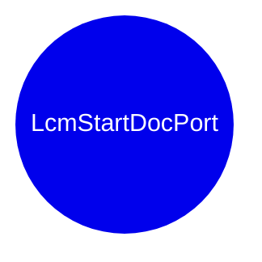

```mermaid
mindmap
root((LcmStartDocPort))
      __security_check_cookie
        __report_gsfailure
      PrinterNonRegGetHardwareId
        vFree
        Update
        API-MS-WIN-CORE-COM-L1-1-0.DLL::CoCreateInstance
        ~CoalescedSleep
        StringCbCopyW
        StatusFromHResult
        `vector_constructor_iterator'
        MSVCRT.DLL::_wcsicmp
        Reset
        _guard_xfg_dispatch_icall_nop
        WPP_SF_SSd
        TRefPtrCOM<struct_IBidiRequest>
        EnterSplSem
        API-MS-WIN-CORE-COM-L1-1-0.DLL::CoUninitialize
        operator_new
        WPP_SF_Sd
        API-MS-WIN-CORE-COM-L1-1-0.DLL::CoTaskMemFree
        API-MS-WIN-CORE-SYNCH-L1-1-0.DLL::InitializeCriticalSectionAndSpinCount
        GetLastErrorAsFailHR
        WPP_SF_SS
        LeaveSplSem
        InitPreferMultithreaded
        Wait
      MSVCRT.DLL::_wcsnicmp
      WPP_SF_S
        NTDLL.DLL::EtwTraceMessage
      __report_gsfailure
        NTDLL.DLL::RtlVirtualUnwind
        NTDLL.DLL::RtlLookupFunctionEntry
        __raise_securityfailure
        NTDLL.DLL::RtlCaptureContext
      FUN_180064260
      PrinterNonRegGetHardwareId
        vFree
        Update
        API-MS-WIN-CORE-COM-L1-1-0.DLL::CoCreateInstance
        ~CoalescedSleep
        StringCbCopyW
        StatusFromHResult
        `vector_constructor_iterator'
        MSVCRT.DLL::_wcsicmp
        Reset
        _guard_xfg_dispatch_icall_nop
        WPP_SF_SSd
        TRefPtrCOM<struct_IBidiRequest>
        EnterSplSem
        API-MS-WIN-CORE-COM-L1-1-0.DLL::CoUninitialize
        operator_new
        WPP_SF_Sd
        API-MS-WIN-CORE-COM-L1-1-0.DLL::CoTaskMemFree
        API-MS-WIN-CORE-SYNCH-L1-1-0.DLL::InitializeCriticalSectionAndSpinCount
        GetLastErrorAsFailHR
        WPP_SF_SS
        LeaveSplSem
        InitPreferMultithreaded
        Wait
      MSVCRT.DLL::_wcsnicmp
      WPP_SF_S
        NTDLL.DLL::EtwTraceMessage
      SPOOLSS.DLL::ClosePrinter
      __security_check_cookie
        __report_gsfailure
      PrinterNonRegGetHardwareId
        vFree
        Update
        API-MS-WIN-CORE-COM-L1-1-0.DLL::CoCreateInstance
        ~CoalescedSleep
        StringCbCopyW
        StatusFromHResult
        `vector_constructor_iterator'
        MSVCRT.DLL::_wcsicmp
        Reset
        _guard_xfg_dispatch_icall_nop
        WPP_SF_SSd
        TRefPtrCOM<struct_IBidiRequest>
        EnterSplSem
        API-MS-WIN-CORE-COM-L1-1-0.DLL::CoUninitialize
        operator_new
        WPP_SF_Sd
        API-MS-WIN-CORE-COM-L1-1-0.DLL::CoTaskMemFree
        API-MS-WIN-CORE-SYNCH-L1-1-0.DLL::InitializeCriticalSectionAndSpinCount
        GetLastErrorAsFailHR
        WPP_SF_SS
        LeaveSplSem
        InitPreferMultithreaded
        Wait
      SPOOLSS.DLL::OpenPrinterW
      MSVCRT.DLL::_wcsnicmp
      WPP_SF_S
        NTDLL.DLL::EtwTraceMessage
      SPOOLSS.DLL::RevertToPrinterSelf
      FUN_180014b40
        SPOOLSS.DLL::DllFreeSplMem
        FUN_180063dc7
      SPOOLSS.DLL::DllFreeSplStr
      SPOOLSS.DLL::SplUnregisterForDeviceEvents
      FUN_180063dc7
        SPOOLSS.DLL::DllFreeSplMem
      WPP_SF_S
        NTDLL.DLL::EtwTraceMessage
      ValidateDosDevicePort
        API-MS-WIN-CORE-COMM-L1-1-0.DLL::GetCommState
        GetIniCommValues
        SPOOLSS.DLL::DllFreeSplStr
        IsCOMPort
        API-MS-WIN-CORE-FILE-L1-1-0.DLL::CreateFileW
        API-MS-WIN-CORE-COMM-L1-1-0.DLL::SetCommState
        API-MS-WIN-CORE-FILE-L1-1-0.DLL::DefineDosDeviceW
        WPP_SF_q
        IsLPTPort
        API-MS-WIN-CORE-STRING-OBSOLETE-L1-1-0.DLL::lstrcmpiW
        StrNCatBuffW
        API-MS-WIN-CORE-FILE-L1-1-0.DLL::QueryDosDeviceW
        SPOOLSS.DLL::DllAllocSplMem
        SPOOLSS.DLL::RevertToPrinterSelf
        FUN_180015017
        API-MS-WIN-CORE-ERRORHANDLING-L1-1-0.DLL::GetLastError
        HandleLptQueryRemove
        API-MS-WIN-CORE-COMM-L1-1-0.DLL::GetCommTimeouts
        WPP_SF_S
        SPOOLSS.DLL::AllocSplStr
        API-MS-WIN-CORE-FILE-L1-1-0.DLL::SetEndOfFile
        WPP_SF_dS
        PrinterNonRegGetHardwareId
        RemoveDosDeviceDefinition
        API-MS-WIN-CORE-COMM-L1-1-0.DLL::SetCommTimeouts
        SPOOLSS.DLL::SplRegisterForDeviceEvents
        SPOOLSS.DLL::ImpersonatePrinterClient
        LcmRemoveColon
        GetTransmissionRetryTimeoutFromRegistry
      API-MS-WIN-CORE-HANDLE-L1-1-0.DLL::CloseHandle
      API-MS-WIN-CORE-STRING-OBSOLETE-L1-1-0.DLL::lstrcmpiW
      StrNCatBuffW
        PrinterNonRegGetHardwareId
        WPP_SF_
      PrinterNonRegGetHardwareId
        vFree
        Update
        API-MS-WIN-CORE-COM-L1-1-0.DLL::CoCreateInstance
        ~CoalescedSleep
        StringCbCopyW
        StatusFromHResult
        `vector_constructor_iterator'
        MSVCRT.DLL::_wcsicmp
        Reset
        _guard_xfg_dispatch_icall_nop
        WPP_SF_SSd
        TRefPtrCOM<struct_IBidiRequest>
        EnterSplSem
        API-MS-WIN-CORE-COM-L1-1-0.DLL::CoUninitialize
        operator_new
        WPP_SF_Sd
        API-MS-WIN-CORE-COM-L1-1-0.DLL::CoTaskMemFree
        API-MS-WIN-CORE-SYNCH-L1-1-0.DLL::InitializeCriticalSectionAndSpinCount
        GetLastErrorAsFailHR
        WPP_SF_SS
        LeaveSplSem
        InitPreferMultithreaded
        Wait
      API-MS-WIN-CORE-FILE-L1-1-0.DLL::QueryDosDeviceW
      RemoveDosDeviceDefinition
        API-MS-WIN-CORE-FILE-L1-1-0.DLL::DefineDosDeviceW
        __security_check_cookie
        StrNCatBuffW
        PrinterNonRegGetHardwareId
        memset
        WPP_SF_S
        LcmRemoveColon
      SPOOLSS.DLL::ImpersonatePrinterClient
      SPOOLSS.DLL::DllAllocSplMem
      LcmRemoveColon
        PrinterNonRegGetHardwareId
        WPP_SF_S
      NTDLL.DLL::EtwTraceMessage
      FUN_180064298
      PrinterNonRegGetHardwareId
        vFree
        Update
        API-MS-WIN-CORE-COM-L1-1-0.DLL::CoCreateInstance
        ~CoalescedSleep
        StringCbCopyW
        StatusFromHResult
        `vector_constructor_iterator'
        MSVCRT.DLL::_wcsicmp
        Reset
        _guard_xfg_dispatch_icall_nop
        WPP_SF_SSd
        TRefPtrCOM<struct_IBidiRequest>
        EnterSplSem
        API-MS-WIN-CORE-COM-L1-1-0.DLL::CoUninitialize
        operator_new
        WPP_SF_Sd
        API-MS-WIN-CORE-COM-L1-1-0.DLL::CoTaskMemFree
        API-MS-WIN-CORE-SYNCH-L1-1-0.DLL::InitializeCriticalSectionAndSpinCount
        GetLastErrorAsFailHR
        WPP_SF_SS
        LeaveSplSem
        InitPreferMultithreaded
        Wait
      MSVCRT.DLL::_wcsnicmp
      WPP_SF_S
        NTDLL.DLL::EtwTraceMessage
      GetCurrentUserDirectory
        WPP_SF_d
        API-MS-WIN-CORE-LIBRARYLOADER-L1-2-0.DLL::GetProcAddress
        SPOOLSS.DLL::AllocSplStr
        API-MS-WIN-CORE-ERRORHANDLING-L1-1-0.DLL::GetLastError
        __security_check_cookie
        PrinterNonRegGetHardwareId
        API-MS-WIN-CORE-LIBRARYLOADER-L1-2-0.DLL::FreeLibrary
        memset
        API-MS-WIN-CORE-LIBRARYLOADER-L1-2-0.DLL::LoadLibraryExW
        WPP_SF_
        _guard_xfg_dispatch_icall_nop
      IsLPTPort
        FUN_180064298
        PrinterNonRegGetHardwareId
        MSVCRT.DLL::_wcsnicmp
        WPP_SF_S
      ConvertFullPathToLongUNC
        AllocAndCatString
        __security_check_cookie
        PrinterNonRegGetHardwareId
        WPP_SF_S
      AllocAndCatString
        StringCchCopyW
        PrinterNonRegGetHardwareId
        SPOOLSS.DLL::DllFreeSplMem
        memset
        StringCchCatW
        WPP_SF_SSS
        SPOOLSS.DLL::DllAllocSplMem
      __security_check_cookie
        __report_gsfailure
      PrinterNonRegGetHardwareId
        vFree
        Update
        API-MS-WIN-CORE-COM-L1-1-0.DLL::CoCreateInstance
        ~CoalescedSleep
        StringCbCopyW
        StatusFromHResult
        `vector_constructor_iterator'
        MSVCRT.DLL::_wcsicmp
        Reset
        _guard_xfg_dispatch_icall_nop
        WPP_SF_SSd
        TRefPtrCOM<struct_IBidiRequest>
        EnterSplSem
        API-MS-WIN-CORE-COM-L1-1-0.DLL::CoUninitialize
        operator_new
        WPP_SF_Sd
        API-MS-WIN-CORE-COM-L1-1-0.DLL::CoTaskMemFree
        API-MS-WIN-CORE-SYNCH-L1-1-0.DLL::InitializeCriticalSectionAndSpinCount
        GetLastErrorAsFailHR
        WPP_SF_SS
        LeaveSplSem
        InitPreferMultithreaded
        Wait
      SPOOLSS.DLL::DllFreeSplMem
      IsCOMPort
        PrinterNonRegGetHardwareId
        MSVCRT.DLL::_wcsnicmp
        FUN_180064260
        WPP_SF_S
      MSVCRT.DLL::_wcsnicmp
      MSVCRT.DLL::_wcsicmp
      API-MS-WIN-CORE-FILE-L1-1-0.DLL::GetFullPathNameW
      WPP_SF_S
        NTDLL.DLL::EtwTraceMessage
      NTDLL.DLL::EtwTraceMessage
      SPOOLSS.DLL::RevertToPrinterSelf
      API-MS-WIN-CORE-ERRORHANDLING-L1-1-0.DLL::SetLastError
      PrinterNonRegGetHardwareId
        vFree
        Update
        API-MS-WIN-CORE-COM-L1-1-0.DLL::CoCreateInstance
        ~CoalescedSleep
        StringCbCopyW
        StatusFromHResult
        `vector_constructor_iterator'
        MSVCRT.DLL::_wcsicmp
        Reset
        _guard_xfg_dispatch_icall_nop
        WPP_SF_SSd
        TRefPtrCOM<struct_IBidiRequest>
        EnterSplSem
        API-MS-WIN-CORE-COM-L1-1-0.DLL::CoUninitialize
        operator_new
        WPP_SF_Sd
        API-MS-WIN-CORE-COM-L1-1-0.DLL::CoTaskMemFree
        API-MS-WIN-CORE-SYNCH-L1-1-0.DLL::InitializeCriticalSectionAndSpinCount
        GetLastErrorAsFailHR
        WPP_SF_SS
        LeaveSplSem
        InitPreferMultithreaded
        Wait
      IrdaConnect
        WS2_32.DLL::Ordinal_3
        WS2_32.DLL::Ordinal_115
        WS2_32.DLL::Ordinal_21
        __security_check_cookie
        API-MS-WIN-CORE-ERRORHANDLING-L1-1-0.DLL::GetLastError
        SPOOLSS.DLL::DllFreeSplMem
        WPP_SF_S
        WS2_32.DLL::Ordinal_111
        WS2_32.DLL::WSASocketW
        WS2_32.DLL::Ordinal_7
        WS2_32.DLL::Ordinal_4
        PrinterNonRegGetHardwareId
        memset
        SPOOLSS.DLL::DllAllocSplMem
      SPOOLSS.DLL::ImpersonatePrinterClient
      WPP_SF_S
        NTDLL.DLL::EtwTraceMessage
      API-MS-WIN-CORE-NAMEDPIPE-L1-2-1.DLL::GetNamedPipeInfo
      API-MS-WIN-CORE-ERRORHANDLING-L1-1-0.DLL::GetLastError
      API-MS-WIN-CORE-PROCESSTHREADS-L1-1-0.DLL::GetCurrentThread
      SPOOLSS.DLL::DllFreeSplMem
      API-MS-WIN-CORE-PROCESSTHREADS-L1-1-0.DLL::GetCurrentProcess
      API-MS-WIN-SECURITY-BASE-L1-1-0.DLL::GetTokenInformation
      API-MS-WIN-CORE-HANDLE-L1-1-0.DLL::CloseHandle
      API-MS-WIN-SECURITY-BASE-L1-1-0.DLL::IsWellKnownSid
      API-MS-WIN-CORE-PROCESSTHREADS-L1-1-0.DLL::OpenThreadToken
      API-MS-WIN-CORE-PROCESSTHREADS-L1-1-0.DLL::OpenProcessToken
      WPP_SF_d
        NTDLL.DLL::EtwTraceMessage
      PrinterNonRegGetHardwareId
        vFree
        Update
        API-MS-WIN-CORE-COM-L1-1-0.DLL::CoCreateInstance
        ~CoalescedSleep
        StringCbCopyW
        StatusFromHResult
        `vector_constructor_iterator'
        MSVCRT.DLL::_wcsicmp
        Reset
        _guard_xfg_dispatch_icall_nop
        WPP_SF_SSd
        TRefPtrCOM<struct_IBidiRequest>
        EnterSplSem
        API-MS-WIN-CORE-COM-L1-1-0.DLL::CoUninitialize
        operator_new
        WPP_SF_Sd
        API-MS-WIN-CORE-COM-L1-1-0.DLL::CoTaskMemFree
        API-MS-WIN-CORE-SYNCH-L1-1-0.DLL::InitializeCriticalSectionAndSpinCount
        GetLastErrorAsFailHR
        WPP_SF_SS
        LeaveSplSem
        InitPreferMultithreaded
        Wait
      WPP_SF_
        NTDLL.DLL::EtwTraceMessage
      SPOOLSS.DLL::DllAllocSplMem
      NTDLL.DLL::EtwTraceMessage
      MSVCRT.DLL::wcschr
      PrinterNonRegGetHardwareId
        vFree
        Update
        API-MS-WIN-CORE-COM-L1-1-0.DLL::CoCreateInstance
        ~CoalescedSleep
        StringCbCopyW
        StatusFromHResult
        `vector_constructor_iterator'
        MSVCRT.DLL::_wcsicmp
        Reset
        _guard_xfg_dispatch_icall_nop
        WPP_SF_SSd
        TRefPtrCOM<struct_IBidiRequest>
        EnterSplSem
        API-MS-WIN-CORE-COM-L1-1-0.DLL::CoUninitialize
        operator_new
        WPP_SF_Sd
        API-MS-WIN-CORE-COM-L1-1-0.DLL::CoTaskMemFree
        API-MS-WIN-CORE-SYNCH-L1-1-0.DLL::InitializeCriticalSectionAndSpinCount
        GetLastErrorAsFailHR
        WPP_SF_SS
        LeaveSplSem
        InitPreferMultithreaded
        Wait
      WPP_SF_S
        NTDLL.DLL::EtwTraceMessage
      Reset
        API-MS-WIN-CORE-HANDLE-L1-1-0.DLL::CloseHandle
      API-MS-WIN-CORE-SYNCH-L1-1-0.DLL::LeaveCriticalSection
      ValidateDosDevicePort
        API-MS-WIN-CORE-COMM-L1-1-0.DLL::GetCommState
        GetIniCommValues
        SPOOLSS.DLL::DllFreeSplStr
        IsCOMPort
        API-MS-WIN-CORE-FILE-L1-1-0.DLL::CreateFileW
        API-MS-WIN-CORE-COMM-L1-1-0.DLL::SetCommState
        API-MS-WIN-CORE-FILE-L1-1-0.DLL::DefineDosDeviceW
        WPP_SF_q
        IsLPTPort
        API-MS-WIN-CORE-STRING-OBSOLETE-L1-1-0.DLL::lstrcmpiW
        StrNCatBuffW
        API-MS-WIN-CORE-FILE-L1-1-0.DLL::QueryDosDeviceW
        SPOOLSS.DLL::DllAllocSplMem
        SPOOLSS.DLL::RevertToPrinterSelf
        FUN_180015017
        API-MS-WIN-CORE-ERRORHANDLING-L1-1-0.DLL::GetLastError
        HandleLptQueryRemove
        API-MS-WIN-CORE-COMM-L1-1-0.DLL::GetCommTimeouts
        WPP_SF_S
        SPOOLSS.DLL::AllocSplStr
        API-MS-WIN-CORE-FILE-L1-1-0.DLL::SetEndOfFile
        WPP_SF_dS
        PrinterNonRegGetHardwareId
        RemoveDosDeviceDefinition
        API-MS-WIN-CORE-COMM-L1-1-0.DLL::SetCommTimeouts
        SPOOLSS.DLL::SplRegisterForDeviceEvents
        SPOOLSS.DLL::ImpersonatePrinterClient
        LcmRemoveColon
        GetTransmissionRetryTimeoutFromRegistry
      API-MS-WIN-CORE-SYNCH-L1-1-0.DLL::EnterCriticalSection
      API-MS-WIN-CORE-ERRORHANDLING-L1-1-0.DLL::SetLastError
      WPP_SF_dq
        NTDLL.DLL::EtwTraceMessage
      PrinterNonRegGetHardwareId
        vFree
        Update
        API-MS-WIN-CORE-COM-L1-1-0.DLL::CoCreateInstance
        ~CoalescedSleep
        StringCbCopyW
        StatusFromHResult
        `vector_constructor_iterator'
        MSVCRT.DLL::_wcsicmp
        Reset
        _guard_xfg_dispatch_icall_nop
        WPP_SF_SSd
        TRefPtrCOM<struct_IBidiRequest>
        EnterSplSem
        API-MS-WIN-CORE-COM-L1-1-0.DLL::CoUninitialize
        operator_new
        WPP_SF_Sd
        API-MS-WIN-CORE-COM-L1-1-0.DLL::CoTaskMemFree
        API-MS-WIN-CORE-SYNCH-L1-1-0.DLL::InitializeCriticalSectionAndSpinCount
        GetLastErrorAsFailHR
        WPP_SF_SS
        LeaveSplSem
        InitPreferMultithreaded
        Wait
      WPP_SF_
        NTDLL.DLL::EtwTraceMessage
      WPP_SF_S
        NTDLL.DLL::EtwTraceMessage
      vFree
        operator_delete
      Update
        operator_new
        FUN_180055b38
        operator_delete
        FUN_18001fe54
      API-MS-WIN-CORE-COM-L1-1-0.DLL::CoCreateInstance
      ~CoalescedSleep
        API-MS-WIN-CORE-SYNCH-L1-1-0.DLL::DeleteCriticalSection
        API-MS-WIN-CORE-HANDLE-L1-1-0.DLL::CloseHandle
        API-MS-WIN-CORE-THREADPOOL-L1-2-0.DLL::CloseThreadpoolTimer
      StringCbCopyW
      StatusFromHResult
      `vector_constructor_iterator'
        _guard_xfg_dispatch_icall_nop
      MSVCRT.DLL::_wcsicmp
      Reset
        `vector_destructor_iterator'
        ~TRefPtrCOM<struct_IBidiRequest>
        operator_delete
      _guard_xfg_dispatch_icall_nop
        _guard_dispatch_icall
      WPP_SF_SSd
        NTDLL.DLL::EtwTraceMessage
      TRefPtrCOM<struct_IBidiRequest>
      EnterSplSem
        API-MS-WIN-CORE-SYNCH-L1-1-0.DLL::LeaveCriticalSection
        API-MS-WIN-CORE-SYNCH-L1-1-0.DLL::EnterCriticalSection
        API-MS-WIN-CORE-SYNCH-L1-1-0.DLL::WaitForSingleObject
        API-MS-WIN-CORE-SYNCH-L1-2-0.DLL::Sleep
        API-MS-WIN-CORE-ERRORHANDLING-L1-1-0.DLL::SetLastError
        API-MS-WIN-CORE-ERRORHANDLING-L1-1-0.DLL::GetLastError
        API-MS-WIN-CORE-SYNCH-L1-1-0.DLL::ResetEvent
        API-MS-WIN-CORE-PROCESSTHREADS-L1-1-0.DLL::TlsSetValue
        API-MS-WIN-CORE-SYNCH-L1-1-0.DLL::SetEvent
        API-MS-WIN-CORE-PROCESSTHREADS-L1-1-0.DLL::TlsGetValue
      API-MS-WIN-CORE-COM-L1-1-0.DLL::CoUninitialize
      operator_new
        _callnewh
        malloc
      WPP_SF_Sd
        NTDLL.DLL::EtwTraceMessage
      API-MS-WIN-CORE-COM-L1-1-0.DLL::CoTaskMemFree
      API-MS-WIN-CORE-SYNCH-L1-1-0.DLL::InitializeCriticalSectionAndSpinCount
      GetLastErrorAsFailHR
        API-MS-WIN-CORE-ERRORHANDLING-L1-1-0.DLL::GetLastError
      WPP_SF_SS
        NTDLL.DLL::EtwTraceMessage
      LeaveSplSem
        API-MS-WIN-CORE-SYNCH-L1-1-0.DLL::LeaveCriticalSection
        API-MS-WIN-CORE-ERRORHANDLING-L1-1-0.DLL::SetLastError
        API-MS-WIN-CORE-ERRORHANDLING-L1-1-0.DLL::GetLastError
        API-MS-WIN-CORE-PROCESSTHREADS-L1-1-0.DLL::TlsSetValue
        API-MS-WIN-CORE-SYNCH-L1-1-0.DLL::SetEvent
        API-MS-WIN-CORE-PROCESSTHREADS-L1-1-0.DLL::TlsGetValue
      InitPreferMultithreaded
        API-MS-WIN-CORE-COM-L1-1-0.DLL::CoInitializeEx
      Wait
        API-MS-WIN-CORE-SYNCH-L1-1-0.DLL::LeaveCriticalSection
        API-MS-WIN-CORE-THREADPOOL-L1-2-0.DLL::SetThreadpoolTimer
        API-MS-WIN-CORE-SYNCH-L1-1-0.DLL::EnterCriticalSection
        API-MS-WIN-CORE-COM-L1-1-0.DLL::CoWaitForMultipleHandles
        API-MS-WIN-CORE-PROCESSTHREADS-L1-1-0.DLL::GetCurrentThreadId
        API-MS-WIN-CORE-ERRORHANDLING-L1-1-0.DLL::GetLastError
        API-MS-WIN-CORE-SYNCH-L1-1-0.DLL::CreateEventW
        API-MS-WIN-CORE-THREADPOOL-L1-2-0.DLL::CreateThreadpoolTimer
        SleepTimerCallback
      MSVCRT.DLL::wcsnlen
      API-MS-WIN-CORE-FILE-L1-1-0.DLL::GetFinalPathNameByHandleW
      MSVCRT.DLL::_wcsnicmp
      API-MS-WIN-CORE-ERRORHANDLING-L1-1-0.DLL::GetLastError
      __security_check_cookie
        __report_gsfailure
      PrinterNonRegGetHardwareId
        vFree
        Update
        API-MS-WIN-CORE-COM-L1-1-0.DLL::CoCreateInstance
        ~CoalescedSleep
        StringCbCopyW
        StatusFromHResult
        `vector_constructor_iterator'
        MSVCRT.DLL::_wcsicmp
        Reset
        _guard_xfg_dispatch_icall_nop
        WPP_SF_SSd
        TRefPtrCOM<struct_IBidiRequest>
        EnterSplSem
        API-MS-WIN-CORE-COM-L1-1-0.DLL::CoUninitialize
        operator_new
        WPP_SF_Sd
        API-MS-WIN-CORE-COM-L1-1-0.DLL::CoTaskMemFree
        API-MS-WIN-CORE-SYNCH-L1-1-0.DLL::InitializeCriticalSectionAndSpinCount
        GetLastErrorAsFailHR
        WPP_SF_SS
        LeaveSplSem
        InitPreferMultithreaded
        Wait
      ConvertFullPathToLongUNC
        __security_check_cookie
        PrinterNonRegGetHardwareId
        AllocAndCatString
        WPP_SF_S
      memset
        MSVCRT.DLL::memset
      WPP_SF_SS
        NTDLL.DLL::EtwTraceMessage
      API-MS-WIN-CORE-FILE-L1-1-0.DLL::GetFileInformationByHandle
      WPP_SF_S
        NTDLL.DLL::EtwTraceMessage

```