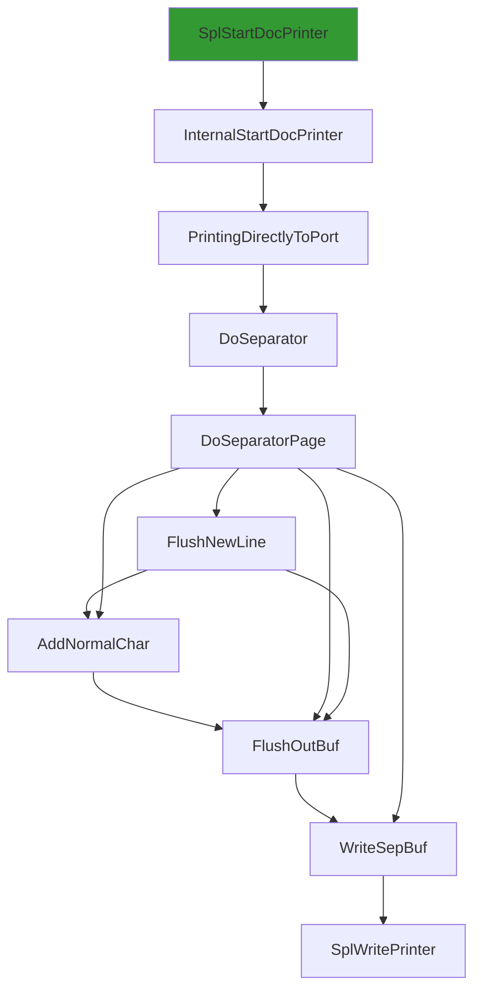
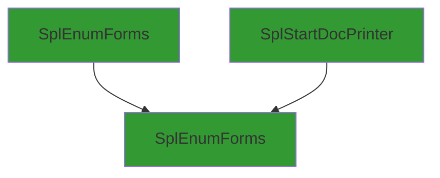

# SplEnumForms

## Calling

Functions that call `SplEnumForms`.

### Flowchart 

[Edit on mermaid live](https://mermaid.live/edit#pako:eNptUV1LwzAU_SshvjqY677aB0GtgqBz0IGg8eHS3LbBNClpyhhj_927blkVfGvPxz0n9-55biXyhPFC221egfNskwqTa2jbFAvWViBRskJpnVxFURxHkTDRp-B3Uq6sq0E_kEnwLzYa3bKJMDPiUpthAw68dWsoMbBTYoMsJlnW6MxTYmrztVPG43FOkiTnzKNyKcz878AwbCbMlJgn3bXVCrcvylxyqOGYqHenPJLvvisCc3NK7ZkhUpgF4f2_MmWqHOZe7zZ2bZ0PzjnFhe5LUj8fvQb-eUCvWggzCe3eOv-rwjgs4fJBdfk14zXSNpWkW-y5r7DuryLBffMDsV0jweOjVLQCIrzrkFDovM12Jh-Qky5VUDqoBxh74-v51v3NCW3AfFgbZIcfgnKojQ==)



### Entrypoints

A condensed view, showing only entrypoints to the callgraph.



### Mindmap

[Edit calling Mindmap](https://mermaid.live/edit#pako:eNrFU0Fqw0AM_MqypwT6gt7aOoFCmxpcKJRchFe1l3glo2gpIeTvXZyY1BTbuVXHGUkzgtHRluzQ3hsbPLkA7ZaEWReLom1WFMOaJeyXyy2Zrj7EKxbYPsavHjJm3cR9_RZ1ABrz4NwmTUPzVIP8Ji4TG_x-8YRDxpiM034QUJYcqj_0oOFGuZmVIwvPlYsn9VRlXrDU5vDOOYvOHj9-4T-YmZScEJyT6-uZFIWgKRREMy67OZTJ0Ex4GnV0m59RN_YupRxTRLxLgT9arTF00XcgO3tKbGwdKK6cT9KJUImYUIjKxYHKK3LuyzxUAuEKYzf4enmo7rES2gJ9Mvdtpx83kgS3)

## Called

Functions that `SplEnumForms` calls

### Flowchart

[Edit on mermaid live](https://mermaid.live/edit#pako:eNrVXW1v20iS_itB7sMCh82BbL4HgwEcSU5067eVlPhmbg5aWqJsrmlSQ1JxvIud337d1VX9QrYy8t5-OSww69gSRXZXVz311FOlv7_dNNvi7fs3b3dV87x5yNv-zcXil3pT5V03LXZvuod8W2zf7Mqqev9vQZBlQfBLHWTszbt3P77Jgvfv38tX_FL7fgq_9Fny37-8PbuZv7tcvrudX72bXC9m724W15PZcrn6tJidTZfvLvx3_H__Mb24eP_-el_UN22zKbrul7f_Y14xzuCKSco_Mo3gZ5bw34eh_KTY55-03FfToir6Yl6Xy33TVEXLL6NfxcS7Q3nDQRjzf3j4do8_CkvlX3x-3YB58lXiQ1gay3-kjH_I7c3Nenm-_nW6XC7h6qEn_-yHzFoDeeko5Bfw8RWZL16ewD9CP-BXm7RFDvd73rRPcDkWyI_2o8y4XGbcm5_gvaX8Auefr9Z-6nleEWTBcNF89diZvGgWic_M689d0S6LYlHk1bTZXOVPBXy2fBEzL-tvdin8je4gTI1F2MKf-FrimmbirW1RXBbyYfDBzSeRnyHug9_A401b1r24l372tah7-aYUdyXzHOZzPr-YSaPxpNHw956XVXHTwJVm3-xFwI1kiVjtRdHnZf2fzZ287Vg-EovFqqa4qrBEl8svk8VKXn_93DelfVF6YD8OrN8mtAziergmWWAuJ9sk4eBauEmxuXOJvOs0NZ8klGeARQk8yn3Z9WjgdAqt19MyWvfIEtyRTL8r9AJ5ePg1Z_Xh6UteHaQ9BEmITxQa14jwbfwA-YH8OWLa3PwwGm23nzp2cvnT1eSTtZUzsYOTtuzLTV4ti01fNvVgtfChWMzPVRDhQTAfEE2OMfFQ827StMW0Lb8WrTASecLwBDJf2Neybyd5f1ZVzUZaX4aPAYaAhj6dyvVIU8fZ9L0IvYh4yqsVfxT5OIu--lK2_SGvPtfPZb0dWCbeqX378gOC-ETHiQu3qjp-DGjjzHuL8I7DQO0FnG9-O_IcmE4GnQSYw8319cVyKS8_rSpYIG4j8mQ7bNVPhQvm_resH2-atj9vmyfTCSsnmCaWkeL5DMSH_ra64Eb9A4Sc9Up78ds23--L9ke5CWhzAeM2zDK0gSSyV2w5m3xezFc_vftwtrT9xVlb8Ic524goU3Qf25wb3WBrgiTDq1pbg9vMLS_LcMf9Uz_1Mt9_LOqiLTeXefc4NGqHIcdyueJ04I6ecjRVy5QwJLLjHpMZ99J8LcRpmH27Hewled40kR7horlfveyHNpWkDseSBfIZfLEkc3GQ67yS4W2Z7wp1-gKGDxvF4Ma6or8s-DGt-7apPvBHexQ2IE0GryminjQT8ZaPRS9wQrG9bOqyb9C60AgDTzjKQP8jSHErs9ixwYlnhQryC7EJJrTfQOjAxFkKfNoz8eJZLcCT5SPsD8SYbXl5BWQELMFTJGMRHkQJS-jUmu_EICp26S9fuZ9s2vWmqbu-PcDPJV_9nP_wB3lH-Op0FNg2Xbl52g931xFLePiUD8VvCGMf4CcEevIohnQoFJAIwQX_182SfZzO8V5SHTw8-Umxb4VDXFcIGbN6O3k41I9y_dFXhO5NC6UzL-v7yeZh0uxfBsZNhgcYEn28-YxBlhqr7ntjXBvQ28CwGMbGSHiexQ1f1lCu69W25RYtcKw0i2kh_hs4ccnA-Wf6Dnx0ADYwwN8FInzH5KTEoecnlfvzeb1rrKMDd5r4-MJQHh_0qjdNVW5eDOAXOJzHbLG4Xnw6u5pezK8-DnHXRd71s7aFM-jYQ-EpWUzg2WG_EGj6vD90Ilp84s7gUPUDcwzS8Un1o9BxUfKiqbAcYQAIq1eN-K9eGsL5kbHi1mENo7GdoXFbtsow8DMv1T7Y2lEVSKyzFKmzRD-zTCDnz_ut8JZgw9YuWp9KAde-FbpQwg8WY-oDCLWzcIzJhOO65WCrWDUIwxEA4XvgnhQAmiIG4sBKbp4vkhz5eALw6keB2FH03Bxvmq5EDCcOTKasgkcJPICZy8sIJ54G-ECJI6Wxcy2N3eOBi-MebvMwtE58PhYID4YP4NnIbdY_r9p8w_OYrsvvB_EPvZA8SxiEPuX1thq8LlDYy8xpfBVZIeNhmKEmuCccSGN4BTy148kUJkXRGJJQBhPEsXR-VxzKfjjsdgNchzl6bPkanRzSz9JZ4CUhYVK7v0QMhyfMd4SS2hVLkvFJQifqyG7F51OuDj_jMbfOProWK2YEuP-BSEM8h-cmyOKnAWao5zcaZni4FB7DP3LH8aVoO7JclXCb_sALMI13Qa7F7ON8uVr8ZDlMM70axCaGsYf5gT5hjMWn5L8fZf571nO_cXfoi254bbxT5sVGJhqEd0lioyzwh-FRtCEsJURn7DtuTOYlIm0Qt8eMMLF64DBwK4LOqnwqWqdxiqvTIYHzjwHY5TkZHKLJQ7F5nOZ9LhBqJzeKcMd30011a3yb--t6U3zguXQt_lHmVfm3wo2HBi5HrlmaDVOlRbGvXtCdTh7y-r64avpyxxPacTLL0AvKXcewxLdD5xqRRkm-n5yc4UBuA-szzAadZyNy5O0qSnng6C5X7Gz710PHUyX-83w3Xa6Q4CEfF-rzysAdXRT51wKhxkWzeUSqCANixBxb9Gl2dmM9yaci359LF2jeGz4GOFaEoMCzedqNIbMXJC5TWM0vZz9fX43OkTDPn5u6EFihfXLsWODR7WeKvFs-bCGKYiKCvhQ8uYIkGYOkiCxM4JEODx8i6MR11rkLAdRl5G7cpvhqPvOc2L4zJGUEuCVCMvDslIcybfEYbOyXfYSJwDES8WNdQpviycn29d1feXoyqZquODtsy_6sytunkYNyZRyBC4BTCp5oZCPhd3HP_cz0tmm36NIDVxITaUeHREtmI0hK3TKLs9uhp_RDx1VxVYVH4p693C7yZ-GUepk2841JDNRD4do3cxXwFrtbZPJw4bPkd-wBKfPlp4sm387rbdnyhVbY0VpJwjshUCwGvtT5fnpKpJH2LoLNrZtkTUOklpZF-7VoFdGKGD4IxTHgR-s5b7c35UaTbpqKjBW32b6IyIbInVnQHYJFTDBWfCg42ZcJz4EPT3QSCahapKgCt4kFbxDbUoBJAxX1XSw8JN5AVnIktyyezuotz104DCwmzQFZ7NAjKs_XTKUIbOiZeOIKfNmmLZ44DhSruih2E3y3YnR8iDDnk_U1BpjlbsMfs-abvWrkMg9clGJFM23RoecNA9VNvnmUpjCotZD7sE4eJv2xuOf1Jq-qunh-sNbMWuYAqx-2gyH3MWSpjrsPiGGr5rGoL4unOw7JHsr9MBZgDI3CISZdb7l91cW3sh_RbRKDCzRGrhiBLRJM07LbV_mLKozoDMPEnaFPGNC8IYXeZK2lN6snNqGocvT4FRDyz4eifQEMOabvkBHwIej9JqsiTYUY1nOQdujQgE8gJiUYRxV5rtEf-rsiCm2SQZayeMbt8j-UJPrhydsuQrHY9ONxmEJ9EFs1MA5HBh-epQ7OiJh3T4dFnvfYiZk8xMhQsdPxLsS67yJeVTCEzw8MLJOZ_BKmmeKjf5s0eVV0m2K7rIpib_luKyvJXGRhzFxFC4zwdsnIJ_h_Mq-9_L2toqIC5ssIjUWFoLOMyMpO0zE9p-qP7BWHBTbjT8XL0HpiHZNV5AkVorsiLlfFNV9S1Ty2qJiG7t3PIu3TLZep6gWR3swQYeBNW-yK9vJQ9WUPplJI3KIq58AAUjSSRs5h8AXPJ27yEuMb7qCN2_0scxg8UV4WHIooWXL4JDBBoihfRQt-PEoLKvImMWLv8tcpPnrsOQgO4olE5VzFD88ks2LpteJs6P6NKGXeBCkGEs342l4d-YnAUUUT2JmAKbMWU0PjTJYdq5L7kLP9XhQ28rImTEIvs_YscpxkjZk8CzMtuLFY5wbuSdV_mAMtiDNwjBIIjWKNwiJyPyKdL4Qeha_YQX_aVk9LBRmSTamBX-UO46iv0AGFSW9xfqgqEYQFPTzf2jVYawl1VSkd1hGvBNLJ73lS1_XcJHgqmlc8ur9_v5J14aXAbfxfl2XX8eAlfylLjYnG7sSppp7hipw520_L-dX59Ti13DwSOHRSGgGxsUv-p-aZ_Ax5BNAUoBcBBUZeIlJEeJ-AbMW4YdzjgXuI_fEpo4BkZ0uIF4CHQ3MJI1lpQCd-vdtV3LQlgy_jJZbVYtgEjmdv-nZyffmDrEyt5x_Kbbkofj1wsIzFXIQswHrQfYTC-2k6P5O2wP1vc2g3hbCHucTrREdB6UdERoi2E77LdzkRDolncMrM-JkWAjJ5WX6E50IBEhYWsb4MGSHkdzw-yKRWsiy33IFDALQDRiBr4UUvAgYxMeZ2p5gp8Wgg45OmeG22n8UOCjUxqXQqmIlbXClBTQtUAxyyczhtFt9gey9CU7ZHwz3PJAB52ounQb0JcWIi-GF8P0ngIayW382Sn7MKl9FdeXfdHgvNopdv1bKuRNpXboySFsPEm4FHADafW-49_2SSzsy-rckp0a_WR72UDgKm9Uiyjuhn8YcgVNURMj0s51G6GoFp8DMw0mqo-Ogp6xE4iSeaLT5TqPfdp8Qn9JV6x9CAiMobsXGR2xPL2k-b191uCFF1VdUHO-Xg83NdNQqnqOeHYqoiiyyPTPkvkEU8cj1W4iyI07vlR2xftP3LWdvm8skCTBICICku88di0m5W-d2wpqIAUoARQsXXuc388OBkhLZ5bYY2BXJY4HxmqBFwDMOzmc3TvkQ2AcOxw2_aD66yQlEVJJjNUzPlv2PPgD9L22-Ip7rJD53CmeRRM0CgVZF3hVnUDw0m6c5V9EY2QAi0NKUrbmBStptDlQuSmi-fEAN1qiKieCFBYhKAj1-RvS2LzYFb18uUJy1tuecR9qKo7_uHITMVu0I5FoddHoXHEpsfaEhAyWN7vRkai5JyMXIBxvFgxLCT5io5yYUBrf1djRoBc4s_IamDi_UWMHrAewjM5qop4r1aogCVxUN6cWpqRL5izCIgoPBhQQQZUnwtN2qJ8ZwpKizUVL-mwsS5JCKMqA8L3WKWMuBnR8umPsVXJK9ZHg-NenEYKfWJPoHMLDVb0S0OxzgIUZBwHMI_CQXNGpHLen41v7y-mq-uF_--Xq_3fRuHQ-zqUKfQndgFF0LT42RMOHaMxeFJJSziA1xrNqpNkYaPL6EbdwPIxITKD7KxfskWzCgptZ1BGkUtulgQp68TNBpKcEJX1rI6UCz5DSQaVBJ61p3nZfVpYWk_UxfvPxD7UALmD_Q9l0UnhT0qquSVPKvSGQ2jOgV-EVYuyvpxWAQMCJEdZ_yvPyyvL2Yr20lUnYxPIxaQuWRSWjOPN5Rk4qxrhKKgVWDq6g3JO5LkKvsJTZWcKfVMHVwnBVcvO7GmvSqe9gJ4CMAwqpYnBAJNdX6gQ6QUehfcFe0wSQpGjI9d0FW_FE6P6rewnQTPtbI4HKtM2pHMhGg9QZjfH3jyvv62u19vy26f95uHtYge1bpu9lY0j03XUxfP6OYwaYhVjkgJ1bqv7oU4dvm3Hw51V97zR153Dxwz_vjHwSv4RT8I2viH8Mf1jxYjLGGrLh-q8OVcHtJPTAS1LrIXXCuRB6GyVb86dW6ap0OueaZThyBOPbkwQ_EofDOem3Z7PeSD0fnaTI5C7C7hBtRBM5eem2odYjOU2laraEDNEzjIdCIm-PMhNoflVOqSQEm8tCDdKPkE-LCBpBXE5_KXDrSxJnQRFJaGoPpp7ECXOPJ9aqYxrW0Lx9iO7YGV7ss8X4oaLIoIPlzVNplF9E6hLtlgAqML4i4gdHE9ObuY_3y2ml9fWVHuI2lIPs8FBXoYSbIY6rgYsGWWXLp42uxfnC0XA1Oj7gotubWZE5V5DGSS09mXOQ9j7_78eTZAWRw4CbEypLmY8pRFNwR0ihEwSyX-68OlXCFHtAw8R1VAozx_xLszIFOXfbOn6oWZzsU6ImyRuiWqCXKu9bot9twFre-7HQ-8h9ZKWED3IU_BgMbMzLarzOwiSwcBeLHfyMrnvP5VkD3HpU-hwZHSBwmFNSNGKxoqBteHGs-ZC1KBsrQChUhpaiZVEBJOhVRyARAPl6hNMigb5urwYiHxFcKE16pwKYzbVcKKNDGutegR8G70kUqtYsEk4m5EzMc8D7J4RKp6f_AB-aNivPA1-YCppO1qSOqQGAfdJa-wvLGjckJVR7NzKorugtRsUjPFqUukSjNCrq87PYJGOLQtB3LyDLkpWlmU86mE7VCUwpIqW4lVyvKhrPP2RahC7L4zP3TIb0DbgHvEPJe48GL-YXG2-Oni-mw6W1h-EmpE5V2bty9D2iRUAJ9optDlhez-hMwVHal6CQKniDr_Eq28BEBBsu94DEKhIJY4jDpIXbKkyNELF6Yu_T69O3vVogn9jEwqRw0DOisixyiO9J9mi6vZRcDG3P4wJySLl86NmgaDVIdlm04anxmE6uB2ilwoaqiwptfY2rTEKG0q3SoosvNdsSoqVAMgHPf9V2v-P9cPkOtsZ982xR7o5bLqhwQiAqQk1faWQHLpuZJx4nfFfXLHQ45P1R0iLaZmQeSoD1qhnGCfS6alvRtfSqNwoaO7OHEcNHRFb0mOALZqhtZQCtttSCTuEYYyPewrIfw0mp-o_AJQ3oo7X7v6eQ9KsCM1MQutaFdB-oEgGiMf-RBWgxeRIQy805PoBBOtF3n38OGweSz6zi21ZIAFdXDUYpNBj2ps9NAofUv0Cl5KQBmO8ke0lL5aisw_ljiKLUfGd9c7k1kui26gUAnN1u2B-C0yKeHQoZkcdOk4mod0OcmSAqW6mK68I3O2PzKjlQugOPdH_Adq6foDtma49PRUQrNcLUWTZFC9n32ZXa3Esebx8MscfaFuwD25LsBOFwyqFOD2GJfvvwJRi1P3fUgdUFoCNnvJjbx90VJDFc5dbbfMKYZhJ8vV4HlvuZf9U90818ty2FeqmhEjR0-2XfcLx51Dyv1AGLJ4F6PEqLQA_lgLILs-0W8PXUN0vPKWxppbGSlgQi2HT8Yqw1Zonl-jiqc8WFyXQmII9mZdGZ4YivkiBRjwg9j5Hp5UQtC67OHwAE8yXHAgNNyXdze8n8GLHFyz3WyqKsGxbJLcd47qM5pg6mkWyWaQBp_kObCS6lVmFpyOw8AuPRlaek8z9ANtDEHCgaggdJgO5l7Q6Zm6xGaxoTfHK0QuQgXCPwowbSxK1WL7baTP0SjL8oxItYv7Iq9vs8FM3zhz1C7Uenqyz03oGbiH46Gn_MqP1z31oqARAs2aECzw1cEd9hjFBKuTEX-tGyPF07m0GliBtvLc1OjPBQ_Lz4mo-PWitGolIgFUiMk02J3ojHO2zIWgWbZmllCFVRYrVeHFJaiyGvmyyNUZRlKGRDaGtr3Z_au7pamwZz6vrLIrn31yh4ICacCcDD1AojMWlWRLsWv9lceeVSML20YhW6nyrPhCpylJxg1D-bGyjG4GMCe9RNxBSv1tEGXO0hadq-Boi43RUAIudNxjQ3RNfJIL_VyXx9qnHDkK8Y-JhXmOdK9rHVomkbmk84ySBpBVD82h2op-zLz7VWTa5-6eTKZ7f0NXmYLmDPnjXi-YRvNR6kJULk_sris7Tbz_Gw0xH02lINWNa9hS5BbyjmZ5zJ84aOqaWhM8UqvorF7gYBgonYMzgrdMRB24qlALoocAqDEN4G6wP8Lu_6I9M9RU8BK1V-Y4lXg0TuWiaR4P-_NDDWV3Esa4wqoqpDKzj9WScjiFh__EyKFjij5mPCQHTYJLHSBVCgux8_gCxHg49FsOJTHJ7OwKXOQY1CKOsrPGG47NRPnOweiqVEn_FAxwkEVAdqqiRaIRoqtmoWONAGUf-JbbLf9GsiUaZvzA0UCiSCUrZmTmsA_SDGIQFRFqKX2S2d4VOWKbLeLxQ0ffgH5YGKVhP-WqkefIaRSqqG5x8MzR4uo5mETPYJ2tkTp0mqCxa72aXcwuZzylXv_n9Ye1EKHaAvvAgYJAp-aPuSg1YSFxjoc5qYirx6cMEz_VhJXaEwYG4sLY4ZmZ06se6cVAueGgG4P0oZ2bYPAzRxiMTgqDq7x75Pmmo2NVccg-1vaepXx01UD8Xb50PWhnxJrdc3-xBUd7tn0q624wtAqbl_QQH3vVpDwxMph4Y8adOiBCxYz9balWkAn9WNM-jppLlcMRhhGT7FAbcGBCxMhwe-L8yQdFU0Sris0Gy9jL02zQBihu6sOhrLam6hebCU0NZGTcTOBIfoiwl3MxKNUZgTA5ruJ22KcTfo__9tRErVSRirpeRqlH6qCypa9SeNIH3S7gSKrrD4WSBsr80YyjYq1_qPKnu22-LuuvHMG268222FQ_DmYtJWMNiwy5x22VZWbXl3d3dxdYNVwoAGiXEJ8YOGf19nqHhKiLVUuMuSpAxiqVzbBergQ64j4xkoigclvyBz-iaYNDgLRyEIWn9qCfjWduUa7NrIkNVmeKa1yRytTS17QxkRBlxIqqsGpJ2j0tUfBBznZ-A4pCEPLi4lEMT6wGulCVdAmEZSMQNsn3_UG0uvI4922o39Zzooj9ZCxTHmb2TVrddf9QtOdVft_d4sdR3AtPHnIA4wggabMyb1ezg9GzAfXnAagEaeqIrPNdbelEy7l7XmLPrbQ2hjU6Zkikx1HceNpeaGjNY12QRccqZ--QHDjvb22KxxAebynaeg7BvZrpFwhujzjq2DGWyXdNnJRpORmQ72KK5MCaoj879A0skZEAUMwVfvHruRqAk-jN1MyxQesvEWdSC4zv6oyFJfjN7PzBWoBrXoA61WJVzb55rSlNHGOIBnJmNUswM-pVekZaautnB0UnX6UrsKjEiMXMKX5KHMOUgLsgVwk5tG4mA87SHlsR6YksgW5it5WRcXgMt7JUTmPoBHdDRLFqFohdgsTE7JQZxgTEGpmnt9DWXKFm2Ja3A-2f780K30jjktiFZ2OtUldToBajZKoCLFySytyxyew8fyor6hu30hTaAQ9rsWL6LZZxXQQWBCo1LMU_JVCB6ArYYxGyXA_NYqPz0m6FgGo-iUrgwzNjGJ0uA_qg8DE768X74u-QeSCX_A6gMWYn0kAcLYP2B5MWMHhJo_TlPqvxZX8WPTWuLfdjxwQncqUsSFQDzUDxGbi4VuXsfdQkzmrRp2J1nekDnKnz5KSIolc0lsO9fbezXBeIhJX-peOZRf6dcqJrdrdK7lOkt6EDSVA_xoBmFa2hKLzusNtjvRE1mfWmaR5L262AIyPkDIPXmDEXhZojgpMaMKSz-J0pwQ55kkr07YON7cPRSZ8NrQ20EE7MDNeBjEdPljXnFUQk4TWYberEZulwhKXEe0qnzRKyOatGu3aWbU2g649TWlm209M4A9cZwZeelO7D54-BvaYiwzH1jRw69SxWu-HsLZfPj4weeRrJaQ2gHs5S-m49GYCxLCjDaI1hCMocnCsui_-K8WxLR3lRqexheJaS5LxS-7kq2qdS0rmOyflBSP0k2IanG8iVbiAxk6lgnCnKAaYndTsoZBSY8yyguflYB6KTeI5owJsK4obuWFeFfYNrMHkGFa5AN66F04Qh2LgkIL8cAAlGoNwg6eMI_Kwq77FIp7r8U7PLv-uaTSlIm9vl9AzPq6O4oE-CKaFFcJupYiEJ1CFrCccDZpQS19VkEhiCK7kHUaBU6crRWMJDOkIBCJsFNNEmwgxyVV3WOfcADqMSnGV4JQ0wSaUiUY6ydfbPlkicxk7saaI7Kk6LKVoCMIgrZ_V2uS9rR-c-IUKZjxiDC9GCzIod8wvf6vOIzA5QKqOMa9UuUaaa7-E5xVHJKT7pvDp0D8IriVmhRTtES5hpxaaOM3Fqx0-pDsqAJoiZj5_nUzasSlAXsyn2DQv_LsKKsmtSMzURmJqurT293_pGDwFulWI6dTWNmS259pG0sznCbewks5IeUrq6Y62psds1SlA5lCKjMppFoy-pGIvWEXqB0s986c7B-KWqaKZnPcT_kmaj3-9DCgIHvaDop0R2FORlVyicabcVpCOOB0YWLA93Ylai9Z0qDAqTegRqkSVH5jsCk4PzHVEA1FopCoPM5ON0rnTA2_KsBU1TaYxSkUTD0Es5ZzCEsf5mC-0gvVfpc08T5-ouHG807kyc08tDOUWhsGLkfYcwJ4C5YE4bUducvto4FsXuBz9-zdt-3yD_VSb7__2mXnUw1Td2AAuIkQuosN8d7OLQgUEvHM1vFP9INFNM5FGmRrBx2Dctc2MSm-o1Yy4SKT4ynQU5jnhc-sZ3osJP1n_MUfgBZr-mZlE2tyJTGJqMEzOJVUse7YM85bf51fxmMb9aCWxjjbvynRNKmYMFky1-VCATnyhU27oupgR7icPXDFqbDdaMPA0ETOQMWeYNvulqas20HHSuYLJ95DtrRugD0qybooXxKvVGzsw8RmU4mxkd7ea2riGmmBK68-UjE1BM1oqdUvGVAaLn__d0XX_6WDV3eXWM-GMq80f5nTL7VLZZSiOkSTuIQgLqxpcZBxj5YCSlVaYL_CK0xi64jktKSqZSaU4to0w85zwTK6XDNnvXdw7R93Rk6jR5uqn6qqkXxT1_56e83T7nLQ2UUDom30CdzEkoeqQONAcbUatwpDI6qbx0dCmQGRslXBafBOiWTvZHEw-hbguZ1V_Ltqn10JnUNWZbfdWL3QtI8fXV3wLl3hH1xSWQfKnKYGiMGWoq1aTim99boB4tMpWr6tvqVP-xpanRg7xCldjELhgdnCSrQBkHjEvkZ0OyD90RLgWQ26ym-UrmF0-ZSxx5x8ck2slO5PCg6rvV_DGRIPy0pjp15Mzo644GM4hi3QEQkPgXyppGSYz4Vv7Xe7oAHWb5VXo96EiG2nz4Yo5Qt7Gp0SPuVmDLWRAuDyKcqDecXEEHEiJ7dvSLHgL3nMT4dSPERVvQ0QniOiz6Qwb1bHgSMsc32um70kNAL4tteQB5873IOWBHBDg2hr3Frm6cLHNOW2XHJx0JuoK-oCJ1jTy1x1SpjNnU87NNlu0wndKjLjQtgDP0ZCIjO76Ucb3945u3TwX3pOX27fs3f3_bP_DURXwR6DZvH9_-g__1AOKW2VZIEPkfOOYr-G_zQ98sX-qN_o18nQBubf6kf13AGy_x60Xha0b5b_d5_XPT0Mv-8b9EGH78)

```mermaid
flowchart LR
classDef shaded fill:#339933
392 --> 93:::shaded
118 --> 127["API-MS-WIN-CORE-PROCESSTHREADS-L1-1-1.DLL::OpenProcess"]:::shaded
169 --> 78
385 --> 27
144 --> 161["SplDeleteIniSpooler"]
144 --> 28
342 --> 346
304 --> 103
282 --> 17
320 --> 327
286 --> 382["WPP_SF_qDSSS"]
406 --> 142:::shaded
114 --> 54
216 --> 191
407 --> 413["CreateIniForm"]
230 --> 159:::shaded
92 --> 17
317 --> 328["FUN_18000e393"]:::shaded
161 --> 28
90 --> 95["CanUserSeeRealDocName"]
0 --> 2["FUN_180001cf8"]
92 --> 148["WPP_SF_qd"]
346 --> 349["FreeMem"]
16 --> 9:::shaded
0 --> 5["SeekPrinterSetEvent"]
184 --> 190["API-MS-WIN-CORE-FILE-L1-1-0.DLL::SetFilePointerEx"]:::shaded
20 --> 273["RetainJob"]
362 --> 267
387 --> 395["MSVCRT.DLL::_wtoi"]:::shaded
346 --> 163:::shaded
347 --> 349
386 --> 393["FUN_180002c74"]:::shaded
31 --> 26:::shaded
170 --> 88:::shaded
249 --> 257["Register"]
392 --> 88:::shaded
184 --> 63:::shaded
276 --> 99
392 --> 403["SplRegEnumValue"]
374 --> 344:::shaded
52 --> 46
132 --> 52
161 --> 145:::shaded
0 --> 18["API-MS-WIN-CORE-SYNCH-L1-1-0.DLL::EnterCriticalSection"]:::shaded
384 --> 264
35 --> 32:::shaded
216 --> 223["IsCoreDriverFile"]
207 --> 210["StrCatAlloc"]
191 --> 195["WPP_SF_DD"]
388 --> 159:::shaded
105 --> 108["NTDLL.DLL::RtlVirtualUnwind"]:::shaded
216 --> 32:::shaded
28 --> 36["API-MS-WIN-CORE-PROCESSTHREADS-L1-1-0.DLL::TlsSetValue"]:::shaded
158 --> 143
0 --> 12["FindJob"]:::shaded
90 --> 93["SPOOLSS.DLL::DllAllocSplMem"]:::shaded
170 --> 181["DelinkPortFromSpooler"]
216 --> 187:::shaded
180 --> 233["~TList<class_TIniSpoolerWrapper>"]
332 --> 329
295 --> 375["API-MS-WIN-SECURITY-BASE-L1-1-0.DLL::AreAllAccessesGranted"]:::shaded
379 --> 37:::shaded
285 --> 14
99 --> 101["API-MS-WIN-SECURITY-BASE-L1-1-0.DLL::MapGenericMask"]:::shaded
385 --> 32:::shaded
66 --> 68["MSVCRT.DLL::malloc"]:::shaded
215 --> 220["API-MS-WIN-CORE-FILE-L2-1-0.DLL::MoveFileExW"]:::shaded
184 --> 187["SplLogType"]:::shaded
178 --> 63:::shaded
293 --> 311["InternalCreateSafeFile"]
325 --> 356["ResetMesControlBlockList"]
293 --> 17
0 --> 6["GetOpenedMonitor"]
20 --> 130
243 --> 130
389 --> 396:::shaded
379 --> 70:::shaded
207 --> 216["SplDeleteFile"]
242 --> 243
315 --> 326["Encode"]
388 --> 396:::shaded
17 --> 26:::shaded
385 --> 28
370 --> 267
390 --> 103
20 --> 12:::shaded
30 --> 57["`vector_constructor_iterator'"]
30 --> 58["MSVCRT.DLL::_wcsicmp"]:::shaded
172 --> 88:::shaded
273 --> 33
46 --> 46
318 --> 329
249 --> 10
0 --> 24["IsXPS2GDI"]
308 --> 46
102 --> 61:::shaded
315 --> 318["EndChunk"]
280 --> 40:::shaded
207 --> 214["StringCchCopyW"]:::shaded
325 --> 78
31 --> 18:::shaded
398 --> 103
210 --> 93:::shaded
331 --> 130
324 --> 355["RPCRT4.DLL::NdrMesProcEncodeDecode3"]:::shaded
20 --> 32:::shaded
289 --> 103
166 --> 26:::shaded
16 --> 239
369 --> 370["LogJobInfo"]
293 --> 30
371 --> 374["GetSpoolerPolicy"]
0 --> 3["API-MS-WIN-CORE-ERRORHANDLING-L1-1-0.DLL::SetLastError"]:::shaded
315 --> 14
266 --> 38:::shaded
30 --> 53["StatusFromHResult"]:::shaded
138 --> 70:::shaded
154 --> 38:::shaded
385 --> 388["CopyIniFormToFormInfo"]
282 --> 15
289 --> 196:::shaded
45 --> 40:::shaded
49 --> 61:::shaded
205 --> 208
215 --> 32:::shaded
379 --> 3:::shaded
275 --> 33
275 --> 299["UpdateString"]
293 --> 61:::shaded
170 --> 61:::shaded
275 --> 276
22 --> 33
92 --> 124:::shaded
0 --> 16["WriteToPrinter"]
192 --> 199["WPP_SF_DDDDD"]
223 --> 51
119 --> 49
275 --> 297["SetJobPosition"]
329 --> 14
311 --> 189:::shaded
273 --> 30
283 --> 277:::shaded
161 --> 142:::shaded
387 --> 396["MSVCRT.DLL::wcschr"]:::shaded
392 --> 236
39 --> 40["NTDLL.DLL::EtwTraceMessage"]:::shaded
0 --> 4["GetMonitorHandle"]:::shaded
358 --> 14
184 --> 191["SplLogEvent2"]
147 --> 162
78 --> 81["free"]
185 --> 37:::shaded
362 --> 366["StrNCatBuff"]:::shaded
92 --> 96:::shaded
281 --> 28
281 --> 30
372 --> 373["WPP_SF_DDS"]
21 --> 381["MSVCRT.DLL::_wcsnicmp"]:::shaded
177 --> 40:::shaded
31 --> 9:::shaded
92 --> 30
144 --> 30
154 --> 70:::shaded
5 --> 11:::shaded
337 --> 332
100 --> 93:::shaded
178 --> 183["FreeFPList"]
201 --> 202["FreeIniVersion"]
17 --> 32:::shaded
403 --> 410["API-MS-WIN-CORE-REGISTRY-L1-1-0.DLL::RegEnumValueW"]:::shaded
298 --> 213
223 --> 226["API-MS-WIN-CORE-FILE-L1-1-0.DLL::GetFileAttributesW"]:::shaded
203 --> 206["FUN_180034b77"]
293 --> 15
284 --> 12:::shaded
30 --> 28
48 --> 71["API-MS-WIN-CORE-THREADPOOL-L1-2-0.DLL::SetThreadpoolTimer"]:::shaded
92 --> 28
184 --> 30
210 --> 3:::shaded
275 --> 291["CheckDataTypes"]
10 --> 248["API-MS-WIN-CORE-SYNCH-L1-2-0.DLL::InitOnceBeginInitialize"]:::shaded
172 --> 142:::shaded
33 --> 89["SPOOLSS.DLL::ReplyPrinterChangeNotification"]:::shaded
211 --> 213
282 --> 293
285 --> 5
102 --> 117["API-MS-WIN-SECURITY-BASE-L1-1-0.DLL::AccessCheck"]:::shaded
150 --> 93:::shaded
175 --> 145:::shaded
275 --> 304["GMT2AdjustedGMTIfDST"]
168 --> 144
154 --> 266["LeaveSpoolerLock"]
349 --> 352["API-MS-WIN-CORE-HEAP-L1-1-0.DLL::HeapFree"]:::shaded
250 --> 14
118 --> 54
20 --> 30
304 --> 378["API-MS-WIN-CORE-TIMEZONE-L1-1-0.DLL::GetTimeZoneInformation"]:::shaded
309 --> 359["CreateShdWriter"]
281 --> 162
385 --> 392["InitializeForms"]
298 --> 376["API-MS-WIN-CORE-STRING-L2-1-0.DLL::CharLowerW"]:::shaded
52 --> 78
406 --> 306:::shaded
370 --> 23
302 --> 40:::shaded
171 --> 17
374 --> 306:::shaded
102 --> 115["API-MS-WIN-SECURITY-BASE-L1-1-0.DLL::ObjectCloseAuditAlarmW"]:::shaded
202 --> 88:::shaded
230 --> 93:::shaded
385 --> 17
92 --> 155["RegSetDWord"]
203 --> 88:::shaded
275 --> 15
228 --> 98:::shaded
388 --> 399["FUN_180002f77"]
143 --> 88:::shaded
0 --> 21["ValidRawDatatype"]
57 --> 14
312 --> 361["StringCchPrintfW"]
394 --> 397["API-MS-WIN-CORE-STRING-L2-1-1.DLL::SHLoadIndirectString"]:::shaded
232 --> 234["~TString"]
184 --> 188["API-MS-WIN-CORE-FILE-L1-1-0.DLL::CreateFileW"]:::shaded
20 --> 284["FindServerJob"]
338 --> 342["forwardPicAlloc"]
392 --> 406["RegistryGetFormInfo2"]
282 --> 28
160 --> 164["NotifyConsumer"]
223 --> 58:::shaded
192 --> 197["WPP_SF_DDSD"]
275 --> 283
17 --> 9:::shaded
92 --> 157["EnterSplSemAndRestoreCount"]
408 --> 361
35 --> 30
204 --> 207["DecrementFileRefCnt"]
215 --> 219["SFC_OS.DLL::SfcConnectToServer"]:::shaded
335 --> 329
388 --> 400["SPOOLSS.DLL::PackStrings"]:::shaded
406 --> 93:::shaded
46 --> 67["_callnewh"]
275 --> 58:::shaded
314 --> 40:::shaded
102 --> 120["API-MS-WIN-SECURITY-BASE-L1-1-0.DLL::CheckTokenMembership"]:::shaded
251 --> 254["MSVCRT.DLL::__dllonexit"]:::shaded
385["SplEnumForms"] --> 386["GetDisplayName"]
387 --> 391:::shaded
413 --> 41:::shaded
223 --> 225["Cat"]
92 --> 37:::shaded
293 --> 306["API-MS-WIN-CORE-REGISTRY-L1-1-0.DLL::RegQueryValueExW"]:::shaded
169 --> 178["~FilePool"]
170 --> 63:::shaded
243 --> 239
207 --> 3:::shaded
52 --> 84["FUN_18001fe54"]
293 --> 313["CopyString"]:::shaded
119 --> 140["API-MS-WIN-SECURITY-BASE-L1-1-0.DLL::GetTokenInformation"]:::shaded
320 --> 336["FUN_18000e168"]:::shaded
198 --> 40:::shaded
216 --> 30
370 --> 372["SplLogEvent"]
42 --> 62["API-MS-WIN-CORE-THREADPOOL-L1-2-0.DLL::CloseThreadpoolTimer"]:::shaded
406 --> 130
330 --> 14
191 --> 130
30 --> 42["~CoalescedSleep"]
184 --> 32:::shaded
90 --> 12:::shaded
362 --> 159:::shaded
174 --> 88:::shaded
114 --> 121["API-MS-WIN-SECURITY-BASE-L1-1-0.DLL::SetTokenInformation"]:::shaded
90 --> 94["GetPrinterPorts"]
293 --> 96:::shaded
8 --> 18:::shaded
92 --> 142["API-MS-WIN-CORE-REGISTRY-L1-1-0.DLL::RegCloseKey"]:::shaded
326 --> 14
392 --> 404["CreateNode"]
20 --> 281["ResumeJob"]
308 --> 195
204 --> 93:::shaded
285 --> 15
30 --> 44["InitPreferMultithreaded"]
118 --> 103
175 --> 236["FreeLangPair"]
274 --> 145:::shaded
199 --> 40:::shaded
282 --> 18:::shaded
25 --> 248:::shaded
293 --> 130
0 --> 32["API-MS-WIN-CORE-ERRORHANDLING-L1-1-0.DLL::GetLastError"]:::shaded
161 --> 177["WPP_SF_SqDd"]
160 --> 37:::shaded
311 --> 191
102 --> 104:::shaded
67 --> 69["MSVCRT.DLL::_callnewh"]:::shaded
144 --> 17
398 --> 391:::shaded
31 --> 3:::shaded
158 --> 23
230 --> 218:::shaded
102 --> 119["IsClientAppContainer"]
202 --> 145:::shaded
54 --> 32:::shaded
338 --> 340["forwardPicRead"]
293 --> 23
215 --> 222["SFC_OS.DLL::SfcClose"]:::shaded
203 --> 204["InternalDecrement"]
150 --> 23
402 --> 376:::shaded
205 --> 93:::shaded
258 --> 259["NTDLL.DLL::EtwEventSetInformation"]:::shaded
293 --> 312["GetFullNameFromId"]
388 --> 145:::shaded
325 --> 358["~TList<class_NPackageInstallLocalspl::TDriverStore::TMissingDriver>"]
77 --> 14
22 --> 380
92 --> 146["API-MS-WIN-CORE-SYSINFO-L1-1-0.DLL::GetTickCount"]:::shaded
275 --> 293["WriteShadowJob"]
118 --> 49
30 --> 48["Wait"]
232 --> 77
327 --> 14
203 --> 145:::shaded
161 --> 37:::shaded
406 --> 88:::shaded
20 --> 60
153 --> 245["LogPrinterOfflineStatus"]
49 --> 76["~TRefPtrCOM<struct_IBidiRequest>"]
369 --> 293
406 --> 403
385 --> 389["GetResourceNameID"]
48 --> 74["SleepTimerCallback"]
370 --> 30
282 --> 30
281 --> 379["ControlPrintProcessor"]
95 --> 99["ValidateObjectAccessWithToken"]
20 --> 283["DeleteJobCheck"]
275 --> 298["FindIniKey"]
185 --> 61:::shaded
126 --> 40:::shaded
379 --> 14
315 --> 319["TPrinterSerializationFormat"]
298 --> 218:::shaded
20 --> 38:::shaded
10 --> 249["~Completer"]
372 --> 195
0 --> 9["API-MS-WIN-CORE-SYNCH-L1-1-0.DLL::WaitForSingleObject"]:::shaded
379 --> 18:::shaded
20 --> 24
369 --> 371["GetSpoolerNumericPolicy"]
257 --> 258["TraceLoggingRegisterEx_EtwEventRegister_EtwEventSetInformation"]
158 --> 30
281 --> 293
237 --> 30
234 --> 51
370 --> 103
160 --> 165["Dequeue"]:::shaded
161 --> 170["DeletePortEntry"]
249 --> 14
151 --> 241["SplRegSetValue"]
264 --> 265["NTDLL.DLL::EtwEventWriteTransfer"]:::shaded
207 --> 211["FilesUnloaded"]
281 --> 278
374 --> 305:::shaded
308 --> 315["PickleJobNamedPropertyArray"]
319 --> 334["MakeCrcTable"]:::shaded
118 --> 132["GetContainerId"]
203 --> 205["InternalIncrement"]
293 --> 123:::shaded
207 --> 213["FastStrcmpi"]
22 --> 34:::shaded
406 --> 305:::shaded
413 --> 408
174 --> 169
30 --> 60["WPP_SF_SS"]
20 --> 282["PauseJob"]
49 --> 79["Release"]
30 --> 41["StringCbCopyW"]:::shaded
335 --> 52
275 --> 300["CircularChainedJobsList"]
184 --> 162
90 --> 96["API-MS-WIN-SECURITY-BASE-L1-1-0.DLL::GetSecurityDescriptorLength"]:::shaded
236 --> 145:::shaded
30 --> 59["API-MS-WIN-CORE-COM-L1-1-0.DLL::CoCreateInstance"]:::shaded
191 --> 192["TraceValue"]
22 --> 5
28 --> 37["API-MS-WIN-CORE-SYNCH-L1-1-0.DLL::LeaveCriticalSection"]:::shaded
274 --> 3:::shaded
42 --> 61["API-MS-WIN-CORE-HANDLE-L1-1-0.DLL::CloseHandle"]:::shaded
28 --> 26:::shaded
243 --> 244["API-MS-WIN-CORE-REGISTRY-L1-1-0.DLL::RegSetValueExW"]:::shaded
132 --> 137["GetDeviceInstanceId"]
92 --> 154["LeaveSplSemAndResetCount"]
92 --> 32:::shaded
399 --> 88:::shaded
27 --> 3:::shaded
92 --> 151["RegSetString"]
243 --> 30
245 --> 10
413 --> 402
311 --> 188:::shaded
164 --> 37:::shaded
6 --> 85["operator_struct__INIMONITOR*___ptr64"]:::shaded
290 --> 40:::shaded
413 --> 93:::shaded
102 --> 3:::shaded
25 --> 14
0 --> 34["API-MS-WIN-CORE-SYNCH-L1-2-0.DLL::Sleep"]:::shaded
92 --> 159["SPOOLSS.DLL::AllocSplStr"]:::shaded
293 --> 49
367 --> 139:::shaded
17 --> 18:::shaded
342 --> 348:::shaded
291 --> 213
367 --> 368["API-MS-WIN-CORE-PROCESSTHREADS-L1-1-0.DLL::OpenProcessToken"]:::shaded
411 --> 37:::shaded
30 --> 54["GetLastErrorAsFailHR"]
207 --> 88:::shaded
388 --> 93:::shaded
338 --> 341["RPCRT4.DLL::MesEncodeIncrementalHandleCreate"]:::shaded
160 --> 163["Link"]:::shaded
213 --> 218["API-MS-WIN-CORE-STRING-OBSOLETE-L1-1-0.DLL::lstrcmpiW"]:::shaded
162 --> 40:::shaded
20 --> 27
160 --> 79
13 --> 103
369 --> 33
144 --> 162["WPP_SF_SD"]
92 --> 144["SplDeleteSpooler"]
8 --> 37:::shaded
207 --> 209["API-MS-WIN-CORE-FILE-L1-1-0.DLL::GetTempFileNameW"]:::shaded
297 --> 371
286 --> 383["ReleaseRetainedRef"]
233 --> 14
392 --> 142:::shaded
92 --> 147["PrinterCreateKey"]
216 --> 224["MSVCRT.DLL::wcsrchr"]:::shaded
0 --> 14["_guard_xfg_dispatch_icall_nop"]
30 --> 46["operator_new"]
245 --> 263["Write<struct__tlgWrapSz<unsigned_short>,struct__tlgWrapperByVal<4>_>"]
170 --> 30
232 --> 78
274 --> 32:::shaded
92 --> 143["FreeClonedIniPrinterWithMask"]
92 --> 18:::shaded
297 --> 370
28 --> 3:::shaded
48 --> 32:::shaded
245 --> 262["_tlgKeywordOn"]:::shaded
390 --> 391:::shaded
158 --> 32:::shaded
403 --> 23
398 --> 159:::shaded
46 --> 66["malloc"]
92 --> 94
183 --> 63:::shaded
288 --> 10
51 --> 78
201 --> 203["UpdateDriverFileRefCnt"]
345 --> 346["AllocateMesControlBlock"]
22 --> 17
406 --> 30
398 --> 88:::shaded
17 --> 37:::shaded
49 --> 78["operator_delete"]
92 --> 153["LogPrinterStatusChange"]
150 --> 30
312 --> 362["GetPrinterDirectory"]
385 --> 391["API-MS-WIN-CORE-LOCALIZATION-L1-2-0.DLL::GetThreadUILanguage"]:::shaded
239 --> 240["MSVCRT.DLL::memcpy"]:::shaded
31 --> 32:::shaded
249 --> 25
20 --> 145:::shaded
118 --> 133["API-MS-WIN-DEVICES-QUERY-L1-1-0.DLL::DevGetObjectProperties"]:::shaded
285 --> 298
119 --> 141["API-MS-WIN-CORE-PROCESSTHREADS-L1-1-0.DLL::OpenThreadToken"]:::shaded
300 --> 12:::shaded
132 --> 131:::shaded
8 --> 269["StopTimer"]
308 --> 316["WPP_SF_dd"]
103 --> 105["__report_gsfailure"]
30 --> 52["Update"]
293 --> 239
320 --> 329
118 --> 128["RPCRT4.DLL::RpcServerInqCallAttributesW"]:::shaded
243 --> 23
293 --> 267
253 --> 256["MSVCRT.DLL::_unlock"]:::shaded
92 --> 158["CloneIniPrinter"]
286 --> 33
321 --> 338["TMes"]
79 --> 14
20 --> 159:::shaded
247 --> 250["_onexit"]
23 --> 40:::shaded
215 --> 191
315 --> 325["~TMes"]
309 --> 37:::shaded
372 --> 103
84 --> 78
33 --> 92["UpdatePrinterIni"]
171 --> 14
175 --> 88:::shaded
157 --> 17
385 --> 3:::shaded
388 --> 3:::shaded
404 --> 93:::shaded
52 --> 83["FUN_180055b38"]
0 --> 29["WPP_SF_DS"]
119 --> 139["API-MS-WIN-CORE-PROCESSTHREADS-L1-1-0.DLL::GetCurrentThread"]:::shaded
275 --> 30
301 --> 120:::shaded
392 --> 103
92 --> 156["RegSetBinaryData"]
362 --> 214:::shaded
171 --> 28
172 --> 200["API-MS-WIN-CORE-LIBRARYLOADER-L1-2-0.DLL::FreeLibrary"]:::shaded
114 --> 49
161 --> 4:::shaded
285 --> 26:::shaded
389 --> 159:::shaded
406 --> 162
356 --> 347
100 --> 30
266 --> 36:::shaded
20 --> 15
373 --> 40:::shaded
382 --> 40:::shaded
150 --> 88:::shaded
48 --> 18:::shaded
392 --> 409["API-MS-WIN-CORE-LIBRARYLOADER-L1-2-0.DLL::LoadStringW"]:::shaded
323 --> 49
8 --> 268["KERNEL32.DLL::GetTickCount64"]:::shaded
388 --> 239
346 --> 138
17 --> 34:::shaded
405 --> 3:::shaded
0 --> 7["ClearJobError"]
266 --> 26:::shaded
76 --> 14
317 --> 327["SafeTell"]
107 --> 113["API-MS-WIN-CORE-ERRORHANDLING-L1-1-0.DLL::SetUnhandledExceptionFilter"]:::shaded
83 --> 78
161 --> 79
360 --> 188:::shaded
10 --> 247["atexit"]
153 --> 25
358 --> 235:::shaded
311 --> 32:::shaded
158 --> 88:::shaded
0 --> 22["UpdateJobStatus"]
118 --> 130["memset"]
282 --> 370
161 --> 172["FreeIniMonitor"]
204 --> 208["DuplicateFile"]
361 --> 363["MSVCRT.DLL::_vsnwprintf"]:::shaded
293 --> 32:::shaded
2 --> 28
130 --> 135["MSVCRT.DLL::memset"]:::shaded
181 --> 182["RemoveFromHashBuckets"]:::shaded
250 --> 253["_unlock"]
169 --> 88:::shaded
246 --> 103
293 --> 305["API-MS-WIN-CORE-REGISTRY-L1-1-0.DLL::RegOpenKeyExW"]:::shaded
293 --> 308["GetSerializedBlobOfNamedProperties"]
293 --> 314["WPP_SF_qD"]
184 --> 185
293 --> 124:::shaded
370 --> 32:::shaded
281 --> 18:::shaded
281 --> 37:::shaded
228 --> 130
100 --> 32:::shaded
180 --> 232["`vector_deleting_destructor'"]
197 --> 40:::shaded
369 --> 26:::shaded
271 --> 272["API-MS-WIN-EVENTING-PROVIDER-L1-1-0.DLL::EventWriteTransfer"]:::shaded
207 --> 212["API-MS-WIN-CORE-FILE-L1-1-0.DLL::CreateDirectoryW"]:::shaded
118 --> 131["API-MS-WIN-DEVICES-QUERY-L1-1-0.DLL::DevFreeObjectProperties"]:::shaded
350 --> 353["MemoryAlloc"]
275 --> 32:::shaded
28 --> 32:::shaded
114 --> 122["API-MS-WIN-SECURITY-BASE-L1-1-0.DLL::CreateWellKnownSid"]:::shaded
389 --> 395:::shaded
276 --> 61:::shaded
149 --> 3:::shaded
161 --> 168["DeleteSpoolerCheck"]
215 --> 221["SFC_OS.DLL::SfcFileException"]:::shaded
185 --> 18:::shaded
20 --> 286["ReleaseJob"]
308 --> 14
33 --> 87["SPOOLSS.DLL::PartialReplyPrinterChangeNotification"]:::shaded
345 --> 14
405 --> 412["SPOOLSS.DLL::CheckLocalCall"]:::shaded
44 --> 64["API-MS-WIN-CORE-COM-L1-1-0.DLL::CoInitializeEx"]:::shaded
0["SplWritePrinter"] --> 1["SPOOLSS.DLL::WritePrinter"]:::shaded
164 --> 70:::shaded
275 --> 296["IsXpsPrintProcessor"]
14 --> 80["_guard_dispatch_icall"]:::shaded
100 --> 88:::shaded
99 --> 102["FUN_180055643"]
20 --> 28
118 --> 50
399 --> 391:::shaded
389 --> 145:::shaded
164 --> 18:::shaded
243 --> 46
184 --> 88:::shaded
161 --> 17
364 --> 53:::shaded
288 --> 25
387 --> 159:::shaded
379 --> 53:::shaded
20 --> 21
17 --> 36:::shaded
225 --> 46
293 --> 88:::shaded
323 --> 46
22 --> 32:::shaded
99 --> 100["SetRequiredPrivileges"]
144 --> 79
174 --> 201["DeleteIniVersion"]
166 --> 167["GetLastErrorAsHResult"]
206 --> 88:::shaded
237 --> 23
293 --> 28
318 --> 331["CalculateCrc"]
362 --> 365["FUN_18002b236"]:::shaded
392 --> 407["CreateIniFormInternal"]
413 --> 401:::shaded
31 --> 37:::shaded
195 --> 40:::shaded
315 --> 317["StartChunk"]
285 --> 28
191 --> 23
293 --> 103
114 --> 125["API-MS-WIN-SECURITY-BASE-L1-1-0.DLL::DuplicateTokenEx"]:::shaded
7 --> 15
315 --> 323["ConvertToPickleArray"]
374 --> 142:::shaded
299 --> 377["SPOOLSS.DLL::ReallocSplStr"]:::shaded
394 --> 398["FUN_180053454"]
359 --> 188:::shaded
161 --> 173["API-MS-WIN-CORE-HEAP-L2-1-0.DLL::LocalFree"]:::shaded
30 --> 56["API-MS-WIN-CORE-COM-L1-1-0.DLL::CoUninitialize"]:::shaded
16 --> 26:::shaded
49 --> 77["`vector_destructor_iterator'"]
150 --> 239["memcpy"]
20 --> 279["ShouldGetMasqDataForHandle"]:::shaded
22 --> 15
48 --> 37:::shaded
269 --> 71:::shaded
33 --> 90["GetInfoData"]
201 --> 88:::shaded
48 --> 70["API-MS-WIN-CORE-PROCESSTHREADS-L1-1-0.DLL::GetCurrentThreadId"]:::shaded
372 --> 193:::shaded
118 --> 58:::shaded
114 --> 123["SPOOLSS.DLL::ImpersonatePrinterClient"]:::shaded
0 --> 13["SplTraceErrorPrintCancelled"]
318 --> 327
0 --> 31["EnterSpoolerLock"]
0 --> 27["ValidateSpoolHandle"]
105 --> 106["NTDLL.DLL::RtlLookupFunctionEntry"]:::shaded
275 --> 24
0 --> 23["WPP_SF_D"]
22 --> 3:::shaded
293 --> 310["API-MS-WIN-CORE-FILE-L1-1-0.DLL::SetFilePointer"]:::shaded
275 --> 292["ValidateJobTimes"]:::shaded
74 --> 26:::shaded
161 --> 171["ShutdownMonitors"]
92 --> 145["SPOOLSS.DLL::DllFreeSplStr"]:::shaded
24 --> 58:::shaded
293 --> 142:::shaded
118 --> 60
399 --> 3:::shaded
285 --> 33
345 --> 347["ReleaseMesControlBlock"]
362 --> 364["BoolFromHResult"]
370 --> 361
134 --> 40:::shaded
266 --> 3:::shaded
319 --> 130
385 --> 387["GetFormSize"]
388 --> 395:::shaded
392 --> 305:::shaded
148 --> 40:::shaded
345 --> 348["MesControlBlockToClientPointer"]:::shaded
367 --> 112:::shaded
20 --> 3:::shaded
20 --> 103
92 --> 150["CloneIniSpooler"]
20 --> 274["~_TELEMETRY_JOB_INFO"]
293 --> 93:::shaded
225 --> 51
31 --> 34:::shaded
154 --> 37:::shaded
184 --> 189["API-MS-WIN-CORE-FILE-L1-1-0.DLL::DeleteFileW"]:::shaded
192 --> 198["WPP_SF_DDDD"]
372 --> 196:::shaded
269 --> 270["API-MS-WIN-CORE-THREADPOOL-L1-2-0.DLL::WaitForThreadpoolTimerCallbacks"]:::shaded
293 --> 19:::shaded
30 --> 55["API-MS-WIN-CORE-COM-L1-1-0.DLL::CoTaskMemFree"]:::shaded
275 --> 301["AllowAccessToLocalSystemAndDelegatedPrintAdmins"]
207 --> 215["SplMoveFileEx"]
372 --> 130
285 --> 17
384 --> 103
385 --> 30
97 --> 98["StringCopyWorkerW"]:::shaded
92 --> 14
156 --> 241
20 --> 33
392 --> 405["ValidateFormAccess"]
294 --> 369["FUN_180060a89"]
392 --> 408["BuildResourceName"]
339 --> 14
155 --> 241
230 --> 88:::shaded
301 --> 276
20 --> 287["SPOOLSS.DLL::SetJobW"]:::shaded
404 --> 159:::shaded
406 --> 103
0 --> 8["UpdateTimer"]
17 --> 38:::shaded
150 --> 130
315 --> 321["TPickle<struct_JobNamedPropertyPickleArray>"]
0 --> 25["<lambda_invoker_cdecl>"]
325 --> 357["RPCRT4.DLL::MesHandleFree"]:::shaded
275 --> 294["FUN_18000bbb3"]
385 --> 162
184 --> 186["API-MS-WIN-CORE-FILE-L1-1-0.DLL::SetEndOfFile"]:::shaded
281 --> 17
205 --> 230["IncrementFileRefCnt"]
338 --> 344["HResultFromWin32"]:::shaded
132 --> 103
353 --> 354["API-MS-WIN-CORE-HEAP-L1-1-0.DLL::HeapAlloc"]:::shaded
100 --> 23
223 --> 224:::shaded
60 --> 40:::shaded
237 --> 238["API-MS-WIN-CORE-REGISTRY-L1-1-0.DLL::RegCreateKeyExW"]:::shaded
362 --> 30
281 --> 370
183 --> 185["FPCloseFiles"]
335 --> 337["FUN_18000e4dd"]
105 --> 109["NTDLL.DLL::RtlCaptureContext"]:::shaded
33 --> 33
228 --> 229["StringExHandleOtherFlagsW"]
100 --> 104["API-MS-WIN-SECURITY-BASE-L1-1-0.DLL::AdjustTokenPrivileges"]:::shaded
161 --> 30
92 --> 152["NTDLL.DLL::RtlLengthSid"]:::shaded
102 --> 88:::shaded
149 --> 93:::shaded
258 --> 260["NTDLL.DLL::EtwEventRegister"]:::shaded
33 --> 88["SPOOLSS.DLL::DllFreeSplMem"]:::shaded
147 --> 30
261 --> 14
94 --> 97["StringCbCatW"]
20 --> 280["WPP_SF_dDD"]
309 --> 18:::shaded
170 --> 134
380 --> 26:::shaded
138 --> 18:::shaded
184 --> 23
295 --> 101:::shaded
164 --> 166["SetAutoEventHandle"]
30 --> 51["vFree"]
171 --> 30
118 --> 134["WPP_SF_S"]
367 --> 141:::shaded
169 --> 180["~TDriverStore"]
183 --> 88:::shaded
223 --> 227["TString"]
311 --> 187:::shaded
387 --> 145:::shaded
379 --> 379
311 --> 30
0 --> 28["LeaveSplSem"]
282 --> 371
22 --> 23
288 --> 262:::shaded
390 --> 397:::shaded
273 --> 15
338 --> 339["forwardPicWrite"]
281 --> 15
92 --> 23
408 --> 93:::shaded
364 --> 3:::shaded
20 --> 285["RestartJob"]
281 --> 26:::shaded
20 --> 277["DeleteJob"]:::shaded
286 --> 290
169 --> 63:::shaded
227 --> 52
275 --> 303["MapJobStatus"]:::shaded
8 --> 70:::shaded
383 --> 15
388 --> 391:::shaded
118 --> 129["KERNELBASE.DLL::GetPackageFamilyName"]:::shaded
318 --> 330["SafeSeek"]
263 --> 103
114 --> 103
349 --> 351["API-MS-WIN-CORE-HEAP-L1-1-0.DLL::GetProcessHeap"]:::shaded
8 --> 267["WPP_SF_"]
293 --> 162
315 --> 103
399 --> 103
250 --> 251["__dllonexit"]
316 --> 40:::shaded
315 --> 324["JobNamedPropertyPickleArrayEncode"]
211 --> 14
0 --> 17["EnterSplSem"]
33 --> 91["MapToPrinterQueueStatus"]:::shaded
167 --> 32:::shaded
147 --> 237["SplRegCreateKey"]
236 --> 88:::shaded
258 --> 261["_tlgEnableCallback"]
282 --> 379
92 --> 88:::shaded
48 --> 75["API-MS-WIN-CORE-THREADPOOL-L1-2-0.DLL::CreateThreadpoolTimer"]:::shaded
161 --> 169["`scalar_deleting_destructor'"]
92 --> 93:::shaded
285 --> 380["SetPortErrorEvent"]
100 --> 103["__security_check_cookie"]
281 --> 371
406 --> 236
257 --> 14
42 --> 63["API-MS-WIN-CORE-SYNCH-L1-1-0.DLL::DeleteCriticalSection"]:::shaded
385 --> 88:::shaded
392 --> 391:::shaded
17 --> 65["API-MS-WIN-CORE-SYNCH-L1-1-0.DLL::ResetEvent"]:::shaded
275 --> 295["AccessGranted"]
320 --> 335["WriteChunk"]
225 --> 228["StringCchCopyExW"]
13 --> 271["_tlgWriteTransfer_EventWriteTransfer"]
353 --> 351:::shaded
30 --> 14
338 --> 46
367 --> 32:::shaded
0 --> 19["API-MS-WIN-CORE-FILE-L1-1-0.DLL::WriteFile"]:::shaded
114 --> 124["SPOOLSS.DLL::RevertToPrinterSelf"]:::shaded
179 --> 63:::shaded
258 --> 103
331 --> 52
161 --> 176["API-MS-WIN-DEVICES-QUERY-L1-1-0.DLL::DevCloseObjectQuery"]:::shaded
289 --> 193:::shaded
0 --> 11["API-MS-WIN-CORE-FILE-L1-1-0.DLL::GetFileSizeEx"]:::shaded
144 --> 144
107 --> 111["API-MS-WIN-CORE-PROCESSTHREADS-L1-1-0.DLL::TerminateProcess"]:::shaded
340 --> 345["PicRead"]
269 --> 267
338 --> 343["RPCRT4.DLL::MesDecodeIncrementalHandleCreate"]:::shaded
311 --> 134
191 --> 193["NTDLL.DLL::EtwEventWrite"]:::shaded
0 --> 15["CheckJobStatusChange"]
405 --> 411["ValidateAccess"]
250 --> 252["_lock"]
269 --> 62:::shaded
22 --> 28
346 --> 350["AllocMemAlign"]
102 --> 118["IsClientAssociatedWSDA"]
138 --> 37:::shaded
114 --> 126["WPP_SF_d"]
179 --> 79
403 --> 30
94 --> 41:::shaded
308 --> 3:::shaded
160 --> 138
161 --> 134
153 --> 10
225 --> 214:::shaded
331 --> 333["SafeRead"]
229 --> 130
161 --> 18:::shaded
102 --> 103
317 --> 329["SafeWrite"]
369 --> 103
107 --> 112["API-MS-WIN-CORE-PROCESSTHREADS-L1-1-0.DLL::GetCurrentProcess"]:::shaded
20 --> 17
30 --> 43["API-MS-WIN-CORE-SYNCH-L1-1-0.DLL::InitializeCriticalSectionAndSpinCount"]:::shaded
118 --> 30
114 --> 30
2 --> 35["FUN_1800521e1"]
30 --> 45["WPP_SF_SSd"]
31 --> 36:::shaded
5 --> 26:::shaded
399 --> 400:::shaded
293 --> 307["API-MS-WIN-CORE-FILE-L1-1-0.DLL::FlushFileBuffers"]:::shaded
171 --> 60
266 --> 37:::shaded
132 --> 136["API-MS-WIN-CORE-COM-L1-1-0.DLL::StringFromGUID2"]:::shaded
241 --> 243["FUN_18004e1b5"]
411 --> 18:::shaded
35 --> 39["WPP_SF_qDd"]
191 --> 103
282 --> 162
215 --> 187:::shaded
30 --> 50["WPP_SF_Sd"]
179 --> 145:::shaded
48 --> 72["API-MS-WIN-CORE-SYNCH-L1-1-0.DLL::CreateEventW"]:::shaded
191 --> 196["NTDLL.DLL::EtwEventEnabled"]:::shaded
252 --> 255["MSVCRT.DLL::_lock"]:::shaded
81 --> 82["MSVCRT.DLL::free"]:::shaded
278 --> 24
153 --> 246["Write<struct__tlgWrapSz<unsigned_short>,struct__tlgWrapperByVal<4>,struct__tlgWrapperByVal<4>_>"]
33 --> 26:::shaded
105 --> 107["__raise_securityfailure"]
308 --> 30
92 --> 149["SubChar"]
230 --> 231["FUN_180034e97"]:::shaded
309 --> 360["CreateSplWriter"]
211 --> 217["GDI32.DLL::GdiArtificialDecrementDriver"]:::shaded
208 --> 218:::shaded
246 --> 264
107 --> 110["API-MS-WIN-CORE-ERRORHANDLING-L1-1-0.DLL::UnhandledExceptionFilter"]:::shaded
385 --> 390["GetDisplayNameFromMuiDll"]
392 --> 41:::shaded
288 --> 384["Write<struct__tlgWrapperByVal<8>,struct__tlgWrapperByVal<4>,struct__tlgWrapperByRef<16>,struct__tlgWrapperByVal<4>,struct__tlgWrapSz<unsigned_short>,struct__tlgWrapSz<unsigned_short>,struct__tlgWrapperByVal<4>,struct__tlgWrapperByVal<4>,struct__tlgWrapperByVal<4>,struct__tlgWrapSz<unsigned_short>,struct__tlgWrapSz<unsigned_short>,struct__tlgWrapperByVal<4>,struct__tlgWrapperByVal<4>,struct__tlgWrapperByVal<4>,struct__tlgWrapperByVal<4>,struct__tlgWrapperByVal<4>_>"]
216 --> 134
30 --> 47["TRefPtrCOM<struct_IBidiRequest>"]:::shaded
243 --> 78
282 --> 278
7 --> 33
20 --> 289["SplLogJobDiagEvent"]
150 --> 32:::shaded
20 --> 276["ValidateObjectAccess"]
296 --> 58:::shaded
0 --> 20["SplSetJob"]
0 --> 33["SetPrinterChange"]
83 --> 84
275 --> 302["WPP_SF_dD"]
169 --> 179["~INIPRINTPROC"]
160 --> 18:::shaded
275 --> 12:::shaded
286 --> 30
392 --> 402["HashName"]
399 --> 397:::shaded
208 --> 93:::shaded
337 --> 52
207 --> 103
273 --> 290["WPP_SF_qDSSSD"]
408 --> 214:::shaded
15 --> 86["API-MS-WIN-CORE-PROFILE-L1-1-0.DLL::QueryPerformanceCounter"]:::shaded
161 --> 88:::shaded
17 --> 3:::shaded
291 --> 58:::shaded
263 --> 264["_tlgWriteTransfer_EtwEventWriteTransfer"]
315 --> 322["API-MS-WIN-CORE-COM-L1-1-0.DLL::CreateStreamOnHGlobal"]:::shaded
318 --> 332["WriteCrc"]
20 --> 288["LogSetJobCompleted"]
137 --> 138["IsValid"]
387 --> 394["FUN_1800031e4"]
92 --> 3:::shaded
20 --> 278["GetIniPrintProc"]
160 --> 70:::shaded
413 --> 404
191 --> 194["GetValue"]:::shaded
180 --> 49
0 --> 30["PrinterNonRegGetHardwareId"]
118 --> 51
266 --> 32:::shaded
315 --> 320["StartFormat"]
245 --> 25
22 --> 79
179 --> 88:::shaded
408 --> 103
0 --> 26["API-MS-WIN-CORE-SYNCH-L1-1-0.DLL::SetEvent"]:::shaded
161 --> 174["FreeIniEnvironment"]
285 --> 145:::shaded
390 --> 159:::shaded
28 --> 38["API-MS-WIN-CORE-PROCESSTHREADS-L1-1-0.DLL::TlsGetValue"]:::shaded
331 --> 103
183 --> 184["DeletePoolFile"]
158 --> 14
161 --> 175["DeleteIniForm"]
406 --> 395:::shaded
406 --> 404
31 --> 65:::shaded
48 --> 73["API-MS-WIN-CORE-COM-L1-1-0.DLL::CoWaitForMultipleHandles"]:::shaded
144 --> 160["Enqueue"]
216 --> 189:::shaded
50 --> 40:::shaded
282 --> 37:::shaded
158 --> 93:::shaded
184 --> 61:::shaded
22 --> 30
406 --> 23
30 --> 49["Reset"]
293 --> 126
276 --> 367["GetTokenHandle"]
0 --> 10["get"]
20 --> 275["SetLocalJob"]
308 --> 49
243 --> 49
102 --> 32:::shaded
132 --> 133:::shaded
233 --> 235["~TLink"]:::shaded
315 --> 78
29 --> 40:::shaded
31 --> 38:::shaded
102 --> 116["API-MS-WIN-SECURITY-BASE-L1-1-0.DLL::ObjectOpenAuditAlarmW"]:::shaded
392 --> 401["StringCchCopyA"]:::shaded
339 --> 344:::shaded
102 --> 114["CreateMediumIntegrityTokenFromToken"]
267 --> 40:::shaded
399 --> 159:::shaded
172 --> 145:::shaded
30 --> 17
178 --> 88:::shaded
92 --> 123:::shaded
241 --> 242["FUN_18002c99f"]
333 --> 14
293 --> 309["GetWriterFromHandle"]

```

### Endpoints

A condensed view, showing only endpoints of the callgraph.

```mermaid
flowchart LR
classDef shaded fill:#339933
root["SplEnumForms"] --> 146["API-MS-WIN-DEVICES-QUERY-L1-1-0.DLL::DevFreeObjectProperties"]:::shaded
root["SplEnumForms"] --> 133["API-MS-WIN-CORE-PROCESSTHREADS-L1-1-0.DLL::OpenThreadToken"]:::shaded
root["SplEnumForms"] --> 31["NTDLL.DLL::RtlLookupFunctionEntry"]:::shaded
root["SplEnumForms"] --> 135["SPOOLSS.DLL::AllocSplStr"]:::shaded
root["SplEnumForms"] --> 105["API-MS-WIN-CORE-SYNCH-L1-1-0.DLL::EnterCriticalSection"]:::shaded
root["SplEnumForms"] --> 55["Dequeue"]:::shaded
root["SplEnumForms"] --> 38["API-MS-WIN-DEVICES-QUERY-L1-1-0.DLL::DevCloseObjectQuery"]:::shaded
root["SplEnumForms"] --> 54["API-MS-WIN-CORE-FILE-L1-1-0.DLL::CreateFileW"]:::shaded
root["SplEnumForms"] --> 86["API-MS-WIN-CORE-PROCESSTHREADS-L1-1-0.DLL::TlsSetValue"]:::shaded
root["SplEnumForms"] --> 65["GetMonitorHandle"]:::shaded
root["SplEnumForms"] --> 142["API-MS-WIN-CORE-THREADPOOL-L1-2-0.DLL::WaitForThreadpoolTimerCallbacks"]:::shaded
root["SplEnumForms"] --> 153["API-MS-WIN-CORE-THREADPOOL-L1-2-0.DLL::SetThreadpoolTimer"]:::shaded
root["SplEnumForms"] --> 45["API-MS-WIN-SECURITY-BASE-L1-1-0.DLL::AreAllAccessesGranted"]:::shaded
root["SplEnumForms"] --> 33["RPCRT4.DLL::NdrMesProcEncodeDecode3"]:::shaded
root["SplEnumForms"] --> 154["_tlgKeywordOn"]:::shaded
root["SplEnumForms"] --> 4["SPOOLSS.DLL::PartialReplyPrinterChangeNotification"]:::shaded
root["SplEnumForms"] --> 149["MSVCRT.DLL::__dllonexit"]:::shaded
root["SplEnumForms"] --> 122["API-MS-WIN-CORE-REGISTRY-L1-1-0.DLL::RegEnumValueW"]:::shaded
root["SplEnumForms"] --> 130["SPOOLSS.DLL::PackStrings"]:::shaded
root["SplEnumForms"] --> 11["API-MS-WIN-CORE-FILE-L1-1-0.DLL::GetFileSizeEx"]:::shaded
root["SplEnumForms"] --> 6["API-MS-WIN-SECURITY-BASE-L1-1-0.DLL::DuplicateTokenEx"]:::shaded
root["SplEnumForms"] --> 19["API-MS-WIN-CORE-REGISTRY-L1-1-0.DLL::RegCloseKey"]:::shaded
root["SplEnumForms"] --> 95["RemoveFromHashBuckets"]:::shaded
root["SplEnumForms"] --> 103["MapJobStatus"]:::shaded
root["SplEnumForms"] --> 72["API-MS-WIN-CORE-LOCALIZATION-L1-2-0.DLL::GetThreadUILanguage"]:::shaded
root["SplEnumForms"] --> 8["SFC_OS.DLL::SfcClose"]:::shaded
root["SplEnumForms"] --> 69["API-MS-WIN-CORE-STRING-L2-1-0.DLL::CharLowerW"]:::shaded
root["SplEnumForms"] --> 94["FUN_18000e168"]:::shaded
root["SplEnumForms"] --> 98["GDI32.DLL::GdiArtificialDecrementDriver"]:::shaded
root["SplEnumForms"] --> 18["ValidateJobTimes"]:::shaded
root["SplEnumForms"] --> 3["API-MS-WIN-CORE-FILE-L1-1-0.DLL::SetFilePointerEx"]:::shaded
root["SplEnumForms"] --> 89["API-MS-WIN-CORE-HEAP-L1-1-0.DLL::HeapAlloc"]:::shaded
root["SplEnumForms"] --> 145["RPCRT4.DLL::MesEncodeIncrementalHandleCreate"]:::shaded
root["SplEnumForms"] --> 77["API-MS-WIN-CORE-COM-L1-1-0.DLL::CoTaskMemFree"]:::shaded
root["SplEnumForms"] --> 121["DeleteJob"]:::shaded
root["SplEnumForms"] --> 138["API-MS-WIN-EVENTING-PROVIDER-L1-1-0.DLL::EventWriteTransfer"]:::shaded
root["SplEnumForms"] --> 68["NTDLL.DLL::EtwEventWriteTransfer"]:::shaded
root["SplEnumForms"] --> 42["API-MS-WIN-SECURITY-BASE-L1-1-0.DLL::CheckTokenMembership"]:::shaded
root["SplEnumForms"] --> 143["MSVCRT.DLL::_wtoi"]:::shaded
root["SplEnumForms"] --> 58["FUN_18002b236"]:::shaded
root["SplEnumForms"] --> 48["NTDLL.DLL::RtlVirtualUnwind"]:::shaded
root["SplEnumForms"] --> 2["StringCchCopyA"]:::shaded
root["SplEnumForms"] --> 24["API-MS-WIN-CORE-FILE-L1-1-0.DLL::FlushFileBuffers"]:::shaded
root["SplEnumForms"] --> 20["API-MS-WIN-SECURITY-BASE-L1-1-0.DLL::MapGenericMask"]:::shaded
root["SplEnumForms"] --> 151["API-MS-WIN-CORE-FILE-L1-1-0.DLL::GetFileAttributesW"]:::shaded
root["SplEnumForms"] --> 35["MSVCRT.DLL::_lock"]:::shaded
root["SplEnumForms"] --> 117["API-MS-WIN-CORE-HANDLE-L1-1-0.DLL::CloseHandle"]:::shaded
root["SplEnumForms"] --> 152["MSVCRT.DLL::malloc"]:::shaded
root["SplEnumForms"] --> 25["SPOOLSS.DLL::RevertToPrinterSelf"]:::shaded
root["SplEnumForms"] --> 14["API-MS-WIN-CORE-PROFILE-L1-1-0.DLL::QueryPerformanceCounter"]:::shaded
root["SplEnumForms"] --> 148["ShouldGetMasqDataForHandle"]:::shaded
root["SplEnumForms"] --> 16["API-MS-WIN-CORE-PROCESSTHREADS-L1-1-0.DLL::GetCurrentProcess"]:::shaded
root["SplEnumForms"] --> 131["API-MS-WIN-CORE-FILE-L1-1-0.DLL::SetEndOfFile"]:::shaded
root["SplEnumForms"] --> 136["SplLogType"]:::shaded
root["SplEnumForms"] --> 97["API-MS-WIN-SECURITY-BASE-L1-1-0.DLL::CreateWellKnownSid"]:::shaded
root["SplEnumForms"] --> 87["API-MS-WIN-CORE-SYNCH-L1-2-0.DLL::Sleep"]:::shaded
root["SplEnumForms"] --> 82["API-MS-WIN-SECURITY-BASE-L1-1-0.DLL::GetSecurityDescriptorLength"]:::shaded
root["SplEnumForms"] --> 99["MSVCRT.DLL::_wcsnicmp"]:::shaded
root["SplEnumForms"] --> 108["MSVCRT.DLL::_vsnwprintf"]:::shaded
root["SplEnumForms"] --> 61["StringCchCopyW"]:::shaded
root["SplEnumForms"] --> 126["API-MS-WIN-CORE-COM-L1-1-0.DLL::StringFromGUID2"]:::shaded
root["SplEnumForms"] --> 106["API-MS-WIN-CORE-STRING-OBSOLETE-L1-1-0.DLL::lstrcmpiW"]:::shaded
root["SplEnumForms"] --> 159["API-MS-WIN-SECURITY-BASE-L1-1-0.DLL::ObjectOpenAuditAlarmW"]:::shaded
root["SplEnumForms"] --> 59["HResultFromWin32"]:::shaded
root["SplEnumForms"] --> 26["KERNELBASE.DLL::GetPackageFamilyName"]:::shaded
root["SplEnumForms"] --> 125["SPOOLSS.DLL::DllFreeSplMem"]:::shaded
root["SplEnumForms"] --> 39["SPOOLSS.DLL::WritePrinter"]:::shaded
root["SplEnumForms"] --> 79["SPOOLSS.DLL::CheckLocalCall"]:::shaded
root["SplEnumForms"] --> 124["API-MS-WIN-CORE-FILE-L2-1-0.DLL::MoveFileExW"]:::shaded
root["SplEnumForms"] --> 84["API-MS-WIN-CORE-FILE-L1-1-0.DLL::DeleteFileW"]:::shaded
root["SplEnumForms"] --> 101["TRefPtrCOM<struct_IBidiRequest>"]:::shaded
root["SplEnumForms"] --> 139["SPOOLSS.DLL::SetJobW"]:::shaded
root["SplEnumForms"] --> 0["NTDLL.DLL::RtlCaptureContext"]:::shaded
root["SplEnumForms"] --> 22["API-MS-WIN-CORE-REGISTRY-L1-1-0.DLL::RegQueryValueExW"]:::shaded
root["SplEnumForms"] --> 49["API-MS-WIN-CORE-THREADPOOL-L1-2-0.DLL::CreateThreadpoolTimer"]:::shaded
root["SplEnumForms"] --> 56["API-MS-WIN-CORE-REGISTRY-L1-1-0.DLL::RegSetValueExW"]:::shaded
root["SplEnumForms"] --> 76["API-MS-WIN-CORE-SYNCH-L1-1-0.DLL::SetEvent"]:::shaded
root["SplEnumForms"] --> 28["API-MS-WIN-CORE-COM-L1-1-0.DLL::CoUninitialize"]:::shaded
root["SplEnumForms"] --> 80["~TLink"]:::shaded
root["SplEnumForms"] --> 15["API-MS-WIN-CORE-SYNCH-L1-1-0.DLL::ResetEvent"]:::shaded
root["SplEnumForms"] --> 96["FUN_180034e97"]:::shaded
root["SplEnumForms"] --> 115["API-MS-WIN-CORE-SYNCH-L1-1-0.DLL::CreateEventW"]:::shaded
root["SplEnumForms"] --> 9["StrNCatBuff"]:::shaded
root["SplEnumForms"] --> 140["API-MS-WIN-CORE-SYNCH-L1-1-0.DLL::InitializeCriticalSectionAndSpinCount"]:::shaded
root["SplEnumForms"] --> 36["API-MS-WIN-DEVICES-QUERY-L1-1-0.DLL::DevGetObjectProperties"]:::shaded
root["SplEnumForms"] --> 47["SPOOLSS.DLL::ImpersonatePrinterClient"]:::shaded
root["SplEnumForms"] --> 12["SFC_OS.DLL::SfcFileException"]:::shaded
root["SplEnumForms"] --> 46["FindJob"]:::shaded
root["SplEnumForms"] --> 129["API-MS-WIN-CORE-SYNCH-L1-2-0.DLL::InitOnceBeginInitialize"]:::shaded
root["SplEnumForms"] --> 156["API-MS-WIN-CORE-COM-L1-1-0.DLL::CoCreateInstance"]:::shaded
root["SplEnumForms"] --> 5["SFC_OS.DLL::SfcConnectToServer"]:::shaded
root["SplEnumForms"] --> 23["API-MS-WIN-CORE-PROCESSTHREADS-L1-1-0.DLL::OpenProcessToken"]:::shaded
root["SplEnumForms"] --> 30["API-MS-WIN-SECURITY-BASE-L1-1-0.DLL::GetTokenInformation"]:::shaded
root["SplEnumForms"] --> 53["API-MS-WIN-CORE-REGISTRY-L1-1-0.DLL::RegOpenKeyExW"]:::shaded
root["SplEnumForms"] --> 141["MSVCRT.DLL::_callnewh"]:::shaded
root["SplEnumForms"] --> 7["API-MS-WIN-CORE-LIBRARYLOADER-L1-2-0.DLL::FreeLibrary"]:::shaded
root["SplEnumForms"] --> 51["MSVCRT.DLL::_unlock"]:::shaded
root["SplEnumForms"] --> 10["API-MS-WIN-CORE-SYNCH-L1-1-0.DLL::LeaveCriticalSection"]:::shaded
root["SplEnumForms"] --> 70["NTDLL.DLL::EtwTraceMessage"]:::shaded
root["SplEnumForms"] --> 88["API-MS-WIN-CORE-COM-L1-1-0.DLL::CoInitializeEx"]:::shaded
root["SplEnumForms"] --> 81["MakeCrcTable"]:::shaded
root["SplEnumForms"] --> 104["StringCopyWorkerW"]:::shaded
root["SplEnumForms"] --> 91["MSVCRT.DLL::wcschr"]:::shaded
root["SplEnumForms"] --> 57["API-MS-WIN-CORE-FILE-L1-1-0.DLL::CreateDirectoryW"]:::shaded
root["SplEnumForms"] --> 160["MSVCRT.DLL::memcpy"]:::shaded
root["SplEnumForms"] --> 93["KERNEL32.DLL::GetTickCount64"]:::shaded
root["SplEnumForms"] --> 127["CopyString"]:::shaded
root["SplEnumForms"] --> 60["API-MS-WIN-CORE-SYNCH-L1-1-0.DLL::DeleteCriticalSection"]:::shaded
root["SplEnumForms"] --> 150["SPOOLSS.DLL::ReallocSplStr"]:::shaded
root["SplEnumForms"] --> 40["API-MS-WIN-CORE-LIBRARYLOADER-L1-2-0.DLL::LoadStringW"]:::shaded
root["SplEnumForms"] --> 116["API-MS-WIN-CORE-HEAP-L1-1-0.DLL::GetProcessHeap"]:::shaded
root["SplEnumForms"] --> 157["MSVCRT.DLL::wcsrchr"]:::shaded
root["SplEnumForms"] --> 41["API-MS-WIN-CORE-ERRORHANDLING-L1-1-0.DLL::UnhandledExceptionFilter"]:::shaded
root["SplEnumForms"] --> 161["API-MS-WIN-CORE-FILE-L1-1-0.DLL::WriteFile"]:::shaded
root["SplEnumForms"] --> 73["API-MS-WIN-CORE-COM-L1-1-0.DLL::CreateStreamOnHGlobal"]:::shaded
root["SplEnumForms"] --> 155["API-MS-WIN-CORE-SYSINFO-L1-1-0.DLL::GetTickCount"]:::shaded
root["SplEnumForms"] --> 114["API-MS-WIN-CORE-FILE-L1-1-0.DLL::SetFilePointer"]:::shaded
root["SplEnumForms"] --> 21["GetValue"]:::shaded
root["SplEnumForms"] --> 32["NTDLL.DLL::RtlLengthSid"]:::shaded
root["SplEnumForms"] --> 85["API-MS-WIN-CORE-SYNCH-L1-1-0.DLL::WaitForSingleObject"]:::shaded
root["SplEnumForms"] --> 111["RPCRT4.DLL::MesDecodeIncrementalHandleCreate"]:::shaded
root["SplEnumForms"] --> 137["API-MS-WIN-CORE-REGISTRY-L1-1-0.DLL::RegCreateKeyExW"]:::shaded
root["SplEnumForms"] --> 13["API-MS-WIN-SECURITY-BASE-L1-1-0.DLL::AdjustTokenPrivileges"]:::shaded
root["SplEnumForms"] --> 37["MesControlBlockToClientPointer"]:::shaded
root["SplEnumForms"] --> 128["API-MS-WIN-CORE-PROCESSTHREADS-L1-1-0.DLL::TerminateProcess"]:::shaded
root["SplEnumForms"] --> 29["API-MS-WIN-CORE-PROCESSTHREADS-L1-1-1.DLL::OpenProcess"]:::shaded
root["SplEnumForms"] --> 109["API-MS-WIN-SECURITY-BASE-L1-1-0.DLL::SetTokenInformation"]:::shaded
root["SplEnumForms"] --> 107["MSVCRT.DLL::_wcsicmp"]:::shaded
root["SplEnumForms"] --> 75["API-MS-WIN-CORE-THREADPOOL-L1-2-0.DLL::CloseThreadpoolTimer"]:::shaded
root["SplEnumForms"] --> 100["API-MS-WIN-CORE-COM-L1-1-0.DLL::CoWaitForMultipleHandles"]:::shaded
root["SplEnumForms"] --> 158["API-MS-WIN-CORE-ERRORHANDLING-L1-1-0.DLL::SetUnhandledExceptionFilter"]:::shaded
root["SplEnumForms"] --> 62["RPCRT4.DLL::MesHandleFree"]:::shaded
root["SplEnumForms"] --> 78["RPCRT4.DLL::RpcServerInqCallAttributesW"]:::shaded
root["SplEnumForms"] --> 1["FUN_18000e393"]:::shaded
root["SplEnumForms"] --> 92["API-MS-WIN-CORE-HEAP-L1-1-0.DLL::HeapFree"]:::shaded
root["SplEnumForms"] --> 113["NTDLL.DLL::EtwEventRegister"]:::shaded
root["SplEnumForms"] --> 66["NTDLL.DLL::EtwEventSetInformation"]:::shaded
root["SplEnumForms"] --> 44["NTDLL.DLL::EtwEventWrite"]:::shaded
root["SplEnumForms"] --> 63["_guard_dispatch_icall"]:::shaded
root["SplEnumForms"] --> 132["MapToPrinterQueueStatus"]:::shaded
root["SplEnumForms"] --> 102["operator_struct__INIMONITOR*___ptr64"]:::shaded
root["SplEnumForms"] --> 71["API-MS-WIN-CORE-TIMEZONE-L1-1-0.DLL::GetTimeZoneInformation"]:::shaded
root["SplEnumForms"] --> 119["FUN_180002c74"]:::shaded
root["SplEnumForms"] --> 17["Link"]:::shaded
root["SplEnumForms"] --> 110["SPOOLSS.DLL::DllAllocSplMem"]:::shaded
root["SplEnumForms"] --> 90["API-MS-WIN-CORE-HEAP-L2-1-0.DLL::LocalFree"]:::shaded
root["SplEnumForms"] --> 34["API-MS-WIN-CORE-ERRORHANDLING-L1-1-0.DLL::GetLastError"]:::shaded
root["SplEnumForms"] --> 118["MSVCRT.DLL::free"]:::shaded
root["SplEnumForms"] --> 64["StringCbCopyW"]:::shaded
root["SplEnumForms"] --> 120["NTDLL.DLL::EtwEventEnabled"]:::shaded
root["SplEnumForms"] --> 123["SPOOLSS.DLL::ReplyPrinterChangeNotification"]:::shaded
root["SplEnumForms"] --> 147["API-MS-WIN-CORE-PROCESSTHREADS-L1-1-0.DLL::GetCurrentThread"]:::shaded
root["SplEnumForms"] --> 27["SPOOLSS.DLL::DllFreeSplStr"]:::shaded
root["SplEnumForms"] --> 50["API-MS-WIN-CORE-PROCESSTHREADS-L1-1-0.DLL::TlsGetValue"]:::shaded
root["SplEnumForms"] --> 134["API-MS-WIN-CORE-ERRORHANDLING-L1-1-0.DLL::SetLastError"]:::shaded
root["SplEnumForms"] --> 144["API-MS-WIN-CORE-FILE-L1-1-0.DLL::GetTempFileNameW"]:::shaded
root["SplEnumForms"] --> 83["API-MS-WIN-SECURITY-BASE-L1-1-0.DLL::ObjectCloseAuditAlarmW"]:::shaded
root["SplEnumForms"] --> 67["API-MS-WIN-SECURITY-BASE-L1-1-0.DLL::AccessCheck"]:::shaded
root["SplEnumForms"] --> 43["API-MS-WIN-CORE-STRING-L2-1-1.DLL::SHLoadIndirectString"]:::shaded
root["SplEnumForms"] --> 112["MSVCRT.DLL::memset"]:::shaded
root["SplEnumForms"] --> 74["API-MS-WIN-CORE-PROCESSTHREADS-L1-1-0.DLL::GetCurrentThreadId"]:::shaded
root["SplEnumForms"] --> 52["StatusFromHResult"]:::shaded

```



### Mindmap

![Edit called Mindmap](https://mermaid.live/edit#pako:eNrtXG1z2zYS_isef7n2pr6JHbfJZDKZkSXaZqu3knR06XSGB5OQhJoiGJC0o3aa334LUnwBRYqESNlJ43xyQLwsdhe7z-4C-uvYojY-fnN0vCKuvULe7y6jNPjuO91zFDdcXVK28r___nf3KPo3xOgewycdr5Kmo6PeVD0Z6SczdXzSn2jKif5h3L8-GZ6enJ68-M9gOHzzRseBco_doHrMVJv0FV03rjWlN9CFwYbjw_j3yAmxzJoRqX1GAmIhoNcKCHWrxyuaNtGue-PBUB1fFWkfIj9QGKNsX_qvaumvXv-qZP3Lm7F5-vrFix_PTvFpNulsOjX1S_PjwM7apoy4AWZj6mp4AXNdI2Y_IIZVuyti5MVfHHGpDpXiMpfEwTr5EyufklHUwwwFlJl-wEIrME11rI4mY9WYaP82TdML2E_nSd_-Elt3P9NbPUBB6PeXyF3gncLbIuHXELP1FLM5HADkWrhPQ87HZBLY0oazdZM3OQ36dDIZ6nr8eYpYQJCjYc9ZC2uMaUDmoM2iJgtjB45zyTA_oaP8CRX6NJ0YhKC6czpAAcoaR8gz6GYwsCjEMYezDjeejQK86aG6JPmy0c2s49gAamKKlODBYMjCI-z7KONlPSeVaA_lZ7ydhfhF0cbK8OVZqo8Gse4iHciUTMIGwAT9kDEQurFkGNnZ6dMD6hlkhdnWMa5WqXgFLlO-yFlOr-LZPUqdwpwNp5ghEoDJL0zTR45zi6w7X3q-vkN9XEHU5z5deQ4O8mQucO5UvHXQ6tZGJnHv6R1mpmVjy3mXfTcXIRgz89N8YdrE91BgLU0uSsd0qZd0A2X8RHKTmtTNN1RqSboF0OFgAgbgAi-Iy_8DZxPsUjKBGTiLGegQBg12_TmQGZ1toamUbcp7ZWxw-wpq814dKJqo2ZWTmKaPrRC-rE2LWznTovSO5AyQaTLsURaYC3-OiBOyjNaYYSKzdmizrFGUN30rvLK8dc686O_7mhH3Fb_Vz73RXZ24CwdPbv-AA73HSS3x1u0d3PYIDfvSY2SsnRyeaWcrDwQfMrvmYOztJ8oicNRwgIgLwCBTud1QoQl8SmGXruuDnNOtgAifTUMZKiPF0D6YP08uAMZcTmrduR6ww4FXOYHVU8hXpaAn23zmYMJYezjnSUA-hEMG6Mzdg99UMgPMfQd8jrpl7ar_36l-djVQcwLidlRfIps-CCQlS8fGomdZgD-yrwnIfnF7e_syx7yo2xVY5QDbwrKeH8l7yijvkWc4MAQWnlKfiBDrEmIucCm_4HURQAE3wY7leEGYFTqIqxJxsQ2z-UPiB5I433HoQ0y_QSMJ6Ws_wKuea3NuLmBdO5qnZ0M06G9puD0QgGAqGnFDAovzBt18sHxirbyuFBEg6sg469l_hLAJG_5W5wPdqD-AJRqyi8wWDne3ghV3H21cdLgRfrpGru3g3Wo7I8HSAJQk4veoRRzeznakhy5piIIEkur9jmOoL2no2NB_hPyP3A6ArxZJS7VsIBMlgCcNV1jCpEduVD6Hscv7VpuYzZ7yfqFP3YBRp8pWtM1sVEpkn8C0NN_TxNQM6QL4wONHgTKdRwEwFCTGiDWlDrFS0zdFoS8jx1LaDiJcCRCQF3SVTtQoQBnrOlCKXayv1JqCPT94WqXKqW_ZnUZybpuU2yeRKRWX7BcptFforgFk2-xr2-yvLG6QjDn4KdAxu8dMOMeFwwGCChALhC57JQMBtgCaiEgufNp9_pqEDs2Npo7x3cbwbdNYBlyrU6KNEjUQ7vv57E8hFZD7FuEfDT1wEBFAMFEN49w8jpOEfQnKiuxmEYJ1G27L2SkNbCEqeMqKEFQ2es1aN4vE8TK2NTyvF7Sgf3HIM0sLR3QRtyRJP7vgJ98mWf0on4Y8D7OLNez77et3P1R9Oi__BMS-Pf1JZpj-59vQ9ckCdmr6Szh8e_Soo0r60xdJVLNP5juJLC4MBzvyQJk9cUszwU9UdGxTtHsct9nW7cm5XZBADE0HBC0KnK2NkcU4LhqtuOjWyduBkj6RaUgDhAbWLM6b9MHMeOtZ1vy5T5GDfQvbgmNvIpIs5V-QSw9AgUfcCMHm4l7oPmV4jtkodAKIynntI7_LUmebRA96rmNa73TxQ9ZqgHWbBqw_GSUWU70gNtHwxxDwR-5ccdiZt-eCc03Wyy13z-FCMQ1VAxxiHHLJ6Oqah-FOIAQUqQb2_EtEnGutmu2wHTHvQQ3k343wSiSqftiNS7ZKNEdH_7sHkQEnLerGTIO_QbEi9v6rabKqEYppQmMfVCLAKpDCI6ASJegmsf5copYsUQsk8FypJaLnLfk0SU_thKQ7oL68jA4enD_74S_CD387qQ-5JMZ-qZNvS3ekUx_PmOsZcz1jrsb2YZM2kdzAzlRbF5a52QXLdqZpw8lBJzf8yo3RM6KVRLTy8DR__NrfjWt2eqWupXV9sanu6lbXV8Ue7yKVHDKoV5VSN9_YyTe93NDBxdImYogLintfHZYCKLXwpN59Zetl5nrPUvczjn-CEubVU5cw25qHMrBcbzLK4fQK8dxKzv5zew89lklTQ7wtou36Q7TR4ugQes7G8uS8aMQw4cL7Qa_gtz0nVZYxQrotqIgniNPvX2XcW_3YohCRpeppR95gO3ax8a7Q5XNTPd0O_OqPTiE0rCC1GDGmD8N-vH35erv5dI5_PG-w_7Jze7Ds31M_vfvKqnBV4b9c8N8OWjZKHeyXOGiYNmgUWuy81XuA2KRp2mGvQsIhXqFIPJnp-vFd_QOYp3zC0i7qe8y4TTaFsnfSoz7lsUfCozTdUVwpKcUJ2ZU-cm98ni_DGkbOgFpjtMJCHmWzOC-w7XqhkGOgrvRvNNX4cHLR07fyZfrmgsMAol1GPDBHQ-wughS01iRpqlI02xLUlCtVN7QPheOyiEJe4cYdFwG0uthO7u5ixh8CjMAY59jpOXG0u7kBLHdhUOijrgAY-NTNdtJ3SE0sqfP3TUVmpq9pu4MFCUGRxRXYlNxwy5cswltQytzoiI3AxS0eAeNhveJznEr1apIYzNl6LXBiLdKJLZ31HtJFkjVudB-09Bwd5MJ8Div2XDsy9TXSlgVh29nmWFCDGWV2XQVFtFP3mAXpydWxM5e7Pxmve0FcxNaiHcuxNuYC2Ay8t9aXg8lEbzeUVmyy5DJDd4avKiufvp87s16d_yNQzGPe8u0Wz3SLv54cxaSq9fIUn-8wKoYWkX4Ga59uprkeUgTu0iYMOFY062n4_PI8i5PFKCKgpPlD2PxQiD-sJWt616i4leGk3xuqv_UMdTIW-HKVZJxu1CGcvhCVHcD5q1cdcqmAIa27uIPfnS9v4kVrrpw2cH6HF2wJc9qxpvnvJTyGgsmWFzticUsFbvGetwumyQrmWyp4tnMaktdjn8uZz-XMRyhnfu3p7a7LsV_Etcavr5x5qGpfJzXHdmXPf3DBUa6oLFuyfi5nPpczv_K3-M_lzG-0nLmB39aS4-_eTlDeIJTft4ZyjfylWDjaFVwmfFgiNqQPmM1yT2Nhcv57yYXDIfEAfyBfEUoXTAmJBTSmtmwZoC4qTX4Ngf8edPF3rJJvxXZhzuh1WvSbY_2cyrU1n_yA8gB7ikibulZpigkYTODMrvldedg1r1OedVG1aySPysRJ85Wj13yReiifZkI5sFxXy3Sn5FeNyllem1TZX8snHnaBgcImGj1LapBEFH9YJDFvJJY3LOAip8igzecvJJu0PxMvQuLwohQNmYVFGyjY5pmsJUkGRzKaz_bO2G7La4th6oXW0z4MJ73Nz-emHOPZv5gQWP_4h6NjwN8rROzjN0d_HQdLvIp-8t5G7O74b_gaRrhTsQl4ZfgAjhpDKwoDqq9dK2uJ-_HfP2BolTXjaOBo80P60Q_qQ6uH3N8oTbr9_X-W4Q1D)

