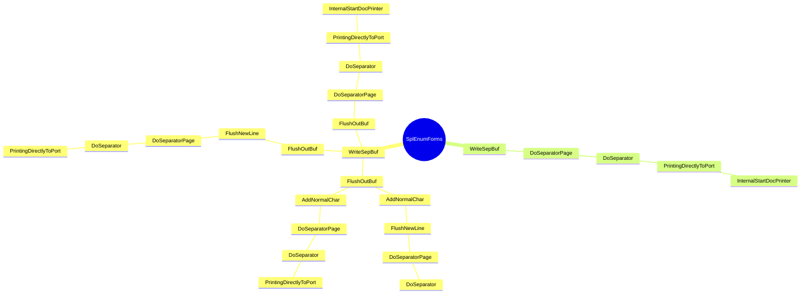

```mermaid
mindmap
root((SplEnumForms))
      LeaveSplSem
        API-MS-WIN-CORE-SYNCH-L1-1-0.DLL::SetEvent
        API-MS-WIN-CORE-PROCESSTHREADS-L1-1-0.DLL::TlsSetValue
        API-MS-WIN-CORE-SYNCH-L1-1-0.DLL::LeaveCriticalSection
        API-MS-WIN-CORE-ERRORHANDLING-L1-1-0.DLL::SetLastError
        API-MS-WIN-CORE-PROCESSTHREADS-L1-1-0.DLL::TlsGetValue
        API-MS-WIN-CORE-ERRORHANDLING-L1-1-0.DLL::GetLastError
      FUN_1800521e1
        WPP_SF_qDd
        PrinterNonRegGetHardwareId
        API-MS-WIN-CORE-ERRORHANDLING-L1-1-0.DLL::GetLastError
      API-MS-WIN-CORE-SYNCH-L1-1-0.DLL::SetEvent
      API-MS-WIN-CORE-FILE-L1-1-0.DLL::GetFileSizeEx
      operator_struct__INIMONITOR*___ptr64
      CheckJobStatusChange
        API-MS-WIN-CORE-PROFILE-L1-1-0.DLL::QueryPerformanceCounter
      SetPrinterChange
        API-MS-WIN-CORE-SYNCH-L1-1-0.DLL::SetEvent
        SPOOLSS.DLL::PartialReplyPrinterChangeNotification
        SPOOLSS.DLL::DllFreeSplMem
        SPOOLSS.DLL::ReplyPrinterChangeNotification
        GetInfoData
        MapToPrinterQueueStatus
        UpdatePrinterIni
      WPP_SF_
        NTDLL.DLL::EtwTraceMessage
      API-MS-WIN-CORE-SYNCH-L1-1-0.DLL::EnterCriticalSection
      API-MS-WIN-CORE-SYNCH-L1-1-0.DLL::LeaveCriticalSection
      KERNEL32.DLL::GetTickCount64
      API-MS-WIN-CORE-PROCESSTHREADS-L1-1-0.DLL::GetCurrentThreadId
      StopTimer
        WPP_SF_
        API-MS-WIN-CORE-THREADPOOL-L1-2-0.DLL::SetThreadpoolTimer
        API-MS-WIN-CORE-THREADPOOL-L1-2-0.DLL::WaitForThreadpoolTimerCallbacks
        API-MS-WIN-CORE-THREADPOOL-L1-2-0.DLL::CloseThreadpoolTimer
      ~Completer
        get
        <lambda_invoker_cdecl>
        _guard_xfg_dispatch_icall_nop
      atexit
        _onexit
      API-MS-WIN-CORE-SYNCH-L1-2-0.DLL::InitOnceBeginInitialize
      _tlgWriteTransfer_EventWriteTransfer
        API-MS-WIN-EVENTING-PROVIDER-L1-1-0.DLL::EventWriteTransfer
      __security_check_cookie
        __report_gsfailure
      _guard_dispatch_icall
      API-MS-WIN-CORE-PROFILE-L1-1-0.DLL::QueryPerformanceCounter
      API-MS-WIN-CORE-SYNCH-L1-1-0.DLL::SetEvent
      memcpy
        MSVCRT.DLL::memcpy
      API-MS-WIN-CORE-SYNCH-L1-1-0.DLL::WaitForSingleObject
      API-MS-WIN-CORE-PROCESSTHREADS-L1-1-0.DLL::TlsGetValue
      API-MS-WIN-CORE-SYNCH-L1-1-0.DLL::SetEvent
      API-MS-WIN-CORE-SYNCH-L1-1-0.DLL::ResetEvent
      API-MS-WIN-CORE-SYNCH-L1-1-0.DLL::EnterCriticalSection
      API-MS-WIN-CORE-ERRORHANDLING-L1-1-0.DLL::SetLastError
      API-MS-WIN-CORE-SYNCH-L1-1-0.DLL::LeaveCriticalSection
      API-MS-WIN-CORE-ERRORHANDLING-L1-1-0.DLL::GetLastError
      API-MS-WIN-CORE-SYNCH-L1-2-0.DLL::Sleep
      API-MS-WIN-CORE-PROCESSTHREADS-L1-1-0.DLL::TlsSetValue
      RetainJob
        CheckJobStatusChange
        PrinterNonRegGetHardwareId
        WPP_SF_qDSSSD
        SetPrinterChange
      ~_TELEMETRY_JOB_INFO
        SPOOLSS.DLL::DllFreeSplStr
        API-MS-WIN-CORE-ERRORHANDLING-L1-1-0.DLL::SetLastError
        API-MS-WIN-CORE-ERRORHANDLING-L1-1-0.DLL::GetLastError
      SPOOLSS.DLL::DllFreeSplStr
      SetLocalJob
        CheckDataTypes
        ValidateJobTimes
        CheckJobStatusChange
        DeleteJobCheck
        IsXPS2GDI
        WriteShadowJob
        ValidateObjectAccess
        FUN_18000bbb3
        AccessGranted
        IsXpsPrintProcessor
        SetJobPosition
        FindIniKey
        UpdateString
        CircularChainedJobsList
        PrinterNonRegGetHardwareId
        AllowAccessToLocalSystemAndDelegatedPrintAdmins
        WPP_SF_dD
        MapJobStatus
        FindJob
        MSVCRT.DLL::_wcsicmp
        API-MS-WIN-CORE-ERRORHANDLING-L1-1-0.DLL::GetLastError
        GMT2AdjustedGMTIfDST
        SetPrinterChange
      IsXPS2GDI
        MSVCRT.DLL::_wcsicmp
      __security_check_cookie
        __report_gsfailure
      ValidateObjectAccess
        API-MS-WIN-CORE-HANDLE-L1-1-0.DLL::CloseHandle
        ValidateObjectAccessWithToken
        GetTokenHandle
      API-MS-WIN-CORE-ERRORHANDLING-L1-1-0.DLL::SetLastError
      DeleteJob
      GetIniPrintProc
        IsXPS2GDI
      ShouldGetMasqDataForHandle
      WPP_SF_dDD
        NTDLL.DLL::EtwTraceMessage
      ResumeJob
        CheckJobStatusChange
        EnterSplSem
        API-MS-WIN-CORE-SYNCH-L1-1-0.DLL::EnterCriticalSection
        WriteShadowJob
        WPP_SF_SD
        ControlPrintProcessor
        API-MS-WIN-CORE-SYNCH-L1-1-0.DLL::LeaveCriticalSection
        GetIniPrintProc
        API-MS-WIN-CORE-SYNCH-L1-1-0.DLL::SetEvent
        LeaveSplSem
        PrinterNonRegGetHardwareId
        LogJobInfo
        GetSpoolerNumericPolicy
      PauseJob
        CheckJobStatusChange
        LeaveSplSem
        EnterSplSem
        API-MS-WIN-CORE-SYNCH-L1-1-0.DLL::EnterCriticalSection
        PrinterNonRegGetHardwareId
        WPP_SF_SD
        WriteShadowJob
        ControlPrintProcessor
        LogJobInfo
        API-MS-WIN-CORE-SYNCH-L1-1-0.DLL::LeaveCriticalSection
        GetSpoolerNumericPolicy
        GetIniPrintProc
      FindJob
      CheckJobStatusChange
        API-MS-WIN-CORE-PROFILE-L1-1-0.DLL::QueryPerformanceCounter
      DeleteJobCheck
        DeleteJob
      EnterSplSem
        API-MS-WIN-CORE-PROCESSTHREADS-L1-1-0.DLL::TlsGetValue
        API-MS-WIN-CORE-SYNCH-L1-1-0.DLL::SetEvent
        API-MS-WIN-CORE-SYNCH-L1-1-0.DLL::WaitForSingleObject
        API-MS-WIN-CORE-SYNCH-L1-1-0.DLL::ResetEvent
        API-MS-WIN-CORE-SYNCH-L1-1-0.DLL::EnterCriticalSection
        API-MS-WIN-CORE-ERRORHANDLING-L1-1-0.DLL::SetLastError
        API-MS-WIN-CORE-SYNCH-L1-1-0.DLL::LeaveCriticalSection
        API-MS-WIN-CORE-PROCESSTHREADS-L1-1-0.DLL::TlsSetValue
        API-MS-WIN-CORE-ERRORHANDLING-L1-1-0.DLL::GetLastError
        API-MS-WIN-CORE-SYNCH-L1-2-0.DLL::Sleep
      FindServerJob
        FindJob
      RestartJob
        API-MS-WIN-CORE-SYNCH-L1-1-0.DLL::SetEvent
        SetPortErrorEvent
        CheckJobStatusChange
        SPOOLSS.DLL::DllFreeSplStr
        LeaveSplSem
        EnterSplSem
        SeekPrinterSetEvent
        FindIniKey
        SetPrinterChange
        _guard_xfg_dispatch_icall_nop
      memset
        MSVCRT.DLL::memset
      ValidRawDatatype
        MSVCRT.DLL::_wcsnicmp
      IsXPS2GDI
        MSVCRT.DLL::_wcsicmp
      ValidateSpoolHandle
        API-MS-WIN-CORE-ERRORHANDLING-L1-1-0.DLL::SetLastError
      API-MS-WIN-CORE-PROCESSTHREADS-L1-1-0.DLL::TlsGetValue
      ReleaseJob
        WPP_SF_qDSSSD
        PrinterNonRegGetHardwareId
        WPP_SF_qDSSS
        ReleaseRetainedRef
        SetPrinterChange
      SPOOLSS.DLL::SetJobW
      LogSetJobCompleted
        Write<struct__tlgWrapperByVal<8>,struct__tlgWrapperByVal<4>,struct__tlgWrapperByRef<16>,struct__tlgWrapperByVal<4>,struct__tlgWrapSz<unsigned_short>,struct__tlgWrapSz<unsigned_short>,struct__tlgWrapperByVal<4>,struct__tlgWrapperByVal<4>,struct__tlgWrapperByVal<4>,struct__tlgWrapSz<unsigned_short>,struct__tlgWrapSz<unsigned_short>,struct__tlgWrapperByVal<4>,struct__tlgWrapperByVal<4>,struct__tlgWrapperByVal<4>,struct__tlgWrapperByVal<4>,struct__tlgWrapperByVal<4>_>
        <lambda_invoker_cdecl>
        _tlgKeywordOn
        get
      LeaveSplSem
        API-MS-WIN-CORE-SYNCH-L1-1-0.DLL::SetEvent
        API-MS-WIN-CORE-PROCESSTHREADS-L1-1-0.DLL::TlsGetValue
        API-MS-WIN-CORE-ERRORHANDLING-L1-1-0.DLL::SetLastError
        API-MS-WIN-CORE-SYNCH-L1-1-0.DLL::LeaveCriticalSection
        API-MS-WIN-CORE-ERRORHANDLING-L1-1-0.DLL::GetLastError
        API-MS-WIN-CORE-PROCESSTHREADS-L1-1-0.DLL::TlsSetValue
      SplLogJobDiagEvent
        __security_check_cookie
        NTDLL.DLL::EtwEventEnabled
        NTDLL.DLL::EtwEventWrite
      PrinterNonRegGetHardwareId
        StringCbCopyW
        ~CoalescedSleep
        API-MS-WIN-CORE-SYNCH-L1-1-0.DLL::InitializeCriticalSectionAndSpinCount
        InitPreferMultithreaded
        EnterSplSem
        WPP_SF_SSd
        operator_new
        TRefPtrCOM<struct_IBidiRequest>
        Wait
        Reset
        WPP_SF_Sd
        vFree
        Update
        LeaveSplSem
        StatusFromHResult
        GetLastErrorAsFailHR
        API-MS-WIN-CORE-COM-L1-1-0.DLL::CoTaskMemFree
        API-MS-WIN-CORE-COM-L1-1-0.DLL::CoUninitialize
        `vector_constructor_iterator'
        MSVCRT.DLL::_wcsicmp
        _guard_xfg_dispatch_icall_nop
        API-MS-WIN-CORE-COM-L1-1-0.DLL::CoCreateInstance
        WPP_SF_SS
      API-MS-WIN-CORE-ERRORHANDLING-L1-1-0.DLL::GetLastError
      SetPrinterChange
        API-MS-WIN-CORE-SYNCH-L1-1-0.DLL::SetEvent
        SPOOLSS.DLL::PartialReplyPrinterChangeNotification
        SPOOLSS.DLL::DllFreeSplMem
        SPOOLSS.DLL::ReplyPrinterChangeNotification
        GetInfoData
        MapToPrinterQueueStatus
        UpdatePrinterIni
      SPOOLSS.DLL::AllocSplStr
      WPP_SF_SS
        NTDLL.DLL::EtwTraceMessage
      MSVCRT.DLL::_wcsnicmp
      SetPortErrorEvent
        API-MS-WIN-CORE-SYNCH-L1-1-0.DLL::SetEvent
      CheckJobStatusChange
        API-MS-WIN-CORE-PROFILE-L1-1-0.DLL::QueryPerformanceCounter
      LeaveSplSem
        API-MS-WIN-CORE-SYNCH-L1-1-0.DLL::SetEvent
        API-MS-WIN-CORE-PROCESSTHREADS-L1-1-0.DLL::TlsGetValue
        API-MS-WIN-CORE-ERRORHANDLING-L1-1-0.DLL::SetLastError
        API-MS-WIN-CORE-SYNCH-L1-1-0.DLL::LeaveCriticalSection
        API-MS-WIN-CORE-ERRORHANDLING-L1-1-0.DLL::GetLastError
        API-MS-WIN-CORE-PROCESSTHREADS-L1-1-0.DLL::TlsSetValue
      EnterSplSem
        API-MS-WIN-CORE-PROCESSTHREADS-L1-1-0.DLL::TlsGetValue
        API-MS-WIN-CORE-SYNCH-L1-1-0.DLL::SetEvent
        API-MS-WIN-CORE-SYNCH-L1-1-0.DLL::WaitForSingleObject
        API-MS-WIN-CORE-SYNCH-L1-1-0.DLL::EnterCriticalSection
        API-MS-WIN-CORE-SYNCH-L1-1-0.DLL::ResetEvent
        API-MS-WIN-CORE-ERRORHANDLING-L1-1-0.DLL::SetLastError
        API-MS-WIN-CORE-SYNCH-L1-1-0.DLL::LeaveCriticalSection
        API-MS-WIN-CORE-ERRORHANDLING-L1-1-0.DLL::GetLastError
        API-MS-WIN-CORE-PROCESSTHREADS-L1-1-0.DLL::TlsSetValue
        API-MS-WIN-CORE-SYNCH-L1-2-0.DLL::Sleep
      PrinterNonRegGetHardwareId
        StringCbCopyW
        ~CoalescedSleep
        API-MS-WIN-CORE-SYNCH-L1-1-0.DLL::InitializeCriticalSectionAndSpinCount
        InitPreferMultithreaded
        EnterSplSem
        WPP_SF_SSd
        operator_new
        TRefPtrCOM<struct_IBidiRequest>
        Wait
        Reset
        WPP_SF_Sd
        vFree
        Update
        LeaveSplSem
        StatusFromHResult
        GetLastErrorAsFailHR
        API-MS-WIN-CORE-COM-L1-1-0.DLL::CoTaskMemFree
        API-MS-WIN-CORE-COM-L1-1-0.DLL::CoUninitialize
        `vector_constructor_iterator'
        MSVCRT.DLL::_wcsicmp
        _guard_xfg_dispatch_icall_nop
        API-MS-WIN-CORE-COM-L1-1-0.DLL::CoCreateInstance
        WPP_SF_SS
      API-MS-WIN-CORE-ERRORHANDLING-L1-1-0.DLL::SetLastError
      Release
        _guard_xfg_dispatch_icall_nop
      SeekPrinterSetEvent
        API-MS-WIN-CORE-SYNCH-L1-1-0.DLL::SetEvent
        API-MS-WIN-CORE-FILE-L1-1-0.DLL::GetFileSizeEx
      API-MS-WIN-CORE-ERRORHANDLING-L1-1-0.DLL::GetLastError
      WPP_SF_D
        NTDLL.DLL::EtwTraceMessage
      API-MS-WIN-CORE-SYNCH-L1-2-0.DLL::Sleep
      SetPrinterChange
        API-MS-WIN-CORE-SYNCH-L1-1-0.DLL::SetEvent
        SPOOLSS.DLL::PartialReplyPrinterChangeNotification
        SPOOLSS.DLL::DllFreeSplMem
        SPOOLSS.DLL::ReplyPrinterChangeNotification
        GetInfoData
        MapToPrinterQueueStatus
        UpdatePrinterIni
      NTDLL.DLL::EtwTraceMessage
      MSVCRT.DLL::_wcsicmp
      API-MS-WIN-CORE-SYNCH-L1-2-0.DLL::InitOnceBeginInitialize
      _guard_xfg_dispatch_icall_nop
        _guard_dispatch_icall
      API-MS-WIN-CORE-ERRORHANDLING-L1-1-0.DLL::SetLastError
      API-MS-WIN-CORE-SYNCH-L1-1-0.DLL::SetEvent
      API-MS-WIN-CORE-PROCESSTHREADS-L1-1-0.DLL::TlsGetValue
      API-MS-WIN-CORE-SYNCH-L1-1-0.DLL::LeaveCriticalSection
      API-MS-WIN-CORE-ERRORHANDLING-L1-1-0.DLL::GetLastError
      API-MS-WIN-CORE-PROCESSTHREADS-L1-1-0.DLL::TlsSetValue
      NTDLL.DLL::EtwTraceMessage
      StringCbCopyW
      ~CoalescedSleep
        API-MS-WIN-CORE-HANDLE-L1-1-0.DLL::CloseHandle
        API-MS-WIN-CORE-THREADPOOL-L1-2-0.DLL::CloseThreadpoolTimer
        API-MS-WIN-CORE-SYNCH-L1-1-0.DLL::DeleteCriticalSection
      API-MS-WIN-CORE-SYNCH-L1-1-0.DLL::InitializeCriticalSectionAndSpinCount
      InitPreferMultithreaded
        API-MS-WIN-CORE-COM-L1-1-0.DLL::CoInitializeEx
      EnterSplSem
        API-MS-WIN-CORE-SYNCH-L1-1-0.DLL::SetEvent
        API-MS-WIN-CORE-SYNCH-L1-1-0.DLL::WaitForSingleObject
        API-MS-WIN-CORE-SYNCH-L1-1-0.DLL::EnterCriticalSection
        API-MS-WIN-CORE-SYNCH-L1-1-0.DLL::ResetEvent
        API-MS-WIN-CORE-ERRORHANDLING-L1-1-0.DLL::SetLastError
        API-MS-WIN-CORE-SYNCH-L1-1-0.DLL::LeaveCriticalSection
        API-MS-WIN-CORE-PROCESSTHREADS-L1-1-0.DLL::TlsGetValue
        API-MS-WIN-CORE-ERRORHANDLING-L1-1-0.DLL::GetLastError
        API-MS-WIN-CORE-SYNCH-L1-2-0.DLL::Sleep
        API-MS-WIN-CORE-PROCESSTHREADS-L1-1-0.DLL::TlsSetValue
      WPP_SF_SSd
        NTDLL.DLL::EtwTraceMessage
      operator_new
        malloc
        _callnewh
      TRefPtrCOM<struct_IBidiRequest>
      Wait
        API-MS-WIN-CORE-COM-L1-1-0.DLL::CoWaitForMultipleHandles
        SleepTimerCallback
        API-MS-WIN-CORE-THREADPOOL-L1-2-0.DLL::SetThreadpoolTimer
        API-MS-WIN-CORE-SYNCH-L1-1-0.DLL::EnterCriticalSection
        API-MS-WIN-CORE-THREADPOOL-L1-2-0.DLL::CreateThreadpoolTimer
        API-MS-WIN-CORE-SYNCH-L1-1-0.DLL::CreateEventW
        API-MS-WIN-CORE-SYNCH-L1-1-0.DLL::LeaveCriticalSection
        API-MS-WIN-CORE-ERRORHANDLING-L1-1-0.DLL::GetLastError
        API-MS-WIN-CORE-PROCESSTHREADS-L1-1-0.DLL::GetCurrentThreadId
      Reset
        operator_delete
        `vector_destructor_iterator'
        ~TRefPtrCOM<struct_IBidiRequest>
      WPP_SF_Sd
        NTDLL.DLL::EtwTraceMessage
      vFree
        operator_delete
      Update
        FUN_180055b38
        FUN_18001fe54
        operator_delete
        operator_new
      LeaveSplSem
        API-MS-WIN-CORE-SYNCH-L1-1-0.DLL::SetEvent
        API-MS-WIN-CORE-ERRORHANDLING-L1-1-0.DLL::SetLastError
        API-MS-WIN-CORE-PROCESSTHREADS-L1-1-0.DLL::TlsGetValue
        API-MS-WIN-CORE-SYNCH-L1-1-0.DLL::LeaveCriticalSection
        API-MS-WIN-CORE-ERRORHANDLING-L1-1-0.DLL::GetLastError
        API-MS-WIN-CORE-PROCESSTHREADS-L1-1-0.DLL::TlsSetValue
      StatusFromHResult
      GetLastErrorAsFailHR
        API-MS-WIN-CORE-ERRORHANDLING-L1-1-0.DLL::GetLastError
      API-MS-WIN-CORE-COM-L1-1-0.DLL::CoTaskMemFree
      API-MS-WIN-CORE-COM-L1-1-0.DLL::CoUninitialize
      `vector_constructor_iterator'
        _guard_xfg_dispatch_icall_nop
      MSVCRT.DLL::_wcsicmp
      _guard_xfg_dispatch_icall_nop
        _guard_dispatch_icall
      API-MS-WIN-CORE-COM-L1-1-0.DLL::CoCreateInstance
      WPP_SF_SS
        NTDLL.DLL::EtwTraceMessage
      API-MS-WIN-CORE-SYNCH-L1-1-0.DLL::SetEvent
      API-MS-WIN-CORE-SYNCH-L1-1-0.DLL::WaitForSingleObject
      API-MS-WIN-CORE-SYNCH-L1-1-0.DLL::EnterCriticalSection
      API-MS-WIN-CORE-SYNCH-L1-1-0.DLL::ResetEvent
      API-MS-WIN-CORE-ERRORHANDLING-L1-1-0.DLL::SetLastError
      API-MS-WIN-CORE-SYNCH-L1-1-0.DLL::LeaveCriticalSection
      API-MS-WIN-CORE-PROCESSTHREADS-L1-1-0.DLL::TlsGetValue
      API-MS-WIN-CORE-ERRORHANDLING-L1-1-0.DLL::GetLastError
      API-MS-WIN-CORE-PROCESSTHREADS-L1-1-0.DLL::TlsSetValue
      API-MS-WIN-CORE-SYNCH-L1-2-0.DLL::Sleep
      SPOOLSS.DLL::PartialReplyPrinterChangeNotification
      SPOOLSS.DLL::DllFreeSplMem
      SPOOLSS.DLL::ReplyPrinterChangeNotification
      GetInfoData
        SPOOLSS.DLL::DllAllocSplMem
        CanUserSeeRealDocName
        GetPrinterPorts
        FindJob
        API-MS-WIN-SECURITY-BASE-L1-1-0.DLL::GetSecurityDescriptorLength
      MapToPrinterQueueStatus
      UpdatePrinterIni
        API-MS-WIN-CORE-REGISTRY-L1-1-0.DLL::RegCloseKey
        FreeClonedIniPrinterWithMask
        SplDeleteSpooler
        SPOOLSS.DLL::DllFreeSplStr
        SPOOLSS.DLL::ImpersonatePrinterClient
        API-MS-WIN-CORE-SYSINFO-L1-1-0.DLL::GetTickCount
        API-MS-WIN-CORE-ERRORHANDLING-L1-1-0.DLL::SetLastError
        PrinterCreateKey
        WPP_SF_qd
        SubChar
        CloneIniSpooler
        RegSetString
        GetPrinterPorts
        SPOOLSS.DLL::DllFreeSplMem
        NTDLL.DLL::RtlLengthSid
        _guard_xfg_dispatch_icall_nop
        LogPrinterStatusChange
        SPOOLSS.DLL::DllAllocSplMem
        EnterSplSem
        API-MS-WIN-CORE-SYNCH-L1-1-0.DLL::EnterCriticalSection
        LeaveSplSemAndResetCount
        API-MS-WIN-CORE-SYNCH-L1-1-0.DLL::LeaveCriticalSection
        WPP_SF_D
        RegSetDWord
        LeaveSplSem
        SPOOLSS.DLL::RevertToPrinterSelf
        PrinterNonRegGetHardwareId
        RegSetBinaryData
        EnterSplSemAndRestoreCount
        API-MS-WIN-CORE-ERRORHANDLING-L1-1-0.DLL::GetLastError
        CloneIniPrinter
        SPOOLSS.DLL::AllocSplStr
        API-MS-WIN-SECURITY-BASE-L1-1-0.DLL::GetSecurityDescriptorLength
      SetPrinterChange
      FUN_180002c74
      API-MS-WIN-CORE-SYNCH-L1-1-0.DLL::SetEvent
      API-MS-WIN-CORE-SYNCH-L1-1-0.DLL::WaitForSingleObject
      API-MS-WIN-CORE-SYNCH-L1-1-0.DLL::EnterCriticalSection
      API-MS-WIN-CORE-ERRORHANDLING-L1-1-0.DLL::SetLastError
      API-MS-WIN-CORE-PROCESSTHREADS-L1-1-0.DLL::TlsGetValue
      API-MS-WIN-CORE-SYNCH-L1-1-0.DLL::LeaveCriticalSection
      API-MS-WIN-CORE-SYNCH-L1-1-0.DLL::ResetEvent
      API-MS-WIN-CORE-ERRORHANDLING-L1-1-0.DLL::GetLastError
      API-MS-WIN-CORE-PROCESSTHREADS-L1-1-0.DLL::TlsSetValue
      API-MS-WIN-CORE-SYNCH-L1-2-0.DLL::Sleep
      FUN_1800031e4
        API-MS-WIN-CORE-STRING-L2-1-1.DLL::SHLoadIndirectString
        FUN_180053454
      MSVCRT.DLL::_wtoi
      SPOOLSS.DLL::DllFreeSplStr
      MSVCRT.DLL::wcschr
      SPOOLSS.DLL::AllocSplStr
      API-MS-WIN-CORE-LOCALIZATION-L1-2-0.DLL::GetThreadUILanguage
      FUN_180002f77
        API-MS-WIN-CORE-STRING-L2-1-1.DLL::SHLoadIndirectString
        SPOOLSS.DLL::PackStrings
        API-MS-WIN-CORE-ERRORHANDLING-L1-1-0.DLL::SetLastError
        SPOOLSS.DLL::DllFreeSplMem
        __security_check_cookie
      SPOOLSS.DLL::DllAllocSplMem
      MSVCRT.DLL::_wtoi
      SPOOLSS.DLL::DllFreeSplStr
      MSVCRT.DLL::wcschr
      SPOOLSS.DLL::PackStrings
      API-MS-WIN-CORE-ERRORHANDLING-L1-1-0.DLL::SetLastError
      memcpy
        MSVCRT.DLL::memcpy
      SPOOLSS.DLL::AllocSplStr
      API-MS-WIN-CORE-LOCALIZATION-L1-2-0.DLL::GetThreadUILanguage
      NTDLL.DLL::EtwTraceMessage
      MSVCRT.DLL::_wtoi
      SPOOLSS.DLL::DllFreeSplStr
      MSVCRT.DLL::wcschr
      API-MS-WIN-CORE-STRING-L2-1-1.DLL::SHLoadIndirectString
      __security_check_cookie
        __report_gsfailure
      API-MS-WIN-CORE-LOCALIZATION-L1-2-0.DLL::GetThreadUILanguage
      SPOOLSS.DLL::AllocSplStr
      API-MS-WIN-CORE-ERRORHANDLING-L1-1-0.DLL::SetLastError
      API-MS-WIN-CORE-SYNCH-L1-1-0.DLL::SetEvent
      API-MS-WIN-CORE-PROCESSTHREADS-L1-1-0.DLL::TlsGetValue
      API-MS-WIN-CORE-SYNCH-L1-1-0.DLL::LeaveCriticalSection
      API-MS-WIN-CORE-PROCESSTHREADS-L1-1-0.DLL::TlsSetValue
      API-MS-WIN-CORE-ERRORHANDLING-L1-1-0.DLL::GetLastError
      StringCbCopyW
      ~CoalescedSleep
        API-MS-WIN-CORE-HANDLE-L1-1-0.DLL::CloseHandle
        API-MS-WIN-CORE-THREADPOOL-L1-2-0.DLL::CloseThreadpoolTimer
        API-MS-WIN-CORE-SYNCH-L1-1-0.DLL::DeleteCriticalSection
      API-MS-WIN-CORE-SYNCH-L1-1-0.DLL::InitializeCriticalSectionAndSpinCount
      InitPreferMultithreaded
        API-MS-WIN-CORE-COM-L1-1-0.DLL::CoInitializeEx
      EnterSplSem
        API-MS-WIN-CORE-SYNCH-L1-1-0.DLL::SetEvent
        API-MS-WIN-CORE-SYNCH-L1-1-0.DLL::WaitForSingleObject
        API-MS-WIN-CORE-SYNCH-L1-1-0.DLL::EnterCriticalSection
        API-MS-WIN-CORE-ERRORHANDLING-L1-1-0.DLL::SetLastError
        API-MS-WIN-CORE-PROCESSTHREADS-L1-1-0.DLL::TlsGetValue
        API-MS-WIN-CORE-SYNCH-L1-1-0.DLL::LeaveCriticalSection
        API-MS-WIN-CORE-SYNCH-L1-1-0.DLL::ResetEvent
        API-MS-WIN-CORE-ERRORHANDLING-L1-1-0.DLL::GetLastError
        API-MS-WIN-CORE-PROCESSTHREADS-L1-1-0.DLL::TlsSetValue
        API-MS-WIN-CORE-SYNCH-L1-2-0.DLL::Sleep
      WPP_SF_SSd
        NTDLL.DLL::EtwTraceMessage
      operator_new
        malloc
        _callnewh
      TRefPtrCOM<struct_IBidiRequest>
      Wait
        API-MS-WIN-CORE-THREADPOOL-L1-2-0.DLL::CreateThreadpoolTimer
        API-MS-WIN-CORE-SYNCH-L1-1-0.DLL::EnterCriticalSection
        API-MS-WIN-CORE-THREADPOOL-L1-2-0.DLL::SetThreadpoolTimer
        API-MS-WIN-CORE-SYNCH-L1-1-0.DLL::CreateEventW
        API-MS-WIN-CORE-SYNCH-L1-1-0.DLL::LeaveCriticalSection
        API-MS-WIN-CORE-ERRORHANDLING-L1-1-0.DLL::GetLastError
        API-MS-WIN-CORE-PROCESSTHREADS-L1-1-0.DLL::GetCurrentThreadId
        SleepTimerCallback
        API-MS-WIN-CORE-COM-L1-1-0.DLL::CoWaitForMultipleHandles
      Reset
        operator_delete
        `vector_destructor_iterator'
        ~TRefPtrCOM<struct_IBidiRequest>
      WPP_SF_Sd
        NTDLL.DLL::EtwTraceMessage
      vFree
        operator_delete
      Update
        FUN_180055b38
        FUN_18001fe54
        operator_delete
        operator_new
      LeaveSplSem
        API-MS-WIN-CORE-SYNCH-L1-1-0.DLL::SetEvent
        API-MS-WIN-CORE-ERRORHANDLING-L1-1-0.DLL::SetLastError
        API-MS-WIN-CORE-PROCESSTHREADS-L1-1-0.DLL::TlsGetValue
        API-MS-WIN-CORE-SYNCH-L1-1-0.DLL::LeaveCriticalSection
        API-MS-WIN-CORE-PROCESSTHREADS-L1-1-0.DLL::TlsSetValue
        API-MS-WIN-CORE-ERRORHANDLING-L1-1-0.DLL::GetLastError
      StatusFromHResult
      GetLastErrorAsFailHR
        API-MS-WIN-CORE-ERRORHANDLING-L1-1-0.DLL::GetLastError
      API-MS-WIN-CORE-COM-L1-1-0.DLL::CoTaskMemFree
      API-MS-WIN-CORE-COM-L1-1-0.DLL::CoUninitialize
      `vector_constructor_iterator'
        _guard_xfg_dispatch_icall_nop
      MSVCRT.DLL::_wcsicmp
      _guard_xfg_dispatch_icall_nop
        _guard_dispatch_icall
      API-MS-WIN-CORE-COM-L1-1-0.DLL::CoCreateInstance
      WPP_SF_SS
        NTDLL.DLL::EtwTraceMessage
      StringCchCopyA
      StringCbCopyW
      SPOOLSS.DLL::DllAllocSplMem
      API-MS-WIN-CORE-REGISTRY-L1-1-0.DLL::RegCloseKey
      HashName
        API-MS-WIN-CORE-STRING-L2-1-0.DLL::CharLowerW
      SplRegEnumValue
        PrinterNonRegGetHardwareId
        WPP_SF_D
        API-MS-WIN-CORE-REGISTRY-L1-1-0.DLL::RegEnumValueW
      CreateNode
        SPOOLSS.DLL::DllAllocSplMem
        SPOOLSS.DLL::AllocSplStr
      ValidateFormAccess
        ValidateAccess
        SPOOLSS.DLL::CheckLocalCall
        API-MS-WIN-CORE-ERRORHANDLING-L1-1-0.DLL::SetLastError
      FreeLangPair
        SPOOLSS.DLL::DllFreeSplStr
        SPOOLSS.DLL::DllFreeSplMem
      RegistryGetFormInfo2
        API-MS-WIN-CORE-REGISTRY-L1-1-0.DLL::RegCloseKey
        SPOOLSS.DLL::DllAllocSplMem
        MSVCRT.DLL::_wtoi
        API-MS-WIN-CORE-REGISTRY-L1-1-0.DLL::RegQueryValueExW
        SplRegEnumValue
        CreateNode
        WPP_SF_SD
        FreeLangPair
        __security_check_cookie
        WPP_SF_D
        API-MS-WIN-CORE-REGISTRY-L1-1-0.DLL::RegOpenKeyExW
        PrinterNonRegGetHardwareId
        SPOOLSS.DLL::DllFreeSplMem
        memset
      CreateIniFormInternal
        CreateIniForm
      __security_check_cookie
        __report_gsfailure
      API-MS-WIN-CORE-LOCALIZATION-L1-2-0.DLL::GetThreadUILanguage
      API-MS-WIN-CORE-REGISTRY-L1-1-0.DLL::RegOpenKeyExW
      BuildResourceName
        StringCchCopyW
        SPOOLSS.DLL::DllAllocSplMem
        StringCchPrintfW
        __security_check_cookie
      SPOOLSS.DLL::DllFreeSplMem
      API-MS-WIN-CORE-LIBRARYLOADER-L1-2-0.DLL::LoadStringW

```