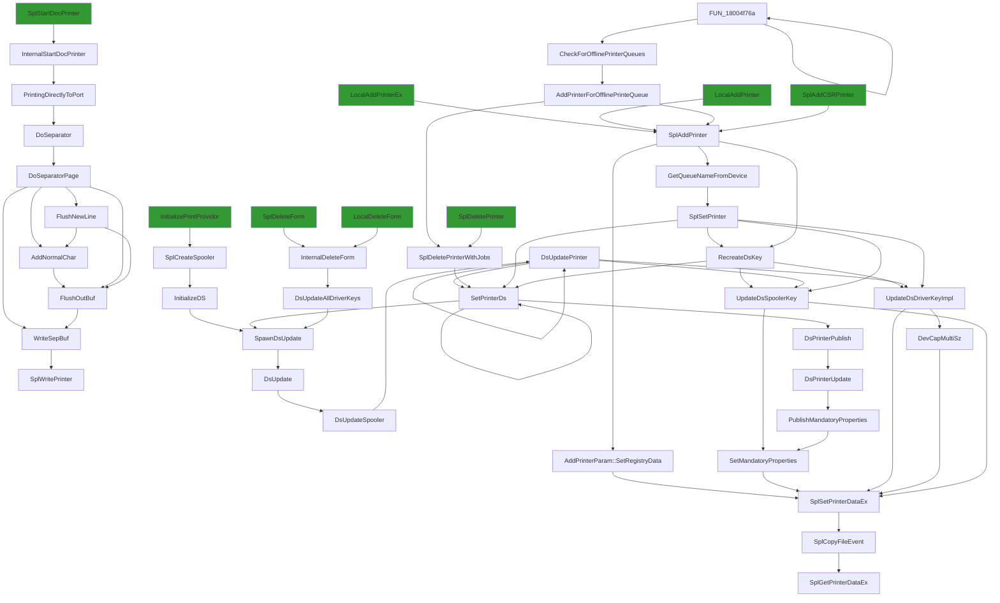
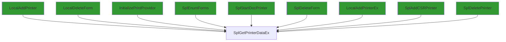

# SplGetPrinterDataEx

## Calling

Functions that call `SplGetPrinterDataEx`.

### Flowchart 

[Edit on mermaid live](https://mermaid.live/edit#pako:eNqFVW1P2zAQ_itV9nVITZymLx8msYYiNug6AkLaOk0mubYWbhw5TllB_Ped7cRJKWPfIt_bc889d3n2UpGBN-l5Ky4e0w2VqncTL_OU07KMYdUrNzSDrLdinE8-EDIeE7LMxz-XXlLwRKF7LNKFZLkCufR-TSaTOuDk5FNvtMxJgK6XIqX8NMtqv7M_R57BYJkHI_PphxjVt5_BMvcj6-BjnrisMyyqe87KDaZBB6LBgLqieUaVkPuFFAVIxaBEe5tnYBLcFugELWBXMojQPt1A-jAT8ttqxVneuH2voGqTBegc9i0BUwmYLSmE4G02MsZqQ1d4hK4XOk1O3yDMuA2xfIhuLUWvMRgIDoFuJ6hHAKoOiamihllbuY8s-sfcv8n8wOLGvnwDlilGOXuytZHOHcvEcWSoS1jUcyG3lE9RPQ4jZtWEiwQKKvVcFnTtOgibmkE79qGekf0cuLH7EdYY2VZj4KAAmdkeQSHo5o87A3Y0oASDupS2n4MyVM7pFmZSbGPYsRSMjsLQjYyMD2iIE9eVbjnqDPQAk4WC4En4ejgugcZDuv38cy4ax7AZ4H96tx32WwZ1oGUiLmPJdiC_wv5iW3C7MmHHXKsX7Y40ovVYq8NiPRAQcqXVVy_he3uHiTQSE8rydcwkpIrvb8RCSNV4RS3syK5yo-jSFAt8qxni1irU-HF0U1pcVVyx5Mk4krBVUnh0QJCdIHiD-TumNl_EfQtaS657LE45dxSWB0oI3fUISfc8HWow1CBGnYSv7oWWe3S4K40JLbrVGa_KzRweL_EeOJ219RGwvkd3kmFuKD5XK5fa9mss3fkFlsdAHx6N7BpSc8nisiuDqN0dfcmJk8I0uX7vnARji1Dz4rZc62B2O__tj_r9cDWMqGNSl7H3lD7mRwuMxzRoKPhWqU5zWu7NHRbFfsY4nO0gd7ry6-7Pj0-ka4z0D87uAunfTiYowWtYs1LJvQ4xAd7HnrcFPHMsw7_ls6c2sDX_zYzKB-8FrZUBfpYxHCAalKwAX2mlRLLP0_bF-sWMrrFY-wwm8Kr-G5u_Mr4WNP8hROP28hdlqGa1)



### Entrypoints

A condensed view, showing only entrypoints to the callgraph.



### Mindmap

[Edit calling Mindmap](https://mermaid.live/edit#pako:eNrlV01v2zAM_SuGTy2wX5DbFidDsSb16g0Dhl40m4mFypJAS9m8ov99tOwgn5ZidFgO05F8Ih_JZ0l-iXNVQDyJ4orLomL6SaJS5uYm0-IjmBS5NIAJM2z26_b2SUZufUNuIAP9wa62piiaC1uXD9YcGKPofVEsFVZMTEuG-45-xxJ-3nMJh54oShTFZ8iMwpStT9wHgAvTBUIOBOyWawSX64Qj5EY0X1Sq0ASLH67wCmS8KT0JQ-m2666VimQiMwxNovJePF7ReDgNMrqMT4AN6XuqdDPnAmYbkHvbyZMdKX8_NvkWTBYtrSZFpQENh_ow-1dNfkjqTCslAD9BczLfusMcsToF9CHGxn-EHMFhzjhdjfShDCQP7931Zywvz-Z20ZHz2YKFJatgjqpKYMNzGNv-1P4QvC6DuLbLPZWO-bkx9IA-5sUyCbUiIADv-PcBY3J6B-uVhDtXe99c4cNqJehE6wxuYCOihVi8TR-hHngThMN7q7tQEgnyjWN2V2nx71ThSfs_CcPThitqg6JNmV5YYXj2-_yh6iH-t-4Tb4rrXileam8UR2A2u7JSeo5UkwmBH2HNa4NNiz4R0XAfRn4sUTQtIX8-xqID19688Tt60gM9hHlBr_uX2JRQuXd-wfA5fiWvdZ2dFZyuSHIYtEBWZo3KGpnvLB0u4WxNxe_M4DYu-r8H9xdBVs3kd6W2sNc_4xmTqQ==)

## Called

Functions that `SplGetPrinterDataEx` calls

### Flowchart

[Edit on mermaid live](https://mermaid.live/edit#pako:eNrNfWtvG8ly9l9ZOB8CBHEw3T1XY7GALNI2z9HtkPIqe7IvmBE5lCYezdBD0rJOkPPb05eqvswUvVTefAgQnGgtitPTl6qnnnqq-j_frLp19ebdT282Tfe8eiz7_U8X89_bVVPudpNq89PusVxX6582ddO8-wchikKI31v5_396-_aXn0Qs_u33N5uufy779U29OmuabvX7m__3e8tzrj_Bst_bWOT650S8e_fOfJ_8xyQ1H4hT7195pP-R55n83nnVVOWu-lN3r78yZon-ZcxS-cvFtplXD385VP3Lr2VzqMxTi9h8KU-8L03gDxPG5H9Ewnwkka8RC3iNTP0CRqm__u7mZrn4sPz6dbHW3wzjkr_58PlqyfIoithqk5uBicz8lqf-1yTyw9fbqr3s2nrf9R_k_80upjddv9d_xQQMRMT-tKRm3uJCfiL15hBfnjPz8h-r_U1ft_uqn5T70owjMqPM_S9kMKXqC-PILFvhfyCBB8qxi9z8nqVR8IGIWCmRm5cWRexPCl9lsRyM_0EzcMGDZebjkXKWEp_kMCTBcBGYXoW6XZuNEewpeJckGFMc3Wd6glLzgDSXv71c_Ho-v_2XycXFu3dPJexbYn8Gm5bB4jKmHnB2M3t7uXh7N7t6e349n76dzufX809nV5OL2dXHtxfsLXsbmQcsqv3n9rFs1021nn5fVdt93bUf6kau3mCyMvMGIlO7R67xYtt1TdXfdE29etEvgRssz4ItjrtO7WRmviSJ5IhzeGf_NYSApwj1GotyU82rch2cIBGpn2HCC_808cSsCE_VTry6lS9oXnK6f55-q9q9PJb1bvRmCey9YNhxYjZHlv_eFszsTXhx2NzquOzMyMCKcFEQcz-ffpwtbue_BdMuR3LeV-W--nP1Mv1-Fw7IvWlOfJ86qsF3fWgOu0e5ZNX7w2ZT9bvBl8UpTIoyiMt98yAf-dz16-s2_GABVi-K5Oek4arXcnjX9_9RrfZnq1W1293V-8fb7kvVgmmBdY3U9y6CMw8_DgyfXn88sIn6j9huhjg3cxzngnjli9n7-dn8t4vrs8l0rt6d47tfdOX6or7vy56aRjjfWeSduTQq88KMDA-t_zcZnPRIL_blLT9b_8dB7pm1_Hm2mSxu9Z8K86eJ8gX__k3OUNcvV1272_cH_XMt376UP_yjeRBDK5wMjvfzatevHgf7ERZMmT0G08L1cfj77YXcvj9rB7i8nbU1HMG7vtxuq_4XMzR864LaPHIjagvA5fZhYAE-qUmcteu6ly-y2Mu1exgMKMaZCsw32H3G0_BBi-n55_ns9re3788W4U6dHLbSWMhtpbfR9PvAwoD_iwMTj_8YF_6zcVMVhfOIk8li4ntENWWz3b_eLPjHyWzgpwtzlM-7dlM_qC2rB6OOcgwTnsKEt18Go0RPFPocM8pC7d7PW3Vy4AzIVTI-FUbM9fGyI55MYD8BatEeXsKVL40CF1flU7W-6Tu5uPuXs74vX4KjJ-GGPLZi7K_iFN9C7QcG5zpWfwl7K0705CyqrTIcN-X-UQGk58qYWpYJCgHB2eDar971cpMv5K-6Z4RBKZhR-Vs1ZHUAluZILJezq9nl9dXs9nr-T8vlcrvv06EzTsGBxf55dCuWAWaBeZVGzMxcCkApVW_0Xp6HD3339Gle7Q7N3j_mge8WMGsB3GBZZE0-Aqc4YeDS1SbZv2wNmoM_58o5mGHrjWgOz3m3fbnr-i_yYA4cDbhCVmQ-UFUDhwGrsd_VreDDkwEOXz-j3B924Uv6EyZwGkUAlJzvLBBlqo24ONyfS2QNsA92dh6cP9g-sY_61KRMJAaW21x6wWm772FnJng4sgBTReODDcMIlsV6gQAk2wEb5P0gfc37upUW38JLZ7UdpFYDdl5FA7OufyoB4Vq0RLmbm_n1-XSxuP00n55NFoEFUzbj0PcSS8hjqZziEJoV9uEwm3E0wiK3fbmqLuUflw_VYKGp08wzgDWxCl7g58Rb6ogHC4ao2jeYAiBM8MHMYnjpj-3P8BMjoD-PI2UAYbILZozopN5tm_JFGSu1LS8P9aRpzHZIAYlH_nZgKTwizQxyODvsO43PPmkcav4UdizXGy9jRPiQjTcQbpU4o3zfb4vZ1Yfr4XreSmt73h3a_dDO50TEgXMuwhcqHKphsAWCsdotrCznRfcARsycZXkA2wd4a1iHWL-AjxSWEio0zwOkwJPIHU547iCasecCZz3zX4eBHcs4YENt1eX-bHcSSS71ogT_FLjREA9YH6bweYwbRnjQi6-KYgMgBV19bAPmaXt4cvEyfsK4LXigirQw-uGp3KscXoqnKY34h4P31wSORHYqelExT7U6yG98mVS7VV9vpYO7qNqH_ePAzsO0B95Fvqr1ybi5Yw0IT0e7OvjoVmfrdT8yPQB6GIL3efkcuCyBeJ37XlVhRLmzVk9bOLAQBKTCt6pqkS7LrfTzZsceCVe0MZVj_HBoGrQGM4MonCWOzZk_755wMt83Zful2gdbK1ErHSXjaUT2RrleeZxgl6XBsbrebJq6rexYXaypJz_FoWjz02_laAweVX-77etdNf1ePW1hQAhL8uBY5Wic1PYudwo2yzms4U9MXKu-frmSAXxbPT8CDQJOL8sIm6JeKeaAO4RayOWyr7bSwS57ZSFWj9Xqy6asm0OPS4oQQh3f-Y00FrHZKNK5TFtFn83aVV89yYNQNsa4mqiTJic08AHoqEkZOMXhOUciLMstCBjRHRy-kSfDiGe5XEug2Vbf6yFwgR2SxP7OEw4sryfgGMzscuLkGI99c319ERyb86bbVbeP8s3XKmC6rZ9GFACQPqlnrdimSmJAkLh71KLYKVXIeV5tzlvYKQlDx-tTPCLRXFyw3ojI1XwD1BZREE4AUhQ8-K5KWsXwuxg8VHgxdB44LGtq1Dfdm9gENiNMMgGBZdypw59JX39TbqqDHceBncmZOokOBOOCJXmAGhgGiJQH1W4CAuNUOU60-MrKI4oLBlcUYxgpGLq93BnecDJ5DOdLY_ml3XwyYDGPT4vhJvVObRDxFn4ohTaA-WSI2SHSkLTlgAhV1tBSrDGCrwCmoz9X6A5hljbFDENadebkAuILiIKiRREuMaFYlpjA2fCBlBELI4NjNRIgHnTMsWy61RdD8QGBJ1KuhkgE7Fnm4DdAUUHR6LFvPc6VaQMoD0EYC4w--nxirypLBQGSnp67EiYHiBDNg0Bkdn9e7u8CWqrIAswHRyJXO0LFcTJ8V2HDbaf-d9ZuusCdhDElbGaht5nON1xWT2dN_WAIM8G9mYGoNU6BiDAHTT3gU9VsEWfhAYoZEdyH9G8GQCjidl7l2H-t-l3dtcDOsvGgGTwiwLPW_Aq7XqkP_DlhX7TDToltJZBmU8faReuZWZQruSCKtjxy0LTBfaqedggPLH8Rn8KMKu5YWemBc4JdmQf0ORywggwcrs4_BR5FTu3-ul1V76uHulX_UUvI9bfBcxjGZ5oWnu00LPMIqh8-yr6D2s5y8y3k9m2Ajh0EKsA9CW1RIxsqWozNoldTqua43A1XJXEJILtCifPQC2C6BLIcPtNl1q9AH5nabXq2lw-7P-wrA9UEWBhWMConp0wvs2kf9grsrjGeOmGKBTCHIniAwASN56OIWMqMwL5jas4vBi6Uo0sJrKytegyTGGuq0iAzw0hKlP-tXle9FxCjp9fnyMa5iQmfzEwCHWxOO3fhBoaG6mf04DEJZ5k5lfJQunxpzAm7wTHHpu04pEPn1b6UuHstQZHPkqce47lYBNgj1iHDQiG2xQLAmnIFF530wOelphGCGCpCbpvgCA1-9qIc-xDuZTRMLgMywZmFIoKhZeLOXawetf_e3MGgC-f7WALQJeZuAvXeQLKOOt7n15fBtjzvzKrP2t2-lPZkYKggWeZxNYphQATMiAfoHF-49TX6tRspWMOxU8XFVk4Ks56cs6PGlrvnXHbfKmVsR3kYluaU34D5YwnBf0l4ZLi-erfvX1RICe6Xm7OARKR2n8Hmd0jC5U6El6VZqw_LtZU_YLbmHwG-A4ZQW8c-QCEoYbO_-ph2rfTU0poYln7MyofzWfhWI0IjloVsxXzfXHTdl8P2w6FdKduEjOqY7griUKQb41T4MOJj3x22gS3WiQDcvkH4kHq7OAOToYk9lBlMFgtIq-DvWeIlcvVGwYhQncWUYPxim5jNHdfouasQvmIKnuvo70NfDZEMHreA4QZ6RYsFuIthkQ4NIpOEygkgqAszKQnmAVL3Zwl3rJXZfJiNQL-kMPPDoezXy-8budXq3bbcrx6XtYorlm239c2jJi9svkRGHZCCwUiM60gMpBq-Q4CEvIJmNl1B4xdI-gWG52lb9hXp5_l4dpEFCchDR6QUp7rh2e6uapo_t91zu9BYKPCXBLy0y5q4Q6ljXUi76HUREM5ow2xjhdxZMHkMrM8sEmd89NQh9a3JRZZ4iQRLijizFDgHFSCcDV4CQb4OERMcfBqKPtargOOWf-SnIzEjB6s8xuf2fV02J6Qa89gZcd8ACQ5TrJ1TkE6-uilXX8oH44maRjvg3bZ5987nAOR_Xda7nXx784-QcSbwgQN6SWjqrvaLau-hMBQU-PsPAhw9ZGtbUsMb6oFZ3VWCqXIFMS5XH6vWsb7LYxywn7rmp-7cxR8CSPzOnAwoc6BG5R8vTKTgkAK3SeMgNNXWEllq9frnZft5J5eiUqKYZtKtFMka-h7h7Q5OcrSRGYielF6nEZ1JQfWNPgssyW1OiBOBPkO5WpQQVpQV0SkRmoE_asffDaOa1EU1sAf8XP_Cz8Myvf4BjNT4VZpoeVgHuws8F9fc98fJTHAIEdb1Wb-vN_VKBnOTCkg-s9GH7Ca6s4jOOoRbfGgh4GTETi531bXKlWA603PaSD0WlBJP87WgQgtxFHo9zgqKO88UucuJpKyFKzzwjFYPGJJIHkayAUk6XIhJ0ygXTi0F2raYwoVFgeuujOO5DDB6eeynfd_hGS4sX4yuwxg52MQKxzmPHfnpaw9XgF-FmMkAgMSz1klyL4yW0q06JsumbXnfVCpMuS8BdLptmwfEbbxeBwdVZCnFlAbaBzd4ESTJEGy4sA1Upw6B-zIYZ138_I2KojOCTgUULBKKX_80PbsZhtWQB_9UldvB6lpLAMO_6B706eAgisLoQv_6w_nyGnbMYrPSMcswinAp6ASDtcjL0wZaFYyW9RnCbV_ELi5OhqqlH2r1LMobBTfWBSX565QEyqHolATlAYuCOr6WHc5tcITRPthiXqROuqipDDR3mnVEMFv4mzMR9_E9AHxKEEsEb5h4YwrCp94DCgTe4wBHsWSf21olpUiNWeb0llxQ6X5Y0cASijzxDj5AZqGz2U6henV4qvp65QlVLZsU0ggAKfWGHKj0TII0-DS8KiPS_DxEYyD91Xbl267dbzWpECycPOs-k3P7WO9sTGF-oR22E1aaBw2N7eBDwSgiSpkTYwY1ecVpWADfdVy4ytgpzl9-j8a6HTFeFLoIPWv6vX5GLZnWKWjJ43ulsP85_-Wfj_0qpn81rzY_s_Q1f7b428-Hdlc_tNV6uXvs-v3_4BN_NKpX_-r_5KBO-9XyF1-cp5N3EXV67AFhxavttd6kQ3uNQWuYqixIkSAj2MaEMTtkgUxFlvk0kZGOXgKh7WBH4mDHtP1W912rEGYgnU80Iap0jhdl-wDg5PO2qb5VDbhNwgziLDKPwMspYxUVDnWlRIEDN2Zo4Iy7tq1WMvxZVP0ICzsvz19_5IcKYMxgh9kojAAhVSZnT1s4BTzMBGMErxnRafv1UB1QRAbOK8jyYSIsVqDQsts54d-4lmGRxud_62DBOXBavtiDgzpllnsaLye8Glr-2ZP80l3XOuXxeVNXQ1EbkiMSsWeu1ggVwiELhxpiLawltGFHo2sMDMIsvEW-BJ8fR4zw9CERZ9xBlgVc7hHBPVZ0DKgkEJhoaT-kLOCEubw8BjWhfBa-L9F-7aIqvyHdvKieQLcEMJDzAFpt1rkvnFDTDW-Svy4rp-wGFDoMDmDkId2I0m1j_tXgCC0-1WGU3ifnKu3QNCD8doqiKKie04sc6KFiXVTxeTGdT69-tXZXI9KPN1edjqOJ6BfPspeQ0TPpKz89oRrP0MAOdLrTX6dXt4rUlAj71xlMlrUyfyT9wyhNP4KPt6XwRA4sJlQnCCDDgDilShWspC7cUYyQZWDqM9y2jBBKu_TrwOpOpr_OZMTx9i-fpwOvOKm-qT1kMshQU1BXOzqa0VVPYuxIrLXP8xOt_bRdX2_GOXg8jJqlxYqKyImokigKzlG6SgKlN9eEmMnlfZRrvIcNHIMUV1H_XDgtIRJxOkfB4-MzOlAwuQpETmhZMJmr7TTIP1gaRC1x7qUY4Ss0bWSYr8Xj2jBxg7oLMdZuizAaQuFrNrBIFyjVcZUAnkoqKABIrZ5-ctf1oVBT6zlAeB7nzDuvqG5ysN3_fq55ymZ1aFQyu18FBVCaKkJRePiS-FxdG-G2t7DEuE4t9yAnteG9tlNP1dNq-xIUeyhjmKDsSwEHbfYuuocHGXmioZp-Xw4rA5dHKTxvVJqI9OWW8-3KYKNZ-1XRQU7SMEyFAlRRBJyrQeCvYw5uq_6pNo6eKEHANF9s-bPcEkCofPSlnQlByAVa1wIZK-ZMnLIPlv_V5cRmO19W6_rwpHbIg1L2ampDccxe2aBNWRovvFMCfByVlQd5vI4oMiIcH9XMMVd4kVLEJrKuAgQbi2pbasRwUz5UlnlF5VxYkwqCXhHnHnCodmpT9l3z3orj3AFn7oBD5D4gLZknVWBuVrJQ2piMXwQNYFC1iIkE9Vht5YOXMbOJXmzEGajEj2FkdnRGIxCaWTItJR1mNvb1uTNQjYVLUUFm_yMCrjs4mZHJx5OrD-eVSdwvqmZDw2KhDZ2qZVVVTQojaVtgFtdW5BdkqW72ivDU9QYY84l8XKmDYtHY6E6d7DGnKjqQq4eMk_T79coKTFCOj3UmohhXRIQFsVFMQEpk6U0OPyPYuogIU_EfmS4oWC53UACw1Mr25arrvtSAAbPcaTutbxEYjKFfsSZIh62znQl5zrZb6y8A1ZoBFuOt3yvl3rzaNi8YNelinOMA1jpPrRBVSnaMR_FhOcoLdV4eAm8R5BREvI6OhdEnMWeG3yDSZnZ4uQ6FVY2RPnVn7VraWpXDxVInj7DQ1IoEauePhxawQ8y8gq8E8zS5cy-mhtHWbBKVfSpvKFzsamuVIj_LIE7JMqjcAli1cVhTnDJfetcQSlCUsCt_XAhvS6Oa1tQ40IJ_GMBJC_bR8B4q9TskPTCNE5wf-G7tWdXhsKkbr1jM7jSKLcmZXzkBAh6qyYY7QyeLKfWItEu_rJ7uq373WG9pod5Q2INs2ZEOAxBKZ2T7FaIYyIWrLAhXbc-IBMNyMnHNTi79MoNUtNzZYV3vz5qyfxpCO0F568IpkVDr5I5FLE5SADt98bncxkpDtKi0Skwe6sW2bonixSIZJyfAiwaGiLOKgSXF0wkecF59PdS9qj6vv8mN-2DVuWPy0GLJsJbBRmr-E6P7-3sB_hRRVYZyeQ0gx7AKT6m2qK4yJocGIbdVg9QofIwTtZNtfTyFEyUe56Z8rE2nKVmc43XFKYpOg_r28v89XbefPjbdfdnQ1dy-LHY90KUkQ1eF4AUrR0cYhjFfVoeZ4czPKoEB9Et4hS5Xwf2l1Cmwzlb0m_tZosithlEw2zoGA403fbV7lLtnD2hSnYCUKFJmaTZGkbYfiCYCgJcxmuXUImVXGsZh2zwb23HbaWnQ4kWGccrdqVd-kEux1jN2tpYh0y6oMEk5ZTbVhNyUB9fbiUGKMRUEIjN1kljZqTEg7nQR32dZuH8zAueFUT0KRFk0yp-el9v9Qblvufzfh7Su9VdaD4tdNrz1Jgy_S9bFUOxC5mVtvOY06ouyXd93320xgltPlgLqvCh3BkCf7YJeDIUn7XKqutx-NdTbIMcQzJ_O3_OCUzwNDDLzbU0qMmCNBBZBJZxMLeXmlCy-Pp13TSNfavJs-RBOpCQSr67acht5QYQyA9iMSvXM8o6aCbAJDK_cEUS3Tpcugu5DE92tpeux81JCjNJqdJlL479SpXDb7OjqBoFiTL0vAmv7bdc-2xR3gHGRUTQ1A09KrqIFaLvH94fVl2o_pDIwgM0GCpKQCsw8JBpyelgHp0-1NAh1-0VFduqhfq2EK7qNA3kn1oo5KiIIurPkOFmXJkT_nFi7E5tV5ET9VpjzgPjuJL_TQaHQpTxr9bYBxf9u2IGEVHgwArmgdDbY1qhl0CqNnFPwk2pgIfwSsNxXkSPVz0N7d1e38jBqYvJ6PiFxv7KQD1gWBgcopBMsfZn6Npg5Sn6QoMIGCsH7pES2FK2_9k1EdsAW5QbbhcPUG9rVYw-v1r2EPYrMMzXbMt6Q_yvIojWuwY2yqE_WQwkPWKK18mvBdKZp8dgdmrU8y5fl7qsuR_XE5ERBINPnetz-CO1hYH8Re2gtXkadAO71GkkKSsgzptdR2qgJMqsndm7IsazqQDvHqGJN8MjJqI3GoQVcGexPp5e2UkJGyXgLUM_KBegO_apSAtzZJKD2tKacu2IEBEAiO5moOusrCWwMrKm89EYwN5xgStMR8N13NSmjK0YHSiPOqvpiAebeM7VFRjjdyKuGBrMX4jk8JtpYxNg1gDDQQcEoSv6TKPVqqbUicJStjTy1PYrmRJb9QeMzG8aW_UX3TLRp4l7NTk7U3WBpxknhm2ZhBpEbDd0Z9yomoelh7AWQyBElPnZSiO_9oW7W_p4E3ASm69Uuf0G6fKyR1YHL31UFiQoqQICI-cwgAoy97jOubYerQsgwBTAI-1RdwkDgr6UdTfUNElA6vXChVDGzjVzDQAweezrxr-tBBz7TFO686yuj7LYYmReEFxRpQrXaRP6g8FnH3a5b1SrguFtMzoL6bUFQTvrgQu0GN-1VbHD3FyVgoTqtQOBibJBiI6q1r1-2jSVYyAgTuQUsHjJNOd06xRkBdzF8kAYm-AqyXooRylUXQqtXvTWVc6ioGfa58-rqfvFLYDipmOaCyljklAvPqYImqitcWG5vG1EFDQitqCv3IPvXCWw3gQr-REvBbGDlS2RpsoQj46d89O3LFngXXJc4416gDR1Ym8ND3U6_V6uDsi2-zhXHnjvWISfIEYIb8XrvYmpW16O4RJqvIY6TOMkGWDmgfQSr4kC_FixbnPhFkkjEJCf7S92iUxOSAV1F7QzuB76JX-cIBgdLtrJQIs2SIH0ZtKcQhOTOSoGDBBcjGNuEFO0g56EXgBN2JHPOIEaHFfhWW6Ke_KA1FmVfxGsbCNtgf8hzUfkk3JLcVDTtg57cIuMeTawPz_J2ejG9nN7Of1v-6fr9UnVwC9t4q8pATFJpyGC7Jj3s_G5J7oxlpjHodmd1hBJooQ21-7sYp513-56WsYQmkKqrIfqtpC48wcph9cw_T-dX0wtbleQ1qBu2zHQyifgVKiDlOv5ABBS7JH9GdLOzGDnc3Fg9EDbf4VaQYQV4_j4Gdi1XSBlaMPBkhGMJzG73kbJDvoW1jfAiL5oRhXd2c4vgUswoWt8bqog0lAzbEygcSivsGREPW1lLILvHhTOdz7HtTjxkwbwsU2x8_rAKmCAZBEVxBb7T4a983DbMfPU424ZtpHXJR441WszjvwqqEkL3__Ky_yYPqQQ9NguZpx5vjUyqD_1twy3AabkzFYhBBjQbhgW6jNF66vhortELCjSJPH59p5-Igp7ymwHHqxviA7Rgp3cos8VAR_qTCSeTd_20YwLkhAudCaJLelx4wa5tXE40VhoAO2xgLwLHWN6Xgd0Mw37U_OaE9QiMoes3pYvrgiZx7rzoI20zVcFAkjQWfhFf5vVWM7KzKKMarVnJCdnpOA9E1-LkBKk-xT8odc-8NQD0Hd584LWKysaCEOfbc9q3m8rE9ZDm8LSIeJxjt3R-_xSu_yMngI07T-ok_PtOHpfyR201wE7rKmIMYDPH40N_17HmJcdaNTFKhWCycFxzKFwOzPVBL0LpBTT1c1dvRF5f-szxD4LsWZtT-s_MHZowTYS0V3hrBVD6SZCpi06UEdxWT7pnt4qZhtoh3OJFGCpF2COViooCgh5fUoPfG-3r1LMgBkmF66YgPGkHprO54QVK-Qerar1oqgoaXWCPQ22CXbd20PzZVswBUiaKU5EMMa0DU9cIGXtW6hKRIEcFtSso4Yy9UVN9PXN3KgR38lnbficnZyv1umF3jcu6IesPOdabvtpUhp_fa2OPmmWbh-YUyCoiqkGjftW_m1qaroE6GLTmua0XtpdMwApy6qU51bggInqBeylmBBuvihU-Ho0V0KpkhUMBoaAszyh0FbmeobHjXC0TJF5zH4fa7WamfHwKsYjm0Pfd1olVXTxRQIt4ucg409aI-M1ZFMbNMJ8AiVIdtfotGPJxlx7BjpYomJAZUG6oHrWkTUa1AxURJH0Vdw5PZsf7Qcl3CC_3UVHTebmFEreE6i0dE8uYYIY789p_QtGTGH-H44I1p7vSmhRF_475VGXScoLBs4pw3Ym2_KLEg7fKO9K2k4vMZ_jS1ymE9B46KhFyV7HE_ytlZVA7JjDdpLuLX1ZPXf_i2rchu2caclL92MlLlLDeytQyzqvNzb4_v77E8c7e1-taaYSku_8lJB-jgiS2hKf5-lN3r87RMO60Lp_ZxsyuJzPkd5ySHDvfBEyl7XSXEnlUnd1VXkkf4qBvg82VmZqI3b7s97bLTOpZFpS1Em0usOXIpRY5ExZWGwPsFa-UI4JqOYX3SgX9-23Fekop2QZ9rLjrFccFLaajMr5oYYUXziR-FYi2gaRfFd69BzzGHpRseJkV1mmMO9BDrgVvhwJx7a4CSB95c2bbrEZQTnsJonLmt4y3bSQH-WvmLiNCIZDhNZm7AcG6D58JGK24dxnJHc0K6WAw8YB2klI0ECM0tI4xV2brBxS5SRkPbmTiw7HKXTnbfd4-9OV6aPfgnBeutCEAL8xvnqsuNjnSzUZdReNIauFI6utvVd_X60p3HNv75PQPLnAIvby9fijM7lO1UhbWUi0sspPydZqt-GG-zsbVetMCgXVEWDOC8Fr7f1P1uraoXRk99ohLSp3Rxj6Guu0qHPgwdk4JaOS4wchyisppub4tpt_Xh_Kpbl4gZ0jdpBHDKdNa97UTu6vbwC7LHfRatAl3BegZAVytQCctXpeONMesMxK_caeUjIBGZEMYWxeRnaCmMTteQaOPn2cTfkSrbwoKtCzp1lyzQASH4VJ57UmZ3-Cbu0trAK_EJzUixiCL7OYqTu_AZeVko4K13BukvXWLFAiCMqX-GwZfrjcm8pA6ckTMPlIKfijr5tM87IHmFaImYybA3L4x4lcSMC0JZ5SuaLa73u7VXh7CM6-c0yaJOJE11fxC5rerj_zbSiJXHEPdFmO3T-YqPnNSBqr9YPjGv9b9_lA2n9tnGXDQOa7QeGJgFUaRYnxTgLtTkZL2mDeDkFc32YQVjcZK5dOraRzk46M3VUZnzPBY8kS33adEf7HrBoxeFBABulTj0yTC826EcnnZULTldRUtSIeTE2XSGJeGFa7g_BXCtNd6-lxejGWq7hYcF4jkJydDtWwI2-ASrtpcnOPd38qpCi9bix65s0A2ZMj97qWaBsSrIhCKRxZCTL-bSPd6_1j1H5ryYRc242deJ7mE2-pkL7mDPZ4Cmf4AGNir23jYdbMYNA_WqfTF42G_7p7xKtxdwJOQctqBRcA707C5y4cbp15BQJaTnbPFoMtuEIgUkfUtEv1N6tJTvtoaCDO15aZy_RlsGbrKeCXciU1cs9H0tMYTbHTD5hD75a5llz1pXgbfsLCCULtiPw31afwAdSuy37RvcOrcDQWuU67WJc2uZjfz2dWtghTh5XD-CHwCHitJ9ZQbWfKlxNR9O-hMzwIjb-9tCa0tlWRgGUVMFIIUoaaECJU5h-KuPBYEfUZ1Uox13aTip6CHsrR6VFdLV2fJYFcpOWB460fkd2eObV25k1J55XHCatIpxHc7u5z-9fpqTG_L0PyvuqrySP9M2-XNXU4R5PlCT5qK40VZg8sfE0dMiSwmcvi2ClfF1TFWCMU-9UHRKol3-1Xh50uFdWCh87AHVZlW06RFeoUvXrNXNHBhj4wyE4EaOmT-GGXT7HWCYdoCUqxa5Q2EZQBjM3fYkWAYTDuzbK5TKqptqLT-TqBY-FeiUapg7PevvcwAZZRHO7wil1OYW8GkB1FXzIBeERVa2DWHBzU7VZEdifVUvSv39KwJoW1J8BIRst8rR1LD9Ir4c_Xid71JCRwhbCdYBRULIiVig-iIVseFVhcbDsR4l2rX730BoZOPZ0H3UpYOr7DKPEkYsr_hzkq87iP21he_Dza_5yIdahjMXotPKnhwdWvDklqWU5Qm-qU8JmhyU9tmi8t0A4e6V21MFIhVt1rIPbSzrh0sulbjb7DhAqp4PEkgCBjx_rAMQIJq7nZT1tiLI8K8jecAIh-Zeakb4V03NbgmNDma0Qtf2WpydGOUUZ-68PpXdMWZgxMJf023SGhZO-p04PB4pEWhqDvv9Zpqy-_j81RQwlTU5VN5qIvr87OL2V_PbmfXV8NrFI3a4vNMLcRhdA2r7RAU3NOHYmBB6Bb0NrcCqIwQQFGXX4g08S-8iYgwhpn7SLCE0136HZTjZuQlKZwwCSF6Rccl0jFVa-5cCjYYCvNeoWyBqqSBugW592HBVyqcWUGeID3JGHxu62PXMKVUw5KUEtEgT5-b5JgWpBMaQaxL093WMQY1t9hTOUqIv_-nFw2bqZutae2ffizVgQMdN4tctpa5phCDXlGW5h717_ZKDjXKO9rylfvVGpCD37gaVLRxngJgUAeuBZdhIcBtZ8T1ZItY63dyQjc7KAVjSZi-NFfyab_hgmK8_4TWUFFXDg0UkDHW9MIt7rYPgT3jSomE3kmhI6QzfDWWlsfERJWVDYVSgk4KL12LsL0TIxDskR4K8VgNaErRTrpEFLkxfTFrmlDGOhrLP10bn5ymqWe76XpLy5mYpyCyoTZzzWPMHUZEPsCKvB2NNUhSY9ZZa0vHV6_gq4QJd5RXqcgELVmYrxOo0YwTUsqavaKVyNEeY9inPuiJHe5pWIjkJMt6W-6-XFZPhCQUE43mhkokZk6-UuOy3H6sWtWaG_IIVHl8SiCGLPe7eSKYHRaHiTSi_KoQrhAgT91dAwyDkYj5IqUJ9E5xnGxuJOZlvatsB6PgVt48cZea2vkvYi9dS3be5ePOu6aZ_6rajsPgxOvr7hr55MhsulY-GIYDY4YllYbr8J0B9ubCKi_5gZ-b8ul-XS7r9lv3peqXq3W1an4BSgDOzfH7HkZ5cFyz1MNKwUmADZUPG7BvRnuP4QXDMbdaJ69qze_LD22Dx00L8PLUnOyKEOHfASCt1tIj3V9v_ERsjco47NTGg6vuJkFZmu7Ohh2jfBCHseigWY6tWOZeCY7w-cvUv-rTCsax-EjTcsLRZJ7O2rbnMfdlOAhruz9SPc4GDRtt64_U3G4ZBzAhHIoKX4FDZu5urPBerGGLVuOqGDZ93nS2S5_1vjFV_DUw9QWheMN4LPaNb0KGynzcjnvSPbdeQ24-umhCF5nbDhChB0CEG8ATV3RtlhQ7WBPBa_h2iBiCwbsoNrIMnUeh27YXOXE7vfBuxIrjfFwC045LxeydrOJk96Xah5Z7zQS9BxbkCLksgnaqbmgpmR5dqPKg4eNMS5hjGc7YuyyOM1vrd7yE-Pr94vpiehu-VbMzF8CPlCCw6zMqtNOXmkErtFD-zcZNiVH3GfZ1CypejC8ghJt2nyhP7dqCuIglS15xm7oGfz8sV3ApaM2uKQXx57bprOLVhf7mdayERXiXt-E1l6c1yTJ28Mdl1naanOQ8TU76dl2zggkY_ystG89fr2o4ev0LknqGELJ2NsOGjpvy0OydEGtTPxz60tM45z-4R4FnLmk1IH1TIgHqtMnCX9ZkeA3eHd2EVjC_on0dsr5x5NdHeZeZR55dNvdKJ8Sd4OOCctOVhKoIwiBHV1OmVHN4xo9fE6nXAaO2QVUMIi-Pdk4g3WJoXttHym6V_08mgN4rTBMBuHEY84n31JNeKpjgNduznicf1-TpEhpGUAsuBx85oZh_DzS0M0uIS9tt02P2KuX45_ZRe4m1hcPSqoxlU2BMNfTBJIifZYU2azlVq4E3TZIj-xG5SV0z4uqZdKtT23XEWVx-kuExxtbU69JHzAgL8fLqsM1oiZ2Ak3F3FUFUBtouylqdbfsbhR9JvV4-gQpdFMevkue6UslkYm66Xe2Uo1amTl195l-orPsE_rESmfC-Jqdne4Alp_YcRRE1oSzScE9QvQ64dxWj7YAh8L4NUweLxyezfcd8SZLDJAFV4pIztmrVRXmucjLxaDjbuTRoc6Uv22Hi6CWvseZ37S5KWVIGwFG9A9g6ECmYdQ2F1KOMnfnQHVlxLqDtsq8aCvqUh7AXQ9owYBLkzTgpdsbz0gVEy3NK-mjzr6p_i19HY0lG3Qk-cIQmzeFHadkrarN1etCEqFonSl8uGwvuX_cMaf2wIxyjGnFh1zr3XubmSflVn2RA9lz22CBa5HCnoDJw2BYS2FbEITJ6a8oXm811_sb1g7-ywC7yHDCckHCh4nhQnM3TkyzkggRmLusa2TB-lHN11-z5gnGtUSwoq-Skjn7IptsrKIXbi8Riqi9XP7gt4NSWe2wkeKXz2plpn6caXFtwITxpCo-RG4n9Fh0Vuzc9LHKHlhC_cG2WCKmEr3dko9xMXGADn7BQwqTrkXDZ4bVRjgEyShbvmtM49saRe2KTgmwnM-b93eV_zGT95dQo0gAagHsXIlPUOr6ccWSZR63FXgdrSw295upItZxU-tN1O2Wuui2luo6pfMCbf_7pjdxZT2W9fvPup_98s3-Udl3-9GZd9l_e_Jf87UHH-dO1YijkL6RzrOS_lod9t3hpV-5fzOeUoKwvn9w_V_oPle5JfasKyNQjt2X7167Dj_3XfwMiLlKz)

```mermaid
flowchart LR
classDef shaded fill:#339933
339 --> 343["forwardPicAlloc"]
282 --> 17
438 --> 53:::shaded
456 --> 146:::shaded
20 --> 287["ReleaseJob"]
415 --> 416["SplRegQueryValue"]
294 --> 125:::shaded
515 --> 511
503 --> 15
343 --> 347
508 --> 516["WPP_SF_qqSd"]
0 --> 2["FUN_180001cf8"]
437 --> 226
508 --> 515["OpenMonitorForFILEPort"]
133 --> 134:::shaded
462 --> 49
162 --> 17
415 --> 421["SplGetPrinterData"]
400 --> 84:::shaded
120 --> 49
409 --> 94:::shaded
52 --> 46
389 --> 160:::shaded
520 --> 146:::shaded
387 --> 394["FUN_180002c74"]:::shaded
35 --> 32:::shaded
202 --> 84:::shaded
216 --> 32:::shaded
229 --> 131
0 --> 12["FindJob"]:::shaded
452 --> 454["FUN_1800040b7"]
66 --> 68["MSVCRT.DLL::malloc"]:::shaded
456 --> 53:::shaded
108 --> 114["API-MS-WIN-CORE-ERRORHANDLING-L1-1-0.DLL::SetUnhandledExceptionFilter"]:::shaded
372 --> 375["GetSpoolerPolicy"]
508 --> 87:::shaded
518 --> 517
512 --> 50
186 --> 63:::shaded
332 --> 334["SafeRead"]
294 --> 30
290 --> 195:::shaded
259 --> 261["NTDLL.DLL::EtwEventRegister"]:::shaded
509 --> 87:::shaded
455 --> 78
91 --> 95["GetPrinterPorts"]
238 --> 239["API-MS-WIN-CORE-REGISTRY-L1-1-0.DLL::RegCreateKeyExW"]:::shaded
294 --> 308["API-MS-WIN-CORE-FILE-L1-1-0.DLL::FlushFileBuffers"]:::shaded
246 --> 263["_tlgKeywordOn"]:::shaded
96 --> 100["ValidateObjectAccessWithToken"]
438 --> 503["SetPrinterDataPrinter"]
294 --> 127
510 --> 145
514 --> 50
481 --> 483["API-MS-WIN-CORE-LIBRARYLOADER-L1-2-0.DLL::LoadLibraryExW"]:::shaded
295 --> 370["FUN_180060a89"]
20 --> 12:::shaded
276 --> 305["GMT2AdjustedGMTIfDST"]
30 --> 57["`vector_constructor_iterator'"]
217 --> 225["MSVCRT.DLL::wcsrchr"]:::shaded
46 --> 46
181 --> 234["~TList<class_TIniSpoolerWrapper>"]
395 --> 398["API-MS-WIN-CORE-STRING-L2-1-1.DLL::SHLoadIndirectString"]:::shaded
440 --> 124:::shaded
115 --> 126["API-MS-WIN-SECURITY-BASE-L1-1-0.DLL::DuplicateTokenEx"]:::shaded
303 --> 40:::shaded
503 --> 449:::shaded
194 --> 199["WPP_SF_DDSD"]
0 --> 24["IsXPS2GDI"]
415 --> 419["GetConfigDataEx"]
234 --> 236["~TLink"]:::shaded
389 --> 146:::shaded
33 --> 93["UpdatePrinterIni"]
194 --> 200["WPP_SF_DDDD"]
309 --> 316["PickleJobNamedPropertyArray"]
438 --> 416
93 --> 84:::shaded
464 --> 23
391 --> 104
436 --> 445["IsSepFilePathAllowed"]
173 --> 146:::shaded
276 --> 294["WriteShadowJob"]
6 --> 87["operator_struct__INIMONITOR*___ptr64"]:::shaded
368 --> 142:::shaded
415 --> 417["OpenPrinterKey"]
363 --> 365["BoolFromHResult"]
20 --> 32:::shaded
393 --> 94:::shaded
170 --> 78
437 --> 451["FindDatatype"]
93 --> 28
98 --> 99["StringCopyWorkerW"]:::shaded
518 --> 197
339 --> 345["HResultFromWin32"]:::shaded
30 --> 53["StatusFromHResult"]:::shaded
438 --> 143:::shaded
524 --> 30
93 --> 150["SubChar"]
139 --> 18:::shaded
501 --> 14
162 --> 171["DeletePortEntry"]
459 --> 147:::shaded
200 --> 40:::shaded
93 --> 32:::shaded
481 --> 425:::shaded
93 --> 157["RegSetBinaryData"]
276 --> 30
515 --> 14
481 --> 482["Format"]
108 --> 113["API-MS-WIN-CORE-PROCESSTHREADS-L1-1-0.DLL::GetCurrentProcess"]:::shaded
459 --> 14
39 --> 40["NTDLL.DLL::EtwTraceMessage"]:::shaded
393 --> 84:::shaded
279 --> 24
289 --> 25
438 --> 102:::shaded
500 --> 499:::shaded
31 --> 9:::shaded
507 --> 17
145 --> 17
5 --> 11:::shaded
462 --> 240
386 --> 391["GetDisplayNameFromMuiDll"]
467 --> 307:::shaded
165 --> 167["SetAutoEventHandle"]
424 --> 214
171 --> 84:::shaded
17 --> 32:::shaded
93 --> 147["API-MS-WIN-CORE-SYSINFO-L1-1-0.DLL::GetTickCount"]:::shaded
388 --> 160:::shaded
438 --> 37:::shaded
169 --> 145
159 --> 84:::shaded
93 --> 154["LogPrinterStatusChange"]
445 --> 447["MSVCRT.DLL::_wcslwr"]:::shaded
250 --> 14
159 --> 32:::shaded
20 --> 30
165 --> 70:::shaded
13 --> 272["_tlgWriteTransfer_EventWriteTransfer"]
415 --> 124:::shaded
309 --> 30
242 --> 243["FUN_18002c99f"]
393 --> 404["SplRegEnumValue"]
393 --> 104
415 --> 31
456 --> 267
265 --> 266["NTDLL.DLL::EtwEventWriteTransfer"]:::shaded
91 --> 97["API-MS-WIN-SECURITY-BASE-L1-1-0.DLL::GetSecurityDescriptorLength"]:::shaded
520 --> 94:::shaded
404 --> 23
424 --> 425["API-MS-WIN-CORE-LIBRARYLOADER-L1-2-0.DLL::GetProcAddress"]:::shaded
0 --> 21["ValidRawDatatype"]
338 --> 52
415 --> 418["wcscmp"]
466 --> 163
276 --> 304["MapJobStatus"]:::shaded
294 --> 313["GetFullNameFromId"]
481 --> 484["SetComSecurityBlanket"]
415 --> 51
405 --> 94:::shaded
282 --> 28
154 --> 246["LogPrinterOfflineStatus"]
186 --> 23
461 --> 487["SrpSetTokenEnterpriseExempt"]
468 --> 18:::shaded
208 --> 214["FastStrcmpi"]
46 --> 67["_callnewh"]
403 --> 377:::shaded
438 --> 28
427 --> 431["__report_rangecheckfailure"]
339 --> 342["RPCRT4.DLL::MesEncodeIncrementalHandleCreate"]:::shaded
452 --> 78
464 --> 49
442 --> 124:::shaded
20 --> 278["DeleteJob"]:::shaded
252 --> 255["MSVCRT.DLL::__dllonexit"]:::shaded
481 --> 54
276 --> 303["WPP_SF_dD"]
42 --> 62["API-MS-WIN-CORE-THREADPOOL-L1-2-0.DLL::CloseThreadpoolTimer"]:::shaded
52 --> 86["FUN_18001fe54"]
206 --> 231["IncrementFileRefCnt"]
451 --> 499["FUN_1800035f8"]:::shaded
431 --> 108
473 --> 306:::shaded
318 --> 329["FUN_18000e393"]:::shaded
151 --> 30
481 --> 80:::shaded
424 --> 429["bUpdate"]
406 --> 3:::shaded
170 --> 181["~TDriverStore"]
22 --> 381
283 --> 28
276 --> 58:::shaded
461 --> 126:::shaded
438 --> 30
247 --> 265
193 --> 131
515 --> 3:::shaded
199 --> 40:::shaded
319 --> 328
520 --> 306:::shaded
248 --> 251["_onexit"]
67 --> 69["MSVCRT.DLL::_callnewh"]:::shaded
119 --> 104
438 --> 211
438 --> 501["InternalGetPrinterDataFromPort"]
407 --> 143:::shaded
250 --> 25
386 --> 163
10 --> 248["atexit"]
399 --> 160:::shaded
171 --> 135
54 --> 32:::shaded
471 --> 61:::shaded
438 --> 419
251 --> 253["_lock"]
512 --> 362
383 --> 40:::shaded
77 --> 14
400 --> 3:::shaded
20 --> 284["DeleteJobCheck"]
270 --> 71:::shaded
286 --> 26:::shaded
170 --> 49
30 --> 48["Wait"]
95 --> 98["StringCbCatW"]
294 --> 97:::shaded
386 --> 389["CopyIniFormToFormInfo"]
186 --> 32:::shaded
347 --> 351["AllocMemAlign"]
327 --> 14
463 --> 469["GetDriverInfoHelper"]
461 --> 141:::shaded
464 --> 53:::shaded
175 --> 202["DeleteIniVersion"]
501 --> 32:::shaded
161 --> 37:::shaded
276 --> 33
20 --> 60
386 --> 32:::shaded
424 --> 51
461 --> 61:::shaded
320 --> 131
363 --> 367["StrNCatBuff"]:::shaded
119 --> 131["memset"]
436 --> 444["API-MS-WIN-CORE-FILE-L1-1-0.DLL::ReadFile"]:::shaded
20 --> 38:::shaded
10 --> 249["API-MS-WIN-CORE-SYNCH-L1-2-0.DLL::InitOnceBeginInitialize"]:::shaded
138 --> 139["IsValid"]
0 --> 9["API-MS-WIN-CORE-SYNCH-L1-1-0.DLL::WaitForSingleObject"]:::shaded
333 --> 330
20 --> 24
393 --> 410["API-MS-WIN-CORE-LIBRARYLOADER-L1-2-0.DLL::LoadStringW"]:::shaded
115 --> 49
119 --> 135["WPP_SF_S"]
193 --> 197["WPP_SF_DD"]
491 --> 496["DeleteAttributes"]
312 --> 191:::shaded
456 --> 104
120 --> 141["API-MS-WIN-SECURITY-BASE-L1-1-0.DLL::GetTokenInformation"]:::shaded
453 --> 454
438 --> 32:::shaded
20 --> 104
193 --> 196["GetValue"]:::shaded
438 --> 36:::shaded
294 --> 163
419 --> 424["CreateConfigProviderHandle"]
151 --> 131
93 --> 145["SplDeleteSpooler"]
524 --> 23
159 --> 23
22 --> 34:::shaded
208 --> 211["StrCatAlloc"]
421 --> 32:::shaded
287 --> 384["ReleaseRetainedRef"]
30 --> 60["WPP_SF_SS"]
406 --> 413["SPOOLSS.DLL::CheckLocalCall"]:::shaded
400 --> 398:::shaded
415 --> 28
428 --> 52
406 --> 412["ValidateAccess"]
287 --> 30
313 --> 362["StringCchPrintfW"]
409 --> 362
157 --> 242
208 --> 104
30 --> 59["API-MS-WIN-CORE-COM-L1-1-0.DLL::CoCreateInstance"]:::shaded
22 --> 5
507 --> 145
42 --> 61["API-MS-WIN-CORE-HANDLE-L1-1-0.DLL::CloseHandle"]:::shaded
28 --> 26:::shaded
421 --> 14
216 --> 221["API-MS-WIN-CORE-FILE-L2-1-0.DLL::MoveFileExW"]:::shaded
168 --> 32:::shaded
427 --> 215:::shaded
393 --> 407["RegistryGetFormInfo2"]
162 --> 169["DeleteSpoolerCheck"]
181 --> 233["`vector_deleting_destructor'"]
450 --> 452
162 --> 135
316 --> 324["ConvertToPickleArray"]
438 --> 26:::shaded
490 --> 104
106 --> 107["NTDLL.DLL::RtlLookupFunctionEntry"]:::shaded
17 --> 18:::shaded
459 --> 463["GetDriverGroup"]
193 --> 23
309 --> 3:::shaded
156 --> 242
274 --> 291["WPP_SF_qDSSSD"]
274 --> 15
512 --> 514
20 --> 27
416 --> 307:::shaded
459 --> 268
145 --> 30
20 --> 160:::shaded
202 --> 203["FreeIniVersion"]
208 --> 3:::shaded
504 --> 46
324 --> 49
500 --> 58:::shaded
520 --> 32:::shaded
186 --> 84:::shaded
457 --> 456
520 --> 524["SplRegDeleteKey"]
0 --> 14["_guard_xfg_dispatch_icall_nop"]
30 --> 46["operator_new"]
170 --> 182["~TMonitorHandle"]
172 --> 60
437 --> 449["API-MS-WIN-CORE-STRING-L1-1-0.DLL::CompareStringW"]:::shaded
28 --> 3:::shaded
468 --> 70:::shaded
461 --> 489["API-MS-WIN-SECURITY-BASE-L1-1-0.DLL::IsWellKnownSid"]:::shaded
436 --> 32:::shaded
504 --> 45
162 --> 30
498 --> 456
371 --> 362
286 --> 28
216 --> 193
93 --> 95
427 --> 60
445 --> 131
415 --> 30
51 --> 78
393 --> 402["StringCchCopyA"]:::shaded
427 --> 104
454 --> 456["FUN_1800040dc"]
424 --> 427["GetConfigFilePath"]
17 --> 37:::shaded
371 --> 30
93 --> 94:::shaded
484 --> 14
290 --> 104
326 --> 359["~TList<class_NPackageInstallLocalspl::TDriverStore::TMissingDriver>"]
31 --> 32:::shaded
491 --> 495["NTDLL.DLL::NtSetInformationToken"]:::shaded
264 --> 104
20 --> 276["SetLocalJob"]
456 --> 460["McGenEventWrite_EtwEventWriteTransfer"]
115 --> 122["API-MS-WIN-SECURITY-BASE-L1-1-0.DLL::SetTokenInformation"]:::shaded
415 --> 18:::shaded
386 --> 388["GetFormSize"]
30 --> 52["Update"]
294 --> 268
91 --> 96["CanUserSeeRealDocName"]
438 --> 23
371 --> 32:::shaded
294 --> 310["GetWriterFromHandle"]
332 --> 131
158 --> 17
23 --> 40:::shaded
103 --> 105:::shaded
186 --> 190["API-MS-WIN-CORE-FILE-L1-1-0.DLL::CreateFileW"]:::shaded
336 --> 330
0 --> 29["WPP_SF_DS"]
93 --> 160["SPOOLSS.DLL::AllocSplStr"]:::shaded
212 --> 218["GDI32.DLL::GdiArtificialDecrementDriver"]:::shaded
259 --> 260["NTDLL.DLL::EtwEventSetInformation"]:::shaded
421 --> 441["SplGetNonRegData"]
93 --> 23
206 --> 94:::shaded
462 --> 78
429 --> 215:::shaded
500 --> 219:::shaded
282 --> 279
420 --> 40:::shaded
490 --> 122:::shaded
133 --> 132:::shaded
472 --> 135
93 --> 146["SPOOLSS.DLL::DllFreeSplStr"]:::shaded
17 --> 34:::shaded
427 --> 299
0 --> 7["ClearJobError"]
119 --> 54
436 --> 104
332 --> 52
520 --> 520
162 --> 173["FreeIniMonitor"]
52 --> 85["FUN_180055b38"]
259 --> 262["_tlgEnableCallback"]
336 --> 338["FUN_18000e4dd"]
438 --> 376:::shaded
461 --> 142:::shaded
520 --> 523["SplRegEnumKey"]
208 --> 216["SplMoveFileEx"]
0 --> 22["UpdateJobStatus"]
127 --> 40:::shaded
350 --> 352["API-MS-WIN-CORE-HEAP-L1-1-0.DLL::GetProcessHeap"]:::shaded
186 --> 193["SplLogEvent2"]
216 --> 223["SFC_OS.DLL::SfcClose"]:::shaded
16 --> 240
513 --> 30
388 --> 146:::shaded
151 --> 23
282 --> 294
524 --> 526["API-MS-WIN-CORE-REGISTRY-L1-1-0.DLL::RegDeleteKeyExW"]:::shaded
456 --> 458["API-MS-WIN-CORE-PROCESSTHREADS-L1-1-0.DLL::SetThreadToken"]:::shaded
299 --> 219:::shaded
250 --> 258["Register"]
503 --> 296
455 --> 454
212 --> 14
457 --> 498["FUN_180053b4b"]
275 --> 32:::shaded
28 --> 32:::shaded
154 --> 10
262 --> 14
494 --> 497["NTDLL.DLL::RtlInitUnicodeString"]:::shaded
475 --> 78
231 --> 84:::shaded
151 --> 94:::shaded
385 --> 104
370 --> 372["GetSpoolerNumericPolicy"]
456 --> 18:::shaded
418 --> 423["MSVCRT.DLL::wcscmp"]:::shaded
414 --> 41:::shaded
93 --> 124:::shaded
482 --> 485["vsntprintf"]
503 --> 520["SplDeleteThisKey"]
0["SplWritePrinter"] --> 1["SPOOLSS.DLL::WritePrinter"]:::shaded
480 --> 147:::shaded
244 --> 245["API-MS-WIN-CORE-REGISTRY-L1-1-0.DLL::RegSetValueExW"]:::shaded
294 --> 311["API-MS-WIN-CORE-FILE-L1-1-0.DLL::SetFilePointer"]:::shaded
289 --> 385["Write<struct__tlgWrapperByVal<8>,struct__tlgWrapperByVal<4>,struct__tlgWrapperByRef<16>,struct__tlgWrapperByVal<4>,struct__tlgWrapSz<unsigned_short>,struct__tlgWrapSz<unsigned_short>,struct__tlgWrapperByVal<4>,struct__tlgWrapperByVal<4>,struct__tlgWrapperByVal<4>,struct__tlgWrapSz<unsigned_short>,struct__tlgWrapSz<unsigned_short>,struct__tlgWrapperByVal<4>,struct__tlgWrapperByVal<4>,struct__tlgWrapperByVal<4>,struct__tlgWrapperByVal<4>,struct__tlgWrapperByVal<4>_>"]
20 --> 28
503 --> 124:::shaded
503 --> 519["API-MS-WIN-CORE-REGISTRY-L1-1-0.DLL::RegDeleteValueW"]:::shaded
461 --> 458:::shaded
490 --> 32:::shaded
391 --> 398:::shaded
511 --> 28
302 --> 277
316 --> 326["~TMes"]
162 --> 175["FreeIniEnvironment"]
508 --> 513["OpenLangMonitorUplevel"]
211 --> 94:::shaded
20 --> 21
421 --> 18:::shaded
414 --> 409
17 --> 36:::shaded
216 --> 220["SFC_OS.DLL::SfcConnectToServer"]:::shaded
186 --> 192["API-MS-WIN-CORE-FILE-L1-1-0.DLL::SetFilePointerEx"]:::shaded
481 --> 37:::shaded
20 --> 279["GetIniPrintProc"]
145 --> 161["Enqueue"]
428 --> 397:::shaded
501 --> 420
421 --> 38:::shaded
154 --> 247["Write<struct__tlgWrapSz<unsigned_short>,struct__tlgWrapperByVal<4>,struct__tlgWrapperByVal<4>_>"]
438 --> 104
461 --> 131
380 --> 14
115 --> 124["SPOOLSS.DLL::ImpersonatePrinterClient"]:::shaded
286 --> 5
7 --> 15
391 --> 160:::shaded
264 --> 265["_tlgWriteTransfer_EtwEventWriteTransfer"]
472 --> 306:::shaded
438 --> 3:::shaded
400 --> 401:::shaded
151 --> 84:::shaded
49 --> 77["`vector_destructor_iterator'"]
509 --> 32:::shaded
501 --> 505["ReleaseMonitorPort"]
472 --> 143:::shaded
509 --> 511["LeaveSpoolerSem"]
416 --> 422["FUN_180053fd8"]
22 --> 15
49 --> 80["API-MS-WIN-CORE-LIBRARYLOADER-L1-2-0.DLL::FreeLibrary"]:::shaded
101 --> 23
203 --> 146:::shaded
0 --> 13["SplTraceErrorPrintCancelled"]
339 --> 340["forwardPicWrite"]
468 --> 470["USERENV.DLL::RegisterGPNotification"]:::shaded
0 --> 27["ValidateSpoolHandle"]
438 --> 52
272 --> 273["API-MS-WIN-EVENTING-PROVIDER-L1-1-0.DLL::EventWriteTransfer"]:::shaded
336 --> 52
22 --> 3:::shaded
432 --> 362
149 --> 40:::shaded
456 --> 32:::shaded
463 --> 449:::shaded
466 --> 143:::shaded
514 --> 32:::shaded
312 --> 32:::shaded
513 --> 32:::shaded
119 --> 132["API-MS-WIN-DEVICES-QUERY-L1-1-0.DLL::DevFreeObjectProperties"]:::shaded
456 --> 78
93 --> 18:::shaded
186 --> 188["API-MS-WIN-CORE-FILE-L1-1-0.DLL::SetEndOfFile"]:::shaded
501 --> 28
289 --> 10
451 --> 500["FUN_1800536c5"]
276 --> 296["AccessGranted"]
469 --> 49
235 --> 51
386 --> 27
424 --> 32:::shaded
119 --> 58:::shaded
462 --> 46
20 --> 3:::shaded
294 --> 131
347 --> 164:::shaded
148 --> 30
310 --> 360["CreateShdWriter"]
173 --> 143:::shaded
31 --> 34:::shaded
155 --> 267["LeaveSpoolerLock"]
438 --> 14
319 --> 330
93 --> 156["RegSetDWord"]
481 --> 51
479 --> 481["ValidateInternalPointer"]
319 --> 332["CalculateCrc"]
217 --> 135
467 --> 143:::shaded
481 --> 197
119 --> 133["GetContainerId"]
151 --> 240["memcpy"]
20 --> 33
258 --> 259["TraceLoggingRegisterEx_EtwEventRegister_EtwEventSetInformation"]
119 --> 129["RPCRT4.DLL::RpcServerInqCallAttributesW"]:::shaded
145 --> 79
108 --> 112["API-MS-WIN-CORE-PROCESSTHREADS-L1-1-0.DLL::TerminateProcess"]:::shaded
309 --> 49
0 --> 8["UpdateTimer"]
442 --> 125:::shaded
17 --> 38:::shaded
298 --> 371
463 --> 78
103 --> 115["CreateMediumIntegrityTokenFromToken"]
459 --> 465["ResetTimer"]
363 --> 30
388 --> 397["MSVCRT.DLL::wcschr"]:::shaded
419 --> 14
60 --> 40:::shaded
421 --> 436["GetSeparatorPageData"]
171 --> 63:::shaded
346 --> 348["ReleaseMesControlBlock"]
310 --> 361["CreateSplWriter"]
119 --> 51
428 --> 51
459 --> 70:::shaded
315 --> 40:::shaded
276 --> 12:::shaded
30 --> 51["vFree"]
171 --> 30
389 --> 401["SPOOLSS.DLL::PackStrings"]:::shaded
415 --> 53:::shaded
282 --> 26:::shaded
432 --> 367:::shaded
0 --> 28["LeaveSplSem"]
409 --> 215:::shaded
390 --> 397:::shaded
472 --> 307:::shaded
461 --> 486["API-MS-WIN-SECURITY-BASE-L1-1-0.DLL::RevertToSelf"]:::shaded
286 --> 381["SetPortErrorEvent"]
343 --> 349:::shaded
294 --> 307["API-MS-WIN-CORE-REGISTRY-L1-1-0.DLL::RegQueryValueExW"]:::shaded
421 --> 9:::shaded
407 --> 404
430 --> 49
8 --> 70:::shaded
133 --> 138["GetDeviceInstanceId"]
445 --> 439:::shaded
91 --> 12:::shaded
204 --> 146:::shaded
427 --> 30
207 --> 84:::shaded
101 --> 94:::shaded
101 --> 104["__security_check_cookie"]
478 --> 49
319 --> 333["WriteCrc"]
103 --> 120["IsClientAppContainer"]
33 --> 89["SPOOLSS.DLL::PartialReplyPrinterChangeNotification"]:::shaded
93 --> 159["CloneIniPrinter"]
380 --> 380
434 --> 435["FUN_1800534d0"]:::shaded
186 --> 191["API-MS-WIN-CORE-FILE-L1-1-0.DLL::DeleteFileW"]:::shaded
93 --> 158["EnterSplSemAndRestoreCount"]
316 --> 319["EndChunk"]
441 --> 240
357 --> 348
309 --> 197
368 --> 140:::shaded
93 --> 17
30 --> 14
250 --> 10
350 --> 353["API-MS-WIN-CORE-HEAP-L1-1-0.DLL::HeapFree"]:::shaded
0 --> 19["API-MS-WIN-CORE-FILE-L1-1-0.DLL::WriteFile"]:::shaded
283 --> 279
93 --> 30
205 --> 208["DecrementFileRefCnt"]
0 --> 11["API-MS-WIN-CORE-FILE-L1-1-0.DLL::GetFileSizeEx"]:::shaded
208 --> 84:::shaded
0 --> 15["CheckJobStatusChange"]
380 --> 37:::shaded
20 --> 281["WPP_SF_dDD"]
209 --> 94:::shaded
103 --> 121["API-MS-WIN-SECURITY-BASE-L1-1-0.DLL::CheckTokenMembership"]:::shaded
400 --> 160:::shaded
20 --> 277["ValidateObjectAccess"]
417 --> 146:::shaded
205 --> 94:::shaded
339 --> 341["forwardPicRead"]
516 --> 40:::shaded
103 --> 117["API-MS-WIN-SECURITY-BASE-L1-1-0.DLL::ObjectOpenAuditAlarmW"]:::shaded
135 --> 40:::shaded
294 --> 49
20 --> 17
30 --> 43["API-MS-WIN-CORE-SYNCH-L1-1-0.DLL::InitializeCriticalSectionAndSpinCount"]:::shaded
95 --> 41:::shaded
2 --> 35["FUN_1800521e1"]
100 --> 101["SetRequiredPrivileges"]
31 --> 36:::shaded
442 --> 143:::shaded
276 --> 295["FUN_18000bbb3"]
346 --> 347["AllocateMesControlBlock"]
283 --> 380
318 --> 328["SafeTell"]
21 --> 382["MSVCRT.DLL::_wcsnicmp"]:::shaded
414 --> 405
461 --> 104
503 --> 242
316 --> 323["API-MS-WIN-CORE-COM-L1-1-0.DLL::CreateStreamOnHGlobal"]:::shaded
30 --> 50["WPP_SF_Sd"]
115 --> 125["SPOOLSS.DLL::RevertToPrinterSelf"]:::shaded
115 --> 30
208 --> 217["SplDeleteFile"]
386 --> 393["InitializeForms"]
321 --> 328
244 --> 240
283 --> 163
463 --> 468["RefreshSettings"]
296 --> 102:::shaded
167 --> 26:::shaded
514 --> 510
422 --> 23
226 --> 51
276 --> 302["AllowAccessToLocalSystemAndDelegatedPrintAdmins"]
270 --> 62:::shaded
20 --> 283["PauseJob"]
185 --> 63:::shaded
407 --> 163
204 --> 207["FUN_180034b77"]
283 --> 37:::shaded
421 --> 34:::shaded
106 --> 110["NTDLL.DLL::RtlCaptureContext"]:::shaded
205 --> 209["DuplicateFile"]
389 --> 94:::shaded
294 --> 314["CopyString"]:::shaded
459 --> 464["CreateSandboxObject"]
167 --> 168["GetLastErrorAsHResult"]
294 --> 104
393 --> 408["CreateIniFormInternal"]
283 --> 294
292 --> 58:::shaded
469 --> 475["FUN_1800637c5"]
354 --> 352:::shaded
503 --> 518["SplSqmCollectDword"]
421 --> 37:::shaded
520 --> 30
217 --> 189:::shaded
390 --> 146:::shaded
415 --> 27
22 --> 79
145 --> 163["WPP_SF_SD"]
313 --> 363["GetPrinterDirectory"]
505 --> 37:::shaded
512 --> 511
28 --> 38["API-MS-WIN-CORE-PROCESSTHREADS-L1-1-0.DLL::TlsGetValue"]:::shaded
362 --> 364["MSVCRT.DLL::_vsnwprintf"]:::shaded
183 --> 184["RemoveFromHashBuckets"]:::shaded
371 --> 373["SplLogEvent"]
276 --> 277
368 --> 32:::shaded
171 --> 183["DelinkPortFromSpooler"]
427 --> 434["StringCchCatW"]
388 --> 392:::shaded
375 --> 143:::shaded
31 --> 65:::shaded
440 --> 442
391 --> 392:::shaded
175 --> 84:::shaded
48 --> 73["API-MS-WIN-CORE-COM-L1-1-0.DLL::CoWaitForMultipleHandles"]:::shaded
515 --> 32:::shaded
281 --> 40:::shaded
216 --> 189:::shaded
482 --> 78
282 --> 37:::shaded
203 --> 84:::shaded
230 --> 131
384 --> 15
518 --> 522["NTDLL.DLL::WinSqmSetDWORD"]:::shaded
0 --> 10["get"]
445 --> 215:::shaded
479 --> 46
283 --> 371
466 --> 306:::shaded
459 --> 37:::shaded
267 --> 36:::shaded
407 --> 23
29 --> 40:::shaded
151 --> 32:::shaded
325 --> 356["RPCRT4.DLL::NdrMesProcEncodeDecode3"]:::shaded
20 --> 282["ResumeJob"]
30 --> 17
321 --> 330
20 --> 280["ShouldGetMasqDataForHandle"]:::shaded
161 --> 164["Link"]:::shaded
421 --> 58:::shaded
115 --> 54
471 --> 65:::shaded
427 --> 17
159 --> 94:::shaded
380 --> 3:::shaded
429 --> 51
491 --> 494["CreateAttributesFromContext"]
254 --> 257["MSVCRT.DLL::_unlock"]:::shaded
234 --> 14
436 --> 11:::shaded
386 --> 390["GetResourceNameID"]
119 --> 60
424 --> 46
296 --> 376["API-MS-WIN-SECURITY-BASE-L1-1-0.DLL::AreAllAccessesGranted"]:::shaded
422 --> 30
388 --> 396["MSVCRT.DLL::_wtoi"]:::shaded
16 --> 9:::shaded
0 --> 5["SeekPrinterSetEvent"]
297 --> 58:::shaded
409 --> 104
31 --> 26:::shaded
507 --> 28
284 --> 278:::shaded
171 --> 61:::shaded
504 --> 506["InternalCloseMonitorPort"]
407 --> 104
299 --> 377["API-MS-WIN-CORE-STRING-L2-1-0.DLL::CharLowerW"]:::shaded
512 --> 104
187 --> 18:::shaded
0 --> 18["API-MS-WIN-CORE-SYNCH-L1-1-0.DLL::EnterCriticalSection"]:::shaded
115 --> 127["WPP_SF_d"]
244 --> 49
286 --> 15
393 --> 409["BuildResourceName"]
28 --> 36["API-MS-WIN-CORE-PROCESSTHREADS-L1-1-0.DLL::TlsSetValue"]:::shaded
10 --> 250["~Completer"]
514 --> 3:::shaded
274 --> 30
162 --> 28
326 --> 357["ResetMesControlBlockList"]
456 --> 461["ElevateIntegrityLevelIfLow"]
93 --> 149["WPP_SF_qd"]
217 --> 224["IsCoreDriverFile"]
291 --> 40:::shaded
365 --> 53:::shaded
103 --> 119["IsClientAssociatedWSDA"]
461 --> 3:::shaded
283 --> 30
33 --> 92["MapToPrinterQueueStatus"]:::shaded
0 --> 6["GetOpenedMonitor"]
431 --> 110:::shaded
139 --> 70:::shaded
172 --> 17
514 --> 30
471 --> 37:::shaded
389 --> 396:::shaded
176 --> 84:::shaded
451 --> 219:::shaded
316 --> 322["TPickle<struct_JobNamedPropertyPickleArray>"]
17 --> 26:::shaded
461 --> 123:::shaded
415 --> 58:::shaded
267 --> 38:::shaded
468 --> 72:::shaded
393 --> 41:::shaded
424 --> 219:::shaded
162 --> 178["WPP_SF_SqDd"]
233 --> 235["~TString"]
494 --> 493:::shaded
276 --> 292["CheckDataTypes"]
471 --> 472["RefreshSpoolerPluginExecutionPolicy"]
424 --> 28
30 --> 58["MSVCRT.DLL::_wcsicmp"]:::shaded
452 --> 46
481 --> 268
421 --> 438["FUN_180045457"]
388 --> 395["FUN_1800031e4"]
211 --> 3:::shaded
445 --> 104
101 --> 105["API-MS-WIN-SECURITY-BASE-L1-1-0.DLL::AdjustTokenPrivileges"]:::shaded
415 --> 52
294 --> 315["WPP_SF_qD"]
454 --> 457["FUN_180053b15"]
459 --> 71:::shaded
31 --> 18:::shaded
93 --> 125:::shaded
310 --> 37:::shaded
503 --> 146:::shaded
226 --> 46
421 --> 3:::shaded
276 --> 15
412 --> 18:::shaded
193 --> 195["NTDLL.DLL::EtwEventWrite"]:::shaded
0 --> 3["API-MS-WIN-CORE-ERRORHANDLING-L1-1-0.DLL::SetLastError"]:::shaded
301 --> 12:::shaded
224 --> 226["Cat"]
282 --> 372
20 --> 275["~_TELEMETRY_JOB_INFO"]
282 --> 15
104 --> 106["__report_gsfailure"]
276 --> 297["IsXpsPrintProcessor"]
421 --> 439["MSVCRT.DLL::wcsstr"]:::shaded
501 --> 4:::shaded
45 --> 40:::shaded
49 --> 61:::shaded
469 --> 46
8 --> 269["KERNEL32.DLL::GetTickCount64"]:::shaded
119 --> 134["API-MS-WIN-DEVICES-QUERY-L1-1-0.DLL::DevGetObjectProperties"]:::shaded
454 --> 78
179 --> 84:::shaded
436 --> 125:::shaded
375 --> 306:::shaded
22 --> 33
501 --> 53:::shaded
85 --> 86
253 --> 256["MSVCRT.DLL::_lock"]:::shaded
224 --> 228["TString"]
159 --> 30
161 --> 139
459 --> 78
0 --> 16["WriteToPrinter"]
469 --> 477["SPOOLSS.DLL::ClosePrinter"]:::shaded
412 --> 37:::shaded
481 --> 147:::shaded
119 --> 49
408 --> 414["CreateIniForm"]
0 --> 4["GetMonitorHandle"]:::shaded
440 --> 32:::shaded
503 --> 26:::shaded
326 --> 358["RPCRT4.DLL::MesHandleFree"]:::shaded
246 --> 10
287 --> 291
217 --> 191:::shaded
93 --> 155["LeaveSplSemAndResetCount"]
386 --> 30
204 --> 206["InternalIncrement"]
298 --> 372
176 --> 146:::shaded
407 --> 131
162 --> 174["API-MS-WIN-CORE-HEAP-L2-1-0.DLL::LocalFree"]:::shaded
389 --> 400["FUN_180002f77"]
283 --> 17
48 --> 71["API-MS-WIN-CORE-THREADPOOL-L1-2-0.DLL::SetThreadpoolTimer"]:::shaded
30 --> 28
294 --> 124:::shaded
267 --> 26:::shaded
373 --> 195:::shaded
49 --> 14
438 --> 239:::shaded
170 --> 84:::shaded
452 --> 453["FUN_180053aba"]
421 --> 65:::shaded
438 --> 38:::shaded
436 --> 61:::shaded
251 --> 252["__dllonexit"]
119 --> 30
100 --> 103["FUN_180055643"]
52 --> 78
473 --> 135
407 --> 306:::shaded
390 --> 396:::shaded
276 --> 284
115 --> 123["API-MS-WIN-SECURITY-BASE-L1-1-0.DLL::CreateWellKnownSid"]:::shaded
479 --> 14
414 --> 94:::shaded
57 --> 14
471 --> 9:::shaded
193 --> 198["NTDLL.DLL::EtwEventEnabled"]:::shaded
238 --> 30
346 --> 14
421 --> 28
428 --> 228
481 --> 18:::shaded
162 --> 170["`scalar_deleting_destructor'"]
424 --> 17
286 --> 17
292 --> 214
17 --> 9:::shaded
487 --> 493["NTDLL.DLL::RtlAllocateHeap"]:::shaded
35 --> 30
395 --> 399["FUN_180053454"]
515 --> 510
510 --> 17
504 --> 37:::shaded
165 --> 18:::shaded
294 --> 17
170 --> 63:::shaded
427 --> 160:::shaded
513 --> 50
208 --> 210["API-MS-WIN-CORE-FILE-L1-1-0.DLL::GetTempFileNameW"]:::shaded
407 --> 396:::shaded
460 --> 266:::shaded
267 --> 3:::shaded
185 --> 187["FPCloseFiles"]
463 --> 193
330 --> 14
30 --> 42["~CoalescedSleep"]
373 --> 374["WPP_SF_DDS"]
368 --> 113:::shaded
317 --> 40:::shaded
244 --> 30
246 --> 25
464 --> 479["CreateSandboxConnection"]
430 --> 14
8 --> 18:::shaded
286 --> 14
328 --> 14
507 --> 18:::shaded
185 --> 186["DeletePoolFile"]
30 --> 44["InitPreferMultithreaded"]
414 --> 402:::shaded
436 --> 190:::shaded
170 --> 179["~FilePool"]
148 --> 238["SplRegCreateKey"]
462 --> 18:::shaded
282 --> 18:::shaded
380 --> 18:::shaded
515 --> 30
0 --> 32["API-MS-WIN-CORE-ERRORHANDLING-L1-1-0.DLL::GetLastError"]:::shaded
162 --> 79
204 --> 84:::shaded
187 --> 37:::shaded
480 --> 54
244 --> 46
93 --> 143["API-MS-WIN-CORE-REGISTRY-L1-1-0.DLL::RegCloseKey"]:::shaded
8 --> 270["StopTimer"]
276 --> 299["FindIniKey"]
504 --> 30
437 --> 46
277 --> 368["GetTokenHandle"]
389 --> 3:::shaded
31 --> 3:::shaded
432 --> 104
161 --> 70:::shaded
389 --> 397:::shaded
424 --> 430["CopyFrom"]
381 --> 26:::shaded
421 --> 437["SplGetPrintProcCaps"]
155 --> 70:::shaded
144 --> 84:::shaded
506 --> 170
247 --> 104
463 --> 70:::shaded
504 --> 507["AcquirePortCriticalSection"]
268 --> 40:::shaded
320 --> 335["MakeCrcTable"]:::shaded
407 --> 237
103 --> 116["API-MS-WIN-SECURITY-BASE-L1-1-0.DLL::ObjectCloseAuditAlarmW"]:::shaded
246 --> 264["Write<struct__tlgWrapSz<unsigned_short>,struct__tlgWrapperByVal<4>_>"]
351 --> 354["MemoryAlloc"]
514 --> 14
407 --> 307:::shaded
20 --> 146:::shaded
49 --> 76["~TRefPtrCOM<struct_IBidiRequest>"]
431 --> 109:::shaded
276 --> 293["ValidateJobTimes"]:::shaded
487 --> 491["SrpSetEnterpriseContextToken"]
93 --> 97:::shaded
359 --> 236:::shaded
48 --> 74["SleepTimerCallback"]
20 --> 286["RestartJob"]
464 --> 46
91 --> 94["SPOOLSS.DLL::DllAllocSplMem"]:::shaded
282 --> 30
469 --> 163
386 --> 84:::shaded
229 --> 99:::shaded
456 --> 160:::shaded
103 --> 32:::shaded
182 --> 145
237 --> 146:::shaded
201 --> 40:::shaded
287 --> 33
283 --> 15
479 --> 480["SandboxConnection"]
359 --> 14
240 --> 241["MSVCRT.DLL::memcpy"]:::shaded
13 --> 104
182 --> 509["Close"]
520 --> 163
347 --> 350["FreeMem"]
193 --> 104
312 --> 189:::shaded
481 --> 127
270 --> 268
415 --> 17
93 --> 14
469 --> 474["SPOOLSS.DLL::OpenPrinterW"]:::shaded
501 --> 17
456 --> 14
456 --> 61:::shaded
461 --> 140:::shaded
316 --> 325["JobNamedPropertyPickleArrayEncode"]
438 --> 502["SPOOLSS.DLL::SplIsUpgrade"]:::shaded
49 --> 79["Release"]
30 --> 41["StringCbCopyW"]:::shaded
421 --> 416
471 --> 473["RefreshOverrideCompatPolicy"]
417 --> 32:::shaded
93 --> 37:::shaded
440 --> 125:::shaded
473 --> 143:::shaded
267 --> 32:::shaded
28 --> 37["API-MS-WIN-CORE-SYNCH-L1-1-0.DLL::LeaveCriticalSection"]:::shaded
373 --> 104
15 --> 88["API-MS-WIN-CORE-PROFILE-L1-1-0.DLL::QueryPerformanceCounter"]:::shaded
464 --> 14
181 --> 49
103 --> 61:::shaded
267 --> 37:::shaded
119 --> 130["KERNELBASE.DLL::GetPackageFamilyName"]:::shaded
93 --> 144["FreeClonedIniPrinterWithMask"]
154 --> 25
361 --> 190:::shaded
368 --> 369["API-MS-WIN-CORE-PROCESSTHREADS-L1-1-0.DLL::OpenProcessToken"]:::shaded
27 --> 3:::shaded
438 --> 146:::shaded
133 --> 137["API-MS-WIN-CORE-COM-L1-1-0.DLL::StringFromGUID2"]:::shaded
186 --> 189["SplLogType"]:::shaded
294 --> 61:::shaded
228 --> 52
186 --> 163
25 --> 14
0 --> 34["API-MS-WIN-CORE-SYNCH-L1-2-0.DLL::Sleep"]:::shaded
208 --> 213["API-MS-WIN-CORE-FILE-L1-1-0.DLL::CreateDirectoryW"]:::shaded
148 --> 163
294 --> 19:::shaded
459 --> 462["ResizeSandboxArray"]
503 --> 93
30 --> 54["GetLastErrorAsFailHR"]
294 --> 28
93 --> 153["NTDLL.DLL::RtlLengthSid"]:::shaded
517 --> 521["NTDLL.DLL::WinSqmIsOptedIn"]:::shaded
244 --> 131
294 --> 32:::shaded
172 --> 30
373 --> 131
503 --> 104
407 --> 30
8 --> 37:::shaded
186 --> 187
173 --> 84:::shaded
106 --> 109["NTDLL.DLL::RtlVirtualUnwind"]:::shaded
415 --> 37:::shaded
462 --> 70:::shaded
173 --> 80:::shaded
290 --> 198:::shaded
115 --> 104
485 --> 46
33 --> 90["SPOOLSS.DLL::ReplyPrinterChangeNotification"]:::shaded
487 --> 492["NTDLL.DLL::RtlFreeHeap"]:::shaded
513 --> 511
48 --> 32:::shaded
145 --> 28
316 --> 104
316 --> 321["StartFormat"]
494 --> 492:::shaded
324 --> 46
393 --> 143:::shaded
283 --> 18:::shaded
480 --> 43:::shaded
46 --> 66["malloc"]
193 --> 194["TraceValue"]
103 --> 118["API-MS-WIN-SECURITY-BASE-L1-1-0.DLL::AccessCheck"]:::shaded
421 --> 267
22 --> 17
424 --> 146:::shaded
312 --> 30
294 --> 84:::shaded
49 --> 78["operator_delete"]
229 --> 230["StringExHandleOtherFlagsW"]
294 --> 15
93 --> 152["RegSetString"]
370 --> 104
503 --> 125:::shaded
437 --> 452["FUN_180004092"]
162 --> 172["ShutdownMonitors"]
462 --> 37:::shaded
512 --> 32:::shaded
179 --> 185["FreeFPList"]
438 --> 58:::shaded
287 --> 383["WPP_SF_qDSSS"]
20 --> 290["SplLogJobDiagEvent"]
318 --> 330["SafeWrite"]
347 --> 139
523 --> 30
424 --> 426["API-MS-WIN-CORE-LIBRARYLOADER-L1-2-1.DLL::LoadLibraryW"]:::shaded
485 --> 78
316 --> 14
101 --> 30
393 --> 392:::shaded
509 --> 14
93 --> 3:::shaded
515 --> 50
162 --> 143:::shaded
286 --> 33
170 --> 180["~INIPRINTPROC"]
276 --> 32:::shaded
79 --> 14
461 --> 490["RemoveModernAttributes"]
103 --> 104
473 --> 307:::shaded
467 --> 306:::shaded
178 --> 40:::shaded
393 --> 306:::shaded
456 --> 37:::shaded
217 --> 30
520 --> 143:::shaded
162 --> 4:::shaded
427 --> 433["FindVersionForDriver"]:::shaded
319 --> 331["SafeSeek"]
512 --> 30
202 --> 204["UpdateDriverFileRefCnt"]
305 --> 379["API-MS-WIN-CORE-TIMEZONE-L1-1-0.DLL::GetTimeZoneInformation"]:::shaded
370 --> 33
20 --> 131
162 --> 84:::shaded
163 --> 40:::shaded
294 --> 94:::shaded
175 --> 170
374 --> 40:::shaded
407 --> 405
243 --> 244
431 --> 107:::shaded
20 --> 15
481 --> 49
217 --> 193
48 --> 18:::shaded
424 --> 428["PrintCrackName"]
437 --> 450["FUN_180053a73"]
445 --> 397:::shaded
162 --> 37:::shaded
289 --> 263:::shaded
498 --> 78
277 --> 61:::shaded
76 --> 14
237 --> 84:::shaded
161 --> 79
393 --> 403["HashName"]
294 --> 23
429 --> 94:::shaded
300 --> 378["SPOOLSS.DLL::ReallocSplStr"]:::shaded
20 --> 289["LogSetJobCompleted"]
231 --> 232["FUN_180034e97"]:::shaded
373 --> 197
2 --> 28
285 --> 12:::shaded
25 --> 249:::shaded
421 --> 442["CloseServerKeyHandle"]
463 --> 18:::shaded
393 --> 237
197 --> 40:::shaded
417 --> 306:::shaded
461 --> 122:::shaded
508 --> 514["OpenPortMonitor"]
321 --> 337["FUN_18000e168"]:::shaded
471 --> 268
155 --> 37:::shaded
258 --> 14
363 --> 366["FUN_18002b236"]:::shaded
44 --> 64["API-MS-WIN-CORE-COM-L1-1-0.DLL::CoInitializeEx"]:::shaded
180 --> 146:::shaded
101 --> 84:::shaded
389 --> 240
276 --> 301["CircularChainedJobsList"]
78 --> 82["free"]
8 --> 268["WPP_SF_"]
176 --> 237["FreeLangPair"]
440 --> 238
456 --> 30
424 --> 14
462 --> 131
438 --> 84:::shaded
275 --> 3:::shaded
185 --> 84:::shaded
322 --> 339["TMes"]
162 --> 18:::shaded
505 --> 507
523 --> 525["API-MS-WIN-CORE-REGISTRY-L1-1-0.DLL::RegEnumKeyExW"]:::shaded
316 --> 320["TPrinterSerializationFormat"]
463 --> 37:::shaded
386 --> 392["API-MS-WIN-CORE-LOCALIZATION-L1-2-0.DLL::GetThreadUILanguage"]:::shaded
424 --> 377:::shaded
365 --> 3:::shaded
251 --> 14
375 --> 307:::shaded
22 --> 32:::shaded
427 --> 365
312 --> 190:::shaded
145 --> 162["SplDeleteIniSpooler"]
31 --> 37:::shaded
400 --> 392:::shaded
461 --> 32:::shaded
131 --> 136["MSVCRT.DLL::memset"]:::shaded
270 --> 271["API-MS-WIN-CORE-THREADPOOL-L1-2-0.DLL::WaitForThreadpoolTimerCallbacks"]:::shaded
363 --> 268
30 --> 56["API-MS-WIN-CORE-COM-L1-1-0.DLL::CoUninitialize"]:::shaded
16 --> 26:::shaded
436 --> 124:::shaded
282 --> 380["ControlPrintProcessor"]
371 --> 23
348 --> 350
48 --> 37:::shaded
48 --> 70["API-MS-WIN-CORE-PROCESSTHREADS-L1-1-0.DLL::GetCurrentThreadId"]:::shaded
119 --> 50
407 --> 84:::shaded
277 --> 100
0 --> 31["EnterSpoolerLock"]
469 --> 476["SPOOLSS.DLL::GetPrinterDriverW"]:::shaded
294 --> 312["InternalCreateSafeFile"]
0 --> 23["WPP_SF_D"]
346 --> 349["MesControlBlockToClientPointer"]:::shaded
155 --> 38:::shaded
226 --> 215:::shaded
415["SplGetPrinterDataEx"] --> 267
74 --> 26:::shaded
373 --> 198:::shaded
415 --> 125:::shaded
341 --> 346["PicRead"]
312 --> 135
180 --> 79
513 --> 14
438 --> 17
24 --> 58:::shaded
162 --> 146:::shaded
186 --> 61:::shaded
302 --> 121:::shaded
407 --> 94:::shaded
339 --> 344["RPCRT4.DLL::MesDecodeIncrementalHandleCreate"]:::shaded
172 --> 28
165 --> 37:::shaded
380 --> 53:::shaded
461 --> 488["KERNELBASE.DLL::GetIsEdpEnabled"]:::shaded
212 --> 214
438 --> 51
478 --> 14
217 --> 32:::shaded
454 --> 46
33 --> 84:::shaded
504 --> 508["TMonitorHandle"]
380 --> 70:::shaded
338 --> 333
363 --> 160:::shaded
340 --> 345:::shaded
224 --> 227["API-MS-WIN-CORE-FILE-L1-1-0.DLL::GetFileAttributesW"]:::shaded
259 --> 104
370 --> 26:::shaded
30 --> 55["API-MS-WIN-CORE-COM-L1-1-0.DLL::CoTaskMemFree"]:::shaded
282 --> 163
100 --> 102["API-MS-WIN-SECURITY-BASE-L1-1-0.DLL::MapGenericMask"]:::shaded
421 --> 36:::shaded
316 --> 78
501 --> 504["OpenMonitorPort"]
360 --> 190:::shaded
133 --> 52
286 --> 299
194 --> 201["WPP_SF_DDDDD"]
106 --> 108["__raise_securityfailure"]
385 --> 265
370 --> 294
103 --> 3:::shaded
216 --> 222["SFC_OS.DLL::SfcFileException"]:::shaded
512 --> 14
316 --> 318["StartChunk"]
305 --> 104
509 --> 510["ReEnterSpoolerSem"]
0 --> 25["<lambda_invoker_cdecl>"]
51 --> 84["SPOOLSS.DLL::DllFreeSplMem"]:::shaded
501 --> 6
375 --> 345:::shaded
82 --> 83["MSVCRT.DLL::free"]:::shaded
152 --> 242["SplRegSetValue"]
456 --> 459["GetSandboxObject"]
399 --> 84:::shaded
294 --> 309["GetSerializedBlobOfNamedProperties"]
415 --> 420["WPP_SF_SSD"]
93 --> 151["CloneIniSpooler"]
231 --> 160:::shaded
283 --> 372
481 --> 23
162 --> 176["DeleteIniForm"]
233 --> 78
33 --> 33
186 --> 30
400 --> 104
331 --> 14
481 --> 59:::shaded
294 --> 143:::shaded
463 --> 466["IsV4PrinterDriver"]
233 --> 77
14 --> 81["_guard_dispatch_icall"]:::shaded
33 --> 91["GetInfoData"]
415 --> 143:::shaded
415 --> 32:::shaded
459 --> 18:::shaded
276 --> 24
224 --> 225:::shaded
508 --> 512["OpenLangMonitorDownlevel"]
22 --> 23
282 --> 371
390 --> 160:::shaded
363 --> 215:::shaded
161 --> 166["Dequeue"]:::shaded
101 --> 32:::shaded
438 --> 125:::shaded
276 --> 300["UpdateString"]
503 --> 58:::shaded
404 --> 30
445 --> 448["MSVCRT.DLL::wcsncmp"]:::shaded
436 --> 443["API-MS-WIN-CORE-FILE-L1-1-0.DLL::GetFinalPathNameByHandleW"]:::shaded
485 --> 364:::shaded
445 --> 446["API-MS-WIN-CORE-SYSINFO-L1-1-0.DLL::GetSystemDirectoryW"]:::shaded
424 --> 49
214 --> 219["API-MS-WIN-CORE-STRING-OBSOLETE-L1-1-0.DLL::lstrcmpiW"]:::shaded
504 --> 87:::shaded
145 --> 145
150 --> 94:::shaded
512 --> 3:::shaded
0 --> 17["EnterSplSem"]
159 --> 14
310 --> 18:::shaded
438 --> 163
512 --> 510
48 --> 75["API-MS-WIN-CORE-THREADPOOL-L1-2-0.DLL::CreateThreadpoolTimer"]:::shaded
208 --> 212["FilesUnloaded"]
316 --> 327["Encode"]
386 --> 28
42 --> 63["API-MS-WIN-CORE-SYNCH-L1-1-0.DLL::DeleteCriticalSection"]:::shaded
159 --> 144
17 --> 65["API-MS-WIN-CORE-SYNCH-L1-1-0.DLL::ResetEvent"]:::shaded
120 --> 142["API-MS-WIN-CORE-PROCESSTHREADS-L1-1-0.DLL::OpenThreadToken"]:::shaded
417 --> 238
463 --> 467["GetDefaultSandboxConfiguration"]
438 --> 124:::shaded
503 --> 27
179 --> 63:::shaded
496 --> 492:::shaded
414 --> 403
208 --> 215["StringCchCopyW"]:::shaded
309 --> 317["WPP_SF_dd"]
294 --> 240
481 --> 14
399 --> 104
224 --> 51
465 --> 71:::shaded
22 --> 28
326 --> 78
286 --> 146:::shaded
339 --> 46
469 --> 32:::shaded
512 --> 58:::shaded
520 --> 238
180 --> 84:::shaded
456 --> 31
20 --> 285["FindServerJob"]
120 --> 140["API-MS-WIN-CORE-PROCESSTHREADS-L1-1-0.DLL::GetCurrentThread"]:::shaded
417 --> 150
417 --> 211
393 --> 406["ValidateFormAccess"]
161 --> 18:::shaded
85 --> 78
417 --> 84:::shaded
513 --> 510
30 --> 45["WPP_SF_SSd"]
5 --> 26:::shaded
108 --> 111["API-MS-WIN-CORE-ERRORHANDLING-L1-1-0.DLL::UnhandledExceptionFilter"]:::shaded
450 --> 78
35 --> 39["WPP_SF_qDd"]
180 --> 63:::shaded
404 --> 411["API-MS-WIN-CORE-REGISTRY-L1-1-0.DLL::RegEnumValueW"]:::shaded
251 --> 254["_unlock"]
48 --> 72["API-MS-WIN-CORE-SYNCH-L1-1-0.DLL::CreateEventW"]:::shaded
309 --> 14
453 --> 455["FUN_180053aee"]
150 --> 3:::shaded
33 --> 26:::shaded
419 --> 170
275 --> 146:::shaded
416 --> 131
332 --> 104
139 --> 37:::shaded
276 --> 298["SetJobPosition"]
389 --> 392:::shaded
520 --> 104
30 --> 47["TRefPtrCOM<struct_IBidiRequest>"]:::shaded
504 --> 170
354 --> 355["API-MS-WIN-CORE-HEAP-L1-1-0.DLL::HeapAlloc"]:::shaded
517 --> 23
231 --> 219:::shaded
238 --> 23
274 --> 33
7 --> 33
503 --> 517["SplSqmIsOptedIn"]
424 --> 53:::shaded
321 --> 336["WriteChunk"]
204 --> 205["InternalDecrement"]
427 --> 28
513 --> 3:::shaded
468 --> 471["FUN_18005615a"]
503 --> 33
0 --> 20["SplSetJob"]
20 --> 288["SPOOLSS.DLL::SetJobW"]:::shaded
0 --> 33["SetPrinterChange"]
442 --> 32:::shaded
405 --> 160:::shaded
231 --> 94:::shaded
206 --> 209
386 --> 3:::shaded
17 --> 3:::shaded
93 --> 148["PrinterCreateKey"]
226 --> 229["StringCchCopyExW"]
162 --> 177["API-MS-WIN-DEVICES-QUERY-L1-1-0.DLL::DevCloseObjectQuery"]:::shaded
427 --> 432["GetDriverVersionDirectory"]
103 --> 84:::shaded
0 --> 30["PrinterNonRegGetHardwareId"]
386["SplEnumForms"] --> 387["GetDisplayName"]
393 --> 405["CreateNode"]
309 --> 46
438 --> 94:::shaded
244 --> 78
0 --> 26["API-MS-WIN-CORE-SYNCH-L1-1-0.DLL::SetEvent"]:::shaded
421 --> 440["GetServerKeyHandle"]
299 --> 214
312 --> 193
399 --> 392:::shaded
459 --> 46
161 --> 165["NotifyConsumer"]
119 --> 128["API-MS-WIN-CORE-PROCESSTHREADS-L1-1-1.DLL::OpenProcess"]:::shaded
20 --> 274["RetainJob"]
133 --> 104
242 --> 244["FUN_18004e1b5"]
86 --> 78
456 --> 23
50 --> 40:::shaded
22 --> 30
371 --> 268
30 --> 49["Reset"]
464 --> 478["SandboxObserver"]
501 --> 30
523 --> 23
244 --> 23
508 --> 30
209 --> 219:::shaded
31 --> 38:::shaded
370 --> 371["LogJobInfo"]
334 --> 14
224 --> 58:::shaded
371 --> 104
172 --> 14
340 --> 14
294 --> 306["API-MS-WIN-CORE-REGISTRY-L1-1-0.DLL::RegOpenKeyExW"]:::shaded
514 --> 511
187 --> 61:::shaded
386 --> 17

```

### Endpoints

A condensed view, showing only endpoints of the callgraph.

```mermaid
flowchart LR
classDef shaded fill:#339933
root["SplGetPrinterDataEx"] --> 163["API-MS-WIN-EVENTING-PROVIDER-L1-1-0.DLL::EventWriteTransfer"]:::shaded
root["SplGetPrinterDataEx"] --> 101["API-MS-WIN-CORE-COM-L1-1-0.DLL::CoInitializeEx"]:::shaded
root["SplGetPrinterDataEx"] --> 115["API-MS-WIN-CORE-COM-L1-1-0.DLL::CoWaitForMultipleHandles"]:::shaded
root["SplGetPrinterDataEx"] --> 96["API-MS-WIN-CORE-FILE-L1-1-0.DLL::DeleteFileW"]:::shaded
root["SplGetPrinterDataEx"] --> 118["MapJobStatus"]:::shaded
root["SplGetPrinterDataEx"] --> 180["SPOOLSS.DLL::ReallocSplStr"]:::shaded
root["SplGetPrinterDataEx"] --> 138["FUN_180002c74"]:::shaded
root["SplGetPrinterDataEx"] --> 190["API-MS-WIN-CORE-ERRORHANDLING-L1-1-0.DLL::SetUnhandledExceptionFilter"]:::shaded
root["SplGetPrinterDataEx"] --> 18["API-MS-WIN-CORE-PROCESSTHREADS-L1-1-0.DLL::GetCurrentProcess"]:::shaded
root["SplGetPrinterDataEx"] --> 92["~TLink"]:::shaded
root["SplGetPrinterDataEx"] --> 42["MesControlBlockToClientPointer"]:::shaded
root["SplGetPrinterDataEx"] --> 69["StringCchCopyW"]:::shaded
root["SplGetPrinterDataEx"] --> 168["MSVCRT.DLL::_wtoi"]:::shaded
root["SplGetPrinterDataEx"] --> 89["API-MS-WIN-SECURITY-BASE-L1-1-0.DLL::IsWellKnownSid"]:::shaded
root["SplGetPrinterDataEx"] --> 181["API-MS-WIN-CORE-FILE-L1-1-0.DLL::GetFileAttributesW"]:::shaded
root["SplGetPrinterDataEx"] --> 31["SPOOLSS.DLL::DllFreeSplStr"]:::shaded
root["SplGetPrinterDataEx"] --> 134["API-MS-WIN-CORE-SYNCH-L1-1-0.DLL::CreateEventW"]:::shaded
root["SplGetPrinterDataEx"] --> 47["API-MS-WIN-CORE-ERRORHANDLING-L1-1-0.DLL::UnhandledExceptionFilter"]:::shaded
root["SplGetPrinterDataEx"] --> 49["API-MS-WIN-CORE-STRING-L2-1-1.DLL::SHLoadIndirectString"]:::shaded
root["SplGetPrinterDataEx"] --> 113["MSVCRT.DLL::wcsncmp"]:::shaded
root["SplGetPrinterDataEx"] --> 32["API-MS-WIN-CORE-COM-L1-1-0.DLL::CoUninitialize"]:::shaded
root["SplGetPrinterDataEx"] --> 85["API-MS-WIN-CORE-THREADPOOL-L1-2-0.DLL::CloseThreadpoolTimer"]:::shaded
root["SplGetPrinterDataEx"] --> 153["SPOOLSS.DLL::PackStrings"]:::shaded
root["SplGetPrinterDataEx"] --> 12["API-MS-WIN-CORE-SYNCH-L1-1-0.DLL::LeaveCriticalSection"]:::shaded
root["SplGetPrinterDataEx"] --> 126["RPCRT4.DLL::MesDecodeIncrementalHandleCreate"]:::shaded
root["SplGetPrinterDataEx"] --> 17["API-MS-WIN-CORE-SYNCH-L1-1-0.DLL::ResetEvent"]:::shaded
root["SplGetPrinterDataEx"] --> 10["StrNCatBuff"]:::shaded
root["SplGetPrinterDataEx"] --> 188["MSVCRT.DLL::wcsrchr"]:::shaded
root["SplGetPrinterDataEx"] --> 124["API-MS-WIN-SECURITY-BASE-L1-1-0.DLL::SetTokenInformation"]:::shaded
root["SplGetPrinterDataEx"] --> 73["StringCbCopyW"]:::shaded
root["SplGetPrinterDataEx"] --> 16["API-MS-WIN-CORE-PROFILE-L1-1-0.DLL::QueryPerformanceCounter"]:::shaded
root["SplGetPrinterDataEx"] --> 171["API-MS-WIN-CORE-FILE-L1-1-0.DLL::GetTempFileNameW"]:::shaded
root["SplGetPrinterDataEx"] --> 20["Link"]:::shaded
root["SplGetPrinterDataEx"] --> 43["API-MS-WIN-DEVICES-QUERY-L1-1-0.DLL::DevCloseObjectQuery"]:::shaded
root["SplGetPrinterDataEx"] --> 149["API-MS-WIN-CORE-PROCESSTHREADS-L1-1-0.DLL::TerminateProcess"]:::shaded
root["SplGetPrinterDataEx"] --> 76["API-MS-WIN-SECURITY-BASE-L1-1-0.DLL::AccessCheck"]:::shaded
root["SplGetPrinterDataEx"] --> 75["NTDLL.DLL::EtwEventSetInformation"]:::shaded
root["SplGetPrinterDataEx"] --> 21["ValidateJobTimes"]:::shaded
root["SplGetPrinterDataEx"] --> 150["MSVCRT.DLL::wcsstr"]:::shaded
root["SplGetPrinterDataEx"] --> 187["API-MS-WIN-CORE-COM-L1-1-0.DLL::CoCreateInstance"]:::shaded
root["SplGetPrinterDataEx"] --> 66["HResultFromWin32"]:::shaded
root["SplGetPrinterDataEx"] --> 51["API-MS-WIN-SECURITY-BASE-L1-1-0.DLL::AreAllAccessesGranted"]:::shaded
root["SplGetPrinterDataEx"] --> 133["USERENV.DLL::RegisterGPNotification"]:::shaded
root["SplGetPrinterDataEx"] --> 59["StatusFromHResult"]:::shaded
root["SplGetPrinterDataEx"] --> 82["API-MS-WIN-CORE-COM-L1-1-0.DLL::CreateStreamOnHGlobal"]:::shaded
root["SplGetPrinterDataEx"] --> 178["FindVersionForDriver"]:::shaded
root["SplGetPrinterDataEx"] --> 114["MSVCRT.DLL::_wcsnicmp"]:::shaded
root["SplGetPrinterDataEx"] --> 192["MSVCRT.DLL::memcpy"]:::shaded
root["SplGetPrinterDataEx"] --> 117["operator_struct__INIMONITOR*___ptr64"]:::shaded
root["SplGetPrinterDataEx"] --> 19["NTDLL.DLL::RtlAllocateHeap"]:::shaded
root["SplGetPrinterDataEx"] --> 142["DeleteJob"]:::shaded
root["SplGetPrinterDataEx"] --> 155["MapToPrinterQueueStatus"]:::shaded
root["SplGetPrinterDataEx"] --> 53["SPOOLSS.DLL::ImpersonatePrinterClient"]:::shaded
root["SplGetPrinterDataEx"] --> 23["API-MS-WIN-SECURITY-BASE-L1-1-0.DLL::MapGenericMask"]:::shaded
root["SplGetPrinterDataEx"] --> 173["API-MS-WIN-DEVICES-QUERY-L1-1-0.DLL::DevFreeObjectProperties"]:::shaded
root["SplGetPrinterDataEx"] --> 132["API-MS-WIN-CORE-FILE-L1-1-0.DLL::SetFilePointer"]:::shaded
root["SplGetPrinterDataEx"] --> 165["API-MS-WIN-CORE-SYNCH-L1-1-0.DLL::InitializeCriticalSectionAndSpinCount"]:::shaded
root["SplGetPrinterDataEx"] --> 58["MSVCRT.DLL::_unlock"]:::shaded
root["SplGetPrinterDataEx"] --> 193["API-MS-WIN-CORE-FILE-L1-1-0.DLL::WriteFile"]:::shaded
root["SplGetPrinterDataEx"] --> 99["API-MS-WIN-CORE-PROCESSTHREADS-L1-1-0.DLL::TlsSetValue"]:::shaded
root["SplGetPrinterDataEx"] --> 189["MSVCRT.DLL::_wcslwr"]:::shaded
root["SplGetPrinterDataEx"] --> 68["API-MS-WIN-CORE-SYNCH-L1-1-0.DLL::DeleteCriticalSection"]:::shaded
root["SplGetPrinterDataEx"] --> 140["NTDLL.DLL::NtSetInformationToken"]:::shaded
root["SplGetPrinterDataEx"] --> 144["SPOOLSS.DLL::ReplyPrinterChangeNotification"]:::shaded
root["SplGetPrinterDataEx"] --> 111["API-MS-WIN-SECURITY-BASE-L1-1-0.DLL::CreateWellKnownSid"]:::shaded
root["SplGetPrinterDataEx"] --> 162["API-MS-WIN-CORE-REGISTRY-L1-1-0.DLL::RegCreateKeyExW"]:::shaded
root["SplGetPrinterDataEx"] --> 91["SPOOLSS.DLL::CheckLocalCall"]:::shaded
root["SplGetPrinterDataEx"] --> 152["KERNELBASE.DLL::GetIsEdpEnabled"]:::shaded
root["SplGetPrinterDataEx"] --> 119["StringCopyWorkerW"]:::shaded
root["SplGetPrinterDataEx"] --> 38["RPCRT4.DLL::NdrMesProcEncodeDecode3"]:::shaded
root["SplGetPrinterDataEx"] --> 79["NTDLL.DLL::EtwTraceMessage"]:::shaded
root["SplGetPrinterDataEx"] --> 64["API-MS-WIN-CORE-FILE-L1-1-0.DLL::CreateDirectoryW"]:::shaded
root["SplGetPrinterDataEx"] --> 48["API-MS-WIN-SECURITY-BASE-L1-1-0.DLL::CheckTokenMembership"]:::shaded
root["SplGetPrinterDataEx"] --> 36["NTDLL.DLL::RtlLookupFunctionEntry"]:::shaded
root["SplGetPrinterDataEx"] --> 104["MSVCRT.DLL::wcschr"]:::shaded
root["SplGetPrinterDataEx"] --> 61["API-MS-WIN-CORE-FILE-L1-1-0.DLL::CreateFileW"]:::shaded
root["SplGetPrinterDataEx"] --> 105["API-MS-WIN-CORE-HEAP-L1-1-0.DLL::HeapFree"]:::shaded
root["SplGetPrinterDataEx"] --> 78["API-MS-WIN-CORE-STRING-L2-1-0.DLL::CharLowerW"]:::shaded
root["SplGetPrinterDataEx"] --> 103["API-MS-WIN-CORE-HEAP-L2-1-0.DLL::LocalFree"]:::shaded
root["SplGetPrinterDataEx"] --> 60["API-MS-WIN-CORE-REGISTRY-L1-1-0.DLL::RegOpenKeyExW"]:::shaded
root["SplGetPrinterDataEx"] --> 9["SFC_OS.DLL::SfcClose"]:::shaded
root["SplGetPrinterDataEx"] --> 25["API-MS-WIN-CORE-REGISTRY-L1-1-0.DLL::RegQueryValueExW"]:::shaded
root["SplGetPrinterDataEx"] --> 88["API-MS-WIN-CORE-COM-L1-1-0.DLL::CoTaskMemFree"]:::shaded
root["SplGetPrinterDataEx"] --> 159["SplLogType"]:::shaded
root["SplGetPrinterDataEx"] --> 137["MSVCRT.DLL::free"]:::shaded
root["SplGetPrinterDataEx"] --> 4["API-MS-WIN-CORE-FILE-L1-1-0.DLL::SetFilePointerEx"]:::shaded
root["SplGetPrinterDataEx"] --> 161["API-MS-WIN-CORE-FILE-L1-1-0.DLL::ReadFile"]:::shaded
root["SplGetPrinterDataEx"] --> 29["NTDLL.DLL::RtlFreeHeap"]:::shaded
root["SplGetPrinterDataEx"] --> 77["NTDLL.DLL::EtwEventWriteTransfer"]:::shaded
root["SplGetPrinterDataEx"] --> 141["NTDLL.DLL::EtwEventEnabled"]:::shaded
root["SplGetPrinterDataEx"] --> 166["MSVCRT.DLL::_callnewh"]:::shaded
root["SplGetPrinterDataEx"] --> 1["FUN_18000e393"]:::shaded
root["SplGetPrinterDataEx"] --> 130["API-MS-WIN-CORE-SYSINFO-L1-1-0.DLL::GetSystemDirectoryW"]:::shaded
root["SplGetPrinterDataEx"] --> 41["API-MS-WIN-DEVICES-QUERY-L1-1-0.DLL::DevGetObjectProperties"]:::shaded
root["SplGetPrinterDataEx"] --> 44["API-MS-WIN-CORE-LIBRARYLOADER-L1-2-0.DLL::LoadLibraryExW"]:::shaded
root["SplGetPrinterDataEx"] --> 175["ShouldGetMasqDataForHandle"]:::shaded
root["SplGetPrinterDataEx"] --> 14["SFC_OS.DLL::SfcFileException"]:::shaded
root["SplGetPrinterDataEx"] --> 86["API-MS-WIN-CORE-SYNCH-L1-1-0.DLL::SetEvent"]:::shaded
root["SplGetPrinterDataEx"] --> 80["API-MS-WIN-CORE-TIMEZONE-L1-1-0.DLL::GetTimeZoneInformation"]:::shaded
root["SplGetPrinterDataEx"] --> 156["API-MS-WIN-CORE-PROCESSTHREADS-L1-1-0.DLL::OpenThreadToken"]:::shaded
root["SplGetPrinterDataEx"] --> 177["API-MS-WIN-CORE-REGISTRY-L1-1-0.DLL::RegDeleteKeyExW"]:::shaded
root["SplGetPrinterDataEx"] --> 37["NTDLL.DLL::RtlLengthSid"]:::shaded
root["SplGetPrinterDataEx"] --> 33["API-MS-WIN-CORE-PROCESSTHREADS-L1-1-1.DLL::OpenProcess"]:::shaded
root["SplGetPrinterDataEx"] --> 83["NTDLL.DLL::RtlInitUnicodeString"]:::shaded
root["SplGetPrinterDataEx"] --> 30["KERNELBASE.DLL::GetPackageFamilyName"]:::shaded
root["SplGetPrinterDataEx"] --> 28["SPOOLSS.DLL::RevertToPrinterSelf"]:::shaded
root["SplGetPrinterDataEx"] --> 13["API-MS-WIN-CORE-FILE-L1-1-0.DLL::GetFileSizeEx"]:::shaded
root["SplGetPrinterDataEx"] --> 110["SPOOLSS.DLL::OpenPrinterW"]:::shaded
root["SplGetPrinterDataEx"] --> 6["SFC_OS.DLL::SfcConnectToServer"]:::shaded
root["SplGetPrinterDataEx"] --> 179["SPOOLSS.DLL::SplIsUpgrade"]:::shaded
root["SplGetPrinterDataEx"] --> 120["API-MS-WIN-CORE-SYNCH-L1-1-0.DLL::EnterCriticalSection"]:::shaded
root["SplGetPrinterDataEx"] --> 50["NTDLL.DLL::EtwEventWrite"]:::shaded
root["SplGetPrinterDataEx"] --> 185["API-MS-WIN-CORE-PROCESSTHREADS-L1-1-0.DLL::SetThreadToken"]:::shaded
root["SplGetPrinterDataEx"] --> 145["API-MS-WIN-CORE-FILE-L2-1-0.DLL::MoveFileExW"]:::shaded
root["SplGetPrinterDataEx"] --> 93["MakeCrcTable"]:::shaded
root["SplGetPrinterDataEx"] --> 148["CopyString"]:::shaded
root["SplGetPrinterDataEx"] --> 182["MSVCRT.DLL::malloc"]:::shaded
root["SplGetPrinterDataEx"] --> 157["API-MS-WIN-CORE-ERRORHANDLING-L1-1-0.DLL::SetLastError"]:::shaded
root["SplGetPrinterDataEx"] --> 176["MSVCRT.DLL::__dllonexit"]:::shaded
root["SplGetPrinterDataEx"] --> 154["API-MS-WIN-CORE-FILE-L1-1-0.DLL::SetEndOfFile"]:::shaded
root["SplGetPrinterDataEx"] --> 100["API-MS-WIN-CORE-SYNCH-L1-2-0.DLL::Sleep"]:::shaded
root["SplGetPrinterDataEx"] --> 184["_tlgKeywordOn"]:::shaded
root["SplGetPrinterDataEx"] --> 7["API-MS-WIN-SECURITY-BASE-L1-1-0.DLL::DuplicateTokenEx"]:::shaded
root["SplGetPrinterDataEx"] --> 52["FindJob"]:::shaded
root["SplGetPrinterDataEx"] --> 164["SPOOLSS.DLL::SetJobW"]:::shaded
root["SplGetPrinterDataEx"] --> 191["API-MS-WIN-SECURITY-BASE-L1-1-0.DLL::ObjectOpenAuditAlarmW"]:::shaded
root["SplGetPrinterDataEx"] --> 87["API-MS-WIN-SECURITY-BASE-L1-1-0.DLL::RevertToSelf"]:::shaded
root["SplGetPrinterDataEx"] --> 72["API-MS-WIN-CORE-REGISTRY-L1-1-0.DLL::RegDeleteValueW"]:::shaded
root["SplGetPrinterDataEx"] --> 116["TRefPtrCOM<struct_IBidiRequest>"]:::shaded
root["SplGetPrinterDataEx"] --> 34["FUN_1800035f8"]:::shaded
root["SplGetPrinterDataEx"] --> 95["API-MS-WIN-SECURITY-BASE-L1-1-0.DLL::ObjectCloseAuditAlarmW"]:::shaded
root["SplGetPrinterDataEx"] --> 107["FUN_18000e168"]:::shaded
root["SplGetPrinterDataEx"] --> 151["API-MS-WIN-CORE-SYNCH-L1-2-0.DLL::InitOnceBeginInitialize"]:::shaded
root["SplGetPrinterDataEx"] --> 174["API-MS-WIN-CORE-PROCESSTHREADS-L1-1-0.DLL::GetCurrentThread"]:::shaded
root["SplGetPrinterDataEx"] --> 22["API-MS-WIN-CORE-REGISTRY-L1-1-0.DLL::RegCloseKey"]:::shaded
root["SplGetPrinterDataEx"] --> 40["MSVCRT.DLL::_lock"]:::shaded
root["SplGetPrinterDataEx"] --> 135["API-MS-WIN-CORE-HEAP-L1-1-0.DLL::GetProcessHeap"]:::shaded
root["SplGetPrinterDataEx"] --> 2["StringCchCopyA"]:::shaded
root["SplGetPrinterDataEx"] --> 84["API-MS-WIN-CORE-PROCESSTHREADS-L1-1-0.DLL::GetCurrentThreadId"]:::shaded
root["SplGetPrinterDataEx"] --> 170["SPOOLSS.DLL::ClosePrinter"]:::shaded
root["SplGetPrinterDataEx"] --> 26["API-MS-WIN-CORE-PROCESSTHREADS-L1-1-0.DLL::OpenProcessToken"]:::shaded
root["SplGetPrinterDataEx"] --> 139["SPOOLSS.DLL::GetPrinterDriverW"]:::shaded
root["SplGetPrinterDataEx"] --> 143["API-MS-WIN-CORE-REGISTRY-L1-1-0.DLL::RegEnumValueW"]:::shaded
root["SplGetPrinterDataEx"] --> 63["API-MS-WIN-CORE-REGISTRY-L1-1-0.DLL::RegSetValueExW"]:::shaded
root["SplGetPrinterDataEx"] --> 46["API-MS-WIN-CORE-LIBRARYLOADER-L1-2-0.DLL::LoadStringW"]:::shaded
root["SplGetPrinterDataEx"] --> 94["API-MS-WIN-SECURITY-BASE-L1-1-0.DLL::GetSecurityDescriptorLength"]:::shaded
root["SplGetPrinterDataEx"] --> 125["SPOOLSS.DLL::DllAllocSplMem"]:::shaded
root["SplGetPrinterDataEx"] --> 131["NTDLL.DLL::EtwEventRegister"]:::shaded
root["SplGetPrinterDataEx"] --> 98["API-MS-WIN-CORE-SYNCH-L1-1-0.DLL::WaitForSingleObject"]:::shaded
root["SplGetPrinterDataEx"] --> 183["API-MS-WIN-CORE-THREADPOOL-L1-2-0.DLL::SetThreadpoolTimer"]:::shaded
root["SplGetPrinterDataEx"] --> 186["API-MS-WIN-CORE-SYSINFO-L1-1-0.DLL::GetTickCount"]:::shaded
root["SplGetPrinterDataEx"] --> 169["MSVCRT.DLL::wcscmp"]:::shaded
root["SplGetPrinterDataEx"] --> 106["KERNEL32.DLL::GetTickCount64"]:::shaded
root["SplGetPrinterDataEx"] --> 158["SPOOLSS.DLL::AllocSplStr"]:::shaded
root["SplGetPrinterDataEx"] --> 0["NTDLL.DLL::RtlCaptureContext"]:::shaded
root["SplGetPrinterDataEx"] --> 121["API-MS-WIN-CORE-STRING-OBSOLETE-L1-1-0.DLL::lstrcmpiW"]:::shaded
root["SplGetPrinterDataEx"] --> 11["API-MS-WIN-CORE-LIBRARYLOADER-L1-2-1.DLL::LoadLibraryW"]:::shaded
root["SplGetPrinterDataEx"] --> 71["_guard_dispatch_icall"]:::shaded
root["SplGetPrinterDataEx"] --> 54["NTDLL.DLL::RtlVirtualUnwind"]:::shaded
root["SplGetPrinterDataEx"] --> 35["API-MS-WIN-SECURITY-BASE-L1-1-0.DLL::GetTokenInformation"]:::shaded
root["SplGetPrinterDataEx"] --> 65["FUN_18002b236"]:::shaded
root["SplGetPrinterDataEx"] --> 57["API-MS-WIN-CORE-PROCESSTHREADS-L1-1-0.DLL::TlsGetValue"]:::shaded
root["SplGetPrinterDataEx"] --> 167["API-MS-WIN-CORE-THREADPOOL-L1-2-0.DLL::WaitForThreadpoolTimerCallbacks"]:::shaded
root["SplGetPrinterDataEx"] --> 45["SPOOLSS.DLL::WritePrinter"]:::shaded
root["SplGetPrinterDataEx"] --> 136["API-MS-WIN-CORE-HANDLE-L1-1-0.DLL::CloseHandle"]:::shaded
root["SplGetPrinterDataEx"] --> 24["GetValue"]:::shaded
root["SplGetPrinterDataEx"] --> 8["API-MS-WIN-CORE-LIBRARYLOADER-L1-2-0.DLL::FreeLibrary"]:::shaded
root["SplGetPrinterDataEx"] --> 56["API-MS-WIN-CORE-THREADPOOL-L1-2-0.DLL::CreateThreadpoolTimer"]:::shaded
root["SplGetPrinterDataEx"] --> 128["MSVCRT.DLL::memset"]:::shaded
root["SplGetPrinterDataEx"] --> 129["NTDLL.DLL::WinSqmSetDWORD"]:::shaded
root["SplGetPrinterDataEx"] --> 70["RPCRT4.DLL::MesHandleFree"]:::shaded
root["SplGetPrinterDataEx"] --> 15["API-MS-WIN-SECURITY-BASE-L1-1-0.DLL::AdjustTokenPrivileges"]:::shaded
root["SplGetPrinterDataEx"] --> 62["Dequeue"]:::shaded
root["SplGetPrinterDataEx"] --> 147["API-MS-WIN-CORE-COM-L1-1-0.DLL::StringFromGUID2"]:::shaded
root["SplGetPrinterDataEx"] --> 39["API-MS-WIN-CORE-ERRORHANDLING-L1-1-0.DLL::GetLastError"]:::shaded
root["SplGetPrinterDataEx"] --> 122["MSVCRT.DLL::_wcsicmp"]:::shaded
root["SplGetPrinterDataEx"] --> 74["GetMonitorHandle"]:::shaded
root["SplGetPrinterDataEx"] --> 55["API-MS-WIN-CORE-STRING-L1-1-0.DLL::CompareStringW"]:::shaded
root["SplGetPrinterDataEx"] --> 109["FUN_180034e97"]:::shaded
root["SplGetPrinterDataEx"] --> 27["API-MS-WIN-CORE-FILE-L1-1-0.DLL::FlushFileBuffers"]:::shaded
root["SplGetPrinterDataEx"] --> 123["MSVCRT.DLL::_vsnwprintf"]:::shaded
root["SplGetPrinterDataEx"] --> 67["API-MS-WIN-CORE-LIBRARYLOADER-L1-2-0.DLL::GetProcAddress"]:::shaded
root["SplGetPrinterDataEx"] --> 102["API-MS-WIN-CORE-HEAP-L1-1-0.DLL::HeapAlloc"]:::shaded
root["SplGetPrinterDataEx"] --> 81["API-MS-WIN-CORE-LOCALIZATION-L1-2-0.DLL::GetThreadUILanguage"]:::shaded
root["SplGetPrinterDataEx"] --> 90["RPCRT4.DLL::RpcServerInqCallAttributesW"]:::shaded
root["SplGetPrinterDataEx"] --> 146["SPOOLSS.DLL::DllFreeSplMem"]:::shaded
root["SplGetPrinterDataEx"] --> 160["NTDLL.DLL::WinSqmIsOptedIn"]:::shaded
root["SplGetPrinterDataEx"] --> 112["GDI32.DLL::GdiArtificialDecrementDriver"]:::shaded
root["SplGetPrinterDataEx"] --> 127["FUN_1800534d0"]:::shaded
root["SplGetPrinterDataEx"] --> 108["RemoveFromHashBuckets"]:::shaded
root["SplGetPrinterDataEx"] --> 97["API-MS-WIN-CORE-REGISTRY-L1-1-0.DLL::RegEnumKeyExW"]:::shaded
root["SplGetPrinterDataEx"] --> 3["API-MS-WIN-CORE-FILE-L1-1-0.DLL::GetFinalPathNameByHandleW"]:::shaded
root["SplGetPrinterDataEx"] --> 172["RPCRT4.DLL::MesEncodeIncrementalHandleCreate"]:::shaded
root["SplGetPrinterDataEx"] --> 5["SPOOLSS.DLL::PartialReplyPrinterChangeNotification"]:::shaded

```

### Mindmap

![Edit called Mindmap](https://mermaid.live/edit#pako:eNrtXW1zm8YW_isef2l7p74TO06Tm8lkRpZkW63eCnJ00-kMdw0raWvEkgXsqJ3mt9-zIASLQOwKZMcN_VIH9vWcs-c852XRX8cmtfDx26PjJXGsJXJ_dxil_vff6659hf0xI46PWQf5qPv5hx9-d47C__oY3WNooeNl_OjoqDXunQz0k2lveNIead0T_eOwfX3SPz05PXnx706___atjv3uPXb84j5jbdTu6vrkWuu2OrrQeWJ70P8DsgOsMme41DYjPjERrNf0CXWK-3c1baRdt4adfm94lV17H3l-lzHK9l3_Ven6i-e_ypn_8mZonL558eLV2Sk-TQadjseGfml86ljJszUjh9TR8BzGukbMekAM96y6FqPO_myPy16_m53mkthYJ3_i7ue4F3UxQz5lhuezwPQNozfsDUbD3mSk_cswDNdnP53HbdsLbN79TG91H_mB114gZ453Mm9rCb8GmK3GmM0oWyLHxG0acDrGg-ibI1I2uMxp0MejUV_Xo9djxHyCbA279kqYY0h9MgNpFiVZ6Nux7UuG-QkdpE-o0EZ2YGBCz5lRrgKShwPkTui6M5AowBGFkwY3roV8vG7Rc0j8Zi2bScPhBFYTrajrP0wYMvEAex5KaFlOyW64h_wzXk1D_NLVht3-y7ONPE6IeRfKQCJkCjoABmgHjAHTJwuGkZWcPt2n7oQsMds6xsUiFc3AeconOUvJVTS6S6mdGVNyiCki_iVlmWHayLZvkXnnKY_XtqmHCxb1pU2Xro399DLnOHUq3tloeWshgzj39A4zw7Swab9P3hvzAJSZ8Xk2Nyziucg3FwZnpW041I2bgTB-JqlBDeqkHxRKyWYLIMP-CBTABZ4Th_8DzibopXgAw7fnU5AhDBLseDNYZni2hUe5ZOt-6A4nXL-C2HzodbqaKNmFgxiGh80A3qwMk2s5w6T0jqQUkGEw7FLmG3NvhogdsGStEcFEYu2QZlWlqK76lnhpuquUetE_tLVJ1FZ8Vz72WnZ14sxtPLr9Aw70Hic1x1pXN3DbPTTsKfdR0XZqeKaarjwQfEj0mo2xux8rs8BRwz4iDgCDROR2QwUZ-LSBXbqud1JGtwAifDEm3X530J1oH42fRxcAYy5HpeZc99nhwKsaw8pXyGelICfbdOZgYrJyccqSAH8IhwzQmJsHT5YzHcxtB7wOmyXPe95_x_rZVaeXYhDXo_oCWfRBWFI8daQsWqYJ-CN5G4PsF7e3ty9TxAubXYFW9rElTOt6Ib_HjPIWaYIDQWDiMfWICLEuwfUCk_ILXmUBFFAT9FiKFoSZgY24KBEHWzCa1yeer4jzbZs-ROuf0JBD-srz8bLlWJyac5jXCsdpWeAUelsSbnUEILhhjbghgcRphW48mB4xl25dgggQdTA5a1l_BLAJC_7uzTr6pPwA5kjIrmVWMLi7BSy7-3DjosEN8dM1ciwb7xbbKfEXE0BJIn4Pn4jdq-mOzaGLH4ROAtnI_Y5jqC9oYFvQfoC8T1wPgK0Wl7aRso6KlwCWNFhiBZUemlH1GMYu61usYtZ7StuFNnV8Ru0iXVE1slHIkX0c09x4j4yq6dM50IH7j8LKdO4FQFfgGCPmmNrE3Ki-MQo8FT7mru0gzFUAAWlGF8lEiQDkka4GodhF-kKpyejzg4dVioz6lt6R4nPVoNw-gUwlv2Q_T6G6QNcNIKtGX6tGf1Vxg6LPwU-Bjtk9ZsI5zhwOYJSPmC802SsYCLAF0ES45Myr3edPxnWQV5o6xndrxbe9xjzgWhwSlQrUgLvvpaM_mVBA6l2IfzT0wEGED85EMYxz0jhOEfbFKCvUm1kIVq-7raanNNCFKGMpC1xQVe81ebqeJPKXsaXhWTmjBfmLXJ7pJnFE59GTOOhnZezkuziqH8bTkOtidrGCfb978_7Holfn-a9gse9Of1Lppv_5LnA8MoedGt4CDt8eLcpWpfzqq1yU3CvjvUIUF7qDHnmgzBo5uZHgJ0o6VknaPY7ZrGr21MwucCCCph2C5hnKlvrIoh8X9u466NZO64GcNqFq2DgIEtosipu0Qc24q2ny-EubIht7JrYEwy7DkiTkn-FLC0CBS5wQwab8Xmg-ZniG2SCwffDKee4jvctcYxt7D3qq4Sbf6eCH5OkEtNvYZ-3RINaYvQtiEQ1_CgB_pM4Vh51pfS4Y13i-1HT3HC5kw1AlwCHCIZeMLq-5G277gkOxkcCWd4mIfa0Vkx22I8Y96AR5dwO8FBdV3u3GIVspmqOj_90Dy4CSJnUiosHfIFgheb-TDVZJoRiZNbZBJHzcg6VwDyhHCOoJrDcpasUUtbAEHis1RfS8xR-Z8NROSLoD6qvz6ODOeWOHvwo7_O2EPtSCGPuFTr4t2VEOfTSYq8FcDeaS1g_rsIniBnaG2urQzHIFltVU05qSnVoq_PKVUYNoFRGtOjxNH7_qtXFyp1epLK3uwqay0q26S8Uer5BKDRmUi0qumZc28rLFDTUUlsqwIUoo7l06rARQSuFJuflK5kvU9Z6p7gbHP0EK8-qpU5hV1UMeWC5XGflweol4bCWl_7m-hxaL-JEk3hbRdvkhWktxeAhde615UlY0JJhQ8H7QEvyq56RIM4ZIt8IqogGi8Puz9HuLL1tkPLKNeFqhNdj2XSy8y3X5Iiun245f-dHJuIYFS816jJuLYa9uX77Zfnw6w6_OJfafd24PFv176qt3zywLV-T-qzn_1aClVOhgv8CBZNhAyrXYWdV7AN9ENuywVyLhELdQFK7M1H35rvwCzFNeYanm9T2m36YaQtk76FEe8tgj4JEb7sjOFKfihOhKGzk3Ho-XYQ0ju0PNIVpiIY6ynpwn2HbdUEgRUO-2b7Te5OPJRUvfipfp6wKHDni7jLigjvrYmfsb0FoSpCkK0WxzUOte9fSJ9jFzXOahyytU3HEWwFMHW3HtLmb8IsAAlHGKnK4debvrCmC1gkGhTW8JwMCjTrKTtk1KfEmd32_KEnNzm7Y-WBAvKNS4ApniCrd0yiK4BaFM9Q7JCFTcohEQHubLXscpFC-ZwGBK12u-HUmRTizlqHefzuOosVQ9aO45OkjBfAorthwrVPUl3FYFYdvR5ohRnSllVlkGRdRT95j5m5OrY3umVj8ZzXtBHMRWoh5LkTaiAugMvLfU54PJWG7XKy3YZE4xQ32Krygqv7k_d2a-Pv9HoJjHrPKtF8_Ui7-eHMVsROvlKT7foVQmWrj0M5j7dD3MdZ8iMJcWYUCxrFrfuM8vzxM_WfQifErkL8Kmu4L_YS6YbK1Rdiv9UbvV7_3WmvRGQ4EuV3HE6abXh9MXoLwDOHv9ukYqZTCkeRc18Oqz5TJWtKTkVML4HZ6xOcSpRhr57yU8hoCpphdrInFFAa5wn7cOoqky5ltKeFYzGorlsU06s0lnPkI687mHt-tOx34VZY3PL515qGxfLTnHamnPf3DCUS2prJqybtKZTTrzmd_Fb9KZ32g6cw2_zQXH362doFzCld83h3KNvIWYONrlXMZ0WCDWpw-YTVNXY2HwrhMsM4dD4QJ-Rz0jtJlws5CIQUNqqaYByrzS-GsIYIyW2e9Yxe-yz4Uxw9tp4TfH2imRq6o--QHlDvYYkSp5rdwQExCYwJld8Vp52DXPU57VkbWT4kdh4ER-5vA2Xyge3c9TIR2YL6t5spPzVaN8kpcGVfaX8pGLHSCgsAmpa0kSQUTxwyKxeiMRv2ECB9lZAq1ffyXRpP2JeBEQmyelaMBMLOpAQTdPVTVJ3Dnk0Wy6d8R2m19bBOtdaC3tY3_UWn8-d0MxHv2LFjKtLzL2fNM_jxlXe-ZVR4qfn1VSvkl6aWa9qQYS5L-WVK8Uy-sXOH5t5LfE2IiEBpH4vGxowXIKPfb5rYNCux0PL9idLBskiqKylSZSSrRepqkd4EI3erbDG2q06WG0aTYLttzKgVeKjai1lpKMPYOkTTqmScc06ZgmHdOkY5p0TJOOadIxTTqmScc06ZjmdllTl_2M6rIjgWxTZ0bmY0bviYVZ1gXb5weOigO94UUcarYsiwm5Jyn3JWfY0yR-3Ce3DLF0_JsDi3Bv_NtJY5RcgdgzbbiOWLXhPN6JEfjbrOnNx7qXwG0gHCgeUvhRsR3fC8s1uhkUU7Cx0YU-6ncnostte9FapspXmbjXz5e40dMetEFr6AD6I4WVvpNAGMIe6tDF5Qp0Tcvw9lif7oKVDYo5NIqpZl3CK08uCiVrDBwWL3XJfVrNQTbXD_xQX6wiDTjd-06l_H21usJict-Lk-ingfvFOyokiut2FLfWFBkpvqpp-ueqgOexWg9_Jy0JoT0l3IhyHUk2qbYygIJc1O7c0eODnZrgigwmTf3wOYcUbeSmf4sQldtEEZwvQYXgTA46TXb0-qV4K33750w2F7jOX_znrPGfn4HliTl2_ur81etDFAvlljKVZlrV7-2rsj2ulkkuxoc_8QeQjl-Qr088lM1HBf4X34oeIPcKO_x31MRPLWSht_CDOK7d827cOUMWVitSquUTuft_DCCnBkzeKlW_11-HElNL8ud_NEAQ7O3r9sVeVtaVq_fzA1Ly2mIY-B3VZ-Lt366t_DOssV_MSZPgw0zu2kt0Vgix-e-pAel3xgcOCY5Vd1lYdhJq7YL9RKAi4qDoSIjXdVW-w6u28EOEIsvCQDsIUpsx_BpE4_jHo-MlZktErOO3R38d-wu8xPDXsYXY3fHf8DYID3_XIoDX4IXPAgxPUeBTfeWYyZOoHf9lJYaWyWMcdhxQKxzV5P-Hpy5yfqM0bvb3_wHuW6vB)

