# SplLogEvent

## Calling

Functions that call `SplLogEvent`.

```mermaid
flowchart TD
classDef shaded fill:#339933
153["LogPrintCompleted"] --> 9
154:::shaded --> 155["LogPrintError"]
51 --> 34
37 --> 136
29 --> 9
37 --> 160["LogFatalPortError"]
83 --> 79
112 --> 136["ProcessShadowJobs"]
77["SplGetPrinterDriver"]:::shaded --> 78["SplGetPrinterDriverEx"]
62["FUN_18004f76a"] --> 60
18 --> 19["SetPrinterDs"]
179 --> 9
86 --> 86
80["FUN_180060a89"] --> 79
65 --> 52
82 --> 83["SetJobPosition"]
11 --> 75["SplGetPrintProcCaps"]
34 --> 176
25 --> 87
70["PublishMandatoryProperties"] --> 17
28["DsUpdateAllDriverKeys"] --> 27
50 --> 172["ValidatePrinterName"]
60["CheckForOfflinePrinterQueues"] --> 56
165["FUN_1800550e7"] --> 164
18 --> 20["UpdateDsDriverKeyImpl"]
37 --> 115
4 --> 5
18 --> 23["LocalOpenPrinterEx"]
63 --> 67["SetLocalPrinter0"]
142 --> 140
177 --> 52
53:::shaded --> 51
70 --> 44
109 --> 9
127["LocalAddPrinterDriverEx"] --> 126
10 --> 11["SplGetPrinterData"]
40["InitializePrintProvidor"]:::shaded --> 35
110 --> 108
3 --> 4["FlushNewLine"]
81["FUN_18000bbb3"] --> 80
99 --> 133["CompleteDriverUpgrade"]
109["FinalInitAfterRouterInitComplete"] --> 107
22 --> 166
24 --> 25["RunForEachPrinter"]
45 --> 46["ClearDsKey"]
48 --> 63
52 --> 34
117["NPackageInstallLocalspl::TPackageInstallLocalspl::InstallDriver"]:::shaded --> 59
112 --> 113
2["WriteSepBuf"] --> 0
50 --> 171
67 --> 9
58 --> 95
182["AsyncPopulateMasqPrinterCache"] --> 87
56 --> 22
74 --> 15
14["SplCopyFileEvent"] --> 13
171["ValidatePrinterShareName"] --> 87
122["NPackageInstallLocalspl::TDriverStore::TMissingDriver::Run"] --> 121
63 --> 65["ChangePrinterAttributes"]
98 --> 9
35 --> 37["BuildPrinterInfo"]
100 --> 133
109 --> 115["CleanupDeletedPrinters"]
46 --> 72
107 --> 108["GetServicedDriverList"]
140["LoadPrintProcessor"] --> 138
30["LocalDeleteForm"]:::shaded --> 29
63 --> 66["UpgradePrinters"]
126["SplAddPrinterDriverEx"] --> 98
115 --> 161
154["SplLogJobInfoForBranchOffice"]:::shaded --> 153
47 --> 50["ValidatePrinterInfo"]
92["GetPublishPoint"] --> 91
57 --> 51
132["ForceDriverUpdateList"] --> 9
42 --> 109
40:::shaded --> 42["FinalInitAfterRouterInitCompleteThread"]
28 --> 25
63["SplSetPrinter"] --> 45
47 --> 49["AddPrinterParam::SetRegistryData"]
21 --> 91
174["NLocalSpooler::TPrintObject<struct__INIPRINTER,class_NLocalSpooler::TPrinterAdaptor>::`scalar_deleting_destructor'"]:::shaded --> 173
32 --> 34["CreateServerThread"]
71 --> 72["GetPrintQueue"]
148 --> 9
146 --> 9
65 --> 34
149["ReportCopyError"] --> 9
161["DeletePrinterForReal"] --> 9
88["SchedulerCheckPort"] --> 79
104 --> 185["UpgradeDerivedV4Drivers"]
138["InitializePrintProcessor"] --> 9
188["LocalGetPrintProcessorDirectory"]:::shaded --> 187
155 --> 9
76["SplGetUserPropertyBag"]:::shaded --> 11
103 --> 104["AddV4PrinterDriver"]
109 --> 113["PendingDriverUpgrades"]
101 --> 102["SplAddPrintProcessor"]
145["PrintDocumentThruPrintProcessor"] --> 144
35 --> 36["BuildEnvironmentInfo"]
99 --> 132
94["GetPrintQueueContainer"] --> 92
92 --> 93["GetDefaultPublishPoint"]
56["AddPrinterForOfflinePrinteQueue"] --> 47
45 --> 16
98["InternalAddPrinterDriverEx"] --> 58
0["SplWritePrinter"] --> 1["SplSetJob"]
6 --> 2
53:::shaded --> 22
19 --> 43["DsPrinterPublish"]
16["UpdateDsSpoolerKey"] --> 15
102 --> 140
122 --> 9
55["LocalAddPrinterEx"]:::shaded --> 47
172 --> 87
176["ServerThread"] --> 175
35["SplCreateSpooler"] --> 32
134["LocalDriverUnloadComplete"]:::shaded --> 113
7["DoSeparator"] --> 3
56 --> 59["SplInstallPrinterDriverFromPackage"]
109 --> 95
185 --> 66
167["FUN_180045fd1"] --> 87
62 --> 62
120 --> 119
123["NPackageInstallLocalspl::TDriverStore::TRegenerateWorker::Run"] --> 122
136 --> 186
128["LocalAddPrinterDriver"]:::shaded --> 127
119 --> 120["FUN_18004d9bf"]
164["FUN_180055250"] --> 163
139 --> 9
56 --> 23
18["DsUpdatePrinter"] --> 16
104 --> 66
113 --> 99
43 --> 9
133 --> 9
157["InternalAddForm"] --> 9
93 --> 9
135 --> 137["ForEachPrinterCallDriverDrvUpgrade"]
47 --> 9
166["FUN_180054c93"] --> 165
144["CheckGdiQuotaCondition"] --> 9
66 --> 9
47["SplAddPrinter"] --> 45
143["LocalAddPrintProcessor"]:::shaded --> 102
26["DsUpdate"] --> 24
103["NPackageInstallLocalspl::InternalInstallPrinterDriverFromPackage"] --> 101
32["InitializeDS"] --> 27
124 --> 124
62 --> 23
12["SplStartDocPrinter"]:::shaded --> 10
95["SplDeletePrinterDriverEx"] --> 9
109 --> 111["EnsureMUDIsInstalled"]
18 --> 21["UnpublishByGUID"]
13["SplGetPrinterDataEx"] --> 11
51 --> 52
183["RetrieveMasqPrinterInfo"] --> 182
24["DsUpdateSpooler"] --> 18
114 --> 9
63 --> 19
35 --> 39["InitializeSpoolerSecurityDescriptor"]
65 --> 177["SetPrinterShareInfo"]
60 --> 61["LogOfflinePrinterInstallationError"]
48 --> 68["SplGetPrinter"]
71["DsPrinterUpdate"] --> 70
35 --> 38["FUN_180027622"]
187["SplGetPrintProcessorDirectory"] --> 9
63 --> 64["ValidateAndBuildSetPrinterRequest"]
109 --> 116["ListenForPrintQueueDevnodeRemoval"]
105["ServiceV4DriverIfNeeded"] --> 103
51 --> 9
23 --> 169
49 --> 15
163["FUN_180055262"] --> 162
24 --> 24
39 --> 9
129["DeleteOrphan"] --> 9
35 --> 9
3["DoSeparatorPage"] --> 2
54["LocalAddPrinter"]:::shaded --> 47
64 --> 172
119["FUN_18002acf0"] --> 118
3 --> 5["AddNormalChar"]
135 --> 132
147 --> 147
107["ServiceDriversAdd"] --> 106
106["ProcessDriverList"] --> 105
131["DsPrune"] --> 130
17 --> 15
116 --> 178
87 --> 161
56 --> 57["SplDeletePrinterWithJobs"]
96["LocalDeletePrinterDriver"]:::shaded --> 58
130["DeleteOrphans"] --> 129
145 --> 146["LogPrintProcError"]
19 --> 44["DsPrinterUnpublish"]
45["RecreateDsKey"] --> 19
73 --> 9
8 --> 9["SplLogEvent"]
72 --> 94
27["SpawnDsUpdate"] --> 26
43 --> 71
137 --> 9
33 --> 131
40:::shaded --> 41["SchedulerThread"]
151["CopyFilesFromNtprintToDriverDirectory"] --> 150
150["SplCopyNumberOfFilesInternal"] --> 149
125["SplIsLocalDriverAvailable"]:::shaded --> 103
47 --> 51["InternalDeletePrinter"]
152["SplCopyNumberOfFiles"]:::shaded --> 150
37 --> 9
180["TBidiNotifyRouter::ProcessNotification"] --> 87
101 --> 9
162["FUN_18005529a"] --> 161
120 --> 120
68 --> 183
79["LogJobInfo"] --> 9
168["FUN_180045d8e"] --> 167
69["SplDeletePrinter"]:::shaded --> 57
20 --> 15
15["SplSetPrinterDataEx"] --> 14
109 --> 110["ServiceDriversDelete"]
47 --> 52["ShareThisPrinter"]
108 --> 151
63 --> 9
64 --> 171
8 --> 1
59 --> 103
62 --> 11
86["FUN_180060fbb"] --> 79
118["InstallMUDPackage"] --> 59
8["PrintingDirectlyToPort"] --> 7
47 --> 48["GetQueueNameFromDevice"]
98 --> 100["AddTempDriver"]
147["FUN_18000a0b1"] --> 145
150 --> 9
100 --> 132
160 --> 9
45 --> 20
51 --> 87
53["SplAddCSRPrinter"]:::shaded --> 47
110 --> 106
5 --> 6
70 --> 9
36 --> 142
119 --> 119
109 --> 66
184["NLocalSpooler::TPrintObject<struct__INIPRINTER,class_NLocalSpooler::TPrinterAdaptor>::PrintObjectRelease"]:::shaded --> 87
32 --> 33["SpawnDsPrune"]
90["FUN_180052bb8"] --> 79
89["SchedulerCheckSpooler"] --> 88
61 --> 9
29["InternalDeleteForm"] --> 28
10["InternalStartDocPrinter"] --> 8
38 --> 9
109 --> 114["ResetDefaultDevmodes"]
138 --> 139["LogEnumDataError"]
71 --> 73["CopyRegistry2Ds"]
19 --> 19
63 --> 16
31["SplDeleteForm"]:::shaded --> 29
90 --> 90
20 --> 74["DevCapMultiSz"]
101["NPackageInstallLocalspl::LegacyInstallPrinterDriverFromPackage"] --> 98
175["UpdateServerSpoolerMap"] --> 25
18 --> 22["SplClosePrinter"]
72 --> 9
1 --> 85["ResumeJob"]
52 --> 179["LogShareActionError"]
84 --> 79
1 --> 82
111 --> 118
178["PrintQueueDevnodeRemovalCallback"] --> 51
97["InternalAddPrinterDriverEx$fin$0"]:::shaded --> 58
181["TBidiNotifyRouter::OnEventNotify"]:::shaded --> 180
44 --> 9
133 --> 137
0 --> 0
13 --> 13
19 --> 27
158["LocalAddForm"]:::shaded --> 157
18 --> 18
85 --> 79
94 --> 9
82["SetLocalJob"] --> 81
63 --> 20
109 --> 52
62 --> 22
47 --> 22
124["FUN_180050ba4"] --> 123
4 --> 6
124 --> 9
170["LocalOpenPrinter"]:::shaded --> 23
186["ReadShadowJob"] --> 9
122 --> 103
106 --> 103
16 --> 17["SetMandatoryProperties"]
1 --> 84["PauseJob"]
156["SplSetJobError"]:::shaded --> 9
98 --> 99["WaitRequiredForDriverUnload"]
147 --> 148["LogJobPrinted"]
109 --> 112["DoPostSPDriverUpdate"]
159["SplAddForm"]:::shaded --> 157
141["FUN_18005119c"] --> 140
44 --> 94
56 --> 58["LocalDeletePrinterDriverEx"]
3 --> 6["FlushOutBuf"]
86 --> 87["DeletePrinterCheck"]
57 --> 19
121["NPackageInstallLocalspl::TDriverStore::TMissingDriver::CheckForDriverInDriverStoreAndInPCC"] --> 103
169["SplOpenPrinter"] --> 168
173["NLocalSpooler::TPrintObject<struct__INIPRINTER,class_NLocalSpooler::TPrinterAdaptor>::~TPrintObject<struct__INIPRINTER,class_NLocalSpooler::TPrinterAdaptor>"] --> 87
112 --> 135["PostSPCompleteDriverUpgrade"]
41 --> 89
142["BuildPrintProcInfo"] --> 141
91["GetPublishPointFromGUID"] --> 9

```



### Entrypoints

A condensed view, showing only entrypoints to the callgraph.


## Called

Functions that `SplLogEvent` calls

```mermaid
flowchart LR
classDef shaded fill:#339933
390 --> 406:::shaded
238 --> 87:::shaded
459 --> 3
0 --> 4["API-MS-WIN-CORE-ERRORHANDLING-L1-1-0.DLL::GetLastError"]:::shaded
102 --> 26
386 --> 26
61 --> 81:::shaded
190 --> 4:::shaded
415 --> 19
289 --> 81:::shaded
457 --> 458["bUpdate"]
220 --> 9:::shaded
409 --> 410:::shaded
200 --> 80
448 --> 449["ReEnterSpoolerSem"]
425 --> 469["API-MS-WIN-CORE-FILE-L1-1-0.DLL::ReadFile"]:::shaded
445 --> 9:::shaded
492 --> 59
94 --> 160["SplDeleteSpooler"]
22 --> 172:::shaded
506 --> 155:::shaded
416 --> 9:::shaded
281 --> 3
419 --> 87:::shaded
224 --> 112
94 --> 149["PrinterCreateKey"]
487 --> 141:::shaded
501 --> 4:::shaded
104 --> 135["API-MS-WIN-SECURITY-BASE-L1-1-0.DLL::SetTokenInformation"]:::shaded
476 --> 262:::shaded
241 --> 243["SplMoveFileEx"]
148 --> 87:::shaded
444 --> 445
123 --> 127["NTDLL.DLL::RtlCaptureContext"]:::shaded
550 --> 566["CopyV4DependentFilesToDriverInfo"]
62 --> 69:::shaded
264 --> 87:::shaded
422 --> 430["InternalGetPrinterDataFromPort"]
3 --> 29:::shaded
369 --> 310:::shaded
200 --> 59
413 --> 111
569 --> 249
482 --> 81:::shaded
30 --> 12
241 --> 111
243 --> 224
464 --> 111
34 --> 87:::shaded
453 --> 450
0["SplWritePrinter"] --> 1["API-MS-WIN-CORE-FILE-L1-1-0.DLL::WriteFile"]:::shaded
26 --> 50["WPP_SF_Sd"]
422 --> 418
0 --> 17["SeekPrinterSetEvent"]
485 --> 80
94 --> 138:::shaded
483 --> 80
559 --> 26
246 --> 256["IsCoreDriverFile"]
532 --> 271
229 --> 232["WPP_SF_DDDDD"]
260 --> 143:::shaded
294 --> 247
386 --> 390["GetFormSize"]
278 --> 293["Write<struct__tlgWrapperByVal<8>,struct__tlgWrapperByVal<4>,struct__tlgWrapperByRef<16>,struct__tlgWrapperByVal<4>,struct__tlgWrapSz<unsigned_short>,struct__tlgWrapSz<unsigned_short>,struct__tlgWrapperByVal<4>,struct__tlgWrapperByVal<4>,struct__tlgWrapperByVal<4>,struct__tlgWrapSz<unsigned_short>,struct__tlgWrapSz<unsigned_short>,struct__tlgWrapperByVal<4>,struct__tlgWrapperByVal<4>,struct__tlgWrapperByVal<4>,struct__tlgWrapperByVal<4>,struct__tlgWrapperByVal<4>_>"]
326 --> 333["StartChunk"]
430 --> 26
113 --> 114:::shaded
559 --> 42
527 --> 247
23 --> 33
14 --> 7:::shaded
501 --> 509["FUN_1800637c5"]
448 --> 33
148 --> 18
22 --> 174["~Completer"]
432 --> 230
191 --> 195["NotifyConsumer"]
457 --> 247
58 --> 77["API-MS-WIN-CORE-COM-L1-1-0.DLL::CoInitializeEx"]:::shaded
488 --> 47:::shaded
94 --> 4:::shaded
24 --> 36:::shaded
415["SplGetPrinterDataEx"] --> 416["SplGetPrinterData"]
455 --> 33
351 --> 355["HResultFromWin32"]:::shaded
113 --> 111
291 --> 372["ValidateJobTimes"]:::shaded
416 --> 426["SplGetPrintProcCaps"]
34 --> 34
34 --> 6:::shaded
213 --> 215["~TString"]
482 --> 485["GetSandboxObject"]
422 --> 29:::shaded
19 --> 7:::shaded
14 --> 6:::shaded
122 --> 132["IsValid"]
103 --> 40:::shaded
102 --> 98:::shaded
292 --> 36:::shaded
422 --> 138:::shaded
415 --> 155:::shaded
175 --> 178["__dllonexit"]
15 --> 26
203 --> 26
305 --> 307["MSVCRT.DLL::_vsnwprintf"]:::shaded
550 --> 250:::shaded
422 --> 64
351 --> 353["forwardPicWrite"]
94 --> 96
103 --> 116["WPP_SF_S"]
15 --> 45["SetPortErrorEvent"]
34 --> 91["SPOOLSS.DLL::PartialReplyPrinterChangeNotification"]:::shaded
257 --> 260["StringCchCopyExW"]
443 --> 60
256 --> 257["Cat"]
216 --> 217["RemoveFromHashBuckets"]:::shaded
446 --> 200
303 --> 81:::shaded
386["SplEnumForms"] --> 387["InitializeForms"]
401 --> 406["MSVCRT.DLL::_wtoi"]:::shaded
52 --> 36:::shaded
387 --> 397["BuildResourceName"]
164 --> 42
489 --> 49
326 --> 111
424 --> 155:::shaded
538 --> 69:::shaded
527 --> 37:::shaded
101 --> 104["CreateMediumIntegrityTokenFromToken"]
30 --> 31:::shaded
234 --> 69:::shaded
485 --> 271
200 --> 87:::shaded
290 --> 304["GetSpoolerNumericPolicy"]
64 --> 88["FUN_18001fe54"]
164 --> 59
24 --> 271["WPP_SF_"]
34 --> 94["UpdatePrinterIni"]
463 --> 408:::shaded
504 --> 37:::shaded
470 --> 408:::shaded
103 --> 118["API-MS-WIN-CORE-PROCESSTHREADS-L1-1-1.DLL::OpenProcess"]:::shaded
490 --> 501["GetDriverInfoHelper"]
405 --> 54:::shaded
482 --> 9:::shaded
30 --> 32
433 --> 438["NTDLL.DLL::WinSqmIsOptedIn"]:::shaded
386 --> 391["GetDisplayNameFromMuiDll"]
283 --> 26
59 --> 33
241 --> 249["StrCatAlloc"]
209 --> 87:::shaded
569 --> 572["GetDriverFileCachedVersion"]
395 --> 403["SPOOLSS.DLL::CheckLocalCall"]:::shaded
30 --> 278["LogSetJobCompleted"]
536 --> 98:::shaded
547 --> 322:::shaded
527 --> 35:::shaded
333 --> 339
487 --> 140:::shaded
454 --> 111
203 --> 116
369 --> 355:::shaded
20 --> 267["FUN_1800521e1"]
389 --> 98:::shaded
152 --> 36:::shaded
12 --> 40["MSVCRT.DLL::_wcsicmp"]:::shaded
103 --> 113["GetContainerId"]
241 --> 246["SplDeleteFile"]
267 --> 4:::shaded
299 --> 139:::shaded
497 --> 80
550 --> 567["WPP_SF_DSq"]
536 --> 87:::shaded
302 --> 75:::shaded
389 --> 157:::shaded
494 --> 496["API-MS-WIN-CORE-LIBRARYLOADER-L1-2-0.DLL::LoadLibraryExW"]:::shaded
416 --> 423["GetServerKeyHandle"]
246 --> 116
206 --> 235["DeleteIniVersion"]
104 --> 133["API-MS-WIN-SECURITY-BASE-L1-1-0.DLL::DuplicateTokenEx"]:::shaded
485 --> 491["ResetTimer"]
488 --> 18
294 --> 295["API-MS-WIN-CORE-STRING-L2-1-0.DLL::CharLowerW"]:::shaded
470 --> 112
26 --> 51["`vector_constructor_iterator'"]
311 --> 319["GetPrinterDirectory"]
535 --> 111
561 --> 563["API-MS-WIN-CORE-VERSION-L1-1-0.DLL::VerQueryValueW"]:::shaded
329 --> 346["~TList<class_NPackageInstallLocalspl::TDriverStore::TMissingDriver>"]
99 --> 102["SetRequiredPrivileges"]
401 --> 266
333 --> 365["FUN_18000e393"]:::shaded
297 --> 13
389 --> 156:::shaded
351 --> 354["RPCRT4.DLL::MesEncodeIncrementalHandleCreate"]:::shaded
422 --> 32
550 --> 116
521 --> 518:::shaded
448 --> 39:::shaded
550 --> 62
531 --> 533["FUN_180054066"]
419 --> 187
211 --> 160
26 --> 63["vFree"]
65 --> 67["MSVCRT.DLL::_callnewh"]:::shaded
422 --> 18
30 --> 281["RestartJob"]
454 --> 40:::shaded
459 --> 62
202 --> 157:::shaded
264 --> 156:::shaded
501 --> 511["SPOOLSS.DLL::GetPrinterDriverW"]:::shaded
527 --> 262:::shaded
351 --> 49
490 --> 80
299 --> 4:::shaded
154 --> 29:::shaded
281 --> 45
430 --> 417
467 --> 126:::shaded
0 --> 23["<lambda_invoker_cdecl>"]
527 --> 7:::shaded
243 --> 253["SFC_OS.DLL::SfcFileException"]:::shaded
470 --> 474["API-MS-WIN-CORE-SYSINFO-L1-1-0.DLL::GetSystemDirectoryW"]:::shaded
274 --> 275["API-MS-WIN-EVENTING-PROVIDER-L1-1-0.DLL::EventWriteTransfer"]:::shaded
323 --> 223:::shaded
153 --> 33
487 --> 81:::shaded
527 --> 29:::shaded
533 --> 322:::shaded
314 --> 4:::shaded
210 --> 157:::shaded
513 --> 518["NTDLL.DLL::RtlAllocateHeap"]:::shaded
301 --> 271
45 --> 6:::shaded
457 --> 4:::shaded
556 --> 111
292 --> 3
368 --> 33
405 --> 98:::shaded
493 --> 33
328 --> 338["SafeWrite"]
416 --> 428["MSVCRT.DLL::wcsstr"]:::shaded
415 --> 418["SplRegQueryValue"]
134 --> 69:::shaded
495 --> 48:::shaded
413 --> 156:::shaded
443 --> 39:::shaded
239 --> 241["DecrementFileRefCnt"]
94 --> 32
192 --> 206["FreeIniEnvironment"]
328 --> 341["WriteChunk"]
558 --> 157:::shaded
123 --> 124["NTDLL.DLL::RtlLookupFunctionEntry"]:::shaded
49 --> 49
387 --> 402["SplRegEnumValue"]
219 --> 26
482 --> 4:::shaded
123 --> 125["__raise_securityfailure"]
291 --> 4:::shaded
485 --> 33
387 --> 54:::shaded
294 --> 262:::shaded
319 --> 322["StrNCatBuff"]:::shaded
356 --> 358["PicRead"]
0 --> 2["SPOOLSS.DLL::WritePrinter"]:::shaded
0 --> 10["API-MS-WIN-CORE-FILE-L1-1-0.DLL::GetFileSizeEx"]:::shaded
49 --> 66["malloc"]
382 --> 303
522 --> 519:::shaded
534 --> 62
207 --> 266["FreeLangPair"]
506 --> 310:::shaded
301 --> 26
386 --> 388["GetResourceNameID"]
386 --> 393["GetDisplayName"]
459 --> 32
321 --> 29:::shaded
498 --> 33
34 --> 90["GetInfoData"]
164 --> 165["API-MS-WIN-CORE-REGISTRY-L1-1-0.DLL::RegSetValueExW"]:::shaded
49 --> 65["_callnewh"]
285 --> 284:::shaded
61 --> 85["API-MS-WIN-CORE-THREADPOOL-L1-2-0.DLL::CloseThreadpoolTimer"]:::shaded
303 --> 18
52 --> 9:::shaded
281 --> 6:::shaded
291 --> 34
482 --> 33
358 --> 33
22 --> 173["atexit"]
187 --> 189["API-MS-WIN-CORE-REGISTRY-L1-1-0.DLL::RegCreateKeyExW"]:::shaded
108 --> 141["API-MS-WIN-CORE-PROCESSTHREADS-L1-1-0.DLL::OpenThreadToken"]:::shaded
359 --> 361["AllocMemAlign"]
387 --> 155:::shaded
443 --> 446["InternalCloseMonitorPort"]
164 --> 80
94 --> 29:::shaded
3 --> 4:::shaded
569 --> 87:::shaded
30 --> 279["~_TELEMETRY_JOB_INFO"]
344 --> 347["ReleaseMesControlBlock"]
125 --> 128["API-MS-WIN-CORE-ERRORHANDLING-L1-1-0.DLL::UnhandledExceptionFilter"]:::shaded
291 --> 294
236 --> 87:::shaded
429 --> 6:::shaded
246 --> 226:::shaded
293 --> 170
303 --> 87:::shaded
0 --> 20["FUN_180001cf8"]
291 --> 376["UpdateString"]
387 --> 111
459 --> 156:::shaded
359 --> 132
0 --> 15["UpdateJobStatus"]
292 --> 276
94 --> 156["SPOOLSS.DLL::AllocSplStr"]:::shaded
509 --> 80
487 --> 133:::shaded
66 --> 68["MSVCRT.DLL::malloc"]:::shaded
303 --> 311["GetFullNameFromId"]
256 --> 255:::shaded
401 --> 111
101 --> 106["API-MS-WIN-SECURITY-BASE-L1-1-0.DLL::ObjectCloseAuditAlarmW"]:::shaded
215 --> 63
291 --> 13
562 --> 408:::shaded
335 --> 49
401 --> 316:::shaded
30 --> 276["GetIniPrintProc"]
276 --> 12
425 --> 470["IsSepFilePathAllowed"]
240 --> 242
402 --> 407["API-MS-WIN-CORE-REGISTRY-L1-1-0.DLL::RegEnumValueW"]:::shaded
14 --> 42["memcpy"]
153 --> 18
149 --> 187["SplRegCreateKey"]
443 --> 445["AcquirePortCriticalSection"]
32 --> 29:::shaded
205 --> 3
386 --> 32
348 --> 349["API-MS-WIN-CORE-HEAP-L1-1-0.DLL::GetProcessHeap"]:::shaded
391 --> 156:::shaded
183 --> 184["_tlgEnableCallback"]
504 --> 7:::shaded
499 --> 49
208 --> 213["`vector_deleting_destructor'"]
389 --> 392:::shaded
318 --> 325["WPP_SF_dd"]
281 --> 32
424 --> 137:::shaded
515 --> 111
482 --> 47:::shaded
94 --> 150["WPP_SF_qd"]
292 --> 303
415 --> 32
382 --> 34
430 --> 3
256 --> 40:::shaded
422 --> 189:::shaded
463 --> 63
278 --> 23
503 --> 155:::shaded
239 --> 98:::shaded
21 --> 13
479 --> 482["FUN_1800040dc"]
192 --> 201["API-MS-WIN-CORE-HEAP-L2-1-0.DLL::LocalFree"]:::shaded
416 --> 35:::shaded
334 --> 343
458 --> 250:::shaded
26 --> 64["Update"]
550 --> 465
32 --> 38:::shaded
422 --> 100:::shaded
426 --> 49
212 --> 33
379 --> 109:::shaded
94 --> 146["RegSetBinaryData"]
318 --> 26
241 --> 244["API-MS-WIN-CORE-FILE-L1-1-0.DLL::GetTempFileNameW"]:::shaded
301 --> 4:::shaded
530 --> 29:::shaded
513 --> 519["NTDLL.DLL::RtlFreeHeap"]:::shaded
517 --> 520["NTDLL.DLL::NtSetInformationToken"]:::shaded
271 --> 69:::shaded
501 --> 59
207 --> 157:::shaded
280 --> 111
479 --> 49
554 --> 558["FUN_180045b1d"]
224 --> 18
103 --> 117["KERNELBASE.DLL::GetPackageFamilyName"]:::shaded
554 --> 262:::shaded
494 --> 497["Format"]
314 --> 225:::shaded
0 --> 19["EnterSpoolerLock"]
30 --> 277["ShouldGetMasqDataForHandle"]:::shaded
26 --> 56["GetLastErrorAsFailHR"]
191 --> 9:::shaded
94 --> 154["SubChar"]
32 --> 4:::shaded
521 --> 523["NTDLL.DLL::RtlInitUnicodeString"]:::shaded
325 --> 69:::shaded
303 --> 111
485 --> 72:::shaded
219 --> 222["API-MS-WIN-CORE-FILE-L1-1-0.DLL::SetEndOfFile"]:::shaded
200 --> 86:::shaded
235 --> 87:::shaded
51 --> 33
533 --> 134
534 --> 537["GetV4DependentFilesListSize"]:::shaded
417 --> 69:::shaded
416 --> 418
478 --> 480["FUN_180053aee"]
19 --> 35:::shaded
149 --> 26
482 --> 484["API-MS-WIN-CORE-PROCESSTHREADS-L1-1-0.DLL::SetThreadToken"]:::shaded
0 --> 28["SplTraceErrorPrintCancelled"]
88 --> 80
241 --> 29:::shaded
326 --> 334["EndChunk"]
386 --> 4:::shaded
561 --> 98:::shaded
26 --> 60["WPP_SF_SSd"]
353 --> 33
239 --> 242["DuplicateFile"]
52 --> 75["API-MS-WIN-CORE-PROCESSTHREADS-L1-1-0.DLL::GetCurrentThreadId"]:::shaded
147 --> 22
192 --> 3
405 --> 394:::shaded
452 --> 4:::shaded
190 --> 38:::shaded
0 --> 14["WriteToPrinter"]
387 --> 310:::shaded
187 --> 26
30 --> 38:::shaded
426 --> 435:::shaded
475 --> 80
15 --> 18
208 --> 59
416 --> 427["SplGetNonRegData"]
387 --> 266
482 --> 190
283 --> 298["WPP_SF_qDSSS"]
0 --> 32["LeaveSplSem"]
205 --> 62
303 --> 32
477 --> 80
30 --> 156:::shaded
482 --> 486["McGenEventWrite_EtwEventWriteTransfer"]
550 --> 112
527 --> 295:::shaded
154 --> 98:::shaded
290 --> 9:::shaded
94 --> 161["API-MS-WIN-CORE-SYSINFO-L1-1-0.DLL::GetTickCount"]:::shaded
357 --> 360:::shaded
160 --> 26
211 --> 448["Close"]
459 --> 321
286 --> 296
485 --> 36:::shaded
0 --> 8["GetOpenedMonitor"]
529 --> 532["CopyIniDriverToDriverInfo"]
387 --> 400["CreateIniFormInternal"]
30 --> 280["SplLogJobDiagEvent"]
534 --> 540["GetV4DataFileAndPackageLength"]
555 --> 271
460 --> 59
24 --> 270["KERNEL32.DLL::GetTickCount64"]:::shaded
108 --> 140["API-MS-WIN-SECURITY-BASE-L1-1-0.DLL::GetTokenInformation"]:::shaded
30 --> 283["ReleaseJob"]
321 --> 47:::shaded
151 --> 162
393 --> 414["FUN_180002c74"]:::shaded
388 --> 157:::shaded
191 --> 194["Dequeue"]:::shaded
0 --> 3["EnterSplSem"]
160 --> 3
554 --> 560["FUN_18001a062"]:::shaded
28 --> 274["_tlgWriteTransfer_EventWriteTransfer"]
419 --> 4:::shaded
454 --> 50
104 --> 59
559 --> 271
25 --> 273["MSVCRT.DLL::_wcsnicmp"]:::shaded
306 --> 111
391 --> 411:::shaded
429 --> 13
59 --> 79["`vector_destructor_iterator'"]
101 --> 107["API-MS-WIN-SECURITY-BASE-L1-1-0.DLL::AdjustTokenPrivileges"]:::shaded
101 --> 87:::shaded
90 --> 31:::shaded
418 --> 112
412 --> 413["FUN_180053454"]
494 --> 82:::shaded
291 --> 370["CircularChainedJobsList"]
529 --> 32
30 --> 112
553 --> 156:::shaded
241 --> 247["FastStrcmpi"]
341 --> 338
416 --> 425["GetSeparatorPageData"]
153 --> 4:::shaded
534 --> 87:::shaded
329 --> 80
303 --> 188
422 --> 429["SetPrinterDataPrinter"]
423 --> 187
529 --> 29:::shaded
303 --> 13
269 --> 72:::shaded
0 --> 25["ValidRawDatatype"]
359 --> 193:::shaded
34 --> 93["MapToPrinterQueueStatus"]:::shaded
291 --> 374["IsXpsPrintProcessor"]
453 --> 33
164 --> 49
423 --> 424
416 --> 7:::shaded
0 --> 21["ClearJobError"]
552 --> 553["FUN_1800458da"]
532 --> 29:::shaded
303 --> 138:::shaded
94 --> 9:::shaded
419 --> 154
334 --> 338
192 --> 11:::shaded
500 --> 75:::shaded
389 --> 410["SPOOLSS.DLL::PackStrings"]:::shaded
422 --> 249
569 --> 571["SPOOLSS.DLL::MakeOffset"]:::shaded
153 --> 158
314 --> 26
504 --> 507["RefreshSpoolerPluginExecutionPolicy"]
454 --> 449
482 --> 26
458 --> 98:::shaded
26 --> 54["StringCbCopyW"]:::shaded
281 --> 33
299 --> 141:::shaded
500 --> 505["USERENV.DLL::RegisterGPNotification"]:::shaded
303 --> 1:::shaded
104 --> 137["SPOOLSS.DLL::ImpersonatePrinterClient"]:::shaded
19 --> 36:::shaded
59 --> 80["operator_delete"]
290 --> 26
243 --> 254["SFC_OS.DLL::SfcClose"]:::shaded
104 --> 138["SPOOLSS.DLL::RevertToPrinterSelf"]:::shaded
206 --> 200
104 --> 136["API-MS-WIN-SECURITY-BASE-L1-1-0.DLL::CreateWellKnownSid"]:::shaded
328 --> 340["FUN_18000e168"]:::shaded
358 --> 359["AllocateMesControlBlock"]
3 --> 16:::shaded
329 --> 345["RPCRT4.DLL::MesHandleFree"]:::shaded
302 --> 47:::shaded
205 --> 32
219 --> 18
52 --> 71["SleepTimerCallback"]
306 --> 112
527 --> 116
30 --> 4:::shaded
301 --> 305["StringCchPrintfW"]
482 --> 36:::shaded
30 --> 292["ResumeJob"]
183 --> 186["NTDLL.DLL::EtwEventSetInformation"]:::shaded
429 --> 111
192 --> 9:::shaded
192 --> 203["DeletePortEntry"]
212 --> 214["~TLink"]:::shaded
210 --> 44
292 --> 188
490 --> 435:::shaded
477 --> 479["FUN_1800040b7"]
429 --> 434["SplDeleteThisKey"]
463 --> 258
218 --> 220["FPCloseFiles"]
459 --> 250:::shaded
0 --> 24["UpdateTimer"]
382 --> 6:::shaded
173 --> 175["_onexit"]
558 --> 87:::shaded
346 --> 33
422 --> 385:::shaded
125 --> 131["API-MS-WIN-CORE-ERRORHANDLING-L1-1-0.DLL::SetUnhandledExceptionFilter"]:::shaded
534 --> 538["WPP_SF_DSqd"]
175 --> 177["_lock"]
319 --> 320["FUN_18002b236"]:::shaded
397 --> 250:::shaded
26 --> 33
191 --> 132
291 --> 379["AllowAccessToLocalSystemAndDelegatedPrintAdmins"]
303 --> 112
386 --> 87:::shaded
290 --> 276
243 --> 252["SFC_OS.DLL::SfcConnectToServer"]:::shaded
504 --> 36:::shaded
421 --> 526["MSVCRT.DLL::wcscmp"]:::shaded
8 --> 39["operator_struct__INIMONITOR*___ptr64"]:::shaded
422 --> 87:::shaded
103 --> 111
15 --> 16:::shaded
94 --> 153["CloneIniPrinter"]
101 --> 108["IsClientAppContainer"]
83 --> 84["MSVCRT.DLL::free"]:::shaded
315 --> 324["CreateShdWriter"]
382 --> 304
386 --> 3
103 --> 59
15 --> 4:::shaded
381 --> 247
457 --> 32
482 --> 18
237 --> 157:::shaded
479 --> 481["FUN_180053b15"]
548 --> 271
142 --> 143["StringCopyWorkerW"]:::shaded
556 --> 40:::shaded
429 --> 5
487 --> 514["API-MS-WIN-SECURITY-BASE-L1-1-0.DLL::IsWellKnownSid"]:::shaded
30 --> 290["PauseJob"]
422 --> 188
489 --> 42
493 --> 494["ValidateInternalPointer"]
488 --> 33
153 --> 26
26 --> 55["TRefPtrCOM<struct_IBidiRequest>"]:::shaded
550 --> 26
318 --> 59
479 --> 80
540 --> 26
303 --> 316["API-MS-WIN-CORE-REGISTRY-L1-1-0.DLL::RegQueryValueExW"]:::shaded
447 --> 451["WPP_SF_qqSd"]
26 --> 40:::shaded
415 --> 36:::shaded
19 --> 29:::shaded
60 --> 69:::shaded
351 --> 352["RPCRT4.DLL::MesDecodeIncrementalHandleCreate"]:::shaded
499 --> 307:::shaded
257 --> 63
202 --> 82:::shaded
160 --> 32
572 --> 562
190 --> 6:::shaded
454 --> 305
527 --> 9:::shaded
454 --> 33
536 --> 542["GetMultiSZLen"]
260 --> 261["StringExHandleOtherFlagsW"]
477 --> 478["FUN_180053aba"]
506 --> 116
291 --> 289
15 --> 44["Release"]
208 --> 212["~TList<class_TIniSpoolerWrapper>"]
426 --> 476["FindDatatype"]
102 --> 111
378 --> 385["API-MS-WIN-SECURITY-BASE-L1-1-0.DLL::AreAllAccessesGranted"]:::shaded
401 --> 18
315 --> 323["CreateSplWriter"]
335 --> 59
478 --> 479
488 --> 59
529 --> 26
554 --> 559["CopyMultiSzFieldToDriverInfo"]
449 --> 160
95 --> 99["ValidateObjectAccessWithToken"]
326 --> 80
200 --> 210["~INIPRINTPROC"]
369 --> 316:::shaded
527 --> 47:::shaded
289 --> 299["GetTokenHandle"]
188 --> 69:::shaded
90 --> 98["SPOOLSS.DLL::DllAllocSplMem"]:::shaded
513 --> 517["SrpSetEnterpriseContextToken"]
257 --> 250:::shaded
507 --> 316:::shaded
457 --> 59
554 --> 556["CheckDriverAttributes"]
94 --> 26
175 --> 33
493 --> 49
94 --> 158["FreeClonedIniPrinterWithMask"]
454 --> 4:::shaded
291 --> 40:::shaded
24 --> 269["StopTimer"]
454 --> 450
440 --> 26
56 --> 4:::shaded
160 --> 192["SplDeleteIniSpooler"]
404 --> 36:::shaded
315 --> 36:::shaded
160 --> 188
430 --> 4:::shaded
451 --> 69:::shaded
485 --> 75:::shaded
419 --> 157:::shaded
30 --> 62
303 --> 318["GetSerializedBlobOfNamedProperties"]
425 --> 10:::shaded
429 --> 157:::shaded
487 --> 516["KERNELBASE.DLL::GetIsEdpEnabled"]:::shaded
200 --> 209["~FilePool"]
219 --> 188
460 --> 33
386 --> 29:::shaded
283 --> 297["ReleaseRetainedRef"]
248 --> 247
160 --> 44
123 --> 126["NTDLL.DLL::RtlVirtualUnwind"]:::shaded
334 --> 339
401 --> 188
380 --> 69:::shaded
416 --> 36:::shaded
286 --> 13
494 --> 461:::shaded
568 --> 569["FillDriverInfo"]
361 --> 362["MemoryAlloc"]
291 --> 303
566 --> 537:::shaded
434 --> 111
247 --> 262["API-MS-WIN-CORE-STRING-OBSOLETE-L1-1-0.DLL::lstrcmpiW"]:::shaded
19 --> 38:::shaded
324 --> 223:::shaded
444 --> 36:::shaded
0 --> 30["SplSetJob"]
164 --> 26
160 --> 191["Enqueue"]
416 --> 38:::shaded
527 --> 32
64 --> 89["FUN_180055b38"]
30 --> 25
422 --> 155:::shaded
103 --> 119["API-MS-WIN-DEVICES-QUERY-L1-1-0.DLL::DevFreeObjectProperties"]:::shaded
27 --> 69:::shaded
499 --> 80
388 --> 156:::shaded
362 --> 349:::shaded
534 --> 26
303 --> 98:::shaded
30 --> 285["DeleteJobCheck"]
487 --> 513["SrpSetTokenEnterpriseExempt"]
488 --> 492["SandboxObserver"]
429 --> 435["API-MS-WIN-CORE-STRING-L1-1-0.DLL::CompareStringW"]:::shaded
415 --> 4:::shaded
425 --> 223:::shaded
487 --> 111
148 --> 42
206 --> 87:::shaded
419 --> 310:::shaded
240 --> 264["IncrementFileRefCnt"]
94 --> 151["RegSetDWord"]
450 --> 32
192 --> 199["API-MS-WIN-DEVICES-QUERY-L1-1-0.DLL::DevCloseObjectQuery"]:::shaded
529 --> 271
103 --> 62
291 --> 285
558 --> 111
495 --> 56
452 --> 33
445 --> 3
90 --> 95["CanUserSeeRealDocName"]
304 --> 369["GetSpoolerPolicy"]
203 --> 87:::shaded
548 --> 559
132 --> 36:::shaded
556 --> 322:::shaded
94 --> 159["RegSetString"]
409 --> 156:::shaded
306 --> 231:::shaded
318 --> 33
26 --> 49["operator_new"]
554 --> 42
487 --> 136:::shaded
415 --> 137:::shaded
24 --> 75:::shaded
303 --> 134
358 --> 347
0 --> 29["API-MS-WIN-CORE-ERRORHANDLING-L1-1-0.DLL::SetLastError"]:::shaded
5 --> 29:::shaded
94 --> 98:::shaded
476 --> 525["FUN_1800536c5"]
501 --> 49
33 --> 70["_guard_dispatch_icall"]:::shaded
101 --> 110["API-MS-WIN-SECURITY-BASE-L1-1-0.DLL::ObjectOpenAuditAlarmW"]:::shaded
169 --> 111
504 --> 271
26 --> 48["API-MS-WIN-CORE-SYNCH-L1-1-0.DLL::InitializeCriticalSectionAndSpinCount"]:::shaded
459 --> 467["__report_rangecheckfailure"]
530 --> 574["FindDriverEntry"]
532 --> 26
423 --> 4:::shaded
148 --> 26
387 --> 395["ValidateFormAccess"]
103 --> 56
470 --> 250:::shaded
489 --> 75:::shaded
326 --> 329["~TMes"]
390 --> 408:::shaded
248 --> 263["GDI32.DLL::GdiArtificialDecrementDriver"]:::shaded
422 --> 98:::shaded
113 --> 121["API-MS-WIN-CORE-COM-L1-1-0.DLL::StringFromGUID2"]:::shaded
517 --> 522["DeleteAttributes"]
454 --> 29:::shaded
552 --> 156:::shaded
237 --> 240["InternalIncrement"]
415 --> 190
491 --> 72:::shaded
34 --> 92["SPOOLSS.DLL::ReplyPrinterChangeNotification"]:::shaded
488 --> 493["CreateSandboxConnection"]
113 --> 64
241 --> 87:::shaded
0 --> 7["API-MS-WIN-CORE-SYNCH-L1-1-0.DLL::WaitForSingleObject"]:::shaded
487 --> 512["API-MS-WIN-SECURITY-BASE-L1-1-0.DLL::RevertToSelf"]:::shaded
147 --> 166["LogPrinterOfflineStatus"]
64 --> 49
182 --> 183["TraceLoggingRegisterEx_EtwEventRegister_EtwEventSetInformation"]
343 --> 338
447 --> 453["OpenMonitorForFILEPort"]
533 --> 535["FUN_1800541b1"]
386 --> 392["API-MS-WIN-CORE-LOCALIZATION-L1-2-0.DLL::GetThreadUILanguage"]:::shaded
572 --> 561
467 --> 125
162 --> 163["FUN_18002c99f"]
547 --> 551["FUN_1800457b6"]:::shaded
482 --> 157:::shaded
548 --> 87:::shaded
556 --> 562["FindFileName"]
425 --> 4:::shaded
548 --> 410:::shaded
210 --> 87:::shaded
280 --> 231:::shaded
415 --> 47:::shaded
425 --> 471["API-MS-WIN-CORE-FILE-L1-1-0.DLL::GetFinalPathNameByHandleW"]:::shaded
192 --> 207["DeleteIniForm"]
453 --> 29:::shaded
390 --> 156:::shaded
302 --> 29:::shaded
413 --> 87:::shaded
397 --> 305
554 --> 410:::shaded
375 --> 383["API-MS-WIN-CORE-TIMEZONE-L1-1-0.DLL::GetTimeZoneInformation"]:::shaded
0 --> 33["_guard_xfg_dispatch_icall_nop"]
569 --> 29:::shaded
102 --> 107:::shaded
415 --> 138:::shaded
554 --> 26
195 --> 75:::shaded
116 --> 69:::shaded
481 --> 482
303 --> 271
440 --> 442["API-MS-WIN-CORE-REGISTRY-L1-1-0.DLL::RegEnumKeyExW"]:::shaded
291 --> 373["FUN_18000bbb3"]
178 --> 181["MSVCRT.DLL::__dllonexit"]:::shaded
416 --> 32
443 --> 36:::shaded
443 --> 447["TMonitorHandle"]
152 --> 190["LeaveSpoolerLock"]
104 --> 56
457 --> 462["API-MS-WIN-CORE-LIBRARYLOADER-L1-2-1.DLL::LoadLibraryW"]:::shaded
267 --> 26
527 --> 4:::shaded
258 --> 64
416 --> 29:::shaded
416 --> 40:::shaded
540 --> 465
204 --> 160
390 --> 157:::shaded
501 --> 508["SPOOLSS.DLL::OpenPrinterW"]:::shaded
301 --> 18
494 --> 134
26 --> 47["StatusFromHResult"]:::shaded
457 --> 460["CopyFrom"]
405 --> 397
389 --> 409["FUN_180002f77"]
205 --> 26
192 --> 26
412 --> 411:::shaded
457 --> 157:::shaded
485 --> 488["CreateSandboxObject"]
15 --> 29:::shaded
455 --> 26
303 --> 314["InternalCreateSafeFile"]
19 --> 9:::shaded
420 --> 457["CreateConfigProviderHandle"]
547 --> 410:::shaded
264 --> 98:::shaded
174 --> 23
434 --> 439["SplRegDeleteKey"]
455 --> 29:::shaded
306 --> 308["WPP_SF_DDS"]
480 --> 479
183 --> 185["NTDLL.DLL::EtwEventRegister"]:::shaded
3 --> 6:::shaded
529 --> 531["GetDriverInfoSize"]
541 --> 321
416 --> 190
169 --> 170["_tlgWriteTransfer_EtwEventWriteTransfer"]
149 --> 188["WPP_SF_SD"]
448 --> 450["LeaveSpoolerSem"]
108 --> 59
195 --> 196["SetAutoEventHandle"]
292 --> 32
416 --> 422["FUN_180045457"]
434 --> 440["SplRegEnumKey"]
561 --> 564["API-MS-WIN-CORE-VERSION-L1-1-0.DLL::GetFileVersionInfoExW"]:::shaded
205 --> 33
404 --> 9:::shaded
401 --> 402
187 --> 18
548 --> 464
453 --> 449
401 --> 98:::shaded
190 --> 29:::shaded
291 --> 380["WPP_SF_dD"]
422 --> 420
0 --> 31["FindJob"]:::shaded
542 --> 544["StringCchLengthW"]
303 --> 42
415 --> 26
290 --> 3
359 --> 348
0 --> 27["WPP_SF_DS"]
290 --> 188
44 --> 33
429 --> 94
319 --> 321["BoolFromHResult"]
527 --> 6:::shaded
291 --> 31:::shaded
293 --> 111
302 --> 9:::shaded
401 --> 310:::shaded
0 --> 26["PrinterNonRegGetHardwareId"]
388 --> 406:::shaded
447 --> 455["OpenLangMonitorUplevel"]
246 --> 4:::shaded
152 --> 38:::shaded
219 --> 223["API-MS-WIN-CORE-FILE-L1-1-0.DLL::CreateFileW"]:::shaded
556 --> 464
104 --> 134["WPP_SF_d"]
125 --> 130["API-MS-WIN-CORE-PROCESSTHREADS-L1-1-0.DLL::TerminateProcess"]:::shaded
32 --> 36:::shaded
256 --> 63
213 --> 80
291 --> 371["MapJobStatus"]:::shaded
3 --> 9:::shaded
401 --> 399
219 --> 86:::shaded
242 --> 262:::shaded
415 --> 421["wcscmp"]
219 --> 87:::shaded
494 --> 33
494 --> 18
507 --> 155:::shaded
490 --> 502["GetDefaultSandboxConfiguration"]
89 --> 80
30 --> 282["WPP_SF_dDD"]
101 --> 4:::shaded
192 --> 155:::shaded
425 --> 138:::shaded
99 --> 101["FUN_180055643"]
207 --> 87:::shaded
367 --> 111
125 --> 129["API-MS-WIN-CORE-PROCESSTHREADS-L1-1-0.DLL::GetCurrentProcess"]:::shaded
332 --> 364["RPCRT4.DLL::NdrMesProcEncodeDecode3"]:::shaded
507 --> 310:::shaded
470 --> 472["MSVCRT.DLL::wcsncmp"]:::shaded
26 --> 52["Wait"]
63 --> 80
224 --> 230["WPP_SF_DD"]
78 --> 33
166 --> 168["_tlgKeywordOn"]:::shaded
457 --> 47:::shaded
195 --> 9:::shaded
327 --> 337["MakeCrcTable"]:::shaded
534 --> 111
434 --> 4:::shaded
176 --> 179["MSVCRT.DLL::_unlock"]:::shaded
434 --> 155:::shaded
182 --> 33
278 --> 22
210 --> 86:::shaded
160 --> 160
422 --> 35:::shaded
30 --> 288["SPOOLSS.DLL::SetJobW"]:::shaded
290 --> 303["WriteShadowJob"]
331 --> 351["TMes"]
102 --> 87:::shaded
292 --> 9:::shaded
15 --> 32
548 --> 98:::shaded
455 --> 450
409 --> 111
420 --> 200
24 --> 9:::shaded
103 --> 112["memset"]
432 --> 437["NTDLL.DLL::WinSqmSetDWORD"]:::shaded
268 --> 69:::shaded
377 --> 304
3 --> 7:::shaded
422 --> 26
527 --> 529["FUN_180057002"]
540 --> 546["FileNamePart"]
190 --> 36:::shaded
493 --> 495["SandboxConnection"]
536 --> 541["AddMultiSzNoDuplicates"]
203 --> 81:::shaded
388 --> 408["MSVCRT.DLL::wcschr"]:::shaded
219 --> 224["SplLogEvent2"]
197 --> 4:::shaded
487 --> 484:::shaded
290 --> 302["ControlPrintProcessor"]
101 --> 105["API-MS-WIN-SECURITY-BASE-L1-1-0.DLL::AccessCheck"]:::shaded
409 --> 87:::shaded
103 --> 115["RPCRT4.DLL::RpcServerInqCallAttributesW"]:::shaded
229 --> 234["WPP_SF_DDSD"]
395 --> 404["ValidateAccess"]
292 --> 6:::shaded
326 --> 335["ConvertToPickleArray"]
15 --> 34
366 --> 33
482 --> 111
0 --> 16["API-MS-WIN-CORE-SYNCH-L1-2-0.DLL::Sleep"]:::shaded
527 --> 38:::shaded
483 --> 482
425 --> 111
401 --> 155:::shaded
264 --> 262:::shaded
415 --> 64
559 --> 250:::shaded
101 --> 81:::shaded
386 --> 188
315 --> 9:::shaded
30 --> 3
464 --> 322:::shaded
527 --> 530["FindCompatibleDriver"]
177 --> 180["MSVCRT.DLL::_lock"]:::shaded
303 --> 59
430 --> 443["OpenMonitorPort"]
547 --> 271
302 --> 33
490 --> 224
269 --> 272["API-MS-WIN-CORE-THREADPOOL-L1-2-0.DLL::WaitForThreadpoolTimerCallbacks"]:::shaded
527 --> 54:::shaded
399 --> 98:::shaded
224 --> 231["NTDLL.DLL::EtwEventEnabled"]:::shaded
397 --> 98:::shaded
257 --> 49
525 --> 524:::shaded
235 --> 236["FreeIniVersion"]
494 --> 36:::shaded
541 --> 543["StrCchCopyMultipleStr"]
415 --> 420["GetConfigDataEx"]
94 --> 155["API-MS-WIN-CORE-REGISTRY-L1-1-0.DLL::RegCloseKey"]:::shaded
572 --> 573["IsEXEFile"]
566 --> 112
485 --> 490["GetDriverGroup"]
30 --> 5
434 --> 26
299 --> 129:::shaded
19 --> 37:::shaded
556 --> 561["GetPrintDriverVersion"]
409 --> 29:::shaded
430 --> 47:::shaded
387 --> 87:::shaded
470 --> 473["MSVCRT.DLL::_wcslwr"]:::shaded
89 --> 88
158 --> 87:::shaded
64 --> 80
429 --> 138:::shaded
30 --> 34
502 --> 310:::shaded
489 --> 112
42 --> 43["MSVCRT.DLL::memcpy"]:::shaded
302 --> 36:::shaded
527 --> 528["IsDriverRequiredForSharing"]:::shaded
192 --> 202["FreeIniMonitor"]
381 --> 40:::shaded
26 --> 32
218 --> 87:::shaded
375 --> 111
439 --> 441["API-MS-WIN-CORE-REGISTRY-L1-1-0.DLL::RegDeleteKeyExW"]:::shaded
195 --> 36:::shaded
26 --> 3
443 --> 49
264 --> 265["FUN_180034e97"]:::shaded
279 --> 29:::shaded
101 --> 109["API-MS-WIN-SECURITY-BASE-L1-1-0.DLL::CheckTokenMembership"]:::shaded
447 --> 452["OpenPortMonitor"]
490 --> 36:::shaded
548 --> 26
167 --> 170
415 --> 40:::shaded
457 --> 3
369 --> 155:::shaded
405 --> 399
192 --> 32
318 --> 230
59 --> 82["API-MS-WIN-CORE-LIBRARYLOADER-L1-2-0.DLL::FreeLibrary"]:::shaded
0 --> 18["WPP_SF_D"]
342 --> 343["WriteCrc"]
59 --> 81["API-MS-WIN-CORE-HANDLE-L1-1-0.DLL::CloseHandle"]:::shaded
291 --> 381["CheckDataTypes"]
422 --> 4:::shaded
219 --> 226["API-MS-WIN-CORE-FILE-L1-1-0.DLL::DeleteFileW"]:::shaded
459 --> 294
390 --> 412["FUN_1800031e4"]
0 --> 11["GetMonitorHandle"]:::shaded
166 --> 23
13 --> 41["API-MS-WIN-CORE-PROFILE-L1-1-0.DLL::QueryPerformanceCounter"]:::shaded
242 --> 98:::shaded
213 --> 79
286 --> 34
401 --> 26
527 --> 16:::shaded
246 --> 26
548 --> 568["CopyIniDriverFilesToDriverInfo"]
30 --> 291["SetLocalJob"]
319 --> 271
314 --> 223:::shaded
79 --> 33
94 --> 87:::shaded
488 --> 49
318 --> 326["PickleJobNamedPropertyArray"]
415 --> 3
457 --> 49
341 --> 342["FUN_18000e4dd"]
96 --> 54:::shaded
15 --> 13
318 --> 29:::shaded
104 --> 26
283 --> 296["WPP_SF_qDSSSD"]
486 --> 171:::shaded
0 --> 5["ValidateSpoolHandle"]
455 --> 4:::shaded
546 --> 408:::shaded
326 --> 332["JobNamedPropertyPickleArrayEncode"]
52 --> 76["API-MS-WIN-CORE-COM-L1-1-0.DLL::CoWaitForMultipleHandles"]:::shaded
521 --> 519:::shaded
367 --> 64
459 --> 465["StringCchCatW"]
26 --> 61["~CoalescedSleep"]
500 --> 504["FUN_18005615a"]
111 --> 123["__report_gsfailure"]
390 --> 392:::shaded
386 --> 5
192 --> 198["WPP_SF_SqDd"]
382 --> 111
467 --> 124:::shaded
387 --> 401["RegistryGetFormInfo2"]
455 --> 50
529 --> 4:::shaded
492 --> 33
52 --> 4:::shaded
422 --> 137:::shaded
426 --> 257
527 --> 26
104 --> 111
233 --> 69:::shaded
334 --> 367["CalculateCrc"]
246 --> 224
426 --> 475["FUN_180053a73"]
192 --> 200["`scalar_deleting_destructor'"]
501 --> 188
463 --> 64
547 --> 550["CopyV4IniDriverToDriverInfo"]
458 --> 63
429 --> 137:::shaded
30 --> 284["DeleteJob"]:::shaded
23 --> 172["API-MS-WIN-CORE-SYNCH-L1-2-0.DLL::InitOnceBeginInitialize"]:::shaded
237 --> 238["FUN_180034b77"]
429 --> 162
397 --> 111
236 --> 157:::shaded
465 --> 468["FUN_1800534d0"]:::shaded
457 --> 459["GetConfigFilePath"]
50 --> 69["NTDLL.DLL::EtwTraceMessage"]:::shaded
544 --> 545["FUN_18006595c"]:::shaded
166 --> 22
301 --> 306["SplLogEvent"]
389 --> 29:::shaded
243 --> 4:::shaded
224 --> 111
346 --> 214:::shaded
113 --> 119:::shaded
0 --> 9["API-MS-WIN-CORE-SYNCH-L1-1-0.DLL::EnterCriticalSection"]:::shaded
573 --> 40:::shaded
557 --> 560:::shaded
232 --> 69:::shaded
459 --> 26
150 --> 69:::shaded
102 --> 4:::shaded
502 --> 316:::shaded
267 --> 268["WPP_SF_qDd"]
418 --> 316:::shaded
554 --> 271
422 --> 40:::shaded
430 --> 8
427 --> 42
94 --> 157["SPOOLSS.DLL::DllFreeSplStr"]:::shaded
26 --> 59["Reset"]
59 --> 44
489 --> 9:::shaded
327 --> 112
281 --> 17
487 --> 135:::shaded
289 --> 99
279 --> 157:::shaded
456 --> 18
241 --> 250["StringCchCopyW"]:::shaded
192 --> 44
209 --> 86:::shaded
246 --> 225:::shaded
418 --> 456["FUN_180053fd8"]
459 --> 466["FindVersionForDriver"]:::shaded
291 --> 12
497 --> 499["vsntprintf"]
378 --> 100:::shaded
554 --> 557["FUN_180045a8d"]
490 --> 500["RefreshSettings"]
174 --> 22
303 --> 155:::shaded
32 --> 6:::shaded
470 --> 428:::shaded
26 --> 62["WPP_SF_SS"]
382 --> 301
90 --> 97["API-MS-WIN-SECURITY-BASE-L1-1-0.DLL::GetSecurityDescriptorLength"]:::shaded
101 --> 103["IsClientAssociatedWSDA"]
235 --> 237["UpdateDriverFileRefCnt"]
200 --> 211["~TMonitorHandle"]
415 --> 417["WPP_SF_SSD"]
482 --> 156:::shaded
299 --> 300["API-MS-WIN-CORE-PROCESSTHREADS-L1-1-0.DLL::OpenProcessToken"]:::shaded
494 --> 230
533 --> 116
175 --> 176["_unlock"]
554 --> 156:::shaded
424 --> 4:::shaded
434 --> 188
374 --> 40:::shaded
423 --> 137:::shaded
445 --> 32
470 --> 111
547 --> 98:::shaded
0 --> 34["SetPrinterChange"]
347 --> 348["FreeMem"]
425 --> 81:::shaded
147 --> 23
303 --> 315["GetWriterFromHandle"]
256 --> 259["API-MS-WIN-CORE-FILE-L1-1-0.DLL::GetFileAttributesW"]:::shaded
291 --> 26
292 --> 13
96 --> 142["StringCbCatW"]
485 --> 9:::shaded
298 --> 69:::shaded
164 --> 18
494 --> 46:::shaded
191 --> 44
426 --> 477["FUN_180004092"]
503 --> 188
415 --> 419["OpenPrinterKey"]
490 --> 503["IsV4PrinterDriver"]
429 --> 433["SplSqmIsOptedIn"]
59 --> 78["~TRefPtrCOM<struct_IBidiRequest>"]
26 --> 57["API-MS-WIN-CORE-COM-L1-1-0.DLL::CoUninitialize"]:::shaded
17 --> 6:::shaded
422 --> 3
191 --> 36:::shaded
162 --> 164["FUN_18004e1b5"]
467 --> 127:::shaded
501 --> 510["SPOOLSS.DLL::ClosePrinter"]:::shaded
174 --> 182["Register"]
351 --> 357["forwardPicAlloc"]
517 --> 521["CreateAttributesFromContext"]
303 --> 4:::shaded
476 --> 524["FUN_1800035f8"]:::shaded
527["SplGetPrinterDriverEx"] --> 271
430 --> 11:::shaded
52 --> 74["API-MS-WIN-CORE-THREADPOOL-L1-2-0.DLL::CreateThreadpoolTimer"]:::shaded
218 --> 219["DeletePoolFile"]
101 --> 111["__security_check_cookie"]
218 --> 86:::shaded
113 --> 122["GetDeviceInstanceId"]
553 --> 554["FUN_180045912"]
457 --> 262:::shaded
326 --> 328["StartFormat"]
94 --> 144["EnterSplSemAndRestoreCount"]
452 --> 29:::shaded
292 --> 301
3 --> 38["API-MS-WIN-CORE-PROCESSTHREADS-L1-1-0.DLL::TlsGetValue"]:::shaded
504 --> 81:::shaded
241 --> 248["FilesUnloaded"]
387 --> 394["StringCchCopyA"]:::shaded
367 --> 112
401 --> 87:::shaded
112 --> 120["MSVCRT.DLL::memset"]:::shaded
572 --> 247
71 --> 6:::shaded
555 --> 26
494 --> 161:::shaded
20 --> 32
533 --> 534["GetV4DriverInfoSize"]
541 --> 40:::shaded
30 --> 157:::shaded
525 --> 262:::shaded
283 --> 34
342 --> 64
269 --> 85:::shaded
308 --> 69:::shaded
566 --> 540
434 --> 187
419 --> 249
0 --> 12["IsXPS2GDI"]
485 --> 161:::shaded
191 --> 193["Link"]:::shaded
362 --> 363["API-MS-WIN-CORE-HEAP-L1-1-0.DLL::HeapAlloc"]:::shaded
447 --> 26
3 --> 36["API-MS-WIN-CORE-SYNCH-L1-1-0.DLL::LeaveCriticalSection"]:::shaded
490 --> 9:::shaded
314 --> 226:::shaded
443 --> 26
416 --> 16:::shaded
103 --> 50
422 --> 36:::shaded
547 --> 305
434 --> 98:::shaded
540 --> 62
229 --> 233["WPP_SF_DDDD"]
292 --> 304
266 --> 87:::shaded
249 --> 29:::shaded
94 --> 145["NTDLL.DLL::RtlLengthSid"]:::shaded
487 --> 112
203 --> 86:::shaded
377 --> 301
103 --> 63
550 --> 540
192 --> 157:::shaded
454 --> 26
148 --> 4:::shaded
312 --> 69:::shaded
422 --> 33
452 --> 50
487 --> 29:::shaded
279 --> 4:::shaded
567 --> 69:::shaded
330 --> 33
448 --> 4:::shaded
196 --> 197["GetLastErrorAsHResult"]
379 --> 289
452 --> 26
525 --> 40:::shaded
280 --> 227:::shaded
281 --> 13
303 --> 313["API-MS-WIN-CORE-FILE-L1-1-0.DLL::FlushFileBuffers"]:::shaded
80 --> 83["free"]
504 --> 506["RefreshOverrideCompatPolicy"]
26 --> 53["API-MS-WIN-CORE-COM-L1-1-0.DLL::CoTaskMemFree"]:::shaded
561 --> 87:::shaded
306 --> 227:::shaded
19 --> 6:::shaded
170 --> 171["NTDLL.DLL::EtwEventWriteTransfer"]:::shaded
291 --> 378["AccessGranted"]
480 --> 80
224 --> 227["NTDLL.DLL::EtwEventWrite"]:::shaded
18 --> 69:::shaded
569 --> 570["SPOOLSS.DLL::PackStringToEOB"]:::shaded
338 --> 33
454 --> 452
420 --> 33
550 --> 559
416 --> 33
334 --> 366["SafeSeek"]
464 --> 305
249 --> 98:::shaded
447 --> 39:::shaded
99 --> 100["API-MS-WIN-SECURITY-BASE-L1-1-0.DLL::MapGenericMask"]:::shaded
0 --> 6["API-MS-WIN-CORE-SYNCH-L1-1-0.DLL::SetEvent"]:::shaded
391 --> 392:::shaded
326 --> 33
153 --> 98:::shaded
494 --> 56
457 --> 295:::shaded
395 --> 29:::shaded
433 --> 18
494 --> 498["SetComSecurityBlanket"]
445 --> 160
19 --> 4:::shaded
429 --> 436["API-MS-WIN-CORE-REGISTRY-L1-1-0.DLL::RegDeleteValueW"]:::shaded
183 --> 111
184 --> 33
291 --> 375["GMT2AdjustedGMTIfDST"]
459 --> 464["GetDriverVersionDirectory"]
333 --> 338
94 --> 137:::shaded
52 --> 72["API-MS-WIN-CORE-THREADPOOL-L1-2-0.DLL::SetThreadpoolTimer"]:::shaded
533 --> 305
550 --> 536
243 --> 225:::shaded
148 --> 98:::shaded
376 --> 384["SPOOLSS.DLL::ReallocSplStr"]:::shaded
219 --> 81:::shaded
266 --> 157:::shaded
291 --> 377["SetJobPosition"]
527 --> 36:::shaded
292 --> 26
429 --> 432["SplSqmCollectDword"]
485 --> 489["ResizeSandboxArray"]
148 --> 112
487 --> 515["RemoveModernAttributes"]
192 --> 36:::shaded
311 --> 305
246 --> 255["MSVCRT.DLL::wcsrchr"]:::shaded
303 --> 312["WPP_SF_qD"]
459 --> 111
515 --> 4:::shaded
422 --> 431["SPOOLSS.DLL::SplIsUpgrade"]:::shaded
489 --> 59
409 --> 411["API-MS-WIN-CORE-STRING-L2-1-1.DLL::SHLoadIndirectString"]:::shaded
209 --> 218["FreeFPList"]
243 --> 251["API-MS-WIN-CORE-FILE-L2-1-0.DLL::MoveFileExW"]:::shaded
319 --> 156:::shaded
534 --> 536["MergeMultiSz"]
28 --> 111
358 --> 360["MesControlBlockToClientPointer"]:::shaded
389 --> 408:::shaded
386 --> 389["CopyIniFormToFormInfo"]
303 --> 309["CopyString"]:::shaded
152 --> 75:::shaded
529 --> 38:::shaded
290 --> 13
475 --> 477
269 --> 271
485 --> 49
174 --> 33
219 --> 221["API-MS-WIN-CORE-FILE-L1-1-0.DLL::SetFilePointerEx"]:::shaded
550 --> 111
30 --> 287["FindServerJob"]
455 --> 449
547 --> 549["FUN_180045847"]
167 --> 111
415 --> 5
301 --> 111
261 --> 112
400 --> 405["CreateIniForm"]
429 --> 40:::shaded
94 --> 36:::shaded
529 --> 6:::shaded
434 --> 434
389 --> 42
536 --> 29:::shaded
373 --> 382["FUN_180060a89"]
561 --> 565["API-MS-WIN-CORE-VERSION-L1-1-0.DLL::GetFileVersionInfoSizeExW"]:::shaded
398 --> 295:::shaded
290 --> 301["LogJobInfo"]
351 --> 356["forwardPicRead"]
219 --> 225["SplLogType"]:::shaded
500 --> 73:::shaded
202 --> 87:::shaded
103 --> 114["API-MS-WIN-DEVICES-QUERY-L1-1-0.DLL::DevGetObjectProperties"]:::shaded
494 --> 271
30 --> 29:::shaded
387 --> 396["API-MS-WIN-CORE-LIBRARYLOADER-L1-2-0.DLL::LoadStringW"]:::shaded
3 --> 35["API-MS-WIN-CORE-PROCESSTHREADS-L1-1-0.DLL::TlsSetValue"]:::shaded
387 --> 392:::shaded
494 --> 63
296 --> 69:::shaded
534 --> 539["StringCbLengthW"]:::shaded
319 --> 250:::shaded
3 --> 37["API-MS-WIN-CORE-SYNCH-L1-1-0.DLL::ResetEvent"]:::shaded
387 --> 398["HashName"]
477 --> 49
94 --> 33
256 --> 258["TString"]
224 --> 228["GetValue"]:::shaded
532 --> 548["CopyIniDriverToDriverInfoVersion"]
192 --> 204["DeleteSpoolerCheck"]
132 --> 75:::shaded
292 --> 302
457 --> 461["API-MS-WIN-CORE-LIBRARYLOADER-L1-2-0.DLL::GetProcAddress"]:::shaded
318 --> 49
326 --> 330["Encode"]
19 --> 16:::shaded
452 --> 449
303 --> 3
434 --> 310:::shaded
401 --> 112
482 --> 487["ElevateIntegrityLevelIfLow"]
61 --> 86["API-MS-WIN-CORE-SYNCH-L1-1-0.DLL::DeleteCriticalSection"]:::shaded
387 --> 98:::shaded
452 --> 450
529 --> 35:::shaded
430 --> 33
422 --> 6:::shaded
164 --> 112
341 --> 64
543 --> 260
94 --> 3
506 --> 316:::shaded
399 --> 156:::shaded
94 --> 97:::shaded
494 --> 59
456 --> 26
489 --> 36:::shaded
282 --> 69:::shaded
303 --> 26
303 --> 310["API-MS-WIN-CORE-REGISTRY-L1-1-0.DLL::RegOpenKeyExW"]:::shaded
449 --> 3
190 --> 35:::shaded
240 --> 98:::shaded
32 --> 35:::shaded
159 --> 162
416 --> 424["CloseServerKeyHandle"]
30 --> 111
15 --> 17
220 --> 36:::shaded
439 --> 18
101 --> 29:::shaded
500 --> 9:::shaded
402 --> 26
153 --> 87:::shaded
163 --> 164
453 --> 4:::shaded
94 --> 152["LeaveSplSemAndResetCount"]
490 --> 75:::shaded
348 --> 350["API-MS-WIN-CORE-HEAP-L1-1-0.DLL::HeapFree"]:::shaded
103 --> 26
30 --> 13
494 --> 9:::shaded
202 --> 155:::shaded
424 --> 138:::shaded
30 --> 286["RetainJob"]
326 --> 331["TPickle<struct_JobNamedPropertyPickleArray>"]
487 --> 4:::shaded
481 --> 483["FUN_180053b4b"]
550 --> 410:::shaded
260 --> 112
430 --> 32
447 --> 454["OpenLangMonitorDownlevel"]
102 --> 18
423 --> 138:::shaded
219 --> 4:::shaded
339 --> 33
482 --> 19
108 --> 139["API-MS-WIN-CORE-PROCESSTHREADS-L1-1-0.DLL::GetCurrentThread"]:::shaded
90 --> 96["GetPrinterPorts"]
26 --> 46["API-MS-WIN-CORE-COM-L1-1-0.DLL::CoCreateInstance"]:::shaded
439 --> 26
457 --> 63
17 --> 10:::shaded
540 --> 250:::shaded
574 --> 247
326 --> 327["TPrinterSerializationFormat"]
203 --> 216["DelinkPortFromSpooler"]
21 --> 34
495 --> 161:::shaded
146 --> 162["SplRegSetValue"]
367 --> 368["SafeRead"]
416 --> 37:::shaded
432 --> 433
241 --> 245["API-MS-WIN-CORE-FILE-L1-1-0.DLL::CreateDirectoryW"]:::shaded
515 --> 135:::shaded
502 --> 155:::shaded
220 --> 81:::shaded
281 --> 157:::shaded
219 --> 220
422 --> 157:::shaded
198 --> 69:::shaded
52 --> 73["API-MS-WIN-CORE-SYNCH-L1-1-0.DLL::CreateEventW"]:::shaded
192 --> 205["ShutdownMonitors"]
532 --> 547["caseD_1"]
237 --> 87:::shaded
306 --> 230
422 --> 111
425 --> 137:::shaded
548 --> 111
281 --> 34
237 --> 239["InternalDecrement"]
507 --> 116
286 --> 26
314 --> 116
370 --> 31:::shaded
166 --> 169["Write<struct__tlgWrapSz<unsigned_short>,struct__tlgWrapperByVal<4>_>"]
391 --> 111
547 --> 26
94 --> 18
303 --> 317["API-MS-WIN-CORE-FILE-L1-1-0.DLL::SetFilePointer"]:::shaded
147 --> 167["Write<struct__tlgWrapSz<unsigned_short>,struct__tlgWrapperByVal<4>,struct__tlgWrapperByVal<4>_>"]
200 --> 208["~TDriverStore"]
287 --> 31:::shaded
30 --> 289["ValidateObjectAccess"]
192 --> 87:::shaded
0 --> 13["CheckJobStatusChange"]
353 --> 355:::shaded
357 --> 359
303 --> 137:::shaded
415 --> 9:::shaded
422 --> 63
453 --> 50
533 --> 26
402 --> 18
230 --> 69:::shaded
30 --> 26
192 --> 116
224 --> 229["TraceValue"]
281 --> 294["FindIniKey"]
457 --> 33
415 --> 63
196 --> 6:::shaded
416 --> 4:::shaded
443 --> 200
430 --> 444["ReleaseMonitorPort"]
94 --> 148["CloneIniSpooler"]
429 --> 378
144 --> 3
549 --> 552["FUN_1800458a0"]
482 --> 80
191 --> 75:::shaded
529 --> 36:::shaded
328 --> 339["SafeTell"]
434 --> 157:::shaded
303 --> 97:::shaded
0 --> 22["get"]
549 --> 156:::shaded
489 --> 80
326 --> 336["API-MS-WIN-CORE-COM-L1-1-0.DLL::CreateStreamOnHGlobal"]:::shaded
132 --> 9:::shaded
422 --> 38:::shaded
63 --> 87["SPOOLSS.DLL::DllFreeSplMem"]:::shaded
319 --> 26
15 --> 3
409 --> 392:::shaded
248 --> 33
457 --> 463["PrintCrackName"]
389 --> 406:::shaded
387 --> 399["CreateNode"]
290 --> 36:::shaded
422 --> 47:::shaded
453 --> 26
329 --> 344["ResetMesControlBlockList"]
440 --> 18
553 --> 555["FUN_180045883"]
429 --> 34
405 --> 398
413 --> 392:::shaded
302 --> 302
503 --> 310:::shaded
278 --> 168:::shaded
487 --> 139:::shaded
314 --> 224
26 --> 58["InitPreferMultithreaded"]
94 --> 147["LogPrinterStatusChange"]
290 --> 32

```

### Endpoints

A condensed view, showing only endpoints of the callgraph.


