# SplLogEvent

## Calling

Functions that call `SplLogEvent`.

### Flowchart 

[Edit on mermaid live](https://mermaid.live/edit#pako:eNq1Wmtv68YR_SuGG6BfEoDLN40igK_lG7i9fkSy7wVaF7crcWWzoUiFD98oQfrbOzM7-6Aku2nRfLMkcnd25syZM7P-5XTVlur07OR0XbdfVs-yG07uZ4_NqpZ9P1Prk_5Zlqo8WVd1ffaHKCqKKHpsgpNvvvn2JHhsRBj-7fH0Q_t011XNcNe1q8uua7vH07_TE8Vjk8Pv9GPVPM2qTq2Genff3rXdYB7KYJk4tM8n8MLNh3Yl68W2bWvVnZ3d0wK3y3_C23_qh25cDZ8_X91c3c2vbu4v51-TsZ-PvqS681Juh7b79uzsHz38LrvPpaoVmgN_6MXa7o9gzNnZGR8WTcnjxybU5xQJmJWCWe8fbj6LPAjSYL1cGvNzAfZnBfx8hds1sj4vy_dtt_GcEMX0VwweK_ikMbywUN1LtVKzrnpRHXgbzFLwFuwm4Ff9mU9x8axWP9gtYZ1ELykCdJ-IPeuSJEwC86gQEK4If63H_vl2HN6Na_NbiPFL9GNhquP453apdyzJEBFpc0WUw4dcPwRe_E4NNuKq79tOh7btdgeOFHmCDsKwLrb1Rbvd3Yybpepu1--rWvWHz2doV5J7Jwrlau1OlNCJ0eFoxbisq_75rgVj3nft5ruHq5nn-DSjuFRDJevqZ2VsfqlKAul05xQ2ZiDGiESE9kd4r5Q2DDdyo_zAF4GB9_ejGtVMvTSQTnO1aV9kfSHreild2CJ4IaPI9rzcwxbXtolACRUb2ymo7DJ01eWLamzSYFiLyKIhS_Wz4JGHXnVwxK3qht07-XToX8RrzOiJ0ddpcuRDBBYQKGb91Mowxvfx3BftZosQ1fh92D51sIkzEN1v01okvG4CaIgKL7jxOkuldRHGNmfcoDWUJcO1bMAEQBcfrCLc2OQUScF_w07oNcjAG8hACAEQml0b7TYPBi79Psb6AFfrG6VKA_wE17m5g_DJJ3XV9AMEk6Dfb2sgF_3KAmxS8GmunlSjOvDSp7b7AdlnPjbOQtw5LCzD6W_xdMGbe7z2A3-hTTiIbwQOCTlrRQrOFhatKUddZIRaSt0FvNl-gbTv6dwcsRTT9d1Y1eVl81J1bbMB7F0165YeCiNex4U49fkxzNIwpCcLhPuHqh9UA5T4WqLYhAUkx9pcJIFUMBAAcRxh8thFp8DTGD3V3T_DBw5ZHNm0Z6NicwrON3uCOJ86LQwJ1Ob9OOHdMEiRIT1AFa_ziusFMkjirNDr5YUNAiaCcV6IxhGtf1dW34_tIC_apgSmahsdCYYqpUSo03sxQH2etSs249AApAKiJE2Lb-VNamsR4tOUJaTdGZTnfljcmbzm7IeHDGvgOQK0__5dVVY37VCtd_N2HBD5tw0Rlf7yiIWwGbNPPilAlMfsmzijD_9FBl5XfY8Kg77cSz_aJjJEDe4bEc2AnHFaw-wbhAbGYWKJ1T58Ibc6WeKCw8I_KrsEVnoRWabOtHczU7RsHkDIB1k19CKgJNLcxYtBxtyu1zX8rL-gNyyboZawnCKiqZkAUTnIy5-cDEAJo73uOAHxnRfMhF4u6edyYm1fWARLGTu3QlamkTOAkzUKvTeC5XIZ0dESS8Ga_igeD81W4_Tdjus2-DQ9TLdDjoO9s9iJM0Stxqk-CYvAa7m1VQvhxTIsB3QlmdlGyywWbNNtEnAVpampgbyu9QG6KLCsIfJsqgInbHH501frqvkqODxMikm7JxVJK9jqGWk_h1g0AtxkroauUi_qWvY_TrmNsyxFPhOmrmNI2m6l_IxGVmYUMwuQE6mI85Ia5QnTWHQoh6B4dIo1EaIl_N8zlpgQjORa3HgPnzflVXN3cWFPh_Swz-DoMNbrGYVMvUCeXo_1UC1-1ufk6AMIw9x6lpl1IrYPQ0SFILOBZqjHFIke6ATq54QhE6EznSVGqU9jXR7oTT91lb-nftVSilmTpLA18VWgssBCoKepsTQrnBLeE7sksCsAKsrj8zWYoBkcPxpl51VXowvTwiJGZL70glzIg_22BaydK6_A4wvsvQx1pMj4A-I18DV_nKxLMemxwr2Ig6Tyek_TdyIytL8gAS8W8zcphIrdQm1lh1XS7IYEmTiksQ9FGNhEjGK7hVsfxb3GX0TieLsDWQgR73bhTGcSFL_jNZNLEH1ZrSRrANdlhL8hVtbHRBIThZ2UudPlAQQqMQ3hjfryAeqLLVtOCCANXzb92Knrh9lVz9nM6jhy-VO4poKZXRhmvd2qht1DlQhCE1jgFCyDSWlqvfFaP2GNihPXSseHbGTVnYhzK2yECSXqYjZbBw-QY1oqQpf9FhIPlwLsvutks3qGIgw5fChlQsR_gI4673fN6q7djjVY43HyhVw9T_pFEenGA5MbDl1NIp1htbE9FrVYc7UisTvr_6J2NoTg9yT1Ss2EGfTJE8dSpHzk2FuSoqJuStq5aSRgAysO6WTsRJFlrjDMFD5bmpapnxQQQYJWNk8mIOcDVKklAFU_F-lkj3KdthNt0zHACPsul1MjG8wegRd2qAsk7p38mqsfR8Ucy8jENtQon8zOOCxUGFlQxY_UAVO49ZO5aZ6Qt_x2J4lXReSUFrqe9Jg3kElD9zu1GtlbldLElX-YWINDDn7P1UPYkmk1pmGLlUOzniWLDx9UNQwObBhMv62FoNWPTFlp-Fr746nLlPjZ14qBDJbCCerIxgM1zEEtoq0hVcqxnrZ0WfjK2Mi4yKsshrkKXZXVMFNrCfUflMAGek0-T2FTCNz2VhA-qCe52v3mEEQGrBReUz7SaZ3wWw10fMzDoNFRsEB9EnnBjISOC1mmU5gTG2NHgx8osaXt4_1aG5t-ioci92qztb0rwtTyuKBeWQtiTb9N3crSKy7TkBWZczhNExT0rkbNMVmwx7PclzQmt_eWAwBbtctVIiY-qZXsDPtR4vCJcn2ij_F-S45nKSZ9P3p9oo7T3PkG1bfIxD7I_Ujt0X6M-uAYXXyqhmcepFiQEXlOG7PjswPjpf0HmX1MB0C9LFfRkEUm49wfhep3AlbGB6XimGgJ93tTP1-oIESZn6Yk2PcbIvJmmHm6zCCo9HEZOHwnqWsh04P1_XsCrI9F4k0gCCCfZDUg7VedKm37oMHrkpO68XwywZd54S8sch8CR0W2yArnj2IyxjV9LM_MC91vXUL1t0LAlNlZ97I3KaWhkPNCGBxOtl3xQCXPSRvaqog6LDV1DJxkcgSo1jAAip_IyZBEd6rEbaDv9tgMpRIF2zRl01JN6LAox_sgI4vTaVN9DMiGGz3CdtU99KiOXw70xDFxtnN3I1KG2WUzbmjaYVWDGTbjCBshgm0WqHzv6iOwPWCGS4rJmCMJVOY8HtvaCrCdlEjqft1QVGe6_NIcTMxTJ45NPavbfpKFRtbSuAnXvX-uev8BEboRYh7YsvIGUuPozWmEyw66wMqsYjb9PuCLCtTvcxn3r__LOtMuSTso4rLRjFsNw3IyznCDePa5nvaFU8FWSP-yzchyjM58bKa5rW_s3HCA2Vkcm8gxPFkWXPVewT1_kVUtl_WRRgO70KSY3GTNFr5WN-hhDqcExbEMKhWQP7p7oV7IP2W4XOYTDkz2x5l7Q0Sc-BkA6xn8lP4T6u9zNxAQNCHlWjqZgXiDHGZUcHM67cfvPEoiWctanfrrudpCbUBd6HULfHeGbZ_gHPGaUNcCF66SJMJJUwRCYEmJZ3IhHopGSuYirke33gxbXPW-ZVr37j-9a0zO-sAT5LbbuoLCqPsxvtsQjkCMJMQlQjtUue220F5NCunvd1vurTKH3WV_CEzMusSNkk1tzP3aeOdXRnvtGLhgWb2HCBDu9kTkXpe6H8HM5jFRXZoeveadjvUpju7OkOaZvl-dbqOLCQ4_icUs2r_Jn07q7wCwm7MzSBwz8rHJbq6ioomF7PeFWo1QnHYz1a-6ajtMcSwEd8rvYbEapZBX4vL8jVp7dMbsMnMyHCqL5Vq38ZwRAf9LB5Wh89W0IRfOFWa-INxAsLAX6Em8T39GmnMAA5-JQNestA3ZYbdJBHQ4vAMd7qn5_Mg9zcE_JjilGVnSi9x9e6pdKstXroXS1Ckd3u4_t4fo98C71Qq8onx4nafNcrUsOfgvEfCLHkek7r8heDRR0GTi2PjtwIHUhZuRn2DmeVMkAKeefn1yulHdRlbl6dnJL6fDs9rQvw6Vsvvh9Ff4daRkvSwrcDj8ANyj4Fs5Du1i16zcN_q5WSVBCG_c14pevOZ_SKJ_TIJvt7L5a9uax379N5GwSXQ=)

```mermaid
flowchart TD
classDef shaded fill:#339933
0 --> 0
122["LogPrintProcError"] --> 9
8["PrintingDirectlyToPort"] --> 7
142 --> 9
85["NLocalSpooler::TPrintObject<struct__INIPRINTER,class_NLocalSpooler::TPrinterAdaptor>::`scalar_deleting_destructor'"]:::shaded --> 84
20 --> 15
86["FUN_180060fbb"] --> 81
179["InternalAddForm"] --> 9
34 --> 40
92 --> 94["ServiceDriversDelete"]
81["DeletePrinterCheck"] --> 80
54 --> 107
114["FUN_180055250"] --> 113
3["FlushOutBuf"] --> 2
125 --> 126["LogJobPrinted"]
132 --> 138
186["LocalGetPrintProcessorDirectory"]:::shaded --> 185
175["SplCopyNumberOfFiles"]:::shaded --> 172
158["FUN_18002acf0"] --> 157
119["GetPublishPointFromGUID"] --> 9
67["InitializePrintProvidor"]:::shaded --> 62
42 --> 49
82["ValidatePrinterName"] --> 81
90["PrintQueueDevnodeRemovalCallback"] --> 31
71["DsPrinterUpdate"] --> 70
124 --> 9
14["SplCopyFileEvent"] --> 13
93 --> 80
76["SplGetUserPropertyBag"]:::shaded --> 11
144 --> 142
165 --> 142
165 --> 139
26["DsUpdate"] --> 24
140["CompleteDriverUpgrade"] --> 139
62 --> 9
155 --> 155
39["FUN_18004f76a"] --> 37
18 --> 18
16["SetMandatoryProperties"] --> 15
159 --> 159
4["AddNormalChar"] --> 3
149 --> 150["ServiceV4DriverIfNeeded"]
154["NPackageInstallLocalspl::TDriverStore::TRegenerateWorker::Run"] --> 153
129 --> 9
8 --> 1
160["NPackageInstallLocalspl::TPackageInstallLocalspl::InstallDriver"]:::shaded --> 35
22 --> 116
31 --> 81
64 --> 117["ProcessShadowJobs"]
62 --> 65["BuildEnvironmentInfo"]
23 --> 119
62 --> 66["FUN_180027622"]
91["ListenForPrintQueueDevnodeRemoval"] --> 90
41 --> 72
61 --> 184
59 --> 60["CreateServerThread"]
143 --> 9
62 --> 64["BuildPrinterInfo"]
48:::shaded --> 22
140 --> 9
45 --> 60
163["LocalAddPrinterDriver"]:::shaded --> 162
53 --> 9
60 --> 89
31 --> 9
123 --> 124["CheckGdiQuotaCondition"]
69 --> 137
12["SplStartDocPrinter"]:::shaded --> 10
70["PublishMandatoryProperties"] --> 16
92 --> 53
92 --> 98["DoPostSPDriverUpdate"]
94 --> 149
104["TBidiNotifyRouter::OnEventNotify"]:::shaded --> 103
44 --> 82
125 --> 125
153 --> 147
153["NPackageInstallLocalspl::TDriverStore::TMissingDriver::Run"] --> 152
123["PrintDocumentThruPrintProcessor"] --> 122
11 --> 75["SplGetPrintProcCaps"]
49["SplSetPrinter"] --> 40
13 --> 13
72 --> 79["GetPrintQueueContainer"]
33["AddPrinterForOfflinePrinteQueue"] --> 30
99 --> 9
13["SplGetPrinterDataEx"] --> 11
86 --> 86
31 --> 60
89["ServerThread"] --> 88
155["FUN_180050ba4"] --> 154
63 --> 9
131 --> 132["FUN_18000bbb3"]
5 --> 3
18 --> 23["UnpublishByGUID"]
46["LocalAddPrinter"]:::shaded --> 34
74 --> 15
88["UpdateServerSpoolerMap"] --> 25
134 --> 87
57["LocalDeleteForm"]:::shaded --> 56
24["DsUpdateSpooler"] --> 18
100 --> 9
187["InternalAddPrinterDriverEx$fin$0"]:::shaded --> 36
70 --> 9
34 --> 31
72 --> 9
33 --> 21
107["RetrieveMasqPrinterInfo"] --> 106
141 --> 142["ForceDriverUpdateList"]
49 --> 53["UpgradePrinters"]
50 --> 83["ValidatePrinterShareName"]
152["NPackageInstallLocalspl::TDriverStore::TMissingDriver::CheckForDriverInDriverStoreAndInPCC"] --> 147
48:::shaded --> 31
20 --> 74["DevCapMultiSz"]
44 --> 83
28 --> 9
32["SplDeletePrinter"]:::shaded --> 30
167 --> 9
1 --> 134["ResumeJob"]
94 --> 151["GetServicedDriverList"]
0["SplWritePrinter"] --> 1["SplSetJob"]
58["SplDeleteForm"]:::shaded --> 56
55 --> 25
66 --> 9
79 --> 9
67:::shaded --> 68["FinalInitAfterRouterInitCompleteThread"]
65 --> 169
49 --> 17
159 --> 158
80["DeletePrinterForReal"] --> 9
151 --> 174
117 --> 176
108["FUN_180045fd1"] --> 81
128:::shaded --> 129["LogPrintError"]
48["SplAddCSRPrinter"]:::shaded --> 34
7["DoSeparator"] --> 6
35 --> 147
79 --> 120
33 --> 34["SplAddPrinter"]
71 --> 73["CopyRegistry2Ds"]
103["TBidiNotifyRouter::ProcessNotification"] --> 81
92["FinalInitAfterRouterInitComplete"] --> 91
109["FUN_180045d8e"] --> 108
5["FlushNewLine"] --> 4
92 --> 96["EnsureMUDIsInstalled"]
38 --> 9
39 --> 11
18 --> 21["LocalOpenPrinterEx"]
40 --> 17
98 --> 165["PostSPCompleteDriverUpgrade"]
92 --> 45
34 --> 44["ValidatePrinterInfo"]
148 --> 53
135 --> 135
8 --> 9["SplLogEvent"]
128["SplLogJobInfoForBranchOffice"]:::shaded --> 127
106["AsyncPopulateMasqPrinterCache"] --> 81
130["SetJobPosition"] --> 87
24 --> 24
40["RecreateDsKey"] --> 19
56["InternalDeleteForm"] --> 55
1 --> 133["PauseJob"]
55["DsUpdateAllDriverKeys"] --> 27
148 --> 177["UpgradeDerivedV4Drivers"]
49 --> 51["ChangePrinterAttributes"]
37 --> 38["LogOfflinePrinterInstallationError"]
6 --> 3
49 --> 50["ValidateAndBuildSetPrinterRequest"]
39 --> 39
86 --> 87["LogJobInfo"]
92 --> 100["SplDeletePrinterDriverEx"]
98 --> 117
116["FUN_180054c93"] --> 115
113["FUN_180055262"] --> 112
147["NPackageInstallLocalspl::InternalInstallPrinterDriverFromPackage"] --> 145
51 --> 45
17["UpdateDsSpoolerKey"] --> 16
21 --> 110
18 --> 19["SetPrinterDs"]
162["LocalAddPrinterDriverEx"] --> 161
125["FUN_18000a0b1"] --> 123
39 --> 21
67:::shaded --> 69["SchedulerThread"]
172["SplCopyNumberOfFilesInternal"] --> 9
92 --> 99["ResetDefaultDevmodes"]
19 --> 19
145["NPackageInstallLocalspl::LegacyInstallPrinterDriverFromPackage"] --> 143
6 --> 2
145 --> 146["SplAddPrintProcessor"]
184["DsPrune"] --> 183
31 --> 45
131["SetLocalJob"] --> 130
176["ReadShadowJob"] --> 9
143 --> 144["AddTempDriver"]
118 --> 9
164["LocalDriverUnloadComplete"]:::shaded --> 97
92 --> 97["PendingDriverUpgrades"]
178["SplSetJobError"]:::shaded --> 9
52 --> 9
40 --> 41["ClearDsKey"]
147 --> 148["AddV4PrinterDriver"]
169["BuildPrintProcInfo"] --> 168
143 --> 36
171["LocalAddPrintProcessor"]:::shaded --> 146
30["SplDeletePrinterWithJobs"] --> 19
77["SplGetPrinterDriver"]:::shaded --> 78["SplGetPrinterDriverEx"]
33 --> 22
120 --> 121["GetDefaultPublishPoint"]
30 --> 31["InternalDeletePrinter"]
71 --> 72["GetPrintQueue"]
19 --> 27
137["SchedulerCheckSpooler"] --> 136
127["LogPrintCompleted"] --> 9
101 --> 45
56 --> 9
136["SchedulerCheckPort"] --> 87
95 --> 149
141["WaitRequiredForDriverUnload"] --> 140
138["FUN_180060a89"] --> 87
181["LocalAddForm"]:::shaded --> 179
19 --> 29["DsPrinterUnpublish"]
139["ForEachPrinterCallDriverDrvUpgrade"] --> 9
126 --> 9
120["GetPublishPoint"] --> 119
68 --> 92
49 --> 9
36 --> 100
97 --> 141
43 --> 15
83 --> 81
157["InstallMUDPackage"] --> 35
37["CheckForOfflinePrinterQueues"] --> 33
33 --> 36["LocalDeletePrinterDriverEx"]
145 --> 9
92 --> 9
49 --> 52["SetLocalPrinter0"]
25 --> 81
166 --> 167["LogEnumDataError"]
155 --> 9
2["WriteSepBuf"] --> 0
28 --> 71
115["FUN_1800550e7"] --> 114
51 --> 101["SetPrinterShareInfo"]
27["SpawnDsUpdate"] --> 26
18 --> 22["SplClosePrinter"]
34 --> 45["ShareThisPrinter"]
121 --> 9
180["SplAddForm"]:::shaded --> 179
143["InternalAddPrinterDriverEx"] --> 141
177 --> 53
50 --> 82
84["NLocalSpooler::TPrintObject<struct__INIPRINTER,class_NLocalSpooler::TPrinterAdaptor>::~TPrintObject<struct__INIPRINTER,class_NLocalSpooler::TPrinterAdaptor>"] --> 81
92 --> 93["CleanupDeletedPrinters"]
29 --> 9
34 --> 22
112["FUN_18005529a"] --> 80
24 --> 25["RunForEachPrinter"]
87 --> 9
10 --> 11["SplGetPrinterData"]
156["SplIsLocalDriverAvailable"]:::shaded --> 147
59["InitializeDS"] --> 27
34 --> 42["GetQueueNameFromDevice"]
135["FUN_180052bb8"] --> 87
15["SplSetPrinterDataEx"] --> 14
62["SplCreateSpooler"] --> 59
158 --> 158
149["ProcessDriverList"] --> 147
49 --> 20
6["DoSeparatorPage"] --> 5
172 --> 173["ReportCopyError"]
64 --> 93
110["SplOpenPrinter"] --> 109
95 --> 151
39 --> 22
102 --> 9
70 --> 29
174["CopyFilesFromNtprintToDriverDirectory"] --> 172
18 --> 20["UpdateDsDriverKeyImpl"]
59 --> 61["SpawnDsPrune"]
182["DeleteOrphan"] --> 9
105["NLocalSpooler::TPrintObject<struct__INIPRINTER,class_NLocalSpooler::TPrinterAdaptor>::PrintObjectRelease"]:::shaded --> 81
51 --> 60
19 --> 28["DsPrinterPublish"]
144 --> 140
64 --> 9
40 --> 20
153 --> 9
18["DsUpdatePrinter"] --> 17
29 --> 79
166["InitializePrintProcessor"] --> 9
17 --> 15
183["DeleteOrphans"] --> 182
170 --> 168
73 --> 9
34 --> 43["AddPrinterParam::SetRegistryData"]
62 --> 63["InitializeSpoolerSecurityDescriptor"]
64 --> 118["LogFatalPortError"]
188["LocalDeletePrinterDriver"]:::shaded --> 36
158 --> 159["FUN_18004d9bf"]
45 --> 102["LogShareActionError"]
173 --> 9
1 --> 131
49 --> 19
42 --> 54["SplGetPrinter"]
169 --> 170["FUN_18005119c"]
47["LocalAddPrinterEx"]:::shaded --> 34
146 --> 168
185["SplGetPrintProcessorDirectory"] --> 9
133 --> 87
34 --> 9
168["LoadPrintProcessor"] --> 166
33 --> 35["SplInstallPrinterDriverFromPackage"]
150 --> 147
10["InternalStartDocPrinter"] --> 8
92 --> 95["ServiceDriversAdd"]
96 --> 157
98 --> 97
111["LocalOpenPrinter"]:::shaded --> 21
6 --> 4
161["SplAddPrinterDriverEx"] --> 143

```



### Entrypoints

A condensed view, showing only entrypoints to the callgraph.


### Mindmap

[Edit calling Mindmap](https://mermaid.live/edit#pako:eNrtHWtv4zbyrxj51AL94KTZ7MY4FMjaSeC7xHFtZxc4FFjQEm3rViJVisrWLXq_vRQl2Xrw6ciP3VW-tCuO5sWZ4ZAzlP86c7ALz3qds8BDbgDC3xDBmP7wwzT0H_Dy9gUi-uOPv6EO__tIPAqnMHwfL_JHnc6dH0erp5iWHnY6N647wiQAfn8FSHEge2MEvzx4CJZHOp0BZvgBARSTMVjWhksAhuQ0KCUI078x8RD10HLgEehQfz3DY0yoVni5hEdgRklSQVBHLv8bIgoJAv6UAkIH2OHvQaI0GgVPUo7M-NFww-y6j8P1nedDbtzb19nIFNIMfAAouP2jiJuNPQLkJmytxwSHkFAPRmXqzyEbh4NoGmLsQ_IfuK7Nb5TCVLiqA2QobPFPoEMghxEMchmZo0iI69_d6seWL8XLyd89pL_GMIYjEMA7goMBfPEcaKv-cTz3vWilhUu0nLGSci6ahgwgw2lsJjpVaAxAOf1FABuayolVmgSPq9nYHSZPi4XPIlr6gE-YBTYdF6-zD50OlAT06JXSGZrEgHgvnLNhEPqHswoF2e_JMBRqOKJtMGx9ED7GPvWmf4qDqoLxptYTJYnjLilK1l5pHJq52Yo1ZulI0Osx4AlcehEl6wS6ZkRyPVg6S6fTX0HncxWWcODIgC57eF-SbPuOPj-SvXn3PPp0_q7bvVy8vQJa-NrAVrlD5FEP-N6fuVVOoROzLHE9gJFDvLCU-SUJG7ehigXnyCsKVKzs8jU9SzByZiOBnQ2gDzdu9tGjq3_jefTKqKgieRyvU3H0ulCjUe_ubiyxg74PAakpQKGZk_JfPa97WrBKZs74n0BQiLqlUS5iEe0H5tIFA0nol6nmADfIfR97vruVYQJ_Z4qhjS_-xixlAEO0wEfJg9SaHT1gh0Xs1K96vRmHe5r_j22D_8VWo9ihnz4NR8PxZDia3U5-cnwQRZ-EL0Fy44IkwP7S6_2_ETw7Wsd0BQg8QRPR8HXadpKv0FfdxXxu-tIkRoyjW-CshLxr9h6inUcuAfiCRMOGBG98f5P8RbJTnlQ0hi6woJAJBAlDnon1mJx8Vvjn47MVC8KuIMCnOYkQRq3v2XvP9UaYeov1BMc08akxwQ6MIv7QcwD1MDLFVlaEUNzt8sisH2EXTmCAX4DfB74_B2V0yd8Dy3BhokDZi3Vt3HmMhSStu1kkrsrFSv7Zxyxrh-XpN-DYNN_a27JsxuMp5QtqK7mJ1sgZ4zD2mdE-guj3HJC5CKzuxinx4EsRShLt7l8Rd83i2OWbhXteqR1shtx3oqD5FEIk5YqvZAWI7ZZEnffkRN-8ubgGIkbZwNWFmFE29KZbZWU72IVvBe6UD1861z-bsZjkuygOU6DcPEqmY-OjeuhqzNPT5-u51KJk27wHvORL8o2TRMVbQkp7w2RktvIiwYxvswIOVafYXwG0zPV5Q5nVz5mQUdNnDAoW9zsjKsrtqtGuGjobMfKPvR6dqrxbrkdLLZrrUHoGJmUoWSHTs6YxZgOJDu6fh4PtexWAIsLSuUYfIwoYdxVRJWcfr65xaXGLT1c05xYmEm2ZRqGIK_VBknkMUGNRVySUr2pOybTcy7xJrxjz6qfUNrT2uiH-fl0e0Aje7CaS5QRlbx2iiLJlCQhSBFP3Fjo2I8RfSPZnFbz8-QA7cQARZUtvvAFkG7ly50KOugu68_NiH4Ik3-GY8jXQFZ5zCrxH6q_KOKCOAd-lt0kVKQt633oVVWd56tAkn4Oj52tmLMgF-B7K53Lp99GzoDSWvSWaagM2XVc1-ZYu0oqFT3rV8przRVEnX1Od0xRxWw9twGlNzLU1ntZ4hMajaHuUkDSbnKPtyTW8yaRq-wT0pzMS1R1wH6i0SpngZmIfIHtjOz1mjOVzacY0ezbGkVeuAfIRXr1gw6I5Fj3mjfcSERrq7RfJsCleXMzn75TCOivoxn5W_6nSL4-Kw2AOUj76FtEagziCFSUJNafUWyM3EFQ6u-qCd9fCs4P5fP5zbREQW4TUJrRWoZNQxPoERnHwVai20BNR7g5IShppq8GAvDyHSwLcYidZdhKTQtSGO52PwKNJdwrj3GWIMzjk42rfQM79NhaksOW2U97wMwbOZ7CE2cEWn-co9Hu9B7gEzjp7XEKSxLLsrfq0SvHlLFlhNJejFPhkQFldVg1orOQxRG5iR8XZqiUNdpW3XapvxqwMmKFHdDrOocTrnznDWnNlep7BIEzHWwNtwkBtwkk629pZ0puFrQ3bWfC2R1t2sP3AXE9-6L2t9ifD9eo7H79FLx7BKDlCl_SYCM_IdbQLkyocb9p8mzXedDXkbKeQSWV9_ySTVjaWCH-4TGGHixGELnT3T1iKcZa-PKWYQPavRy-KNtG018t3Thm7qAB8g9whGvf7B1Ba6B_dVnbU3yRG5j6j9rdNxn9-fu0I3FwRBswCgTwUyGs4unPtr6KBoIm5NcUxgUuIIGE6_ojJZ4GJbKa5OweXm-NGTd6uydjlfbzZRe1RHMwh021yYTvKoYvZTnqXO0pmeUTDBPsMZ6svZwmTahNCFulcWXTNxtPhKOXsGAmkNavMfg7Np8ksmfNgR3vC_n-6Ai7-UtpoZiFqM9JAE6IG6bFztaaymSbXJk0Gcyo-ZsXmEfyr2UkxyvG0uafJ3NlqxpKoYCZsKDap00Olr82keY0mBIq0oGG7tUyzj5bBWZ5ScODH54Ekt79FUUwgGx9GGSx0X-toWqK5eBfAWXQV0rvX88Wu0p-A_9VMuVGvEPqEqs2kLa-25dW2vNpkeVXlbWYtXW3jrE3j7ARGkA7gAsQ--89LgEu1DptFyi5DfsDLO8AidnLsUOnRVm32ZFs9zR0ek4mzsl6bWCyJxDqeNCLZXPSyvOS17xKFbqrEMeYI8yP4Qk9Wvc8edyVfJaqcB2lD60ktn5tU8u3VxYX-iz5ZFax-d5Rh_nBZygWNEsCdTtS_g91v0yozrBxphTTTrTWairaalf0EilfW-_8G9zoNG5J1NW2_Ec2SGe3W2mxHb4BGsUe3Y_sknOFIR1TS5WZ_uaqUZDYwgIl0bh5Jq1mlYhFsvrB8IuG6ecEMlyst603zdbil5ACHZrvOTWjf_2B_WGBNQhuSbZGeiO3sLzmQRrpvZ3ejaeEzbFg1bVVsO9bajrW2Y20XzzFq8dV2oBu6s0HL934PxQyZMOk633dvgyaASvvU25DZhsw2ZJ56yGSz5sBieClbeJsetb7e-nqbHrXpkYxVTQBt06M2ZLYh81tNj76SW6L3m5Yf8WdM2--btt83NWuYPMj3TYV1wILXF--fJb9-i-KA_3JVua1MfzVad2Fy__ciTXjQX5M-9Xv-Ogl0GlBcXDWZIvUkSYoVFmUK8wKF7KfZZD_w9ETCFaj9xkj6tNYDG6Oa2nm3sGCk6ByDqbm5TmCICU1uEla_8G90C3SHe6BG1yv30-21A-FXdnyZaLHwgx4bb6lpLv86cWmW0q_upHbm1j-8U_3scWn9qmdP--u-0NPm4UgDc_j-UTOu2m1fu-1rt32nf1Km92b5tQXdpQUV3eb8vm24bhuu24brtuG6bbhuG65tGq5NVintGqtZX7m53bverzGmoI-RW_mQ7u4_23L2U-csgCQAnnvW6_x1RlcwgOz_zlxAPp_9zUZjftZ0y0hiwgYoiSF7CmKKp2vkbJ-kcAMPLAkIto8hf_ERuxyrk_yXPQ0B-i_GOdjf_wBQQ5Ge)

## Called

Functions that `SplLogEvent` calls

### Flowchart

[Edit on mermaid live](https://mermaid.live/edit#pako:eNrNfftv21iS7r_SyP3hAovNgufFR6PRgGMriWb8GstJtmf7wktLtK0NTaopKY9Z7Pzt9zyqzoMsZeS9-8MFBj1JLIvk4TlVX331VdV_vlr2q-bVzz-9emj7r8unetj9dH7ze7ds6-32rHn4aftUr5rVTw_rtv35fwlRVUL83inBf3r9-tefeF7-3ul_tH8RUvzb768e-uFrPayu18uTtu2Xv7_6P793vHQfZ8XvnRSl_bMSP__8s_ty_Y8qdx-QefSvPHMXKQv9vTdN29Tb5k_9vf1KyZT9oWS5_uFi0940j3_ZN8P3j3W7b9xVK-m-lKvoSxX8omJM_yUT7iNKP4YU8BiF-QHcpf36T9fXd4u3d3_8sVjZb4b70j95--HyjpVZlrHlQ-luTBTupzyPv0bpD19tmu6i79a7fnir_zc_n133w87-FhNwI0LG91q4dVOFNA-5G9bd4-n9edM97p4-6d-LVzB3H5WV_rI8Wm5cJ87cOr1rdtf6e3bNcFbvantxJdxCiUx_PnMPV8b3weBNmC9XAtZPlvoLT_vN949y3q3PhvWXZrjt3f_Pu4ferUbm9kaVPBbcql4gUbqfszxLPpAR20HxAl559I-idP8oKhm_Dr4sZLpAcNuCJxuMTx-Ws5z4JIf7FAxfP7Pvf92t3JZMdjM8oEruSWb3hV2U3F0gNwt4sfh4enP7L2fn5z___FzDiSFORnJcGGwrxswFTq7nry8Wrz_NL1-fXt3MXs9ubq5u3p9cnp3PL9-9Pmev2evMXWDR7D50T3W3apvV7Nuy2ezWffd23erNMFos2HiiMPtWb5nFpu_bZrju2_Xyu9s0cA9lkRwu3O_mDDHYvXpbsRKeOX4MAVZECLu964fmpqlXydk1W5JXsOBVfI65qsAEmY19easf0D3kbPd19qXpdtogrLeTJ1OwIZPblsptjkJbs4q5DQsPDmfFHNStuzOwX1xUxNrfzN7NF7c3vyXLru_kdGjqXfPn5vvs2-jghictie8zRiL5rrftfvukX1nzZv_w0Azb0ZfJHBbFmOK7XfuoL_m1H1ZXXfrBCuxtlunPaZO5Xunbu7r_j2a5O1kum-3203r3dNt_bjr3sgvc87EFz8xFFok9gT-O7K_dDHiklfmL9DtDFQxuReqvLt1fZCmIxTifv7k5ufnt_OrkbHZjVoXjqpz39ep8fT_UA7XAcPKLLDqNeVaXlbtNfLT4dwqwAZndBhe3_GT1H3u9m1b6z_OHs8Wt_VWRgXnWH_r3L3rt-uFu2Xfb3bC3f17rpaj1H_63uxBDz6BGB__rcjssn4axRfdWksGycHtQ_n57rjf2L9ZD391q2wuH89NQbzbN8Ku7NXzqitpWeota28D1xmJgG96bRZx3q_WgH8T5mtENSVypxDeAg2E8Ty-0mJ1-uJnf_vb6zcki3cNn-402I3rD2Q02-zayPeCTZeIR8B9lFV8bd1hVBS99drY4i720WbL59l-vF_zd2XyEHSp3yE_77mH9aPavvRlzyCUseA4L3n0e3SU6rsRFgRevzO79sDFnCg6EfkvOz8Mdc3vw_B2fncF-AiRlUYeGUJ9bA3gu6-dmdT30-uXuvp8MQ_0dkEaJEEgfaDH1ZDLHpzD7IT5mAvaWVHZxFs3GmJTrevdkQNvXxhlhJRm4enR15lPmbtwiwSHh1vV-GvRuX-gr918Ro7FCEGuUg_3Vv2OeyJyPO3di7u7ml_OLq8v57dXNP93d3W12Qz724jl4Phkf1_BCC4BZsOza-rmFzQHb5eaB3-jj8nbon9_fNNt9u4utQOL0BSxqAl4YmELjKxDrScVggcwe2n3fuAWCX-fGq7jbtvsUcJxGTp_64bM-tyMPBT6UVUWMrc2Nww2be_-07gQfHxxACvYa9W6_TR8yXjCByygSgBWcboXA2OzTxf7-VEcGgFRh45fJ8YTdJWP0aRblTMN2fQq0-5x1u-F7gjfdXlR4kIoEmWVTIwD3lLwj7zESkO_v3kUOj9pJvVl32jt4zBssvL4f2B0jEIqGLfFL9iT0w3Ptto2Ch1XW4aJzkapcucsEpEY5tOubq9PZYnH7_mZ2crZIbKSxSvth0DhGH3zjkMewsPI3By9EZhMcdDvUy-ZC_3L92Iz2CmUveAGQSpqQDf6sQhgCtgOeKOPJBsAIIbbPArBU8sHCxyYKoZQJxTQwCD-ANSPiGy4zY3zh5VXMGfCz9XbT1t-NaTJ7_mK_PmtbZyRziA-yeHuxHC6RFw7CnOx3vUWN7y06dr8Kx4HbXQ0wJY2LiumGxK0nC8rv_raYX769Gr_pW23pT_t9txv7mJLYl_gCRPpAVYBXDDZHcq_-SBhjfd4_goV0hkKf7u4Rnhreg7QPEKOUOw1T2q8jlMJVFk4-XHcUY_lzhqtexI_DwEgWHBCrdSR653ZbjW_v7EtJ_ilx4SkW8f7TRA0SN0x8Mvmyqh4AICHMkJ5AmHX758Af4CfstsewV-QF4XhMVIiRGs_1DubwqDzP6ehk_Ejxm4JTUxyLp0x81iz3-hu_nzXb5bDeaJ_qWIKRa4GXkTg0vQAeJeCWlxaiHo-_baDUL09Wq2FiqgCGMQw0buqviZdEb5DclMAYg8fe3UBZvQmXzxs42xDF5CI26OZ9XtQbjULc5j4Qb1mLrG_87b5t0XDMHfAJ5l4683DaP-MKv2nr7nMD1h8MY56Fu1RmK2SKAA4K1lnmyQm8enho113j7zXQZQY4YOBs306Ot2Wt1rDRd-YgtPmezbDeNrNvzfNmB6tTTh01z9DkWmqi3hqkr9dzDb_iHsd8_d2ybtuu-foEPA743qIgTJG5UYnsjDBv-u5uaDba6d8NxrAsn5rl54d63e4HOFoe1phTf3OtbYx0O0l7q1lnKMl5txyaZ31S6tbZZBdC00yLBWOAdg1JJeHwp-YB-cSi9MBkwt1w-EauxkHa3d1KY-Ou-bYeg6kSYXK8C0XA96sz8CdudTlxtBwEuL66Ok_O1Wnbb5vbJ_3kKxPj3a6fJ3wGMFh5ZOTYQ6MkoFrcPeal-CU1MP6meTjtEMTgqzOnTTH05DF5JZTlN5OXjxGFWXyA-iJLwiGAsoIn39Voy5p-F4OLWjSmMHItiEUuE1fozZX5_nsXccF-hfdAIHcdTdugzlGVC20rIZ4BNqpk5ggG7I7vVJUJHmEY9sZvA8y-EnnkqK03gtg_N_4ZHYtxG8hqioLAngk6B7ZMeyJ9-8t625zdMQgqqylYFgydcRkMf_p6uITja8OXO7-3dYzm7imvxmcgMgoJB1BNAaJFdYErchtQ26muHnHQxvB6IlwiPkwiE0QZBo0i-LNWn2GQb460fvn4AKIieWXYASLnAdExYSCuJEIL-EDOCJMnWWVuC3gZG3Pdtf3ysztQwHza64iS4DOKIsQWAJ0FlfmQsaU6NWYUohcIQuNb4-gqcmLTG6sIAaJdq081rBTwRJYmwgzDab37lFB4yVH06LusIAMw79YmJrrtzX8994-uK42p4SAIu-dsiuiieT5p14-OaRQ8WhmIy2QOPE1ILrxv2g1CQTyJkhHcR8qbF4DKMu7XVd_7x2bYrntgOuH6FvRjWJs8AYPrpQfW76yCohGFf6V5HL5wwpZZ_JATO08gUWmsRiA0CvfeLvU7M5TwgYNp7f9z87wF5BIYIHkM62x4eeM0Rr4SnjlhAoAS0bGdpUTadpQR8ie2IuOjy9P3iQfUr2d31S2bN83jujN_WWsM-bfRjTCMSS0nP99anBlxgD-8lH9IcyT0Bl7oI9ACFz6Kx4DeE9aiZz5W9qEEy17MWrsj92n82lRI5vlXqAKiWIDdF8gUxWSie8EVuvHcb_WTnb7Y_X7XbMHtC-AuZMpdlMIdRbBirGJUqtbYeuYTdewFwYrFrGZDGBrFHbzkAgKzZ5EPJUJKF5dB1laR8fbH2c1ifnU5vgGzleHQm9uYpAzCwubO8GBQSIXhif8XWZS2ksFPSXiL0tLRDso61lnHTV_Wq2aIiAdEQ_akez5BuTDVvUqg_MFkhQAOQ3DzZ8QzksT_zNkNbTZCnl5ywt5xzLBaZwRp-JtmV-ugZaVRZJwJySNWe7FIkJi08dbCQNzFAtCt8WfnvcYUp7Wla5KoNMP8BRFvu4AjhIgqjwGIvyKPklsurQXxVeHfkmBoSHlwgMsnC08ePiU5bIcaFPgHycNq2ssi_UoZm9Ori2QPnvZuC8y77a7W1m1kVwHoRWyZzZqhazKiC7_TUh8CboO4BZsQTo-ijS78vkte-RRIIFmnLM-YvMfrevnZrdxtP7t6M3qRPFDDmFrnnB30Ojzc30X_pTFHdXI-kTKQGUscc0ktCfpzRdCfGm06gni93Q3fjWUAAMPdQUQq2wKQ5OQFLBaScyJKA67Mh_WK6D9gOtBlASVAWWn2rb-AwaDCCw-sjeg77Ta1rXRpoGnaJ3k7sopsIsvQRBcp-XSza8_7_vN-83bfLY3lRU4-WVsVdhkQnAmFgNSzzEWMyt4N_X6TuCWbdsKzkwR7eXSECjBelspFoc3ZYgFJPNz0ipfWtbuL3TR_7NdDszLu-qmepirxW5mKZAgW0ckoJkM6wNiVnGCJpZcY2AOXExsJWevo-9KQAyUm3BICb4dmDDjRhiShHlByViHDA62BLHsSiSoqdYXYO80HKkxX5eHXFA_8p9vhmDRD125Cm8d9Pazuvj3o_bzeburd8ulubWLBu67fxA7Acls-racjRUgEYuTNbeQNIqjY5cVMGmbVaIgIqevEmj5v6qEhoRSfri4SYwkNHbi16lgkM99-atr2z13_tVtYuJmgAwLi-9eqwsm3mivIDtr3IiDqtN7Gh3RlMJ76eHlUUKlg4fIsEJL2WzGhYslpFvYpoAvDmQU7mHg_E9OdjM14Eefs8EHyVOC0WiaUrg4GQoToTq6x59upTMwTOUWckcekNGyRadjlFytkLFNuu5TB-cQmUnB4P9ZdJ4qKS-PO6kfnm9vW4pPtpv3555gw0n-7WG-3erncP4LogoBPAYir1Bhf7hbNLkLBqLaJN28eJUq9ucodJ21vzMshFapFjHe-WL5rupBmuDuUdIjVG_zYbb_4hwAev7MkSYMSaHf9ywsXyQXsxL1uIqEfrAHGtIh5_NO6-7DVr6IxirH2rF96UYL3jiLaHZzk_zN3I3ZRBpsqD_YIpWn28DBV-tQkp8QpnpmT4-0e73SKZkjULChGzRRhyVmVHROpO1xpDs6ncfCah-AVtlKsmlnEkgWWT0CejRK0m9BGYgQYckoJw8Hrcpu0eXc2FxzCr9X6ZNitH9ZLHcmfNcBIu1UaU_HofjM6h5aeHxp2Shl0r5d9Z5wcSgAimII8eWo88ii5APrP1PujP-asSlwOPHpRxUG2SoLsinGwfITQwaM5nvh0rxFOWcoIQvpgMR-_vrO2NeCDfoGcAC5obiUFpqsK95A18DokHLQlmg1Dj2al8ikRdIXO7uJR4TECyWLVSISTACfAiXGAJl5Gpe6FU12HvYJp5FlX37eNCSzva6RlZRyu-fNQJrkJuVolhkQUOUX7J_qj8CQiySUjkgpRN4jVQ2QTK9WC9Ytzl4ZlKQh-H-IIoah80vvZyfWY9QAhyfum3ozoDm9i4PbP-0d7wDjoFjFqsz9-e3p3BZtq8bC0MeTo6_Kg1FAYXmeRnCFVdStCg40MiD2beJwqGbgONVYb_lB963HtJJL0flOVL9PnGC9o83KE21awGVWeKE5VpZbjXHRF2Q-f7Ch9cIpUD7gIXuVBtWyJMrS3ljdHnF_FW1uJe3kP2QNKC08Ez5iyZia6yaMLVBiTTANMw9F-6NYmhUuKSIsgteaCHX71qRygVNHJRa7dSkaCOP1y_9wM62WkUfdcZcohAdq223kkw3XSguTTclp0gGaWp1gTVP_WRH3ZdruNJZGSF6ctRUzj3T6ttz7ccj-wcCTIqN2FxtZ89KHkLjJKTidRe6BecGwWQHwe1qwzdgwmWTjG9bon7hd1ZsKumn2uX1ANasVAVtP8xpT1_FL--s-HfiTpH900D7-w_CW_tvjbL_tuu37smtXd9qkfdv-NT_yju3rxj_6_vKnjfnT3ayyvtbnojDo9_oCw6sWG3W7SST0UQ8NOAKuRzJcRVLNizN-yQBKnKGKazmnDLyCdEhCMCghm1n1ZD31nIG5SNaMsG26Uyud19wg458Ombb40LThdwgziKrKIVi0pY5VVAcDlRG0Td2Zo5Mr7rmuWOrhbNMMEjAeMwF9-5McSfxRziIJS50CyV6-etXAGtrgFRkLD8tuz7o99s0elZklIRryyghNKZWlAp893lKROqzhkkf6nThscjiCplRHCtGneMlJXBsnj2B3Mn_WXbvsu1BuctutmLCdFMknHCUWoesS6gJS1xMoBG7UQqsyDhIL0DFROJcuIDM-IxFcEJpDORxRFQrAfKLPBCi_ytStb0ANJLDh2QXuCoVSqiofvU9bZnTf1F8wBLJpnEKMCiOQ8wVsPqzIWFpnlhicpX5YoNsYEyptGpzILODkUi4o4rP8DajnyiNbnGVWYgfICh0OsdtxGdHZLnZo0VdtCZUjQ72VJya_dD4n6UNqqqw-L2c3s8qO32xbRvru-7C0RQITvaAuiBJ5d9FieHUlEeYEGeiSzn32cXd4avlhD-Y9zWFdvpf6REhdjRHsJPt3BIpL5MEmIsBCAphF7TtUyeTFruvlAiZUy_iLypoxQLmHmPj0CjCifCOqCkVk_m32c69jn9V8-zEZu96z5YvajE0hAVdK62dJxla2oFFNP5d1JWR7pTmbd6uphqkFRvCLSJ8F1I740IQxKG1WWJec0X6pRQZMNLm3C-J3eGDvY9RKYLpuKAS4htV5cBBEwMp42v8SJt4TvNtUM4QMp4WuKLDcWymc8uVJS9d950OUkISnsI1XFRH8oJY_0CtbxgEyL5QlIg4c2qQYWZdIEQ_VT5tUNi6eVY1ZHpWBiWh8i0vgPDVUxMrfnKK8L1UuRzDEpWsp92c_Zp35IRd3m3SBjm5xmqH6RJYusDkoWQ_ASX5NbLrpd7luj5xiWSZ2nZeSw_iR9cLwXW-MVzqDwyQ-rrhhAju7Pu03JIjViTe9z87zcfE8q2ERAPnlaMI1qT7MFrHk_7x8f9UZAgzz7djcunr47yLVG92155FjEfbNZOgw57_4wDFwQHo2FNgDpDFMaSqX4y6iY22Z4XjvsQ1RKYQZaesqy9DQb6qljwbgiONBEQV8hL8iCKS_KCG5KitO3DSDcybhoVuv9s9lYj6agwBJIJv0Qyq1Dit2hla0pEcJb9dK_LHIPkgd-TVQFQWxMyotZqCDLKQ4aCXQBGqhFs6ktzLquHxtPoqOKNhcEp6fsQTxZrS727W69-Ntl70t_XcwkoOJAyDKCZc3WnIChb994RW2wMCxYGCBLhiSjYguN0EKySCbEwroWGREmpOkqVOBlhJwzKRXH1JW5L-sYk2VxvCciA3ZYObOlc2iJfNUzoTkJQoopfiqDCW09Ws0qUhGTUap7j-YLMld-dMn3TePELIumfaCjEmHNrukmYGpFDe60dge2CbZmqcjOCcULKIPQJGZKBvNpvSLq0aWTtgcxdUmVsmGCBnKcGiqtl17khcVFWGAnqmnRV9qFIJMETJfRRudwdymDmhHUgQIDl75f_CizRVN3d1socrqzFTt3y77_vAa0XZRRCxisNOY_yneOfKXAaBr9pHfCWWQnLTEx37r49WSz8b4Q4g73uNX0IA1GGXzTbNrvGALbmsbDIYYHC1bFbip7kHHAi5Wob7aiFKBWRJKAEnKVHSJKjuJGHYNF5Gv97ZWW7DClmvYMn3Qr7RCMBgErRiNKypJnGimfPu07wEqSRXWzCl1UGRyjqzP3dfVpYjtK5eANFd7mWVUF1n9mcUpKHJOSMokoMJjTKLQ6ZvHsdiJ06Vi8Y2BFJaLTgvJ_VwBGV0PBDRz19kBLbHQMY47LlwLlcRKG1Vk-KtvH0gFl6-X9zpLsniXJw-SMw01aUGGOqk8YRpW8fv9SLFvJ4vq0M7gS0awpnMyjJd72jiyauWie75th-7Te0OresVYOWdYDTWmAbSnIXmGKqiJFmoIlNIVvM6SQuclIzHZ0Ba67SUPnnuxX691JWw_PY6grKERRBXEfygfD-ZLiqLqFUBVxqs-DkeUtGqvu1KZisVl3RGV5paZJLTDGiXnjrIESM3xhGXhpVGBqg_lFn4BHBHRsSjp7bJ2WdPlgO75idn9_L0bQsMBCIYudp9gQj7u106HksISeUrdNi5Q6fIwThe3d-nDqL1MRLWuLDjANa2G3zweIY5TfDrru9P89X3Xv37X9fd2OFbjEgUeXGwvsVyMJlxp7RURdWOs_AV-MxfJVFCkUcYoSzGvcdEHYUj7cdEbIBS_flw-UccoxC6_I1UL4si4H-h-GZvukt9QOYHCsdE-Cioif4L6BFaf8lQ2Uc_JLGKXjwX5UliUCps-VUOQRZwAZqqSPlJJZno86inDYsF-d1brtrVRv8V0H1MZ9m3V91JtgZV_LyUoHr9ukqi_nlME2q35d70MLRAZJ8VwQeNXVxGNpv0XIeMtC3hdFenIKAgWP4lhYb5ZNMv6n9Wa3N3BE77Fv45yDd7lWQY_RX7SpCJcT0suopyOVBD5IDiU1i7pb3ffffPFW2AUsB0x-Xm9deHGyTfr_VJHUMshiS__VUOOIfFCyflaawitO0XJwk0Vs5XJRAOUosPBUcTIZWrqjuPjj-bRvW_1QZ1-Rz_J8v4rSgWlRYtR7w5NSZUVEfaMIA6tsCk97W4LG59-iBAPI9EMZjUj65p3ZbmI9Nv7JFFXrzENDTkzkvVCNc9tu6SotgTJru0kSo_9l2331Co0EwCNf7eqdno1Wy6pDt09v9svPzW7MMGGsX4zkUympXEQwO-XgsRDZHnFtHdbdZxMEm4vGdV6hw4JMxNpYrBv4n4SfKNRh5jUhCLG_m7RezSfFOVFAm2bnIBQ-yv31UGVpGaFNC-VH23ELLFKgxAgAhaL4ZFujFMfScr7f7CRovKg_N1cPD64mluBZRsCZ6Jik8qhNpYjrc8u4AAUTVTy1nZ_WnT7YlqS-ujkjwyBjbR-xZhfOX-q7PG2dx_achYRSmolVEKOpnKdFn3WWUI_ps-eElgA9jfWTRO7L93TgRAZBWdXiRTM8NsANAoKAF-8Y_IhSvlwNGvsZhte1B9HRm_6vIAuSuUV4xrg_e2cpInSNtjIuArIZ2cVTv29X2pJc1Ns_bGuCqEiFKAFn1qpMmwOiNU5cAWItq4ktqPPHQ2ssrOMcqeCmiR0UJlsn4EsNgkcM1LsxJ8FHm8gdwIGaNHradwCuk9RWKKXwkl5GKfwrENbrF9Dvh6VtGDg_S1IGtsyHhyInhHOiOJpRPBkajbEcwmqiNF2yNnwiPhU2t5ei_12_JhWsFVEWF9TzFm03zWcPrneR0a-ItC0Srw5iMAKc-lpmdWQt88dmCHzmuEgSz6fNgkpsfUM4nqTNABYpqSyPOnZYme9EL5FFNUGoZRVF8Q8ajnqWoB7O-69E_8Oo2xwrCXJeYU9kBU0roGQJfYpTuHsbWh4VRVuKbRRA08ES41G5PbQrllEcjwSgioGkcT5v9ut2FZ8KAJFgW18MeRYk5MEGCzZU_LupjTNhHCRJUC1A1EqKSIVvRW--RKrAJNQo-jZFU6PqI6vMapsvkDm1Ca5zI2qbP-h3nZSYyKj6BEQqoUOua9p62g9NKBtLdCzKpoct0-Q-MWpuwCsCLYhcUc20ke6pYup5u-2XaxOlfVqcnSSNRgRBNVoTAwVo3PUf82H3X4xOjWpFBtGes5aGPGpWccWDb7DE0iTDD3JYaXsuLKp0zbijHu8FESxgJKYNZPIVZB0pI2TrgQcxC3DrypZROTfuYhsVNf8aV_dxstiCCyo1VlIIpaQKPammrmm3GN_qMSnI8orOMgp4_jiDzSqwfkhZHaiPUWN9PM14cb91Nca4_b6BPYvvRRY8Ikag83q7f1x3s2_Ncm8sUyxyx3svA0tUEgwXQXBFjfhRkWCpk5D7LROQKFUxijQS7k6wRibi1eS1SRVXqCObpo7297YBt2WVE86R2hk85hBUXFcO5grLV4u0PoKpRG8hCLYh6bgkCA2urw1IsquMoOIVqcJDysm-FE5YnCK4F4musiSbl6gftJ6kLJF46TABz6WMJRdUMhO3KXcFnLuk1aEoeMT_2wN1dzs7n13Mbm9-u_vT1Zs70zc1HSZiqqgxQ2rBim86-LiNmw2Gc1e4VuCbrRcWa_CI1tbv-WqqnthOauawdVoaixEUvwJokCr4fGdt5-hm_zoLHg4VylMBbNqJLA-BH3aEMLf-59nN5ezcl1tG3WXHzbSD8Ei-QPxnfNUPtX-hhVYSk8OhczE51ofnQPBBEPh23bSrSQ6ZFUQ_Wx-DpAcNS5vSRnc8SKNQCByfKSBSSxOJQPchriZxAhET-T1t7GTsAXwr3CyKFkUV2ZHS49McE-MeMaRqQwuo08Y5Bo3T5T-MoC682iypCcK3b_tlZtjVTo4JT0BdOSYzJ1ZDOvwy7ulAEEuC4jhHERAL3dcCAC2nTULddabpY5yAYUvWSixXZREBWlGVXLbbZ6SUcVl2I8XzOfYyj1IlyKvHMZJvrwkAtAyWDWHUiGfF-MkWmXuwIQ8mz6PoyaYUpo8ftEZZMg7nYcT4W0iIrVVEktAo9MdBMAke7_h-pb4q8kC30ki4HKaDSALHJbtCFIIYACOriI_wM1mI1ocj7IqzeUTi--v7OnEDKTOD5QslYYASoxw6Qto65KRlbDhyTvGCFF9yIyqXIq53LqLmqk5QmhVUp1Uv36LakSkhxg0UfeuFMM-pSrBecZ-Pe-pgL5KkGEUcrQqwVuUHLVOK8EIxykvV1R6X5USWNlU7RU0ki6moK0CkkoZIrnh8NWbAyqhJLdETFlPWcaMh132Fs0nbMm7_UhIIMlgCcy7_fasPev2jhlLghGx3CuQeipCPgvb1U2VbiVXCYpLSw3T7tFY8osHCiJkqlURB8-EwaS3qTKNSsokFWhaJJ0E26k_QU0E14SioWV5VWBs0B2m6FDnX0egH4ecThbR4dqQi6LZ53uCglLHCEA9vlca5qO_OqZCWOgEFkdO2VgULpW2L8LfXFinYnjuAKUToISQiGRcqTrjjjGr9C8tmtWibZpN09Ek1Cdj02bqsMH4HZMp-8kUSCBGtDJA9c42Sc9_p13f0tiWBSYYXahVRii6jR6G6npfhYAoeigd8e720NAWXMI_ml_RtyFljmgxkENdD89C4hNbOOj8sF_H6EU7h1iqjelPbR_27q53s26RthVLST9w7azZNtwLxGtFPKacCQ4xZROm7VPi5ZIlibLR4xHcpNqbDBX9R9PjuYPSI5q-oAtBK9a1lQWHcLDRhlyGz4NlG8ZJpbebUuEWJowSITm2maNdvgiQ_RJgV1OzofYGL6u1a3NrMRBoFJtVAmWC5jajADcX9Ll9QTuucBDtYkuZYFgg8Eqow8HwF1UndYkGzx0y6CDYFkaoI0XKRjpU0QfVpvYGSaEUN_JDEO1WoLymiZulQDysIvrMIyoaQsLCJh6XVpZkcxZTMDwoha2qwRDEjuiwLy-qZDPHpsLw1aIC25FwUMYWcv0wxaDfaQclgmOYn_0cqkaHcWKC_sPbkonnuh--hB2wg2FM8eM9WSdInLQlAepmFRmWjWAfCXlczf9M8XO-G06sLfJ75m_VqbTSFGtz8mrLfWUVyqCLSiP6pvzeHccxD-HRa_t9uDeyUvWMv7pET83M4wggOyLGGah5sTJew7b5Pb04oKay-w_hea2KSHkY-X-1K3La7etj5JnB5ZPewBoBoBIWtvC5sRQglfMgC_WCFZIJqJ4kzUauKag-dU5LaUY9KHprbckGreinNB9p_EcWzKi7gsxaaBAoimpvFJbbwZuNBrFhVN51TBMOAZBiYgY-hMigk2DaJiBHmC5So3YnG29ql9Q3xM2gbcQGFOiyeP-SbcY-ELiyM2ET5oKPwWRin5X1gFO2pLJV_yGJEOk02TjRWb5JpZhNSwUY3Ko96EuUUhcmoqgM_nCsj00vGMP8gn-T0IWmJuGtvGT-N3v7z7YfN41CvGlqP76JtMFtVKE9LMCCLpyaYiX4HutCZEY0hvSNCeudKw7ZhvWpsD9NdnNb5wXCxFPn4sZypLIgquA1QEganaSRpZC7a6J10K2h86SdHRTEI1SmqOCqvbkm1H-bVPb1jMQtQsQcEgJN4y8ofrpvBlqZ2S1cUM2FF8-CdsF2zK-IWVPmUIHidnMCcgT_PPO9uHH3ouOYW9G39vG6_Q8KfGhUn4eTbKqRVKEMyQ3gv6i30mfZ6HRNcMSKI8OrCvHqZlsAd7d6JladdSAsCZlKt3EL9W3GEFNAdGwMz332Yn_EDVVSu1MtqKm_dxDAivE9fVdQXnsWzYniY5wgYTx41ggKjYLKNvji-KafXwk6KoMvoJv1IW1LqDMI2jUrAv4W-4KEWWAR23cb5GBlNBNBv63X7_iZttRo1bFBTYsjZhgl3pxh26WaUxHG-vdrszMYe49tE0S8paWyk4CriqUmZiBv-h4pIajai30tFaERQkup268LTJ_64Hnb7uv3QfdVh3bjPn0ROy1vTJC43ApnFZFqJ78VcUM1GU1ZATIdehXHolLoQxmir0D8cNkI2LQ45vlYyIF4-WSBjuKY8oafQ7BQoSvUswygH9O2AdNDRO-eqAW40cDVIKxJRR6QlFBXl-TxQLAnSIO3NAEDFAOzn2sdFgTOW2D4hjIoMAWB5tJ7BKhdxjACBGdwcyaDg8TxvOnGa8cnEEbJ3Uhk3ZrdkMk49w0gk81hm9s3REFe7p2Z429aP21GLkKjVrOK-10aU_8QejUm51Aih-OHJPG0iXo2GL1g1zOJpv1v1XztIM24TmousJxgZEpxajM3Z3l4H-RrCxJIceyJGgwmSOKzKvH_SmPRsXUfSf1-L5pa2fmhCfyTfYMUkhRUPKrLQCj0_rkcUC8OEoEfUJFwNLTf9SYtEOI7LF4TcH1tfmU_jBwgSUMX9e0enLgzACkMArDBxfjm_vplf3hpYktZPxXcQ5YR81wG75K4u40Ij_aEbSf9Y4hv8YMLU2lJJNFZQhFBFTTb0jZ0SmTwLfsjHeMl64CpRTZWlTdIZ8hD4B231qLbYoaKewa4yKuTRsAzkIV1Ysb5vG_9VkVqQOjVZPLNC-lYpQYYZlUoLX89DAc7b-cXsr1eX0_zI-rn5qy23P9C72zd4DWPTkhR56rtzcbiudjS5XQWOURSS6Hnimz0YRkJikaeM2SiimNqSD1FYEaQGwvu-1O_4M26ssuuvph3K56iLPdrGtFNVXYikFGTUzYEyh36Qd5r3AnWCbcMLRHSCoosolamoFRZU5wkknKuYR8wTpqEuV6P5y2bbm-KqoIiu4onERCEEZryUlW1grs30gIBtiVmycgp66kN97D2zVrnxvNqhmZmLoJ9GzSf22-NJQWVTFQdiWtNcgUc6fEUo4xROxCMqi1I9ps3PWYrJ9Vf6c_M97oiXExhH-Db3Bv1WBTW-IL4UoyxjUOKm7gFb60hoZmpo91jCHEptiqTJOsvHw2QLFre4UoeznKZ0BFtZ2Xyen4QY7zN-z0U-ViG535dHlamF-uZxYwdWUvw2OtM0QYpnz9ZA-_pg28JoPZiuYQZ5mzlqeqdtPR4BN2SrmB6woxBK_CIpMmQ0cC4XizUe5lCc1sunZhWPnUAdEnfvw7SV1MD_ul5jF6wMM4SRi8ti7BnlFkU03zUlhovp9FrMqqbr44V5tiXZpJNuknHMEGwUATAp_pJ-1tCSf8Lnh4gjs8p1LOgZ7AawDiqKQLC5lSBaOgpyTirZMvf86vTkfP7Xk1tIQsSz1J2G6sPcvJx9_TiOH7GZYCL2x9oGQaiR7DnxysiCUEZSI9NEruIhkBkRvDE3NQ97BehDExesCqLMIMz144R9STE7-lyRT_n5adEmst8v0atBMepIs4YJl3Gdby6CjUJSJT_Kmnzo1odGl-ZUS6-cksZhcqZ0KVpbh0MImZHUTD1mXlH6jdA9VmCMbsC8JFgU30A2ZaawDdbLCEfT5HA_DDpQcks_X9HKZHszVI8rxCwsCwIEFholjfpF-qTGZCxKVKluzebBRvc8LoYDJcpD6GOAdjPSwYy6mFhVeVo_ddu7WiOyMb53giVRHDCSnTOVJuHdXG3ruAKVgIP2aGUlNWVzJK2W2BfCrGLcRcfbCJMxQfdoMSATE42mlaYRkvgQQOYEd5dOQs6wWSMjwPuBDkByqiF2NcRetltDd2H3ekdvowggDjVpI2OfTXXlniCMhzpLm9sgsgXz7Wy1oZWHLJLyebaCha5sbrgmkavxpS6BCRzpLlA8YRXs08F8-FyphgSVkCZCQ7M4ktB5_aNxIigAl4pUzxcv6LV1sJcojgBKZoSkux1ekTrKZt_W288XzTMhMce8teHrlYgU60HTe_Q0tYt6867pzNwSSPRQnVhyAqzYOgrf1RwB-LhEV-QZ5b6xlU08YtDMdGIYeWUsVvSdQYOwwJOXrtymXm8b3zQwrrnBgS3cYgh8GZWMpADkWAI-HUvg5iQtm82UKFDR0JvQA69E2jh0wUOiAuhILJl3RFLsM7BJpiIa1mNdrf6lX9r6-X5V3627L_3nZrhbrppl-yuoXuGUHZ7ANdFd4HvMI5iWHBXYceV4Ys3DZHMyQKdcci_yi-qE44lHMGdh2jNHVNVhKa3I8PcAHzcr7czurx7ifPwa9abYRpUng6HPkkJgm4vGBowxfsRoe9Qlzje54FHZogjAPCV9PIsc1JxxZQtWcVpyVASyMqr28M3qMhln0NMu-9CeMuBt3266IoJYKwPxbLqkQglp49n59qNMAEp60yakB86fhTGt6YjWcUt7t0YMh2w89L6Xr_f7kqq3HfmVilCKYnQpY-OuSMaAT8efnPVfu2gACp9MALNtTXzLolQdgtg8nc7r-3S4l48TQ4i4PX06xCrpzftGjdyn-6b1FCHMzzx5GiVGQmtkmHTqKt_-eg5iMd_6Ke0cISdjXaUsp3WK3bTGF2IJKcXRTta0O693lo97A_zSgZSCSNvD82KCQ13veo9ER40B8VFyMhG_MDWf49tzbdQO5dJlNC2ZM1_UfbgjxdWbxdX57DZdhXa7G_RKric6JzhrBRUK26m-0F0njb0YP-BLbKe9qLdrUjronBohyPZFACW1ZS0o8S21srh7PBG3qeNjZQeLf1jeFWQRHHjZ7Yeu7b0iPhAt7sG9UEtEc45xiP1xzS-dRf9x3w6_oDLKfZTTPu-5OuqStjAQs3zxt_iUD3-5_ObgMEEkZB0n551DgR2mH2ptQILY8WH9uB_qqDCi_MGwLV6EzOgoPZATWfZQ0CDid63Go6M_0R34BYv7pqzS2gaRR7y_zOKi1QBIXKMZjB5tTKWmVfl82sPEpjlKqgYTA0Rbbp9Tk4MYPzxz3b4UjHhHdYYIR6PMgoKsnCPvUbbrWwvZMTJ-E_0_Uir0LmKWUcEtxVich8kjRbXBR1HPXe9Iy2nVdBFlDdLY0ktAsiCYVDEOhD0wNU9hFgR7UVXJh-7JuquVDxi0EZrKAcFKW8yHibQ4yQ-NVUuqYAxnuJN39iPmmerRFMpFbf9133crGGh-lElyttl1d6APn9PgwqtWaQ_zGocWqGnfC0FUafvREbZYw_cXTD-SR83wkqIUQTWY87L-0rUX1mfjut-uo7oNqr2zL2WhhvGCUpsqJMXNaOzRP65FIBCASyH73p3q2HbnWGZBSOcs0BVUYx0ejTT3zZoEDnETIu4XWvh-obHmLuCihJ4K2TnfgiCEzKHGXUXUp2-annSkdIOoBJEWwSFgSWvznKk6AbvmGcBGgpzGbYG04mGSzHUf-kS2MhEwTCLWtyWTXlLAn1GSc3wdo9wz1u9WYW44NwMXfb6HmCBDtMdIXoXXrHlBgGlGFtfmeeqXV2N_6xJacaxbvKCfh00nu-jfiqnHgBrVKTxOL0JSMW3vyqgWmVioFZ7LjWHXX_VeB6tf6wEHY4gSpmMba4ldpQGsIdzRkW1bf_dKgeC8wnidSwSVmLGw-qYscvNwntKew1KO-nLw_CjTuyCxYMjYZ54tmeTrsYjcJtrCLOi42sPqdyvKzAVNcBzn2pY_Rsb5XWNB0_9yGI1qOraxLpsow2m1ROGa5JoZHb4vtYhLZRTZ6V8iSyVjcUjD7l0HpjLiODHvZEGhygPdk1HNdrCvTtyGONmyMbngZMVsktWTFXa8S-uqnJ4E-bItjkkNBJ5TfolgrqWM7reMFFYV2UFtGpqEYdfMyVL0KofhKlFPztAOmkcYuSTSfc4NFxF1KqN5Hp7me8mAdbNNqMx6aKzOQt1uTnUNNWmhV__80yu9Y5_r9erVzz_956vdk3Y1-k-vVvXw-dV_6Z_uLZ0yWxm6SP9A--tG_2u93_WL790y_Iv7nFFjDvVz-OfG_qIRDZpvNdGnueSm7v7a9_ix__q_JDyZCQ==)

```mermaid
flowchart LR
classDef shaded fill:#339933
532 --> 268
339 --> 343["forwardPicAlloc"]
282 --> 17
438 --> 53:::shaded
456 --> 146:::shaded
20 --> 287["ReleaseJob"]
415 --> 416["SplRegQueryValue"]
294 --> 125:::shaded
515 --> 511
503 --> 15
343 --> 347
508 --> 516["WPP_SF_qqSd"]
0 --> 2["FUN_180001cf8"]
437 --> 226
508 --> 515["OpenMonitorForFILEPort"]
133 --> 134:::shaded
572 --> 574["StringCbLengthW"]:::shaded
462 --> 49
162 --> 17
415 --> 421["SplGetPrinterData"]
534 --> 30
400 --> 84:::shaded
120 --> 49
535 --> 548["CopyV4IniDriverToDriverInfo"]
409 --> 94:::shaded
52 --> 46
389 --> 160:::shaded
520 --> 146:::shaded
527 --> 41:::shaded
387 --> 394["FUN_180002c74"]:::shaded
35 --> 32:::shaded
202 --> 84:::shaded
216 --> 32:::shaded
229 --> 131
0 --> 12["FindJob"]:::shaded
452 --> 454["FUN_1800040b7"]
66 --> 68["MSVCRT.DLL::malloc"]:::shaded
456 --> 53:::shaded
108 --> 114["API-MS-WIN-CORE-ERRORHANDLING-L1-1-0.DLL::SetUnhandledExceptionFilter"]:::shaded
372 --> 375["GetSpoolerPolicy"]
508 --> 87:::shaded
518 --> 517
512 --> 50
186 --> 63:::shaded
332 --> 334["SafeRead"]
294 --> 30
290 --> 195:::shaded
259 --> 261["NTDLL.DLL::EtwEventRegister"]:::shaded
509 --> 87:::shaded
455 --> 78
91 --> 95["GetPrinterPorts"]
238 --> 239["API-MS-WIN-CORE-REGISTRY-L1-1-0.DLL::RegCreateKeyExW"]:::shaded
294 --> 308["API-MS-WIN-CORE-FILE-L1-1-0.DLL::FlushFileBuffers"]:::shaded
246 --> 263["_tlgKeywordOn"]:::shaded
96 --> 100["ValidateObjectAccessWithToken"]
570 --> 127
438 --> 503["SetPrinterDataPrinter"]
294 --> 127
510 --> 145
514 --> 50
571 --> 104
481 --> 483["API-MS-WIN-CORE-LIBRARYLOADER-L1-2-0.DLL::LoadLibraryExW"]:::shaded
295 --> 370["FUN_180060a89"]
20 --> 12:::shaded
276 --> 305["GMT2AdjustedGMTIfDST"]
30 --> 57["`vector_constructor_iterator'"]
217 --> 225["MSVCRT.DLL::wcsrchr"]:::shaded
46 --> 46
181 --> 234["~TList<class_TIniSpoolerWrapper>"]
395 --> 398["API-MS-WIN-CORE-STRING-L2-1-1.DLL::SHLoadIndirectString"]:::shaded
440 --> 124:::shaded
115 --> 126["API-MS-WIN-SECURITY-BASE-L1-1-0.DLL::DuplicateTokenEx"]:::shaded
303 --> 40:::shaded
503 --> 449:::shaded
194 --> 199["WPP_SF_DDSD"]
0 --> 24["IsXPS2GDI"]
415 --> 419["GetConfigDataEx"]
234 --> 236["~TLink"]:::shaded
389 --> 146:::shaded
33 --> 93["UpdatePrinterIni"]
194 --> 200["WPP_SF_DDDD"]
309 --> 316["PickleJobNamedPropertyArray"]
438 --> 416
93 --> 84:::shaded
464 --> 23
391 --> 104
436 --> 445["IsSepFilePathAllowed"]
541 --> 542["FindFileName"]
276 --> 294["WriteShadowJob"]
173 --> 146:::shaded
6 --> 87["operator_struct__INIMONITOR*___ptr64"]:::shaded
368 --> 142:::shaded
415 --> 417["OpenPrinterKey"]
363 --> 365["BoolFromHResult"]
20 --> 32:::shaded
393 --> 94:::shaded
170 --> 78
437 --> 451["FindDatatype"]
93 --> 28
98 --> 99["StringCopyWorkerW"]:::shaded
518 --> 197
339 --> 345["HResultFromWin32"]:::shaded
30 --> 53["StatusFromHResult"]:::shaded
438 --> 143:::shaded
524 --> 30
93 --> 150["SubChar"]
139 --> 18:::shaded
501 --> 14
162 --> 171["DeletePortEntry"]
534 --> 104
459 --> 147:::shaded
200 --> 40:::shaded
93 --> 32:::shaded
481 --> 425:::shaded
93 --> 157["RegSetBinaryData"]
276 --> 30
563 --> 160:::shaded
515 --> 14
481 --> 482["Format"]
562 --> 563["FUN_1800458da"]
108 --> 113["API-MS-WIN-CORE-PROCESSTHREADS-L1-1-0.DLL::GetCurrentProcess"]:::shaded
459 --> 14
39 --> 40["NTDLL.DLL::EtwTraceMessage"]:::shaded
393 --> 84:::shaded
279 --> 24
289 --> 25
572 --> 104
438 --> 102:::shaded
500 --> 499:::shaded
31 --> 9:::shaded
507 --> 17
538 --> 211
145 --> 17
5 --> 11:::shaded
462 --> 240
386 --> 391["GetDisplayNameFromMuiDll"]
467 --> 307:::shaded
165 --> 167["SetAutoEventHandle"]
424 --> 214
171 --> 84:::shaded
17 --> 32:::shaded
93 --> 147["API-MS-WIN-CORE-SYSINFO-L1-1-0.DLL::GetTickCount"]:::shaded
388 --> 160:::shaded
438 --> 37:::shaded
169 --> 145
159 --> 84:::shaded
93 --> 154["LogPrinterStatusChange"]
445 --> 447["MSVCRT.DLL::_wcslwr"]:::shaded
250 --> 14
159 --> 32:::shaded
20 --> 30
165 --> 70:::shaded
13 --> 272["_tlgWriteTransfer_EventWriteTransfer"]
415 --> 124:::shaded
309 --> 30
242 --> 243["FUN_18002c99f"]
393 --> 404["SplRegEnumValue"]
393 --> 104
535 --> 367:::shaded
415 --> 31
456 --> 267
265 --> 266["NTDLL.DLL::EtwEventWriteTransfer"]:::shaded
91 --> 97["API-MS-WIN-SECURITY-BASE-L1-1-0.DLL::GetSecurityDescriptorLength"]:::shaded
520 --> 94:::shaded
404 --> 23
424 --> 425["API-MS-WIN-CORE-LIBRARYLOADER-L1-2-0.DLL::GetProcAddress"]:::shaded
0 --> 21["ValidRawDatatype"]
534 --> 94:::shaded
338 --> 52
415 --> 418["wcscmp"]
466 --> 163
276 --> 304["MapJobStatus"]:::shaded
294 --> 313["GetFullNameFromId"]
481 --> 484["SetComSecurityBlanket"]
572 --> 60
415 --> 51
405 --> 94:::shaded
154 --> 246["LogPrinterOfflineStatus"]
282 --> 28
186 --> 23
461 --> 487["SrpSetTokenEnterpriseExempt"]
468 --> 18:::shaded
208 --> 214["FastStrcmpi"]
46 --> 67["_callnewh"]
403 --> 377:::shaded
438 --> 28
427 --> 431["__report_rangecheckfailure"]
339 --> 342["RPCRT4.DLL::MesEncodeIncrementalHandleCreate"]:::shaded
452 --> 78
464 --> 49
442 --> 124:::shaded
20 --> 278["DeleteJob"]:::shaded
252 --> 255["MSVCRT.DLL::__dllonexit"]:::shaded
481 --> 54
276 --> 303["WPP_SF_dD"]
42 --> 62["API-MS-WIN-CORE-THREADPOOL-L1-2-0.DLL::CloseThreadpoolTimer"]:::shaded
52 --> 86["FUN_18001fe54"]
206 --> 231["IncrementFileRefCnt"]
567 --> 432
451 --> 499["FUN_1800035f8"]:::shaded
431 --> 108
473 --> 306:::shaded
318 --> 329["FUN_18000e393"]:::shaded
151 --> 30
555 --> 397:::shaded
481 --> 80:::shaded
424 --> 429["bUpdate"]
406 --> 3:::shaded
170 --> 181["~TDriverStore"]
22 --> 381
283 --> 28
276 --> 58:::shaded
461 --> 126:::shaded
565 --> 536
438 --> 30
247 --> 265
193 --> 131
527 --> 37:::shaded
515 --> 3:::shaded
532 --> 535["caseD_1"]
199 --> 40:::shaded
319 --> 328
520 --> 306:::shaded
248 --> 251["_onexit"]
67 --> 69["MSVCRT.DLL::_callnewh"]:::shaded
119 --> 104
438 --> 211
438 --> 501["InternalGetPrinterDataFromPort"]
407 --> 143:::shaded
250 --> 25
386 --> 163
10 --> 248["atexit"]
399 --> 160:::shaded
570 --> 362
171 --> 135
54 --> 32:::shaded
471 --> 61:::shaded
438 --> 419
251 --> 253["_lock"]
512 --> 362
383 --> 40:::shaded
77 --> 14
400 --> 3:::shaded
20 --> 284["DeleteJobCheck"]
270 --> 71:::shaded
286 --> 26:::shaded
170 --> 49
30 --> 48["Wait"]
95 --> 98["StringCbCatW"]
294 --> 97:::shaded
386 --> 389["CopyIniFormToFormInfo"]
186 --> 32:::shaded
347 --> 351["AllocMemAlign"]
327 --> 14
463 --> 469["GetDriverInfoHelper"]
461 --> 141:::shaded
464 --> 53:::shaded
175 --> 202["DeleteIniVersion"]
527 --> 214
501 --> 32:::shaded
161 --> 37:::shaded
570 --> 367:::shaded
276 --> 33
20 --> 60
386 --> 32:::shaded
424 --> 51
461 --> 61:::shaded
320 --> 131
363 --> 367["StrNCatBuff"]:::shaded
119 --> 131["memset"]
436 --> 444["API-MS-WIN-CORE-FILE-L1-1-0.DLL::ReadFile"]:::shaded
20 --> 38:::shaded
537 --> 538["FillDriverInfo"]
10 --> 249["API-MS-WIN-CORE-SYNCH-L1-2-0.DLL::InitOnceBeginInitialize"]:::shaded
138 --> 139["IsValid"]
0 --> 9["API-MS-WIN-CORE-SYNCH-L1-1-0.DLL::WaitForSingleObject"]:::shaded
333 --> 330
20 --> 24
393 --> 410["API-MS-WIN-CORE-LIBRARYLOADER-L1-2-0.DLL::LoadStringW"]:::shaded
115 --> 49
119 --> 135["WPP_SF_S"]
193 --> 197["WPP_SF_DD"]
491 --> 496["DeleteAttributes"]
563 --> 564["FUN_180045883"]
312 --> 191:::shaded
456 --> 104
120 --> 141["API-MS-WIN-SECURITY-BASE-L1-1-0.DLL::GetTokenInformation"]:::shaded
453 --> 454
438 --> 32:::shaded
20 --> 104
543 --> 547["API-MS-WIN-CORE-VERSION-L1-1-0.DLL::GetFileVersionInfoExW"]:::shaded
193 --> 196["GetValue"]:::shaded
438 --> 36:::shaded
530 --> 30
294 --> 163
419 --> 424["CreateConfigProviderHandle"]
151 --> 131
93 --> 145["SplDeleteSpooler"]
524 --> 23
159 --> 23
22 --> 34:::shaded
208 --> 211["StrCatAlloc"]
421 --> 32:::shaded
287 --> 384["ReleaseRetainedRef"]
30 --> 60["WPP_SF_SS"]
406 --> 413["SPOOLSS.DLL::CheckLocalCall"]:::shaded
400 --> 398:::shaded
415 --> 28
428 --> 52
569 --> 104
406 --> 412["ValidateAccess"]
287 --> 30
313 --> 362["StringCchPrintfW"]
409 --> 362
157 --> 242
208 --> 104
30 --> 59["API-MS-WIN-CORE-COM-L1-1-0.DLL::CoCreateInstance"]:::shaded
22 --> 5
507 --> 145
527 --> 268
530 --> 32:::shaded
42 --> 61["API-MS-WIN-CORE-HANDLE-L1-1-0.DLL::CloseHandle"]:::shaded
28 --> 26:::shaded
538 --> 540["SPOOLSS.DLL::PackStringToEOB"]:::shaded
421 --> 14
216 --> 221["API-MS-WIN-CORE-FILE-L2-1-0.DLL::MoveFileExW"]:::shaded
534 --> 401:::shaded
168 --> 32:::shaded
427 --> 215:::shaded
393 --> 407["RegistryGetFormInfo2"]
162 --> 169["DeleteSpoolerCheck"]
181 --> 233["`vector_deleting_destructor'"]
450 --> 452
162 --> 135
316 --> 324["ConvertToPickleArray"]
438 --> 26:::shaded
490 --> 104
106 --> 107["NTDLL.DLL::RtlLookupFunctionEntry"]:::shaded
535 --> 268
17 --> 18:::shaded
459 --> 463["GetDriverGroup"]
193 --> 23
309 --> 3:::shaded
156 --> 242
274 --> 291["WPP_SF_qDSSSD"]
527 --> 528["IsDriverRequiredForSharing"]:::shaded
274 --> 15
512 --> 514
548 --> 30
20 --> 27
416 --> 307:::shaded
459 --> 268
536 --> 215:::shaded
145 --> 30
20 --> 160:::shaded
202 --> 203["FreeIniVersion"]
208 --> 3:::shaded
504 --> 46
324 --> 49
500 --> 58:::shaded
520 --> 32:::shaded
186 --> 84:::shaded
457 --> 456
520 --> 524["SplRegDeleteKey"]
0 --> 14["_guard_xfg_dispatch_icall_nop"]
30 --> 46["operator_new"]
170 --> 182["~TMonitorHandle"]
172 --> 60
437 --> 449["API-MS-WIN-CORE-STRING-L1-1-0.DLL::CompareStringW"]:::shaded
28 --> 3:::shaded
468 --> 70:::shaded
461 --> 489["API-MS-WIN-SECURITY-BASE-L1-1-0.DLL::IsWellKnownSid"]:::shaded
436 --> 32:::shaded
504 --> 45
162 --> 30
498 --> 456
371 --> 362
286 --> 28
216 --> 193
93 --> 95
427 --> 60
572 --> 30
445 --> 131
415 --> 30
51 --> 78
393 --> 402["StringCchCopyA"]:::shaded
427 --> 104
454 --> 456["FUN_1800040dc"]
534 --> 537["CopyIniDriverFilesToDriverInfo"]
424 --> 427["GetConfigFilePath"]
17 --> 37:::shaded
371 --> 30
93 --> 94:::shaded
484 --> 14
290 --> 104
326 --> 359["~TList<class_NPackageInstallLocalspl::TDriverStore::TMissingDriver>"]
31 --> 32:::shaded
491 --> 495["NTDLL.DLL::NtSetInformationToken"]:::shaded
264 --> 104
20 --> 276["SetLocalJob"]
456 --> 460["McGenEventWrite_EtwEventWriteTransfer"]
115 --> 122["API-MS-WIN-SECURITY-BASE-L1-1-0.DLL::SetTokenInformation"]:::shaded
415 --> 18:::shaded
386 --> 388["GetFormSize"]
30 --> 52["Update"]
294 --> 268
91 --> 96["CanUserSeeRealDocName"]
438 --> 23
371 --> 32:::shaded
294 --> 310["GetWriterFromHandle"]
332 --> 131
158 --> 17
23 --> 40:::shaded
532 --> 534["CopyIniDriverToDriverInfoVersion"]
527 --> 9:::shaded
103 --> 105:::shaded
186 --> 190["API-MS-WIN-CORE-FILE-L1-1-0.DLL::CreateFileW"]:::shaded
336 --> 330
0 --> 29["WPP_SF_DS"]
93 --> 160["SPOOLSS.DLL::AllocSplStr"]:::shaded
569 --> 146:::shaded
212 --> 218["GDI32.DLL::GdiArtificialDecrementDriver"]:::shaded
259 --> 260["NTDLL.DLL::EtwEventSetInformation"]:::shaded
421 --> 441["SplGetNonRegData"]
93 --> 23
206 --> 94:::shaded
462 --> 78
429 --> 215:::shaded
500 --> 219:::shaded
282 --> 279
563 --> 565["FUN_180045912"]
420 --> 40:::shaded
490 --> 122:::shaded
133 --> 132:::shaded
472 --> 135
93 --> 146["SPOOLSS.DLL::DllFreeSplStr"]:::shaded
562 --> 160:::shaded
17 --> 34:::shaded
427 --> 299
0 --> 7["ClearJobError"]
119 --> 54
436 --> 104
332 --> 52
520 --> 520
162 --> 173["FreeIniMonitor"]
52 --> 85["FUN_180055b38"]
259 --> 262["_tlgEnableCallback"]
548 --> 104
336 --> 338["FUN_18000e4dd"]
438 --> 376:::shaded
461 --> 142:::shaded
520 --> 523["SplRegEnumKey"]
208 --> 216["SplMoveFileEx"]
0 --> 22["UpdateJobStatus"]
127 --> 40:::shaded
350 --> 352["API-MS-WIN-CORE-HEAP-L1-1-0.DLL::GetProcessHeap"]:::shaded
186 --> 193["SplLogEvent2"]
216 --> 223["SFC_OS.DLL::SfcClose"]:::shaded
16 --> 240
513 --> 30
388 --> 146:::shaded
552 --> 84:::shaded
151 --> 23
282 --> 294
524 --> 526["API-MS-WIN-CORE-REGISTRY-L1-1-0.DLL::RegDeleteKeyExW"]:::shaded
456 --> 458["API-MS-WIN-CORE-PROCESSTHREADS-L1-1-0.DLL::SetThreadToken"]:::shaded
559 --> 560["FUN_18006595c"]:::shaded
299 --> 219:::shaded
250 --> 258["Register"]
503 --> 296
455 --> 454
212 --> 14
457 --> 498["FUN_180053b4b"]
275 --> 32:::shaded
28 --> 32:::shaded
154 --> 10
262 --> 14
494 --> 497["NTDLL.DLL::RtlInitUnicodeString"]:::shaded
475 --> 78
231 --> 84:::shaded
151 --> 94:::shaded
385 --> 104
370 --> 372["GetSpoolerNumericPolicy"]
456 --> 18:::shaded
418 --> 423["MSVCRT.DLL::wcscmp"]:::shaded
414 --> 41:::shaded
93 --> 124:::shaded
482 --> 485["vsntprintf"]
503 --> 520["SplDeleteThisKey"]
0["SplWritePrinter"] --> 1["SPOOLSS.DLL::WritePrinter"]:::shaded
480 --> 147:::shaded
244 --> 245["API-MS-WIN-CORE-REGISTRY-L1-1-0.DLL::RegSetValueExW"]:::shaded
294 --> 311["API-MS-WIN-CORE-FILE-L1-1-0.DLL::SetFilePointer"]:::shaded
289 --> 385["Write<struct__tlgWrapperByVal<8>,struct__tlgWrapperByVal<4>,struct__tlgWrapperByRef<16>,struct__tlgWrapperByVal<4>,struct__tlgWrapSz<unsigned_short>,struct__tlgWrapSz<unsigned_short>,struct__tlgWrapperByVal<4>,struct__tlgWrapperByVal<4>,struct__tlgWrapperByVal<4>,struct__tlgWrapSz<unsigned_short>,struct__tlgWrapSz<unsigned_short>,struct__tlgWrapperByVal<4>,struct__tlgWrapperByVal<4>,struct__tlgWrapperByVal<4>,struct__tlgWrapperByVal<4>,struct__tlgWrapperByVal<4>_>"]
20 --> 28
503 --> 124:::shaded
503 --> 519["API-MS-WIN-CORE-REGISTRY-L1-1-0.DLL::RegDeleteValueW"]:::shaded
461 --> 458:::shaded
490 --> 32:::shaded
391 --> 398:::shaded
511 --> 28
302 --> 277
316 --> 326["~TMes"]
162 --> 175["FreeIniEnvironment"]
508 --> 513["OpenLangMonitorUplevel"]
211 --> 94:::shaded
20 --> 21
421 --> 18:::shaded
414 --> 409
17 --> 36:::shaded
216 --> 220["SFC_OS.DLL::SfcConnectToServer"]:::shaded
186 --> 192["API-MS-WIN-CORE-FILE-L1-1-0.DLL::SetFilePointerEx"]:::shaded
481 --> 37:::shaded
20 --> 279["GetIniPrintProc"]
145 --> 161["Enqueue"]
428 --> 397:::shaded
527 --> 32:::shaded
501 --> 420
421 --> 38:::shaded
154 --> 247["Write<struct__tlgWrapSz<unsigned_short>,struct__tlgWrapperByVal<4>,struct__tlgWrapperByVal<4>_>"]
438 --> 104
461 --> 131
380 --> 14
115 --> 124["SPOOLSS.DLL::ImpersonatePrinterClient"]:::shaded
286 --> 5
7 --> 15
391 --> 160:::shaded
264 --> 265["_tlgWriteTransfer_EtwEventWriteTransfer"]
472 --> 306:::shaded
438 --> 3:::shaded
400 --> 401:::shaded
151 --> 84:::shaded
49 --> 77["`vector_destructor_iterator'"]
509 --> 32:::shaded
501 --> 505["ReleaseMonitorPort"]
472 --> 143:::shaded
509 --> 511["LeaveSpoolerSem"]
416 --> 422["FUN_180053fd8"]
22 --> 15
49 --> 80["API-MS-WIN-CORE-LIBRARYLOADER-L1-2-0.DLL::FreeLibrary"]:::shaded
101 --> 23
572 --> 573["WPP_SF_DSqd"]
565 --> 268
203 --> 146:::shaded
0 --> 13["SplTraceErrorPrintCancelled"]
339 --> 340["forwardPicWrite"]
468 --> 470["USERENV.DLL::RegisterGPNotification"]:::shaded
0 --> 27["ValidateSpoolHandle"]
438 --> 52
272 --> 273["API-MS-WIN-EVENTING-PROVIDER-L1-1-0.DLL::EventWriteTransfer"]:::shaded
336 --> 52
22 --> 3:::shaded
432 --> 362
149 --> 40:::shaded
456 --> 32:::shaded
463 --> 449:::shaded
466 --> 143:::shaded
567 --> 58:::shaded
530 --> 28
514 --> 32:::shaded
312 --> 32:::shaded
513 --> 32:::shaded
119 --> 132["API-MS-WIN-DEVICES-QUERY-L1-1-0.DLL::DevFreeObjectProperties"]:::shaded
456 --> 78
93 --> 18:::shaded
186 --> 188["API-MS-WIN-CORE-FILE-L1-1-0.DLL::SetEndOfFile"]:::shaded
529 --> 3:::shaded
501 --> 28
289 --> 10
451 --> 500["FUN_1800536c5"]
276 --> 296["AccessGranted"]
469 --> 49
548 --> 401:::shaded
235 --> 51
386 --> 27
424 --> 32:::shaded
567 --> 367:::shaded
529 --> 531["FindDriverEntry"]
119 --> 58:::shaded
462 --> 46
20 --> 3:::shaded
557 --> 559["StringCchLengthW"]
294 --> 131
347 --> 164:::shaded
548 --> 60
148 --> 30
310 --> 360["CreateShdWriter"]
173 --> 143:::shaded
31 --> 34:::shaded
155 --> 267["LeaveSpoolerLock"]
438 --> 14
319 --> 330
93 --> 156["RegSetDWord"]
481 --> 51
532 --> 3:::shaded
479 --> 481["ValidateInternalPointer"]
319 --> 332["CalculateCrc"]
217 --> 135
467 --> 143:::shaded
481 --> 197
119 --> 133["GetContainerId"]
530 --> 268
151 --> 240["memcpy"]
20 --> 33
527 --> 65:::shaded
258 --> 259["TraceLoggingRegisterEx_EtwEventRegister_EtwEventSetInformation"]
119 --> 129["RPCRT4.DLL::RpcServerInqCallAttributesW"]:::shaded
145 --> 79
108 --> 112["API-MS-WIN-CORE-PROCESSTHREADS-L1-1-0.DLL::TerminateProcess"]:::shaded
309 --> 49
0 --> 8["UpdateTimer"]
442 --> 125:::shaded
17 --> 38:::shaded
298 --> 371
463 --> 78
527 --> 34:::shaded
103 --> 115["CreateMediumIntegrityTokenFromToken"]
459 --> 465["ResetTimer"]
363 --> 30
567 --> 542
388 --> 397["MSVCRT.DLL::wcschr"]:::shaded
419 --> 14
60 --> 40:::shaded
421 --> 436["GetSeparatorPageData"]
171 --> 63:::shaded
552 --> 556["AddMultiSzNoDuplicates"]
346 --> 348["ReleaseMesControlBlock"]
310 --> 361["CreateSplWriter"]
527 --> 30
119 --> 51
428 --> 51
459 --> 70:::shaded
527 --> 18:::shaded
315 --> 40:::shaded
276 --> 12:::shaded
30 --> 51["vFree"]
171 --> 30
389 --> 401["SPOOLSS.DLL::PackStrings"]:::shaded
415 --> 53:::shaded
282 --> 26:::shaded
432 --> 367:::shaded
0 --> 28["LeaveSplSem"]
409 --> 215:::shaded
390 --> 397:::shaded
472 --> 307:::shaded
461 --> 486["API-MS-WIN-SECURITY-BASE-L1-1-0.DLL::RevertToSelf"]:::shaded
286 --> 381["SetPortErrorEvent"]
343 --> 349:::shaded
294 --> 307["API-MS-WIN-CORE-REGISTRY-L1-1-0.DLL::RegQueryValueExW"]:::shaded
421 --> 9:::shaded
407 --> 404
430 --> 49
8 --> 70:::shaded
133 --> 138["GetDeviceInstanceId"]
445 --> 439:::shaded
91 --> 12:::shaded
204 --> 146:::shaded
427 --> 30
207 --> 84:::shaded
101 --> 94:::shaded
542 --> 397:::shaded
101 --> 104["__security_check_cookie"]
478 --> 49
530 --> 532["CopyIniDriverToDriverInfo"]
319 --> 333["WriteCrc"]
532 --> 30
103 --> 120["IsClientAppContainer"]
33 --> 89["SPOOLSS.DLL::PartialReplyPrinterChangeNotification"]:::shaded
93 --> 159["CloneIniPrinter"]
380 --> 380
434 --> 435["FUN_1800534d0"]:::shaded
186 --> 191["API-MS-WIN-CORE-FILE-L1-1-0.DLL::DeleteFileW"]:::shaded
93 --> 158["EnterSplSemAndRestoreCount"]
316 --> 319["EndChunk"]
441 --> 240
357 --> 348
309 --> 197
368 --> 140:::shaded
536 --> 240
93 --> 17
30 --> 14
250 --> 10
350 --> 353["API-MS-WIN-CORE-HEAP-L1-1-0.DLL::HeapFree"]:::shaded
0 --> 19["API-MS-WIN-CORE-FILE-L1-1-0.DLL::WriteFile"]:::shaded
283 --> 279
93 --> 30
205 --> 208["DecrementFileRefCnt"]
0 --> 11["API-MS-WIN-CORE-FILE-L1-1-0.DLL::GetFileSizeEx"]:::shaded
565 --> 568["FUN_18001a062"]:::shaded
570 --> 571["FUN_1800541b1"]
208 --> 84:::shaded
0 --> 15["CheckJobStatusChange"]
380 --> 37:::shaded
20 --> 281["WPP_SF_dDD"]
209 --> 94:::shaded
103 --> 121["API-MS-WIN-SECURITY-BASE-L1-1-0.DLL::CheckTokenMembership"]:::shaded
400 --> 160:::shaded
20 --> 277["ValidateObjectAccess"]
417 --> 146:::shaded
205 --> 94:::shaded
339 --> 341["forwardPicRead"]
516 --> 40:::shaded
103 --> 117["API-MS-WIN-SECURITY-BASE-L1-1-0.DLL::ObjectOpenAuditAlarmW"]:::shaded
135 --> 40:::shaded
294 --> 49
20 --> 17
30 --> 43["API-MS-WIN-CORE-SYNCH-L1-1-0.DLL::InitializeCriticalSectionAndSpinCount"]:::shaded
95 --> 41:::shaded
2 --> 35["FUN_1800521e1"]
100 --> 101["SetRequiredPrivileges"]
31 --> 36:::shaded
442 --> 143:::shaded
276 --> 295["FUN_18000bbb3"]
346 --> 347["AllocateMesControlBlock"]
283 --> 380
318 --> 328["SafeTell"]
21 --> 382["MSVCRT.DLL::_wcsnicmp"]:::shaded
414 --> 405
461 --> 104
503 --> 242
316 --> 323["API-MS-WIN-CORE-COM-L1-1-0.DLL::CreateStreamOnHGlobal"]:::shaded
538 --> 84:::shaded
30 --> 50["WPP_SF_Sd"]
115 --> 125["SPOOLSS.DLL::RevertToPrinterSelf"]:::shaded
115 --> 30
208 --> 217["SplDeleteFile"]
386 --> 393["InitializeForms"]
321 --> 328
244 --> 240
283 --> 163
463 --> 468["RefreshSettings"]
527 --> 26:::shaded
554 --> 131
296 --> 102:::shaded
536 --> 268
167 --> 26:::shaded
551 --> 215:::shaded
514 --> 510
422 --> 23
226 --> 51
533 --> 570["FUN_180054066"]
276 --> 302["AllowAccessToLocalSystemAndDelegatedPrintAdmins"]
270 --> 62:::shaded
20 --> 283["PauseJob"]
185 --> 63:::shaded
407 --> 163
204 --> 207["FUN_180034b77"]
283 --> 37:::shaded
421 --> 34:::shaded
106 --> 110["NTDLL.DLL::RtlCaptureContext"]:::shaded
205 --> 209["DuplicateFile"]
389 --> 94:::shaded
294 --> 314["CopyString"]:::shaded
459 --> 464["CreateSandboxObject"]
167 --> 168["GetLastErrorAsHResult"]
294 --> 104
393 --> 408["CreateIniFormInternal"]
283 --> 294
292 --> 58:::shaded
469 --> 475["FUN_1800637c5"]
354 --> 352:::shaded
503 --> 518["SplSqmCollectDword"]
572 --> 551
421 --> 37:::shaded
520 --> 30
217 --> 189:::shaded
390 --> 146:::shaded
415 --> 27
22 --> 79
145 --> 163["WPP_SF_SD"]
313 --> 363["GetPrinterDirectory"]
505 --> 37:::shaded
512 --> 511
28 --> 38["API-MS-WIN-CORE-PROCESSTHREADS-L1-1-0.DLL::TlsGetValue"]:::shaded
362 --> 364["MSVCRT.DLL::_vsnwprintf"]:::shaded
183 --> 184["RemoveFromHashBuckets"]:::shaded
371 --> 373["SplLogEvent"]
276 --> 277
368 --> 32:::shaded
171 --> 183["DelinkPortFromSpooler"]
427 --> 434["StringCchCatW"]
388 --> 392:::shaded
375 --> 143:::shaded
31 --> 65:::shaded
440 --> 442
391 --> 392:::shaded
175 --> 84:::shaded
48 --> 73["API-MS-WIN-CORE-COM-L1-1-0.DLL::CoWaitForMultipleHandles"]:::shaded
515 --> 32:::shaded
281 --> 40:::shaded
216 --> 189:::shaded
482 --> 78
538 --> 539["SPOOLSS.DLL::MakeOffset"]:::shaded
282 --> 37:::shaded
203 --> 84:::shaded
564 --> 30
230 --> 131
384 --> 15
518 --> 522["NTDLL.DLL::WinSqmSetDWORD"]:::shaded
0 --> 10["get"]
445 --> 215:::shaded
479 --> 46
283 --> 371
466 --> 306:::shaded
550 --> 562["FUN_1800458a0"]
459 --> 37:::shaded
267 --> 36:::shaded
407 --> 23
29 --> 40:::shaded
151 --> 32:::shaded
548 --> 552["MergeMultiSz"]
325 --> 356["RPCRT4.DLL::NdrMesProcEncodeDecode3"]:::shaded
20 --> 282["ResumeJob"]
30 --> 17
321 --> 330
20 --> 280["ShouldGetMasqDataForHandle"]:::shaded
161 --> 164["Link"]:::shaded
421 --> 58:::shaded
115 --> 54
471 --> 65:::shaded
427 --> 17
159 --> 94:::shaded
380 --> 3:::shaded
429 --> 51
491 --> 494["CreateAttributesFromContext"]
254 --> 257["MSVCRT.DLL::_unlock"]:::shaded
234 --> 14
436 --> 11:::shaded
386 --> 390["GetResourceNameID"]
119 --> 60
424 --> 46
296 --> 376["API-MS-WIN-SECURITY-BASE-L1-1-0.DLL::AreAllAccessesGranted"]:::shaded
422 --> 30
388 --> 396["MSVCRT.DLL::_wtoi"]:::shaded
16 --> 9:::shaded
535 --> 30
0 --> 5["SeekPrinterSetEvent"]
297 --> 58:::shaded
409 --> 104
31 --> 26:::shaded
543 --> 545["API-MS-WIN-CORE-VERSION-L1-1-0.DLL::VerQueryValueW"]:::shaded
507 --> 28
284 --> 278:::shaded
171 --> 61:::shaded
504 --> 506["InternalCloseMonitorPort"]
407 --> 104
299 --> 377["API-MS-WIN-CORE-STRING-L2-1-0.DLL::CharLowerW"]:::shaded
512 --> 104
187 --> 18:::shaded
556 --> 558["StrCchCopyMultipleStr"]
0 --> 18["API-MS-WIN-CORE-SYNCH-L1-1-0.DLL::EnterCriticalSection"]:::shaded
115 --> 127["WPP_SF_d"]
244 --> 49
286 --> 15
393 --> 409["BuildResourceName"]
28 --> 36["API-MS-WIN-CORE-PROCESSTHREADS-L1-1-0.DLL::TlsSetValue"]:::shaded
10 --> 250["~Completer"]
514 --> 3:::shaded
274 --> 30
162 --> 28
326 --> 357["ResetMesControlBlockList"]
456 --> 461["ElevateIntegrityLevelIfLow"]
93 --> 149["WPP_SF_qd"]
217 --> 224["IsCoreDriverFile"]
565 --> 567["CheckDriverAttributes"]
291 --> 40:::shaded
365 --> 53:::shaded
103 --> 119["IsClientAssociatedWSDA"]
461 --> 3:::shaded
283 --> 30
33 --> 92["MapToPrinterQueueStatus"]:::shaded
0 --> 6["GetOpenedMonitor"]
431 --> 110:::shaded
139 --> 70:::shaded
527 --> 377:::shaded
172 --> 17
514 --> 30
471 --> 37:::shaded
389 --> 396:::shaded
176 --> 84:::shaded
451 --> 219:::shaded
316 --> 322["TPickle<struct_JobNamedPropertyPickleArray>"]
17 --> 26:::shaded
461 --> 123:::shaded
415 --> 58:::shaded
267 --> 38:::shaded
468 --> 72:::shaded
393 --> 41:::shaded
424 --> 219:::shaded
162 --> 178["WPP_SF_SqDd"]
233 --> 235["~TString"]
494 --> 493:::shaded
276 --> 292["CheckDataTypes"]
471 --> 472["RefreshSpoolerPluginExecutionPolicy"]
424 --> 28
30 --> 58["MSVCRT.DLL::_wcsicmp"]:::shaded
452 --> 46
481 --> 268
421 --> 438["FUN_180045457"]
388 --> 395["FUN_1800031e4"]
211 --> 3:::shaded
445 --> 104
101 --> 105["API-MS-WIN-SECURITY-BASE-L1-1-0.DLL::AdjustTokenPrivileges"]:::shaded
415 --> 52
294 --> 315["WPP_SF_qD"]
454 --> 457["FUN_180053b15"]
530 --> 3:::shaded
459 --> 71:::shaded
31 --> 18:::shaded
93 --> 125:::shaded
310 --> 37:::shaded
503 --> 146:::shaded
226 --> 46
421 --> 3:::shaded
276 --> 15
412 --> 18:::shaded
193 --> 195["NTDLL.DLL::EtwEventWrite"]:::shaded
0 --> 3["API-MS-WIN-CORE-ERRORHANDLING-L1-1-0.DLL::SetLastError"]:::shaded
301 --> 12:::shaded
224 --> 226["Cat"]
282 --> 372
20 --> 275["~_TELEMETRY_JOB_INFO"]
282 --> 15
104 --> 106["__report_gsfailure"]
276 --> 297["IsXpsPrintProcessor"]
421 --> 439["MSVCRT.DLL::wcsstr"]:::shaded
548 --> 215:::shaded
45 --> 40:::shaded
544 --> 58:::shaded
541 --> 544["IsEXEFile"]
501 --> 4:::shaded
49 --> 61:::shaded
469 --> 46
8 --> 269["KERNEL32.DLL::GetTickCount64"]:::shaded
119 --> 134["API-MS-WIN-DEVICES-QUERY-L1-1-0.DLL::DevGetObjectProperties"]:::shaded
527 --> 219:::shaded
454 --> 78
534 --> 536["CopyMultiSzFieldToDriverInfo"]
179 --> 84:::shaded
436 --> 125:::shaded
375 --> 306:::shaded
22 --> 33
501 --> 53:::shaded
85 --> 86
253 --> 256["MSVCRT.DLL::_lock"]:::shaded
224 --> 228["TString"]
159 --> 30
161 --> 139
459 --> 78
0 --> 16["WriteToPrinter"]
469 --> 477["SPOOLSS.DLL::ClosePrinter"]:::shaded
412 --> 37:::shaded
481 --> 147:::shaded
119 --> 49
408 --> 414["CreateIniForm"]
566 --> 568:::shaded
0 --> 4["GetMonitorHandle"]:::shaded
440 --> 32:::shaded
503 --> 26:::shaded
541 --> 214
326 --> 358["RPCRT4.DLL::MesHandleFree"]:::shaded
246 --> 10
287 --> 291
217 --> 191:::shaded
93 --> 155["LeaveSplSemAndResetCount"]
386 --> 30
204 --> 206["InternalIncrement"]
298 --> 372
176 --> 146:::shaded
407 --> 131
162 --> 174["API-MS-WIN-CORE-HEAP-L2-1-0.DLL::LocalFree"]:::shaded
389 --> 400["FUN_180002f77"]
283 --> 17
527 --> 530["FUN_180057002"]
48 --> 71["API-MS-WIN-CORE-THREADPOOL-L1-2-0.DLL::SetThreadpoolTimer"]:::shaded
30 --> 28
294 --> 124:::shaded
267 --> 26:::shaded
373 --> 195:::shaded
49 --> 14
438 --> 239:::shaded
170 --> 84:::shaded
452 --> 453["FUN_180053aba"]
421 --> 65:::shaded
438 --> 38:::shaded
436 --> 61:::shaded
251 --> 252["__dllonexit"]
119 --> 30
100 --> 103["FUN_180055643"]
52 --> 78
473 --> 135
407 --> 306:::shaded
390 --> 396:::shaded
530 --> 533["GetDriverInfoSize"]
535 --> 549["FUN_1800457b6"]:::shaded
276 --> 284
115 --> 123["API-MS-WIN-SECURITY-BASE-L1-1-0.DLL::CreateWellKnownSid"]:::shaded
479 --> 14
565 --> 401:::shaded
530 --> 36:::shaded
414 --> 94:::shaded
57 --> 14
471 --> 9:::shaded
193 --> 198["NTDLL.DLL::EtwEventEnabled"]:::shaded
238 --> 30
556 --> 58:::shaded
346 --> 14
548 --> 131
421 --> 28
428 --> 228
481 --> 18:::shaded
162 --> 170["`scalar_deleting_destructor'"]
424 --> 17
286 --> 17
292 --> 214
17 --> 9:::shaded
487 --> 493["NTDLL.DLL::RtlAllocateHeap"]:::shaded
35 --> 30
395 --> 399["FUN_180053454"]
515 --> 510
572 --> 561:::shaded
510 --> 17
504 --> 37:::shaded
165 --> 18:::shaded
573 --> 40:::shaded
572 --> 84:::shaded
294 --> 17
170 --> 63:::shaded
427 --> 160:::shaded
513 --> 50
208 --> 210["API-MS-WIN-CORE-FILE-L1-1-0.DLL::GetTempFileNameW"]:::shaded
407 --> 396:::shaded
460 --> 266:::shaded
267 --> 3:::shaded
530 --> 37:::shaded
551 --> 30
185 --> 187["FPCloseFiles"]
463 --> 193
330 --> 14
30 --> 42["~CoalescedSleep"]
534 --> 84:::shaded
373 --> 374["WPP_SF_DDS"]
368 --> 113:::shaded
317 --> 40:::shaded
244 --> 30
246 --> 25
464 --> 479["CreateSandboxConnection"]
430 --> 14
8 --> 18:::shaded
286 --> 14
328 --> 14
507 --> 18:::shaded
185 --> 186["DeletePoolFile"]
30 --> 44["InitPreferMultithreaded"]
414 --> 402:::shaded
436 --> 190:::shaded
170 --> 179["~FilePool"]
548 --> 554["CopyV4DependentFilesToDriverInfo"]
462 --> 18:::shaded
148 --> 238["SplRegCreateKey"]
380 --> 18:::shaded
282 --> 18:::shaded
515 --> 30
0 --> 32["API-MS-WIN-CORE-ERRORHANDLING-L1-1-0.DLL::GetLastError"]:::shaded
162 --> 79
204 --> 84:::shaded
187 --> 37:::shaded
480 --> 54
244 --> 46
93 --> 143["API-MS-WIN-CORE-REGISTRY-L1-1-0.DLL::RegCloseKey"]:::shaded
8 --> 270["StopTimer"]
276 --> 299["FindIniKey"]
504 --> 30
437 --> 46
277 --> 368["GetTokenHandle"]
567 --> 104
389 --> 3:::shaded
31 --> 3:::shaded
432 --> 104
161 --> 70:::shaded
389 --> 397:::shaded
424 --> 430["CopyFrom"]
381 --> 26:::shaded
421 --> 437["SplGetPrintProcCaps"]
155 --> 70:::shaded
144 --> 84:::shaded
506 --> 170
247 --> 104
463 --> 70:::shaded
570 --> 30
504 --> 507["AcquirePortCriticalSection"]
536 --> 30
268 --> 40:::shaded
320 --> 335["MakeCrcTable"]:::shaded
407 --> 237
103 --> 116["API-MS-WIN-SECURITY-BASE-L1-1-0.DLL::ObjectCloseAuditAlarmW"]:::shaded
246 --> 264["Write<struct__tlgWrapSz<unsigned_short>,struct__tlgWrapperByVal<4>_>"]
351 --> 354["MemoryAlloc"]
565 --> 569["FUN_180045b1d"]
407 --> 307:::shaded
514 --> 14
20 --> 146:::shaded
49 --> 76["~TRefPtrCOM<struct_IBidiRequest>"]
431 --> 109:::shaded
276 --> 293["ValidateJobTimes"]:::shaded
543 --> 546["API-MS-WIN-CORE-VERSION-L1-1-0.DLL::GetFileVersionInfoSizeExW"]:::shaded
487 --> 491["SrpSetEnterpriseContextToken"]
93 --> 97:::shaded
359 --> 236:::shaded
48 --> 74["SleepTimerCallback"]
20 --> 286["RestartJob"]
464 --> 46
91 --> 94["SPOOLSS.DLL::DllAllocSplMem"]:::shaded
282 --> 30
469 --> 163
386 --> 84:::shaded
229 --> 99:::shaded
456 --> 160:::shaded
103 --> 32:::shaded
182 --> 145
237 --> 146:::shaded
201 --> 40:::shaded
287 --> 33
283 --> 15
479 --> 480["SandboxConnection"]
359 --> 14
240 --> 241["MSVCRT.DLL::memcpy"]:::shaded
13 --> 104
534 --> 432
182 --> 509["Close"]
527 --> 135
548 --> 434
520 --> 163
347 --> 350["FreeMem"]
193 --> 104
312 --> 189:::shaded
481 --> 127
270 --> 268
415 --> 17
93 --> 14
535 --> 550["FUN_180045847"]
469 --> 474["SPOOLSS.DLL::OpenPrinterW"]:::shaded
501 --> 17
527 --> 28
456 --> 14
456 --> 61:::shaded
461 --> 140:::shaded
565 --> 160:::shaded
316 --> 325["JobNamedPropertyPickleArrayEncode"]
438 --> 502["SPOOLSS.DLL::SplIsUpgrade"]:::shaded
570 --> 135
49 --> 79["Release"]
30 --> 41["StringCbCopyW"]:::shaded
421 --> 416
471 --> 473["RefreshOverrideCompatPolicy"]
417 --> 32:::shaded
93 --> 37:::shaded
440 --> 125:::shaded
473 --> 143:::shaded
548 --> 551["GetV4DataFileAndPackageLength"]
267 --> 32:::shaded
28 --> 37["API-MS-WIN-CORE-SYNCH-L1-1-0.DLL::LeaveCriticalSection"]:::shaded
373 --> 104
15 --> 88["API-MS-WIN-CORE-PROFILE-L1-1-0.DLL::QueryPerformanceCounter"]:::shaded
464 --> 14
181 --> 49
543 --> 84:::shaded
103 --> 61:::shaded
267 --> 37:::shaded
119 --> 130["KERNELBASE.DLL::GetPackageFamilyName"]:::shaded
93 --> 144["FreeClonedIniPrinterWithMask"]
154 --> 25
361 --> 190:::shaded
368 --> 369["API-MS-WIN-CORE-PROCESSTHREADS-L1-1-0.DLL::OpenProcessToken"]:::shaded
27 --> 3:::shaded
438 --> 146:::shaded
133 --> 137["API-MS-WIN-CORE-COM-L1-1-0.DLL::StringFromGUID2"]:::shaded
186 --> 189["SplLogType"]:::shaded
294 --> 61:::shaded
228 --> 52
186 --> 163
25 --> 14
0 --> 34["API-MS-WIN-CORE-SYNCH-L1-2-0.DLL::Sleep"]:::shaded
208 --> 213["API-MS-WIN-CORE-FILE-L1-1-0.DLL::CreateDirectoryW"]:::shaded
148 --> 163
294 --> 19:::shaded
459 --> 462["ResizeSandboxArray"]
567 --> 543
503 --> 93
30 --> 54["GetLastErrorAsFailHR"]
294 --> 28
93 --> 153["NTDLL.DLL::RtlLengthSid"]:::shaded
517 --> 521["NTDLL.DLL::WinSqmIsOptedIn"]:::shaded
244 --> 131
294 --> 32:::shaded
172 --> 30
373 --> 131
503 --> 104
407 --> 30
8 --> 37:::shaded
186 --> 187
173 --> 84:::shaded
106 --> 109["NTDLL.DLL::RtlVirtualUnwind"]:::shaded
554 --> 561["GetV4DependentFilesListSize"]:::shaded
415 --> 37:::shaded
462 --> 70:::shaded
173 --> 80:::shaded
290 --> 198:::shaded
115 --> 104
485 --> 46
33 --> 90["SPOOLSS.DLL::ReplyPrinterChangeNotification"]:::shaded
487 --> 492["NTDLL.DLL::RtlFreeHeap"]:::shaded
513 --> 511
48 --> 32:::shaded
145 --> 28
316 --> 104
316 --> 321["StartFormat"]
494 --> 492:::shaded
324 --> 46
393 --> 143:::shaded
283 --> 18:::shaded
480 --> 43:::shaded
46 --> 66["malloc"]
193 --> 194["TraceValue"]
103 --> 118["API-MS-WIN-SECURITY-BASE-L1-1-0.DLL::AccessCheck"]:::shaded
421 --> 267
22 --> 17
424 --> 146:::shaded
312 --> 30
294 --> 84:::shaded
49 --> 78["operator_delete"]
229 --> 230["StringExHandleOtherFlagsW"]
294 --> 15
93 --> 152["RegSetString"]
370 --> 104
503 --> 125:::shaded
437 --> 452["FUN_180004092"]
162 --> 172["ShutdownMonitors"]
462 --> 37:::shaded
512 --> 32:::shaded
179 --> 185["FreeFPList"]
438 --> 58:::shaded
287 --> 383["WPP_SF_qDSSS"]
20 --> 290["SplLogJobDiagEvent"]
318 --> 330["SafeWrite"]
347 --> 139
523 --> 30
424 --> 426["API-MS-WIN-CORE-LIBRARYLOADER-L1-2-1.DLL::LoadLibraryW"]:::shaded
485 --> 78
316 --> 14
101 --> 30
393 --> 392:::shaded
509 --> 14
93 --> 3:::shaded
515 --> 50
162 --> 143:::shaded
286 --> 33
170 --> 180["~INIPRINTPROC"]
276 --> 32:::shaded
79 --> 14
461 --> 490["RemoveModernAttributes"]
103 --> 104
473 --> 307:::shaded
467 --> 306:::shaded
178 --> 40:::shaded
393 --> 306:::shaded
456 --> 37:::shaded
217 --> 30
520 --> 143:::shaded
162 --> 4:::shaded
427 --> 433["FindVersionForDriver"]:::shaded
319 --> 331["SafeSeek"]
527 --> 529["FindCompatibleDriver"]
527 --> 3:::shaded
512 --> 30
202 --> 204["UpdateDriverFileRefCnt"]
305 --> 379["API-MS-WIN-CORE-TIMEZONE-L1-1-0.DLL::GetTimeZoneInformation"]:::shaded
370 --> 33
20 --> 131
162 --> 84:::shaded
163 --> 40:::shaded
294 --> 94:::shaded
175 --> 170
374 --> 40:::shaded
407 --> 405
243 --> 244
431 --> 107:::shaded
20 --> 15
481 --> 49
217 --> 193
48 --> 18:::shaded
424 --> 428["PrintCrackName"]
437 --> 450["FUN_180053a73"]
445 --> 397:::shaded
162 --> 37:::shaded
289 --> 263:::shaded
498 --> 78
277 --> 61:::shaded
76 --> 14
553 --> 40:::shaded
237 --> 84:::shaded
161 --> 79
565 --> 566["FUN_180045a8d"]
393 --> 403["HashName"]
294 --> 23
429 --> 94:::shaded
551 --> 555["FileNamePart"]
300 --> 378["SPOOLSS.DLL::ReallocSplStr"]:::shaded
20 --> 289["LogSetJobCompleted"]
231 --> 232["FUN_180034e97"]:::shaded
373 --> 197
2 --> 28
285 --> 12:::shaded
25 --> 249:::shaded
564 --> 268
421 --> 442["CloseServerKeyHandle"]
463 --> 18:::shaded
393 --> 237
197 --> 40:::shaded
534 --> 268
417 --> 306:::shaded
461 --> 122:::shaded
508 --> 514["OpenPortMonitor"]
321 --> 337["FUN_18000e168"]:::shaded
471 --> 268
155 --> 37:::shaded
551 --> 60
258 --> 14
363 --> 366["FUN_18002b236"]:::shaded
44 --> 64["API-MS-WIN-CORE-COM-L1-1-0.DLL::CoInitializeEx"]:::shaded
180 --> 146:::shaded
101 --> 84:::shaded
389 --> 240
276 --> 301["CircularChainedJobsList"]
78 --> 82["free"]
8 --> 268["WPP_SF_"]
538 --> 541["GetDriverFileCachedVersion"]
176 --> 237["FreeLangPair"]
440 --> 238
456 --> 30
424 --> 14
462 --> 131
438 --> 84:::shaded
275 --> 3:::shaded
185 --> 84:::shaded
322 --> 339["TMes"]
162 --> 18:::shaded
505 --> 507
523 --> 525["API-MS-WIN-CORE-REGISTRY-L1-1-0.DLL::RegEnumKeyExW"]:::shaded
316 --> 320["TPrinterSerializationFormat"]
552 --> 3:::shaded
463 --> 37:::shaded
386 --> 392["API-MS-WIN-CORE-LOCALIZATION-L1-2-0.DLL::GetThreadUILanguage"]:::shaded
424 --> 377:::shaded
365 --> 3:::shaded
251 --> 14
375 --> 307:::shaded
22 --> 32:::shaded
427 --> 365
312 --> 190:::shaded
145 --> 162["SplDeleteIniSpooler"]
31 --> 37:::shaded
400 --> 392:::shaded
461 --> 32:::shaded
131 --> 136["MSVCRT.DLL::memset"]:::shaded
270 --> 271["API-MS-WIN-CORE-THREADPOOL-L1-2-0.DLL::WaitForThreadpoolTimerCallbacks"]:::shaded
363 --> 268
30 --> 56["API-MS-WIN-CORE-COM-L1-1-0.DLL::CoUninitialize"]:::shaded
16 --> 26:::shaded
436 --> 124:::shaded
282 --> 380["ControlPrintProcessor"]
543 --> 94:::shaded
569 --> 84:::shaded
371 --> 23
348 --> 350
48 --> 37:::shaded
565 --> 219:::shaded
48 --> 70["API-MS-WIN-CORE-PROCESSTHREADS-L1-1-0.DLL::GetCurrentThreadId"]:::shaded
119 --> 50
407 --> 84:::shaded
277 --> 100
0 --> 31["EnterSpoolerLock"]
469 --> 476["SPOOLSS.DLL::GetPrinterDriverW"]:::shaded
294 --> 312["InternalCreateSafeFile"]
0 --> 23["WPP_SF_D"]
346 --> 349["MesControlBlockToClientPointer"]:::shaded
155 --> 38:::shaded
226 --> 215:::shaded
415["SplGetPrinterDataEx"] --> 267
74 --> 26:::shaded
373 --> 198:::shaded
415 --> 125:::shaded
341 --> 346["PicRead"]
312 --> 135
180 --> 79
513 --> 14
438 --> 17
24 --> 58:::shaded
162 --> 146:::shaded
186 --> 61:::shaded
302 --> 121:::shaded
407 --> 94:::shaded
339 --> 344["RPCRT4.DLL::MesDecodeIncrementalHandleCreate"]:::shaded
172 --> 28
165 --> 37:::shaded
380 --> 53:::shaded
554 --> 551
461 --> 488["KERNELBASE.DLL::GetIsEdpEnabled"]:::shaded
212 --> 214
438 --> 51
478 --> 14
217 --> 32:::shaded
454 --> 46
33 --> 84:::shaded
504 --> 508["TMonitorHandle"]
380 --> 70:::shaded
338 --> 333
363 --> 160:::shaded
548 --> 135
340 --> 345:::shaded
224 --> 227["API-MS-WIN-CORE-FILE-L1-1-0.DLL::GetFileAttributesW"]:::shaded
259 --> 104
370 --> 26:::shaded
30 --> 55["API-MS-WIN-CORE-COM-L1-1-0.DLL::CoTaskMemFree"]:::shaded
282 --> 163
531 --> 214
100 --> 102["API-MS-WIN-SECURITY-BASE-L1-1-0.DLL::MapGenericMask"]:::shaded
421 --> 36:::shaded
316 --> 78
501 --> 504["OpenMonitorPort"]
360 --> 190:::shaded
133 --> 52
286 --> 299
194 --> 201["WPP_SF_DDDDD"]
106 --> 108["__raise_securityfailure"]
385 --> 265
370 --> 294
103 --> 3:::shaded
216 --> 222["SFC_OS.DLL::SfcFileException"]:::shaded
512 --> 14
316 --> 318["StartChunk"]
305 --> 104
509 --> 510["ReEnterSpoolerSem"]
538 --> 3:::shaded
0 --> 25["<lambda_invoker_cdecl>"]
51 --> 84["SPOOLSS.DLL::DllFreeSplMem"]:::shaded
501 --> 6
375 --> 345:::shaded
82 --> 83["MSVCRT.DLL::free"]:::shaded
152 --> 242["SplRegSetValue"]
456 --> 459["GetSandboxObject"]
399 --> 84:::shaded
294 --> 309["GetSerializedBlobOfNamedProperties"]
415 --> 420["WPP_SF_SSD"]
93 --> 151["CloneIniSpooler"]
231 --> 160:::shaded
283 --> 372
481 --> 23
552 --> 94:::shaded
162 --> 176["DeleteIniForm"]
233 --> 78
33 --> 33
186 --> 30
400 --> 104
548 --> 553["WPP_SF_DSq"]
331 --> 14
481 --> 59:::shaded
551 --> 434
294 --> 143:::shaded
463 --> 466["IsV4PrinterDriver"]
233 --> 77
14 --> 81["_guard_dispatch_icall"]:::shaded
33 --> 91["GetInfoData"]
415 --> 143:::shaded
415 --> 32:::shaded
459 --> 18:::shaded
276 --> 24
224 --> 225:::shaded
508 --> 512["OpenLangMonitorDownlevel"]
22 --> 23
282 --> 371
390 --> 160:::shaded
363 --> 215:::shaded
161 --> 166["Dequeue"]:::shaded
101 --> 32:::shaded
438 --> 125:::shaded
570 --> 572["GetV4DriverInfoSize"]
276 --> 300["UpdateString"]
552 --> 557["GetMultiSZLen"]
503 --> 58:::shaded
404 --> 30
445 --> 448["MSVCRT.DLL::wcsncmp"]:::shaded
436 --> 443["API-MS-WIN-CORE-FILE-L1-1-0.DLL::GetFinalPathNameByHandleW"]:::shaded
485 --> 364:::shaded
527["SplGetPrinterDriverEx"] --> 36:::shaded
445 --> 446["API-MS-WIN-CORE-SYSINFO-L1-1-0.DLL::GetSystemDirectoryW"]:::shaded
424 --> 49
214 --> 219["API-MS-WIN-CORE-STRING-OBSOLETE-L1-1-0.DLL::lstrcmpiW"]:::shaded
504 --> 87:::shaded
145 --> 145
150 --> 94:::shaded
512 --> 3:::shaded
0 --> 17["EnterSplSem"]
159 --> 14
310 --> 18:::shaded
530 --> 38:::shaded
438 --> 163
512 --> 510
530 --> 26:::shaded
48 --> 75["API-MS-WIN-CORE-THREADPOOL-L1-2-0.DLL::CreateThreadpoolTimer"]:::shaded
208 --> 212["FilesUnloaded"]
316 --> 327["Encode"]
386 --> 28
42 --> 63["API-MS-WIN-CORE-SYNCH-L1-1-0.DLL::DeleteCriticalSection"]:::shaded
159 --> 144
527 --> 38:::shaded
17 --> 65["API-MS-WIN-CORE-SYNCH-L1-1-0.DLL::ResetEvent"]:::shaded
120 --> 142["API-MS-WIN-CORE-PROCESSTHREADS-L1-1-0.DLL::OpenThreadToken"]:::shaded
417 --> 238
463 --> 467["GetDefaultSandboxConfiguration"]
438 --> 124:::shaded
503 --> 27
179 --> 63:::shaded
496 --> 492:::shaded
414 --> 403
208 --> 215["StringCchCopyW"]:::shaded
309 --> 317["WPP_SF_dd"]
548 --> 536
294 --> 240
481 --> 14
399 --> 104
224 --> 51
465 --> 71:::shaded
22 --> 28
326 --> 78
286 --> 146:::shaded
339 --> 46
469 --> 32:::shaded
512 --> 58:::shaded
520 --> 238
180 --> 84:::shaded
456 --> 31
20 --> 285["FindServerJob"]
535 --> 362
120 --> 140["API-MS-WIN-CORE-PROCESSTHREADS-L1-1-0.DLL::GetCurrentThread"]:::shaded
417 --> 150
417 --> 211
393 --> 406["ValidateFormAccess"]
161 --> 18:::shaded
85 --> 78
417 --> 84:::shaded
513 --> 510
30 --> 45["WPP_SF_SSd"]
5 --> 26:::shaded
108 --> 111["API-MS-WIN-CORE-ERRORHANDLING-L1-1-0.DLL::UnhandledExceptionFilter"]:::shaded
450 --> 78
35 --> 39["WPP_SF_qDd"]
180 --> 63:::shaded
404 --> 411["API-MS-WIN-CORE-REGISTRY-L1-1-0.DLL::RegEnumValueW"]:::shaded
251 --> 254["_unlock"]
48 --> 72["API-MS-WIN-CORE-SYNCH-L1-1-0.DLL::CreateEventW"]:::shaded
309 --> 14
453 --> 455["FUN_180053aee"]
150 --> 3:::shaded
33 --> 26:::shaded
419 --> 170
275 --> 146:::shaded
416 --> 131
332 --> 104
139 --> 37:::shaded
276 --> 298["SetJobPosition"]
535 --> 94:::shaded
389 --> 392:::shaded
520 --> 104
535 --> 401:::shaded
30 --> 47["TRefPtrCOM<struct_IBidiRequest>"]:::shaded
504 --> 170
354 --> 355["API-MS-WIN-CORE-HEAP-L1-1-0.DLL::HeapAlloc"]:::shaded
517 --> 23
231 --> 219:::shaded
238 --> 23
274 --> 33
7 --> 33
503 --> 517["SplSqmIsOptedIn"]
424 --> 53:::shaded
321 --> 336["WriteChunk"]
204 --> 205["InternalDecrement"]
427 --> 28
513 --> 3:::shaded
468 --> 471["FUN_18005615a"]
503 --> 33
0 --> 20["SplSetJob"]
20 --> 288["SPOOLSS.DLL::SetJobW"]:::shaded
0 --> 33["SetPrinterChange"]
442 --> 32:::shaded
405 --> 160:::shaded
231 --> 94:::shaded
558 --> 229
206 --> 209
386 --> 3:::shaded
17 --> 3:::shaded
527 --> 53:::shaded
93 --> 148["PrinterCreateKey"]
226 --> 229["StringCchCopyExW"]
162 --> 177["API-MS-WIN-DEVICES-QUERY-L1-1-0.DLL::DevCloseObjectQuery"]:::shaded
427 --> 432["GetDriverVersionDirectory"]
103 --> 84:::shaded
0 --> 30["PrinterNonRegGetHardwareId"]
386["SplEnumForms"] --> 387["GetDisplayName"]
393 --> 405["CreateNode"]
565 --> 30
309 --> 46
438 --> 94:::shaded
244 --> 78
0 --> 26["API-MS-WIN-CORE-SYNCH-L1-1-0.DLL::SetEvent"]:::shaded
421 --> 440["GetServerKeyHandle"]
556 --> 365
299 --> 214
312 --> 193
399 --> 392:::shaded
459 --> 46
161 --> 165["NotifyConsumer"]
119 --> 128["API-MS-WIN-CORE-PROCESSTHREADS-L1-1-1.DLL::OpenProcess"]:::shaded
20 --> 274["RetainJob"]
133 --> 104
550 --> 160:::shaded
242 --> 244["FUN_18004e1b5"]
86 --> 78
565 --> 240
456 --> 23
50 --> 40:::shaded
541 --> 543["GetPrintDriverVersion"]
22 --> 30
371 --> 268
30 --> 49["Reset"]
464 --> 478["SandboxObserver"]
501 --> 30
523 --> 23
244 --> 23
508 --> 30
209 --> 219:::shaded
31 --> 38:::shaded
370 --> 371["LogJobInfo"]
334 --> 14
572 --> 552
224 --> 58:::shaded
371 --> 104
172 --> 14
340 --> 14
294 --> 306["API-MS-WIN-CORE-REGISTRY-L1-1-0.DLL::RegOpenKeyExW"]:::shaded
514 --> 511
187 --> 61:::shaded
386 --> 17

```

### Endpoints

A condensed view, showing only endpoints of the callgraph.


### Mindmap

![Edit called Mindmap](https://mermaid.live/edit#pako:eNrtXW1zozgS_iupfNndq8vVJJPMzE1NbZVjO4l3HdsHzvhma6s4GWRbG4xYAclkt3Z--7XAGITBSAbnZcN8iQeEkLpb3U-_SPx5aFILH348OFwSx1oi91eHUep__73u2n06795hx__hh1-dg_BfH6M7DHd0vIwvHRy0Rr2ja_1o0hsctYda90j_MmhfHfWPj46P3vyr0-9__KhjP-yo-JmRNmx3dX18pXVbHV14eGx78PxnZAdY5Z3hUNuM-MREMF7TJ9Qpfr6raUPtqjXo9HuDy-zY-8jzu4xRtuv4L0vHX_z-y5z3X9wMjOMPb96cnRzj46TTyWhk6BfG7x0ruTZixPExG1BHw3Po6wox6x4x3LPqGow6-7NPXPT63exrLoiNdfIH7n6Nn6IuZsinzPB8Fpi-YfQGvevhoDceav8wDMP12bvTuG17gc3bn-hU95EfeO0FcuZ4K_M2hvCfALOHEWYzypbIMXGbBpyOcScwpRVlyzqXWQ36aDjs63p0e4SYT5CtYdd-EN4xoD6ZgTSLkiw827HtC4b5Cr1Or1ChjWzHwISeM6Md5KPk4jVyx3T1MJAowBGFkwY3roV8vGrRc0h8ZyWbScPBGEYTjajr348ZMvE19jyU0LKckt1wDvlrvJqG-LmrDbr9tydreRwT8zaUgUTIFHQAdNAOGAOmjxcMIytZfbpP3TFZYraxjItFKnoD5yl_yUlKrqLeXUrtTJ-SXUwQ8S8oy3TTRrY9Reatp9xf26YeLhjUtzZdujb208Oc49Sq-GSj5dRCBnHu6C1mhmlh0_4xuW_MA1BmxtfZ3LCI5yLfXBiclbbhUDduBsL4laQ6NaiTvlAoJespgAz7Q1AA53hOHP4fWJugl-IODN-eT0CGMEiw481gmOHaFi7lkq37uTsYc_0KYvO51-lqomQXdmIYHjYDuPNgmFzLGSaltySlgAyDYZcy35h7M0TsgCVjjQgmEmuLNKsqRXXVt8RL031IqRf9c1sbR23Fe-V9r2RXJ87cxsPpb7Cgd1ipOda6uoHbfELDnvIzKtpODc9U05V7gg-JXrMxdndjZRY4athHxAFgkIjcdqggA5_WsEvX9U7K6BZAhG_GuNvvXnfH2hfjp-E5wJiLYak51322P_CqxrDyEfK3UpCTTTpzMDF-cHHKkgB_CIcM0JibB0-WMx3MbQfcDpsl13vef0f6yWWnl2IQ16P6Aln0XhhS_OpIWbRME_BHcjcG2W-m0-nbFPHCZpeglX1sCa91vZDfI0Z5izTBgSDw4hH1iAixLsDlApPyM37IAiigJuixFC0IMwMbcVEiDragN69PPF8R59s2vY_GP6Yhh_QHz8fLlmNxas7hvVbYT8sCZ9DbkHCrIwDBNWvECQkkTit04970iLl06xJEgKjX45OW9VsAk7Dgd2_W0cflCzBHQrYNs4LB3S5g2dmHExcNboifrpBj2Xi72E6IvxgDShLxe3hFfLya7lgvuvhC6CSQtdxvWYb6gga2Be2vkfc71wNgq8WhraWso-IlgCUNllhBpYdmVD2Gsc36FquY1ZzSdqFNHZ9Ru0hXVI1sFHJkF8c0N94jo2r6dA504P6jMDKdewHwKHCMEXNEbWKuVd8IBZ4KH3PHthfmKoCANKOLZKJEAPJIV4NQbCN9odRk9PnewypFRn1D70jxuWpQbpdAppJfspunUF2g6waQVaOvVaO_qrhB0efgq0DH7A4zYR1nFgcwykfMF5rsFAwE2AJoIhxy5tb29SfjOsgrTR3j25Xi2xxjHnAtDolKBWrA3ffS0Z9MKCB1L8Q_GrrnIMIHZ6IYxjlpHKcI-2KUFerNLASr191W01Ma6EKUsZQFLqiq95pcXb0k8pexpeFZOaMF-Ytcnsk6cUTn0ZU46Gdl7OSnOKofxtOQ62J2_gDz_vThx38W3TrNvwWD_XT8TuUx_Y9PgeOROczU8Baw-HZoUTYq5VvPclByt4wfFaK48DjokXvKrKGTGwl-oqRjlaTd45jNqmZPzexGCWFYwh2C5hnKlvrIoh8XPt110NRO64GcNqFqWDsIEtosipu0Qc24D5Pk8rc2RTb2TGwJhl2GJUnIP8OXFoAClzghgk35vdB8xPAMs-vA9sEr57mP9CxzjW3sPeiphut8p4Pvk6tj0G4jn7WH17HG7J0Ti2j49wDwR2pdcdiZ1ueCcY3fl3rdHYcL2TBUCXCIcMgFo8sr7obbvuBQrCWw5V0gYl9pxWSH6YhxDzpG3u01XoqDKn_sxiEbKZqDg__dAcuAkiZ1IqLBbxCskLzfyQarpFCMzBjbIBI-7sFQuAeUIwT1BNabFLViiloYAo-VmiJ63uCPTHhqKyTdAvXVebR357yxw8_CDr-e0IdaEGO30Mnrkh3l0EeDuRrM1WAuaf2wCpsoTmBrqK0OzSxXYFlNNa0o2amlwi9fGTWIVhHRqsPT9PKrXhsnt3qVytLqLmwqK92qu1Ts8Qqp1JBBuajkmnlpIy9b3FBDYakMG6KE4s6lw0oApRSelJuv5H2Jut4x1d3g-CdIYV4-dQqzqnrIA8vlKiMfTi8Rj62k9D_X99BiEV-SxNsi2i5fRCspDheha680T8qKhgQTCt73WoJfdZ0UacYQ6VYYRdRBFH5_kX5v8WaLjEe2Fk8rtAabvouFt7ku32TldNPxK186GdewYKhZj3G9Mexs-vbD5uXjGT47lZh_3rrdW_TvqbfevbAsXJH7r-b8V4OWUqGD3QIHkmEDKddia1XvHnwT2bDDTomEfexCUdgyU_fmu_INME-5haWa1_eYfptqCGXnoEd5yGOHgEduuCP7pjgVJ0RX2si58Xi8DGsY2R1qDtASC3GU1ct5gm3bDoUUAfVu-0brjb8cnbf0jXiZvipw6IC3y4gL6qiPnbm_Bq0lQZqiEM0mB7XuZU8fa18yy2UeurxCxR1nAVx1sBXX7mLGNwJcgzJOkdO1I293VQGsVjAotOktARh41Elm0rZJiS-p8_1NWWKud9PWBwviAYUaVyBTXOGWTlkEUxDK1NMhGYGKGzQCwsP7sttxCsVLJjCY0vWab0dSpBNLOerdp_M4aixVD5q7jvZSMJ_Cii3HClV9CbdVQdhmtDliVGdCmVWWQRH11B1m_nrl6tieqdVPRu89Jw5iD6IeS5E2ogLoDLyz1OeDyVhuVyMtmGROMUN9iq8oKr_eP3divj_9W6CYx6zyrRfP1Iu_nhzFrEXr7TE-3aJUxlo49BN49_Gqm6s-RWAuLcKAYlm1vnaf354mfrLoRfiUyG-ETT8K_oe5YLK1Rtmp9IftVr_3S2vcGw4EulzGEaebXh9WX4DyFuDs_fsaqZTBkOZt1MCrz5bLWNGSklMJ47d_xuYQpxpp5M9LeAwBU00v1kTiigJcYT9vHURTZcxrSnhWMxqK5bFNOrNJZz5COvOlh7frTsc-i7LGl5fO3Fe2r5acY7W059844aiWVFZNWTfpzCad-cL34jfpzFeazlzBb3PB8XdrKyiXcOV3zaFcIW8hJo62OZcxHRaI9ek9ZpPU1ljovOsEy8ziUNiA31HPCK1fuB5IxKABtVTTAGVeaXwaAhijZfYcq_he9rrQZ7g7LTxzrJ0Suarqky9Q7mCPEKmS18oNMQGBCazZB14rD7PmecqTOrJ2UvwoDJzIvznczReKR_frREgH5stqnuzknGqUT_LSoMruUj50sQMEFCYhtS1JIogoHiwSqzcS8Rte4CA7S6DV7WcSTdqdiOcBsXlSigbMxKIOFHTzRFWTxA-HPJpNdo7YbvJrg2C9c62lfekPW6vjc9cU49G_aCCT-iJjLzf985hxtRdedaR4_KyS8k3SSzPrQzWQIH9aUr1SLK9fYPm1kd8SYyMSGkTieNnQguUUeuzyrYNCux13L9idLBskiqKylSZSSrRepqkt4EI3erbFG2q06X60aTYLttzIgVeKjai1lpKMHYOkTTqmScc06ZgmHdOkY5p0TJOOadIxTTqmScc06Zhmd1lTl_2C6rIjgWxTZ0bmI0bviIVZ1gXb5QNHxYHecCMONVuWxYTck5T7ktPtcRI_7pMpQywd_-bAIpwbPztphJItEDumDVcRqzasx1sxAj_Nmt58rHsB3AbCgeIhhYeKbTkvLNfoZlBMwcSG5_qw3x2LLrftRWOZKG9l4l4_H-JaT3vQBq2gA-iPFFb6TgJhCHOoQxeXK9AVLcPdY326DVY2KGbfKKaadQm3PLkolKwRcFjc1CV3tJqDbK4f-KI-f4g04GTnPZXy-9XqCovJnRcn8ZwG7hd_UCFRXLejuDGmyEjxUU3Sn6sCnsdqPfxOWhJCe0q4EeU6kmxSbWUABbmo7bmjxwc7NcEVGUwKpI639XJI0UZu-luEqNwmiuB8CSoEZ3LQabKj92_FXembnzNZb-A6ffPvk8Z_fgGWJ-bY6dnp2ft9FAvlljKVZlrV9-2rsj2ulkk2xoef-ANIxzfI1yceyuajAv-Ld0VfI_cSO_w7auJRC1noLXwQx7V73o07Z8jCakVKtRyRu_thADk1YPJWqfq-_jqUmFqSP__QAEGwN7fbF3tZWVeu3uMHpOS1xTDwO6rPxJvfrq38GdbYL-akSfBhJnftJTorhNj8e2pA-q3xgX2CY9VZFpadhFq7YD4RqIg4KDoS4nZdlXN41Qa-j1BkWRhoC0FqM4bPRzTkkin5RZXCVUELZSu8opbdrxE5h_4Cswsbzb3JRukl75-y21SgKT96tJEZzSZPpeo9CkBqCuhOUS6knb7fMVdU0jVcxrjkjQXDSLqYHp9JjC7VjWVuH_Q-a2cqxeiSOb8zz3Km9vZs9kEOi-Q-kh28UKgo3MsRR-Fttc664rYD7q4xAhoFEBN72BqQ3bdHW-9-fq48eg6JJjem0V_xW8QriFat7FLVvygc12cwAgKCNJGHO8bxE3-0qNyxfF0fPdoQmvKIevPpmebTM82nZ57oAFS11Q3XEo2sC7xYw4vTN-_ePZZVK7Oi-zre9bnxZd8f9ailfHrXJNXrLbuurRr38cq2608DyJQ9P3Wx-FMXyf7tyq73-1GPquKyY03yc5Oap_2wiHJNewbrylVXF4ZjmrLrxjt-9DXYlF2_0rJrtRNUxZRA8cES4T1EPLxOlm80yJxBT-lt4F4ETijVmZim2LSNXD_gx5iDZfzqF7X6TJgfIPvGuScOaMjDfx4cgsZeImIdfjz489Bf4CWGX4cWYreHf8HdINR5XYuARMANEBIMV1HgU_3BMZMrUbsOQXOGlsllHD54Ta2wV5P_hasucn6hNG721_8BnpPrVg==)

