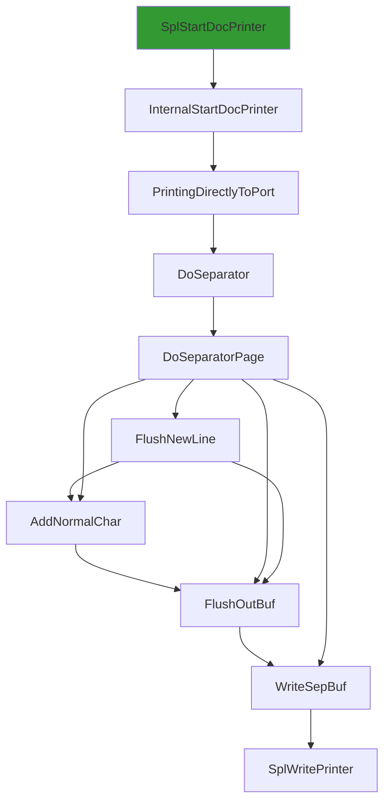
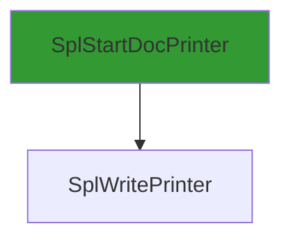

# SplWritePrinter

## Calling

Functions that call `SplWritePrinter`.

### Flowchart 

[Edit on mermaid live](https://mermaid.live/edit#pako:eNptUV1LwzAU_SshvjqY677aB0GtgqBz0IGg8eHS3LbBNClpyhhj_927blkVfGvPxz0n9-55biXyhPFC221egfNskwqTa2jbFAvWViBRskJpnVxFURxHkTDRp-B3Uq6sq0E_kEnwLzYa3bKJMDPiUpthAw68dWsoMbBTYoMsJlnW6MxTYmrztVPG43FOkiTnzKNyKcz878AwbCbMlJgn3bXVCrcvylxyqOGYqHenPJLvvisCc3NK7ZkhUpgF4f2_MmWqHOZe7zZ2bZ0PzjnFhe5LUj8fvQb-eUCvWggzCe3eOv-rwjgs4fJBdfk14zXSNpWkW-y5r7DuryLBffMDsV0jweOjVLQCIrzrkFDovM12Jh-Qky5VUDqoBxh74-v51v3NCW3AfFgbZIcfgnKojQ==)



### Entrypoints

A condensed view, showing only entrypoints to the callgraph.



### Mindmap

[Edit calling Mindmap](https://mermaid.live/edit#pako:eNrFU8FKxDAQ_ZWQ0y74Bd7UKgi6FioIspehGduwSaaME2RZ9t-N2Za1SNu9Ocf3Zua9CS8HXZNBfa20t8F46LaBiWS1qjr3xlawZBsEeb3eBpUroxV2t_FjgJR6cPGzfYkyApW6MWZD7MHdtcC_iX5ig19PNuCYUaqgtB8YhLiE5g89arhQbmHlxMJT5SewoSksYy1u_0olsSweP33hP5iZlZwRXJIb6vEnJAFcJcBSUN3HZjY0M54mHV3mZ9KNvkpBxxQRa1LmD1pa9Dn9Bninj4mNnQHBe2OTdCKEIyYUolC1D_UZOfUVFhoGf4YxDz73fyr_rYR2EN6JhrbjN8JRBgo=)

## Called

Functions that `SplWritePrinter` calls

### Flowchart

[Edit on mermaid live](https://mermaid.live/edit#pako:eNrVXW1v48iR_iuDuQ8BDpmA7ObrYLGAR5JnlPgtkmZ8m9uDQkstmzFNaklqPE6Q_e3XXV39RrZm5Vy-HAJs7BFFNrurq5566qn2P95umi17-_7N213VPG8eirZ_c7H4ud5URddN2e5N91Bs2fbNrqyq9_9BaZ5T-nMdhtmbd-9-fBOS9L9_fnt2M393uXx3O796N7lezN7dLK4ns-Vy9WkxO5su312E7_j__jC9uHj__nrP6pu22bCu-_nt_7x__17ent8xyeGOacZ_jiJ59yTkd1_uqymrWM_mdbncN03FWv5VcxXh36ARgZ9plPBfAvx6wEdKMvlJmPIPSCCvIqn4IJG_ZIQ_5PbmZr08X_8yXS6X8u6hvEkc8UtDeWmYh_wXKm8Sxrk1_Nx6SpjiUzJ-4_PPV-swC4KA0ZwOXznUL5DLm-Yx_8qkqD93rF0ytmBFNW02V8UTg0HJi4h923Czy-AzNYIos15nCx_xWcHZycVXW8Yu2ZN8S_mB_SbyGWIcfACPN21Z92Is_ewrq3v5pQznNw88i38-v5jJJQ_kkvPvnpcVu2ngTrNv7iTgkpCU8nstWF-U9R-bOznsRL4SSVLzDmFCrW_TKFVvJiYeL7fnOJX3zzL7mZG0NRKn8ND7suuVUeG7OU8hKU6TeEga4RMj64pYjlRYX0jlzzExKxxG8WiGw8wzecufriafnNmbiUmbtGVfbopqyTZ92dTuDFIcMkm4qdIYbc8ePq4yIWKO592kadm0Lb-yVqwLvDYJ5DySUCzpsm8nRX9WVc1GTkqOrwHmibY1ncrPghg3m3ifqxUftBz4oq--lG1_KKrP9XNZbwfLjmNyByqdCk1O9Ck4Rauq4zb2pagObLDBYvRSEdWzDpuHD0camb2DcQeKOVreXF9fLJfy9tOqgqngfkhuG495hZnwVNxNlfXjTdP2523zZPsq7UGy1P52hsZPxUN_XV1wO_wBHO96ZZzdbVvs96z9Ue4JtC5KuC2SHFc7jd0ZW84mnxfz1U_vPpwt3c141jL-Mmcb4YBZ97EtuHkNloamOd7VWRpcZm5jeY4rHp761Mti_5HVrC03l0X36D4ukTOTCPO5XH6ZLFbyO08F2p9jNTFa8nHPQ6zHNl-ZMPHZt9vBsikPlqUywFw096uX_dB80szjC3IqZycUbz8Xu7MuqknLip4tix3TW4oSXJw4ASfTsf6S8b1X921TfeCv9iiWW1oH3lNED2kR4isfWS-iJdteNnXZN2hIaG80EG6Mml_UqqWB41zVtk7sQGq2PYZNIjYIDZXvEBfPaoEL5BZPx36VouGDb1aDsvcyRknwsH_9yv1W0643Td317QF-LvnEFfyH38nJwquHRrB-3nTl5mk_XBjiceopLgx_FYwVAAYQqcgNEynT1bE0Apf4XzdL8nE6x7FkxpkH8klJaL-amihw4bN6O3k41I9yQnFHR_5ViKRzLev7yeZh0uxfBnapbEaAIIxmofOOoXJS9pfUlWAGBMNTLFzC4obPZCSn8mrbcvsT2Esu7ZSJ_1JvNB545dzAqRC3qxtk8d-oiI-J8h5ii_J9xR3tvN41jqFLgw3xwkgaO7q7m6YqNy8W3KGerT5bLK4Xn86uphfzq49DtHFRdP2sbWHHeJZNuDCSKPDnMVmIAH3RHzrhxj_xrXuo-oEF0my828I4Gt9U48_Ymsncnr0oHpsM2qljdgQjLQky4wmdldKe29kWsd4W6meSCxz4eb8VPgvM0Vkd56kqwrlDUTdK-R4hRD9AYVASjeGOcCq3HMewVYOgErEFfgfGpLHFFOEFxyxyUUIByeXrCaxnXgU8OOu5md00XYnwSGyEXK8299W4l3KfwxCuNKP4QqkHoIeRM8s4isDFO7P-edUWGw6tu664H4QS9ArS0NGffyrqbTW4jmrEYsPsUAcpAOEE058UJ5YDTYxUgEJ2HN8jlo3HgVyBapok0hldcaj34bDbDdCQvMoxVJKZfEX9LHcy3hIwvF7CJSIf3BOhx7XXPt-ejrcDejhPwiWerxJB-Bn3oLMxcd87Ppxi4kAFTA88blVF_zCjmDSd35iIHeBUBAQ_5HjtC2s7ZX46B3SgQ4ZxgBrDJiQ5JYn6KJOos55v17tDz7rboePG2wWJlR3S6C5NXYgBbig6Gq_F2kbo20LPwCT-FvBYDI9YXnf1wDHQVvjwVfnEWq85ibsrs4Zth_HM57AImP3kgW0ep0VfCHjWYcaBkfu7CZQeGl-Y_rresA88zavFL2VRlX9nfkQx2OlyzrJ8mBIs2L56QS82eSjqe3bV9OWOp2jj9Iyg85GrjtGAL4fB1LHBGWGYnozkAcPD_AyzHq81x55MVAeHAFzT5Yqcbf924Mnwlv88302XK2QJlFeKzA4j4EAuWPGVYeS-aDaPyDdgHIqJZ4k-zc5unDf5xIr9uXRa9tjwNcAVIogDMiYwjgeJHpr6TGE1v5z95fpqtI-Eef6lqZlAJe2TZ8VooIYvFh6h_cMWgheicPR-4HvVtqapbycvVwuAKFZawi2Gz9Uzz-zc5yKJAOBPwWuBy9E2HI8YInoCwklREoEDyrRJnZwcXt_9jQP1SdV07OywLfuzqmifRo7Gh72px-RUYJdIlN1zHzG9bdotOlDqg_CxcVJIBuT2BWHk-RbOlPAWX_jW3i6KZ-EwepnP8WlNLSCggl9oI3HYybtbOTBMsAmNICe38JHJGrNTXLY0HOG1b_2UVxYhF7Fk7VfWatoLsSWNxO7hNvpctNubcmP4GO1FhDtNFL4SdwM39MKTzO7wpGxVIShnIjXqSp2QjaBLueCM6kjmIzshuQOCiqOTJXs6q7ccLHNowybNAclCRUgJb4_bledDQJZsWvbE4YyYoQXbTfALOscPwe2eT9bX6HWXuw1_s5qb6KqRUzbYt5r8ynUKmIhHrTdFVdXs-cF5O2dCKNK97iZTW2hINxzfQuCPV80jqy_Z0x0HBA_lfujXMB7E0RARrbd8iWv2rRxkGwYrSHq4twlfl6bRCZbPFy1mH-fcH_3kjJjvzD8fWPsC_NmYKcF0LgQX-6skcpsKMU7g4Udwi0IyqDJfOvZy0vgRp4Q7xl27kyGGAnWJFFlvQHtUoQL3Jy-McPxiWY57fRVYaOLQ9jz4DR6O_t7N8RWfGRjnzXGxC9zhDZFyScjp6Ao88nfxFaVWsMxtPgAzD_G0XydNUbFuw7bLirG949McoJr7-JyEeMoeIYYexyGr0klITiYIl7-1OoqdxRQKsZegWjvHbpyEJRszKLpKQl6xP2D-_8RehgaTGD5BufRQcn3c-2p3jnRSmMfGBTqBUnOrsVkvoKU4WL1p2Y61l4eqL3swALbF8lRmkTLKX0vT5VDqgmPSm6LECICL5GK_MM89ZqzYCicsxwpwezwNWJlijV7F1Hw8ytTovDu1otPylym-ehJ40lqV4osSnfbbgc1DJNIXJfnQ7VrRwcEakVXSG7kxVVsQCE3BH-JMmwFguSy7VCX3AWf7veCAi7JW8Vld5qxO7NmWBhgEDjBYcLNwNgGMSVPlxBNGhUEfSyAji9fWQVrOfGxQqWKjXEtWkwLI2SVHwAPyfX50ixvXT-QmPz9UlSh9ChZuvh2Q6tmwYnJ1U2wei3sO67ueLyhPRoqq21fv369krWspcAn_7bLsOh5Q5D_KokpqEKIis7LA8hVeXP_Tcn51fj1OLjaPCvx4k1qqaLAl_6h5Vl5C7WeoY6IPgEJuUfYOLk2hjm0NGNdtsLmT0AMOMFwDTYKrHcWSpUWHer3bVdwyJfspwxWWFRKYb47Tbvp2cn35gyTy1_MP5bZcsF8OHPdhhQoRA6S4ikoA4lsEHYhdE74-d4VKFtPAouGI9bN6BcjCZN0Ehon6AayIYA0M6EPA_xx0y0RGZsi33HFCbLHrJwRIHVkN4Uugsmh7oTIE59wLS9dvCDWXIMUw4BJWqc0-qnKBGOJKV9RbICJgI5zDjsA9nHl8icImrn_BJcxlbH_ai7dpcVKJCToYOk8qNwt746NZ8h1S4TT6q4O-4ZHI5v9Dh9a_EglJubHYfYKJGYG9DNwpN8R7_mRVkZ99WyvHof5pfdSTGJdsW48kWhTZJz6gkSaUlelhZUMlUjGYBjfpUT1Zx6VAW4-AIDwFavGdIrPuoQL6EfK3MgdWdWpRhFBMSuz3lpIub4u62w0Bn6kphWCnHNd9rqtG4wP9_pJNUARB7NAcOF1AEPA48liJvSA87pZvsT1r-5ezti3km1GE3BTy4svikU3azaq4GzLYGphQ9OI62s3dzJ8HECvQzGs70GhwQaj3nYGR5diB5wabp32JeS4GRw885VmMdqtJYGGKpesUxJBvikOnwZvyfjnAuooVHbPrlZFFI9z56nmYkQotiOHaxAAmZbs5VIVgD_ncCDVCp8llzTMIdkkB3-QVic6SbQ7cdF6mHOy35Z4HvgtW3_cDgMPRoidyqCKYz11wv-8mu43kOCDk1puhJWjVCFH727J9oqhPJfpIT_JPwDd-Vw6j0K5tOSrn8jHagE0HSbyAR77yDI7VKX7qhBcw-6kphXIE44Qb43wIE8IXc8q-lhs9xbiJNAMTGQ7WMDBi0yn-RbEETiFinJXrG4aarLMrg5FVKotiXUM3hTUnMCXRGHxIW8vEnheuRZT-14gh1vOr-eX11Xx1vfjP9Xq979skGkLD4Dg7Q8epinC_GDGjk4oEKiH2zciI_VdqID5BfgQLIA7TjZC6-fI4eBrtoptfWWUDdTOaZK-TRllyS4WBPHsdk2qdjZ1150VZfVo40jBniU0qEg5kBpesk_oC7dGLSm4l6SuGEVUFXeHSL8r6cVg8oQoNHefWrz8sry9mK3cPV52MDSM-i_gEGhgrzYDSXGxFgw40rKG2PNVSjiJ1qnOGyBbc2FKwzAfMMbAF-Ym1wBV72ougL4L1kF3OUwXAbJErNRFMqiwZ9xQ7TC2o0Xap8QvvoypcsHAKBBs14ZC_fN507eah9VW-Qfmyvj_whHX9bXe_3pbdvug3D2vhxqt13eydsJrYXoKn5uiEEJonOodSWci6r-6FTG759x8OdVfe85dbdw8cmf34-8EV_KYfBNX5Q_Tj-keHxZTg0JRgdBwhPvpI1YQngrAVOQLOlcg2UONmrs68yxOY2GeHqszjr_WbC4MTr8IX47lpt9e1X_DofFsx4WJStajOVPhBaUA9RG6WaT-PSBamRVe-qdaQGDGpxeNTHDSV6bN4Lr90IIGzsYAgWlTZPB1rYYCA1kaxhX3lxkLqpLIyh5XVWYe9AFpUF4KIQyhOyxakamjqKPUgQLg44kT2tNkP-cDQt3JKaWxUcm6iruHyQOY0nX2Zc6_-7s-fZwP0wAGBkAZCboY4vWTdEKjoNNZmy8PXRw9JO3uDh4clNuglHPGwBJi3Zd_sFYFt5yCJcaVb5PkUswGJwnrdsj3f0ev7bseD06F1gDgUmqUxDpiw3Jb953bnQjaIXIv9RlaV5vUvgqE4rrWILJpNPQh0kIpVAcmnwzEeajR3H8IQIwFHYvwIJnGJDjpUCWkoZMuXKIaweAbi60sgkUqyhQmvdXVJGLevihEbFtXoQWPgftQjdXnc4V8V4SCCJeYvkHoiLW_WB1-Qvyq639BkzJgiuWhS1W9TUzuiVoUmju9oZndH2Doy1cuRKyz2ug0g0tdD23IQI7eBn9STdZZQlQp9K5xoVP2hrIv2RRSo3R6HMPJU96HAizNLAp_m-WL-YXG2-Oni-mw6WziQFsoA5V1btC_DDD3SKFUxGpHPdzh631i1kKRGLwUhUykpkzGggoJG6rEzmvkkDbGnVSPy1HAoMTBbuRaxKf40W1zNLigZk7HDfEI3k9DMxJyxZjGFfckKUZpXZQrzxs78pInF9yntF0gTix1bsQorpgj0wvDVotbP9QOg6O3s24btgTQsq35IC2EghyYqXNoUkpHAl6cp1k6Mk-9M5Rk0ORwbQSKhsafa4sQ6BT584gyz_flUWuyyCX_CuHlU5bmrI3EAmGR4N0tt56rilbJA2MH0sK-EFMvS4is6HKCj45i_dvXzHvQfR6oRTjg3u1IVXGk8hgbyJZx-A5UnE3AET6IxQWiLi-7hw2HzyPrOL34iAGpM9DAF-UFDU2J1vGkNQPwKQkLEeo4qR3yEuVuGfC4S12zLEdzd9c7mC0vWDar4kd1bN1DRxDbRF3maCwYydJ8gPvPVOUhmSpPaVxFv4w2x2hMAU5Y1z06YalP4HWqUfZpUVedwHJ9y3OmgFjr7MrtaiW3No82XOfpq0-R1MttLTlceaSx7e4yhDV8BOcWu-z7mpApfg81eciNvXyzNUhofb_giXvUAOVl0A-97y73sn-rmuV6Wo0CdeOo20Vgsrx0NxBMnd7dKRLqyGo4rq7LdCD300AnExysnWWLy85FyIDJS1HRIRt0UrVC0vkaRqjIzcV-kMpLoJLrXyGeHbZyBpDvAhg2ElY8ZDnlwkYc5dJuYdEkukb06-85TBkSryQJDNLgkw-BJgQds6MY24uDLJKJumcASpAZm0O66Yo4ATUSZTySTWAJOvEPsy78hCiPMdy9QogMDYRxXhFyoGIFys5kXRlk9HMQ3G4HssBBVXu5SuK8vv3Irv1dybDQhYMxSFYdDvX-GwvhE9fGmI9bRtNqIt0t8OtN0nHllVpMXuDSevInaSi8qVA7IplBoUwtL7ghN_Cm80wSSx76GBFXTTWWzUNvbTWCxMRRF41ojluVG7eZOludqXAPZ-HAHpgZy68RNauhqntP2q0ZW-KyKnpYFuU0KKrtLx6r34hjzTePcWwhQNk6P6sAtXTRINsZCcJXiJye5qM91eUzj74HtiltKHRhwpEnRyF9yCVYlBWTxx0BwPDSHaivafIruF5HnnftbfYjpC4t8nLA6DyEcNyRA3_1HWQDXmaQi5nzpUxr83_Le-ahFWMkLqAdYxH4x4Kixev7EcUTX1IYUkBIpL4FMZYCBMiK4C_jKRNTEqgqL3qbXUzfSgkNAibLbpKDWzJKNwCV6reze9mTU237RNI-H_fmhhhKkUgD4wpauRRG7PcqpWXtVUP_C4QrHREfEekmOLgT_NgBvynEn3u0LIfzh0G85usK8q3PLHbGna15sZW-ZLBqbifaNEfFYVBIYrwpkmOaWUwObfNSy8fwC4Hzgy-u2dFq5RiLiKPWowDXD4fj_3EoxIo8g2AwReprdsa0aaeneZdOVQ4dZJZ5OKUu9opmmwOISnRMIlL1DW8N6NbuYXc54Hrj-4_WHtVCyuTJa6kESIJkJPSqL2FPvNWneSTUt05g-zFZ0p0Lm9ocOdE6Jx3cSr987IrJG5dNAZq2kap0_Kw5zT6CKTwpUq6J75EmSp_FJ04ohFk6epZJt1UCEXL50PVT6xZzd8x29BVd4tn0q625wmkcsvaY5CMGdNWrtKwCimXVyDia9MO-ocREKl6Z9HHUuaTcgjCFRqidjtAB-0EigCqAwWBIUWY5dL7ZyKrbuQT1IXdGtsgFZ4fIRYpF9wbe-gJJpRspUIxSMzjyspFTTa2QVgpQPEJUqQg61Uxbe-tGOOGJNfqiKp7ttsS7rrxzLtevNlm2qHwcS13RcWpfB6bjNkNxuqwju7u7ogHRJTowqs3p7vUMCzcfCpFZDOpB3ut4_rANqqYAYGrpe4YVvS_6uR8QvUHJHGpLG0aldhGfjI0NUokecnltHF-47skEnGtlr-gRUoXzEouk45AhbA1N6DUEZc34D0iOQ8-HkqaCXOk0pka6RKYSSjxDKpNj3B9GKxUPMt6GK05yVodgyQnK90WffpKFd9w-sPa-K--4WH6dCTnRymyo0lELG4iSOPrGypbmGgt4AcYGGbUTuhL6GREXu-NXpSeDXW1onQXm6gLPjEGd8LlBkKU4TU-FCJygPLVC6waK_dfkFS6G4VYEu8Mhu9elDVDBEitNMPOdUuF9TB0ZRc4RQGIQeHiaUhwSw_uzQNzBFFjpW4U64wq_n-tCB1CymYRotGniJwExJ2ENftxlMwa-2ch_dmK9rVO9qMat2w6aRp6Xe841yq5JhToTJXEndoBwRatQO06dImoR4TpaAZFy5P0gaTdMGkGBuM3Fs-uSpIYV8lE8mW2o7wTsotlArfhOfsim15e5Dl44ROw_MCrhSEBQMujJWYHmLvV3QGdX8U7fqZ6bFlOFzXbkTvkPnn9jNcV48ldULHoDnAHA1rQEW2cRpdVif89EsEFF0X3p4SkQBWQhwjCK2-F6PJFaDkqtcFtpdfeIMlGV0SScEOYPd6ykuTb7DMoHU6jv4wjqsSR03YCSQ4aBLFwOLdEShXER9Jsufherdt55h4jnRQrk5QlMtcR-oxaiPxtOOOEQ906wWSnKnL8RsuVzvCy-3Eb-ikRLG9t1OSlMCEIb5144D7uI7pSGlovL189EMmVPoERCchXWGoo6kUOBbdyjZXm9EnWG9aZrH0nUP0vVYzexK1ExPEk7Lzf9d5TTC3yQ-6YagM1Yv5IWicB_IXMw5c3afbaxkfBZ1qnoNSTY8KktiKq3KJKmyHadutvaW0mwwGY4zNllgMad-UZ-t46UnZbPw_DF4NlxYNOZWkaRV3UHVbrg4PsccW12g6hww5-DJ4ZkU363xAfiURT5oCR_GidxD-uG0hK84xGbpqR9pTS0cMaJlEq8UrK1Yy5Ng4BM9R8zSSGnCseHFNE7qWm5qJyx0nIDJU9NO0jZr9EHtpmxoADzW6-NlPmN1DI6OtJao0UQVkIYaTaWK42RMOcsDc5HUAsII8iYOYs-q8h7LNLp5NbObV7uu2ZSCcrhdTs9wO3rIa2PotqwP8WGuy0WIhqPQ15XkU4lTS9cipzWmWqSqfYcjpVK7goLAUgAFs-rEJvESj7zANBJTW9eT450MhlNiAIk5tPmSf5V299qv4vtSI5Q-zfebsu3A_5_V2-W-rD0NqwqfSRhvndiEVmMXSEnIQke-HdsdVoqaH1coPTIzozZJT3Eo59WhexAuRRxgxtohZMFUJLFlaqlXrXpKbUlGI8FcfPw8n5Ihp62a_WxtYsTCu9g5BiW39TBb93Rd57hqOFlI4Uc3f8G8y-5jc_eWKzFWOImcZCvSk0mXdKyfK_G7MAnihtoL1GySeCiUWo8VsQh1QCVlX7rzEF6Zrq6YZubk39IY8Ns9A5R6Um1NxaRSrlyUHdO4ztUsZyO-A5p4l4c7cTYUAmfFW4XOgW4sT4-cVgWsBp5WhUqM1kkJCGQCH6dzLZHclmctqERKq9VfJt1D1-PtSo4Sc_K08XrBq7SNpwkbVaJN4dwY7xrrZcpevbgLtvshTF7ztd82qH-Xyf1_H9SrNpY-JxsYLQwnQOv85skDHvEN9Kuos7LEL6lhPRWTkusjeji8mpaFdVKPbhghPkYlOXLeANIAybjGid9EqZSsTdjn3FLMFm0Vl2wZQ9YrsukXYpOEjjQ0BB3Cr_Or-c1ifrUSgMM5OCX0nrlGPJSQPLUr8505bDFCauND_ELqi-TB4K8q4BhR4X_kiPdRhIc85Ia10Olfb-TBYsdydpcCTj219dBTeU6UM4_8CeWRZnybniGnVPykZ-75_z1d158-Vs1dUR0jtYhOjVHCpO01k01O0nrUoQ8Y_qlqOZWYHazTaQL22XGmtCSlVtU51uIecawxAPaM-k7dV2dg59qyA9NMeNXUC3bPv_mpaLfPRas6mrV4JLTAGvGSYYGSXNnHZqgWuVinOVKQlh_VpCcn4aGll-Qw-XVkFOmz-mvZNrU5xSDznrmpAtmr_8iBf7r18d-QeuhyUmSdUNFUWgkf2gcM65eIbbWemFUbsyc-MElPqnFjTR2Or-KGKnPl7kjmD_hlVqtzN-w_mmBX2ePg-LFVLrqPPY5L_32PcJwX2-el5erM_sF5FIlRE1OlYITillUYUcwe__Re3UDtNvl3VXoo5A91vnCudWR6W3SDu7_DztnNCpHSGM9FGnZSq-0DMTE_esQy9Z9glbzuCFHRTHD0BFFV6Xf_gop5VqRh7CXblocncUTIvcDQMM8i_7KO80lS39mo5PjBFrLL1NOpos8up960zpYEk02e7zARMK3TJnfNpV1ICC77PLRxvP39m7dPjPutcvv2_Zt_vO0fOOgWf35pW7SPb__JPz2AKmG2FSor_gFHO4z_a3Hom-VLvTH_Iq8TkKUtnsw_M_jiJf5RJ_jjTvxf90X9l6ZRl_3zfwGrHZQi)

```mermaid
flowchart LR
classDef shaded fill:#339933
118 --> 127["API-MS-WIN-CORE-PROCESSTHREADS-L1-1-1.DLL::OpenProcess"]:::shaded
169 --> 78
144 --> 161["SplDeleteIniSpooler"]
144 --> 28
342 --> 346
304 --> 103
282 --> 17
320 --> 327
286 --> 382["WPP_SF_qDSSS"]
114 --> 54
216 --> 191
230 --> 159:::shaded
92 --> 17
317 --> 328["FUN_18000e393"]:::shaded
161 --> 28
90 --> 95["CanUserSeeRealDocName"]
0 --> 2["FUN_180001cf8"]
92 --> 148["WPP_SF_qd"]
346 --> 349["FreeMem"]
16 --> 9:::shaded
0 --> 5["SeekPrinterSetEvent"]
184 --> 190["API-MS-WIN-CORE-FILE-L1-1-0.DLL::SetFilePointerEx"]:::shaded
20 --> 273["RetainJob"]
362 --> 267
346 --> 163:::shaded
347 --> 349
31 --> 26:::shaded
170 --> 88:::shaded
249 --> 257["Register"]
184 --> 63:::shaded
276 --> 99
374 --> 344:::shaded
52 --> 46
132 --> 52
161 --> 145:::shaded
0 --> 18["API-MS-WIN-CORE-SYNCH-L1-1-0.DLL::EnterCriticalSection"]:::shaded
384 --> 264
35 --> 32:::shaded
216 --> 223["IsCoreDriverFile"]
207 --> 210["StrCatAlloc"]
191 --> 195["WPP_SF_DD"]
105 --> 108["NTDLL.DLL::RtlVirtualUnwind"]:::shaded
216 --> 32:::shaded
28 --> 36["API-MS-WIN-CORE-PROCESSTHREADS-L1-1-0.DLL::TlsSetValue"]:::shaded
158 --> 143
0 --> 12["FindJob"]:::shaded
90 --> 93["SPOOLSS.DLL::DllAllocSplMem"]:::shaded
170 --> 181["DelinkPortFromSpooler"]
216 --> 187:::shaded
180 --> 233["~TList<class_TIniSpoolerWrapper>"]
332 --> 329
295 --> 375["API-MS-WIN-SECURITY-BASE-L1-1-0.DLL::AreAllAccessesGranted"]:::shaded
379 --> 37:::shaded
285 --> 14
99 --> 101["API-MS-WIN-SECURITY-BASE-L1-1-0.DLL::MapGenericMask"]:::shaded
66 --> 68["MSVCRT.DLL::malloc"]:::shaded
215 --> 220["API-MS-WIN-CORE-FILE-L2-1-0.DLL::MoveFileExW"]:::shaded
184 --> 187["SplLogType"]:::shaded
178 --> 63:::shaded
293 --> 311["InternalCreateSafeFile"]
325 --> 356["ResetMesControlBlockList"]
293 --> 17
0 --> 6["GetOpenedMonitor"]
20 --> 130
243 --> 130
379 --> 70:::shaded
207 --> 216["SplDeleteFile"]
242 --> 243
315 --> 326["Encode"]
17 --> 26:::shaded
370 --> 267
20 --> 12:::shaded
30 --> 57["`vector_constructor_iterator'"]
30 --> 58["MSVCRT.DLL::_wcsicmp"]:::shaded
172 --> 88:::shaded
273 --> 33
46 --> 46
318 --> 329
249 --> 10
0 --> 24["IsXPS2GDI"]
308 --> 46
102 --> 61:::shaded
315 --> 318["EndChunk"]
280 --> 40:::shaded
207 --> 214["StringCchCopyW"]:::shaded
325 --> 78
31 --> 18:::shaded
210 --> 93:::shaded
331 --> 130
324 --> 355["RPCRT4.DLL::NdrMesProcEncodeDecode3"]:::shaded
20 --> 32:::shaded
289 --> 103
166 --> 26:::shaded
16 --> 239
369 --> 370["LogJobInfo"]
293 --> 30
371 --> 374["GetSpoolerPolicy"]
0 --> 3["API-MS-WIN-CORE-ERRORHANDLING-L1-1-0.DLL::SetLastError"]:::shaded
315 --> 14
266 --> 38:::shaded
30 --> 53["StatusFromHResult"]:::shaded
138 --> 70:::shaded
154 --> 38:::shaded
282 --> 15
289 --> 196:::shaded
45 --> 40:::shaded
49 --> 61:::shaded
205 --> 208
215 --> 32:::shaded
379 --> 3:::shaded
275 --> 33
275 --> 299["UpdateString"]
293 --> 61:::shaded
170 --> 61:::shaded
275 --> 276
22 --> 33
92 --> 124:::shaded
0 --> 16["WriteToPrinter"]
192 --> 199["WPP_SF_DDDDD"]
223 --> 51
119 --> 49
275 --> 297["SetJobPosition"]
329 --> 14
311 --> 189:::shaded
273 --> 30
283 --> 277:::shaded
161 --> 142:::shaded
39 --> 40["NTDLL.DLL::EtwTraceMessage"]:::shaded
0 --> 4["GetMonitorHandle"]:::shaded
358 --> 14
184 --> 191["SplLogEvent2"]
147 --> 162
78 --> 81["free"]
185 --> 37:::shaded
362 --> 366["StrNCatBuff"]:::shaded
92 --> 96:::shaded
281 --> 28
281 --> 30
372 --> 373["WPP_SF_DDS"]
21 --> 381["MSVCRT.DLL::_wcsnicmp"]:::shaded
177 --> 40:::shaded
31 --> 9:::shaded
92 --> 30
144 --> 30
154 --> 70:::shaded
5 --> 11:::shaded
337 --> 332
100 --> 93:::shaded
178 --> 183["FreeFPList"]
201 --> 202["FreeIniVersion"]
17 --> 32:::shaded
298 --> 213
223 --> 226["API-MS-WIN-CORE-FILE-L1-1-0.DLL::GetFileAttributesW"]:::shaded
203 --> 206["FUN_180034b77"]
293 --> 15
284 --> 12:::shaded
30 --> 28
48 --> 71["API-MS-WIN-CORE-THREADPOOL-L1-2-0.DLL::SetThreadpoolTimer"]:::shaded
92 --> 28
184 --> 30
210 --> 3:::shaded
275 --> 291["CheckDataTypes"]
10 --> 248["API-MS-WIN-CORE-SYNCH-L1-2-0.DLL::InitOnceBeginInitialize"]:::shaded
172 --> 142:::shaded
33 --> 89["SPOOLSS.DLL::ReplyPrinterChangeNotification"]:::shaded
211 --> 213
282 --> 293
285 --> 5
102 --> 117["API-MS-WIN-SECURITY-BASE-L1-1-0.DLL::AccessCheck"]:::shaded
150 --> 93:::shaded
175 --> 145:::shaded
275 --> 304["GMT2AdjustedGMTIfDST"]
168 --> 144
154 --> 266["LeaveSpoolerLock"]
349 --> 352["API-MS-WIN-CORE-HEAP-L1-1-0.DLL::HeapFree"]:::shaded
250 --> 14
118 --> 54
20 --> 30
304 --> 378["API-MS-WIN-CORE-TIMEZONE-L1-1-0.DLL::GetTimeZoneInformation"]:::shaded
309 --> 359["CreateShdWriter"]
281 --> 162
298 --> 376["API-MS-WIN-CORE-STRING-L2-1-0.DLL::CharLowerW"]:::shaded
52 --> 78
370 --> 23
302 --> 40:::shaded
171 --> 17
374 --> 306:::shaded
102 --> 115["API-MS-WIN-SECURITY-BASE-L1-1-0.DLL::ObjectCloseAuditAlarmW"]:::shaded
202 --> 88:::shaded
230 --> 93:::shaded
92 --> 155["RegSetDWord"]
203 --> 88:::shaded
275 --> 15
228 --> 98:::shaded
143 --> 88:::shaded
0 --> 21["ValidRawDatatype"]
57 --> 14
312 --> 361["StringCchPrintfW"]
232 --> 234["~TString"]
184 --> 188["API-MS-WIN-CORE-FILE-L1-1-0.DLL::CreateFileW"]:::shaded
20 --> 284["FindServerJob"]
338 --> 342["forwardPicAlloc"]
282 --> 28
160 --> 164["NotifyConsumer"]
223 --> 58:::shaded
192 --> 197["WPP_SF_DDSD"]
275 --> 283
17 --> 9:::shaded
92 --> 157["EnterSplSemAndRestoreCount"]
35 --> 30
204 --> 207["DecrementFileRefCnt"]
215 --> 219["SFC_OS.DLL::SfcConnectToServer"]:::shaded
335 --> 329
46 --> 67["_callnewh"]
275 --> 58:::shaded
314 --> 40:::shaded
102 --> 120["API-MS-WIN-SECURITY-BASE-L1-1-0.DLL::CheckTokenMembership"]:::shaded
251 --> 254["MSVCRT.DLL::__dllonexit"]:::shaded
223 --> 225["Cat"]
92 --> 37:::shaded
293 --> 306["API-MS-WIN-CORE-REGISTRY-L1-1-0.DLL::RegQueryValueExW"]:::shaded
169 --> 178["~FilePool"]
170 --> 63:::shaded
243 --> 239
207 --> 3:::shaded
52 --> 84["FUN_18001fe54"]
293 --> 313["CopyString"]:::shaded
119 --> 140["API-MS-WIN-SECURITY-BASE-L1-1-0.DLL::GetTokenInformation"]:::shaded
320 --> 336["FUN_18000e168"]:::shaded
198 --> 40:::shaded
216 --> 30
370 --> 372["SplLogEvent"]
42 --> 62["API-MS-WIN-CORE-THREADPOOL-L1-2-0.DLL::CloseThreadpoolTimer"]:::shaded
330 --> 14
191 --> 130
30 --> 42["~CoalescedSleep"]
184 --> 32:::shaded
90 --> 12:::shaded
362 --> 159:::shaded
174 --> 88:::shaded
114 --> 121["API-MS-WIN-SECURITY-BASE-L1-1-0.DLL::SetTokenInformation"]:::shaded
90 --> 94["GetPrinterPorts"]
293 --> 96:::shaded
8 --> 18:::shaded
92 --> 142["API-MS-WIN-CORE-REGISTRY-L1-1-0.DLL::RegCloseKey"]:::shaded
326 --> 14
20 --> 281["ResumeJob"]
308 --> 195
204 --> 93:::shaded
285 --> 15
30 --> 44["InitPreferMultithreaded"]
118 --> 103
175 --> 236["FreeLangPair"]
274 --> 145:::shaded
199 --> 40:::shaded
282 --> 18:::shaded
25 --> 248:::shaded
293 --> 130
0 --> 32["API-MS-WIN-CORE-ERRORHANDLING-L1-1-0.DLL::GetLastError"]:::shaded
161 --> 177["WPP_SF_SqDd"]
160 --> 37:::shaded
311 --> 191
102 --> 104:::shaded
67 --> 69["MSVCRT.DLL::_callnewh"]:::shaded
144 --> 17
31 --> 3:::shaded
158 --> 23
230 --> 218:::shaded
102 --> 119["IsClientAppContainer"]
202 --> 145:::shaded
54 --> 32:::shaded
338 --> 340["forwardPicRead"]
293 --> 23
215 --> 222["SFC_OS.DLL::SfcClose"]:::shaded
203 --> 204["InternalDecrement"]
150 --> 23
205 --> 93:::shaded
258 --> 259["NTDLL.DLL::EtwEventSetInformation"]:::shaded
293 --> 312["GetFullNameFromId"]
325 --> 358["~TList<class_NPackageInstallLocalspl::TDriverStore::TMissingDriver>"]
77 --> 14
22 --> 380
92 --> 146["API-MS-WIN-CORE-SYSINFO-L1-1-0.DLL::GetTickCount"]:::shaded
275 --> 293["WriteShadowJob"]
118 --> 49
30 --> 48["Wait"]
232 --> 77
327 --> 14
203 --> 145:::shaded
161 --> 37:::shaded
20 --> 60
153 --> 245["LogPrinterOfflineStatus"]
49 --> 76["~TRefPtrCOM<struct_IBidiRequest>"]
369 --> 293
48 --> 74["SleepTimerCallback"]
370 --> 30
282 --> 30
281 --> 379["ControlPrintProcessor"]
95 --> 99["ValidateObjectAccessWithToken"]
20 --> 283["DeleteJobCheck"]
275 --> 298["FindIniKey"]
185 --> 61:::shaded
126 --> 40:::shaded
379 --> 14
315 --> 319["TPrinterSerializationFormat"]
298 --> 218:::shaded
20 --> 38:::shaded
10 --> 249["~Completer"]
372 --> 195
0 --> 9["API-MS-WIN-CORE-SYNCH-L1-1-0.DLL::WaitForSingleObject"]:::shaded
379 --> 18:::shaded
20 --> 24
369 --> 371["GetSpoolerNumericPolicy"]
257 --> 258["TraceLoggingRegisterEx_EtwEventRegister_EtwEventSetInformation"]
158 --> 30
281 --> 293
237 --> 30
234 --> 51
370 --> 103
160 --> 165["Dequeue"]:::shaded
161 --> 170["DeletePortEntry"]
249 --> 14
151 --> 241["SplRegSetValue"]
264 --> 265["NTDLL.DLL::EtwEventWriteTransfer"]:::shaded
207 --> 211["FilesUnloaded"]
281 --> 278
374 --> 305:::shaded
308 --> 315["PickleJobNamedPropertyArray"]
319 --> 334["MakeCrcTable"]:::shaded
118 --> 132["GetContainerId"]
203 --> 205["InternalIncrement"]
293 --> 123:::shaded
207 --> 213["FastStrcmpi"]
22 --> 34:::shaded
174 --> 169
30 --> 60["WPP_SF_SS"]
20 --> 282["PauseJob"]
49 --> 79["Release"]
30 --> 41["StringCbCopyW"]:::shaded
335 --> 52
275 --> 300["CircularChainedJobsList"]
184 --> 162
90 --> 96["API-MS-WIN-SECURITY-BASE-L1-1-0.DLL::GetSecurityDescriptorLength"]:::shaded
236 --> 145:::shaded
30 --> 59["API-MS-WIN-CORE-COM-L1-1-0.DLL::CoCreateInstance"]:::shaded
191 --> 192["TraceValue"]
22 --> 5
28 --> 37["API-MS-WIN-CORE-SYNCH-L1-1-0.DLL::LeaveCriticalSection"]:::shaded
274 --> 3:::shaded
42 --> 61["API-MS-WIN-CORE-HANDLE-L1-1-0.DLL::CloseHandle"]:::shaded
28 --> 26:::shaded
243 --> 244["API-MS-WIN-CORE-REGISTRY-L1-1-0.DLL::RegSetValueExW"]:::shaded
132 --> 137["GetDeviceInstanceId"]
92 --> 154["LeaveSplSemAndResetCount"]
92 --> 32:::shaded
27 --> 3:::shaded
92 --> 151["RegSetString"]
243 --> 30
245 --> 10
311 --> 188:::shaded
164 --> 37:::shaded
6 --> 85["operator_struct__INIMONITOR*___ptr64"]:::shaded
290 --> 40:::shaded
102 --> 3:::shaded
25 --> 14
0 --> 34["API-MS-WIN-CORE-SYNCH-L1-2-0.DLL::Sleep"]:::shaded
92 --> 159["SPOOLSS.DLL::AllocSplStr"]:::shaded
293 --> 49
367 --> 139:::shaded
17 --> 18:::shaded
342 --> 348:::shaded
291 --> 213
367 --> 368["API-MS-WIN-CORE-PROCESSTHREADS-L1-1-0.DLL::OpenProcessToken"]:::shaded
30 --> 54["GetLastErrorAsFailHR"]
207 --> 88:::shaded
338 --> 341["RPCRT4.DLL::MesEncodeIncrementalHandleCreate"]:::shaded
160 --> 163["Link"]:::shaded
213 --> 218["API-MS-WIN-CORE-STRING-OBSOLETE-L1-1-0.DLL::lstrcmpiW"]:::shaded
162 --> 40:::shaded
20 --> 27
160 --> 79
13 --> 103
369 --> 33
144 --> 162["WPP_SF_SD"]
92 --> 144["SplDeleteSpooler"]
8 --> 37:::shaded
207 --> 209["API-MS-WIN-CORE-FILE-L1-1-0.DLL::GetTempFileNameW"]:::shaded
297 --> 371
286 --> 383["ReleaseRetainedRef"]
233 --> 14
92 --> 147["PrinterCreateKey"]
216 --> 224["MSVCRT.DLL::wcsrchr"]:::shaded
0 --> 14["_guard_xfg_dispatch_icall_nop"]
30 --> 46["operator_new"]
245 --> 263["Write<struct__tlgWrapSz<unsigned_short>,struct__tlgWrapperByVal<4>_>"]
170 --> 30
232 --> 78
274 --> 32:::shaded
92 --> 143["FreeClonedIniPrinterWithMask"]
92 --> 18:::shaded
297 --> 370
28 --> 3:::shaded
48 --> 32:::shaded
245 --> 262["_tlgKeywordOn"]:::shaded
158 --> 32:::shaded
46 --> 66["malloc"]
92 --> 94
183 --> 63:::shaded
288 --> 10
51 --> 78
201 --> 203["UpdateDriverFileRefCnt"]
345 --> 346["AllocateMesControlBlock"]
22 --> 17
17 --> 37:::shaded
49 --> 78["operator_delete"]
92 --> 153["LogPrinterStatusChange"]
150 --> 30
312 --> 362["GetPrinterDirectory"]
239 --> 240["MSVCRT.DLL::memcpy"]:::shaded
31 --> 32:::shaded
249 --> 25
20 --> 145:::shaded
118 --> 133["API-MS-WIN-DEVICES-QUERY-L1-1-0.DLL::DevGetObjectProperties"]:::shaded
285 --> 298
119 --> 141["API-MS-WIN-CORE-PROCESSTHREADS-L1-1-0.DLL::OpenThreadToken"]:::shaded
300 --> 12:::shaded
132 --> 131:::shaded
8 --> 269["StopTimer"]
308 --> 316["WPP_SF_dd"]
103 --> 105["__report_gsfailure"]
30 --> 52["Update"]
293 --> 239
320 --> 329
118 --> 128["RPCRT4.DLL::RpcServerInqCallAttributesW"]:::shaded
243 --> 23
293 --> 267
253 --> 256["MSVCRT.DLL::_unlock"]:::shaded
92 --> 158["CloneIniPrinter"]
286 --> 33
321 --> 338["TMes"]
79 --> 14
20 --> 159:::shaded
247 --> 250["_onexit"]
23 --> 40:::shaded
215 --> 191
315 --> 325["~TMes"]
309 --> 37:::shaded
372 --> 103
84 --> 78
33 --> 92["UpdatePrinterIni"]
171 --> 14
175 --> 88:::shaded
157 --> 17
52 --> 83["FUN_180055b38"]
0 --> 29["WPP_SF_DS"]
119 --> 139["API-MS-WIN-CORE-PROCESSTHREADS-L1-1-0.DLL::GetCurrentThread"]:::shaded
275 --> 30
301 --> 120:::shaded
92 --> 156["RegSetBinaryData"]
362 --> 214:::shaded
171 --> 28
172 --> 200["API-MS-WIN-CORE-LIBRARYLOADER-L1-2-0.DLL::FreeLibrary"]:::shaded
114 --> 49
161 --> 4:::shaded
285 --> 26:::shaded
356 --> 347
100 --> 30
266 --> 36:::shaded
20 --> 15
373 --> 40:::shaded
382 --> 40:::shaded
150 --> 88:::shaded
48 --> 18:::shaded
323 --> 49
8 --> 268["KERNEL32.DLL::GetTickCount64"]:::shaded
346 --> 138
17 --> 34:::shaded
0 --> 7["ClearJobError"]
266 --> 26:::shaded
76 --> 14
317 --> 327["SafeTell"]
107 --> 113["API-MS-WIN-CORE-ERRORHANDLING-L1-1-0.DLL::SetUnhandledExceptionFilter"]:::shaded
83 --> 78
161 --> 79
360 --> 188:::shaded
10 --> 247["atexit"]
153 --> 25
358 --> 235:::shaded
311 --> 32:::shaded
158 --> 88:::shaded
0 --> 22["UpdateJobStatus"]
118 --> 130["memset"]
282 --> 370
161 --> 172["FreeIniMonitor"]
204 --> 208["DuplicateFile"]
361 --> 363["MSVCRT.DLL::_vsnwprintf"]:::shaded
293 --> 32:::shaded
2 --> 28
130 --> 135["MSVCRT.DLL::memset"]:::shaded
181 --> 182["RemoveFromHashBuckets"]:::shaded
250 --> 253["_unlock"]
169 --> 88:::shaded
246 --> 103
293 --> 305["API-MS-WIN-CORE-REGISTRY-L1-1-0.DLL::RegOpenKeyExW"]:::shaded
293 --> 308["GetSerializedBlobOfNamedProperties"]
293 --> 314["WPP_SF_qD"]
184 --> 185
293 --> 124:::shaded
370 --> 32:::shaded
281 --> 18:::shaded
281 --> 37:::shaded
228 --> 130
100 --> 32:::shaded
180 --> 232["`vector_deleting_destructor'"]
197 --> 40:::shaded
369 --> 26:::shaded
271 --> 272["API-MS-WIN-EVENTING-PROVIDER-L1-1-0.DLL::EventWriteTransfer"]:::shaded
207 --> 212["API-MS-WIN-CORE-FILE-L1-1-0.DLL::CreateDirectoryW"]:::shaded
118 --> 131["API-MS-WIN-DEVICES-QUERY-L1-1-0.DLL::DevFreeObjectProperties"]:::shaded
350 --> 353["MemoryAlloc"]
275 --> 32:::shaded
28 --> 32:::shaded
114 --> 122["API-MS-WIN-SECURITY-BASE-L1-1-0.DLL::CreateWellKnownSid"]:::shaded
276 --> 61:::shaded
149 --> 3:::shaded
161 --> 168["DeleteSpoolerCheck"]
215 --> 221["SFC_OS.DLL::SfcFileException"]:::shaded
185 --> 18:::shaded
20 --> 286["ReleaseJob"]
308 --> 14
33 --> 87["SPOOLSS.DLL::PartialReplyPrinterChangeNotification"]:::shaded
345 --> 14
44 --> 64["API-MS-WIN-CORE-COM-L1-1-0.DLL::CoInitializeEx"]:::shaded
0["SplWritePrinter"] --> 1["SPOOLSS.DLL::WritePrinter"]:::shaded
164 --> 70:::shaded
275 --> 296["IsXpsPrintProcessor"]
14 --> 80["_guard_dispatch_icall"]:::shaded
100 --> 88:::shaded
99 --> 102["FUN_180055643"]
20 --> 28
118 --> 50
164 --> 18:::shaded
243 --> 46
184 --> 88:::shaded
161 --> 17
364 --> 53:::shaded
288 --> 25
379 --> 53:::shaded
20 --> 21
17 --> 36:::shaded
225 --> 46
293 --> 88:::shaded
323 --> 46
22 --> 32:::shaded
99 --> 100["SetRequiredPrivileges"]
144 --> 79
174 --> 201["DeleteIniVersion"]
166 --> 167["GetLastErrorAsHResult"]
206 --> 88:::shaded
237 --> 23
293 --> 28
318 --> 331["CalculateCrc"]
362 --> 365["FUN_18002b236"]:::shaded
31 --> 37:::shaded
195 --> 40:::shaded
315 --> 317["StartChunk"]
285 --> 28
191 --> 23
293 --> 103
114 --> 125["API-MS-WIN-SECURITY-BASE-L1-1-0.DLL::DuplicateTokenEx"]:::shaded
7 --> 15
315 --> 323["ConvertToPickleArray"]
374 --> 142:::shaded
299 --> 377["SPOOLSS.DLL::ReallocSplStr"]:::shaded
359 --> 188:::shaded
161 --> 173["API-MS-WIN-CORE-HEAP-L2-1-0.DLL::LocalFree"]:::shaded
30 --> 56["API-MS-WIN-CORE-COM-L1-1-0.DLL::CoUninitialize"]:::shaded
16 --> 26:::shaded
49 --> 77["`vector_destructor_iterator'"]
150 --> 239["memcpy"]
20 --> 279["ShouldGetMasqDataForHandle"]:::shaded
22 --> 15
48 --> 37:::shaded
269 --> 71:::shaded
33 --> 90["GetInfoData"]
201 --> 88:::shaded
48 --> 70["API-MS-WIN-CORE-PROCESSTHREADS-L1-1-0.DLL::GetCurrentThreadId"]:::shaded
372 --> 193:::shaded
118 --> 58:::shaded
114 --> 123["SPOOLSS.DLL::ImpersonatePrinterClient"]:::shaded
0 --> 13["SplTraceErrorPrintCancelled"]
318 --> 327
0 --> 31["EnterSpoolerLock"]
0 --> 27["ValidateSpoolHandle"]
105 --> 106["NTDLL.DLL::RtlLookupFunctionEntry"]:::shaded
275 --> 24
0 --> 23["WPP_SF_D"]
22 --> 3:::shaded
293 --> 310["API-MS-WIN-CORE-FILE-L1-1-0.DLL::SetFilePointer"]:::shaded
275 --> 292["ValidateJobTimes"]:::shaded
74 --> 26:::shaded
161 --> 171["ShutdownMonitors"]
92 --> 145["SPOOLSS.DLL::DllFreeSplStr"]:::shaded
24 --> 58:::shaded
293 --> 142:::shaded
118 --> 60
285 --> 33
345 --> 347["ReleaseMesControlBlock"]
362 --> 364["BoolFromHResult"]
370 --> 361
134 --> 40:::shaded
266 --> 3:::shaded
319 --> 130
148 --> 40:::shaded
345 --> 348["MesControlBlockToClientPointer"]:::shaded
367 --> 112:::shaded
20 --> 3:::shaded
20 --> 103
92 --> 150["CloneIniSpooler"]
20 --> 274["~_TELEMETRY_JOB_INFO"]
293 --> 93:::shaded
225 --> 51
31 --> 34:::shaded
154 --> 37:::shaded
184 --> 189["API-MS-WIN-CORE-FILE-L1-1-0.DLL::DeleteFileW"]:::shaded
192 --> 198["WPP_SF_DDDD"]
372 --> 196:::shaded
269 --> 270["API-MS-WIN-CORE-THREADPOOL-L1-2-0.DLL::WaitForThreadpoolTimerCallbacks"]:::shaded
293 --> 19:::shaded
30 --> 55["API-MS-WIN-CORE-COM-L1-1-0.DLL::CoTaskMemFree"]:::shaded
275 --> 301["AllowAccessToLocalSystemAndDelegatedPrintAdmins"]
207 --> 215["SplMoveFileEx"]
372 --> 130
285 --> 17
384 --> 103
97 --> 98["StringCopyWorkerW"]:::shaded
92 --> 14
156 --> 241
20 --> 33
294 --> 369["FUN_180060a89"]
339 --> 14
155 --> 241
230 --> 88:::shaded
301 --> 276
20 --> 287["SPOOLSS.DLL::SetJobW"]:::shaded
0 --> 8["UpdateTimer"]
17 --> 38:::shaded
150 --> 130
315 --> 321["TPickle<struct_JobNamedPropertyPickleArray>"]
0 --> 25["<lambda_invoker_cdecl>"]
325 --> 357["RPCRT4.DLL::MesHandleFree"]:::shaded
275 --> 294["FUN_18000bbb3"]
184 --> 186["API-MS-WIN-CORE-FILE-L1-1-0.DLL::SetEndOfFile"]:::shaded
281 --> 17
205 --> 230["IncrementFileRefCnt"]
338 --> 344["HResultFromWin32"]:::shaded
132 --> 103
353 --> 354["API-MS-WIN-CORE-HEAP-L1-1-0.DLL::HeapAlloc"]:::shaded
100 --> 23
223 --> 224:::shaded
60 --> 40:::shaded
237 --> 238["API-MS-WIN-CORE-REGISTRY-L1-1-0.DLL::RegCreateKeyExW"]:::shaded
362 --> 30
281 --> 370
183 --> 185["FPCloseFiles"]
335 --> 337["FUN_18000e4dd"]
105 --> 109["NTDLL.DLL::RtlCaptureContext"]:::shaded
33 --> 33
228 --> 229["StringExHandleOtherFlagsW"]
100 --> 104["API-MS-WIN-SECURITY-BASE-L1-1-0.DLL::AdjustTokenPrivileges"]:::shaded
161 --> 30
92 --> 152["NTDLL.DLL::RtlLengthSid"]:::shaded
102 --> 88:::shaded
149 --> 93:::shaded
258 --> 260["NTDLL.DLL::EtwEventRegister"]:::shaded
33 --> 88["SPOOLSS.DLL::DllFreeSplMem"]:::shaded
147 --> 30
261 --> 14
94 --> 97["StringCbCatW"]
20 --> 280["WPP_SF_dDD"]
309 --> 18:::shaded
170 --> 134
380 --> 26:::shaded
138 --> 18:::shaded
184 --> 23
295 --> 101:::shaded
164 --> 166["SetAutoEventHandle"]
30 --> 51["vFree"]
171 --> 30
118 --> 134["WPP_SF_S"]
367 --> 141:::shaded
169 --> 180["~TDriverStore"]
183 --> 88:::shaded
223 --> 227["TString"]
311 --> 187:::shaded
379 --> 379
311 --> 30
0 --> 28["LeaveSplSem"]
282 --> 371
22 --> 23
288 --> 262:::shaded
273 --> 15
338 --> 339["forwardPicWrite"]
281 --> 15
92 --> 23
364 --> 3:::shaded
20 --> 285["RestartJob"]
281 --> 26:::shaded
20 --> 277["DeleteJob"]:::shaded
286 --> 290
169 --> 63:::shaded
227 --> 52
275 --> 303["MapJobStatus"]:::shaded
8 --> 70:::shaded
383 --> 15
118 --> 129["KERNELBASE.DLL::GetPackageFamilyName"]:::shaded
318 --> 330["SafeSeek"]
263 --> 103
114 --> 103
349 --> 351["API-MS-WIN-CORE-HEAP-L1-1-0.DLL::GetProcessHeap"]:::shaded
8 --> 267["WPP_SF_"]
293 --> 162
315 --> 103
250 --> 251["__dllonexit"]
316 --> 40:::shaded
315 --> 324["JobNamedPropertyPickleArrayEncode"]
211 --> 14
0 --> 17["EnterSplSem"]
33 --> 91["MapToPrinterQueueStatus"]:::shaded
167 --> 32:::shaded
147 --> 237["SplRegCreateKey"]
236 --> 88:::shaded
258 --> 261["_tlgEnableCallback"]
282 --> 379
92 --> 88:::shaded
48 --> 75["API-MS-WIN-CORE-THREADPOOL-L1-2-0.DLL::CreateThreadpoolTimer"]:::shaded
161 --> 169["`scalar_deleting_destructor'"]
92 --> 93:::shaded
285 --> 380["SetPortErrorEvent"]
100 --> 103["__security_check_cookie"]
281 --> 371
257 --> 14
42 --> 63["API-MS-WIN-CORE-SYNCH-L1-1-0.DLL::DeleteCriticalSection"]:::shaded
17 --> 65["API-MS-WIN-CORE-SYNCH-L1-1-0.DLL::ResetEvent"]:::shaded
275 --> 295["AccessGranted"]
320 --> 335["WriteChunk"]
225 --> 228["StringCchCopyExW"]
13 --> 271["_tlgWriteTransfer_EventWriteTransfer"]
353 --> 351:::shaded
30 --> 14
338 --> 46
367 --> 32:::shaded
0 --> 19["API-MS-WIN-CORE-FILE-L1-1-0.DLL::WriteFile"]:::shaded
114 --> 124["SPOOLSS.DLL::RevertToPrinterSelf"]:::shaded
179 --> 63:::shaded
258 --> 103
331 --> 52
161 --> 176["API-MS-WIN-DEVICES-QUERY-L1-1-0.DLL::DevCloseObjectQuery"]:::shaded
289 --> 193:::shaded
0 --> 11["API-MS-WIN-CORE-FILE-L1-1-0.DLL::GetFileSizeEx"]:::shaded
144 --> 144
107 --> 111["API-MS-WIN-CORE-PROCESSTHREADS-L1-1-0.DLL::TerminateProcess"]:::shaded
340 --> 345["PicRead"]
269 --> 267
338 --> 343["RPCRT4.DLL::MesDecodeIncrementalHandleCreate"]:::shaded
311 --> 134
191 --> 193["NTDLL.DLL::EtwEventWrite"]:::shaded
0 --> 15["CheckJobStatusChange"]
250 --> 252["_lock"]
269 --> 62:::shaded
22 --> 28
346 --> 350["AllocMemAlign"]
102 --> 118["IsClientAssociatedWSDA"]
138 --> 37:::shaded
114 --> 126["WPP_SF_d"]
179 --> 79
94 --> 41:::shaded
308 --> 3:::shaded
160 --> 138
161 --> 134
153 --> 10
225 --> 214:::shaded
331 --> 333["SafeRead"]
229 --> 130
161 --> 18:::shaded
102 --> 103
317 --> 329["SafeWrite"]
369 --> 103
107 --> 112["API-MS-WIN-CORE-PROCESSTHREADS-L1-1-0.DLL::GetCurrentProcess"]:::shaded
20 --> 17
30 --> 43["API-MS-WIN-CORE-SYNCH-L1-1-0.DLL::InitializeCriticalSectionAndSpinCount"]:::shaded
118 --> 30
114 --> 30
2 --> 35["FUN_1800521e1"]
30 --> 45["WPP_SF_SSd"]
31 --> 36:::shaded
5 --> 26:::shaded
293 --> 307["API-MS-WIN-CORE-FILE-L1-1-0.DLL::FlushFileBuffers"]:::shaded
171 --> 60
266 --> 37:::shaded
132 --> 136["API-MS-WIN-CORE-COM-L1-1-0.DLL::StringFromGUID2"]:::shaded
241 --> 243["FUN_18004e1b5"]
35 --> 39["WPP_SF_qDd"]
191 --> 103
282 --> 162
215 --> 187:::shaded
30 --> 50["WPP_SF_Sd"]
179 --> 145:::shaded
48 --> 72["API-MS-WIN-CORE-SYNCH-L1-1-0.DLL::CreateEventW"]:::shaded
191 --> 196["NTDLL.DLL::EtwEventEnabled"]:::shaded
252 --> 255["MSVCRT.DLL::_lock"]:::shaded
81 --> 82["MSVCRT.DLL::free"]:::shaded
278 --> 24
153 --> 246["Write<struct__tlgWrapSz<unsigned_short>,struct__tlgWrapperByVal<4>,struct__tlgWrapperByVal<4>_>"]
33 --> 26:::shaded
105 --> 107["__raise_securityfailure"]
308 --> 30
92 --> 149["SubChar"]
230 --> 231["FUN_180034e97"]:::shaded
309 --> 360["CreateSplWriter"]
211 --> 217["GDI32.DLL::GdiArtificialDecrementDriver"]:::shaded
208 --> 218:::shaded
246 --> 264
107 --> 110["API-MS-WIN-CORE-ERRORHANDLING-L1-1-0.DLL::UnhandledExceptionFilter"]:::shaded
288 --> 384["Write<struct__tlgWrapperByVal<8>,struct__tlgWrapperByVal<4>,struct__tlgWrapperByRef<16>,struct__tlgWrapperByVal<4>,struct__tlgWrapSz<unsigned_short>,struct__tlgWrapSz<unsigned_short>,struct__tlgWrapperByVal<4>,struct__tlgWrapperByVal<4>,struct__tlgWrapperByVal<4>,struct__tlgWrapSz<unsigned_short>,struct__tlgWrapSz<unsigned_short>,struct__tlgWrapperByVal<4>,struct__tlgWrapperByVal<4>,struct__tlgWrapperByVal<4>,struct__tlgWrapperByVal<4>,struct__tlgWrapperByVal<4>_>"]
216 --> 134
30 --> 47["TRefPtrCOM<struct_IBidiRequest>"]:::shaded
243 --> 78
282 --> 278
7 --> 33
20 --> 289["SplLogJobDiagEvent"]
150 --> 32:::shaded
20 --> 276["ValidateObjectAccess"]
296 --> 58:::shaded
0 --> 20["SplSetJob"]
0 --> 33["SetPrinterChange"]
83 --> 84
275 --> 302["WPP_SF_dD"]
169 --> 179["~INIPRINTPROC"]
160 --> 18:::shaded
275 --> 12:::shaded
286 --> 30
208 --> 93:::shaded
337 --> 52
207 --> 103
273 --> 290["WPP_SF_qDSSSD"]
15 --> 86["API-MS-WIN-CORE-PROFILE-L1-1-0.DLL::QueryPerformanceCounter"]:::shaded
161 --> 88:::shaded
17 --> 3:::shaded
291 --> 58:::shaded
263 --> 264["_tlgWriteTransfer_EtwEventWriteTransfer"]
315 --> 322["API-MS-WIN-CORE-COM-L1-1-0.DLL::CreateStreamOnHGlobal"]:::shaded
318 --> 332["WriteCrc"]
20 --> 288["LogSetJobCompleted"]
137 --> 138["IsValid"]
92 --> 3:::shaded
20 --> 278["GetIniPrintProc"]
160 --> 70:::shaded
191 --> 194["GetValue"]:::shaded
180 --> 49
0 --> 30["PrinterNonRegGetHardwareId"]
118 --> 51
266 --> 32:::shaded
315 --> 320["StartFormat"]
245 --> 25
22 --> 79
179 --> 88:::shaded
0 --> 26["API-MS-WIN-CORE-SYNCH-L1-1-0.DLL::SetEvent"]:::shaded
161 --> 174["FreeIniEnvironment"]
285 --> 145:::shaded
28 --> 38["API-MS-WIN-CORE-PROCESSTHREADS-L1-1-0.DLL::TlsGetValue"]:::shaded
331 --> 103
183 --> 184["DeletePoolFile"]
158 --> 14
161 --> 175["DeleteIniForm"]
31 --> 65:::shaded
48 --> 73["API-MS-WIN-CORE-COM-L1-1-0.DLL::CoWaitForMultipleHandles"]:::shaded
144 --> 160["Enqueue"]
216 --> 189:::shaded
50 --> 40:::shaded
282 --> 37:::shaded
158 --> 93:::shaded
184 --> 61:::shaded
22 --> 30
30 --> 49["Reset"]
293 --> 126
276 --> 367["GetTokenHandle"]
0 --> 10["get"]
20 --> 275["SetLocalJob"]
308 --> 49
243 --> 49
102 --> 32:::shaded
132 --> 133:::shaded
233 --> 235["~TLink"]:::shaded
315 --> 78
29 --> 40:::shaded
31 --> 38:::shaded
102 --> 116["API-MS-WIN-SECURITY-BASE-L1-1-0.DLL::ObjectOpenAuditAlarmW"]:::shaded
339 --> 344:::shaded
102 --> 114["CreateMediumIntegrityTokenFromToken"]
267 --> 40:::shaded
172 --> 145:::shaded
30 --> 17
178 --> 88:::shaded
92 --> 123:::shaded
241 --> 242["FUN_18002c99f"]
333 --> 14
293 --> 309["GetWriterFromHandle"]

```

### Endpoints

A condensed view, showing only endpoints of the callgraph.

```mermaid
flowchart LR
classDef shaded fill:#339933
root["SplWritePrinter"] --> 114["DeleteJob"]:::shaded
root["SplWritePrinter"] --> 138["ShouldGetMasqDataForHandle"]:::shaded
root["SplWritePrinter"] --> 18["API-MS-WIN-CORE-REGISTRY-L1-1-0.DLL::RegCloseKey"]:::shaded
root["SplWritePrinter"] --> 96["operator_struct__INIMONITOR*___ptr64"]:::shaded
root["SplWritePrinter"] --> 5["API-MS-WIN-SECURITY-BASE-L1-1-0.DLL::DuplicateTokenEx"]:::shaded
root["SplWritePrinter"] --> 113["NTDLL.DLL::EtwEventEnabled"]:::shaded
root["SplWritePrinter"] --> 47["API-MS-WIN-CORE-PROCESSTHREADS-L1-1-0.DLL::TlsGetValue"]:::shaded
root["SplWritePrinter"] --> 150["MSVCRT.DLL::memcpy"]:::shaded
root["SplWritePrinter"] --> 89["RemoveFromHashBuckets"]:::shaded
root["SplWritePrinter"] --> 123["MapToPrinterQueueStatus"]:::shaded
root["SplWritePrinter"] --> 45["NTDLL.DLL::RtlVirtualUnwind"]:::shaded
root["SplWritePrinter"] --> 140["SPOOLSS.DLL::ReallocSplStr"]:::shaded
root["SplWritePrinter"] --> 61["StringCbCopyW"]:::shaded
root["SplWritePrinter"] --> 28["API-MS-WIN-CORE-PROCESSTHREADS-L1-1-1.DLL::OpenProcess"]:::shaded
root["SplWritePrinter"] --> 103["API-MS-WIN-SECURITY-BASE-L1-1-0.DLL::SetTokenInformation"]:::shaded
root["SplWritePrinter"] --> 39["API-MS-WIN-CORE-ERRORHANDLING-L1-1-0.DLL::UnhandledExceptionFilter"]:::shaded
root["SplWritePrinter"] --> 43["FindJob"]:::shaded
root["SplWritePrinter"] --> 127["SplLogType"]:::shaded
root["SplWritePrinter"] --> 142["MSVCRT.DLL::malloc"]:::shaded
root["SplWritePrinter"] --> 149["API-MS-WIN-SECURITY-BASE-L1-1-0.DLL::ObjectOpenAuditAlarmW"]:::shaded
root["SplWritePrinter"] --> 146["API-MS-WIN-CORE-COM-L1-1-0.DLL::CoCreateInstance"]:::shaded
root["SplWritePrinter"] --> 8["StrNCatBuff"]:::shaded
root["SplWritePrinter"] --> 124["API-MS-WIN-CORE-PROCESSTHREADS-L1-1-0.DLL::OpenThreadToken"]:::shaded
root["SplWritePrinter"] --> 19["API-MS-WIN-SECURITY-BASE-L1-1-0.DLL::MapGenericMask"]:::shaded
root["SplWritePrinter"] --> 92["GDI32.DLL::GdiArtificialDecrementDriver"]:::shaded
root["SplWritePrinter"] --> 3["SPOOLSS.DLL::PartialReplyPrinterChangeNotification"]:::shaded
root["SplWritePrinter"] --> 2["API-MS-WIN-CORE-FILE-L1-1-0.DLL::SetFilePointerEx"]:::shaded
root["SplWritePrinter"] --> 60["_guard_dispatch_icall"]:::shaded
root["SplWritePrinter"] --> 88["FUN_18000e168"]:::shaded
root["SplWritePrinter"] --> 35["API-MS-WIN-DEVICES-QUERY-L1-1-0.DLL::DevGetObjectProperties"]:::shaded
root["SplWritePrinter"] --> 129["API-MS-WIN-EVENTING-PROVIDER-L1-1-0.DLL::EventWriteTransfer"]:::shaded
root["SplWritePrinter"] --> 90["FUN_180034e97"]:::shaded
root["SplWritePrinter"] --> 139["MSVCRT.DLL::__dllonexit"]:::shaded
root["SplWritePrinter"] --> 50["API-MS-WIN-CORE-REGISTRY-L1-1-0.DLL::RegOpenKeyExW"]:::shaded
root["SplWritePrinter"] --> 74["RPCRT4.DLL::RpcServerInqCallAttributesW"]:::shaded
root["SplWritePrinter"] --> 110["API-MS-WIN-CORE-HEAP-L1-1-0.DLL::GetProcessHeap"]:::shaded
root["SplWritePrinter"] --> 11["SFC_OS.DLL::SfcFileException"]:::shaded
root["SplWritePrinter"] --> 91["API-MS-WIN-SECURITY-BASE-L1-1-0.DLL::CreateWellKnownSid"]:::shaded
root["SplWritePrinter"] --> 108["API-MS-WIN-CORE-FILE-L1-1-0.DLL::SetFilePointer"]:::shaded
root["SplWritePrinter"] --> 101["MSVCRT.DLL::_wcsicmp"]:::shaded
root["SplWritePrinter"] --> 15["API-MS-WIN-CORE-PROCESSTHREADS-L1-1-0.DLL::GetCurrentProcess"]:::shaded
root["SplWritePrinter"] --> 34["MSVCRT.DLL::_lock"]:::shaded
root["SplWritePrinter"] --> 58["StringCchCopyW"]:::shaded
root["SplWritePrinter"] --> 98["StringCopyWorkerW"]:::shaded
root["SplWritePrinter"] --> 133["API-MS-WIN-CORE-THREADPOOL-L1-2-0.DLL::WaitForThreadpoolTimerCallbacks"]:::shaded
root["SplWritePrinter"] --> 70["API-MS-WIN-CORE-PROCESSTHREADS-L1-1-0.DLL::GetCurrentThreadId"]:::shaded
root["SplWritePrinter"] --> 75["~TLink"]:::shaded
root["SplWritePrinter"] --> 16["Link"]:::shaded
root["SplWritePrinter"] --> 29["API-MS-WIN-SECURITY-BASE-L1-1-0.DLL::GetTokenInformation"]:::shaded
root["SplWritePrinter"] --> 30["NTDLL.DLL::RtlLookupFunctionEntry"]:::shaded
root["SplWritePrinter"] --> 51["API-MS-WIN-CORE-FILE-L1-1-0.DLL::CreateFileW"]:::shaded
root["SplWritePrinter"] --> 24["SPOOLSS.DLL::RevertToPrinterSelf"]:::shaded
root["SplWritePrinter"] --> 78["API-MS-WIN-SECURITY-BASE-L1-1-0.DLL::ObjectCloseAuditAlarmW"]:::shaded
root["SplWritePrinter"] --> 144["_tlgKeywordOn"]:::shaded
root["SplWritePrinter"] --> 116["API-MS-WIN-CORE-FILE-L2-1-0.DLL::MoveFileExW"]:::shaded
root["SplWritePrinter"] --> 4["SFC_OS.DLL::SfcConnectToServer"]:::shaded
root["SplWritePrinter"] --> 82["API-MS-WIN-CORE-SYNCH-L1-2-0.DLL::Sleep"]:::shaded
root["SplWritePrinter"] --> 85["API-MS-WIN-CORE-HEAP-L2-1-0.DLL::LocalFree"]:::shaded
root["SplWritePrinter"] --> 65["NTDLL.DLL::EtwEventWriteTransfer"]:::shaded
root["SplWritePrinter"] --> 102["MSVCRT.DLL::_vsnwprintf"]:::shaded
root["SplWritePrinter"] --> 132["MSVCRT.DLL::_callnewh"]:::shaded
root["SplWritePrinter"] --> 10["API-MS-WIN-CORE-FILE-L1-1-0.DLL::GetFileSizeEx"]:::shaded
root["SplWritePrinter"] --> 87["KERNEL32.DLL::GetTickCount64"]:::shaded
root["SplWritePrinter"] --> 117["SPOOLSS.DLL::DllFreeSplMem"]:::shaded
root["SplWritePrinter"] --> 126["SPOOLSS.DLL::AllocSplStr"]:::shaded
root["SplWritePrinter"] --> 55["FUN_18002b236"]:::shaded
root["SplWritePrinter"] --> 46["API-MS-WIN-CORE-THREADPOOL-L1-2-0.DLL::CreateThreadpoolTimer"]:::shaded
root["SplWritePrinter"] --> 9["API-MS-WIN-CORE-SYNCH-L1-1-0.DLL::LeaveCriticalSection"]:::shaded
root["SplWritePrinter"] --> 100["API-MS-WIN-CORE-STRING-OBSOLETE-L1-1-0.DLL::lstrcmpiW"]:::shaded
root["SplWritePrinter"] --> 54["API-MS-WIN-CORE-FILE-L1-1-0.DLL::CreateDirectoryW"]:::shaded
root["SplWritePrinter"] --> 13["API-MS-WIN-CORE-PROFILE-L1-1-0.DLL::QueryPerformanceCounter"]:::shaded
root["SplWritePrinter"] --> 48["MSVCRT.DLL::_unlock"]:::shaded
root["SplWritePrinter"] --> 134["API-MS-WIN-CORE-FILE-L1-1-0.DLL::GetTempFileNameW"]:::shaded
root["SplWritePrinter"] --> 109["API-MS-WIN-CORE-SYNCH-L1-1-0.DLL::CreateEventW"]:::shaded
root["SplWritePrinter"] --> 136["API-MS-WIN-DEVICES-QUERY-L1-1-0.DLL::DevFreeObjectProperties"]:::shaded
root["SplWritePrinter"] --> 26["SPOOLSS.DLL::DllFreeSplStr"]:::shaded
root["SplWritePrinter"] --> 135["RPCRT4.DLL::MesEncodeIncrementalHandleCreate"]:::shaded
root["SplWritePrinter"] --> 1["FUN_18000e393"]:::shaded
root["SplWritePrinter"] --> 107["NTDLL.DLL::EtwEventRegister"]:::shaded
root["SplWritePrinter"] --> 84["API-MS-WIN-CORE-HEAP-L1-1-0.DLL::HeapAlloc"]:::shaded
root["SplWritePrinter"] --> 147["MSVCRT.DLL::wcsrchr"]:::shaded
root["SplWritePrinter"] --> 137["API-MS-WIN-CORE-PROCESSTHREADS-L1-1-0.DLL::GetCurrentThread"]:::shaded
root["SplWritePrinter"] --> 21["API-MS-WIN-CORE-REGISTRY-L1-1-0.DLL::RegQueryValueExW"]:::shaded
root["SplWritePrinter"] --> 71["API-MS-WIN-CORE-THREADPOOL-L1-2-0.DLL::CloseThreadpoolTimer"]:::shaded
root["SplWritePrinter"] --> 49["StatusFromHResult"]:::shaded
root["SplWritePrinter"] --> 27["API-MS-WIN-CORE-COM-L1-1-0.DLL::CoUninitialize"]:::shaded
root["SplWritePrinter"] --> 73["API-MS-WIN-CORE-COM-L1-1-0.DLL::CoTaskMemFree"]:::shaded
root["SplWritePrinter"] --> 23["API-MS-WIN-CORE-FILE-L1-1-0.DLL::FlushFileBuffers"]:::shaded
root["SplWritePrinter"] --> 93["MSVCRT.DLL::_wcsnicmp"]:::shaded
root["SplWritePrinter"] --> 36["MesControlBlockToClientPointer"]:::shaded
root["SplWritePrinter"] --> 130["SPOOLSS.DLL::SetJobW"]:::shaded
root["SplWritePrinter"] --> 25["KERNELBASE.DLL::GetPackageFamilyName"]:::shaded
root["SplWritePrinter"] --> 121["API-MS-WIN-CORE-SYNCH-L1-2-0.DLL::InitOnceBeginInitialize"]:::shaded
root["SplWritePrinter"] --> 97["MapJobStatus"]:::shaded
root["SplWritePrinter"] --> 115["SPOOLSS.DLL::ReplyPrinterChangeNotification"]:::shaded
root["SplWritePrinter"] --> 59["RPCRT4.DLL::MesHandleFree"]:::shaded
root["SplWritePrinter"] --> 148["API-MS-WIN-CORE-ERRORHANDLING-L1-1-0.DLL::SetUnhandledExceptionFilter"]:::shaded
root["SplWritePrinter"] --> 83["API-MS-WIN-CORE-COM-L1-1-0.DLL::CoInitializeEx"]:::shaded
root["SplWritePrinter"] --> 33["API-MS-WIN-CORE-ERRORHANDLING-L1-1-0.DLL::GetLastError"]:::shaded
root["SplWritePrinter"] --> 56["HResultFromWin32"]:::shaded
root["SplWritePrinter"] --> 32["RPCRT4.DLL::NdrMesProcEncodeDecode3"]:::shaded
root["SplWritePrinter"] --> 64["API-MS-WIN-SECURITY-BASE-L1-1-0.DLL::AccessCheck"]:::shaded
root["SplWritePrinter"] --> 80["API-MS-WIN-CORE-SYNCH-L1-1-0.DLL::WaitForSingleObject"]:::shaded
root["SplWritePrinter"] --> 112["MSVCRT.DLL::free"]:::shaded
root["SplWritePrinter"] --> 104["SPOOLSS.DLL::DllAllocSplMem"]:::shaded
root["SplWritePrinter"] --> 66["API-MS-WIN-CORE-STRING-L2-1-0.DLL::CharLowerW"]:::shaded
root["SplWritePrinter"] --> 111["API-MS-WIN-CORE-HANDLE-L1-1-0.DLL::CloseHandle"]:::shaded
root["SplWritePrinter"] --> 52["Dequeue"]:::shaded
root["SplWritePrinter"] --> 41["NTDLL.DLL::EtwEventWrite"]:::shaded
root["SplWritePrinter"] --> 37["API-MS-WIN-DEVICES-QUERY-L1-1-0.DLL::DevCloseObjectQuery"]:::shaded
root["SplWritePrinter"] --> 95["TRefPtrCOM<struct_IBidiRequest>"]:::shaded
root["SplWritePrinter"] --> 131["API-MS-WIN-CORE-SYNCH-L1-1-0.DLL::InitializeCriticalSectionAndSpinCount"]:::shaded
root["SplWritePrinter"] --> 125["API-MS-WIN-CORE-ERRORHANDLING-L1-1-0.DLL::SetLastError"]:::shaded
root["SplWritePrinter"] --> 141["API-MS-WIN-CORE-FILE-L1-1-0.DLL::GetFileAttributesW"]:::shaded
root["SplWritePrinter"] --> 6["API-MS-WIN-CORE-LIBRARYLOADER-L1-2-0.DLL::FreeLibrary"]:::shaded
root["SplWritePrinter"] --> 128["API-MS-WIN-CORE-REGISTRY-L1-1-0.DLL::RegCreateKeyExW"]:::shaded
root["SplWritePrinter"] --> 94["API-MS-WIN-CORE-COM-L1-1-0.DLL::CoWaitForMultipleHandles"]:::shaded
root["SplWritePrinter"] --> 99["API-MS-WIN-CORE-SYNCH-L1-1-0.DLL::EnterCriticalSection"]:::shaded
root["SplWritePrinter"] --> 44["SPOOLSS.DLL::ImpersonatePrinterClient"]:::shaded
root["SplWritePrinter"] --> 20["GetValue"]:::shaded
root["SplWritePrinter"] --> 86["API-MS-WIN-CORE-HEAP-L1-1-0.DLL::HeapFree"]:::shaded
root["SplWritePrinter"] --> 151["API-MS-WIN-CORE-FILE-L1-1-0.DLL::WriteFile"]:::shaded
root["SplWritePrinter"] --> 106["MSVCRT.DLL::memset"]:::shaded
root["SplWritePrinter"] --> 57["API-MS-WIN-CORE-SYNCH-L1-1-0.DLL::DeleteCriticalSection"]:::shaded
root["SplWritePrinter"] --> 53["API-MS-WIN-CORE-REGISTRY-L1-1-0.DLL::RegSetValueExW"]:::shaded
root["SplWritePrinter"] --> 63["NTDLL.DLL::EtwEventSetInformation"]:::shaded
root["SplWritePrinter"] --> 79["API-MS-WIN-CORE-FILE-L1-1-0.DLL::DeleteFileW"]:::shaded
root["SplWritePrinter"] --> 81["API-MS-WIN-CORE-PROCESSTHREADS-L1-1-0.DLL::TlsSetValue"]:::shaded
root["SplWritePrinter"] --> 72["API-MS-WIN-CORE-SYNCH-L1-1-0.DLL::SetEvent"]:::shaded
root["SplWritePrinter"] --> 119["CopyString"]:::shaded
root["SplWritePrinter"] --> 12["API-MS-WIN-SECURITY-BASE-L1-1-0.DLL::AdjustTokenPrivileges"]:::shaded
root["SplWritePrinter"] --> 77["API-MS-WIN-SECURITY-BASE-L1-1-0.DLL::GetSecurityDescriptorLength"]:::shaded
root["SplWritePrinter"] --> 105["RPCRT4.DLL::MesDecodeIncrementalHandleCreate"]:::shaded
root["SplWritePrinter"] --> 14["API-MS-WIN-CORE-SYNCH-L1-1-0.DLL::ResetEvent"]:::shaded
root["SplWritePrinter"] --> 118["API-MS-WIN-CORE-COM-L1-1-0.DLL::StringFromGUID2"]:::shaded
root["SplWritePrinter"] --> 69["API-MS-WIN-CORE-COM-L1-1-0.DLL::CreateStreamOnHGlobal"]:::shaded
root["SplWritePrinter"] --> 17["ValidateJobTimes"]:::shaded
root["SplWritePrinter"] --> 7["SFC_OS.DLL::SfcClose"]:::shaded
root["SplWritePrinter"] --> 68["API-MS-WIN-CORE-TIMEZONE-L1-1-0.DLL::GetTimeZoneInformation"]:::shaded
root["SplWritePrinter"] --> 143["API-MS-WIN-CORE-THREADPOOL-L1-2-0.DLL::SetThreadpoolTimer"]:::shaded
root["SplWritePrinter"] --> 76["MakeCrcTable"]:::shaded
root["SplWritePrinter"] --> 67["NTDLL.DLL::EtwTraceMessage"]:::shaded
root["SplWritePrinter"] --> 122["API-MS-WIN-CORE-FILE-L1-1-0.DLL::SetEndOfFile"]:::shaded
root["SplWritePrinter"] --> 38["SPOOLSS.DLL::WritePrinter"]:::shaded
root["SplWritePrinter"] --> 0["NTDLL.DLL::RtlCaptureContext"]:::shaded
root["SplWritePrinter"] --> 62["GetMonitorHandle"]:::shaded
root["SplWritePrinter"] --> 40["API-MS-WIN-SECURITY-BASE-L1-1-0.DLL::CheckTokenMembership"]:::shaded
root["SplWritePrinter"] --> 22["API-MS-WIN-CORE-PROCESSTHREADS-L1-1-0.DLL::OpenProcessToken"]:::shaded
root["SplWritePrinter"] --> 31["NTDLL.DLL::RtlLengthSid"]:::shaded
root["SplWritePrinter"] --> 145["API-MS-WIN-CORE-SYSINFO-L1-1-0.DLL::GetTickCount"]:::shaded
root["SplWritePrinter"] --> 42["API-MS-WIN-SECURITY-BASE-L1-1-0.DLL::AreAllAccessesGranted"]:::shaded
root["SplWritePrinter"] --> 120["API-MS-WIN-CORE-PROCESSTHREADS-L1-1-0.DLL::TerminateProcess"]:::shaded

```



### Mindmap

![Edit called Mindmap](https://mermaid.live/edit#pako:eNrtXG1z2zYS_isef7n2pr6JnaSTyXgyI1OUrVZvR9Dx5aYzPIiEZNQkwYCgHbXT_PZbkqJIUKRIiFLcTp1PDl4Xu4sHzy5A_X5qM4ecvj859ajveDj4xeeMie--Q4F7x6kgM059Qfj33__inyT_RgQ_EqhFxMuKTk56s-HZGJ3dDSdn2tTQz9CniXZzNjo_Oz979a_-aPT-PSJCfyS-qO8zM6aajpB5Y-i9PpI6m24I_T9iNyIqcyaiarAKamOQ1xaU-fX9dcOYGje9SX80nFyXZR_hUOicM76v_NeN8tfPf10x_-B2Yp2_e_Xq7cU5Oc8HvZvNLDSwPvedvGxtwgnzDbKEsW4wd54wJ0PnUMKom7_cYzAc6eVpBtQliP5G9C9ZLxYQjgXjVih4ZAvLGk6G4-lkaE6Nf1qWFQj-45usrXZP7Ief2BwJLKJQu8f-kuw03pYI_44IX80IXzDuYd8mGotiPWaDwJLWmm0avM1uQLPpdIRQWj3DXFDsGiRwV9IcEyboArxZ9mSpb991B5zEO3Rc3KFSm7YDgxGG_oL1scB54RgHJlt3BhVFJNVw3uA2cPAGOIY-zWrWvpk3nJggTSqRLp5Mjm0yJmGIc102a1JP1lC9x7shxM-6MdFHry82_mhS-yHxgdzJFDAABtAizsHo5j0n2Ml3HxIsMKlH-NY2rnepdIbYpvEkFwW_SkcPGHNLY7Yc4g5TMWC8NIyGXXeO7YdQeTzNZSGpEeqrxrzAJaIo5pIUdsWli725gy3qP7IHwi3bIbb7Ia-3lhGAmfVlsbQcGgZY2PdWbErX8lmQNQNn_EILg1rMLxbUeslmCeDDYgoAcEWW1I__A3sTcCkbwBLuMjkrwYP9cAFiJntbKqpUm_5Rn5gxvoLbfBz2dUP27NpBLCskdgQ1K8uOUc6yGXugBQCyLE4CxoW1DBeYuhHPZU0VJitrhzergqI69HnEs4NVAV7QR80w07ZyXfPYa99F1F-6ZDr_FTb0Hju14rTufsBt9zBIqNxHBe3U-Ew3rDwSfchxzSUk2M-UZeJoEIGpD8Qgd7ndVKENfdrQLoRQv3Do1lCEr5apj_SxbhqfrJ-mV0BjBtPG4xwJfjzyqmawZgnjWRn4ybaeYzJhrgJSOEnAPjSmDNA4Ph7Ctpbpk_jsgOqkWV4-DP8zQxfX_WHBQDGOonvssCdJpGzqFCx6tg38I6_NSPar-Xz-uqC8pNk1oLIgjjRtECb2nnEWtygqHBQCE89YSGWKNYCwC46Un8mqTKBAm4BjBV1Qbkcujl2J-sSB0cIRDYUiz3dd9pTKb7LEQmgVCuL1fCfW5hLmdZJxeg4EhOGWhzt9iQhuTCMvSFJxEdCtJzukthccyhGBoo7Ni57zawSLcODv4aKPzOYNWOEhu8TscODudrDy6pOFywduwp9usO-4ZLfb3lFxbwJLkvl7UiJ374Ydm02XFSRBAt34_Y5tiO5Z5DrQfozDzzEOwFkti7bxsr5KlAAnaeQRBUhPjlH1HMau07ceYtZrKp4LGvMFZ24dVnTNbNRaZJ_AtDLf0wZqRmwJeojjR0kyFEcB0BUsxqk9Yy61N9A3w1GoYsdK2Y5iXAUSUDR0nU80OECV6g7gFLtUX-s1JTw_elql7lDfwp1Wdu6alNsnkakUl-wXKXR36EMTyK7Z167ZX1XeoBhzxLsAEf5IuLSPS5sDDCUwF1KTvZKBQFuATSQil6p27782oUN70ESEPKyBb1vGKuJanxJtlaiBcD8sZn9KqYBCXcJ_DPwUkwgBwUQ9jfOLPE6R9mUsK8HNMgU7bLithlMGYCEunZQ1Iahq9JqXridJ42XiGGTRbGjJ_9KQ525zccSWaUmW9HNK5-RlltVP8mk4CAi_WsG6L999-KGu6k11FQh7ef6jSjf022Xkh3QJK7XCe9h8e7Rokkq56k8pVLsq64NCFhe6A448Me5M_cpM8DNdOna5tPs2x2bXY0_t2AULpNS0T_GypNnGGFmO45Leuo_nbhEHKtok0LAJEFqgWZo30QBmgtVdXvxVY9gloU0c6WBvY5I85V-ySw9IQUD9hMEW4l5oPuNkQfg4cgVE5fHdR3GVlYdtFj2gQsPNfadPnvJSE9BtJrg2HWeIObyiDjXI5wj4R2FfxbSziOfS4ZrNV5juMaYL5TRUA3FIeciAM-8mDsNdIQUUGw_shQNM3RujXu2wHDnvwUwcPoyJJwvV3O3Wp1tXNCcn_3sEk4EmbeanSoO_wbES9f6jbbKqFYtpI6MGLiHIEESJI6AKJzhMYv3lilrxiloSIc6V2jJ73rJPm_TUTkq6g-qr2-jowfnLOfynOIf_PqkPtSTGfqmTv5fvKKc-XjjXC-d64Vyt8WGdNlFcwM5U2yGQud0Dy27QtNZk_yAv_KrB6IXRKjJadXpa3H7d38a1271Kz9IO_bCp6enWoZ-KfbuHVGrMoNlVKo_51od828cNB3hY2sYM6YXi3k-HlQhKIz1pPr7y-XK43vOq-4XHP8MV5vVzX2F2hYcqstwMGdV02sNxbqWA_zHeQ4v7rKgl35bZdvMmWntxsgkDd408hVM0UZj04P2oT_C77pM6ZEyYbgcp0gHS9PtfMu6t_9iiFJFt3NNJToPt2MUhu0KXr239dDvwa946pdCwRtRyxLj5MOzt_PW77eLzBXn7psX6q_bt0bJ_z_3p3V_sFq4u_FcL_rtRy1apg_0SBy3TBq1Ci52veo8Qm7RNO-x1kXCMr1AUPpk59Md3zR_APOcnLN2ivm8Zt6mmUPZOejSnPPZIeFSmO8ozZVdxUnZFw_5tGOfLiEGw22f2BHtEyqOsJ48v2HZ9oVBQINK1W2Nofjq76qGtfBlaP3DoQ7TLaQBwNCL-UmxIa0OSpi5Fs21BQ78eItP4VNouyyTklV7cxSaAUp842dtdwuMPAcYAxgV1Bm4a7a5fAKs9GJTaDD0gBiHz85VoLm2IJVH8fVNZmZuvaQ9HCzKBEsSV1JS9cCteWURzcMpC70SNoMUtHYHiYb7y5zi17tUmMVjAekO4qRch6ihnvUdsmWWNW70HrdxHR3kwX-CKPd9JoL7B2qokbDvbnBqqf8e403SDIuPUI-Fis3MRcRdq7yfTea-oj_lKxrGCalMtAGaQvb2-mkxmfruWtGaRFY8ZDgd821n50x9OTiHo9DB1Tt-f_H4q7omX_MyIg_nD6R9QGyVoqDsURoMKIHoESnEkGFr5dl6StosfnHHs5cUk6The_3hJ8iMmUBpg_7-MZc3--D9PzGCb)

