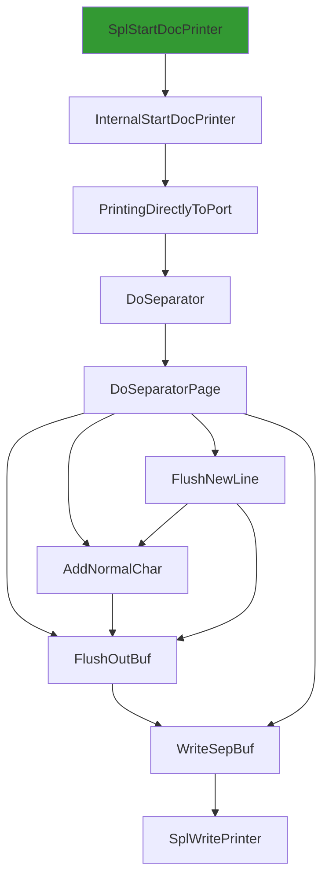
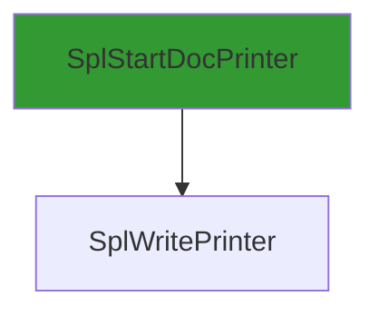

# SplWritePrinter

## Calling

Functions that call `SplWritePrinter`.



### Entrypoints

A condensed view, showing only entrypoints to the callgraph.



## Called

Functions that `SplWritePrinter` calls

```mermaid
flowchart LR
classDef shaded fill:#339933
0 --> 4["API-MS-WIN-CORE-ERRORHANDLING-L1-1-0.DLL::GetLastError"]:::shaded
282 --> 296["ReleaseRetainedRef"]
102 --> 40:::shaded
313 --> 26
102 --> 26
159 --> 26
181 --> 182["TraceLoggingRegisterEx_EtwEventRegister_EtwEventSetInformation"]
61 --> 81:::shaded
245 --> 26
24 --> 268["StopTimer"]
320 --> 29:::shaded
92 --> 146["LogPrinterStatusChange"]
0 --> 33["_guard_xfg_dispatch_icall_nop"]
310 --> 318["GetPrinterDirectory"]
102 --> 118["API-MS-WIN-DEVICES-QUERY-L1-1-0.DLL::DevFreeObjectProperties"]:::shaded
266 --> 4:::shaded
92 --> 36:::shaded
204 --> 33
290 --> 375["UpdateString"]
202 --> 26
280 --> 33
147 --> 97:::shaded
102 --> 56
297 --> 69:::shaded
92 --> 149["WPP_SF_qd"]
30 --> 290["SetLocalJob"]
25 --> 272["MSVCRT.DLL::_wcsnicmp"]:::shaded
301 --> 9:::shaded
92 --> 156["SPOOLSS.DLL::DllFreeSplStr"]:::shaded
62 --> 69:::shaded
302 --> 32
235 --> 93:::shaded
3 --> 29:::shaded
228 --> 233["WPP_SF_DDSD"]
289 --> 32
305 --> 307["WPP_SF_DDS"]
320 --> 47:::shaded
328 --> 344["RPCRT4.DLL::MesHandleFree"]:::shaded
345 --> 33
182 --> 110
30 --> 12
302 --> 97:::shaded
26 --> 47["StatusFromHResult"]:::shaded
98 --> 100["FUN_180055643"]
218 --> 220["API-MS-WIN-CORE-FILE-L1-1-0.DLL::SetFilePointerEx"]:::shaded
0["SplWritePrinter"] --> 1["API-MS-WIN-CORE-FILE-L1-1-0.DLL::WriteFile"]:::shaded
303 --> 368["GetSpoolerPolicy"]
26 --> 50["WPP_SF_Sd"]
305 --> 230:::shaded
168 --> 169["_tlgWriteTransfer_EtwEventWriteTransfer"]
0 --> 17["SeekPrinterSetEvent"]
366 --> 367["SafeRead"]
298 --> 4:::shaded
301 --> 75:::shaded
163 --> 80
15 --> 29:::shaded
19 --> 9:::shaded
189 --> 35:::shaded
102 --> 50
290 --> 284
378 --> 108:::shaded
3 --> 6:::shaded
317 --> 325["PickleJobNamedPropertyArray"]
102 --> 112["GetContainerId"]
145 --> 161["SplRegSetValue"]
290 --> 377["AccessGranted"]
245 --> 4:::shaded
368 --> 309:::shaded
280 --> 17
161 --> 163["FUN_18004e1b5"]
298 --> 140:::shaded
302 --> 96:::shaded
92 --> 93:::shaded
368 --> 315:::shaded
103 --> 134["API-MS-WIN-SECURITY-BASE-L1-1-0.DLL::SetTokenInformation"]:::shaded
14 --> 7:::shaded
23 --> 33
92 --> 148["PrinterCreateKey"]
191 --> 205["FreeIniEnvironment"]
223 --> 226["NTDLL.DLL::EtwEventWrite"]:::shaded
0 --> 31["FindJob"]:::shaded
92 --> 150["RegSetDWord"]
58 --> 77["API-MS-WIN-CORE-COM-L1-1-0.DLL::CoInitializeEx"]:::shaded
302 --> 317["GetSerializedBlobOfNamedProperties"]
152 --> 93:::shaded
279 --> 110
24 --> 36:::shaded
0 --> 27["WPP_SF_DS"]
236 --> 239["InternalIncrement"]
44 --> 33
122 --> 126["NTDLL.DLL::RtlCaptureContext"]:::shaded
169 --> 170["NTDLL.DLL::EtwEventWriteTransfer"]:::shaded
314 --> 36:::shaded
245 --> 225:::shaded
290 --> 12
372 --> 381["FUN_180060a89"]
236 --> 238["InternalDecrement"]
302 --> 313["InternalCreateSafeFile"]
0 --> 26["PrinterNonRegGetHardwareId"]
34 --> 34
158 --> 161
34 --> 6:::shaded
143 --> 3
291 --> 275
19 --> 7:::shaded
34 --> 90["SPOOLSS.DLL::ReplyPrinterChangeNotification"]:::shaded
317 --> 324["WPP_SF_dd"]
14 --> 6:::shaded
166 --> 169
15 --> 26
291 --> 3
98 --> 101["SetRequiredPrivileges"]
32 --> 36:::shaded
256 --> 63
100 --> 4:::shaded
3 --> 9:::shaded
206 --> 156:::shaded
358 --> 192:::shaded
153 --> 29:::shaded
15 --> 45["SetPortErrorEvent"]
195 --> 196["GetLastErrorAsHResult"]
300 --> 270
302 --> 270
199 --> 207["~TDriverStore"]
360 --> 361["MemoryAlloc"]
101 --> 4:::shaded
265 --> 93:::shaded
302 --> 26
52 --> 36:::shaded
236 --> 237["FUN_180034b77"]
242 --> 253["SFC_OS.DLL::SfcClose"]:::shaded
88 --> 95["GetPrinterPorts"]
63 --> 80
26 --> 52["Wait"]
191 --> 202["DeletePortEntry"]
191 --> 32
112 --> 113:::shaded
240 --> 93:::shaded
326 --> 111
78 --> 33
350 --> 355["forwardPicRead"]
30 --> 31:::shaded
365 --> 33
102 --> 110
100 --> 104["API-MS-WIN-SECURITY-BASE-L1-1-0.DLL::AccessCheck"]:::shaded
23 --> 171["API-MS-WIN-CORE-SYNCH-L1-2-0.DLL::InitOnceBeginInitialize"]:::shaded
304 --> 306["MSVCRT.DLL::_vsnwprintf"]:::shaded
28 --> 273["_tlgWriteTransfer_EventWriteTransfer"]
240 --> 249["StringCchCopyW"]:::shaded
280 --> 156:::shaded
282 --> 295["WPP_SF_qDSSSD"]
147 --> 26
334 --> 49
190 --> 75:::shaded
15 --> 32
290 --> 369["CircularChainedJobsList"]
291 --> 300
217 --> 93:::shaded
24 --> 9:::shaded
174 --> 176["_lock"]
30 --> 32
305 --> 226:::shaded
342 --> 337
3 --> 7:::shaded
102 --> 113["API-MS-WIN-DEVICES-QUERY-L1-1-0.DLL::DevGetObjectProperties"]:::shaded
191 --> 199["`scalar_deleting_destructor'"]
190 --> 36:::shaded
263 --> 155:::shaded
311 --> 69:::shaded
100 --> 107["IsClientAppContainer"]
314 --> 9:::shaded
327 --> 339["FUN_18000e168"]:::shaded
163 --> 18
201 --> 154:::shaded
182 --> 185["NTDLL.DLL::EtwEventSetInformation"]:::shaded
218 --> 224["SplLogType"]:::shaded
103 --> 136["SPOOLSS.DLL::ImpersonatePrinterClient"]:::shaded
229 --> 69:::shaded
15 --> 34
270 --> 69:::shaded
0 --> 16["API-MS-WIN-CORE-SYNCH-L1-2-0.DLL::Sleep"]:::shaded
12 --> 40["MSVCRT.DLL::_wcsicmp"]:::shaded
235 --> 156:::shaded
234 --> 236["UpdateDriverFileRefCnt"]
223 --> 230["NTDLL.DLL::EtwEventEnabled"]:::shaded
209 --> 93:::shaded
92 --> 26
240 --> 110
285 --> 13
30 --> 275["GetIniPrintProc"]
30 --> 283["DeleteJob"]:::shaded
374 --> 382["API-MS-WIN-CORE-TIMEZONE-L1-1-0.DLL::GetTimeZoneInformation"]:::shaded
30 --> 3
279 --> 230:::shaded
350 --> 352["forwardPicWrite"]
305 --> 110
163 --> 59
163 --> 49
107 --> 138["API-MS-WIN-CORE-PROCESSTHREADS-L1-1-0.DLL::GetCurrentThread"]:::shaded
30 --> 289["PauseJob"]
292 --> 169
282 --> 297["WPP_SF_qDSSS"]
290 --> 379["WPP_SF_dD"]
242 --> 224:::shaded
26 --> 51["`vector_constructor_iterator'"]
22 --> 173["~Completer"]
34 --> 89["SPOOLSS.DLL::PartialReplyPrinterChangeNotification"]:::shaded
255 --> 256["Cat"]
375 --> 383["SPOOLSS.DLL::ReallocSplStr"]:::shaded
190 --> 193["Dequeue"]:::shaded
210 --> 212["~TLink"]:::shaded
218 --> 187
30 --> 280["RestartJob"]
146 --> 23
183 --> 33
30 --> 285["RetainJob"]
366 --> 64
238 --> 241["DuplicateFile"]
302 --> 1:::shaded
325 --> 329["Encode"]
211 --> 80
242 --> 223
101 --> 106:::shaded
30 --> 5
64 --> 86["FUN_18001fe54"]
86 --> 80
19 --> 37:::shaded
189 --> 36:::shaded
277 --> 22
208 --> 85:::shaded
159 --> 3
300 --> 18
289 --> 26
317 --> 59
30 --> 286["FindServerJob"]
298 --> 299["API-MS-WIN-CORE-PROCESSTHREADS-L1-1-0.DLL::OpenProcessToken"]:::shaded
337 --> 33
333 --> 337
205 --> 199
26 --> 63["vFree"]
65 --> 67["MSVCRT.DLL::_callnewh"]:::shaded
260 --> 111
206 --> 265["FreeLangPair"]
273 --> 274["API-MS-WIN-EVENTING-PROVIDER-L1-1-0.DLL::EventWriteTransfer"]:::shaded
289 --> 187
255 --> 254:::shaded
236 --> 93:::shaded
325 --> 110
102 --> 115["WPP_SF_S"]
111 --> 119["MSVCRT.DLL::memset"]:::shaded
290 --> 34
64 --> 80
213 --> 63
107 --> 59
30 --> 34
280 --> 32
204 --> 3
318 --> 155:::shaded
350 --> 354["HResultFromWin32"]:::shaded
42 --> 43["MSVCRT.DLL::memcpy"]:::shaded
190 --> 194["NotifyConsumer"]
256 --> 259["StringCchCopyExW"]
0 --> 23["<lambda_invoker_cdecl>"]
30 --> 282["ReleaseJob"]
95 --> 141["StringCbCatW"]
168 --> 110
26 --> 32
190 --> 44
277 --> 292["Write<struct__tlgWrapperByVal<8>,struct__tlgWrapperByVal<4>,struct__tlgWrapperByRef<16>,struct__tlgWrapperByVal<4>,struct__tlgWrapSz<unsigned_short>,struct__tlgWrapSz<unsigned_short>,struct__tlgWrapperByVal<4>,struct__tlgWrapperByVal<4>,struct__tlgWrapperByVal<4>,struct__tlgWrapSz<unsigned_short>,struct__tlgWrapSz<unsigned_short>,struct__tlgWrapperByVal<4>,struct__tlgWrapperByVal<4>,struct__tlgWrapperByVal<4>,struct__tlgWrapperByVal<4>,struct__tlgWrapperByVal<4>_>"]
141 --> 142["StringCopyWorkerW"]:::shaded
34 --> 91["MapToPrinterQueueStatus"]:::shaded
92 --> 157["FreeClonedIniPrinterWithMask"]
45 --> 6:::shaded
26 --> 3
174 --> 177["__dllonexit"]
301 --> 33
340 --> 341["FUN_18000e4dd"]
112 --> 121["GetDeviceInstanceId"]
302 --> 42
191 --> 201["FreeIniMonitor"]
240 --> 246["FastStrcmpi"]
148 --> 187["WPP_SF_SD"]
100 --> 29:::shaded
357 --> 346
194 --> 195["SetAutoEventHandle"]
239 --> 263["IncrementFileRefCnt"]
153 --> 97:::shaded
0 --> 18["WPP_SF_D"]
59 --> 81["API-MS-WIN-CORE-HANDLE-L1-1-0.DLL::CloseHandle"]:::shaded
92 --> 155["SPOOLSS.DLL::AllocSplStr"]:::shaded
92 --> 95
228 --> 231["WPP_SF_DDDDD"]
378 --> 288
0 --> 11["GetMonitorHandle"]:::shaded
302 --> 308["CopyString"]:::shaded
49 --> 49
380 --> 40:::shaded
13 --> 41["API-MS-WIN-CORE-PROFILE-L1-1-0.DLL::QueryPerformanceCounter"]:::shaded
291 --> 6:::shaded
284 --> 283:::shaded
278 --> 156:::shaded
223 --> 229["WPP_SF_DD"]
314 --> 322["CreateSplWriter"]
368 --> 154:::shaded
218 --> 81:::shaded
0 --> 2["SPOOLSS.DLL::WritePrinter"]:::shaded
0 --> 10["API-MS-WIN-CORE-FILE-L1-1-0.DLL::GetFileSizeEx"]:::shaded
49 --> 66["malloc"]
278 --> 29:::shaded
92 --> 160["API-MS-WIN-CORE-SYSINFO-L1-1-0.DLL::GetTickCount"]:::shaded
317 --> 26
247 --> 246
194 --> 75:::shaded
79 --> 33
238 --> 97:::shaded
161 --> 162["FUN_18002c99f"]
280 --> 3
15 --> 13
267 --> 69:::shaded
94 --> 98["ValidateObjectAccessWithToken"]
174 --> 175["_unlock"]
133 --> 69:::shaded
102 --> 63
190 --> 131
49 --> 65["_callnewh"]
301 --> 29:::shaded
52 --> 9:::shaded
159 --> 32
357 --> 359["MesControlBlockToClientPointer"]:::shaded
334 --> 59
0 --> 5["ValidateSpoolHandle"]
300 --> 4:::shaded
381 --> 302
20 --> 266["FUN_1800521e1"]
52 --> 76["API-MS-WIN-CORE-COM-L1-1-0.DLL::CoWaitForMultipleHandles"]:::shaded
124 --> 128["API-MS-WIN-CORE-PROCESSTHREADS-L1-1-0.DLL::GetCurrentProcess"]:::shaded
263 --> 93:::shaded
302 --> 111
3 --> 4:::shaded
26 --> 61["~CoalescedSleep"]
202 --> 215["DelinkPortFromSpooler"]
280 --> 6:::shaded
255 --> 258["API-MS-WIN-CORE-FILE-L1-1-0.DLL::GetFileAttributesW"]:::shaded
202 --> 81:::shaded
22 --> 171:::shaded
234 --> 235["FreeIniVersion"]
122 --> 124["__raise_securityfailure"]
313 --> 115
325 --> 333["EndChunk"]
92 --> 145["RegSetBinaryData"]
147 --> 18
0 --> 20["FUN_180001cf8"]
92 --> 154["API-MS-WIN-CORE-REGISTRY-L1-1-0.DLL::RegCloseKey"]:::shaded
0 --> 15["UpdateJobStatus"]
88 --> 96["API-MS-WIN-SECURITY-BASE-L1-1-0.DLL::GetSecurityDescriptorLength"]:::shaded
30 --> 278["~_TELEMETRY_JOB_INFO"]
218 --> 223["SplLogEvent2"]
325 --> 33
290 --> 371["ValidateJobTimes"]:::shaded
289 --> 301["ControlPrintProcessor"]
66 --> 68["MSVCRT.DLL::malloc"]:::shaded
92 --> 4:::shaded
302 --> 311["WPP_SF_qD"]
52 --> 4:::shaded
234 --> 93:::shaded
302 --> 59
324 --> 69:::shaded
291 --> 36:::shaded
307 --> 69:::shaded
291 --> 13
150 --> 161
207 --> 59
103 --> 110
148 --> 186["SplRegCreateKey"]
302 --> 110
162 --> 163
233 --> 69:::shaded
14 --> 42["memcpy"]
103 --> 132["API-MS-WIN-SECURITY-BASE-L1-1-0.DLL::DuplicateTokenEx"]:::shaded
32 --> 29:::shaded
100 --> 93:::shaded
289 --> 36:::shaded
152 --> 97:::shaded
152 --> 157
301 --> 36:::shaded
302 --> 137:::shaded
291 --> 301
280 --> 34
152 --> 26
30 --> 277["LogSetJobCompleted"]
302 --> 133
376 --> 300
124 --> 127["API-MS-WIN-CORE-ERRORHANDLING-L1-1-0.DLL::UnhandledExceptionFilter"]:::shaded
231 --> 69:::shaded
290 --> 40:::shaded
298 --> 128:::shaded
302 --> 315["API-MS-WIN-CORE-REGISTRY-L1-1-0.DLL::RegQueryValueExW"]:::shaded
205 --> 234["DeleteIniVersion"]
30 --> 276["ShouldGetMasqDataForHandle"]:::shaded
352 --> 33
50 --> 69["NTDLL.DLL::EtwTraceMessage"]:::shaded
350 --> 49
30 --> 284["DeleteJobCheck"]
313 --> 223
82 --> 83["MSVCRT.DLL::free"]:::shaded
92 --> 32
21 --> 13
282 --> 34
301 --> 301
0 --> 9["API-MS-WIN-CORE-SYNCH-L1-1-0.DLL::EnterCriticalSection"]:::shaded
218 --> 85:::shaded
26 --> 64["Update"]
232 --> 69:::shaded
318 --> 319["FUN_18002b236"]:::shaded
80 --> 82["free"]
32 --> 38:::shaded
191 --> 154:::shaded
30 --> 291["ResumeJob"]
102 --> 117["API-MS-WIN-CORE-PROCESSTHREADS-L1-1-1.DLL::OpenProcess"]:::shaded
102 --> 62
288 --> 98
247 --> 262["GDI32.DLL::GdiArtificialDecrementDriver"]:::shaded
147 --> 111
236 --> 156:::shaded
268 --> 84:::shaded
290 --> 370["MapJobStatus"]:::shaded
182 --> 184["NTDLL.DLL::EtwEventRegister"]:::shaded
301 --> 47:::shaded
317 --> 229
318 --> 26
291 --> 302
26 --> 59["Reset"]
209 --> 44
59 --> 44
285 --> 26
290 --> 288
217 --> 218["DeletePoolFile"]
290 --> 31:::shaded
102 --> 116["KERNELBASE.DLL::GetPackageFamilyName"]:::shaded
92 --> 3
131 --> 9:::shaded
327 --> 338["SafeTell"]
92 --> 9:::shaded
242 --> 4:::shaded
328 --> 345["~TList<class_NPackageInstallLocalspl::TDriverStore::TMissingDriver>"]
352 --> 354:::shaded
300 --> 110
350 --> 351["RPCRT4.DLL::MesDecodeIncrementalHandleCreate"]:::shaded
0 --> 19["EnterSpoolerLock"]
26 --> 56["GetLastErrorAsFailHR"]
191 --> 9:::shaded
32 --> 4:::shaded
218 --> 26
92 --> 152["CloneIniPrinter"]
100 --> 106["API-MS-WIN-SECURITY-BASE-L1-1-0.DLL::AdjustTokenPrivileges"]:::shaded
165 --> 168["Write<struct__tlgWrapSz<unsigned_short>,struct__tlgWrapperByVal<4>_>"]
302 --> 4:::shaded
199 --> 80
202 --> 115
285 --> 34
92 --> 97:::shaded
100 --> 110["__security_check_cookie"]
293 --> 261:::shaded
51 --> 33
302 --> 154:::shaded
32 --> 6:::shaded
115 --> 69:::shaded
333 --> 365["SafeSeek"]
26 --> 62["WPP_SF_SS"]
356 --> 358
323 --> 222:::shaded
159 --> 190["Enqueue"]
350 --> 353["RPCRT4.DLL::MesEncodeIncrementalHandleCreate"]:::shaded
313 --> 222:::shaded
19 --> 35:::shaded
268 --> 72:::shaded
368 --> 354:::shaded
173 --> 22
102 --> 111["memset"]
157 --> 93:::shaded
0 --> 28["SplTraceErrorPrintCancelled"]
22 --> 172["atexit"]
92 --> 143["EnterSplSemAndRestoreCount"]
26 --> 60["WPP_SF_SSd"]
52 --> 75["API-MS-WIN-CORE-PROCESSTHREADS-L1-1-0.DLL::GetCurrentThreadId"]:::shaded
112 --> 118:::shaded
92 --> 33
151 --> 38:::shaded
0 --> 34["SetPrinterChange"]
0 --> 14["WriteToPrinter"]
30 --> 38:::shaded
15 --> 18
366 --> 110
291 --> 26
245 --> 254["MSVCRT.DLL::wcsrchr"]:::shaded
325 --> 335["API-MS-WIN-CORE-COM-L1-1-0.DLL::CreateStreamOnHGlobal"]:::shaded
248 --> 29:::shaded
257 --> 64
0 --> 32["LeaveSplSem"]
293 --> 294["API-MS-WIN-CORE-STRING-L2-1-0.DLL::CharLowerW"]:::shaded
318 --> 320["BoolFromHResult"]
217 --> 219["FPCloseFiles"]
191 --> 44
30 --> 156:::shaded
280 --> 13
26 --> 57["API-MS-WIN-CORE-COM-L1-1-0.DLL::CoUninitialize"]:::shaded
59 --> 78["~TRefPtrCOM<struct_IBidiRequest>"]
17 --> 6:::shaded
124 --> 129["API-MS-WIN-CORE-PROCESSTHREADS-L1-1-0.DLL::TerminateProcess"]:::shaded
0 --> 8["GetOpenedMonitor"]
191 --> 36:::shaded
340 --> 64
361 --> 362["API-MS-WIN-CORE-HEAP-L1-1-0.DLL::HeapAlloc"]:::shaded
218 --> 219
290 --> 293
101 --> 18
302 --> 314["GetWriterFromHandle"]
278 --> 4:::shaded
191 --> 200["API-MS-WIN-CORE-HEAP-L2-1-0.DLL::LocalFree"]:::shaded
201 --> 156:::shaded
34 --> 92["UpdatePrinterIni"]
317 --> 49
112 --> 110
210 --> 33
340 --> 337
201 --> 214["API-MS-WIN-CORE-LIBRARYLOADER-L1-2-0.DLL::FreeLibrary"]:::shaded
0 --> 3["EnterSplSem"]
52 --> 74["API-MS-WIN-CORE-THREADPOOL-L1-2-0.DLL::CreateThreadpoolTimer"]:::shaded
377 --> 99:::shaded
343 --> 346["ReleaseMesControlBlock"]
291 --> 187
381 --> 110
163 --> 42
327 --> 340["WriteChunk"]
314 --> 323["CreateShdWriter"]
182 --> 183["_tlgEnableCallback"]
358 --> 131
239 --> 97:::shaded
302 --> 309["API-MS-WIN-CORE-REGISTRY-L1-1-0.DLL::RegOpenKeyExW"]:::shaded
3 --> 38["API-MS-WIN-CORE-PROCESSTHREADS-L1-1-0.DLL::TlsGetValue"]:::shaded
189 --> 29:::shaded
228 --> 232["WPP_SF_DDDD"]
332 --> 364["FUN_18000e393"]:::shaded
59 --> 79["`vector_destructor_iterator'"]
326 --> 336["MakeCrcTable"]:::shaded
358 --> 360["AllocMemAlign"]
302 --> 81:::shaded
266 --> 26
71 --> 6:::shaded
191 --> 203["DeleteSpoolerCheck"]
219 --> 36:::shaded
20 --> 32
263 --> 261:::shaded
88 --> 97["SPOOLSS.DLL::DllAllocSplMem"]:::shaded
333 --> 366["CalculateCrc"]
290 --> 372["FUN_18000bbb3"]
295 --> 69:::shaded
163 --> 164["API-MS-WIN-CORE-REGISTRY-L1-1-0.DLL::RegSetValueExW"]:::shaded
172 --> 174["_onexit"]
92 --> 159["SplDeleteSpooler"]
30 --> 279["SplLogJobDiagEvent"]
300 --> 26
191 --> 11:::shaded
0 --> 12["IsXPS2GDI"]
110 --> 122["__report_gsfailure"]
191 --> 206["DeleteIniForm"]
0 --> 25["ValidRawDatatype"]
302 --> 136:::shaded
151 --> 189["LeaveSpoolerLock"]
3 --> 36["API-MS-WIN-CORE-SYNCH-L1-1-0.DLL::LeaveCriticalSection"]:::shaded
199 --> 85:::shaded
293 --> 246
313 --> 224:::shaded
377 --> 384["API-MS-WIN-SECURITY-BASE-L1-1-0.DLL::AreAllAccessesGranted"]:::shaded
381 --> 34
0 --> 21["ClearJobError"]
240 --> 242["SplMoveFileEx"]
263 --> 97:::shaded
318 --> 321["StrNCatBuff"]:::shaded
357 --> 358["AllocateMesControlBlock"]
289 --> 3
325 --> 331["JobNamedPropertyPickleArrayEncode"]
265 --> 156:::shaded
223 --> 227["GetValue"]:::shaded
166 --> 110
218 --> 93:::shaded
223 --> 110
256 --> 249:::shaded
305 --> 229
26 --> 54["StringCbCopyW"]:::shaded
240 --> 243["API-MS-WIN-CORE-FILE-L1-1-0.DLL::GetTempFileNameW"]:::shaded
237 --> 93:::shaded
152 --> 18
59 --> 80["operator_delete"]
102 --> 114["RPCRT4.DLL::RpcServerInqCallAttributesW"]:::shaded
194 --> 9:::shaded
19 --> 36:::shaded
290 --> 26
219 --> 9:::shaded
103 --> 135["API-MS-WIN-SECURITY-BASE-L1-1-0.DLL::CreateWellKnownSid"]:::shaded
218 --> 222["API-MS-WIN-CORE-FILE-L1-1-0.DLL::CreateFileW"]:::shaded
146 --> 22
3 --> 16:::shaded
26 --> 53["API-MS-WIN-CORE-COM-L1-1-0.DLL::CoTaskMemFree"]:::shaded
19 --> 6:::shaded
100 --> 108["API-MS-WIN-SECURITY-BASE-L1-1-0.DLL::CheckTokenMembership"]:::shaded
290 --> 302
52 --> 71["SleepTimerCallback"]
18 --> 69:::shaded
338 --> 33
30 --> 4:::shaded
201 --> 93:::shaded
208 --> 217["FreeFPList"]
347 --> 348["API-MS-WIN-CORE-HEAP-L1-1-0.DLL::GetProcessHeap"]:::shaded
255 --> 257["TString"]
207 --> 211["`vector_deleting_destructor'"]
100 --> 102["IsClientAssociatedWSDA"]
259 --> 111
289 --> 300["LogJobInfo"]
242 --> 250["API-MS-WIN-CORE-FILE-L2-1-0.DLL::MoveFileExW"]:::shaded
325 --> 334["ConvertToPickleArray"]
88 --> 94["CanUserSeeRealDocName"]
333 --> 342
0 --> 6["API-MS-WIN-CORE-SYNCH-L1-1-0.DLL::SetEvent"]:::shaded
121 --> 131["IsValid"]
328 --> 80
0 --> 24["UpdateTimer"]
277 --> 167:::shaded
325 --> 326["TPrinterSerializationFormat"]
165 --> 167["_tlgKeywordOn"]:::shaded
92 --> 136:::shaded
100 --> 81:::shaded
302 --> 13
176 --> 179["MSVCRT.DLL::_lock"]:::shaded
218 --> 4:::shaded
259 --> 260["StringExHandleOtherFlagsW"]
19 --> 4:::shaded
199 --> 93:::shaded
26 --> 33
333 --> 338
329 --> 33
328 --> 343["ResetMesControlBlockList"]
52 --> 72["API-MS-WIN-CORE-THREADPOOL-L1-2-0.DLL::SetThreadpoolTimer"]:::shaded
381 --> 6:::shaded
30 --> 287["SPOOLSS.DLL::SetJobW"]:::shaded
159 --> 191["SplDeleteIniSpooler"]
163 --> 111
24 --> 269["KERNEL32.DLL::GetTickCount64"]:::shaded
305 --> 111
325 --> 328["~TMes"]
282 --> 26
191 --> 115
240 --> 247["FilesUnloaded"]
61 --> 85["API-MS-WIN-CORE-SYNCH-L1-1-0.DLL::DeleteCriticalSection"]:::shaded
98 --> 99["API-MS-WIN-SECURITY-BASE-L1-1-0.DLL::MapGenericMask"]:::shaded
95 --> 54:::shaded
8 --> 39["operator_struct__INIMONITOR*___ptr64"]:::shaded
191 --> 198["API-MS-WIN-DEVICES-QUERY-L1-1-0.DLL::DevCloseObjectQuery"]:::shaded
219 --> 81:::shaded
255 --> 63
206 --> 93:::shaded
92 --> 144["NTDLL.DLL::RtlLengthSid"]:::shaded
191 --> 156:::shaded
325 --> 327["StartFormat"]
289 --> 303["GetSpoolerNumericPolicy"]
248 --> 97:::shaded
15 --> 16:::shaded
199 --> 209["~INIPRINTPROC"]
317 --> 29:::shaded
356 --> 359:::shaded
103 --> 59
15 --> 4:::shaded
191 --> 197["WPP_SF_SqDd"]
100 --> 105["API-MS-WIN-SECURITY-BASE-L1-1-0.DLL::ObjectCloseAuditAlarmW"]:::shaded
173 --> 181["Register"]
107 --> 139["API-MS-WIN-SECURITY-BASE-L1-1-0.DLL::GetTokenInformation"]:::shaded
217 --> 85:::shaded
246 --> 261["API-MS-WIN-CORE-STRING-OBSOLETE-L1-1-0.DLL::lstrcmpiW"]:::shaded
281 --> 69:::shaded
189 --> 4:::shaded
332 --> 337
204 --> 32
92 --> 96:::shaded
239 --> 241
147 --> 93:::shaded
374 --> 110
215 --> 216["RemoveFromHashBuckets"]:::shaded
205 --> 93:::shaded
327 --> 337["SafeWrite"]
290 --> 13
379 --> 69:::shaded
159 --> 187
209 --> 85:::shaded
289 --> 302["WriteShadowJob"]
174 --> 33
165 --> 23
26 --> 55["TRefPtrCOM<struct_IBidiRequest>"]:::shaded
146 --> 165["LogPrinterOfflineStatus"]
241 --> 97:::shaded
149 --> 69:::shaded
122 --> 125["NTDLL.DLL::RtlVirtualUnwind"]:::shaded
366 --> 111
197 --> 69:::shaded
302 --> 3
240 --> 29:::shaded
298 --> 138:::shaded
181 --> 33
26 --> 40:::shaded
381 --> 303
19 --> 29:::shaded
88 --> 31:::shaded
60 --> 69:::shaded
191 --> 93:::shaded
207 --> 210["~TList<class_TIniSpoolerWrapper>"]
291 --> 9:::shaded
204 --> 26
30 --> 29:::shaded
3 --> 35["API-MS-WIN-CORE-PROCESSTHREADS-L1-1-0.DLL::TlsSetValue"]:::shaded
34 --> 93["SPOOLSS.DLL::DllFreeSplMem"]:::shaded
3 --> 37["API-MS-WIN-CORE-SYNCH-L1-1-0.DLL::ResetEvent"]:::shaded
288 --> 298["GetTokenHandle"]
15 --> 44["Release"]
92 --> 147["CloneIniSpooler"]
355 --> 357["PicRead"]
291 --> 32
199 --> 208["~FilePool"]
357 --> 33
19 --> 16:::shaded
240 --> 244["API-MS-WIN-CORE-FILE-L1-1-0.DLL::CreateDirectoryW"]:::shaded
223 --> 111
173 --> 33
196 --> 4:::shaded
101 --> 97:::shaded
285 --> 295
302 --> 93:::shaded
256 --> 49
317 --> 33
318 --> 270
245 --> 255["IsCoreDriverFile"]
341 --> 64
30 --> 155:::shaded
245 --> 115
259 --> 142:::shaded
112 --> 64
177 --> 180["MSVCRT.DLL::__dllonexit"]:::shaded
56 --> 4:::shaded
203 --> 159
242 --> 252["SFC_OS.DLL::SfcFileException"]:::shaded
30 --> 281["WPP_SF_dDD"]
191 --> 204["ShutdownMonitors"]
32 --> 35:::shaded
238 --> 240["DecrementFileRefCnt"]
290 --> 373["IsXpsPrintProcessor"]
376 --> 303
218 --> 225["API-MS-WIN-CORE-FILE-L1-1-0.DLL::DeleteFileW"]:::shaded
186 --> 18
30 --> 111
146 --> 166["Write<struct__tlgWrapSz<unsigned_short>,struct__tlgWrapperByVal<4>,struct__tlgWrapperByVal<4>_>"]
103 --> 137["SPOOLSS.DLL::RevertToPrinterSelf"]:::shaded
15 --> 17
165 --> 22
30 --> 62
289 --> 275
325 --> 330["TPickle<struct_JobNamedPropertyPickleArray>"]
263 --> 264["FUN_180034e97"]:::shaded
325 --> 332["StartChunk"]
345 --> 212:::shaded
64 --> 87["FUN_180055b38"]
318 --> 249:::shaded
147 --> 42
202 --> 93:::shaded
100 --> 109["API-MS-WIN-SECURITY-BASE-L1-1-0.DLL::ObjectOpenAuditAlarmW"]:::shaded
208 --> 93:::shaded
202 --> 85:::shaded
34 --> 88["GetInfoData"]
151 --> 75:::shaded
103 --> 26
223 --> 18
346 --> 347["FreeMem"]
152 --> 4:::shaded
30 --> 13
290 --> 380["CheckDataTypes"]
341 --> 342["WriteCrc"]
289 --> 9:::shaded
87 --> 86
275 --> 12
279 --> 226:::shaded
291 --> 303
92 --> 18
19 --> 38:::shaded
330 --> 350["TMes"]
292 --> 110
101 --> 26
26 --> 46["API-MS-WIN-CORE-COM-L1-1-0.DLL::CoCreateInstance"]:::shaded
310 --> 304
0 --> 30["SplSetJob"]
17 --> 10:::shaded
186 --> 26
30 --> 25
302 --> 18
21 --> 34
27 --> 69:::shaded
302 --> 187
331 --> 363["RPCRT4.DLL::NdrMesProcEncodeDecode3"]:::shaded
195 --> 6:::shaded
131 --> 36:::shaded
245 --> 224:::shaded
290 --> 376["SetJobPosition"]
277 --> 23
245 --> 223
296 --> 13
92 --> 137:::shaded
52 --> 73["API-MS-WIN-CORE-SYNCH-L1-1-0.DLL::CreateEventW"]:::shaded
290 --> 378["AllowAccessToLocalSystemAndDelegatedPrintAdmins"]
367 --> 33
186 --> 188["API-MS-WIN-CORE-REGISTRY-L1-1-0.DLL::RegCreateKeyExW"]:::shaded
30 --> 110
242 --> 251["SFC_OS.DLL::SfcConnectToServer"]:::shaded
159 --> 44
313 --> 4:::shaded
302 --> 316["API-MS-WIN-CORE-FILE-L1-1-0.DLL::SetFilePointer"]:::shaded
131 --> 75:::shaded
147 --> 4:::shaded
204 --> 62
286 --> 31:::shaded
280 --> 293["FindIniKey"]
191 --> 26
30 --> 288["ValidateObjectAccess"]
290 --> 374["GMT2AdjustedGMTIfDST"]
218 --> 221["API-MS-WIN-CORE-FILE-L1-1-0.DLL::SetEndOfFile"]:::shaded
92 --> 151["LeaveSplSemAndResetCount"]
268 --> 271["API-MS-WIN-CORE-THREADPOOL-L1-2-0.DLL::WaitForThreadpoolTimerCallbacks"]:::shaded
361 --> 348:::shaded
218 --> 18
26 --> 49["operator_new"]
101 --> 110
302 --> 312["API-MS-WIN-CORE-FILE-L1-1-0.DLL::FlushFileBuffers"]:::shaded
24 --> 75:::shaded
190 --> 192["Link"]:::shaded
191 --> 3
358 --> 347
0 --> 13["CheckJobStatusChange"]
0 --> 29["API-MS-WIN-CORE-ERRORHANDLING-L1-1-0.DLL::SetLastError"]:::shaded
5 --> 29:::shaded
92 --> 158["RegSetString"]
187 --> 69:::shaded
33 --> 70["_guard_dispatch_icall"]:::shaded
112 --> 120["API-MS-WIN-CORE-COM-L1-1-0.DLL::StringFromGUID2"]:::shaded
255 --> 40:::shaded
302 --> 310["GetFullNameFromId"]
289 --> 13
194 --> 36:::shaded
26 --> 48["API-MS-WIN-CORE-SYNCH-L1-1-0.DLL::InitializeCriticalSectionAndSpinCount"]:::shaded
30 --> 26
151 --> 36:::shaded
350 --> 356["forwardPicAlloc"]
100 --> 103["CreateMediumIntegrityTokenFromToken"]
240 --> 248["StrCatAlloc"]
300 --> 305["SplLogEvent"]
211 --> 213["~TString"]
103 --> 56
148 --> 26
61 --> 84["API-MS-WIN-CORE-THREADPOOL-L1-2-0.DLL::CloseThreadpoolTimer"]:::shaded
173 --> 23
288 --> 81:::shaded
247 --> 33
103 --> 133["WPP_SF_d"]
190 --> 9:::shaded
266 --> 267["WPP_SF_qDd"]
332 --> 338
381 --> 300
325 --> 80
24 --> 270["WPP_SF_"]
313 --> 225:::shaded
152 --> 33
0 --> 22["get"]
0 --> 7["API-MS-WIN-CORE-SYNCH-L1-1-0.DLL::WaitForSingleObject"]:::shaded
87 --> 80
211 --> 79
373 --> 40:::shaded
241 --> 261:::shaded
124 --> 130["API-MS-WIN-CORE-ERRORHANDLING-L1-1-0.DLL::SetUnhandledExceptionFilter"]:::shaded
92 --> 29:::shaded
15 --> 3
122 --> 123["NTDLL.DLL::RtlLookupFunctionEntry"]:::shaded
240 --> 245["SplDeleteFile"]
64 --> 49
380 --> 246
300 --> 304["StringCchPrintfW"]
322 --> 222:::shaded
101 --> 93:::shaded
268 --> 270
369 --> 31:::shaded
175 --> 178["MSVCRT.DLL::_unlock"]:::shaded
189 --> 6:::shaded
209 --> 156:::shaded
223 --> 228["TraceValue"]
102 --> 59
347 --> 349["API-MS-WIN-CORE-HEAP-L1-1-0.DLL::HeapFree"]:::shaded
290 --> 4:::shaded
92 --> 153["SubChar"]
189 --> 38:::shaded
26 --> 58["InitPreferMultithreaded"]
28 --> 110
163 --> 26
107 --> 140["API-MS-WIN-CORE-PROCESSTHREADS-L1-1-0.DLL::OpenThreadToken"]:::shaded
159 --> 159
280 --> 45

```

### Endpoints

A condensed view, showing only endpoints of the callgraph.

```mermaid
flowchart LR
classDef shaded fill:#339933
root["SplWritePrinter"] --> 41["API-MS-WIN-CORE-THREADPOOL-L1-2-0.DLL::CreateThreadpoolTimer"]:::shaded
root["SplWritePrinter"] --> 38["API-MS-WIN-CORE-SYNCH-L1-2-0.DLL::Sleep"]:::shaded
root["SplWritePrinter"] --> 72["MSVCRT.DLL::_callnewh"]:::shaded
root["SplWritePrinter"] --> 106["API-MS-WIN-CORE-FILE-L1-1-0.DLL::GetFileSizeEx"]:::shaded
root["SplWritePrinter"] --> 32["API-MS-WIN-CORE-FILE-L1-1-0.DLL::SetFilePointerEx"]:::shaded
root["SplWritePrinter"] --> 62["FUN_18002b236"]:::shaded
root["SplWritePrinter"] --> 74["FUN_180034e97"]:::shaded
root["SplWritePrinter"] --> 127["API-MS-WIN-SECURITY-BASE-L1-1-0.DLL::AccessCheck"]:::shaded
root["SplWritePrinter"] --> 94["API-MS-WIN-SECURITY-BASE-L1-1-0.DLL::AdjustTokenPrivileges"]:::shaded
root["SplWritePrinter"] --> 125["API-MS-WIN-CORE-FILE-L1-1-0.DLL::SetFilePointer"]:::shaded
root["SplWritePrinter"] --> 3["API-MS-WIN-CORE-PROCESSTHREADS-L1-1-1.DLL::OpenProcess"]:::shaded
root["SplWritePrinter"] --> 75["NTDLL.DLL::EtwEventEnabled"]:::shaded
root["SplWritePrinter"] --> 65["NTDLL.DLL::EtwEventWrite"]:::shaded
root["SplWritePrinter"] --> 28["TRefPtrCOM<struct_IBidiRequest>"]:::shaded
root["SplWritePrinter"] --> 86["API-MS-WIN-CORE-ERRORHANDLING-L1-1-0.DLL::SetLastError"]:::shaded
root["SplWritePrinter"] --> 142["API-MS-WIN-CORE-SYNCH-L1-1-0.DLL::ResetEvent"]:::shaded
root["SplWritePrinter"] --> 100["ShouldGetMasqDataForHandle"]:::shaded
root["SplWritePrinter"] --> 46["SPOOLSS.DLL::DllFreeSplMem"]:::shaded
root["SplWritePrinter"] --> 137["CopyString"]:::shaded
root["SplWritePrinter"] --> 111["MSVCRT.DLL::memcpy"]:::shaded
root["SplWritePrinter"] --> 51["API-MS-WIN-SECURITY-BASE-L1-1-0.DLL::DuplicateTokenEx"]:::shaded
root["SplWritePrinter"] --> 47["KERNELBASE.DLL::GetPackageFamilyName"]:::shaded
root["SplWritePrinter"] --> 57["NTDLL.DLL::RtlLookupFunctionEntry"]:::shaded
root["SplWritePrinter"] --> 71["SPOOLSS.DLL::DllAllocSplMem"]:::shaded
root["SplWritePrinter"] --> 82["NTDLL.DLL::RtlCaptureContext"]:::shaded
root["SplWritePrinter"] --> 113["StatusFromHResult"]:::shaded
root["SplWritePrinter"] --> 143["API-MS-WIN-SECURITY-BASE-L1-1-0.DLL::CheckTokenMembership"]:::shaded
root["SplWritePrinter"] --> 129["SFC_OS.DLL::SfcFileException"]:::shaded
root["SplWritePrinter"] --> 43["API-MS-WIN-SECURITY-BASE-L1-1-0.DLL::ObjectOpenAuditAlarmW"]:::shaded
root["SplWritePrinter"] --> 128["MesControlBlockToClientPointer"]:::shaded
root["SplWritePrinter"] --> 87["API-MS-WIN-CORE-SYNCH-L1-1-0.DLL::InitializeCriticalSectionAndSpinCount"]:::shaded
root["SplWritePrinter"] --> 84["API-MS-WIN-CORE-COM-L1-1-0.DLL::CoInitializeEx"]:::shaded
root["SplWritePrinter"] --> 80["MSVCRT.DLL::_wcsnicmp"]:::shaded
root["SplWritePrinter"] --> 9["RPCRT4.DLL::MesHandleFree"]:::shaded
root["SplWritePrinter"] --> 16["API-MS-WIN-CORE-ERRORHANDLING-L1-1-0.DLL::GetLastError"]:::shaded
root["SplWritePrinter"] --> 91["API-MS-WIN-CORE-FILE-L1-1-0.DLL::FlushFileBuffers"]:::shaded
root["SplWritePrinter"] --> 61["MSVCRT.DLL::_vsnwprintf"]:::shaded
root["SplWritePrinter"] --> 8["GetValue"]:::shaded
root["SplWritePrinter"] --> 66["SPOOLSS.DLL::ReallocSplStr"]:::shaded
root["SplWritePrinter"] --> 52["RemoveFromHashBuckets"]:::shaded
root["SplWritePrinter"] --> 122["DeleteJob"]:::shaded
root["SplWritePrinter"] --> 126["Dequeue"]:::shaded
root["SplWritePrinter"] --> 98["API-MS-WIN-CORE-PROCESSTHREADS-L1-1-0.DLL::OpenProcessToken"]:::shaded
root["SplWritePrinter"] --> 2["RPCRT4.DLL::NdrMesProcEncodeDecode3"]:::shaded
root["SplWritePrinter"] --> 76["API-MS-WIN-SECURITY-BASE-L1-1-0.DLL::CreateWellKnownSid"]:::shaded
root["SplWritePrinter"] --> 95["SFC_OS.DLL::SfcConnectToServer"]:::shaded
root["SplWritePrinter"] --> 20["MSVCRT.DLL::free"]:::shaded
root["SplWritePrinter"] --> 60["SFC_OS.DLL::SfcClose"]:::shaded
root["SplWritePrinter"] --> 6["API-MS-WIN-CORE-SYNCH-L1-1-0.DLL::DeleteCriticalSection"]:::shaded
root["SplWritePrinter"] --> 118["API-MS-WIN-CORE-PROCESSTHREADS-L1-1-0.DLL::GetCurrentThreadId"]:::shaded
root["SplWritePrinter"] --> 83["SPOOLSS.DLL::AllocSplStr"]:::shaded
root["SplWritePrinter"] --> 21["FUN_18000e393"]:::shaded
root["SplWritePrinter"] --> 90["FindJob"]:::shaded
root["SplWritePrinter"] --> 23["API-MS-WIN-CORE-HEAP-L1-1-0.DLL::HeapAlloc"]:::shaded
root["SplWritePrinter"] --> 108["NTDLL.DLL::RtlLengthSid"]:::shaded
root["SplWritePrinter"] --> 36["API-MS-WIN-CORE-SYNCH-L1-1-0.DLL::LeaveCriticalSection"]:::shaded
root["SplWritePrinter"] --> 141["API-MS-WIN-DEVICES-QUERY-L1-1-0.DLL::DevCloseObjectQuery"]:::shaded
root["SplWritePrinter"] --> 134["API-MS-WIN-CORE-SYSINFO-L1-1-0.DLL::GetTickCount"]:::shaded
root["SplWritePrinter"] --> 42["API-MS-WIN-CORE-THREADPOOL-L1-2-0.DLL::WaitForThreadpoolTimerCallbacks"]:::shaded
root["SplWritePrinter"] --> 115["API-MS-WIN-CORE-COM-L1-1-0.DLL::CoUninitialize"]:::shaded
root["SplWritePrinter"] --> 131["API-MS-WIN-CORE-STRING-L2-1-0.DLL::CharLowerW"]:::shaded
root["SplWritePrinter"] --> 109["API-MS-WIN-CORE-REGISTRY-L1-1-0.DLL::RegSetValueExW"]:::shaded
root["SplWritePrinter"] --> 112["GDI32.DLL::GdiArtificialDecrementDriver"]:::shaded
root["SplWritePrinter"] --> 19["API-MS-WIN-CORE-FILE-L1-1-0.DLL::DeleteFileW"]:::shaded
root["SplWritePrinter"] --> 56["FUN_18000e168"]:::shaded
root["SplWritePrinter"] --> 7["API-MS-WIN-CORE-ERRORHANDLING-L1-1-0.DLL::SetUnhandledExceptionFilter"]:::shaded
root["SplWritePrinter"] --> 45["NTDLL.DLL::EtwEventWriteTransfer"]:::shaded
root["SplWritePrinter"] --> 63["API-MS-WIN-CORE-PROCESSTHREADS-L1-1-0.DLL::TlsSetValue"]:::shaded
root["SplWritePrinter"] --> 85["API-MS-WIN-CORE-COM-L1-1-0.DLL::CoCreateInstance"]:::shaded
root["SplWritePrinter"] --> 25["SPOOLSS.DLL::WritePrinter"]:::shaded
root["SplWritePrinter"] --> 92["_tlgKeywordOn"]:::shaded
root["SplWritePrinter"] --> 119["API-MS-WIN-CORE-PROFILE-L1-1-0.DLL::QueryPerformanceCounter"]:::shaded
root["SplWritePrinter"] --> 89["SPOOLSS.DLL::SetJobW"]:::shaded
root["SplWritePrinter"] --> 105["Link"]:::shaded
root["SplWritePrinter"] --> 114["StrNCatBuff"]:::shaded
root["SplWritePrinter"] --> 14["API-MS-WIN-CORE-HEAP-L2-1-0.DLL::LocalFree"]:::shaded
root["SplWritePrinter"] --> 26["MSVCRT.DLL::_lock"]:::shaded
root["SplWritePrinter"] --> 48["API-MS-WIN-CORE-PROCESSTHREADS-L1-1-0.DLL::GetCurrentThread"]:::shaded
root["SplWritePrinter"] --> 5["KERNEL32.DLL::GetTickCount64"]:::shaded
root["SplWritePrinter"] --> 58["API-MS-WIN-CORE-FILE-L1-1-0.DLL::CreateFileW"]:::shaded
root["SplWritePrinter"] --> 1["MakeCrcTable"]:::shaded
root["SplWritePrinter"] --> 78["operator_struct__INIMONITOR*___ptr64"]:::shaded
root["SplWritePrinter"] --> 27["API-MS-WIN-CORE-FILE-L1-1-0.DLL::WriteFile"]:::shaded
root["SplWritePrinter"] --> 107["_guard_dispatch_icall"]:::shaded
root["SplWritePrinter"] --> 69["API-MS-WIN-CORE-REGISTRY-L1-1-0.DLL::RegOpenKeyExW"]:::shaded
root["SplWritePrinter"] --> 73["SPOOLSS.DLL::ImpersonatePrinterClient"]:::shaded
root["SplWritePrinter"] --> 104["API-MS-WIN-CORE-SYNCH-L1-2-0.DLL::InitOnceBeginInitialize"]:::shaded
root["SplWritePrinter"] --> 37["API-MS-WIN-CORE-REGISTRY-L1-1-0.DLL::RegQueryValueExW"]:::shaded
root["SplWritePrinter"] --> 124["API-MS-WIN-CORE-PROCESSTHREADS-L1-1-0.DLL::OpenThreadToken"]:::shaded
root["SplWritePrinter"] --> 110["API-MS-WIN-CORE-LIBRARYLOADER-L1-2-0.DLL::FreeLibrary"]:::shaded
root["SplWritePrinter"] --> 12["API-MS-WIN-CORE-PROCESSTHREADS-L1-1-0.DLL::GetCurrentProcess"]:::shaded
root["SplWritePrinter"] --> 10["API-MS-WIN-CORE-REGISTRY-L1-1-0.DLL::RegCloseKey"]:::shaded
root["SplWritePrinter"] --> 145["NTDLL.DLL::EtwEventSetInformation"]:::shaded
root["SplWritePrinter"] --> 49["API-MS-WIN-SECURITY-BASE-L1-1-0.DLL::GetSecurityDescriptorLength"]:::shaded
root["SplWritePrinter"] --> 39["API-MS-WIN-CORE-HANDLE-L1-1-0.DLL::CloseHandle"]:::shaded
root["SplWritePrinter"] --> 99["StringCbCopyW"]:::shaded
root["SplWritePrinter"] --> 151["API-MS-WIN-SECURITY-BASE-L1-1-0.DLL::ObjectCloseAuditAlarmW"]:::shaded
root["SplWritePrinter"] --> 102["API-MS-WIN-CORE-THREADPOOL-L1-2-0.DLL::CloseThreadpoolTimer"]:::shaded
root["SplWritePrinter"] --> 97["API-MS-WIN-CORE-FILE-L1-1-0.DLL::SetEndOfFile"]:::shaded
root["SplWritePrinter"] --> 24["NTDLL.DLL::EtwTraceMessage"]:::shaded
root["SplWritePrinter"] --> 67["API-MS-WIN-CORE-FILE-L1-1-0.DLL::GetFileAttributesW"]:::shaded
root["SplWritePrinter"] --> 79["API-MS-WIN-CORE-FILE-L1-1-0.DLL::CreateDirectoryW"]:::shaded
root["SplWritePrinter"] --> 148["API-MS-WIN-SECURITY-BASE-L1-1-0.DLL::AreAllAccessesGranted"]:::shaded
root["SplWritePrinter"] --> 15["SPOOLSS.DLL::PartialReplyPrinterChangeNotification"]:::shaded
root["SplWritePrinter"] --> 22["StringCopyWorkerW"]:::shaded
root["SplWritePrinter"] --> 149["API-MS-WIN-CORE-COM-L1-1-0.DLL::CoWaitForMultipleHandles"]:::shaded
root["SplWritePrinter"] --> 59["MapToPrinterQueueStatus"]:::shaded
root["SplWritePrinter"] --> 4["API-MS-WIN-CORE-REGISTRY-L1-1-0.DLL::RegCreateKeyExW"]:::shaded
root["SplWritePrinter"] --> 29["API-MS-WIN-SECURITY-BASE-L1-1-0.DLL::MapGenericMask"]:::shaded
root["SplWritePrinter"] --> 116["API-MS-WIN-CORE-TIMEZONE-L1-1-0.DLL::GetTimeZoneInformation"]:::shaded
root["SplWritePrinter"] --> 135["HResultFromWin32"]:::shaded
root["SplWritePrinter"] --> 117["MSVCRT.DLL::memset"]:::shaded
root["SplWritePrinter"] --> 120["MapJobStatus"]:::shaded
root["SplWritePrinter"] --> 44["MSVCRT.DLL::__dllonexit"]:::shaded
root["SplWritePrinter"] --> 50["API-MS-WIN-SECURITY-BASE-L1-1-0.DLL::SetTokenInformation"]:::shaded
root["SplWritePrinter"] --> 96["API-MS-WIN-CORE-SYNCH-L1-1-0.DLL::CreateEventW"]:::shaded
root["SplWritePrinter"] --> 64["API-MS-WIN-DEVICES-QUERY-L1-1-0.DLL::DevGetObjectProperties"]:::shaded
root["SplWritePrinter"] --> 132["MSVCRT.DLL::wcsrchr"]:::shaded
root["SplWritePrinter"] --> 144["SPOOLSS.DLL::RevertToPrinterSelf"]:::shaded
root["SplWritePrinter"] --> 31["API-MS-WIN-CORE-STRING-OBSOLETE-L1-1-0.DLL::lstrcmpiW"]:::shaded
root["SplWritePrinter"] --> 81["API-MS-WIN-CORE-SYNCH-L1-1-0.DLL::SetEvent"]:::shaded
root["SplWritePrinter"] --> 35["NTDLL.DLL::RtlVirtualUnwind"]:::shaded
root["SplWritePrinter"] --> 130["API-MS-WIN-DEVICES-QUERY-L1-1-0.DLL::DevFreeObjectProperties"]:::shaded
root["SplWritePrinter"] --> 136["SPOOLSS.DLL::DllFreeSplStr"]:::shaded
root["SplWritePrinter"] --> 146["API-MS-WIN-CORE-FILE-L1-1-0.DLL::GetTempFileNameW"]:::shaded
root["SplWritePrinter"] --> 147["API-MS-WIN-CORE-COM-L1-1-0.DLL::StringFromGUID2"]:::shaded
root["SplWritePrinter"] --> 133["API-MS-WIN-CORE-COM-L1-1-0.DLL::CoTaskMemFree"]:::shaded
root["SplWritePrinter"] --> 33["RPCRT4.DLL::MesEncodeIncrementalHandleCreate"]:::shaded
root["SplWritePrinter"] --> 101["MSVCRT.DLL::_wcsicmp"]:::shaded
root["SplWritePrinter"] --> 93["API-MS-WIN-CORE-HEAP-L1-1-0.DLL::HeapFree"]:::shaded
root["SplWritePrinter"] --> 17["API-MS-WIN-CORE-PROCESSTHREADS-L1-1-0.DLL::TlsGetValue"]:::shaded
root["SplWritePrinter"] --> 121["API-MS-WIN-CORE-SYNCH-L1-1-0.DLL::WaitForSingleObject"]:::shaded
root["SplWritePrinter"] --> 140["API-MS-WIN-SECURITY-BASE-L1-1-0.DLL::GetTokenInformation"]:::shaded
root["SplWritePrinter"] --> 138["ValidateJobTimes"]:::shaded
root["SplWritePrinter"] --> 77["MSVCRT.DLL::malloc"]:::shaded
root["SplWritePrinter"] --> 123["~TLink"]:::shaded
root["SplWritePrinter"] --> 139["API-MS-WIN-CORE-SYNCH-L1-1-0.DLL::EnterCriticalSection"]:::shaded
root["SplWritePrinter"] --> 13["API-MS-WIN-CORE-PROCESSTHREADS-L1-1-0.DLL::TerminateProcess"]:::shaded
root["SplWritePrinter"] --> 11["API-MS-WIN-CORE-THREADPOOL-L1-2-0.DLL::SetThreadpoolTimer"]:::shaded
root["SplWritePrinter"] --> 150["API-MS-WIN-CORE-HEAP-L1-1-0.DLL::GetProcessHeap"]:::shaded
root["SplWritePrinter"] --> 0["API-MS-WIN-CORE-FILE-L2-1-0.DLL::MoveFileExW"]:::shaded
root["SplWritePrinter"] --> 88["SplLogType"]:::shaded
root["SplWritePrinter"] --> 30["StringCchCopyW"]:::shaded
root["SplWritePrinter"] --> 40["API-MS-WIN-CORE-COM-L1-1-0.DLL::CreateStreamOnHGlobal"]:::shaded
root["SplWritePrinter"] --> 18["GetMonitorHandle"]:::shaded
root["SplWritePrinter"] --> 55["RPCRT4.DLL::RpcServerInqCallAttributesW"]:::shaded
root["SplWritePrinter"] --> 54["NTDLL.DLL::EtwEventRegister"]:::shaded
root["SplWritePrinter"] --> 70["RPCRT4.DLL::MesDecodeIncrementalHandleCreate"]:::shaded
root["SplWritePrinter"] --> 68["MSVCRT.DLL::_unlock"]:::shaded
root["SplWritePrinter"] --> 53["API-MS-WIN-CORE-ERRORHANDLING-L1-1-0.DLL::UnhandledExceptionFilter"]:::shaded
root["SplWritePrinter"] --> 34["API-MS-WIN-EVENTING-PROVIDER-L1-1-0.DLL::EventWriteTransfer"]:::shaded
root["SplWritePrinter"] --> 103["SPOOLSS.DLL::ReplyPrinterChangeNotification"]:::shaded

```



