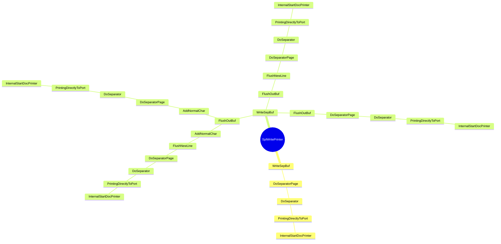

```mermaid
mindmap
root((SplWritePrinter))
      API-MS-WIN-CORE-PROCESSTHREADS-L1-1-0.DLL::TlsSetValue
      API-MS-WIN-CORE-SYNCH-L1-1-0.DLL::LeaveCriticalSection
      API-MS-WIN-CORE-SYNCH-L1-1-0.DLL::EnterCriticalSection
      API-MS-WIN-CORE-ERRORHANDLING-L1-1-0.DLL::SetLastError
      API-MS-WIN-CORE-ERRORHANDLING-L1-1-0.DLL::GetLastError
      API-MS-WIN-CORE-SYNCH-L1-1-0.DLL::ResetEvent
      API-MS-WIN-CORE-PROCESSTHREADS-L1-1-0.DLL::TlsGetValue
      API-MS-WIN-CORE-SYNCH-L1-1-0.DLL::SetEvent
      API-MS-WIN-CORE-SYNCH-L1-2-0.DLL::Sleep
      API-MS-WIN-CORE-SYNCH-L1-1-0.DLL::WaitForSingleObject
      operator_struct__INIMONITOR*___ptr64
      MSVCRT.DLL::_wcsicmp
      API-MS-WIN-CORE-PROFILE-L1-1-0.DLL::QueryPerformanceCounter
      memcpy
        MSVCRT.DLL::memcpy
      API-MS-WIN-CORE-SYNCH-L1-1-0.DLL::SetEvent
      API-MS-WIN-CORE-SYNCH-L1-1-0.DLL::WaitForSingleObject
      PrinterNonRegGetHardwareId
        API-MS-WIN-CORE-COM-L1-1-0.DLL::CoCreateInstance
        MSVCRT.DLL::_wcsicmp
        StatusFromHResult
        API-MS-WIN-CORE-SYNCH-L1-1-0.DLL::InitializeCriticalSectionAndSpinCount
        operator_new
        EnterSplSem
        WPP_SF_Sd
        `vector_constructor_iterator'
        Wait
        API-MS-WIN-CORE-COM-L1-1-0.DLL::CoTaskMemFree
        StringCbCopyW
        TRefPtrCOM<struct_IBidiRequest>
        GetLastErrorAsFailHR
        API-MS-WIN-CORE-COM-L1-1-0.DLL::CoUninitialize
        InitPreferMultithreaded
        Reset
        WPP_SF_SSd
        ~CoalescedSleep
        WPP_SF_SS
        vFree
        Update
        LeaveSplSem
        _guard_xfg_dispatch_icall_nop
      Release
        _guard_xfg_dispatch_icall_nop
      SeekPrinterSetEvent
        API-MS-WIN-CORE-FILE-L1-1-0.DLL::GetFileSizeEx
        API-MS-WIN-CORE-SYNCH-L1-1-0.DLL::SetEvent
      WPP_SF_D
        NTDLL.DLL::EtwTraceMessage
      SetPortErrorEvent
        API-MS-WIN-CORE-SYNCH-L1-1-0.DLL::SetEvent
      API-MS-WIN-CORE-ERRORHANDLING-L1-1-0.DLL::SetLastError
      EnterSplSem
        API-MS-WIN-CORE-PROCESSTHREADS-L1-1-0.DLL::TlsSetValue
        API-MS-WIN-CORE-SYNCH-L1-1-0.DLL::LeaveCriticalSection
        API-MS-WIN-CORE-SYNCH-L1-1-0.DLL::EnterCriticalSection
        API-MS-WIN-CORE-ERRORHANDLING-L1-1-0.DLL::GetLastError
        API-MS-WIN-CORE-SYNCH-L1-1-0.DLL::ResetEvent
        API-MS-WIN-CORE-PROCESSTHREADS-L1-1-0.DLL::TlsGetValue
        API-MS-WIN-CORE-SYNCH-L1-1-0.DLL::SetEvent
        API-MS-WIN-CORE-SYNCH-L1-2-0.DLL::Sleep
        API-MS-WIN-CORE-SYNCH-L1-1-0.DLL::WaitForSingleObject
      CheckJobStatusChange
        API-MS-WIN-CORE-PROFILE-L1-1-0.DLL::QueryPerformanceCounter
      API-MS-WIN-CORE-ERRORHANDLING-L1-1-0.DLL::GetLastError
      LeaveSplSem
        API-MS-WIN-CORE-PROCESSTHREADS-L1-1-0.DLL::TlsSetValue
        API-MS-WIN-CORE-SYNCH-L1-1-0.DLL::LeaveCriticalSection
        API-MS-WIN-CORE-ERRORHANDLING-L1-1-0.DLL::SetLastError
        API-MS-WIN-CORE-SYNCH-L1-1-0.DLL::SetEvent
        API-MS-WIN-CORE-PROCESSTHREADS-L1-1-0.DLL::TlsGetValue
      API-MS-WIN-CORE-SYNCH-L1-2-0.DLL::Sleep
      SetPrinterChange
        GetInfoData
        SPOOLSS.DLL::PartialReplyPrinterChangeNotification
        SPOOLSS.DLL::ReplyPrinterChangeNotification
        MapToPrinterQueueStatus
        API-MS-WIN-CORE-SYNCH-L1-1-0.DLL::SetEvent
        UpdatePrinterIni
        SPOOLSS.DLL::DllFreeSplMem
      API-MS-WIN-CORE-FILE-L1-1-0.DLL::GetFileSizeEx
      API-MS-WIN-CORE-SYNCH-L1-1-0.DLL::SetEvent
      NTDLL.DLL::EtwTraceMessage
      API-MS-WIN-CORE-ERRORHANDLING-L1-1-0.DLL::SetLastError
      API-MS-WIN-CORE-SYNCH-L1-1-0.DLL::EnterCriticalSection
      API-MS-WIN-CORE-ERRORHANDLING-L1-1-0.DLL::GetLastError
      API-MS-WIN-CORE-PROCESSTHREADS-L1-1-0.DLL::TlsGetValue
      API-MS-WIN-CORE-SYNCH-L1-1-0.DLL::ResetEvent
      API-MS-WIN-CORE-PROCESSTHREADS-L1-1-0.DLL::TlsSetValue
      API-MS-WIN-CORE-SYNCH-L1-2-0.DLL::Sleep
      API-MS-WIN-CORE-SYNCH-L1-1-0.DLL::LeaveCriticalSection
      API-MS-WIN-CORE-SYNCH-L1-1-0.DLL::WaitForSingleObject
      LeaveSplSem
      FUN_1800521e1
        PrinterNonRegGetHardwareId
        WPP_SF_qDd
      CheckJobStatusChange
        API-MS-WIN-CORE-PROFILE-L1-1-0.DLL::QueryPerformanceCounter
      SetPrinterChange
        GetInfoData
        SPOOLSS.DLL::PartialReplyPrinterChangeNotification
        SPOOLSS.DLL::ReplyPrinterChangeNotification
        MapToPrinterQueueStatus
        API-MS-WIN-CORE-SYNCH-L1-1-0.DLL::SetEvent
        UpdatePrinterIni
        SPOOLSS.DLL::DllFreeSplMem
      ~Completer
        <lambda_invoker_cdecl>
        get
        _guard_xfg_dispatch_icall_nop
      API-MS-WIN-CORE-SYNCH-L1-2-0.DLL::InitOnceBeginInitialize
      atexit
        _onexit
      API-MS-WIN-CORE-SYNCH-L1-2-0.DLL::InitOnceBeginInitialize
      _guard_xfg_dispatch_icall_nop
        _guard_dispatch_icall
      API-MS-WIN-CORE-SYNCH-L1-1-0.DLL::EnterCriticalSection
      API-MS-WIN-CORE-PROCESSTHREADS-L1-1-0.DLL::GetCurrentThreadId
      StopTimer
        API-MS-WIN-CORE-THREADPOOL-L1-2-0.DLL::SetThreadpoolTimer
        API-MS-WIN-CORE-THREADPOOL-L1-2-0.DLL::CloseThreadpoolTimer
        API-MS-WIN-CORE-THREADPOOL-L1-2-0.DLL::WaitForThreadpoolTimerCallbacks
        WPP_SF_
      KERNEL32.DLL::GetTickCount64
      API-MS-WIN-CORE-SYNCH-L1-1-0.DLL::LeaveCriticalSection
      WPP_SF_
        NTDLL.DLL::EtwTraceMessage
      MSVCRT.DLL::_wcsnicmp
      StringCbCopyW
      Update
        FUN_18001fe54
        FUN_180055b38
        operator_new
        operator_delete
      API-MS-WIN-CORE-SYNCH-L1-1-0.DLL::InitializeCriticalSectionAndSpinCount
      EnterSplSem
        API-MS-WIN-CORE-SYNCH-L1-1-0.DLL::ResetEvent
        API-MS-WIN-CORE-SYNCH-L1-1-0.DLL::EnterCriticalSection
        API-MS-WIN-CORE-ERRORHANDLING-L1-1-0.DLL::SetLastError
        API-MS-WIN-CORE-PROCESSTHREADS-L1-1-0.DLL::TlsGetValue
        API-MS-WIN-CORE-ERRORHANDLING-L1-1-0.DLL::GetLastError
        API-MS-WIN-CORE-SYNCH-L1-1-0.DLL::SetEvent
        API-MS-WIN-CORE-SYNCH-L1-2-0.DLL::Sleep
        API-MS-WIN-CORE-PROCESSTHREADS-L1-1-0.DLL::TlsSetValue
        API-MS-WIN-CORE-SYNCH-L1-1-0.DLL::WaitForSingleObject
        API-MS-WIN-CORE-SYNCH-L1-1-0.DLL::LeaveCriticalSection
      WPP_SF_SSd
        NTDLL.DLL::EtwTraceMessage
      API-MS-WIN-CORE-COM-L1-1-0.DLL::CoTaskMemFree
      MSVCRT.DLL::_wcsicmp
      WPP_SF_SS
        NTDLL.DLL::EtwTraceMessage
      operator_new
        malloc
        _callnewh
      InitPreferMultithreaded
        API-MS-WIN-CORE-COM-L1-1-0.DLL::CoInitializeEx
      Reset
        ~TRefPtrCOM<struct_IBidiRequest>
        `vector_destructor_iterator'
        operator_delete
      ~CoalescedSleep
        API-MS-WIN-CORE-THREADPOOL-L1-2-0.DLL::CloseThreadpoolTimer
        API-MS-WIN-CORE-HANDLE-L1-1-0.DLL::CloseHandle
        API-MS-WIN-CORE-SYNCH-L1-1-0.DLL::DeleteCriticalSection
      GetLastErrorAsFailHR
        API-MS-WIN-CORE-ERRORHANDLING-L1-1-0.DLL::GetLastError
      vFree
        operator_delete
      StatusFromHResult
      API-MS-WIN-CORE-COM-L1-1-0.DLL::CoCreateInstance
      TRefPtrCOM<struct_IBidiRequest>
      LeaveSplSem
        API-MS-WIN-CORE-ERRORHANDLING-L1-1-0.DLL::SetLastError
        API-MS-WIN-CORE-PROCESSTHREADS-L1-1-0.DLL::TlsGetValue
        API-MS-WIN-CORE-ERRORHANDLING-L1-1-0.DLL::GetLastError
        API-MS-WIN-CORE-SYNCH-L1-1-0.DLL::SetEvent
        API-MS-WIN-CORE-PROCESSTHREADS-L1-1-0.DLL::TlsSetValue
        API-MS-WIN-CORE-SYNCH-L1-1-0.DLL::LeaveCriticalSection
      Wait
        SleepTimerCallback
        API-MS-WIN-CORE-THREADPOOL-L1-2-0.DLL::SetThreadpoolTimer
        API-MS-WIN-CORE-THREADPOOL-L1-2-0.DLL::CreateThreadpoolTimer
        API-MS-WIN-CORE-SYNCH-L1-1-0.DLL::EnterCriticalSection
        API-MS-WIN-CORE-PROCESSTHREADS-L1-1-0.DLL::GetCurrentThreadId
        API-MS-WIN-CORE-SYNCH-L1-1-0.DLL::CreateEventW
        API-MS-WIN-CORE-ERRORHANDLING-L1-1-0.DLL::GetLastError
        API-MS-WIN-CORE-COM-L1-1-0.DLL::CoWaitForMultipleHandles
        API-MS-WIN-CORE-SYNCH-L1-1-0.DLL::LeaveCriticalSection
      _guard_xfg_dispatch_icall_nop
        _guard_dispatch_icall
      WPP_SF_Sd
        NTDLL.DLL::EtwTraceMessage
      API-MS-WIN-CORE-COM-L1-1-0.DLL::CoUninitialize
      `vector_constructor_iterator'
        _guard_xfg_dispatch_icall_nop
      NTDLL.DLL::EtwTraceMessage
      __security_check_cookie
        __report_gsfailure
      _tlgWriteTransfer_EventWriteTransfer
        API-MS-WIN-EVENTING-PROVIDER-L1-1-0.DLL::EventWriteTransfer
      GetIniPrintProc
        IsXPS2GDI
      ShouldGetMasqDataForHandle
      EnterSplSem
        API-MS-WIN-CORE-SYNCH-L1-1-0.DLL::ResetEvent
        API-MS-WIN-CORE-SYNCH-L1-1-0.DLL::EnterCriticalSection
        API-MS-WIN-CORE-ERRORHANDLING-L1-1-0.DLL::SetLastError
        API-MS-WIN-CORE-PROCESSTHREADS-L1-1-0.DLL::TlsGetValue
        API-MS-WIN-CORE-ERRORHANDLING-L1-1-0.DLL::GetLastError
        API-MS-WIN-CORE-SYNCH-L1-1-0.DLL::SetEvent
        API-MS-WIN-CORE-SYNCH-L1-2-0.DLL::Sleep
        API-MS-WIN-CORE-PROCESSTHREADS-L1-1-0.DLL::TlsSetValue
        API-MS-WIN-CORE-SYNCH-L1-1-0.DLL::WaitForSingleObject
        API-MS-WIN-CORE-SYNCH-L1-1-0.DLL::LeaveCriticalSection
      API-MS-WIN-CORE-ERRORHANDLING-L1-1-0.DLL::GetLastError
      WPP_SF_SS
        NTDLL.DLL::EtwTraceMessage
      ValidateSpoolHandle
        API-MS-WIN-CORE-ERRORHANDLING-L1-1-0.DLL::SetLastError
      LogSetJobCompleted
        _tlgKeywordOn
        get
        <lambda_invoker_cdecl>
        Write<struct__tlgWrapperByVal<8>,struct__tlgWrapperByVal<4>,struct__tlgWrapperByRef<16>,struct__tlgWrapperByVal<4>,struct__tlgWrapSz<unsigned_short>,struct__tlgWrapSz<unsigned_short>,struct__tlgWrapperByVal<4>,struct__tlgWrapperByVal<4>,struct__tlgWrapperByVal<4>,struct__tlgWrapSz<unsigned_short>,struct__tlgWrapSz<unsigned_short>,struct__tlgWrapperByVal<4>,struct__tlgWrapperByVal<4>,struct__tlgWrapperByVal<4>,struct__tlgWrapperByVal<4>,struct__tlgWrapperByVal<4>_>
      ~_TELEMETRY_JOB_INFO
        SPOOLSS.DLL::DllFreeSplStr
        API-MS-WIN-CORE-ERRORHANDLING-L1-1-0.DLL::SetLastError
        API-MS-WIN-CORE-ERRORHANDLING-L1-1-0.DLL::GetLastError
      __security_check_cookie
        __report_gsfailure
      SplLogJobDiagEvent
        NTDLL.DLL::EtwEventWrite
        __security_check_cookie
        NTDLL.DLL::EtwEventEnabled
      IsXPS2GDI
        MSVCRT.DLL::_wcsicmp
      RestartJob
        SeekPrinterSetEvent
        SetPortErrorEvent
        SPOOLSS.DLL::DllFreeSplStr
        EnterSplSem
        CheckJobStatusChange
        LeaveSplSem
        FindIniKey
        API-MS-WIN-CORE-SYNCH-L1-1-0.DLL::SetEvent
        SetPrinterChange
        _guard_xfg_dispatch_icall_nop
      IsXPS2GDI
        MSVCRT.DLL::_wcsicmp
      CheckJobStatusChange
        API-MS-WIN-CORE-PROFILE-L1-1-0.DLL::QueryPerformanceCounter
      WPP_SF_dDD
        NTDLL.DLL::EtwTraceMessage
      ReleaseJob
        PrinterNonRegGetHardwareId
        WPP_SF_qDSSSD
        ReleaseRetainedRef
        WPP_SF_qDSSS
        SetPrinterChange
      DeleteJob
      DeleteJobCheck
      RetainJob
        PrinterNonRegGetHardwareId
        WPP_SF_qDSSSD
        CheckJobStatusChange
        SetPrinterChange
      FindServerJob
        FindJob
      API-MS-WIN-CORE-PROCESSTHREADS-L1-1-0.DLL::TlsGetValue
      SPOOLSS.DLL::SetJobW
      ValidateObjectAccess
        GetTokenHandle
        API-MS-WIN-CORE-HANDLE-L1-1-0.DLL::CloseHandle
        ValidateObjectAccessWithToken
      PrinterNonRegGetHardwareId
        Update
        MSVCRT.DLL::_wcsicmp
        StringCbCopyW
        API-MS-WIN-CORE-COM-L1-1-0.DLL::CoCreateInstance
        EnterSplSem
        GetLastErrorAsFailHR
        WPP_SF_SS
        InitPreferMultithreaded
        TRefPtrCOM<struct_IBidiRequest>
        API-MS-WIN-CORE-SYNCH-L1-1-0.DLL::InitializeCriticalSectionAndSpinCount
        operator_new
        `vector_constructor_iterator'
        Reset
        StatusFromHResult
        ~CoalescedSleep
        vFree
        API-MS-WIN-CORE-COM-L1-1-0.DLL::CoUninitialize
        WPP_SF_SSd
        API-MS-WIN-CORE-COM-L1-1-0.DLL::CoTaskMemFree
        Wait
        WPP_SF_Sd
        LeaveSplSem
        _guard_xfg_dispatch_icall_nop
      ValidRawDatatype
        MSVCRT.DLL::_wcsnicmp
      SPOOLSS.DLL::AllocSplStr
      PauseJob
        PrinterNonRegGetHardwareId
        GetIniPrintProc
        LogJobInfo
        API-MS-WIN-CORE-SYNCH-L1-1-0.DLL::EnterCriticalSection
        EnterSplSem
        ControlPrintProcessor
        CheckJobStatusChange
        LeaveSplSem
        WriteShadowJob
        WPP_SF_SD
        API-MS-WIN-CORE-SYNCH-L1-1-0.DLL::LeaveCriticalSection
        GetSpoolerNumericPolicy
      SetLocalJob
        CircularChainedJobsList
        FindIniKey
        MapJobStatus
        ValidateJobTimes
        API-MS-WIN-CORE-ERRORHANDLING-L1-1-0.DLL::GetLastError
        ValidateObjectAccess
        FUN_18000bbb3
        IsXpsPrintProcessor
        PrinterNonRegGetHardwareId
        GMT2AdjustedGMTIfDST
        UpdateString
        SetJobPosition
        MSVCRT.DLL::_wcsicmp
        IsXPS2GDI
        AccessGranted
        AllowAccessToLocalSystemAndDelegatedPrintAdmins
        CheckJobStatusChange
        FindJob
        DeleteJobCheck
        WriteShadowJob
        WPP_SF_dD
        CheckDataTypes
        SetPrinterChange
      API-MS-WIN-CORE-ERRORHANDLING-L1-1-0.DLL::SetLastError
      SPOOLSS.DLL::DllFreeSplStr
      FindJob
      LeaveSplSem
        API-MS-WIN-CORE-PROCESSTHREADS-L1-1-0.DLL::TlsSetValue
        API-MS-WIN-CORE-PROCESSTHREADS-L1-1-0.DLL::TlsGetValue
        API-MS-WIN-CORE-ERRORHANDLING-L1-1-0.DLL::GetLastError
        API-MS-WIN-CORE-SYNCH-L1-1-0.DLL::SetEvent
        API-MS-WIN-CORE-SYNCH-L1-1-0.DLL::LeaveCriticalSection
      SetPrinterChange
        GetInfoData
        SPOOLSS.DLL::PartialReplyPrinterChangeNotification
        SPOOLSS.DLL::ReplyPrinterChangeNotification
        MapToPrinterQueueStatus
        API-MS-WIN-CORE-SYNCH-L1-1-0.DLL::SetEvent
        UpdatePrinterIni
        SPOOLSS.DLL::DllFreeSplMem
      ResumeJob
        GetIniPrintProc
        LogJobInfo
        EnterSplSem
        GetSpoolerNumericPolicy
        API-MS-WIN-CORE-SYNCH-L1-1-0.DLL::SetEvent
        PrinterNonRegGetHardwareId
        API-MS-WIN-CORE-SYNCH-L1-1-0.DLL::EnterCriticalSection
        WriteShadowJob
        CheckJobStatusChange
        LeaveSplSem
        ControlPrintProcessor
        WPP_SF_SD
        API-MS-WIN-CORE-SYNCH-L1-1-0.DLL::LeaveCriticalSection
      memset
        MSVCRT.DLL::memset
      API-MS-WIN-CORE-ERRORHANDLING-L1-1-0.DLL::SetLastError
      API-MS-WIN-CORE-PROCESSTHREADS-L1-1-0.DLL::TlsGetValue
      API-MS-WIN-CORE-ERRORHANDLING-L1-1-0.DLL::GetLastError
      API-MS-WIN-CORE-SYNCH-L1-1-0.DLL::SetEvent
      API-MS-WIN-CORE-PROCESSTHREADS-L1-1-0.DLL::TlsSetValue
      API-MS-WIN-CORE-SYNCH-L1-1-0.DLL::LeaveCriticalSection
      _guard_dispatch_icall
      GetInfoData
        CanUserSeeRealDocName
        GetPrinterPorts
        API-MS-WIN-SECURITY-BASE-L1-1-0.DLL::GetSecurityDescriptorLength
        FindJob
        SPOOLSS.DLL::DllAllocSplMem
      SPOOLSS.DLL::PartialReplyPrinterChangeNotification
      SPOOLSS.DLL::ReplyPrinterChangeNotification
      MapToPrinterQueueStatus
      API-MS-WIN-CORE-SYNCH-L1-1-0.DLL::SetEvent
      SetPrinterChange
      UpdatePrinterIni
        EnterSplSem
        EnterSplSemAndRestoreCount
        NTDLL.DLL::RtlLengthSid
        API-MS-WIN-CORE-ERRORHANDLING-L1-1-0.DLL::GetLastError
        SPOOLSS.DLL::ImpersonatePrinterClient
        SPOOLSS.DLL::RevertToPrinterSelf
        RegSetBinaryData
        LogPrinterStatusChange
        CloneIniSpooler
        API-MS-WIN-CORE-SYNCH-L1-1-0.DLL::EnterCriticalSection
        PrinterCreateKey
        WPP_SF_qd
        API-MS-WIN-CORE-SYNCH-L1-1-0.DLL::LeaveCriticalSection
        RegSetDWord
        LeaveSplSemAndResetCount
        WPP_SF_D
        CloneIniPrinter
        GetPrinterPorts
        SubChar
        API-MS-WIN-CORE-REGISTRY-L1-1-0.DLL::RegCloseKey
        PrinterNonRegGetHardwareId
        SPOOLSS.DLL::AllocSplStr
        API-MS-WIN-CORE-ERRORHANDLING-L1-1-0.DLL::SetLastError
        SPOOLSS.DLL::DllFreeSplStr
        API-MS-WIN-SECURITY-BASE-L1-1-0.DLL::GetSecurityDescriptorLength
        FreeClonedIniPrinterWithMask
        RegSetString
        LeaveSplSem
        SplDeleteSpooler
        API-MS-WIN-CORE-SYSINFO-L1-1-0.DLL::GetTickCount
        _guard_xfg_dispatch_icall_nop
        SPOOLSS.DLL::DllAllocSplMem
        SPOOLSS.DLL::DllFreeSplMem
      SPOOLSS.DLL::DllFreeSplMem

```