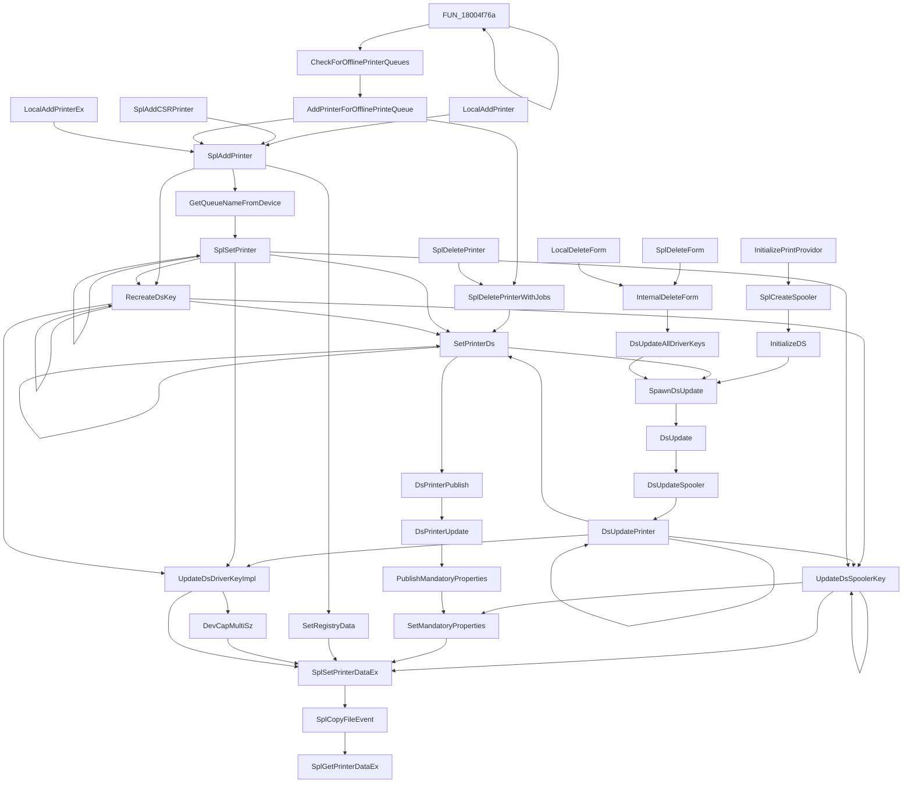

# ghidra-pyhidra-callgraphs

<p align="center">

</p>

<p align="center">
<a href="https://twitter.com/intent/follow?screen_name=clearbluejar"></a> 
  
</p>

Blog post: [Ghidra Pyhidra Function Callgraphs](https://clearbluejar.github.io/posts/ghidra-function-callgraphs)

A demo repo leveraging a Ghidra Headless (non-GUI) Python script to generate function call graphs in mermaidsjs compatible markdown.

## Features

- Supports functions call graphs in mermaidsjs:
  - flowchart
  - sequence diagram 

## About

This repo is a starting point for your Ghidra Python scripting project in vscode. It demonstrates some useful vscode integrations and prescribes a workflow for running your python scripts. It leverages the power of devcontainers to provide a seamless development environment.

---

## TOC 
- [ghidra-pyhidra-callgraphs](#ghidra-pyhidra-callgraphs)
  - [Features](#features)
  - [About](#about)
  - [TOC](#toc)
  - [Install](#install)
    - [Option 1: Dev Container (Best Option)](#option-1-dev-container-best-option)
    - [Option 2: Virtualenv Standard setup](#option-2-virtualenv-standard-setup)
  - [Usage](#usage)
  - [Sample Call Graphs](#sample-call-graphs)
    - [Calling Flowchart](#calling-flowchart)
      - [SplGetPrinterDataEx from localspl.dll](#splgetprinterdataex-from-localspldll)
    - [Called](#called)

---

## Install  

### Option 1: Dev Container (Best Option) 

Detailed here: https://github.com/clearbluejar/ghidra-python-vscode-devcontainer-skeleton 

1. Start VS Code and run `Remote-Containers: Clone Repository in Container Volume...` from the Command Palette (F1).
2. Ctrl-V `https://github.com/clearbluejar/ghidra-python-vscode-devcontainer-skeleton`
3. VS Code will reload, clone the source code, and start building the container. 
4. After the build completes, VS Code will open with the container. You can now work with the repository source code in this independent environment as you would if you had cloned the code locally.

### Option 2: Virtualenv Standard setup

1. Install Ghidra and set environment variable GHIDRA_INSTALL_DIR to install location. This is a [requirement for Pyhidra](https://github.com/dod-cyber-crime-center/pyhidra#install).
2. `git clone git@github.com:clearbluejar/ghidra-python-vscode-devcontainer-skeleton.git`
3.
```bash
python3 -m venv .env
.env/bin/activate
pip install -r requirements.txt
```

## Usage


## Sample Call Graphs

### Calling Flowchart

#### SplGetPrinterDataEx from localspl.dll



### Called