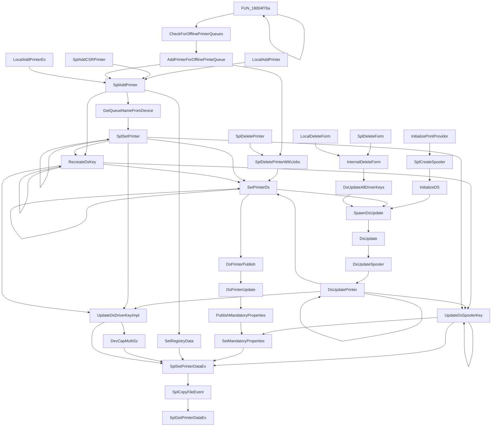

# ghidra-pyhidra-callgraphs

<p align="center">

</p>

 
<p align="center">
<a href="https://twitter.com/intent/follow?screen_name=clearbluejar"></a> 
  
</p>


## About

Blog post: [Ghidra, Pyhidra (via Jpype), and Callgraphs Oh My!](https://clearbluejar.github.io/posts/callgraphs-with-ghidra-pyhidra-and-jpype)

A demo repo leveraging a Ghidra Headless (non-GUI) Python script to generate function call graphs in mermaidsjs compatible markdown.

This Python script is powered by [Ghidra](https://github.com/NationalSecurityAgency/ghidra) and [Pyhidra](https://github.com/dod-cyber-crime-center/pyhidra) (via [Jpype](https://github.com/jpype-project/jpype)).

---

## TOC 
- [ghidra-pyhidra-callgraphs](#ghidra-pyhidra-callgraphs)
  - [About](#about)
  - [TOC](#toc)
  - [Install](#install)
    - [Standard Option 1: Virtualenv](#standard-option-1-virtualenv)
    - [Devcontainer Option 2: Open a Git repository or GitHub PR in an isolated container volume](#devcontainer-option-2-open-a-git-repository-or-github-pr-in-an-isolated-container-volume)
    - [Devcontainer Option 3: Open an existing folder in a container](#devcontainer-option-3-open-an-existing-folder-in-a-container)
  - [Usage](#usage)
    - [Demo Repo Usage](#demo-repo-usage)
  - [Generated Call Graphs](#generated-call-graphs)
    - [Sample Callgrpah Markdown Results in Repo](#sample-callgrpah-markdown-results-in-repo)
    - [Calling Flowchart](#calling-flowchart)
      - [SplGetPrinterDataEx from localspl.dll](#splgetprinterdataex-from-localspldll)
    - [Calling Mind](#calling-mind)
    - [Called](#called)
    - [SplWritePrinter](#splwriteprinter)

---

## Install

### Standard Option 1: Virtualenv

1. Install Ghidra and set environment variable GHIDRA_INSTALL_DIR to install location. This is a [requirement for Pyhidra](https://github.com/dod-cyber-crime-center/pyhidra#install).
2. `git clone git@github.com:clearbluejar/ghidra-pyhidra-callgraphs.git`
3. `cd ghidra-pyhidra-callgraphs`
```bash
python3 -m venv .env
.env/bin/activate
pip install -r requirements.txt
```

### Devcontainer Option 2: Open a Git repository or GitHub PR in an isolated container volume

1. Start VS Code and run `Remote-Containers: Clone Repository in Container Volume...` from the Command Palette (F1).
2. Ctrl-V `https://github.com/clearbluejar/ghidra-python-vscode-devcontainer-skeleton`
3. VS Code will reload, clone the source code, and start building the container. 
4. After the build completes, VS Code will open with the container. You can now work with the repository source code in this independent environment as you would if you had cloned the code locally.

### Devcontainer Option 3: Open an existing folder in a container

1. `git clone git@github.com:clearbluejar/ghidra-pyhidra-callgraphs.git`
2. code `ghidra-pyhidra-callgraphs`
3. When VS Code loads, it will recognize the .devcontainer folder and ask if you would like to open


## Usage

```bash
usage: ghidra_pyhidra_callgraphs.py [-h] [--include INCLUDE] [-s SYMBOL_PATH] [-o OUTPUT_PATH] [-m MAX_DISPLAY_DEPTH] bin

A demo Ghidra callgraph generation script

positional arguments:
  bin                   Path to binary used for analysis

options:
  -h, --help            show this help message and exit
  --include INCLUDE     Func name or partial name to include
  -s SYMBOL_PATH, --symbol-path SYMBOL_PATH
                        Path to symbol path for bin
  -o OUTPUT_PATH, --output-path OUTPUT_PATH
                        Callgraph output directory.
  -m MAX_DISPLAY_DEPTH, --max-display-depth MAX_DISPLAY_DEPTH
                        Max Depth for graph generation. Will set size of markdown callgraph
```

### Demo Repo Usage

Try one of the launch configs in [launch.json](.vscode/launch.json) or try this:

`python ghidra_pyhidra_callgraphs.py .data/localspl.dll.x64.10.0.22000.376 -s .data/localspl.pdb --include Spl`

Sample Output:
<details><summary>Sample Output</summary>

```bash
INFO  Using log config file: jar:file:/ghidra/Ghidra/Framework/Generic/lib/Generic.jar!/generic.log4j.xml (LoggingInitialization)  
INFO  Using log file: /home/vscode/.ghidra/.ghidra_10.2.2_PUBLIC/application.log (LoggingInitialization)  
INFO  Loading user preferences: /home/vscode/.ghidra/.ghidra_10.2.2_PUBLIC/preferences (Preferences)  
INFO  Class search complete (673 ms) (ClassSearcher)  
INFO  Initializing SSL Context (SSLContextInitializer)  
INFO  Initializing Random Number Generator... (SecureRandomFactory)  
INFO  Random Number Generator initialization complete: NativePRNGNonBlocking (SecureRandomFactory)  
INFO  Trust manager disabled, cacerts have not been set (ApplicationTrustManagerFactory)

Namespace(bin='.data/localspl.dll.x64.10.0.22000.376', include=['Spl'], symbol_path='.data/localspl.pdb', output_path='.callgraphs', max_display_depth=None)
INFO  Opening project: /workspaces/ghidra-pyhidra-callgraphs/.ghidra_projects/localspl.dll.x64.10.0.22000.376/localspl.dll.x64.10.0.22000.376 (DefaultProject)  
Processing function: SplWritePrinter
Processing SplWritePrinter:                             calling: 10 9 called: 385 22
Processing function: SplEnumForms
Processing SplEnumForms:                                calling: 11 9 called: 414 22
Processing function: SplGetPrinterDataEx
Processing SplGetPrinterDataEx:                         calling: 46 17 called: 527 25
Processing function: SplGetPrintProcCaps
Processing SplGetPrintProcCaps:                         calling: 49 17 called: 527 25
Processing function: SplGetPrinterDriverEx
Processing SplGetPrinterDriverEx:                               calling: 51 17 called: 575 25
Processing function: SplLogEvent
Processing SplLogEvent:                         calling: 190 20 called: 575 25
Processing function: SplStartDocPrinter
Processing SplStartDocPrinter:                          calling: 190 20 called: 887 26
Skipping SplStartDocPrinter:                            calling: 190 20 called: 887 26
Processing function: SplStartPagePrinter
Processing SplStartPagePrinter:                         calling: 191 20 called: 894 26
Skipping SplStartPagePrinter:                           calling: 191 20 called: 894 26
Processing function: SplEndPagePrinter
Processing SplEndPagePrinter:                           calling: 192 20 called: 895 26
Skipping SplEndPagePrinter:                             calling: 192 20 called: 895 26
Processing function: SplLogJobEvent
Processing SplLogJobEvent:                              calling: 195 20 called: 895 26
Skipping SplLogJobEvent:                                calling: 195 20 called: 895 26
Processing function: SplLogRenderJobDiagEvent
Processing SplLogRenderJobDiagEvent:                            calling: 197 20 called: 897 26
Skipping SplLogRenderJobDiagEvent:                              calling: 197 20 called: 897 26
Processing function: SplLogJobDiagEvent
Processing SplLogJobDiagEvent:                          calling: 201 20 called: 897 26
Skipping SplLogJobDiagEvent:                            calling: 201 20 called: 897 26
Processing function: FreeSplMemPrintPropertyValue
Processing FreeSplMemPrintPropertyValue:                                calling: 207 20 called: 898 26
Skipping FreeSplMemPrintPropertyValue:                          calling: 207 20 called: 898 26
Processing function: SplSetJobNamedProperty
Processing SplSetJobNamedProperty:                              calling: 208 20 called: 904 26
Skipping SplSetJobNamedProperty:                                calling: 208 20 called: 904 26
Processing function: SplEndDocPrinter
Processing SplEndDocPrinter:                            calling: 208 20 called: 907 26
Skipping SplEndDocPrinter:                              calling: 208 20 called: 907 26
Processing function: LocalSpoolerTelemetry::LogSplEndDocPrinter
Processing LocalSpoolerTelemetry::LogSplEndDocPrinter:                          calling: 209 20 called: 908 26
Skipping LocalSpoolerTelemetry::LogSplEndDocPrinter:                            calling: 209 20 called: 908 26
Processing function: SplSetJob
Processing SplSetJob:                           calling: 209 20 called: 908 26
Skipping SplSetJob:                             calling: 209 20 called: 908 26
Processing function: FilePool::CreateSplReader
Processing FilePool::CreateSplReader:                           calling: 219 26 called: 910 26
Skipping FilePool::CreateSplReader:                             calling: 219 26 called: 910 26
Processing function: FilePool::CreateSplWriter
Processing FilePool::CreateSplWriter:                           calling: 225 26 called: 911 26
Skipping FilePool::CreateSplWriter:                             calling: 225 26 called: 911 26
Processing function: SplLibTelemetry::DefaultPrinterChanged
Processing SplLibTelemetry::DefaultPrinterChanged:                              calling: 230 26 called: 912 26
Skipping SplLibTelemetry::DefaultPrinterChanged:                                calling: 230 26 called: 912 26
Processing function: SplGetPrinter
Processing SplGetPrinter:                               calling: 230 26 called: 1016 27
Skipping SplGetPrinter:                         calling: 230 26 called: 1016 27
Processing function: SplEnumJobs
Processing SplEnumJobs:                         calling: 231 26 called: 1023 27
Skipping SplEnumJobs:                           calling: 231 26 called: 1023 27
Processing function: SplLogType::SplLogType
Processing SplLogType::SplLogType:                              calling: 403 38 called: 1024 27
Skipping SplLogType::SplLogType:                                calling: 403 38 called: 1024 27
Processing function: SplLogEvent2
Processing SplLogEvent2:                                calling: 459 38 called: 1024 27
Skipping SplLogEvent2:                          calling: 459 38 called: 1024 27
Processing function: SplGetForm
Processing SplGetForm:                          calling: 460 38 called: 1025 27
Skipping SplGetForm:                            calling: 460 38 called: 1025 27
Processing function: SplResetPrinter
Processing SplResetPrinter:                             calling: 460 38 called: 1029 27
Skipping SplResetPrinter:                               calling: 460 38 called: 1029 27
Processing function: SplPlayGdiScriptOnPrinterIC
Processing SplPlayGdiScriptOnPrinterIC:                         calling: 461 38 called: 1031 27
Skipping SplPlayGdiScriptOnPrinterIC:                           calling: 461 38 called: 1031 27
Processing function: SplCreatePrinterIC
Processing SplCreatePrinterIC:                          calling: 462 38 called: 1032 27
Skipping SplCreatePrinterIC:                            calling: 462 38 called: 1032 27
Processing function: SplSqmCounter::Add
Processing SplSqmCounter::Add:                          calling: 463 38 called: 1037 27
Skipping SplSqmCounter::Add:                            calling: 463 38 called: 1037 27
Processing function: SplDeletePrinterIC
Processing SplDeletePrinterIC:                          calling: 464 38 called: 1038 27
Skipping SplDeletePrinterIC:                            calling: 464 38 called: 1038 27
Processing function: SplGetPrinterData
Processing SplGetPrinterData:                           calling: 464 38 called: 1038 27
Skipping SplGetPrinterData:                             calling: 464 38 called: 1038 27
Processing function: SplRegQueryValue
Processing SplRegQueryValue:                            calling: 496 38 called: 1038 27
Skipping SplRegQueryValue:                              calling: 496 38 called: 1038 27
Processing function: SplOpenPrinter
Processing SplOpenPrinter:                              calling: 496 38 called: 1093 31
Skipping SplOpenPrinter:                                calling: 496 38 called: 1093 31
Processing function: SplClosePrinter
Processing SplClosePrinter:                             calling: 496 38 called: 1107 31
Skipping SplClosePrinter:                               calling: 496 38 called: 1107 31
Processing function: SplEnumPrinters
Processing SplEnumPrinters:                             calling: 497 38 called: 1116 31
Skipping SplEnumPrinters:                               calling: 497 38 called: 1116 31
Processing function: EnterSplSem
Skipping EnterSplSem:                           calling: 1024 38
Processing function: LeaveSplSem
Skipping LeaveSplSem:                           calling: 1028 38
Processing function: SplGetPrintClassObject
Skipping SplGetPrintClassObject:                                calling: 1029 38
Processing function: SplGetPrintClassObject_4CSR
Skipping SplGetPrintClassObject_4CSR:                           calling: 1030 38
Processing function: SplPowerEvent
Skipping SplPowerEvent:                         calling: 1030 38
Processing function: SplLogGenericEvent
Skipping SplLogGenericEvent:                            calling: 1031 38
Processing function: SplEventLogRegister
Skipping SplEventLogRegister:                           calling: 1032 38
Processing function: SplConfigChange
Skipping SplConfigChange:                               calling: 1032 38
Processing function: SplDeleteThisKey
Skipping SplDeleteThisKey:                              calling: 1032 38
Processing function: SplCreateSpooler
Skipping SplCreateSpooler:                              calling: 1032 38
Processing function: LeaveSplSemAndResetCount
Skipping LeaveSplSemAndResetCount:                              calling: 1033 38
Processing function: EnterSplSemAndRestoreCount
Skipping EnterSplSemAndRestoreCount:                            calling: 1033 38
Processing function: SplRegSetValue
Skipping SplRegSetValue:                                calling: 1033 38
Processing function: SplRegCreateKey
Skipping SplRegCreateKey:                               calling: 1033 38
Processing function: SplRegEnumKey
Skipping SplRegEnumKey:                         calling: 1033 38
Processing function: SplEnumPrinterDrivers
Skipping SplEnumPrinterDrivers:                         calling: 1033 38
Processing function: SplGetPrinterDriverDirectory
Skipping SplGetPrinterDriverDirectory:                          calling: 1033 38
Processing function: GetSplInitSettingFromReg
Skipping GetSplInitSettingFromReg:                              calling: 1033 38
Processing function: SplRegCloseKey
Skipping SplRegCloseKey:                                calling: 1034 38
Processing function: SplSqmCounter::~SplSqmCounter
Skipping SplSqmCounter::~SplSqmCounter:                         calling: 1037 38
Processing function: SplDeletePrinterDataEx
Skipping SplDeletePrinterDataEx:                                calling: 1037 38
Processing function: SplSetPrinterData
Skipping SplSetPrinterData:                             calling: 1037 38
Processing function: SplXcvOpenPort
Skipping SplXcvOpenPort:                                calling: 1037 38
Processing function: SplAddCSRPrinter
Skipping SplAddCSRPrinter:                              calling: 1037 38
Processing function: SplDoesCSRPrinterDevnodeExist
Skipping SplDoesCSRPrinterDevnodeExist:                         calling: 1037 38
Processing function: SplEnableCSRPrinterDeviceInterface
Skipping SplEnableCSRPrinterDeviceInterface:                            calling: 1037 38
Processing function: SplIsValidUserPropertyBag
Skipping SplIsValidUserPropertyBag:                             calling: 1037 38
Processing function: SplAddPrinter
Skipping SplAddPrinter:                         calling: 1037 38
Processing function: SplDeletePrinter
Skipping SplDeletePrinter:                              calling: 1037 38
Processing function: SplDeletePrinterWithJobs
Skipping SplDeletePrinterWithJobs:                              calling: 1037 38
Processing function: SplGetUserPropertyBag
Skipping SplGetUserPropertyBag:                         calling: 1037 38
Processing function: SplRegeneratePrintDeviceCapabilities
Skipping SplRegeneratePrintDeviceCapabilities:                          calling: 1037 38
Processing function: SplGetLocalDevMode
Skipping SplGetLocalDevMode:                            calling: 1037 38
Processing function: SplNotifyServerStatus
Skipping SplNotifyServerStatus:                         calling: 1037 38
Processing function: SplSetCSRPrinterDevnode
Skipping SplSetCSRPrinterDevnode:                               calling: 1037 38
Processing function: SplGetPrinterExtra
Skipping SplGetPrinterExtra:                            calling: 1038 38
Processing function: SplGetPrinterExtraEx
Skipping SplGetPrinterExtraEx:                          calling: 1038 38
Processing function: SplSetPrinter
Skipping SplSetPrinter:                         calling: 1038 38
Processing function: SplSetPrinterExtra
Skipping SplSetPrinterExtra:                            calling: 1038 38
Processing function: SplSetPrinterExtraEx
Skipping SplSetPrinterExtraEx:                          calling: 1038 38
Processing function: SplGetJobExtra
Skipping SplGetJobExtra:                                calling: 1038 38
Processing function: SplSetJobError
Skipping SplSetJobError:                                calling: 1038 38
Processing function: SplSetJobExtra
Skipping SplSetJobExtra:                                calling: 1038 38
Processing function: SplDeleteJobNamedProperty
Skipping SplDeleteJobNamedProperty:                             calling: 1038 38
Processing function: SplGetJob
Skipping SplGetJob:                             calling: 1038 38
Processing function: SplGetJobNamedPropertyValue
Skipping SplGetJobNamedPropertyValue:                           calling: 1038 38
Processing function: SplAbortPrinter
Skipping SplAbortPrinter:                               calling: 1038 38
Processing function: SplReadPrinter
Skipping SplReadPrinter:                                calling: 1038 38
Processing function: SplAddJob
Skipping SplAddJob:                             calling: 1038 38
Processing function: SplScheduleJob
Skipping SplScheduleJob:                                calling: 1038 38
Processing function: SplFindCompatibleDriverInDriverStore
Skipping SplFindCompatibleDriverInDriverStore:                          calling: 1038 38
Processing function: SplGetDriverUpdateStatus
Skipping SplGetDriverUpdateStatus:                              calling: 1038 38
Processing function: SplIsDriverInstalled
Skipping SplIsDriverInstalled:                          calling: 1038 38
Processing function: SplIsLocalDriverAvailable
Skipping SplIsLocalDriverAvailable:                             calling: 1038 38
Processing function: SplSetDriverUpdateStatus
Skipping SplSetDriverUpdateStatus:                              calling: 1038 38
Processing function: SplAddPrinterDriverEx
Skipping SplAddPrinterDriverEx:                         calling: 1038 38
Processing function: SplDeletePrinterDriverEx
Skipping SplDeletePrinterDriverEx:                              calling: 1038 38
Processing function: SplGetPrinterDriver
Skipping SplGetPrinterDriver:                           calling: 1038 38
Processing function: SplIsCompatibleDriver
Skipping SplIsCompatibleDriver:                         calling: 1039 38
Processing function: SplDeleteFile
Skipping SplDeleteFile:                         calling: 1039 38
Processing function: SplDriverEvent
Skipping SplDriverEvent:                                calling: 1039 38
Processing function: SplGetDriverDir
Skipping SplGetDriverDir:                               calling: 1040 38
Processing function: SplMonitorIsInstalled
Skipping SplMonitorIsInstalled:                         calling: 1040 38
Processing function: SplMoveFileEx
Skipping SplMoveFileEx:                         calling: 1040 38
Processing function: SplShutdown
Skipping SplShutdown:                           calling: 1041 38
Processing function: SplCloseSpooler
Skipping SplCloseSpooler:                               calling: 1041 38
Processing function: SplDeleteIniSpooler
Skipping SplDeleteIniSpooler:                           calling: 1041 38
Processing function: SplDeleteSpooler
Skipping SplDeleteSpooler:                              calling: 1041 38
Processing function: SplGetNonRegData
Skipping SplGetNonRegData:                              calling: 1042 38
Processing function: SplDeletePrinterData
Skipping SplDeletePrinterData:                          calling: 1042 38
Processing function: SplDeletePrinterKey
Skipping SplDeletePrinterKey:                           calling: 1042 38
Processing function: SplEnumPrinterData
Skipping SplEnumPrinterData:                            calling: 1042 38
Processing function: SplEnumPrinterDataEx
Skipping SplEnumPrinterDataEx:                          calling: 1042 38
Processing function: SplEnumPrinterKey
Skipping SplEnumPrinterKey:                             calling: 1042 38
Processing function: SplSetPrinterDataEx
Skipping SplSetPrinterDataEx:                           calling: 1042 38
Processing function: SplReenumeratePorts
Skipping SplReenumeratePorts:                           calling: 1042 38
Processing function: SplAddMonitor
Skipping SplAddMonitor:                         calling: 1042 38
Processing function: SplAddPort
Skipping SplAddPort:                            calling: 1042 38
Processing function: SplAddPortEx
Skipping SplAddPortEx:                          calling: 1042 38
Processing function: SplConfigurePort
Skipping SplConfigurePort:                              calling: 1042 38
Processing function: SplDeleteMonitor
Skipping SplDeleteMonitor:                              calling: 1042 38
Processing function: SplDeletePort
Skipping SplDeletePort:                         calling: 1042 38
Processing function: SplEnumMonitors
Skipping SplEnumMonitors:                               calling: 1042 38
Processing function: SplEnumPorts
Skipping SplEnumPorts:                          calling: 1042 38
Processing function: SplAddPrintProcessor
Skipping SplAddPrintProcessor:                          calling: 1042 38
Processing function: SplDeletePrintProcCacheData
Skipping SplDeletePrintProcCacheData:                           calling: 1042 38
Processing function: SplDeletePrintProcessor
Skipping SplDeletePrintProcessor:                               calling: 1042 38
Processing function: SplEnumPrintProcCacheData
Skipping SplEnumPrintProcCacheData:                             calling: 1042 38
Processing function: SplEnumPrintProcessorDatatypes
Skipping SplEnumPrintProcessorDatatypes:                                calling: 1042 38
Processing function: SplEnumPrintProcessors
Skipping SplEnumPrintProcessors:                                calling: 1042 38
Processing function: SplGetPrintProcCacheData
Skipping SplGetPrintProcCacheData:                              calling: 1042 38
Processing function: SplGetPrintProcessorDirectory
Skipping SplGetPrintProcessorDirectory:                         calling: 1042 38
Processing function: SplSetPrintProcCacheData
Skipping SplSetPrintProcCacheData:                              calling: 1042 38
Processing function: SplAddForm
Skipping SplAddForm:                            calling: 1042 38
Processing function: SplDeleteForm
Skipping SplDeleteForm:                         calling: 1042 38
Processing function: SplSetForm
Skipping SplSetForm:                            calling: 1042 38
Processing function: SplCopyNumberOfFilesInternal
Skipping SplCopyNumberOfFilesInternal:                          calling: 1042 38
Processing function: SplCopyFileEvent
Skipping SplCopyFileEvent:                              calling: 1042 38
Processing function: SplCopyNumberOfFiles
Skipping SplCopyNumberOfFiles:                          calling: 1042 38
Processing function: SplLoadLibraryTheCopyFileModule
Skipping SplLoadLibraryTheCopyFileModule:                               calling: 1042 38
Processing function: SplRegDeleteKey
Skipping SplRegDeleteKey:                               calling: 1042 38
Processing function: SplRegDeleteValue
Skipping SplRegDeleteValue:                             calling: 1043 38
Processing function: SplRegEnumValue
Skipping SplRegEnumValue:                               calling: 1043 38
Processing function: SplRegOpenKey
Skipping SplRegOpenKey:                         calling: 1044 38
Processing function: SplRegQueryInfoKey
Skipping SplRegQueryInfoKey:                            calling: 1044 38
Processing function: SplXcvData
Skipping SplXcvData:                            calling: 1044 38
Processing function: FreeSplSockets
Skipping FreeSplSockets:                                calling: 1046 38
Processing function: SplReportJobProcessingProgress
Skipping SplReportJobProcessingProgress:                                calling: 1046 38
Processing function: SplCorePrinterDriverInstalled
Skipping SplCorePrinterDriverInstalled:                         calling: 1046 38
Processing function: SplGetCorePrinterDrivers
Skipping SplGetCorePrinterDrivers:                              calling: 1046 38
Processing function: SplGetPrinterDriverPackagePath
Skipping SplGetPrinterDriverPackagePath:                                calling: 1046 38
Processing function: SplDeletePrinterDriverPackage
Skipping SplDeletePrinterDriverPackage:                         calling: 1046 38
Processing function: SplInstallPrinterDriverFromPackage
Skipping SplInstallPrinterDriverFromPackage:                            calling: 1046 38
Processing function: SplUploadPrinterDriverPackage
Skipping SplUploadPrinterDriverPackage:                         calling: 1046 38
Processing function: SplFindCompatibleDriver
Skipping SplFindCompatibleDriver:                               calling: 1046 38
Processing function: SplEnumJobNamedProperties
Skipping SplEnumJobNamedProperties:                             calling: 1046 38
Processing function: SplLogJobInfoForBranchOffice
Skipping SplLogJobInfoForBranchOffice:                          calling: 1046 38
Processing function: SplPrintSupportOperation
Skipping SplPrintSupportOperation:                              calling: 1047 38
Processing function: SplIppCreateJobOnPrinter
Skipping SplIppCreateJobOnPrinter:                              calling: 1048 38
Processing function: SplIppGetJobAttributes
Skipping SplIppGetJobAttributes:                                calling: 1049 38
Processing function: SplIppGetPrinterAttributes
Skipping SplIppGetPrinterAttributes:                            calling: 1050 38
Processing function: SplIppSetJobAttributes
Skipping SplIppSetJobAttributes:                                calling: 1051 38
Processing function: SplIppSetPrinterAttributes
Skipping SplIppSetPrinterAttributes:                            calling: 1052 38
Processing function: LcmSplInSem
Skipping LcmSplInSem:                           calling: 1052 38
Processing function: SplLibTelemetry::ChooseDefaultPrinter
Skipping SplLibTelemetry::ChooseDefaultPrinter:                         calling: 1054 38
Processing function: SplLibTelemetry::DefaultPrinterModeChanged
Skipping SplLibTelemetry::DefaultPrinterModeChanged:                            calling: 1060 38
Processing function: GetSplUserSid
Skipping GetSplUserSid:                         calling: 1062 38
Processing function: FreeSplMemPrintNamedProperty
Skipping FreeSplMemPrintNamedProperty:                          calling: 1062 38
Processing function: SplIsValidDevmodeNoSize<struct__devicemodeW,unsigned_short>
Skipping SplIsValidDevmodeNoSize<struct__devicemodeW,unsigned_short>:                           calling: 1063 38
Processing function: SplSqmCollectDword
Skipping SplSqmCollectDword:                            calling: 1064 38
Processing function: SplSqmIsOptedIn
Skipping SplSqmIsOptedIn:                               calling: 1066 38
Processing function: SplSqmCounter::SqmCollect
Skipping SplSqmCounter::SqmCollect:                             calling: 1066 38
Processing function: SplEventLogUnregister
Skipping SplEventLogUnregister:                         calling: 1067 38
Processing function: SplLogDeleteJobDiagEvent
Skipping SplLogDeleteJobDiagEvent:                              calling: 1068 38
Processing function: SplLogPrinterEvent
Skipping SplLogPrinterEvent:                            calling: 1069 38
Processing function: SplLogPrinterSetupCopyPackageEvent
Skipping SplLogPrinterSetupCopyPackageEvent:                            calling: 1070 38
Processing function: SplLogPrinterSetupCoreDriverEvent
Skipping SplLogPrinterSetupCoreDriverEvent:                             calling: 1071 38
Processing function: SplLogPrinterSetupGenericEvent
Skipping SplLogPrinterSetupGenericEvent:                                calling: 1072 38
Processing function: SplTraceErrorPrintCancelled
Skipping SplTraceErrorPrintCancelled:                           calling: 1073 38
Processing function: SplLogType::GetValue
Skipping SplLogType::GetValue:                          calling: 1074 38
Processing function: SplLogType::TraceValue
Skipping SplLogType::TraceValue:                                calling: 1075 38
Processing function: NCabbingLibrary::SplitName
Skipping NCabbingLibrary::SplitName:                            calling: 1078 38
Processing function: sandbox::DriverConfigModuleAdapter::SplDeviceCapabilities
Skipping sandbox::DriverConfigModuleAdapter::SplDeviceCapabilities:                             calling: 1079 38
Processing function: SplSqmCounter::SplSqmCounter
Skipping SplSqmCounter::SplSqmCounter:                          calling: 1080 38
Processing function: sandbox::DriverConfigModuleObserver::SandboxSplDeviceCapabilities
Skipping sandbox::DriverConfigModuleObserver::SandboxSplDeviceCapabilities:                             calling: 1080 38
```

</details>


## Generated Call Graphs

### Sample Callgrpah Markdown Results in Repo

Some sample results are in the [.callgraphs](.callgraphs) directory:
- [IsSpoolerImpersonating](.callgraphs/localspl.dll.x64.10.0.22000.376/IsSpoolerImpersonating.flow.md)
- [LcmStartDocPort](.callgraphs/localspl.dll.x64.10.0.22000.376/LcmStartDocPort.flow.md)
- [Several Others](.callgraphs/localspl.dll.x64.10.0.22000.376/)
  
### Calling Flowchart

#### SplGetPrinterDataEx from localspl.dll



### Calling Mind


[Try editing on mermaid live calling Mindmap](https://mermaid.live/edit#pako:eNrlV0tv00AQ_isrn1qJQ5EQoNwgTqoKkpqaCglVQlt7kqy63rXG64Cp-t8Zrx0lqePdWEXkwB58mPlm5puH9_EYJDqFYMSCTKg04_mdQq3N2Vmcy0swEQpFH52MeV6cn98pZtc3FAZiyD-Wi42Isaksi9V1afaEjH1I07nGjMvxiuOuorWYw8_PQsG-hrFQk3-O3GiM-LKj3gMcGc7jssdhs2whhFqGAiExsvqqI43Gm3x_hicg4wzpCOgLt1lXygAqLmPD0YQ6sXaAzqFxcOpldBwfDxua77HOq6mQMFmD2jEnTdxOPmDIDZ_82vVNuhlXaU2roj8jBzQCiv3otznpISziXGsJ-AmqTn-LBvOMVRfQuhjq_wYSBIs5oLQ50o_SE9xvu63PUF4O43rRlvOlhBLmPIMp6iyEtUhgaPmj8l6KYuXF1VVuqTTMD7WhBbQ-jx4TXyk8A-Bs_y5gSExnY50jYffVVjfVeL1YSNrRGoFt2ABvPhYvmw9fDZwB_O6d2R05EiGKtWV2leXy302FI-z_NBiOMpxwNsgbXbFmpTQi_n14U3UQ_1vniTPEaY8UJ7UXDoenN9u0IrqOZKMRgW9gKQqDVY3uDFF_HQb-LIyNV5A8PMeiBRdHxN25xTeZbW3896M-y-nt_Mfr9xcXbxbv3nIvvqOoixu8ogcH0DVdpPT2eAzMCjL7Ckk5PgRPpC1t3yepoAOcFAZLICkvjY4rlWwlDS4UfEmt2YrBGs7at41945A05-q71hvY0x8HYMWh)

### Called

### SplWritePrinter

Functions that `SplWritePrinter` calls:

```mermaid
flowchart LR
classDef shaded fill:#339933
52 --> 46
348 --> 349["forwardPicWrite"]
102 --> 118["IsClientAssociatedWSDA"]
90 --> 93["SPOOLSS.DLL::DllAllocSplMem"]:::shaded
281 --> 377["GetTokenHandle"]
197 --> 28
278 --> 30
118 --> 133["KERNELBASE.DLL::GetPackageFamilyName"]:::shaded
165 --> 10
223 --> 32:::shaded
0 --> 18["API-MS-WIN-CORE-SYNCH-L1-1-0.DLL::EnterCriticalSection"]:::shaded
90 --> 95["CanUserSeeRealDocName"]
118 --> 54
348 --> 313:::shaded
188 --> 193["scalar_deleting_destructor"]
92 --> 148["API-MS-WIN-CORE-REGISTRY-L1-1-0.DLL::RegCloseKey"]:::shaded
175 --> 178["NTDLL.DLL::EtwEventRegister"]:::shaded
340 --> 342
156 --> 79
370 --> 14
92 --> 144["SubChar"]
224 --> 243["IsCoreDriverFile"]
182 --> 46
49 --> 79["Release"]
214 --> 218["DuplicateFile"]
217 --> 88:::shaded
265 --> 30
20 --> 280["ReleaseJob"]
204 --> 63:::shaded
158 --> 30
232 --> 238["NTDLL.DLL::EtwEventEnabled"]:::shaded
249 --> 132
49 --> 78["operator_delete"]
168 --> 171["MSVCRT.DLL::_unlock"]:::shaded
380 --> 3:::shaded
144 --> 3:::shaded
114 --> 123["SPOOLSS.DLL::ImpersonatePrinterClient"]:::shaded
375 --> 3:::shaded
274 --> 33
182 --> 185["memcpy"]
217 --> 103
20 --> 287["DeleteJobCheck"]
330 --> 339["~TMes"]
293 --> 162
118 --> 128["GetContainerId"]
161 --> 10
190 --> 79
295 --> 307["API-MS-WIN-SECURITY-BASE-L1-1-0.DLL::AreAllAccessesGranted"]:::shaded
308 --> 26:::shaded
92 --> 156["SplDeleteSpooler"]
187 --> 37:::shaded
147 --> 160["Write<struct__tlgWrapSz<unsigned_short>,struct__tlgWrapperByVal<4>,struct__tlgWrapperByVal<4>_>"]
217 --> 219["FilesUnloaded"]
154 --> 32:::shaded
283 --> 30
92 --> 142["NTDLL.DLL::RtlLengthSid"]:::shaded
187 --> 26:::shaded
308 --> 310["LogJobInfo"]
94 --> 41:::shaded
92 --> 96:::shaded
237 --> 242["WPP_SF_DDDDD"]
243 --> 244:::shaded
67 --> 69["MSVCRT.DLL::_callnewh"]:::shaded
232 --> 239["WPP_SF_DD"]
128 --> 103
368 --> 14
254 --> 61:::shaded
358 --> 360["API-MS-WIN-CORE-HEAP-L1-1-0.DLL::GetProcessHeap"]:::shaded
336 --> 364["MakeCrcTable"]:::shaded
255 --> 37:::shaded
297 --> 58:::shaded
306 --> 319["InternalCreateSafeFile"]
203 --> 146:::shaded
319 --> 245:::shaded
20 --> 275["LogSetJobCompleted"]
188 --> 37:::shaded
267 --> 62:::shaded
20 --> 282["GetIniPrintProc"]
338 --> 343
92 --> 18:::shaded
30 --> 45["WPP_SF_SSd"]
100 --> 103["__security_check_cookie"]
281 --> 99
263 --> 26:::shaded
357 --> 137
103 --> 105["__report_gsfailure"]
20 --> 283["PauseJob"]
30 --> 60["WPP_SF_SS"]
20 --> 286["~_TELEMETRY_JOB_INFO"]
30 --> 17
83 --> 84
0 --> 6["GetOpenedMonitor"]
330 --> 332["StartFormat"]
377 --> 139:::shaded
0 --> 15["CheckJobStatusChange"]
280 --> 33
372 --> 220:::shaded
0 --> 29["WPP_SF_DS"]
339 --> 367["ResetMesControlBlockList"]
0 --> 12["FindJob"]:::shaded
42 --> 63["API-MS-WIN-CORE-SYNCH-L1-1-0.DLL::DeleteCriticalSection"]:::shaded
92 --> 158["PrinterCreateKey"]
179 --> 162
92 --> 151["CloneIniSpooler"]
283 --> 189
28 --> 32:::shaded
276 --> 33
0 --> 4["GetMonitorHandle"]:::shaded
306 --> 323["GetSerializedBlobOfNamedProperties"]
50 --> 40:::shaded
20 --> 274["RestartJob"]
90 --> 94["GetPrinterPorts"]
78 --> 81["free"]
20 --> 3:::shaded
137 --> 18:::shaded
304 --> 12:::shaded
8 --> 37:::shaded
209 --> 210["RemoveFromHashBuckets"]:::shaded
165 --> 174["Register"]
107 --> 112["API-MS-WIN-CORE-PROCESSTHREADS-L1-1-0.DLL::GetCurrentProcess"]:::shaded
333 --> 347["RPCRT4.DLL::NdrMesProcEncodeDecode3"]:::shaded
193 --> 204["~FilePool"]
295 --> 101:::shaded
306 --> 324["API-MS-WIN-CORE-FILE-L1-1-0.DLL::SetFilePointer"]:::shaded
31 --> 26:::shaded
100 --> 23
232 --> 237["TraceValue"]
204 --> 253["FreeFPList"]
203 --> 79
278 --> 306
167 --> 14
223 --> 231["SFC_OS.DLL::SfcFileException"]:::shaded
306 --> 126
52 --> 84["FUN_18001fe54"]
22 --> 79
92 --> 30
182 --> 49
189 --> 40:::shaded
283 --> 18:::shaded
128 --> 135["GetDeviceInstanceId"]
306 --> 320["GetWriterFromHandle"]
192 --> 146:::shaded
217 --> 220["StringCchCopyW"]:::shaded
262 --> 18:::shaded
213 --> 146:::shaded
248 --> 220:::shaded
174 --> 175["TraceLoggingRegisterEx_EtwEventRegister_EtwEventSetInformation"]
248 --> 46
380 --> 53:::shaded
190 --> 37:::shaded
254 --> 63:::shaded
39 --> 40["NTDLL.DLL::EtwTraceMessage"]:::shaded
118 --> 127["API-MS-WIN-DEVICES-QUERY-L1-1-0.DLL::DevGetObjectProperties"]:::shaded
22 --> 30
118 --> 103
338 --> 365["FUN_18000e393"]:::shaded
20 --> 28
185 --> 186["MSVCRT.DLL::memcpy"]:::shaded
251 --> 93:::shaded
0 --> 2["FUN_180001cf8"]
310 --> 315["SplLogEvent"]
218 --> 228:::shaded
151 --> 132
182 --> 23
156 --> 190["Enqueue"]
265 --> 266["API-MS-WIN-CORE-REGISTRY-L1-1-0.DLL::RegCreateKeyExW"]:::shaded
0 --> 7["ClearJobError"]
275 --> 293["Write<struct__tlgWrapperByVal<8>,struct__tlgWrapperByVal<4>,struct__tlgWrapperByRef<16>,struct__tlgWrapperByVal<4>,struct__tlgWrapSz<unsigned_short>,struct__tlgWrapSz<unsigned_short>,struct__tlgWrapperByVal<4>,struct__tlgWrapperByVal<4>,struct__tlgWrapperByVal<4>,struct__tlgWrapSz<unsigned_short>,struct__tlgWrapSz<unsigned_short>,struct__tlgWrapperByVal<4>,struct__tlgWrapperByVal<4>,struct__tlgWrapperByVal<4>,struct__tlgWrapperByVal<4>,struct__tlgWrapperByVal<4>_>"]
102 --> 103
20 --> 278["ResumeJob"]
349 --> 14
44 --> 64["API-MS-WIN-CORE-COM-L1-1-0.DLL::CoInitializeEx"]:::shaded
118 --> 58:::shaded
193 --> 78
309 --> 311["GetSpoolerPolicy"]
278 --> 309
49 --> 77["vector_destructor_iterator"]
328 --> 257:::shaded
357 --> 361["AllocMemAlign"]
286 --> 146:::shaded
20 --> 281["ValidateObjectAccess"]
33 --> 90["GetInfoData"]
17 --> 9:::shaded
33 --> 26:::shaded
380 --> 18:::shaded
151 --> 23
330 --> 78
92 --> 153["WPP_SF_qd"]
332 --> 344["FUN_18000e168"]:::shaded
31 --> 3:::shaded
197 --> 30
20 --> 12:::shaded
102 --> 32:::shaded
102 --> 120["API-MS-WIN-SECURITY-BASE-L1-1-0.DLL::CheckTokenMembership"]:::shaded
332 --> 343["SafeWrite"]
92 --> 28
301 --> 379["API-MS-WIN-CORE-TIMEZONE-L1-1-0.DLL::GetTimeZoneInformation"]:::shaded
382 --> 40:::shaded
289 --> 103
232 --> 23
276 --> 295["AccessGranted"]
319 --> 30
340 --> 346
0["SplWritePrinter"] --> 1["SPOOLSS.DLL::WritePrinter"]:::shaded
0 --> 14["_guard_xfg_dispatch_icall_nop"]
187 --> 32:::shaded
196 --> 88:::shaded
319 --> 32:::shaded
280 --> 30
118 --> 131["RPCRT4.DLL::RpcServerInqCallAttributesW"]:::shaded
354 --> 14
102 --> 114["CreateMediumIntegrityTokenFromToken"]
354 --> 357["AllocateMesControlBlock"]
0 --> 5["SeekPrinterSetEvent"]
52 --> 78
155 --> 38:::shaded
20 --> 103
190 --> 260["Link"]:::shaded
13 --> 103
299 --> 281
298 --> 376["SPOOLSS.DLL::ReallocSplStr"]:::shaded
0 --> 9["API-MS-WIN-CORE-SYNCH-L1-1-0.DLL::WaitForSingleObject"]:::shaded
301 --> 103
20 --> 146:::shaded
357 --> 358
0 --> 23["WPP_SF_D"]
77 --> 14
215 --> 88:::shaded
254 --> 230:::shaded
35 --> 32:::shaded
8 --> 268["WPP_SF_"]
310 --> 32:::shaded
100 --> 30
343 --> 14
330 --> 337["ConvertToPickleArray"]
188 --> 192["DeleteIniForm"]
274 --> 28
42 --> 61["API-MS-WIN-CORE-HANDLE-L1-1-0.DLL::CloseHandle"]:::shaded
92 --> 37:::shaded
193 --> 63:::shaded
278 --> 37:::shaded
206 --> 14
246 --> 52
280 --> 382["WPP_SF_qDSSS"]
285 --> 15
310 --> 316["StringCchPrintfW"]
368 --> 208:::shaded
320 --> 328["CreateSplWriter"]
203 --> 63:::shaded
348 --> 352["forwardPicAlloc"]
283 --> 309
20 --> 157:::shaded
183 --> 182
305 --> 309
31 --> 32:::shaded
254 --> 256["API-MS-WIN-CORE-FILE-L1-1-0.DLL::SetEndOfFile"]:::shaded
60 --> 40:::shaded
176 --> 14
196 --> 211["DeleteIniVersion"]
154 --> 88:::shaded
217 --> 222["FastStrcmpi"]
310 --> 23
306 --> 185
2 --> 28
16 --> 26:::shaded
308 --> 103
243 --> 51
218 --> 93:::shaded
99 --> 101["API-MS-WIN-SECURITY-BASE-L1-1-0.DLL::MapGenericMask"]:::shaded
202 --> 206["~TList<class_TIniSpoolerWrapper>"]
195 --> 209["DelinkPortFromSpooler"]
30 --> 46["operator_new"]
0 --> 27["ValidateSpoolHandle"]
66 --> 68["MSVCRT.DLL::malloc"]:::shaded
306 --> 96:::shaded
276 --> 301["GMT2AdjustedGMTIfDST"]
219 --> 14
188 --> 198["FreeIniMonitor"]
193 --> 202["~TDriverStore"]
290 --> 222
29 --> 40:::shaded
187 --> 36:::shaded
213 --> 214["InternalDecrement"]
33 --> 33
224 --> 32:::shaded
336 --> 132
97 --> 98["StringCopyWorkerW"]:::shaded
338 --> 342
267 --> 268
323 --> 3:::shaded
237 --> 241["WPP_SF_DDDD"]
181 --> 183["FUN_18002c99f"]
275 --> 25
107 --> 113["API-MS-WIN-CORE-ERRORHANDLING-L1-1-0.DLL::SetUnhandledExceptionFilter"]:::shaded
276 --> 305["SetJobPosition"]
92 --> 155["LeaveSplSemAndResetCount"]
287 --> 284:::shaded
283 --> 15
22 --> 34:::shaded
278 --> 189
100 --> 104["API-MS-WIN-SECURITY-BASE-L1-1-0.DLL::AdjustTokenPrivileges"]:::shaded
222 --> 228["API-MS-WIN-CORE-STRING-OBSOLETE-L1-1-0.DLL::lstrcmpiW"]:::shaded
30 --> 55["API-MS-WIN-CORE-COM-L1-1-0.DLL::CoTaskMemFree"]:::shaded
0 --> 28["LeaveSplSem"]
92 --> 32:::shaded
248 --> 51
306 --> 325["GetFullNameFromId"]
274 --> 290["FindIniKey"]
0 --> 11["API-MS-WIN-CORE-FILE-L1-1-0.DLL::GetFileSizeEx"]:::shaded
31 --> 65:::shaded
276 --> 306["WriteShadowJob"]
315 --> 132
7 --> 33
330 --> 334["TPickle<struct_JobNamedPropertyPickleArray>"]
6 --> 85["operator_struct__INIMONITOR*___ptr64"]:::shaded
151 --> 32:::shaded
167 --> 170["_lock"]
30 --> 49["Reset"]
224 --> 30
31 --> 9:::shaded
102 --> 61:::shaded
195 --> 134
303 --> 40:::shaded
119 --> 49
283 --> 37:::shaded
20 --> 60
346 --> 343
10 --> 165["~Completer"]
118 --> 30
201 --> 146:::shaded
128 --> 130:::shaded
132 --> 138["MSVCRT.DLL::memset"]:::shaded
201 --> 88:::shaded
191 --> 40:::shaded
243 --> 247["API-MS-WIN-CORE-FILE-L1-1-0.DLL::GetFileAttributesW"]:::shaded
0 --> 21["ValidRawDatatype"]
167 --> 169["__dllonexit"]
92 --> 93:::shaded
20 --> 276["SetLocalJob"]
92 --> 145["API-MS-WIN-CORE-SYSINFO-L1-1-0.DLL::GetTickCount"]:::shaded
251 --> 252["FUN_180034e97"]:::shaded
114 --> 49
323 --> 46
20 --> 285["RetainJob"]
306 --> 148:::shaded
154 --> 93:::shaded
274 --> 14
20 --> 279["WPP_SF_dDD"]
278 --> 26:::shaded
188 --> 195["DeletePortEntry"]
232 --> 132
92 --> 23
251 --> 228:::shaded
217 --> 224["SplDeleteFile"]
283 --> 306
243 --> 248["Cat"]
107 --> 111["API-MS-WIN-CORE-PROCESSTHREADS-L1-1-0.DLL::TerminateProcess"]:::shaded
162 --> 163["NTDLL.DLL::EtwEventWriteTransfer"]:::shaded
375 --> 53:::shaded
31 --> 36:::shaded
160 --> 162["_tlgWriteTransfer_EtwEventWriteTransfer"]
196 --> 193
267 --> 71:::shaded
179 --> 103
22 --> 17
345 --> 346["WriteCrc"]
276 --> 15
276 --> 290
193 --> 88:::shaded
216 --> 218
264 --> 32:::shaded
354 --> 355["MesControlBlockToClientPointer"]:::shaded
276 --> 294["IsXpsPrintProcessor"]
276 --> 296["FUN_18000bbb3"]
202 --> 49
348 --> 351["forwardPicRead"]
31 --> 37:::shaded
276 --> 58:::shaded
151 --> 88:::shaded
119 --> 140["API-MS-WIN-SECURITY-BASE-L1-1-0.DLL::GetTokenInformation"]:::shaded
308 --> 309["GetSpoolerNumericPolicy"]
214 --> 217["DecrementFileRefCnt"]
20 --> 32:::shaded
165 --> 25
276 --> 281
79 --> 14
251 --> 88:::shaded
325 --> 316
156 --> 17
92 --> 3:::shaded
323 --> 330["PickleJobNamedPropertyArray"]
232 --> 235["NTDLL.DLL::EtwEventWrite"]:::shaded
188 --> 146:::shaded
306 --> 23
330 --> 338["StartChunk"]
0 --> 22["UpdateJobStatus"]
262 --> 37:::shaded
10 --> 166["API-MS-WIN-CORE-SYNCH-L1-2-0.DLL::InitOnceBeginInitialize"]:::shaded
223 --> 233["SFC_OS.DLL::SfcClose"]:::shaded
306 --> 132
154 --> 30
213 --> 216["InternalIncrement"]
315 --> 239
51 --> 78
154 --> 23
223 --> 232["SplLogEvent2"]
90 --> 96["API-MS-WIN-SECURITY-BASE-L1-1-0.DLL::GetSecurityDescriptorLength"]:::shaded
223 --> 234["API-MS-WIN-CORE-FILE-L2-1-0.DLL::MoveFileExW"]:::shaded
154 --> 143
105 --> 109["NTDLL.DLL::RtlCaptureContext"]:::shaded
296 --> 308["FUN_180060a89"]
30 --> 51["vFree"]
188 --> 18:::shaded
114 --> 103
289 --> 238:::shaded
30 --> 42["~CoalescedSleep"]
100 --> 32:::shaded
362 --> 363["API-MS-WIN-CORE-HEAP-L1-1-0.DLL::HeapAlloc"]:::shaded
276 --> 303["WPP_SF_dD"]
81 --> 82["MSVCRT.DLL::free"]:::shaded
213 --> 88:::shaded
102 --> 119["IsClientAppContainer"]
17 --> 3:::shaded
232 --> 103
20 --> 24
315 --> 238:::shaded
30 --> 54["GetLastErrorAsFailHR"]
289 --> 235:::shaded
204 --> 88:::shaded
20 --> 273["SPOOLSS.DLL::SetJobW"]:::shaded
30 --> 43["API-MS-WIN-CORE-SYNCH-L1-1-0.DLL::InitializeCriticalSectionAndSpinCount"]:::shaded
48 --> 73["API-MS-WIN-CORE-COM-L1-1-0.DLL::CoWaitForMultipleHandles"]:::shaded
137 --> 70:::shaded
25 --> 166:::shaded
188 --> 134
354 --> 356["ReleaseMesControlBlock"]
48 --> 70["API-MS-WIN-CORE-PROCESSTHREADS-L1-1-0.DLL::GetCurrentThreadId"]:::shaded
380 --> 70:::shaded
188 --> 194["DeleteSpoolerCheck"]
188 --> 196["FreeIniEnvironment"]
254 --> 257["API-MS-WIN-CORE-FILE-L1-1-0.DLL::CreateFileW"]:::shaded
144 --> 93:::shaded
377 --> 141:::shaded
286 --> 32:::shaded
278 --> 282
203 --> 88:::shaded
224 --> 245["API-MS-WIN-CORE-FILE-L1-1-0.DLL::DeleteFileW"]:::shaded
20 --> 33
128 --> 136["API-MS-WIN-CORE-COM-L1-1-0.DLL::StringFromGUID2"]:::shaded
380 --> 380
290 --> 292["API-MS-WIN-CORE-STRING-L2-1-0.DLL::CharLowerW"]:::shaded
283 --> 380
197 --> 14
219 --> 222
190 --> 262["NotifyConsumer"]
84 --> 78
339 --> 368["~TList<class_NPackageInstallLocalspl::TDriverStore::TMissingDriver>"]
188 --> 30
114 --> 122["API-MS-WIN-SECURITY-BASE-L1-1-0.DLL::CreateWellKnownSid"]:::shaded
20 --> 288["ShouldGetMasqDataForHandle"]:::shaded
348 --> 350["RPCRT4.DLL::MesDecodeIncrementalHandleCreate"]:::shaded
254 --> 255
28 --> 26:::shaded
83 --> 78
306 --> 49
33 --> 89["SPOOLSS.DLL::ReplyPrinterChangeNotification"]:::shaded
48 --> 72["API-MS-WIN-CORE-SYNCH-L1-1-0.DLL::CreateEventW"]:::shaded
45 --> 40:::shaded
332 --> 342["SafeTell"]
276 --> 30
17 --> 65["API-MS-WIN-CORE-SYNCH-L1-1-0.DLL::ResetEvent"]:::shaded
118 --> 49
372 --> 157:::shaded
330 --> 331["Encode"]
323 --> 329["WPP_SF_dd"]
128 --> 52
30 --> 44["InitPreferMultithreaded"]
100 --> 93:::shaded
100 --> 88:::shaded
92 --> 157["SPOOLSS.DLL::AllocSplStr"]:::shaded
156 --> 30
294 --> 58:::shaded
290 --> 228:::shaded
317 --> 40:::shaded
20 --> 30
118 --> 60
195 --> 63:::shaded
211 --> 88:::shaded
311 --> 313["HResultFromWin32"]:::shaded
30 --> 14
30 --> 52["Update"]
383 --> 40:::shaded
33 --> 88["SPOOLSS.DLL::DllFreeSplMem"]:::shaded
5 --> 11:::shaded
352 --> 355:::shaded
0 --> 25["<lambda_invoker_cdecl>"]
17 --> 38:::shaded
351 --> 354["PicRead"]


```



---
<sub>Photo by PexelBay</sub>
